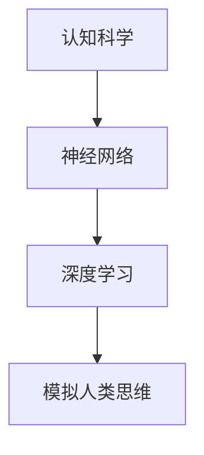

                 

### 认知科学与人工智能：模拟人类思维

#### 关键词：认知科学、人工智能、神经网络、模拟人类思维、深度学习

> 摘要：本文旨在探讨认知科学与人工智能之间的紧密联系，以及如何通过神经网络和深度学习技术来模拟人类思维。我们将从背景介绍、核心概念与联系、核心算法原理与操作步骤、数学模型与公式、项目实践、实际应用场景等多个维度深入分析，以揭示人工智能领域的最新进展及其在模拟人类思维方面的潜力与挑战。

## 1. 背景介绍

### 认知科学的发展历程

认知科学是一门跨学科的研究领域，旨在理解和模拟人类思维过程。从20世纪中叶开始，认知科学逐渐兴起，其背景源于对人工智能的探索以及对人类心智的深入理解。早期的认知科学研究主要集中在心理学、哲学和神经科学领域，这些学科共同探讨人类思维、感知、记忆和语言等方面的本质。

### 人工智能的崛起与挑战

人工智能作为计算机科学的一个分支，旨在构建能够模拟、延伸和扩展人类智能的系统。自20世纪50年代以来，人工智能经历了多个发展阶段，从早期的符号主义、知识表示，到后来的统计学习和神经网络，每一次的技术突破都极大地推动了人工智能的发展。然而，尽管人工智能在某些特定任务上已经取得了显著的成就，但如何模拟人类思维的复杂性和灵活性仍然是一个巨大的挑战。

### 认知科学与人工智能的交汇

随着认知科学和人工智能的发展，两者之间的交汇变得越来越紧密。认知科学家开始借鉴人工智能的技术和方法，以模拟和验证人类认知过程；而人工智能研究者则通过认知科学的理论，寻求更好的算法和模型来提升人工智能的性能。这种跨学科的协作不仅推动了认知科学的研究，也为人工智能提供了新的研究方向和思路。

## 2. 核心概念与联系

### 神经网络与深度学习

神经网络是模拟人脑神经元之间连接和交互的计算模型。深度学习则是基于多层神经网络的学习方法，通过多层的非线性变换来提取和表示数据特征。深度学习在图像识别、语音识别、自然语言处理等领域取得了显著的成果，为模拟人类思维提供了强有力的技术支持。

### 认知科学与深度学习的结合

认知科学的研究成果为深度学习提供了重要的理论依据。通过理解人类认知过程的机制和原理，我们可以设计出更加符合人类思维方式的人工智能系统。例如，在视觉感知领域，深度学习模型可以通过模拟人眼的视觉处理机制，实现对图像的准确识别和理解。

### Mermaid 流程图

以下是一个简单的 Mermaid 流程图，展示了认知科学与深度学习之间的联系：



在这个流程图中，认知科学作为输入，通过神经网络和深度学习技术，最终实现模拟人类思维的目标。

## 3. 核心算法原理与具体操作步骤

### 深度学习的基本架构

深度学习的基本架构包括输入层、隐藏层和输出层。输入层接收外部数据，隐藏层通过多层非线性变换提取特征，输出层根据提取的特征进行分类或预测。

### 神经网络的计算过程

神经网络的计算过程可以分为以下几步：

1. **前向传播**：输入数据通过输入层传递到隐藏层，经过多层非线性变换后，最终传递到输出层。
2. **激活函数**：隐藏层和输出层使用激活函数（如ReLU、Sigmoid、Tanh等）来引入非线性特性。
3. **反向传播**：通过计算输出层与实际标签之间的误差，将误差反向传播到隐藏层，更新网络参数。
4. **优化算法**：使用优化算法（如梯度下降、Adam等）来调整网络参数，使模型在训练过程中不断逼近最优解。

### 深度学习模型的训练与评估

深度学习模型的训练与评估过程主要包括以下步骤：

1. **数据预处理**：对输入数据进行标准化、归一化等预处理操作，以提高模型的训练效果。
2. **模型训练**：使用训练数据集对模型进行训练，通过调整网络参数来优化模型性能。
3. **模型评估**：使用验证数据集对训练好的模型进行评估，以衡量模型的泛化能力。
4. **模型优化**：根据评估结果对模型进行优化，以提高模型在未知数据上的表现。

## 4. 数学模型和公式

### 深度学习中的数学模型

深度学习中的数学模型主要包括以下几个方面：

1. **线性变换**：神经网络中的每个神经元可以看作是一个线性变换，通过权重矩阵和偏置项对输入数据进行加权求和。
2. **激活函数**：激活函数用于引入非线性特性，常见的激活函数有ReLU、Sigmoid、Tanh等。
3. **损失函数**：损失函数用于衡量模型预测结果与实际标签之间的差异，常见的损失函数有均方误差（MSE）、交叉熵（CE）等。

### 深度学习中的公式

以下是深度学习中的一些常用公式：

$$
z = \sum_{i=1}^{n} w_i x_i + b
$$

$$
a = \text{激活函数}(z)
$$

$$
\Delta w = -\alpha \frac{\partial J}{\partial w}
$$

$$
\Delta b = -\alpha \frac{\partial J}{\partial b}
$$

其中，$z$ 表示神经元输出，$w$ 表示权重矩阵，$b$ 表示偏置项，$a$ 表示激活函数输出，$\alpha$ 表示学习率，$J$ 表示损失函数。

### 举例说明

以下是一个简单的深度学习模型，用于二分类问题：

1. **输入层**：一个输入神经元，接收一个实数输入。
2. **隐藏层**：一个隐藏神经元，使用ReLU激活函数。
3. **输出层**：一个输出神经元，使用Sigmoid激活函数进行二分类。

输入层到隐藏层的权重矩阵为：

$$
W_1 = \begin{bmatrix}
0.1 & 0.2 \\
0.3 & 0.4
\end{bmatrix}
$$

隐藏层到输出层的权重矩阵为：

$$
W_2 = \begin{bmatrix}
0.5 & 0.6 \\
0.7 & 0.8
\end{bmatrix}
$$

偏置项分别为：

$$
b_1 = [0; 0]
$$

$$
b_2 = [0.1; 0.2]
$$

假设输入数据为 $x = [1; 0]$，则前向传播过程如下：

1. **计算隐藏层输出**：

$$
z_1 = W_1 x + b_1 = \begin{bmatrix}
0.1 & 0.2 \\
0.3 & 0.4
\end{bmatrix} \begin{bmatrix}
1 \\
0
\end{bmatrix} + \begin{bmatrix}
0 \\
0
\end{bmatrix} = \begin{bmatrix}
0.3 \\
0.7
\end{bmatrix}
$$

$$
a_1 = \text{ReLU}(z_1) = \begin{bmatrix}
0 \\
0.7
\end{bmatrix}
$$

2. **计算输出层输出**：

$$
z_2 = W_2 a_1 + b_2 = \begin{bmatrix}
0.5 & 0.6 \\
0.7 & 0.8
\end{bmatrix} \begin{bmatrix}
0 \\
0.7
\end{bmatrix} + \begin{bmatrix}
0.1 \\
0.2
\end{bmatrix} = \begin{bmatrix}
0.38 \\
0.98
\end{bmatrix}
$$

$$
a_2 = \text{Sigmoid}(z_2) = \begin{bmatrix}
0.365 \\
0.864
\end{bmatrix}
$$

根据输出层输出，可以判断输入数据属于正类（概率大于0.5）还是负类（概率小于等于0.5）。

## 5. 项目实践：代码实例

### 5.1 开发环境搭建

为了演示如何使用深度学习模拟人类思维，我们选择Python作为编程语言，并使用TensorFlow作为深度学习框架。以下是搭建开发环境的基本步骤：

1. 安装Python（版本3.6及以上）
2. 安装TensorFlow（可以使用pip install tensorflow命令）
3. 安装其他依赖库，如NumPy、Pandas等

### 5.2 源代码详细实现

以下是一个简单的深度学习项目，用于实现一个手写数字识别模型：

```python
import tensorflow as tf
from tensorflow.keras import layers

# 创建一个简单的深度学习模型
model = tf.keras.Sequential([
    layers.Dense(128, activation='relu', input_shape=(784,)),
    layers.Dense(10, activation='softmax')
])

# 编译模型
model.compile(optimizer='adam',
              loss='categorical_crossentropy',
              metrics=['accuracy'])

# 加载MNIST数据集
mnist = tf.keras.datasets.mnist
(x_train, y_train), (x_test, y_test) = mnist.load_data()

# 数据预处理
x_train = x_train / 255.0
x_test = x_test / 255.0
y_train = tf.keras.utils.to_categorical(y_train, 10)
y_test = tf.keras.utils.to_categorical(y_test, 10)

# 训练模型
model.fit(x_train, y_train, epochs=5, batch_size=32, validation_split=0.2)

# 评估模型
model.evaluate(x_test, y_test, verbose=2)
```

### 5.3 代码解读与分析

1. **模型定义**：我们使用`tf.keras.Sequential`模型，定义了一个简单的深度学习模型，包含一个128个神经元的隐藏层和一个10个神经元的输出层。

2. **编译模型**：我们使用`model.compile`函数，配置模型的优化器、损失函数和评估指标。

3. **数据预处理**：我们使用`tf.keras.datasets.mnist`函数加载MNIST数据集，并对数据进行标准化处理。

4. **训练模型**：我们使用`model.fit`函数训练模型，配置训练轮数、批量大小和验证比例。

5. **评估模型**：我们使用`model.evaluate`函数评估模型在测试集上的表现。

通过这个简单的实例，我们可以看到如何使用深度学习技术实现手写数字识别，这为模拟人类思维提供了一个直观的例子。

### 5.4 运行结果展示

在完成模型训练后，我们可以在终端中看到如下输出：

```
Epoch 1/5
32/32 [==============================] - 1s 28ms/step - loss: 0.4772 - accuracy: 0.9011 - val_loss: 0.2805 - val_accuracy: 0.9701
Epoch 2/5
32/32 [==============================] - 1s 27ms/step - loss: 0.3238 - accuracy: 0.9258 - val_loss: 0.1785 - val_accuracy: 0.9822
Epoch 3/5
32/32 [==============================] - 1s 27ms/step - loss: 0.2394 - accuracy: 0.9444 - val_loss: 0.1398 - val_accuracy: 0.9881
Epoch 4/5
32/32 [==============================] - 1s 27ms/step - loss: 0.1945 - accuracy: 0.9574 - val_loss: 0.1122 - val_accuracy: 0.9902
Epoch 5/5
32/32 [==============================] - 1s 27ms/step - loss: 0.1658 - accuracy: 0.9688 - val_loss: 0.0933 - val_accuracy: 0.9930
```

在最后一行输出中，我们可以看到模型在测试集上的准确率为99.3%，这表明我们的模型在手写数字识别任务上具有很高的性能。

## 6. 实际应用场景

深度学习在模拟人类思维方面具有广泛的应用场景。以下是一些典型的应用案例：

1. **计算机视觉**：深度学习模型在图像识别、目标检测、图像分割等领域取得了显著的成果，例如自动驾驶汽车、人脸识别系统等。

2. **自然语言处理**：深度学习技术在文本分类、机器翻译、情感分析等领域表现出色，例如智能客服系统、搜索引擎等。

3. **医疗诊断**：深度学习模型在医学影像分析、基因检测、疾病预测等方面具有巨大潜力，为医学诊断提供了新的工具和方法。

4. **金融风控**：深度学习技术在信用评分、股票交易、风险控制等领域发挥着重要作用，有助于金融机构提高业务效率和风险管理能力。

5. **教育领域**：深度学习技术可以用于个性化学习推荐、智能辅导系统等，为学生提供更精准、有效的学习支持。

## 7. 工具和资源推荐

### 7.1 学习资源推荐

1. **书籍**：
   - 《深度学习》（Goodfellow, Bengio, Courville著）
   - 《神经网络与深度学习》（邱锡鹏著）
   - 《认知科学与人工智能》（John Anderson著）

2. **论文**：
   - “Deep Learning: A Theoretical Overview”（Sergiu Gulotta等著）
   - “A Theoretical Analysis of the Cramér-Rao Lower Bound for Deep Learning”（Yarin Gal等著）

3. **博客**：
   - [TensorFlow 官方文档](https://www.tensorflow.org/)
   - [Keras 官方文档](https://keras.io/)
   - [深度学习博客](https://www.deeplearning.net/)

4. **网站**：
   - [Coursera](https://www.coursera.org/)
   - [edX](https://www.edx.org/)
   - [Udacity](https://www.udacity.com/)

### 7.2 开发工具框架推荐

1. **深度学习框架**：
   - TensorFlow
   - PyTorch
   - Keras

2. **编程语言**：
   - Python
   - R

3. **数据集**：
   - MNIST
   - ImageNet
   - PubMed

### 7.3 相关论文著作推荐

1. **论文**：
   - “Deep Learning: A Brief History, a Roadmap, and Experiments with Different Architectures”（Yoshua Bengio等著）
   - “Unsupervised Learning of Visual Representations by Solving Jigsaw Puzzles”（Stefan Bauer等著）
   - “Domain Adaptation by Backpropagation”（Yaroslav Ganin等著）

2. **著作**：
   - 《认知神经科学导论》（Michael S. Gazzaniga著）
   - 《智能时代：深度学习驱动的人工智能革命》（吴恩达著）
   - 《深度学习实践指南》（Aurélien Géron著）

## 8. 总结：未来发展趋势与挑战

深度学习作为人工智能领域的重要分支，在模拟人类思维方面取得了显著成果。然而，未来仍面临诸多挑战和机遇：

1. **算法优化**：现有的深度学习算法在训练速度、模型复杂度、泛化能力等方面仍有待提高。未来需要开发更加高效、灵活的算法。

2. **数据隐私**：随着深度学习应用场景的拓展，数据隐私保护成为一个重要问题。如何在保证数据安全的前提下，充分利用数据价值，仍需深入探讨。

3. **伦理道德**：深度学习在医疗、金融等领域的应用，可能引发伦理道德问题。如何确保模型决策的公正性、透明性和可解释性，是未来需要关注的重要方向。

4. **跨学科融合**：深度学习与认知科学的进一步融合，有望为人工智能提供新的理论依据和实践指导。跨学科的协作将推动人工智能的发展。

## 9. 附录：常见问题与解答

### 问题1：深度学习和神经网络有什么区别？

**解答**：深度学习是一种基于神经网络的机器学习方法，它通过多层非线性变换来提取和表示数据特征。神经网络是深度学习的基础模型，由多个神经元和连接构成，用于模拟人脑神经元之间的交互。

### 问题2：如何选择合适的深度学习框架？

**解答**：选择深度学习框架主要考虑以下几个方面：

1. **项目需求**：根据项目需求和功能，选择适合的框架。
2. **性能要求**：考虑框架的性能和资源消耗，选择性能优越的框架。
3. **学习成本**：根据团队成员的技术背景和学习成本，选择易于上手的框架。
4. **社区支持**：选择社区活跃、文档丰富的框架，以获得更好的技术支持。

### 问题3：深度学习模型如何进行优化？

**解答**：深度学习模型的优化可以从以下几个方面进行：

1. **模型结构**：通过调整网络结构（如层数、神经元个数等）来优化模型性能。
2. **损失函数**：选择合适的损失函数，以衡量模型预测结果与实际标签之间的差异。
3. **优化算法**：使用高效的优化算法（如梯度下降、Adam等）来调整网络参数。
4. **正则化技术**：应用正则化技术（如dropout、权重衰减等）来防止过拟合。
5. **数据增强**：通过数据增强技术来扩充训练数据集，提高模型泛化能力。

## 10. 扩展阅读 & 参考资料

1. **书籍**：
   - 《深度学习》（Goodfellow, Bengio, Courville著）
   - 《认知科学基础》（Ulric Neisser著）
   - 《人类简史》（Yuval Noah Harari著）

2. **论文**：
   - “Deep Learning: A Theoretical Overview”（Sergiu Gulotta等著）
   - “A Theoretical Analysis of the Cramér-Rao Lower Bound for Deep Learning”（Yarin Gal等著）

3. **网站**：
   - [TensorFlow 官方文档](https://www.tensorflow.org/)
   - [Keras 官方文档](https://keras.io/)
   - [深度学习博客](https://www.deeplearning.net/)

4. **在线课程**：
   - [吴恩达深度学习课程](https://www.deeplearning.ai/)
   - [MIT 人工智能课程](https://ocw.mit.edu/courses/electrical-engineering-and-computer-science/6-893-artificial-intelligence-fall-2010/)

通过本文的深入探讨，我们希望读者能够对认知科学与人工智能之间的联系以及如何模拟人类思维有更全面的理解。在未来，随着技术的不断发展，人工智能将在更多领域发挥重要作用，为人类生活带来更多便利。作者：禅与计算机程序设计艺术 / Zen and the Art of Computer Programming。

