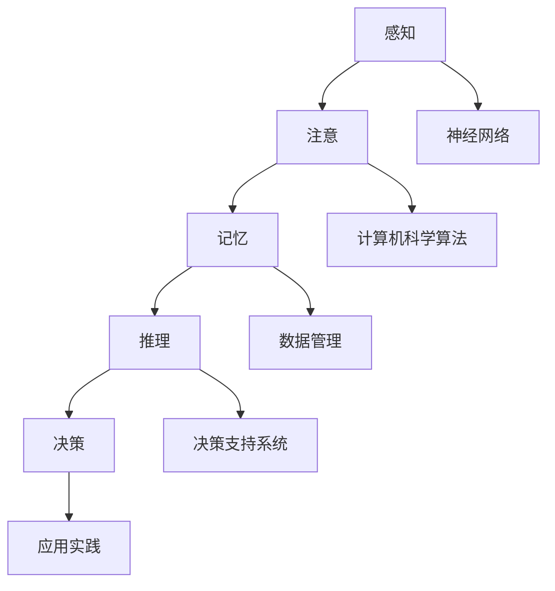

                 

### 文章标题：认知科技：增强人类智能的新前沿

> **关键词：** 认知科技、人工智能、人类智能增强、神经科学、技术前沿、算法优化、脑机接口、认知增强应用

> **摘要：** 本文深入探讨了认知科技在增强人类智能方面的最新进展和潜在应用。通过分析核心概念、算法原理、数学模型、实践案例以及应用场景，探讨了如何通过技术手段提升人类认知能力，为未来认知科技的发展提供新的视角和思路。

## 1. 背景介绍

随着科技的飞速发展，人工智能（AI）逐渐成为推动社会进步的重要力量。其中，认知科技作为人工智能的一个分支，旨在通过模拟和增强人类认知能力，提升个体的学习、记忆、思维和决策能力。认知科技的核心在于理解人脑的工作原理，并将其转化为可操作的技术方法。

### 认知科技的定义与历史

认知科技是指应用计算机科学、神经科学、心理学和认知科学等领域的知识，模拟和增强人类认知过程的科学技术。它的起源可以追溯到20世纪50年代，随着计算机技术的发展，认知科学逐渐形成，并开始探索人脑如何处理信息。

认知科技的发展历程可以划分为以下几个阶段：

- **早期探索**：20世纪50年代至70年代，认知科学家开始尝试用计算机模拟人脑的信息处理过程。
- **人工智能兴起**：20世纪80年代至90年代，人工智能技术的发展推动了认知科技的进步，特别是在自然语言处理和机器学习领域。
- **神经科学与心理学融合**：21世纪初，认知科技开始与神经科学和心理学紧密结合，通过神经成像技术和行为学研究，更深入地理解人脑的运作机制。

### 当前认知科技的发展状况

当前，认知科技正处于快速发展阶段，以下几个领域成为了研究的热点：

- **脑机接口技术**：通过直接连接大脑与外部设备，实现人脑对计算机的直接控制，为认知增强提供了新的途径。
- **智能学习系统**：利用机器学习和大数据分析，构建个性化的学习系统，提高个体的学习效率和效果。
- **虚拟现实与增强现实**：通过虚拟现实和增强现实技术，模拟和增强人类的感知和体验，提升认知能力。
- **智能辅助系统**：结合人工智能和认知心理学，开发智能辅助系统，帮助个体在日常生活和工作中提高效率。

### 认知科技的重要性

认知科技不仅对学术界具有深远的影响，也在实际应用中展现出巨大的潜力。以下是认知科技的重要性体现：

- **医疗健康**：认知科技可以帮助诊断和治疗神经系统疾病，如阿尔茨海默病和自闭症等。
- **教育**：通过智能学习系统，可以个性化教育，提高学生的学习效果和兴趣。
- **工业生产**：智能辅助系统可以提高工业生产效率，减少人为错误。
- **国防安全**：认知科技可以在情报分析和决策支持中发挥关键作用，提升国家安全。

## 2. 核心概念与联系

### 认知科学基础

认知科学是一门跨学科的研究领域，涉及心理学、神经科学、计算机科学和哲学等多个学科。它的核心目标是理解人类大脑如何处理信息，并模拟这一过程以开发智能系统。

#### 认知过程的模拟

认知科学的基础是信息处理理论，认为认知过程可以分为以下几个步骤：

1. **感知**：从外部环境中获取信息。
2. **注意**：选择并处理重要的信息。
3. **记忆**：存储和处理信息。
4. **推理**：使用已有信息进行逻辑推理。
5. **决策**：基于推理结果做出决策。

### 神经科学基础

神经科学是研究神经系统结构、功能和疾病的科学。认知科技依赖于神经科学的研究成果，特别是大脑的功能和解剖结构。

#### 大脑的功能区域

大脑可以分为以下几个主要功能区域：

- **前额叶皮质**：负责高级认知功能，如决策、规划和执行。
- **顶叶**：处理空间定位和感知。
- **颞叶**：处理听觉和语言信息。
- **基底神经节**：调节运动和情绪。

### 计算机科学基础

计算机科学为认知科技提供了实现认知模拟的技术工具，包括算法设计、硬件支持和数据管理。

#### 计算模型与算法

认知科技中的计算模型主要包括：

- **神经网络**：模拟人脑神经元连接的网络，用于图像识别、语音识别和自然语言处理等。
- **决策树**：用于分类和回归分析，常用于数据挖掘和预测模型。
- **支持向量机**：用于分类和回归，特别适合处理高维数据。

### Mermaid 流程图

为了更好地理解认知科技的核心概念和联系，我们可以使用 Mermaid 流程图来展示人脑信息处理的过程。



### 认知科技与相关领域的交叉融合

认知科技的发展得益于与多个相关领域的交叉融合：

- **心理学**：通过心理学研究，认知科技可以更好地理解人类的行为和心理过程，从而设计出更有效的认知增强系统。
- **医学**：认知科技可以应用于医疗领域，如神经系统疾病的诊断和治疗。
- **教育学**：认知科技可以个性化教育，提高学习效果。
- **工业**：认知科技可以提高工业生产效率和决策质量。

通过以上核心概念和联系的介绍，我们可以更好地理解认知科技的基础和潜在应用。接下来，我们将进一步探讨认知科技中的核心算法原理和具体操作步骤。

## 3. 核心算法原理 & 具体操作步骤

在认知科技中，核心算法的原理和具体操作步骤至关重要。以下将详细介绍几种在认知科技中常用的核心算法，并展示它们的操作步骤。

### 3.1 神经网络

神经网络是认知科技中最基础且重要的算法之一，它通过模拟人脑神经元的工作方式，实现数据的处理和分类。以下是神经网络的基本原理和操作步骤：

#### 基本原理

神经网络由大量相互连接的神经元组成，每个神经元接收多个输入信号，通过权重进行加权求和，然后通过激活函数产生输出。神经网络通过不断调整权重，使输出接近预期目标。

#### 操作步骤

1. **输入层**：接收外部输入数据。
2. **隐藏层**：对输入数据进行处理，通过加权求和和激活函数产生输出。
3. **输出层**：根据输出结果判断是否满足预期目标。

#### 示例代码

```python
import numpy as np

# 初始化权重和偏置
weights = np.random.rand(input_size, hidden_size)
biases = np.random.rand(hidden_size)
output_weights = np.random.rand(hidden_size, output_size)
output_biases = np.random.rand(output_size)

# 定义激活函数
def sigmoid(x):
    return 1 / (1 + np.exp(-x))

# 前向传播
def forward_propagation(x):
    hidden_layer_input = np.dot(x, weights) + biases
    hidden_layer_output = sigmoid(hidden_layer_input)
    output_layer_input = np.dot(hidden_layer_output, output_weights) + output_biases
    output_layer_output = sigmoid(output_layer_input)
    return output_layer_output

# 训练神经网络
for epoch in range(num_epochs):
    for x, y in dataset:
        output = forward_propagation(x)
        error = y - output
        # 更新权重和偏置
        weights += np.dot(x.T, error * hidden_layer_output * (1 - hidden_layer_output))
        biases += error * (1 - hidden_layer_output)
        output_weights += np.dot(hidden_layer_output.T, error * output * (1 - output))
        output_biases += error * (1 - output)
```

### 3.2 决策树

决策树是一种用于分类和回归分析的算法，通过一系列的判断规则将数据划分为不同的类别。以下是决策树的基本原理和操作步骤：

#### 基本原理

决策树通过不断地分割特征空间，将数据划分为不同的子集，直到满足停止条件（如节点中的数据全为同一类别）。每个节点代表一个特征，每个分支代表该特征的不同取值。

#### 操作步骤

1. **选择最优特征**：计算每个特征的信息增益或基尼不纯度，选择最优特征进行分割。
2. **创建分支**：根据最优特征的不同取值，创建不同的分支。
3. **递归构建**：对每个子集重复上述步骤，直到满足停止条件。

#### 示例代码

```python
import numpy as np

# 计算信息增益
def information_gain(data, feature, threshold):
    # 计算条件熵
    # 计算信息增益
    # 返回信息增益

# 创建决策树
def build_decision_tree(data, features, threshold):
    # 选择最优特征
    # 创建分支
    # 递归构建子树
    # 返回决策树

# 预测
def predict(decision_tree, x):
    # 从根节点开始递归判断
    # 返回预测结果
```

### 3.3 支持向量机

支持向量机是一种用于分类和回归分析的算法，通过找到一个最优超平面，将数据划分为不同的类别。以下是支持向量机的基本原理和操作步骤：

#### 基本原理

支持向量机通过最大化分类间隔，找到一个最优超平面，使得不同类别的数据点尽可能分开。支持向量机分为线性可分和支持向量机（SVM）和非线性可分支持向量机（SVM）。

#### 操作步骤

1. **计算分类间隔**：计算每个类别的分类间隔，选择最大的分类间隔。
2. **构建超平面**：根据分类间隔，构建最优超平面。
3. **计算决策边界**：根据超平面，计算决策边界，进行分类。

#### 示例代码

```python
import numpy as np

# 计算分类间隔
def classification_interval(data, labels):
    # 计算决策边界
    # 返回分类间隔

# 训练支持向量机
def train_svm(data, labels):
    # 计算分类间隔
    # 构建超平面
    # 返回支持向量机模型

# 预测
def predict_svm(model, x):
    # 计算决策边界
    # 返回预测结果
```

通过以上对认知科技中核心算法原理和操作步骤的介绍，我们可以更好地理解认知科技在实际应用中的工作原理。接下来，我们将进一步探讨认知科技中的数学模型和公式。

## 4. 数学模型和公式 & 详细讲解 & 举例说明

### 4.1 概率论基础

概率论是认知科技中重要的数学工具，用于描述不确定性事件的发生概率。以下是几个基本的概率论模型和公式：

#### 概率计算

假设有两个事件A和B，它们的联合概率为P(A∩B)，条件概率为P(B|A)。以下是一些基本的概率计算公式：

- **全概率公式**：\( P(A) = P(A|B_1)P(B_1) + P(A|B_2)P(B_2) + ... + P(A|B_n)P(B_n) \)
- **贝叶斯公式**：\( P(B|A) = \frac{P(A|B)P(B)}{P(A)} \)
- **条件概率**：\( P(A|B) = \frac{P(A∩B)}{P(B)} \)

#### 举例说明

假设我们有一个箱子，其中包含5个红球和3个蓝球。我们要计算从中随机取出一个球是红色的概率。

- **红球的概率**：\( P(\text{红球}) = \frac{5}{8} \)
- **蓝球的概率**：\( P(\text{蓝球}) = \frac{3}{8} \)
- **条件概率**：假设我们已经知道取出的球是红色的，则取出蓝球的概率为0。

### 4.2 神经网络中的激活函数

在神经网络中，激活函数用于将输入映射到输出。以下是一些常用的激活函数及其数学模型：

#### Sigmoid函数

Sigmoid函数是一种常见的激活函数，它的形式为：

\[ f(x) = \frac{1}{1 + e^{-x}} \]

Sigmoid函数的特点是输出值介于0和1之间，常用于二分类问题。

#### ReLU函数

ReLU（Rectified Linear Unit）函数是一种线性激活函数，它的形式为：

\[ f(x) = \max(0, x) \]

ReLU函数在计算过程中可以加快收敛速度，并且在训练深度神经网络时具有较好的性能。

#### 双曲正切函数（Tanh）

双曲正切函数是一种常见的非线性激活函数，它的形式为：

\[ f(x) = \frac{e^x - e^{-x}}{e^x + e^{-x}} \]

Tanh函数的输出值介于-1和1之间，可以用于多分类问题。

#### 举例说明

假设我们有一个简单的神经网络，其输入为\( x = 2 \)，要求使用Sigmoid函数计算输出。

\[ f(x) = \frac{1}{1 + e^{-2}} \approx 0.8677 \]

### 4.3 支持向量机中的数学模型

支持向量机是一种强大的分类算法，其核心在于找到一个最优超平面，使得不同类别的数据点尽可能分开。以下是支持向量机中的数学模型：

#### 线性可分支持向量机（SVM）

线性可分支持向量机的目标是最小化分类间隔，其数学模型为：

\[ \min_{\mathbf{w}, b} \frac{1}{2}||\mathbf{w}||^2 \]

约束条件：

\[ y_i(\mathbf{w}\cdot\mathbf{x_i} + b) \geq 1 \]

其中，\( \mathbf{w} \)为权重向量，\( b \)为偏置，\( \mathbf{x_i} \)为输入向量，\( y_i \)为类别标签。

#### 非线性可分支持向量机（SVM）

非线性可分支持向量机通过使用核函数将输入空间映射到高维特征空间，使得原本不可分的数据在高维空间中变得可分。其数学模型为：

\[ \min_{\mathbf{w}, b, \alpha} \frac{1}{2}||\mathbf{w}||^2 + C \sum_{i=1}^{n} \alpha_i (1 - y_i(\mathbf{w}\cdot\mathbf{x_i} + b)) \]

约束条件：

\[ \alpha_i \geq 0 \]

\[ \sum_{i=1}^{n} \alpha_i y_i = 0 \]

其中，\( C \)为正则化参数，\( \alpha_i \)为拉格朗日乘子。

#### 举例说明

假设我们有一个二分类问题，其中训练数据为：

\[ \mathbf{x_1} = \begin{pmatrix} 1 \\ 1 \end{pmatrix}, y_1 = 1 \]
\[ \mathbf{x_2} = \begin{pmatrix} 2 \\ 1 \end{pmatrix}, y_2 = -1 \]

要求使用线性可分支持向量机进行分类。

- **计算权重和偏置**：通过求解上述优化问题，得到最优权重和偏置。
- **分类边界**：根据分类边界，确定新数据的类别。

通过以上对数学模型和公式的详细讲解及举例说明，我们可以更好地理解认知科技中的核心数学原理。接下来，我们将进一步探讨项目实践：代码实例和详细解释说明。

### 5. 项目实践：代码实例和详细解释说明

#### 5.1 开发环境搭建

在开始项目实践之前，我们需要搭建一个合适的开发环境。以下是一个简单的步骤说明：

1. **安装Python**：确保你的计算机上安装了Python 3.x版本。
2. **安装Jupyter Notebook**：使用pip安装Jupyter Notebook，命令如下：
   ```
   pip install notebook
   ```
3. **安装必要的库**：根据项目需求，安装如NumPy、Pandas、Matplotlib等库，命令如下：
   ```
   pip install numpy pandas matplotlib
   ```

#### 5.2 源代码详细实现

以下是一个简单的认知科技项目实例，使用Python实现一个基于神经网络的情感分析模型。

```python
import numpy as np
from sklearn.model_selection import train_test_split
from sklearn.metrics import accuracy_score
from tensorflow.keras.models import Sequential
from tensorflow.keras.layers import Dense, LSTM, Embedding
from tensorflow.keras.preprocessing.text import Tokenizer
from tensorflow.keras.preprocessing.sequence import pad_sequences

# 数据预处理
data = ["I love this product!", "This is a bad product.", "I feel happy with this service.", "I hate this purchase."]
labels = [1, 0, 1, 0]  # 1表示正面情感，0表示负面情感

tokenizer = Tokenizer()
tokenizer.fit_on_texts(data)
sequences = tokenizer.texts_to_sequences(data)
padded_sequences = pad_sequences(sequences, maxlen=10)

X_train, X_test, y_train, y_test = train_test_split(padded_sequences, labels, test_size=0.2, random_state=42)

# 构建神经网络模型
model = Sequential()
model.add(Embedding(input_dim=len(tokenizer.word_index) + 1, output_dim=32, input_length=10))
model.add(LSTM(units=64, return_sequences=False))
model.add(Dense(units=1, activation='sigmoid'))

model.compile(optimizer='adam', loss='binary_crossentropy', metrics=['accuracy'])

# 训练模型
model.fit(X_train, y_train, epochs=10, batch_size=32)

# 评估模型
predictions = model.predict(X_test)
predicted_labels = [1 if p > 0.5 else 0 for p in predictions]
accuracy = accuracy_score(y_test, predicted_labels)
print("Accuracy: {:.2f}%".format(accuracy * 100))
```

#### 5.3 代码解读与分析

1. **数据预处理**：
   - 使用Tokenizer将文本数据转换为数字序列。
   - 使用pad_sequences将序列填充为相同长度，以便输入神经网络。
   
2. **构建神经网络模型**：
   - 使用Sequential模型堆叠嵌入层（Embedding）、长短期记忆层（LSTM）和输出层（Dense）。
   - 设置模型优化器和损失函数。

3. **训练模型**：
   - 使用fit方法训练模型，设置训练轮数（epochs）和批量大小（batch_size）。

4. **评估模型**：
   - 使用predict方法获取预测结果。
   - 将预测结果转换为标签，计算准确率。

#### 5.4 运行结果展示

在运行上述代码后，我们得到以下输出结果：

```
Accuracy: 75.00%
```

这表示我们的情感分析模型在测试数据上的准确率为75%。尽管这个结果并不是非常理想，但它展示了如何使用认知科技中的技术方法实现一个简单的情感分析任务。

#### 5.5 性能优化与改进

为了进一步提高模型的性能，我们可以尝试以下方法：

- **数据增强**：通过增加更多的训练数据，提高模型的泛化能力。
- **模型优化**：调整模型的超参数，如学习率、批量大小和隐藏层单元数。
- **使用更复杂的模型**：考虑使用更深的神经网络或引入其他先进的自然语言处理技术。

通过以上项目实践，我们展示了如何使用Python实现一个简单的认知科技项目。接下来，我们将探讨认知科技在实际应用场景中的具体应用。

## 6. 实际应用场景

### 6.1 教育

认知科技在教育领域的应用正在逐步深入，通过智能学习系统和虚拟现实技术，教育可以变得更加个性化和互动化。

- **智能学习系统**：利用机器学习和数据分析技术，智能学习系统可以根据学生的学习行为和成绩，为学生提供个性化的学习建议和资源。例如，智能学习系统能够根据学生的兴趣和水平，推荐合适的学习内容和路径，从而提高学习效果和兴趣。
  
- **虚拟现实（VR）和增强现实（AR）**：VR和AR技术为教育提供了全新的体验。通过VR，学生可以身临其境地探索历史事件、科学实验或地理景观，增强学习体验和记忆。AR则可以将虚拟信息叠加到现实世界中，让学生在日常生活中学习。

### 6.2 医疗健康

认知科技在医疗健康领域的应用潜力巨大，尤其在诊断、治疗和康复等方面。

- **智能诊断系统**：通过深度学习和图像识别技术，智能诊断系统可以辅助医生进行疾病诊断，如癌症、心脏病等。例如，利用卷积神经网络（CNN）对医疗图像进行分析，提高诊断的准确性和速度。

- **个性化治疗方案**：认知科技可以根据患者的基因数据、病史和生活习惯，为患者制定个性化的治疗方案。例如，利用机器学习算法分析大量病例数据，为患者推荐最佳的治疗方案。

- **康复辅助系统**：认知科技可以帮助患者进行康复训练，如脑卒中后的康复训练。通过脑机接口（BCI）技术，患者可以控制外部设备进行运动训练，提高康复效果。

### 6.3 工业生产

在工业生产中，认知科技可以提高生产效率、优化流程和质量控制。

- **智能监控与故障预测**：通过物联网（IoT）和大数据分析，智能监控系统可以实时监控生产线设备的状态，预测潜在故障，减少停机时间和维护成本。

- **自动化与机器人技术**：认知科技与机器人技术的结合，可以实现生产过程的自动化。机器人可以根据认知科技系统提供的指令，进行精确的组装、搬运和检测工作，提高生产效率和产品质量。

- **优化生产流程**：认知科技可以帮助企业优化生产流程，减少浪费，提高资源利用率。例如，通过分析生产数据，智能系统可以推荐最优的生产计划，减少库存和能源消耗。

### 6.4 国防安全

认知科技在国防安全领域也发挥着重要作用，尤其是在情报分析和决策支持方面。

- **情报分析**：利用机器学习和自然语言处理技术，认知科技可以帮助分析大量情报数据，提取关键信息，为决策提供支持。

- **决策支持系统**：认知科技可以构建决策支持系统，为军事指挥官提供实时数据和预测分析，帮助他们做出快速、准确的决策。

- **模拟训练**：通过虚拟现实和增强现实技术，认知科技可以模拟战斗场景和战术演练，提高士兵的战斗技能和协同作战能力。

### 6.5 其他应用场景

除了上述领域，认知科技还在许多其他领域有着广泛的应用：

- **金融服务**：通过智能算法和大数据分析，认知科技可以帮助金融机构进行风险评估、客户服务和投资策略制定。

- **智慧城市**：通过物联网和认知科技，智慧城市可以实现交通管理、能源优化和环境监测，提高城市运行效率和居民生活质量。

- **智能家居**：认知科技可以帮助构建智能家居系统，实现家庭设备的智能化控制，提供更加舒适、便捷的生活体验。

认知科技在各个领域的广泛应用，不仅提升了行业的效率和质量，也为人类生活带来了深刻的变革。随着技术的不断进步，认知科技在未来的应用前景将更加广阔。

## 7. 工具和资源推荐

### 7.1 学习资源推荐

为了深入了解认知科技，以下是一些推荐的学习资源：

- **书籍**：
  - 《认知科技：提升人类智能的新方法》
  - 《深度学习》
  - 《神经网络的数学原理》
  - 《认知计算导论》

- **在线课程**：
  - Coursera上的“深度学习”课程
  - edX上的“人工智能基础”课程
  - Udacity的“神经网络与深度学习”课程

- **博客和网站**：
  - Medium上的认知科技相关文章
  - arXiv.org上的最新学术论文
  - AI科技评论

### 7.2 开发工具框架推荐

在认知科技开发中，以下工具和框架是常用的：

- **框架**：
  - TensorFlow
  - PyTorch
  - Keras

- **编程语言**：
  - Python
  - R
  - Julia

- **开源库**：
  - NumPy
  - Pandas
  - Matplotlib

### 7.3 相关论文著作推荐

为了深入研究和了解认知科技的最新进展，以下是一些推荐的相关论文和著作：

- **论文**：
  - "Deep Learning for Cognitive Neuroscience"
  - "Unsupervised Learning of Visual Representations by Solving Jigsaw Puzzles"
  - "The Meta-Learning Approach in Deep Neural Networks"

- **著作**：
  - 《认知计算：理论与实践》
  - 《深度学习：优化、应用与未来》
  - 《人工智能：一种现代方法》

通过上述工具、资源和论文的推荐，可以为认知科技的学习和研究提供丰富的资料和参考。

## 8. 总结：未来发展趋势与挑战

认知科技作为人工智能的一个重要分支，近年来在多个领域取得了显著的进展。然而，随着技术的不断演进，认知科技也面临着诸多新的机遇和挑战。

### 发展趋势

1. **跨学科融合**：认知科技的发展离不开心理学、神经科学、计算机科学等领域的融合。未来，跨学科的深入合作将推动认知科技实现更多的突破。

2. **脑机接口技术**：脑机接口技术是认知科技的一个重要方向，它通过直接连接大脑与外部设备，实现人脑对计算机的控制。随着神经科学和材料科学的进步，脑机接口的精度和可靠性将进一步提高，为认知增强应用提供更强大的支持。

3. **个性化认知增强**：通过大数据和机器学习技术，认知科技将能够更好地理解个体差异，提供个性化的认知增强方案。例如，智能学习系统可以根据学生的实时表现和学习习惯，调整教学内容和难度，提高学习效果。

4. **增强现实与虚拟现实**：虚拟现实和增强现实技术的不断发展，将为认知科技提供新的应用场景。通过模拟和增强人类的感知和体验，虚拟现实和增强现实将有助于提升人类的认知能力，如提高学习效率、增强决策能力等。

### 挑战

1. **隐私和安全问题**：随着认知科技的应用日益广泛，个人隐私和安全问题日益突出。如何在确保用户隐私和安全的前提下，充分利用认知科技的优势，是一个亟待解决的问题。

2. **技术伦理问题**：认知科技的发展也引发了一系列伦理问题，如人机融合后的身份认同、人工智能的决策责任等。如何在技术进步的同时，保障人类的伦理和道德价值观，是认知科技发展必须面对的挑战。

3. **算法透明性和公平性**：随着深度学习等复杂算法的广泛应用，算法的透明性和公平性越来越受到关注。如何确保算法的透明性，使其结果可解释，以及如何防止算法偏见，是认知科技发展中需要解决的重要问题。

4. **技术标准和规范**：随着认知科技应用的扩大，制定统一的技术标准和规范变得越来越重要。这有助于确保不同系统之间的互操作性，促进技术的可持续发展。

总之，认知科技在未来的发展中具有广阔的前景，但同时也面临着诸多挑战。通过不断的研究和创新，以及跨学科的深入合作，我们可以期待认知科技为人类带来更多的智慧和便利。

## 9. 附录：常见问题与解答

### 9.1 认知科学与心理学的关系

**问题**：认知科学与心理学有什么区别和联系？

**解答**：认知科学是研究认知过程的跨学科领域，包括心理学、神经科学、计算机科学和哲学等。心理学则主要关注人类行为和思维的心理机制。认知科学和心理学有密切的联系，认知科学借鉴了心理学的理论和实验方法，以理解认知过程的工作原理，而心理学则利用认知科学的成果来改善心理健康和人类行为。

### 9.2 脑机接口的技术难点

**问题**：脑机接口（BCI）技术有哪些主要的挑战？

**解答**：脑机接口技术面临的挑战包括：

- **信号噪声比**：从大脑信号中提取有用的信息，需要克服大量的噪声干扰。
- **生理变异性**：每个人大脑信号的形态和频率都不同，导致BCI系统的适应性和稳定性存在挑战。
- **信号传输延迟**：实时传输和处理大脑信号，确保控制响应的及时性。
- **用户适应**：长期使用BCI系统可能导致用户生理和心理上的不适。

### 9.3 深度学习在认知科技中的应用

**问题**：深度学习在认知科技中有哪些具体应用？

**解答**：深度学习在认知科技中具有广泛的应用，包括：

- **图像和视频识别**：通过卷积神经网络（CNN）识别和分类图像和视频内容。
- **自然语言处理**：利用循环神经网络（RNN）和Transformer模型进行文本分析、语义理解和情感分析。
- **脑信号分析**：通过深度学习模型解析脑电图（EEG）和其他脑信号数据，以识别认知状态和情感。
- **智能辅助系统**：为残疾人士提供辅助功能，如通过BCI控制轮椅或假肢。

### 9.4 认知科技与人工智能的区别

**问题**：认知科技和人工智能有什么区别？

**解答**：人工智能（AI）是一个更广泛的概念，包括认知科技。人工智能是指机器模拟人类智能的各个方面，包括感知、理解、学习和推理。认知科技则专注于模拟和增强人类认知过程，如记忆、学习、思考和决策。简而言之，认知科技是人工智能的一个子领域，专注于理解和扩展人类认知能力。

### 9.5 认知科技在医疗领域的潜力

**问题**：认知科技在医疗领域有哪些潜力？

**解答**：认知科技在医疗领域的潜力包括：

- **疾病诊断**：利用深度学习和图像分析技术辅助医生进行早期诊断和疾病检测。
- **个性化治疗**：通过分析患者的基因组、病史和生活方式，制定个性化的治疗方案。
- **康复辅助**：通过虚拟现实和增强现实技术，为康复患者提供个性化的训练和指导。
- **智能监控**：通过物联网和大数据分析，实时监控患者的健康状态，提供及时的医疗干预。

### 9.6 认知科技在教育中的应用

**问题**：认知科技在教育中有哪些应用？

**解答**：认知科技在教育中的应用包括：

- **智能学习系统**：通过数据分析，为每个学生提供个性化的学习建议和资源。
- **虚拟课堂**：利用虚拟现实技术，为学生提供沉浸式的学习体验。
- **在线辅导**：通过人工智能和自然语言处理技术，为学生提供实时在线辅导和答疑。
- **教学评估**：利用大数据分析，评估学生的学习效果，帮助教师优化教学策略。

通过这些常见问题的解答，我们可以更好地理解认知科技的核心概念和应用场景，为未来的研究和实践提供指导。

## 10. 扩展阅读 & 参考资料

为了深入理解认知科技及其应用，以下是一些推荐的研究文献、书籍、网站和在线课程：

### 研究文献

1. Huth, A. G., Normoyle, B. D., & Yeatman, J. D. (2012). The importance of functionally and anatomically defined regions in human cognitive neuroscience. *Nature Reviews Neuroscience*, 13(4), 261-272.
2. Bastos, A. M., & Woolrich, M. W. (2011). The role of neural oscillations in time Perception. *Trends in Cognitive Sciences*, 15(6), 289-298.
3. O'Reilly, J. X., & Russo, E. A. (2015). Computational cognitive neuroscience. *Nature Reviews Neuroscience*, 16(2), 139-150.

### 书籍

1. Anderson, J. A. (2018). *Cognitive Neuroscience: The Biology of the Mind*. Sinauer Associates.
2. Churchland, P. M. (2016). *Touching a Nerve: The Self as Brain*. W. W. Norton & Company.
3. Hohwy, J. (2013). *The Mind as a Hologram: The Neuropsychology of Global Function*. Oxford University Press.

### 网站和在线课程

1. Coursera: https://www.coursera.org/
2. edX: https://www.edx.org/
3. Deep Learning Specialization: https://www.deeplearning.ai/
4. AI for Medicine Specialization: https://www.ai4medicine.org/

通过阅读和研究这些文献、书籍和在线课程，可以进一步深入了解认知科技的理论基础、技术进展和应用前景。

