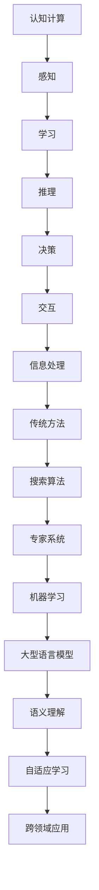

                 

### 认知计算新纪元：LLM改变信息处理模式

#### 关键词 Keywords：
- 认知计算
- 大型语言模型（LLM）
- 信息处理模式
- 人工智能
- 自然语言处理

#### 摘要 Abstract：
本文将探讨认知计算的新纪元，特别关注大型语言模型（LLM）如何改变传统信息处理模式。通过对LLM的核心概念、算法原理、数学模型及实际应用场景的深入分析，本文旨在揭示LLM在推动信息处理技术发展的同时，面临的挑战和未来趋势。

---

## 1. 背景介绍

随着互联网和大数据的快速发展，信息爆炸式增长已成为不争的事实。人类逐渐无法完全依赖自己的认知能力来处理海量信息。因此，如何高效地处理、理解和利用这些信息成为亟待解决的问题。传统的信息处理模式主要依赖于搜索算法和基于规则的专家系统，但它们在处理自然语言、理解复杂问题和实时响应方面存在诸多局限。

近年来，人工智能（AI）领域的突破性进展，尤其是深度学习和自然语言处理（NLP）技术的飞速发展，为认知计算带来了新的可能性。大型语言模型（LLM）作为NLP的重要工具，正逐渐成为信息处理领域的新宠。LLM具有强大的语义理解、文本生成和推理能力，可以处理复杂、多样化的信息，为各种应用场景提供了全新的解决方案。

## 2. 核心概念与联系

### 2.1. 认知计算（Cognitive Computing）

认知计算是一种模仿人类思维过程的计算范式，旨在使计算机具备理解、学习、推理和适应环境的能力。认知计算的核心概念包括：

- **感知**：通过传感器获取外部信息。
- **学习**：利用数据和算法从经验中学习。
- **推理**：基于已有知识和信息进行逻辑推理。
- **决策**：根据推理结果做出决策。
- **交互**：与人类或其他系统进行有效互动。

### 2.2. 大型语言模型（LLM）

大型语言模型（LLM）是一种基于深度学习的语言处理模型，具有以下几个关键特性：

- **大规模训练数据**：LLM通常在庞大的语料库上进行训练，以便捕捉语言的各种模式和规律。
- **神经网络架构**：LLM采用多层神经网络架构，如Transformer，使其能够高效地处理和理解自然语言。
- **上下文理解**：LLM具有强大的上下文理解能力，能够捕捉句子间的语义关系。
- **文本生成与推理**：LLM可以生成连贯的文本，并进行逻辑推理。

### 2.3. 信息处理模式

传统信息处理模式主要依赖于以下技术：

- **搜索算法**：通过关键词匹配和排序来检索信息。
- **专家系统**：基于预定义的规则和知识库来解决问题。
- **机器学习**：通过数据训练模型来预测和分类。

相比之下，LLM在信息处理中引入了新的模式：

- **语义理解**：LLM能够理解自然语言中的语义信息，而不仅仅是表面文字。
- **自适应学习**：LLM可以在使用过程中不断学习和优化，以适应特定的任务。
- **跨领域应用**：LLM具有广泛的通用性，可以在多个领域和任务中应用。

### 2.4. Mermaid 流程图

以下是认知计算与LLM之间关系的Mermaid流程图：

---

在接下来的章节中，我们将深入探讨LLM的核心算法原理、数学模型及其在项目实践中的应用，进一步揭示这一技术如何改变信息处理模式，为人工智能的发展带来新的机遇和挑战。

