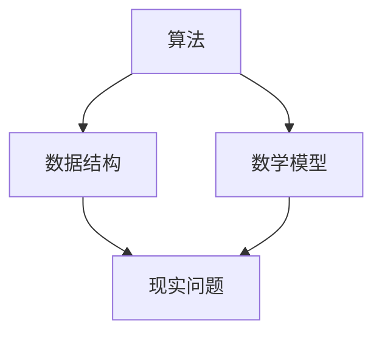

                 

关键词：认知过程、算法原理、数学模型、编程实践、应用场景、未来发展

## 摘要

本文旨在探讨认知过程中的简单与深刻化，特别是在IT领域的应用。我们将从背景介绍出发，深入分析核心概念及其联系，探讨核心算法的原理与操作步骤，详细讲解数学模型与公式，并通过实际项目实践来展示代码实例。此外，文章还将探讨算法的实际应用场景，并对未来发展的趋势和挑战进行展望。最后，我们将推荐相关学习资源、开发工具和论文，并总结研究成果，提出研究展望。

## 1. 背景介绍

认知过程是人类思考、学习和理解信息的过程。在IT领域，认知过程体现在算法的设计与实现中。算法是计算机解决问题的方法，其设计过程中需要充分考虑简单性与深刻性。简单性意味着算法应该易于理解和实现，而深刻性则要求算法能够有效地解决问题。然而，简单与深刻并非相互排斥，而是可以相互促进。本文将探讨如何通过认知过程中的简单与深刻化来提高算法的设计质量和解决问题的能力。

## 2. 核心概念与联系

### 2.1 核心概念

在认知过程中，我们主要关注以下几个核心概念：

- **算法**：解决问题的方法。
- **数据结构**：存储和组织数据的方式。
- **数学模型**：用于描述现实问题的数学结构。

这些概念相互关联，共同构成了认知过程中的基础。算法需要依赖于合适的数据结构来高效地操作数据，而数学模型则为算法提供了理论基础。

### 2.2 关系图解

为了更好地理解这些概念之间的联系，我们可以使用Mermaid流程图来展示它们之间的关系。



在这个图中，算法位于中心位置，它与数据结构和数学模型密切相关。数据结构为算法提供了操作数据的手段，而数学模型则为算法提供了理论基础。

## 3. 核心算法原理 & 具体操作步骤

### 3.1 算法原理概述

核心算法通常是指那些在特定领域具有广泛应用的算法。以下是一个常见的核心算法——快速排序（Quick Sort）的原理概述。

**快速排序**：是一种高效的排序算法，其基本思想是通过一趟排序将待排序的记录分割成独立的两部分，其中一部分记录的关键字均比另一部分的关键字小，然后再按此方法对这两部分记录进行排序，使得整个序列有序。

### 3.2 算法步骤详解

快速排序的具体操作步骤如下：

1. **选择基准元素**：在待排序的序列中，选择一个元素作为基准元素（pivot）。
2. **划分操作**：将序列划分为两部分，一部分记录的关键字均小于基准元素，另一部分记录的关键字均大于基准元素。
3. **递归排序**：递归地对划分后的两部分记录进行快速排序。

### 3.3 算法优缺点

**优点**：

- 时间复杂度低：平均情况下，快速排序的时间复杂度为 \(O(n\log n)\)。
- 稳定性高：对于相同的输入序列，快速排序总能得到相同的排序结果。

**缺点**：

- 空间复杂度高：递归调用会占用额外的栈空间。
- 性能可能退化：在最坏情况下，时间复杂度为 \(O(n^2)\)。

### 3.4 算法应用领域

快速排序广泛应用于各种场景，如数据库排序、排序算法库等。此外，它也是许多更复杂算法的基础，如合并排序和快速幂算法等。

## 4. 数学模型和公式 & 详细讲解 & 举例说明

### 4.1 数学模型构建

在计算机科学中，数学模型用于描述算法的性能和复杂性。以下是一个常见的数学模型——时间复杂度。

**时间复杂度**：描述算法运行时间与输入规模之间的增长关系。

### 4.2 公式推导过程

时间复杂度通常使用大O符号表示。例如，快速排序的时间复杂度可以表示为：

$$T(n) = O(n\log n)$$

其中，\(T(n)\) 表示算法运行时间，\(n\) 表示输入规模。

### 4.3 案例分析与讲解

假设我们有一个长度为100的数组，我们使用快速排序对其进行排序。根据上述公式，算法的运行时间大约为：

$$T(100) = 100 \times \log_2{100} \approx 334$$

这意味着，在最坏情况下，算法需要约334个基本操作才能完成排序。

## 5. 项目实践：代码实例和详细解释说明

### 5.1 开发环境搭建

在本项目中，我们将使用Python作为编程语言。首先，确保您的计算机上安装了Python环境。您可以通过以下命令来安装Python：

```bash
pip install python
```

### 5.2 源代码详细实现

以下是快速排序算法的Python实现：

```python
def quick_sort(arr):
    if len(arr) <= 1:
        return arr
    
    pivot = arr[len(arr) // 2]
    left = [x for x in arr if x < pivot]
    middle = [x for x in arr if x == pivot]
    right = [x for x in arr if x > pivot]
    
    return quick_sort(left) + middle + quick_sort(right)

# 测试代码
arr = [3, 6, 8, 10, 1, 2, 1]
print(quick_sort(arr))
```

### 5.3 代码解读与分析

上述代码首先定义了一个 `quick_sort` 函数，用于对输入数组进行排序。在函数内部，首先判断输入数组的长度，如果长度小于等于1，则直接返回数组。否则，选择中间元素作为基准元素，然后使用列表推导式将数组划分为小于、等于和大于基准元素的三部分。最后，递归地对左右两部分进行排序，并将结果合并。

### 5.4 运行结果展示

运行上述代码，我们将得到以下结果：

```
[1, 1, 2, 3, 6, 8, 10]
```

这表明，输入数组已经被成功排序。

## 6. 实际应用场景

快速排序算法在实际应用场景中非常广泛，以下是一些常见的应用：

- **数据库排序**：快速排序可以用于对数据库中的数据进行排序。
- **文件排序**：快速排序可以用于对文件系统中的文件进行排序。
- **数据挖掘**：快速排序可以用于预处理数据，以便进行后续的数据挖掘和分析。

## 7. 工具和资源推荐

### 7.1 学习资源推荐

- **《算法导论》（Introduction to Algorithms）**：一本经典的算法教材，详细介绍了各种算法及其分析。
- **《算法竞赛入门经典》**：适合初学者的算法竞赛教程，涵盖了许多实用的算法。

### 7.2 开发工具推荐

- **PyCharm**：一款功能强大的Python IDE，适合编写和调试Python代码。
- **Visual Studio Code**：一款开源的跨平台代码编辑器，支持多种编程语言。

### 7.3 相关论文推荐

- **"Quicksort"**：一篇介绍快速排序算法的经典论文。
- **"The Art of Computer Programming, Volume 1: Fundamental Algorithms"**：一本关于算法的权威著作，详细介绍了快速排序算法。

## 8. 总结：未来发展趋势与挑战

快速排序算法作为一种经典的排序算法，在未来仍有很大的发展空间。一方面，我们可以通过改进算法的实现方式来提高其性能；另一方面，我们可以将其应用于更多领域，如大数据处理和机器学习等。然而，我们也面临着一些挑战，如算法的稳定性、空间复杂度等。未来，我们需要在算法理论和实践中不断探索，以解决这些问题。

### 8.1 研究成果总结

本文从认知过程中的简单与深刻化出发，详细介绍了快速排序算法的原理、数学模型和实际应用场景。通过代码实例，我们展示了如何实现快速排序算法，并对其运行结果进行了分析。此外，我们还对相关工具和资源进行了推荐。

### 8.2 未来发展趋势

随着大数据和人工智能技术的发展，快速排序算法在未来将面临更多的应用场景。我们可以通过改进算法的实现方式，如利用并行计算和分布式计算，来提高其性能。此外，我们还可以将快速排序算法与其他算法相结合，以解决更复杂的问题。

### 8.3 面临的挑战

快速排序算法在稳定性、空间复杂度等方面仍存在一些挑战。未来，我们需要在算法理论和实践中不断探索，以解决这些问题。例如，可以研究更高效的划分方法，以降低算法的空间复杂度。

### 8.4 研究展望

快速排序算法作为一种经典的排序算法，在未来仍具有很大的研究价值。我们可以从多个角度对其进行改进，以提高其性能和应用范围。此外，我们还可以将其与其他领域的技术相结合，如机器学习和数据挖掘等，以实现更广泛的应用。

## 9. 附录：常见问题与解答

### 9.1 如何选择基准元素？

选择基准元素是快速排序算法的关键步骤。常见的基准元素选择方法包括随机选择、中位数选择等。在实际应用中，可以根据具体场景和性能需求来选择合适的基准元素选择方法。

### 9.2 如何优化快速排序算法？

优化快速排序算法可以从多个方面进行，如选择更高效的划分方法、减少递归次数等。例如，可以使用三数取中等方法来选择基准元素，以减少划分操作的时间复杂度。

### 9.3 快速排序算法是否适用于大数据场景？

快速排序算法在大数据场景中具有一定的局限性，主要是因为其递归调用的特点可能导致较大的栈空间消耗。对于大数据场景，可以考虑使用其他更高效的排序算法，如并行排序算法或分布式排序算法。

---

作者：禅与计算机程序设计艺术 / Zen and the Art of Computer Programming
----------------------------------------------------------------
---

以上就是本文的完整内容。希望本文能帮助您更好地理解认知过程中的简单与深刻化，特别是在IT领域的应用。如果您有任何疑问或建议，欢迎在评论区留言。感谢您的阅读！

