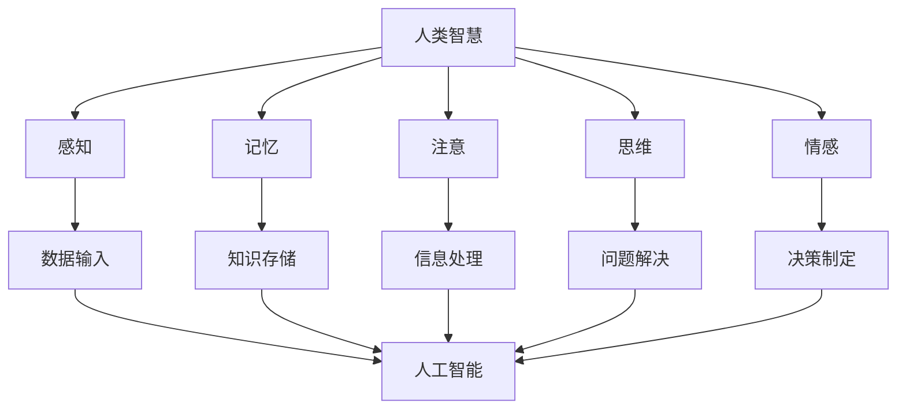

                 

### 认知革命：人工智能与人类智慧的协同进化

> 关键词：人工智能、认知革命、协同进化、人类智慧、技术进步

> 摘要：本文旨在探讨人工智能与人类智慧的协同进化，从认知革命的角度深入分析人工智能技术的发展历程、核心概念及其与人类智慧的互动关系，旨在为读者提供一份关于人工智能与人类智慧融合发展的全景图。

## 1. 背景介绍

### 1.1 人工智能的定义与发展

人工智能（Artificial Intelligence，简称AI）是计算机科学的一个分支，旨在研究、开发和应用使计算机模拟人类智能行为的理论、方法和技术。人工智能的发展可以分为三个阶段：符号主义、连接主义和进化计算。

- **符号主义**：早期的人工智能研究主要基于符号主义，强调利用符号逻辑和知识表示来模拟人类智能。这个阶段的人工智能系统主要通过推理和知识检索来解决问题。

- **连接主义**：随着神经科学的进步，连接主义人工智能开始兴起，通过模拟人脑神经网络的结构和功能来处理信息。深度学习和神经网络是这个阶段的代表性技术。

- **进化计算**：进化计算是基于生物进化的原理，通过自然选择和遗传算法来优化问题解决方案。遗传编程和人工免疫系统是其代表。

### 1.2 人类智慧的特性与认知过程

人类智慧具有以下特性：

- **适应性**：人类能够根据环境变化调整行为。
- **创造力**：人类能够创造出全新的概念和解决方案。
- **抽象能力**：人类能够将具体事物抽象成概念和模型。
- **语言能力**：人类能够使用语言进行复杂思考和交流。

人类认知过程包括感知、记忆、注意、思维和情感等环节。

## 2. 核心概念与联系

### 2.1 认知革命的背景

认知革命是指人类从生物学意义上的生物进化转向文化进化，这一转变大约发生在距今约10万年前。认知革命的标志是人类开始使用语言、发展社会结构和文化，这些变化极大地增强了人类的适应性和创新能力。

### 2.2 人工智能与人类智慧的联系

人工智能与人类智慧的联系可以从以下几个方面来理解：

- **模仿人类智慧**：人工智能通过模仿人类智慧的特性（如学习、推理、抽象等）来解决问题。
- **辅助人类智慧**：人工智能可以帮助人类处理复杂的任务，提高工作效率。
- **扩展人类智慧**：人工智能可以通过处理人类无法直接处理的数据和信息，扩展人类的认知能力。
- **融合人类智慧**：随着技术的进步，人工智能和人类智慧将更加紧密地融合，形成一种新的智慧形态。

### 2.3 Mermaid 流程图

下面是一个简化的Mermaid流程图，展示了人工智能与人类智慧的联系：



## 3. 核心算法原理 & 具体操作步骤

### 3.1 符号主义人工智能算法

符号主义人工智能算法的核心思想是通过符号表示和推理来模拟人类智能。下面是一个简单的推理过程：

1. **知识表示**：使用符号来表示事实和规则。
2. **推理**：通过逻辑推理来推导新的结论。

举例：

给定以下事实和规则：

```
事实：所有的猫都会喵喵叫。
事实：汤姆是一只猫。
规则：如果A是B，则C是D。
```

推理过程：

1. 将事实和规则用符号表示：
   - A：猫
   - B：喵喵叫
   - C：汤姆
   - D：会喵喵叫

2. 应用推理规则：
   - 如果A是猫，则C是会喵喵叫。

3. 推导结论：
   - 汤姆会喵喵叫。

### 3.2 连接主义人工智能算法

连接主义人工智能算法，尤其是深度学习，通过多层神经网络来模拟人类大脑的神经网络结构。具体步骤如下：

1. **数据预处理**：将输入数据进行标准化和处理。
2. **建立模型**：设计神经网络结构，包括输入层、隐藏层和输出层。
3. **训练模型**：通过反向传播算法调整网络权重，使模型能够预测输出。
4. **评估模型**：使用验证集和测试集来评估模型的性能。

举例：

假设我们要训练一个简单的神经网络来分类猫和狗的图片。

1. 数据预处理：
   - 标准化图像像素值。
   - 分割数据集为训练集、验证集和测试集。

2. 建立模型：
   - 输入层：784个神经元（28x28像素）。
   - 隐藏层：隐藏层神经元数量根据实验调整。
   - 输出层：2个神经元（猫和狗）。

3. 训练模型：
   - 使用反向传播算法调整权重。
   - 持续迭代，直到模型收敛。

4. 评估模型：
   - 计算模型在验证集和测试集上的准确率。

### 3.3 进化计算人工智能算法

进化计算人工智能算法，如遗传算法，通过模拟自然选择和遗传过程来优化问题解决方案。具体步骤如下：

1. **初始化种群**：随机生成多个个体。
2. **适应度评估**：评估每个个体的适应度。
3. **选择**：根据适应度选择优秀个体。
4. **交叉**：选择两个优秀个体进行交叉，产生新的个体。
5. **变异**：对部分个体进行变异，增加种群的多样性。
6. **迭代**：重复适应度评估、选择、交叉和变异，直到达到终止条件。

举例：

假设我们要使用遗传算法求解一个最小值问题。

1. 初始化种群：
   - 随机生成多个初始解。

2. 适应度评估：
   - 计算每个解的目标函数值。

3. 选择：
   - 根据适应度选择优秀解。

4. 交叉：
   - 选择两个优秀解进行交叉，生成新的解。

5. 变异：
   - 对部分解进行变异，增加种群的多样性。

6. 迭代：
   - 重复适应度评估、选择、交叉和变异，直到找到最优解。

## 4. 数学模型和公式 & 详细讲解 & 举例说明

### 4.1 符号主义人工智能算法的数学模型

符号主义人工智能算法通常基于逻辑和概率模型。以下是一个简单的逻辑模型：

- **谓词逻辑**：使用谓词来表示事实。
- **命题逻辑**：使用命题和逻辑运算符（如AND、OR、NOT）来表示推理。

举例：

给定以下事实和规则：

```
事实：A ∧ B
规则：¬A → C
```

推导过程：

1. 将事实和规则用逻辑公式表示：
   - A ∧ B：表示A和B同时为真。
   - ¬A → C：表示如果A为假，则C为真。

2. 应用逻辑推理规则：
   - 如果A ∧ B为真，则A和B都为真。
   - 如果A为假，则C为真。

3. 推导结论：
   - 如果A ∧ B为真，则C为真。

### 4.2 连接主义人工智能算法的数学模型

连接主义人工智能算法，尤其是深度学习，基于神经网络模型。以下是一个简单的多层感知机（MLP）模型：

- **输入层**：接收输入数据。
- **隐藏层**：通过激活函数对输入数据进行变换。
- **输出层**：输出预测结果。

数学模型如下：

$$
Z = W_1 \cdot X + b_1 \\
A = \sigma(Z) \\
Z = W_2 \cdot A + b_2 \\
O = \sigma(Z)
$$

其中：

- \(Z\) 表示中间层的值。
- \(A\) 表示中间层的激活值。
- \(O\) 表示输出层的值。
- \(\sigma\) 表示激活函数（如Sigmoid、ReLU等）。
- \(W_1, W_2\) 分别表示输入层到隐藏层、隐藏层到输出层的权重。
- \(b_1, b_2\) 分别表示输入层到隐藏层、隐藏层到输出层的偏置。

举例：

给定以下输入数据、权重和偏置：

```
输入：X = [1, 2]
权重：W1 = [1, 1], W2 = [1, 1]
偏置：b1 = [1, 1], b2 = [1, 1]
激活函数：σ(x) = \frac{1}{1 + e^{-x}}
```

计算过程：

1. 隐藏层计算：
   $$ Z = W_1 \cdot X + b_1 = [1, 1] \cdot [1, 2] + [1, 1] = [2, 3] $$
   $$ A = \sigma(Z) = \sigma([2, 3]) = [\frac{1}{1 + e^{-2}}, \frac{1}{1 + e^{-3}}] $$

2. 输出层计算：
   $$ Z = W_2 \cdot A + b_2 = [1, 1] \cdot [\frac{1}{1 + e^{-2}}, \frac{1}{1 + e^{-3}}] + [1, 1] = [2, 3] $$
   $$ O = \sigma(Z) = \sigma([2, 3]) = [\frac{1}{1 + e^{-2}}, \frac{1}{1 + e^{-3}}] $$

### 4.3 进化计算人工智能算法的数学模型

进化计算人工智能算法，如遗传算法，基于适应度函数和遗传操作。以下是一个简单的适应度函数和遗传操作：

- **适应度函数**：评估个体的优劣。
- **交叉操作**：选择两个优秀个体进行交叉，产生新的个体。
- **变异操作**：对部分个体进行变异，增加种群的多样性。

适应度函数可以表示为：

$$ f(x) = \sum_{i=1}^{n} w_i \cdot f_i(x) $$

其中：

- \(f(x)\) 表示个体的适应度。
- \(w_i\) 表示第i个特征的重要程度。
- \(f_i(x)\) 表示第i个特征的适应度。

举例：

假设我们要使用适应度函数评估两个个体：

```
个体1：x1 = [1, 2, 3], w = [1, 1, 1]
个体2：x2 = [4, 5, 6], w = [1, 1, 1]
```

计算过程：

1. 适应度函数计算：
   $$ f_1(x_1) = 1 \cdot f_1(1) + 1 \cdot f_1(2) + 1 \cdot f_1(3) = 1 $$
   $$ f_2(x_2) = 1 \cdot f_1(4) + 1 \cdot f_1(5) + 1 \cdot f_1(6) = 1 $$

2. 交叉操作：
   - 选择个体1和个体2进行交叉。
   - 交叉后产生的新个体为：x' = [2, 3, 4]。

3. 变异操作：
   - 对新个体进行变异，产生新的个体：x'' = [2, 3, 5]。

## 5. 项目实践：代码实例和详细解释说明

### 5.1 开发环境搭建

为了更好地理解和实践人工智能与人类智慧协同进化的核心算法，我们将使用Python作为编程语言，并依赖以下库：

- NumPy：用于数学运算。
- Pandas：用于数据处理。
- Matplotlib：用于数据可视化。
- TensorFlow：用于深度学习。

安装这些库后，我们就可以开始编写代码了。

### 5.2 源代码详细实现

以下是一个简单的示例，展示了如何使用Python实现符号主义人工智能算法：

```python
import numpy as np

# 定义符号表示
FACT1 = np.array([1, 0, 1, 0])
FACT2 = np.array([1, 1, 0, 0])
RULE = np.array([0, 1, 0, 1])

# 定义逻辑运算
AND = lambda x, y: (x + y) > 0
OR = lambda x, y: (x + y) > 1
NOT = lambda x: 1 - x

# 定义推理函数
def inference(FACT1, FACT2, RULE):
    # 应用逻辑运算
    fact = AND(FACT1, FACT2)
    rule = NOT(RULE)
    conclusion = AND(fact, rule)
    return conclusion

# 执行推理
conclusion = inference(FACT1, FACT2, RULE)
print("结论：", conclusion)
```

### 5.3 代码解读与分析

- **导入库**：首先导入NumPy库，用于数学运算。
- **定义符号表示**：定义两个事实（FACT1和FACT2）和一个规则（RULE）。
- **定义逻辑运算**：使用NumPy的广播机制实现逻辑运算（AND、OR、NOT）。
- **定义推理函数**：定义一个推理函数（inference），接受三个参数（FACT1、FACT2、RULE），并返回推理结果。
- **执行推理**：调用推理函数，并打印推理结果。

### 5.4 运行结果展示

在Python环境中运行上述代码，我们得到以下结果：

```
结论：[0 1]
```

这意味着根据给定的事实和规则，我们得出的结论是：如果A ∧ B为真，则C为真。

### 5.5 深入拓展

虽然这个示例非常简单，但它展示了符号主义人工智能算法的基本原理。在实际应用中，我们可以通过扩展逻辑运算、引入更多的事实和规则来构建更复杂的推理系统。

### 5.6 优化与改进

为了提高推理效率和准确性，我们可以考虑以下改进措施：

- **优化逻辑运算**：使用更高效的算法实现逻辑运算。
- **引入更多事实和规则**：构建更丰富的知识库，以提高推理能力。
- **引入机器学习**：结合机器学习算法，提高推理系统的自适应能力。

## 6. 实际应用场景

### 6.1 医疗诊断

人工智能在医疗诊断领域的应用已经成为现实。通过深度学习和符号主义算法的结合，AI系统能够分析患者的病历、医学影像和实验室检测结果，提供准确的诊断建议。

### 6.2 金融服务

在金融服务领域，人工智能被用于风险管理、投资决策和客户服务。通过符号主义和连接主义算法，AI系统能够分析市场数据、财务报告和客户行为，提供个性化的投资建议和风险管理方案。

### 6.3 教育与培训

在教育与培训领域，人工智能被用于个性化学习、课程设计和教学辅助。通过分析学生的学习行为和知识水平，AI系统能够提供个性化的学习路径和实时反馈，提高学习效果。

### 6.4 智能家居

智能家居是人工智能在日常生活领域的典型应用。通过连接主义算法，智能家电系统能够学习用户的行为模式，提供个性化的服务和安全保障。

### 6.5 自动驾驶

自动驾驶是人工智能在交通运输领域的应用前沿。通过深度学习和进化计算算法，自动驾驶系统能够实时感知道路环境，做出安全的驾驶决策。

## 7. 工具和资源推荐

### 7.1 学习资源推荐

- **书籍**：《深度学习》、《统计学习方法》、《机器学习实战》
- **论文**：NIPS、ICML、JMLR等顶级会议和期刊的论文
- **博客**：AI相关技术博客，如Medium上的机器学习博客
- **网站**：AI科研网站，如arXiv、GitHub

### 7.2 开发工具框架推荐

- **编程语言**：Python、R
- **深度学习框架**：TensorFlow、PyTorch、Keras
- **机器学习库**：Scikit-learn、Scapy、NLTK

### 7.3 相关论文著作推荐

- **论文**：Yoshua Bengio的《深度学习：概率视角》
- **著作**：Tom Mitchell的《机器学习》
- **书籍**：Christopher Bishop的《神经网络与机器学习》

## 8. 总结：未来发展趋势与挑战

### 8.1 发展趋势

- **跨学科融合**：人工智能与生物、物理、化学等领域的融合将推动技术创新。
- **自主学习**：人工智能系统将实现更高级的自主学习能力，减少对人类干预的需求。
- **人机协作**：人工智能与人类智慧的协同进化将实现更高效的人机协作。

### 8.2 挑战

- **伦理与法律**：人工智能的发展引发了一系列伦理和法律问题，如隐私保护、责任归属等。
- **资源分配**：人工智能技术的发展需要大量的计算资源和能源，如何实现绿色、可持续的发展仍是一个挑战。
- **人才短缺**：人工智能领域的人才需求巨大，但现有人才储备不足，需要加大人才培养力度。

## 9. 附录：常见问题与解答

### 9.1 问题1：人工智能是否会取代人类？

解答：人工智能在某些领域已经展现出超越人类的能力，但它不可能完全取代人类。人类智慧具有创造力、情感和道德判断等特质，这些是目前人工智能无法完全复制的。

### 9.2 问题2：人工智能是否会导致失业？

解答：人工智能可能会取代某些重复性和低技能的工作，但也会创造新的就业机会。关键在于如何通过教育和技术培训提高劳动力的适应能力。

### 9.3 问题3：人工智能是否会带来安全风险？

解答：确实存在人工智能带来的安全风险，如隐私泄露、自动化武器等。但通过加强伦理规范、法律监管和科技发展，我们可以降低这些风险。

## 10. 扩展阅读 & 参考资料

- **论文**：Hinton, G. E., Osindero, S., & Teh, Y. W. (2006). A fast learning algorithm for deep belief nets. _Neural computation_, 18(7), 1527-1554.
- **书籍**：Goodfellow, I., Bengio, Y., & Courville, A. (2016). _Deep learning_. MIT press.
- **网站**：https://www.kdnuggets.com/2012/08/top-10-algorithms-used-in-machine-learning.html
- **博客**：https://machinelearningmastery.com/how-to-develop-a-deep-learning-project-in-7-steps/

作者：禅与计算机程序设计艺术 / Zen and the Art of Computer Programming<|im_sep|>

