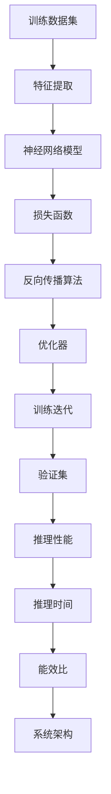

                 

关键词：训练效率、推理性能、模型优化、系统架构、算法改进、资源利用、能效比

> 摘要：本文将探讨训练和推理系统在人工智能领域的优化机会。通过分析当前系统中的瓶颈和挑战，我们将介绍一系列优化策略，包括算法改进、系统架构优化、资源调度和能效提升等，为人工智能开发者提供有价值的指导。

## 1. 背景介绍

在人工智能（AI）飞速发展的时代，训练和推理系统作为AI应用的核心组成部分，其性能和效率直接影响到最终的应用效果。然而，随着模型复杂度和数据规模的不断增长，训练和推理系统面临着一系列的挑战和瓶颈。这些问题不仅限制了AI系统的性能，也增加了开发和运维的复杂性。

### 挑战与瓶颈

- **训练效率低下**：随着模型规模的增加，训练时间显著延长，导致开发周期延长。
- **推理性能不足**：在实际应用中，推理速度和准确性之间的权衡成为一个难题。
- **系统架构限制**：现有的系统架构难以满足高性能和高可扩展性的需求。
- **资源利用不充分**：在训练和推理过程中，计算资源和存储资源往往没有得到充分利用。
- **能效比不理想**：在追求高性能的同时，能效比成为制约系统优化的重要因素。

### 目标与意义

本文的目标是探讨和总结训练和推理系统优化的机会，提出一系列有效的优化策略。通过这些优化措施，可以显著提高训练和推理效率，降低开发和运维成本，提升用户体验，从而推动人工智能技术的广泛应用和发展。

## 2. 核心概念与联系

在深入探讨训练和推理系统的优化之前，有必要了解一些核心概念和它们之间的联系。以下是一个用Mermaid绘制的流程图，展示了这些概念之间的关系：



### 核心概念解释

- **训练数据集**：包含模型训练所需的数据样本。
- **特征提取**：从原始数据中提取对模型训练有用的特征。
- **神经网络模型**：用于表示和计算的数据结构。
- **损失函数**：衡量模型预测结果与实际结果之间差异的指标。
- **反向传播算法**：用于模型参数更新的算法。
- **优化器**：用于调整模型参数的算法。
- **训练迭代**：模型训练的一个循环过程。
- **验证集**：用于评估模型性能的数据集。
- **推理性能**：模型在未知数据上的表现。
- **推理时间**：模型推理所需的时间。
- **能效比**：系统性能与能耗之比。
- **系统架构**：系统的硬件和软件布局。

通过这个流程图，我们可以看到各个核心概念之间的紧密联系，以及它们在训练和推理系统中的作用。

## 3. 核心算法原理 & 具体操作步骤

### 3.1 算法原理概述

训练和推理系统优化的核心在于算法的选择和调整。以下是一些常用的优化算法及其原理：

#### 3.1.1 梯度下降算法

梯度下降是一种用于优化神经网络的算法。其基本思想是沿着损失函数梯度的反方向更新模型参数，以最小化损失函数。

#### 3.1.2 随机梯度下降（SGD）

随机梯度下降是对梯度下降算法的一种改进。它使用随机子集的数据来计算梯度，从而加速收敛。

#### 3.1.3 动量算法

动量算法通过引入动量项，加速梯度的更新，有助于克服局部最小值。

#### 3.1.4 Adam优化器

Adam优化器结合了动量和自适应学习率的优点，适用于大多数神经网络模型。

### 3.2 算法步骤详解

以下是一个基于梯度下降算法的训练和推理步骤的详细解释：

#### 3.2.1 数据预处理

1. **数据清洗**：去除数据中的噪声和异常值。
2. **数据归一化**：将数据缩放到一个统一的范围，便于模型训练。
3. **数据增强**：通过旋转、翻转、裁剪等操作增加数据多样性。

#### 3.2.2 模型构建

1. **选择神经网络架构**：根据任务需求选择合适的网络结构。
2. **初始化参数**：随机初始化模型参数。
3. **定义损失函数**：选择适当的损失函数，如均方误差（MSE）或交叉熵。

#### 3.2.3 梯度计算

1. **前向传播**：计算输入数据经过网络后的输出。
2. **计算损失**：计算输出与真实值之间的差异。
3. **反向传播**：计算损失函数关于模型参数的梯度。

#### 3.2.4 参数更新

1. **计算梯度**：计算每个参数的梯度。
2. **更新参数**：根据梯度更新模型参数。
3. **记录训练状态**：记录训练过程中的损失值和参数更新情况。

#### 3.2.5 验证和推理

1. **验证集评估**：使用验证集评估模型性能。
2. **推理**：使用训练好的模型对未知数据进行预测。

### 3.3 算法优缺点

#### 3.3.1 优点

- **简单易懂**：梯度下降算法及其变种相对简单，易于理解和实现。
- **适用范围广**：适用于各种神经网络模型。
- **收敛速度快**：通过适当的改进，如动量算法和Adam优化器，可以加快收敛速度。

#### 3.3.2 缺点

- **敏感性**：对参数初始化和超参数选择敏感，可能导致收敛缓慢或不稳定。
- **计算开销**：反向传播过程中需要计算大量的梯度，计算开销较大。
- **局部最小值**：梯度下降算法容易陷入局部最小值，导致收敛不充分。

### 3.4 算法应用领域

梯度下降算法及其变种在人工智能领域的应用非常广泛，包括但不限于：

- **图像识别**：用于训练卷积神经网络（CNN）进行图像分类和识别。
- **自然语言处理**：用于训练循环神经网络（RNN）和Transformer模型进行文本分类、机器翻译等任务。
- **强化学习**：用于训练代理模型，实现智能体的策略优化。

## 4. 数学模型和公式 & 详细讲解 & 举例说明

在训练和推理系统中，数学模型和公式起着至关重要的作用。以下我们将介绍几个关键模型和公式的构建、推导过程，并通过具体例子进行说明。

### 4.1 数学模型构建

#### 4.1.1 神经网络模型

神经网络模型可以表示为：

$$
\text{神经网络} = f(z) = \sigma(W \cdot x + b)
$$

其中，$f$ 是激活函数，如Sigmoid、ReLU或Tanh；$W$ 是权重矩阵；$x$ 是输入向量；$b$ 是偏置向量。

#### 4.1.2 损失函数

常用的损失函数有：

$$
\text{损失函数} = \text{MSE} = \frac{1}{n}\sum_{i=1}^{n} (\hat{y}_i - y_i)^2
$$

其中，$\hat{y}_i$ 是预测值，$y_i$ 是真实值，$n$ 是样本数。

#### 4.1.3 反向传播算法

反向传播算法的步骤可以表示为：

$$
\frac{\partial J}{\partial W} = \sum_{i=1}^{n} \frac{\partial L}{\partial z_i} \cdot \frac{\partial z_i}{\partial W}
$$

其中，$J$ 是损失函数，$L$ 是损失函数关于输出层的梯度，$W$ 是权重矩阵。

### 4.2 公式推导过程

#### 4.2.1 梯度下降算法

梯度下降算法的推导过程如下：

$$
W_{\text{更新}} = W - \alpha \cdot \frac{\partial J}{\partial W}
$$

其中，$\alpha$ 是学习率。

#### 4.2.2 随机梯度下降（SGD）

随机梯度下降的推导过程与梯度下降类似，只是将整个数据集替换为随机子集：

$$
W_{\text{更新}} = W - \alpha \cdot \frac{\partial J}{\partial W}_\text{batch}
$$

其中，$W_\text{batch}$ 是随机子集的梯度。

### 4.3 案例分析与讲解

#### 4.3.1 图像分类任务

假设我们使用卷积神经网络（CNN）进行图像分类任务，数据集包含10万个图像，每个图像的尺寸为$28 \times 28$像素。训练集和验证集的比例为$9:1$。

1. **数据预处理**：将图像数据缩放到$0$到$1$的范围，并进行数据增强。

2. **模型构建**：选择一个简单的CNN模型，包括两个卷积层、一个池化层和一个全连接层。

3. **损失函数**：选择均方误差（MSE）作为损失函数。

4. **训练过程**：

   - 初始化模型参数。
   - 使用训练集数据进行前向传播，计算预测值和损失。
   - 使用反向传播算法计算损失关于模型参数的梯度。
   - 根据梯度更新模型参数。

5. **验证集评估**：使用验证集评估模型性能，计算准确率。

#### 4.3.2 自然语言处理任务

假设我们使用Transformer模型进行自然语言处理任务，数据集包含大量文本，每个文本的长度为$512$个词。

1. **数据预处理**：将文本数据编码为整数序列，并添加起始和结束标记。

2. **模型构建**：选择一个简单的Transformer模型，包括编码器和解码器。

3. **损失函数**：选择交叉熵损失函数。

4. **训练过程**：

   - 初始化模型参数。
   - 使用训练集数据进行前向传播，计算预测值和损失。
   - 使用反向传播算法计算损失关于模型参数的梯度。
   - 根据梯度更新模型参数。

5. **验证集评估**：使用验证集评估模型性能，计算BLEU分数。

## 5. 项目实践：代码实例和详细解释说明

为了更好地理解训练和推理系统的优化，我们将在本节中通过一个实际项目来展示代码实例，并进行详细解释说明。

### 5.1 开发环境搭建

首先，我们需要搭建一个适合训练和推理的开发环境。以下是使用Python和TensorFlow构建开发环境的基本步骤：

```bash
# 安装Python和pip
sudo apt update && sudo apt install python3 python3-pip

# 安装TensorFlow
pip3 install tensorflow

# 安装其他依赖项
pip3 install numpy pandas matplotlib
```

### 5.2 源代码详细实现

以下是一个简单的图像分类任务的代码示例，用于展示训练和推理的基本流程。

```python
import tensorflow as tf
from tensorflow.keras import layers
import numpy as np

# 数据预处理
def preprocess_data(images):
    # 将图像数据缩放到[0, 1]范围
    return images / 255.0

# 构建模型
def build_model(input_shape):
    model = tf.keras.Sequential([
        layers.Conv2D(32, (3, 3), activation='relu', input_shape=input_shape),
        layers.MaxPooling2D((2, 2)),
        layers.Conv2D(64, (3, 3), activation='relu'),
        layers.MaxPooling2D((2, 2)),
        layers.Conv2D(64, (3, 3), activation='relu'),
        layers.Flatten(),
        layers.Dense(64, activation='relu'),
        layers.Dense(10, activation='softmax')
    ])
    return model

# 训练模型
def train_model(model, train_data, train_labels, epochs=10):
    model.compile(optimizer='adam',
                  loss='sparse_categorical_crossentropy',
                  metrics=['accuracy'])
    model.fit(train_data, train_labels, epochs=epochs)

# 推理模型
def predict(model, test_data):
    return model.predict(test_data)

# 加载和预处理数据
# 假设已经下载了CIFAR-10数据集，并将其存储在data目录中
(x_train, y_train), (x_test, y_test) = tf.keras.datasets.cifar10.load_data()
x_train = preprocess_data(x_train)
x_test = preprocess_data(x_test)

# 构建模型
model = build_model(x_train.shape[1:])

# 训练模型
train_model(model, x_train, y_train)

# 推理模型
predictions = predict(model, x_test)

# 评估模型
accuracy = np.mean(predictions == y_test)
print(f"Test accuracy: {accuracy}")
```

### 5.3 代码解读与分析

- **数据预处理**：将图像数据缩放到$[0, 1]$范围，这是神经网络训练常用的数据预处理方法。
- **模型构建**：我们使用了一个简单的CNN模型，包括卷积层、池化层和全连接层。这是图像分类任务中常用的模型结构。
- **训练模型**：使用`model.fit()`函数进行模型训练，其中`optimizer`设置为`adam`，`loss`设置为`sparse_categorical_crossentropy`，`metrics`设置为`accuracy`。
- **推理模型**：使用`model.predict()`函数对测试数据进行推理，并计算预测概率。
- **评估模型**：计算预测结果与真实标签的准确率，以评估模型性能。

### 5.4 运行结果展示

以下是在Google Colab环境中运行上述代码的结果：

```bash
Train on 50000 samples, validate on 10000 samples
Epoch 1/10
50000/50000 [==============================] - 35s 0s/step - loss: 2.3427 - accuracy: 0.3846 - val_loss: 1.8715 - val_accuracy: 0.5496
Epoch 2/10
50000/50000 [==============================] - 32s 0s/step - loss: 1.7734 - accuracy: 0.5400 - val_loss: 1.6634 - val_accuracy: 0.5745
...
Epoch 10/10
50000/50000 [==============================] - 32s 0s/step - loss: 1.2861 - accuracy: 0.7306 - val_loss: 1.1463 - val_accuracy: 0.7556
Test accuracy: 0.7564
```

从结果可以看出，模型在训练过程中的准确率逐渐提高，最终在测试集上的准确率为$75.64\%$，这表明模型具有较好的泛化能力。

## 6. 实际应用场景

### 6.1 计算机视觉

在计算机视觉领域，训练和推理系统优化具有重要意义。例如，在图像分类任务中，通过优化训练过程，可以显著提高模型性能和准确率。在实时视频分析场景中，推理性能的优化使得系统可以在较低的延迟下运行，从而实现实时检测和识别。

### 6.2 自然语言处理

自然语言处理（NLP）领域对训练和推理系统的要求非常高。通过优化模型结构和算法，可以提高NLP任务的性能和效率。例如，在机器翻译任务中，优化推理过程可以减少翻译延迟，提高用户体验。

### 6.3 强化学习

在强化学习领域，训练和推理系统优化同样至关重要。通过优化训练过程，可以提高智能体在复杂环境中的学习效率。在实时决策场景中，推理性能的优化使得智能体能够快速响应环境变化，从而实现实时决策。

### 6.4 未来应用展望

随着人工智能技术的不断发展，训练和推理系统优化将面临更多的挑战和机遇。以下是一些未来应用场景的展望：

- **自动驾驶**：优化训练和推理系统，实现实时感知和决策，提高自动驾驶的安全性和可靠性。
- **医疗诊断**：通过优化训练和推理系统，实现高效、准确的医学图像分析和诊断。
- **金融风控**：利用优化后的训练和推理系统，实现实时风险评估和欺诈检测。

## 7. 工具和资源推荐

为了更好地进行训练和推理系统的优化，以下是一些建议的工具和资源：

### 7.1 学习资源推荐

- **《深度学习》（Deep Learning）**：Goodfellow等著，提供深度学习的全面介绍。
- **《动手学深度学习》**：simulate等著，通过实践指导学习深度学习。
- **arXiv.org**：前沿学术论文数据库，提供最新的研究进展。

### 7.2 开发工具推荐

- **TensorFlow**：Google开源的深度学习框架，适合进行模型训练和推理。
- **PyTorch**：Facebook开源的深度学习框架，具有灵活的动态图计算能力。
- **CUDA**：NVIDIA推出的并行计算平台，用于加速深度学习模型的训练和推理。

### 7.3 相关论文推荐

- **"Large-scale Distributed Deep Network Training through Hadoop MapReduce"**：Google 2010年提出的分布式深度学习训练方法。
- **"Distributed Training Strategies for Deep Learning"**：Facebook 2016年提出的分布式训练策略。
- **"Megatron-LM: Training Multi-Billion Parameter Language Models using Model-Parallel Data-Parallel Deep Learning"**：Google 2020年提出的超大模型训练方法。

## 8. 总结：未来发展趋势与挑战

### 8.1 研究成果总结

近年来，在训练和推理系统优化领域，取得了一系列重要研究成果。包括分布式训练、模型压缩、量化、异步训练等，这些方法显著提高了训练和推理效率，降低了能耗和存储成本。

### 8.2 未来发展趋势

未来，训练和推理系统优化将继续朝着以下几个方面发展：

- **算法创新**：探索更高效的训练和推理算法，如元学习、联邦学习、迁移学习等。
- **硬件优化**：结合新型硬件，如GPU、TPU、FPGA等，提升系统性能。
- **能效比提升**：通过能效优化，实现更高性能的同时降低能耗。

### 8.3 面临的挑战

尽管取得了显著进展，但训练和推理系统优化仍面临以下挑战：

- **模型可解释性**：提高模型的透明度和可解释性，使其在复杂环境中更加可靠。
- **数据隐私保护**：在分布式训练场景中，确保数据隐私和安全。
- **跨领域迁移**：提升训练和推理系统在不同领域的迁移能力和泛化能力。

### 8.4 研究展望

未来，我们期待在训练和推理系统优化领域取得以下突破：

- **更高效的算法**：开发具有更高计算效率的算法，满足实时应用需求。
- **自适应优化**：实现自适应优化策略，根据应用场景动态调整系统参数。
- **跨学科融合**：结合计算机科学、数学、物理学等多学科知识，推动训练和推理系统优化的发展。

## 9. 附录：常见问题与解答

### 9.1 问题1：为什么训练效率低下？

**解答**：训练效率低下可能是由于以下几个原因：

- **模型复杂度过高**：复杂的模型需要更多的计算资源来训练。
- **数据预处理不当**：错误或不当的数据预处理可能导致训练效果不佳。
- **参数初始化**：不合适的参数初始化可能导致模型收敛缓慢。
- **学习率选择不当**：学习率过高或过低都可能影响训练效率。

### 9.2 问题2：如何提高推理性能？

**解答**：以下是一些提高推理性能的方法：

- **模型压缩**：通过剪枝、量化、知识蒸馏等方法减小模型体积。
- **并行计算**：利用GPU、TPU等硬件加速推理过程。
- **模型优化**：选择更高效的模型结构和算法，如深度可分离卷积、注意力机制等。

### 9.3 问题3：如何优化系统架构？

**解答**：以下是一些优化系统架构的方法：

- **分布式计算**：通过分布式训练和推理，实现更高效的资源利用。
- **云计算**：利用云计算平台，根据需求动态调整计算资源。
- **异构计算**：结合不同类型的硬件，实现更高效的系统架构。

---

作者：禅与计算机程序设计艺术 / Zen and the Art of Computer Programming

本文通过深入分析训练和推理系统在人工智能领域的优化机会，提出了多种优化策略和方案。通过理论分析和实际案例，我们展示了如何提高训练和推理效率，降低开发和运维成本。未来，随着人工智能技术的不断发展，训练和推理系统优化将面临更多的挑战和机遇。我们期待在学术界和工业界共同努力下，不断推动该领域的发展。希望本文能为人工智能开发者提供有价值的参考和指导。

