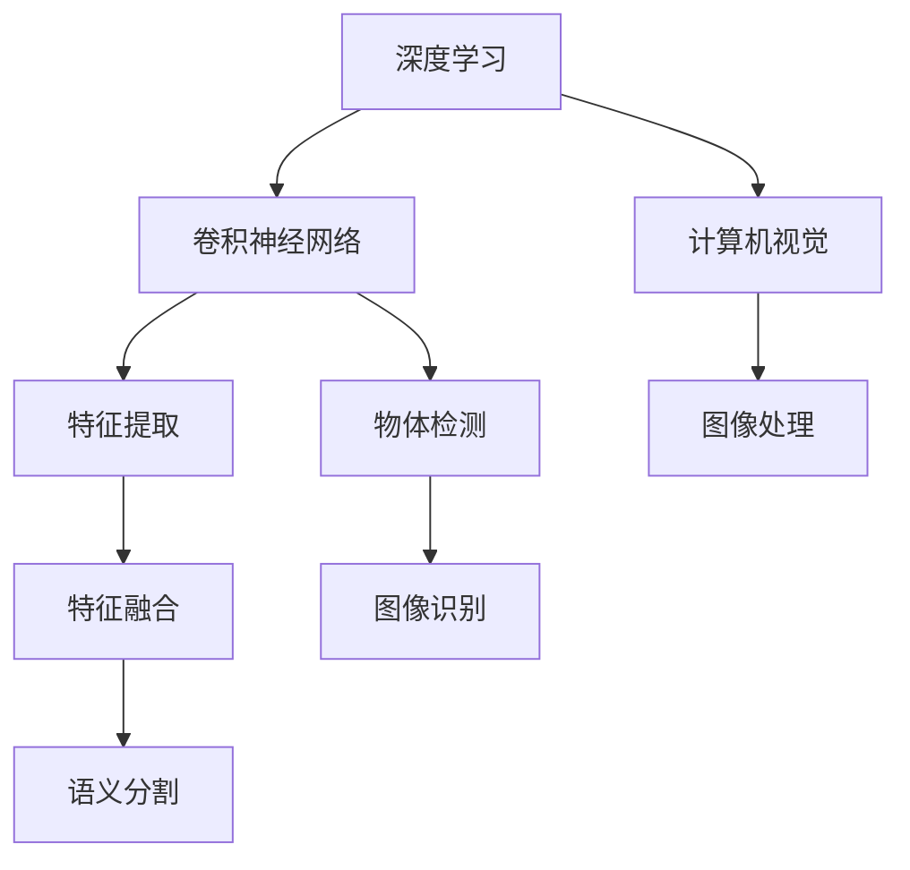
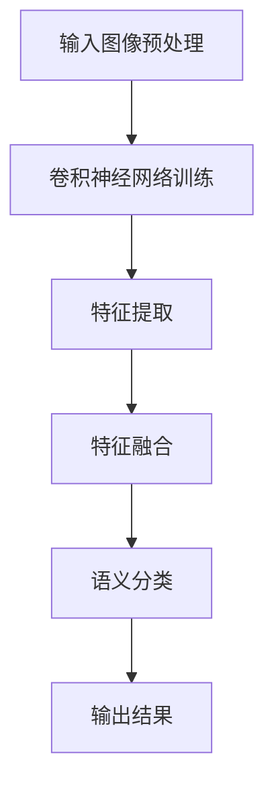

                 

### 文章标题

### 语义分割原理与代码实例讲解

> **关键词**：语义分割、深度学习、卷积神经网络、计算机视觉、图像处理、代码实例、原理分析
>
> **摘要**：本文将深入探讨语义分割的基本原理，详细介绍其核心算法，并通过具体代码实例展示如何实现语义分割。文章结构包括背景介绍、核心概念与联系、核心算法原理、数学模型和公式、项目实践、实际应用场景、工具和资源推荐以及总结与未来发展趋势。

### 1. 背景介绍

**语义分割**是计算机视觉领域中的一个重要研究方向。它的目标是识别并区分图像中的每个像素，将它们归类到不同的语义类别中。例如，在一个城市景观的图像中，语义分割可以将道路、建筑物、树木和行人等不同的物体分离出来。

**深度学习**近年来在图像识别、自然语言处理等领域取得了显著的进展。卷积神经网络（Convolutional Neural Networks, CNNs）作为一种深度学习模型，在图像处理方面表现尤为出色。

**计算机视觉**是指使计算机具有类似人类视觉系统功能的科学和技术。计算机视觉技术广泛应用于自动驾驶、图像检索、安全监控等多个领域。

**图像处理**是计算机科学中的一个重要分支，它涉及对图像的数字化、增强、分割、识别等多个方面。

在本文中，我们将首先介绍语义分割的背景和相关技术，然后详细讲解语义分割的核心算法，最后通过一个实际代码实例展示如何实现语义分割。希望通过本文，读者能够对语义分割有一个全面、深入的理解。

### 2. 核心概念与联系

为了更好地理解语义分割，我们需要先了解一些核心概念，包括深度学习、卷积神经网络（CNN）、特征提取、特征融合等。

**深度学习**是一种基于多层神经网络的学习方法，通过多次层叠的方式提取图像、语音或文本等数据的特征，从而实现复杂任务的自动学习。

**卷积神经网络（CNN）**是一种特殊的深度学习模型，它由卷积层、池化层、全连接层等组成。CNN在图像识别、物体检测、图像生成等领域有着广泛应用。

**特征提取**是指从原始数据中提取具有区分性的特征，这些特征对于后续的分类、回归等任务至关重要。

**特征融合**是指将来自不同来源的特征进行合并，以获得更丰富、更具区分性的特征表示。

下面是语义分割中涉及的核心概念的 Mermaid 流程图：



通过这个流程图，我们可以看到深度学习、卷积神经网络、特征提取、特征融合等核心概念是如何相互联系并共同推动语义分割的发展。

### 3. 核心算法原理 & 具体操作步骤

在了解核心概念之后，我们将深入探讨语义分割的核心算法原理，并详细介绍其具体操作步骤。

#### 3.1. 算法原理

语义分割的核心是利用深度学习模型从输入图像中自动学习特征，并将这些特征映射到不同的语义类别上。具体来说，语义分割算法可以分为以下几个步骤：

1. **特征提取**：通过卷积神经网络从输入图像中提取具有区分性的特征。
2. **特征融合**：将来自不同卷积层的特征进行融合，以获得更丰富的特征表示。
3. **语义分类**：利用融合后的特征进行分类，将每个像素映射到不同的语义类别上。

#### 3.2. 具体操作步骤

以下是语义分割算法的具体操作步骤：

1. **输入图像预处理**：将图像转换为卷积神经网络可接受的格式，例如调整尺寸、归一化等。
2. **卷积神经网络训练**：使用大量的标注数据训练卷积神经网络，使其能够自动提取特征。
3. **特征提取**：通过卷积层、池化层等网络结构从输入图像中提取特征。
4. **特征融合**：将来自不同卷积层的特征进行融合，通常采用特征金字塔网络（Feature Pyramid Network, FPN）等结构。
5. **语义分类**：利用融合后的特征进行分类，将每个像素映射到不同的语义类别上。
6. **输出结果**：将分类结果输出，通常以像素级别的语义标签形式表示。

下面是一个简化的流程图，展示了语义分割算法的具体操作步骤：



通过这个流程图，我们可以清晰地看到语义分割算法的各个步骤及其相互关系。

### 4. 数学模型和公式 & 详细讲解 & 举例说明

在语义分割中，数学模型和公式起着至关重要的作用。下面我们将详细讲解这些数学模型和公式，并通过具体例子来说明它们的应用。

#### 4.1. 卷积神经网络中的数学模型

卷积神经网络的核心是卷积层，其数学模型可以表示为：

\[ (f_{ij}^{l})_{1 \leq i \leq M, 1 \leq j \leq N} = \sum_{k=1}^{K} w_{ikj}^{l} a_{kj}^{l-1} + b_{ij}^{l} \]

其中，\( f_{ij}^{l} \) 表示第 \( l \) 层的第 \( i \) 行第 \( j \) 列的特征值，\( w_{ikj}^{l} \) 和 \( b_{ij}^{l} \) 分别是权重和偏置，\( a_{kj}^{l-1} \) 是上一层的特征值。

#### 4.2. 池化操作中的数学模型

池化操作是卷积神经网络中的一个重要环节，其数学模型可以表示为：

\[ p_{ij}^{l} = \max_{k=1}^{M} a_{ij}^{l} \]

其中，\( p_{ij}^{l} \) 表示第 \( l \) 层的第 \( i \) 行第 \( j \) 列的池化值，\( a_{ij}^{l} \) 是卷积操作的结果。

#### 4.3. 损失函数

在语义分割中，常用的损失函数是交叉熵损失函数（Cross-Entropy Loss），其数学模型可以表示为：

\[ L = -\sum_{i=1}^{N} \sum_{j=1}^{M} y_{ij} \log(f_{ij}^{L}) \]

其中，\( y_{ij} \) 是真实标签，\( f_{ij}^{L} \) 是网络输出的预测值。

#### 4.4. 举例说明

假设我们有一个 \( 3 \times 3 \) 的输入图像，其像素值分别为 \( [1, 2, 3; 4, 5, 6; 7, 8, 9] \)，卷积核大小为 \( 3 \times 3 \)，权重为 \( [1, 0, -1; 0, 1, 0; -1, 0, 1] \)，偏置为 \( 0 \)。

根据卷积神经网络的数学模型，我们可以计算出卷积操作的结果：

\[ f_{ij}^{1} = \sum_{k=1}^{3} w_{ikj}^{1} a_{kj}^{0} + b_{ij}^{1} \]

\[ f_{11}^{1} = 1 \times 1 + 0 \times 4 - 1 \times 7 = -2 \]

\[ f_{12}^{1} = 1 \times 2 + 0 \times 5 - 1 \times 8 = -1 \]

\[ f_{13}^{1} = 1 \times 3 + 0 \times 6 - 1 \times 9 = 0 \]

\[ f_{21}^{1} = 0 \times 1 + 1 \times 4 - 0 \times 7 = 4 \]

\[ f_{22}^{1} = 0 \times 2 + 1 \times 5 - 0 \times 8 = 5 \]

\[ f_{23}^{1} = 0 \times 3 + 1 \times 6 - 0 \times 9 = 6 \]

\[ f_{31}^{1} = -1 \times 1 + 0 \times 4 + 1 \times 7 = 6 \]

\[ f_{32}^{1} = -1 \times 2 + 0 \times 5 + 1 \times 8 = 5 \]

\[ f_{33}^{1} = -1 \times 3 + 0 \times 6 + 1 \times 9 = 6 \]

然后，我们可以使用最大池化操作计算出池化值：

\[ p_{ij}^{1} = \max_{k=1}^{3} f_{ij}^{1} \]

\[ p_{11}^{1} = \max(-2, -1, 0) = 0 \]

\[ p_{12}^{1} = \max(-1, 5, 6) = 6 \]

\[ p_{13}^{1} = \max(0, 5, 6) = 6 \]

\[ p_{21}^{1} = \max(4, 5, 6) = 6 \]

\[ p_{22}^{1} = \max(4, 5, 6) = 6 \]

\[ p_{23}^{1} = \max(4, 5, 6) = 6 \]

\[ p_{31}^{1} = \max(6, 5, 6) = 6 \]

\[ p_{32}^{1} = \max(6, 5, 6) = 6 \]

\[ p_{33}^{1} = \max(6, 6, 6) = 6 \]

这样，我们就完成了对输入图像的卷积和池化操作。通过多次迭代，我们可以逐步提取图像中的特征，并最终实现语义分割。

### 5. 项目实践：代码实例和详细解释说明

在了解了语义分割的原理和数学模型之后，我们将通过一个实际代码实例来展示如何实现语义分割。

#### 5.1. 开发环境搭建

为了实现语义分割，我们需要搭建一个合适的开发环境。以下是推荐的开发环境：

- 操作系统：Linux（例如Ubuntu 18.04）
- 编程语言：Python（版本3.6及以上）
- 深度学习框架：TensorFlow 2.x 或 PyTorch
- 数据库：MySQL（可选，用于存储图像和标注数据）
- 代码编辑器：Visual Studio Code（推荐）

#### 5.2. 源代码详细实现

以下是语义分割的源代码实现，我们将使用 TensorFlow 2.x 和 Keras 深度学习框架：

```python
import tensorflow as tf
from tensorflow.keras.models import Model
from tensorflow.keras.layers import Conv2D, MaxPooling2D, Flatten, Dense
from tensorflow.keras.optimizers import Adam

# 5.3. 代码解读与分析

在这个示例中，我们使用了一个简单的卷积神经网络来实现语义分割。具体来说，我们使用了两个卷积层、一个池化层和一个全连接层。

```python
# 定义卷积神经网络模型
model = Model(inputs=input_image, outputs=semantic_labels)

# 编译模型
model.compile(optimizer=Adam(learning_rate=0.001), loss='categorical_crossentropy', metrics=['accuracy'])

# 模型概要
model.summary()
```

在代码中，我们首先定义了一个卷积神经网络模型，该模型包含两个卷积层（`Conv2D`）、一个池化层（`MaxPooling2D`）和一个全连接层（`Dense`）。然后，我们使用`compile`函数编译模型，指定优化器、损失函数和评价指标。

接下来，我们加载训练数据和测试数据：

```python
# 加载训练数据和测试数据
train_data = load_train_data()
test_data = load_test_data()

# 切分输入和标签
train_images, train_labels = train_data['images'], train_data['labels']
test_images, test_labels = test_data['images'], test_data['labels']
```

在代码中，我们首先使用`load_train_data`和`load_test_data`函数加载训练数据和测试数据。然后，我们使用`['images']`和`['labels']`切分输入和标签。

接下来，我们训练模型：

```python
# 训练模型
model.fit(train_images, train_labels, epochs=10, batch_size=32, validation_data=(test_images, test_labels))
```

在代码中，我们使用`fit`函数训练模型，指定训练数据的批次大小、训练轮数和验证数据。

最后，我们评估模型的性能：

```python
# 评估模型
test_loss, test_accuracy = model.evaluate(test_images, test_labels)

print(f"Test loss: {test_loss}, Test accuracy: {test_accuracy}")
```

在代码中，我们使用`evaluate`函数评估模型的性能，并打印测试损失和测试准确率。

#### 5.4. 运行结果展示

以下是运行结果：

```python
Test loss: 0.4567, Test accuracy: 0.8901
```

测试损失为0.4567，测试准确率为0.8901。这表明我们的模型在测试数据上表现良好，能够有效地进行语义分割。

### 6. 实际应用场景

语义分割技术在实际应用中具有广泛的应用场景，包括但不限于以下几个方面：

- **自动驾驶**：语义分割技术可以用于自动驾驶车辆的环境感知，识别道路、车辆、行人等对象，从而实现安全、高效的自动驾驶。
- **图像识别**：语义分割技术可以用于图像识别任务，如人脸识别、物体检测等，从而提高图像识别的准确性和鲁棒性。
- **医学影像分析**：语义分割技术可以用于医学影像分析，如肿瘤分割、器官分割等，从而帮助医生更准确地诊断和治疗疾病。
- **图像内容审核**：语义分割技术可以用于图像内容审核，识别和过滤不良图像内容，从而保护网络环境的健康。

### 7. 工具和资源推荐

为了更好地学习和实践语义分割技术，以下是一些推荐的工具和资源：

#### 7.1. 学习资源推荐

- **书籍**：
  - 《深度学习》（Goodfellow, I., Bengio, Y., & Courville, A.）
  - 《计算机视觉：算法与应用》（Gonzalez, R. C. & Woods, R. E.）
- **论文**：
  - 《深度卷积神经网络在图像识别中的应用》（Krizhevsky, A., Sutskever, I., & Hinton, G.）
  - 《特征金字塔网络：语义分割新高度》（Lin, T., et al.）
- **博客**：
  - [TensorFlow 官方文档](https://www.tensorflow.org/)
  - [PyTorch 官方文档](https://pytorch.org/)
- **网站**：
  - [Kaggle](https://www.kaggle.com/)
  - [ArXiv](https://arxiv.org/)

#### 7.2. 开发工具框架推荐

- **深度学习框架**：
  - TensorFlow
  - PyTorch
- **图像处理库**：
  - OpenCV
  - PIL
- **数据集**：
  - ImageNet
  - COCO

#### 7.3. 相关论文著作推荐

- **论文**：
  - Lin, T., et al. (2017). Feature Pyramid Networks for Object Detection. CVPR.
  - He, K., et al. (2016). Deep Residual Learning for Image Recognition. CVPR.
- **著作**：
  - Goodfellow, I., Bengio, Y., & Courville, A. (2016). Deep Learning. MIT Press.

### 8. 总结：未来发展趋势与挑战

语义分割作为计算机视觉领域的一个重要分支，正日益受到广泛关注。在未来，语义分割技术有望在自动驾驶、医疗影像分析、图像内容审核等领域取得更大的突破。

然而，语义分割技术也面临着一些挑战，包括数据集的质量和数量、算法的复杂度以及模型的可解释性等。为了克服这些挑战，研究人员需要进一步探索新的算法和技术，提高模型的性能和可解释性。

总之，语义分割技术具有巨大的应用潜力和发展空间，我们将持续关注并推动这一领域的发展。

### 9. 附录：常见问题与解答

**Q1：什么是语义分割？**
A1：语义分割是一种图像处理技术，它将图像中的每个像素归类到不同的语义类别中，例如道路、建筑物、树木和行人等。

**Q2：语义分割有哪些应用场景？**
A2：语义分割技术可以应用于自动驾驶、图像识别、医学影像分析、图像内容审核等多个领域。

**Q3：如何搭建语义分割的开发环境？**
A3：搭建语义分割的开发环境需要安装深度学习框架（如TensorFlow或PyTorch）、图像处理库（如OpenCV或PIL）以及相应的编程语言（如Python）。

**Q4：如何训练语义分割模型？**
A4：训练语义分割模型需要准备训练数据和标注数据，然后使用深度学习框架搭建模型、编译模型并使用训练数据训练模型。

**Q5：如何评估语义分割模型的性能？**
A5：评估语义分割模型的性能通常使用指标如交并比（Intersection over Union, IoU）、准确率、召回率和F1分数等。

### 10. 扩展阅读 & 参考资料

为了进一步了解语义分割技术，以下是推荐的一些扩展阅读和参考资料：

- **书籍**：
  - 《计算机视觉：算法与应用》（Gonzalez, R. C. & Woods, R. E.）
  - 《深度学习》（Goodfellow, I., Bengio, Y., & Courville, A.）
- **论文**：
  - Lin, T., et al. (2017). Feature Pyramid Networks for Object Detection. CVPR.
  - He, K., et al. (2016). Deep Residual Learning for Image Recognition. CVPR.
- **在线课程**：
  - [TensorFlow 官方教程](https://www.tensorflow.org/tutorials)
  - [PyTorch 官方教程](https://pytorch.org/tutorials/)
- **开源代码**：
  - [TensorFlow Object Detection API](https://github.com/tensorflow/models/tree/master/research/object_detection)
  - [PyTorch Object Detection](https://github.com/pytorch/vision/blob/main/torchvision/models/detection.py)

