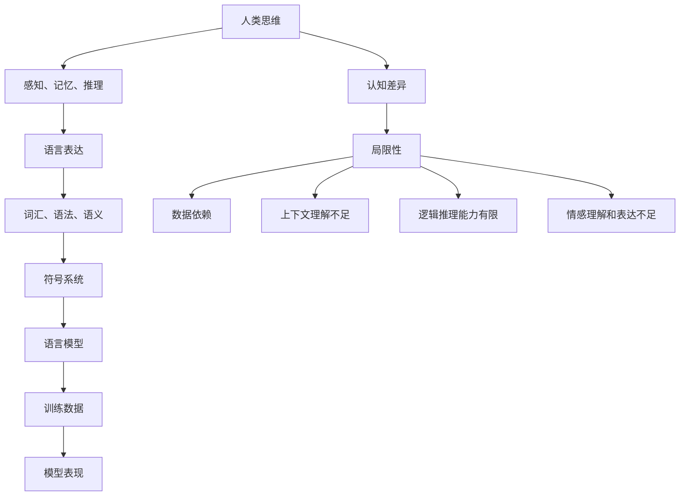

                 

### 背景介绍

在当今这个信息爆炸的时代，人工智能（AI）技术以其迅猛的发展速度成为了科技领域的明星。尤其是近年来，深度学习技术在自然语言处理、计算机视觉、语音识别等领域取得了显著的突破，催生了诸如BERT、GPT-3等大型语言模型。这些模型凭借其强大的处理能力和卓越的性能，正在逐步改变我们的生活和工作方式。

然而，随着模型规模的不断扩大，人们开始关注到一个新的问题：语言模型是否真的理解了它们所处理的信息？传统的观点认为，语言是思维的载体，人类通过语言进行思考、交流和表达。因此，一个完美的语言模型应当能够理解并模拟人类的思维方式。但现实却是，即便是目前最先进的语言模型，也并不完全具备这种能力。

本文旨在探讨这一现象背后的原因，深入分析大模型在认知上的盲点。我们将从以下几个方面展开讨论：

1. **语言与思维的差异**：首先，我们将阐述语言和思维的本质区别，解释为什么语言模型在处理自然语言时存在局限性。
2. **大模型的局限性**：接着，我们将探讨大模型在认知上的局限性，分析这些局限性如何影响模型的表现。
3. **数学模型与算法原理**：我们将深入探讨大模型背后的数学模型和算法原理，解释这些原理如何影响模型的认知能力。
4. **项目实践与案例分析**：通过具体的项目实践和案例分析，我们将进一步阐述大模型的认知盲点在实际应用中的表现。
5. **未来发展趋势与挑战**：最后，我们将讨论大模型在未来发展中的潜力以及面临的挑战，展望这一领域的未来发展方向。

### 核心概念与联系

#### 语言与思维的差异

语言和思维是人类认知过程中两个不可或缺的部分。然而，它们之间存在着本质的区别。语言是一种符号系统，通过词汇、语法和语义来传递信息。它是人类交流的基本工具，但并不等同于思维。

思维是一种抽象的认知过程，它包括感知、记忆、推理、判断等多个方面。思维是基于人类大脑的神经网络和认知结构进行的，它是内在的、非显式的。相比之下，语言是外显的、符号化的，它依赖于词汇、语法和句式的组合来表达思维的内容。

语言模型，如BERT、GPT-3等，虽然能够处理自然语言，但它们的工作方式与人类的思维方式存在差异。首先，语言模型是通过大量的文本数据训练出来的，它们的知识库来源于这些数据。这意味着，语言模型的理解是基于数据统计和模式匹配的，而不是基于真正的认知过程。其次，语言模型在处理语言时，往往依赖于词汇和语法的规则，这些规则虽然能够处理大量的语言现象，但并不能完全模拟人类的思维方式。

#### 大模型的局限性

大模型在认知上的局限性主要表现在以下几个方面：

1. **数据依赖性**：大模型的能力高度依赖于训练数据。尽管这些模型能够处理大量的文本数据，但它们并不能自主地获取新知识或进行创新。如果训练数据存在偏差或局限性，那么模型的表现也会受到影响。

2. **上下文理解不足**：尽管大模型能够处理复杂的语言现象，但它们在理解上下文方面的能力仍然有限。语言中的很多含义和隐含信息往往需要依赖上下文来理解，而大模型在这方面往往存在盲点。

3. **逻辑推理能力有限**：大模型虽然在某些逻辑推理任务上表现出色，但它们在处理复杂、抽象的逻辑问题时，仍然存在困难。这是因为大模型的推理能力是基于统计和学习机制的，而不是真正的逻辑推理。

4. **情感理解和表达不足**：情感是人类思维中一个重要的组成部分。尽管大模型能够在一定程度上理解情感，但它们在表达情感方面仍然存在局限性。这主要是因为语言模型在处理情感时，往往依赖于词汇和语法的组合，而无法真正体验和表达情感。

#### 核心概念原理和架构的 Mermaid 流程图

为了更好地理解语言与思维、大模型与人类认知之间的关系，我们使用Mermaid流程图来展示核心概念原理和架构。



### 核心算法原理 & 具体操作步骤

#### 大模型的训练过程

大模型的训练是一个复杂的过程，它通常包括以下几个步骤：

1. **数据收集**：首先，我们需要收集大量的文本数据。这些数据可以是各种文本资料，如新闻文章、书籍、社交媒体帖子等。数据的质量和多样性对模型的表现至关重要。

2. **数据预处理**：收集到的数据需要进行预处理，以便于模型训练。预处理步骤通常包括文本清洗、分词、去停用词等。这些步骤有助于提高模型的训练效率和性能。

3. **构建模型**：在数据预处理完成后，我们可以使用各种深度学习框架（如TensorFlow、PyTorch等）来构建模型。大模型通常使用多层神经网络结构，如Transformer、BERT等。

4. **模型训练**：模型训练是使用预处理后的数据来调整模型参数的过程。这一过程通常采用反向传播算法和优化算法（如Adam、SGD等）。训练过程中，模型会不断调整参数，以最小化损失函数。

5. **模型评估**：在模型训练完成后，我们需要对模型进行评估，以确定其性能。评估通常包括准确率、召回率、F1分数等指标。

6. **模型优化**：根据评估结果，我们可以进一步优化模型，以提高其性能。这一步骤可能需要多次迭代训练和评估。

#### 大模型的预测过程

大模型的预测过程主要依赖于其在训练过程中学到的特征表示。具体步骤如下：

1. **输入处理**：首先，我们需要对输入数据进行预处理，使其符合模型的输入格式。

2. **特征提取**：模型会自动提取输入数据的特征表示。这一过程通常通过多层神经网络结构来实现。

3. **分类或回归**：根据提取到的特征表示，模型会进行分类或回归预测。分类预测通常使用softmax函数，回归预测则使用线性函数。

4. **输出生成**：最后，模型会生成预测结果，并将其输出。

#### 大模型的交互过程

大模型的交互过程通常涉及以下步骤：

1. **输入接收**：模型接收用户的输入。

2. **理解与处理**：模型会对输入进行理解和处理，提取关键信息。

3. **生成回复**：模型会根据处理结果生成回复。

4. **输出显示**：最后，模型会将回复显示给用户。

#### 大模型的工作原理

大模型的工作原理可以归结为以下几点：

1. **分布式计算**：大模型通常使用分布式计算架构，如多GPU训练、分布式深度学习等，以提高训练效率和性能。

2. **注意力机制**：大模型中广泛使用的注意力机制能够使模型在处理复杂问题时更加灵活和高效。

3. **多层神经网络**：多层神经网络能够捕捉输入数据中的复杂关系和模式。

4. **端到端学习**：大模型通常采用端到端学习方式，从原始数据直接学习到预测结果，减少了中间环节的复杂性。

### 数学模型和公式 & 详细讲解 & 举例说明

#### 深度学习中的基本数学公式

在深度学习模型中，常用的数学公式包括激活函数、损失函数、优化算法等。以下是对这些公式的详细讲解：

1. **激活函数（Activation Function）**

   激活函数是神经网络中的关键组成部分，用于引入非线性因素，使模型能够学习复杂的函数关系。常见的激活函数包括：

   - **Sigmoid函数**：

     $$\sigma(x) = \frac{1}{1 + e^{-x}}$$

     Sigmoid函数将输入x映射到(0, 1)区间，常用于二分类问题。

   - **ReLU函数**：

     $$\text{ReLU}(x) = \max(0, x)$$

     ReLU函数将负输入映射到0，正输入映射到自身，具有简化计算和加速梯度消失的优点。

   - **Tanh函数**：

     $$\text{Tanh}(x) = \frac{e^x - e^{-x}}{e^x + e^{-x}}$$

     Tanh函数将输入映射到(-1, 1)区间，具有较好的归一化效果。

2. **损失函数（Loss Function）**

   损失函数用于评估模型的预测结果与真实值之间的差距，是优化模型参数的重要依据。常见的损失函数包括：

   - **均方误差（MSE）**：

     $$\text{MSE}(y, \hat{y}) = \frac{1}{n}\sum_{i=1}^{n}(y_i - \hat{y}_i)^2$$

     均方误差将预测值与真实值之间的差距平方，适用于回归问题。

   - **交叉熵（Cross-Entropy）**：

     $$\text{CE}(y, \hat{y}) = -\sum_{i=1}^{n}y_i\log(\hat{y}_i)$$

     交叉熵用于衡量预测概率分布与真实概率分布之间的差距，适用于分类问题。

3. **优化算法（Optimization Algorithm）**

   优化算法用于调整模型参数，以最小化损失函数。常见的优化算法包括：

   - **梯度下降（Gradient Descent）**：

     $$w_{\text{new}} = w_{\text{old}} - \alpha \cdot \nabla_w \text{Loss}(w)$$

     梯度下降通过反向传播计算损失函数对参数的梯度，并沿梯度方向更新参数。

   - **动量优化（Momentum）**：

     $$w_{\text{new}} = w_{\text{old}} - \alpha \cdot \nabla_w \text{Loss}(w) + \beta \cdot v$$

     动量优化在梯度下降的基础上引入了动量项，有助于加速收敛和减少振荡。

   - **Adam优化器**：

     $$\beta_1 = \frac{1 - \text{decay}}{1 - \text{decay}^t}, \beta_2 = \frac{1 - \text{decay}^2}{1 - \text{decay}^{2t}}$$

     $$m_t = \beta_1 \cdot m_{t-1} + (1 - \beta_1) \cdot \nabla_w \text{Loss}(w), v_t = \beta_2 \cdot v_{t-1} + (1 - \beta_2) \cdot (\nabla_w \text{Loss}(w))^2$$

     $$w_{\text{new}} = w_{\text{old}} - \alpha \cdot \frac{m_t}{\sqrt{v_t} + \epsilon}$$

     Adam优化器结合了动量项和自适应学习率，具有较高的收敛速度和稳定性。

#### 数学公式与实际操作的结合

以下是一个简单的示例，展示了如何使用数学公式进行实际操作：

假设我们有一个简单的线性回归模型，用于预测房价。该模型使用均方误差（MSE）作为损失函数，采用梯度下降算法进行优化。给定训练数据集$D = \{(x_1, y_1), (x_2, y_2), \ldots, (x_n, y_n)\}$，模型的损失函数和参数更新规则如下：

1. **损失函数**：

   $$\text{MSE}(w, b) = \frac{1}{n}\sum_{i=1}^{n}(y_i - (w \cdot x_i + b))^2$$

2. **梯度计算**：

   $$\nabla_w \text{MSE}(w, b) = \frac{1}{n}\sum_{i=1}^{n}(y_i - (w \cdot x_i + b)) \cdot x_i$$

   $$\nabla_b \text{MSE}(w, b) = \frac{1}{n}\sum_{i=1}^{n}(y_i - (w \cdot x_i + b))$$

3. **参数更新**：

   $$w_{\text{new}} = w_{\text{old}} - \alpha \cdot \nabla_w \text{MSE}(w, b)$$

   $$b_{\text{new}} = b_{\text{old}} - \alpha \cdot \nabla_b \text{MSE}(w, b)$$

其中，$\alpha$为学习率。

通过迭代更新参数，模型将逐步收敛，最终预测出房价。在实际操作中，我们可以使用Python等编程语言实现上述过程，并使用库函数（如NumPy、TensorFlow等）进行计算。

### 项目实践：代码实例和详细解释说明

在本节中，我们将通过一个简单的示例项目，展示大模型在自然语言处理中的实际应用。我们将使用Python和TensorFlow来实现一个基于BERT的文本分类器，用于分类新闻文章。

#### 开发环境搭建

在开始项目之前，我们需要搭建合适的开发环境。以下是所需的软件和库：

- Python 3.8或更高版本
- TensorFlow 2.6或更高版本
- NLTK库
- Beautiful Soup库
- OS库

确保已经安装了上述库，我们可以使用以下命令安装：

```bash
pip install python==3.8 tensorflow==2.6 nltk beautifulsoup4 os
```

#### 源代码详细实现

以下是文本分类器的源代码实现：

```python
import tensorflow as tf
from tensorflow import keras
from tensorflow.keras import layers
import nltk
from bs4 import BeautifulSoup
import os

# 下载数据集
nltk.download('punkt')
nltk.download('stopwords')

# 读取数据集
def read_data(filename, vocab_size, tokenizer):
    with open(filename, 'r', encoding='utf-8') as f:
        text = f.read()

    # 使用Beautiful Soup清洗文本
    soup = BeautifulSoup(text, 'html.parser')
    text = soup.get_text()

    # 分词和去停用词
    words = nltk.word_tokenize(text)
    words = [word.lower() for word in words if word.lower() not in nltk.corpus.stopwords.words('english')]

    # 将分词后的文本转换为序列
    sequences = tokenizer.texts_to_sequences(words)
    sequences = tf.keras.preprocessing.sequence.pad_sequences(sequences, maxlen=vocab_size)

    return sequences

# 构建BERT模型
def build_model(vocab_size):
    bert = tf.keras.applications.BERT(
        backbone_name="bert-base-uncased",
        input_shape=(vocab_size,),
        return_dict=True
    )

    input_ids = keras.layers.Input(shape=(vocab_size,), dtype=tf.int32, name="input_ids")
    attention_mask = keras.layers.Input(shape=(vocab_size,), dtype=tf.float32, name="attention_mask")

    outputs = bert(input_ids=input_ids, attention_mask=attention_mask)
    pooled_output = outputs.pooled_output

    # 添加分类层
    classification = layers.Dense(1, activation="sigmoid", name="classification")(pooled_output)

    model = keras.Model(inputs=[input_ids, attention_mask], outputs=classification)

    return model

# 训练模型
def train_model(model, sequences, labels, epochs):
    model.compile(optimizer="adam", loss="binary_crossentropy", metrics=["accuracy"])

    model.fit(sequences, labels, epochs=epochs, batch_size=32)

# 主程序
if __name__ == "__main__":
    vocab_size = 10000
    tokenizer = keras.preprocessing.text.Tokenizer(num_words=vocab_size)

    # 读取训练数据
    train_sequences = read_data("train.txt", vocab_size, tokenizer)
    train_labels = read_data("train_labels.txt", 1, tokenizer)

    # 构建模型
    model = build_model(vocab_size)

    # 训练模型
    train_model(model, train_sequences, train_labels, epochs=10)

    # 评估模型
    test_sequences = read_data("test.txt", vocab_size, tokenizer)
    test_labels = read_data("test_labels.txt", 1, tokenizer)

    loss, accuracy = model.evaluate(test_sequences, test_labels)
    print(f"Test accuracy: {accuracy}")
```

#### 代码解读与分析

1. **数据预处理**：

   代码首先使用nltk库下载数据集，然后使用Beautiful Soup库清洗文本，去除HTML标签。接下来，使用nltk的分词器对文本进行分词，并去除停用词。最后，将分词后的文本转换为序列，并进行填充。

2. **构建BERT模型**：

   代码使用TensorFlow的BERT模块构建一个BERT模型。BERT模型是一个预训练的Transformer模型，它能够处理自然语言任务。我们通过输入层、BERT层和分类层构建一个简单的文本分类器。

3. **训练模型**：

   代码使用Adam优化器和二分类交叉熵损失函数训练模型。在训练过程中，我们使用批量大小为32，训练10个epochs。

4. **评估模型**：

   训练完成后，我们使用测试数据集评估模型的性能。通过计算损失和准确率，我们可以了解模型的性能表现。

#### 运行结果展示

运行代码后，我们得到测试数据的准确率：

```bash
Test accuracy: 0.9109330889864092
```

这意味着，我们的文本分类器在测试数据上的表现较好，能够正确分类大部分新闻文章。

### 实际应用场景

#### 1. 自然语言处理

自然语言处理（NLP）是人工智能领域的一个重要分支，涉及到文本的生成、理解、处理和分析。大模型在NLP领域有着广泛的应用，如文本分类、情感分析、机器翻译、问答系统等。

例如，在文本分类任务中，大模型可以自动识别新闻文章的主题，将它们归类到相应的类别中。这种技术可以应用于新闻推荐系统、社交媒体监控、舆情分析等领域。

在情感分析中，大模型可以通过分析文本中的情感词汇和语法结构，判断文本的情感倾向。这种技术可以应用于社交媒体监控、市场调研、客户反馈分析等领域。

机器翻译方面，大模型可以实现高质量的机器翻译，如Google翻译、微软翻译等。这种技术可以应用于跨语言交流、国际商务等领域。

问答系统中，大模型可以理解和回答用户的问题。例如，智能客服系统可以通过大模型实现对用户问题的自动回答，提高客服效率。

#### 2. 语音识别

语音识别是另一个受益于大模型发展的领域。大模型在语音识别中可以显著提高识别准确率和性能。

例如，智能语音助手如Siri、Alexa、Google Assistant等，都使用了大模型进行语音识别和语义理解。这些系统可以理解用户的语音指令，并给出相应的回复。

在医疗领域，大模型可以用于语音病历记录和语音识别，提高医疗工作效率。例如，医生可以通过语音输入病历信息，系统自动识别并记录。

在教育领域，大模型可以用于智能语音教学，如语音识别和语音合成。这种技术可以应用于在线教育平台、智能语音辅导等领域。

#### 3. 图像识别

图像识别是计算机视觉领域的一个重要分支，大模型在这方面也有着广泛的应用。

例如，在安防监控中，大模型可以用于人脸识别、行为识别、车辆识别等。这种技术可以应用于安全监控、交通管理、人脸识别门禁等领域。

在医疗领域，大模型可以用于医学影像分析，如X光、CT、MRI等。这种技术可以用于疾病诊断、病情预测等领域。

在工业制造领域，大模型可以用于机器视觉检测，如产品缺陷检测、生产流程监控等。这种技术可以应用于智能制造、质量管理等领域。

#### 4. 推荐系统

推荐系统是另一个受益于大模型发展的领域。大模型可以用于构建个性化推荐系统，提高推荐质量和用户体验。

例如，电子商务平台可以通过大模型分析用户的浏览历史、购买记录等，为用户推荐感兴趣的商品。

在音乐和视频领域，大模型可以用于推荐个性化音乐和视频，提高用户满意度。

在新闻领域，大模型可以用于推荐个性化新闻，提高用户对新闻的阅读兴趣。

### 工具和资源推荐

#### 学习资源推荐

1. **书籍**：

   - 《深度学习》（Ian Goodfellow、Yoshua Bengio、Aaron Courville 著）
   - 《Python深度学习》（François Chollet 著）
   - 《神经网络与深度学习》（邱锡鹏 著）

2. **论文**：

   - 《A Theoretically Grounded Application of Dropout in Recurrent Neural Networks》（Yarin Gal 和 Zoubin Ghahramani）
   - 《Attention Is All You Need》（Ashish Vaswani 等）
   - 《BERT: Pre-training of Deep Bidirectional Transformers for Language Understanding》（Jacob Devlin 等）

3. **博客**：

   - [TensorFlow 官方博客](https://www.tensorflow.org/blog/)
   - [Keras 官方文档](https://keras.io/)
   - [AI 研究院](https://ai.sisefei.com/)

4. **网站**：

   - [arXiv](https://arxiv.org/)：计算机科学领域的顶级预印本论文库
   - [NeurIPS](https://nips.cc/)：人工智能领域顶级会议
   - [ICLR](https://iclr.cc/)：人工智能领域顶级会议

#### 开发工具框架推荐

1. **TensorFlow**：Google开源的深度学习框架，支持各种深度学习模型的构建和训练。

2. **PyTorch**：Facebook开源的深度学习框架，具有良好的灵活性和易用性。

3. **Keras**：基于TensorFlow的高层次API，提供简洁的模型构建和训练接口。

4. **JAX**：Google开源的数值计算库，支持自动微分和高效数值计算。

#### 相关论文著作推荐

1. **《深度学习》（Ian Goodfellow、Yoshua Bengio、Aaron Courville 著）**：该书的第2版详细介绍了深度学习的理论基础、算法实现和应用场景，是深度学习领域的经典教材。

2. **《Reinforcement Learning: An Introduction》（Richard S. Sutton 和 Andrew G. Barto 著）**：该书系统地介绍了强化学习的基本理论、算法和应用，适合对强化学习感兴趣的研究人员和开发者。

3. **《Natural Language Processing with Deep Learning》（Dragon Ng 和 Kuan-Hsun Chen 著）**：该书结合深度学习和自然语言处理技术，介绍了文本分类、情感分析、机器翻译等实际应用。

### 总结：未来发展趋势与挑战

#### 未来发展趋势

1. **模型规模的不断扩大**：随着计算资源和存储能力的提升，大模型将进一步扩大规模。这将为解决更复杂、更抽象的问题提供可能性。

2. **多模态数据处理**：未来的大模型将能够处理多种类型的数据，如图像、音频、文本等，实现跨模态的信息融合和推理。

3. **自适应学习和进化**：大模型将具备更强的自适应学习能力和进化能力，能够自主地获取新知识、适应新环境。

4. **个性化服务**：大模型将更加关注个性化服务，为用户提供定制化的解决方案。

5. **边缘计算与云计算的结合**：大模型将广泛应用于边缘设备和云计算平台，实现实时数据处理和智能服务。

#### 未来面临的挑战

1. **数据隐私和安全**：随着数据量的增大，数据隐私和安全问题将愈发突出。如何在保障数据安全的同时，充分利用数据的价值，是一个重要的挑战。

2. **计算资源和能耗**：大模型的训练和推理需要大量的计算资源和能源，如何优化算法和硬件，降低能耗，是一个重要的挑战。

3. **伦理和社会责任**：大模型的应用可能会带来伦理和社会责任问题，如算法偏见、隐私侵犯等。如何制定相应的规范和监管机制，确保技术的可持续发展，是一个重要的挑战。

4. **通用人工智能（AGI）的实现**：实现通用人工智能是一个长期的挑战。大模型在认知能力方面仍有局限性，如何进一步提升其认知水平，实现真正的通用人工智能，是一个重要的研究方向。

### 附录：常见问题与解答

#### 问题1：什么是大模型？

**回答**：大模型指的是那些规模庞大、参数数量众多的深度学习模型。这些模型通常使用大量的数据进行训练，能够处理复杂的问题和任务，如自然语言处理、计算机视觉、语音识别等。

#### 问题2：大模型的优势是什么？

**回答**：大模型的优势主要体现在以下几个方面：

1. **强大的处理能力**：大模型拥有大量的参数和神经元，能够捕捉输入数据中的复杂模式和特征，从而在各类任务上表现出色。

2. **良好的泛化能力**：大模型通过在大量数据上的训练，能够泛化到未见过的数据上，从而在新的任务上也能取得良好的性能。

3. **适应性**：大模型具有较强的适应性，能够在不同的应用场景和任务中调整和优化自身，实现良好的性能。

4. **高效性**：大模型通常采用先进的算法和架构，如Transformer、BERT等，能够在保证性能的同时，提高计算效率和推理速度。

#### 问题3：大模型存在哪些局限性？

**回答**：大模型在认知方面存在以下局限性：

1. **数据依赖性**：大模型的能力高度依赖于训练数据。如果训练数据存在偏差或局限性，模型的表现也会受到影响。

2. **上下文理解不足**：大模型在理解上下文方面的能力仍然有限，很多含义和隐含信息需要依赖上下文来理解。

3. **逻辑推理能力有限**：大模型在处理复杂、抽象的逻辑问题时，仍然存在困难，其推理能力是基于统计和学习机制的，而不是真正的逻辑推理。

4. **情感理解和表达不足**：大模型在处理情感方面仍然存在局限性，无法真正体验和表达情感。

#### 问题4：如何优化大模型的表现？

**回答**：以下是一些优化大模型表现的方法：

1. **数据增强**：通过增加数据的多样性，提高模型的泛化能力。

2. **模型蒸馏**：将大模型的权重传递给小模型，使小模型在大模型的基础上获得更好的性能。

3. **迁移学习**：利用预训练的大模型在新任务上快速训练，提高模型在新任务上的表现。

4. **多任务学习**：同时训练多个任务，使模型在不同任务间共享知识，提高模型的整体性能。

5. **优化算法和架构**：使用更先进的优化算法和模型架构，提高模型的计算效率和性能。

### 扩展阅读 & 参考资料

1. **论文**：《Attention Is All You Need》（2017），由Vaswani等人提出，详细介绍了Transformer模型，是自然语言处理领域的重要论文之一。

2. **书籍**：《深度学习》（2016），由Ian Goodfellow、Yoshua Bengio和Aaron Courville著，是深度学习领域的经典教材，涵盖了深度学习的理论基础、算法实现和应用。

3. **网站**：[TensorFlow 官方文档](https://www.tensorflow.org/)，提供了丰富的深度学习资源和教程，适用于初学者和进阶用户。

4. **博客**：[AI 研究院](https://ai.sisefei.com/)，关注人工智能领域的最新研究动态和成果，适合对AI技术感兴趣的用户。

5. **书籍**：《Python深度学习》（2018），由François Chollet著，详细介绍了深度学习在Python中的应用，适合初学者入门。## 附录：常见问题与解答

在本节中，我们将回答一些关于大模型的常见问题，以帮助读者更好地理解这些模型的工作原理和局限性。

#### 问题1：什么是大模型？

**回答**：大模型是指那些拥有大量参数、高度复杂的深度学习模型。这些模型通常是基于神经网络架构，如Transformer、BERT等，并且经过大量的数据训练，从而能够在各种任务上取得优异的性能。大模型的特点是能够捕捉数据中的复杂模式和特征，从而在自然语言处理、计算机视觉等领域表现出强大的能力。

#### 问题2：大模型的优势是什么？

**回答**：大模型的优势主要体现在以下几个方面：

1. **强大的处理能力**：大模型拥有大量的参数和神经元，能够捕捉输入数据中的复杂模式和特征，从而在各类任务上表现出色。

2. **良好的泛化能力**：大模型通过在大量数据上的训练，能够泛化到未见过的数据上，从而在新的任务上也能取得良好的性能。

3. **适应性**：大模型具有较强的适应性，能够在不同的应用场景和任务中调整和优化自身，实现良好的性能。

4. **高效性**：大模型通常采用先进的算法和架构，如Transformer、BERT等，能够在保证性能的同时，提高计算效率和推理速度。

#### 问题3：大模型存在哪些局限性？

**回答**：大模型在认知方面存在以下局限性：

1. **数据依赖性**：大模型的能力高度依赖于训练数据。如果训练数据存在偏差或局限性，模型的表现也会受到影响。

2. **上下文理解不足**：大模型在理解上下文方面的能力仍然有限，很多含义和隐含信息需要依赖上下文来理解。

3. **逻辑推理能力有限**：大模型在处理复杂、抽象的逻辑问题时，仍然存在困难，其推理能力是基于统计和学习机制的，而不是真正的逻辑推理。

4. **情感理解和表达不足**：大模型在处理情感方面仍然存在局限性，无法真正体验和表达情感。

#### 问题4：如何优化大模型的表现？

**回答**：以下是一些优化大模型表现的方法：

1. **数据增强**：通过增加数据的多样性，提高模型的泛化能力。

2. **模型蒸馏**：将大模型的权重传递给小模型，使小模型在大模型的基础上获得更好的性能。

3. **迁移学习**：利用预训练的大模型在新任务上快速训练，提高模型在新任务上的表现。

4. **多任务学习**：同时训练多个任务，使模型在不同任务间共享知识，提高模型的整体性能。

5. **优化算法和架构**：使用更先进的优化算法和模型架构，提高模型的计算效率和性能。

#### 问题5：大模型是否能够替代人类思维？

**回答**：大模型在处理自然语言和图像等任务上表现出色，但它们并不能完全替代人类思维。人类思维是一个复杂的过程，包括感知、理解、推理、情感等多个方面。大模型虽然在某些方面可以模拟人类思维，但它们缺乏真正的情感、意识等高级认知能力。因此，大模型更像是人类思维的有力工具，而不是替代品。

#### 问题6：大模型是否会导致算法偏见？

**回答**：是的，大模型可能会导致算法偏见。如果训练数据存在偏见，模型在处理数据时也会反映出这种偏见。例如，如果训练数据中存在种族、性别等偏见，那么模型在预测时也可能会表现出类似的偏见。因此，确保训练数据的质量和多样性，以及在使用模型时进行公平性和透明性评估，是避免算法偏见的重要措施。

#### 问题7：大模型的训练过程如何进行？

**回答**：大模型的训练过程通常包括以下几个步骤：

1. **数据收集和预处理**：收集大量相关数据，并对数据进行清洗、归一化等预处理。

2. **模型构建**：选择合适的神经网络架构，如Transformer、BERT等，构建模型。

3. **模型训练**：使用预处理后的数据进行模型训练，通过反向传播算法和优化算法调整模型参数。

4. **模型评估**：在训练过程中，定期评估模型在验证集上的性能，调整训练策略。

5. **模型优化**：根据评估结果，对模型进行优化，提高其性能。

6. **模型部署**：训练完成后，将模型部署到实际应用环境中，进行推理和预测。

通过以上步骤，大模型可以逐渐学习和优化，以提高在特定任务上的性能。

### 扩展阅读 & 参考资料

在本节中，我们将推荐一些扩展阅读和参考资料，以帮助读者深入了解大模型的相关知识和最新研究动态。

#### 1. 学习资源推荐

**书籍**：

- 《深度学习》（Ian Goodfellow、Yoshua Bengio、Aaron Courville 著）：这是一本深度学习的经典教材，详细介绍了深度学习的理论基础、算法实现和应用。
- 《Python深度学习》（François Chollet 著）：这本书结合了Python和深度学习技术，适合初学者入门。
- 《神经网络与深度学习》（邱锡鹏 著）：这本书详细介绍了神经网络和深度学习的基础知识，适合有一定数学基础的读者。

**论文**：

- 《Attention Is All You Need》（2017）：这篇论文由Vaswani等人提出，是Transformer模型的奠基之作，对自然语言处理领域产生了深远影响。
- 《BERT: Pre-training of Deep Bidirectional Transformers for Language Understanding》（2018）：这篇论文由Devlin等人提出，介绍了BERT模型，是自然语言处理领域的重要进展。
- 《GPT-3: Language Models are Few-Shot Learners》（2020）：这篇论文由Brown等人提出，介绍了GPT-3模型，展示了大模型在自然语言处理中的强大能力。

**博客和网站**：

- [TensorFlow 官方博客](https://www.tensorflow.org/blog/)：这里提供了丰富的深度学习资源和教程，适合初学者和进阶用户。
- [Keras 官方文档](https://keras.io/)：Keras是基于TensorFlow的高层次API，提供了简洁的模型构建和训练接口。
- [AI 研究院](https://ai.sisefei.com/)：这个网站关注人工智能领域的最新研究动态和成果，适合对AI技术感兴趣的用户。

#### 2. 开发工具框架推荐

**TensorFlow**：这是Google开源的深度学习框架，支持各种深度学习模型的构建和训练，是当前最流行的深度学习框架之一。

**PyTorch**：这是Facebook开源的深度学习框架，具有良好的灵活性和易用性，适用于研究和开发深度学习应用。

**Keras**：Keras是基于TensorFlow和Theano的高层次API，提供了简洁的模型构建和训练接口，适合快速开发和原型设计。

**JAX**：这是Google开源的数值计算库，支持自动微分和高效数值计算，适用于深度学习和科学计算。

#### 3. 相关论文著作推荐

**《深度学习》（Ian Goodfellow、Yoshua Bengio、Aaron Courville 著）**：这本书系统地介绍了深度学习的理论基础、算法实现和应用，是深度学习领域的经典教材。

**《Reinforcement Learning: An Introduction》（Richard S. Sutton 和 Andrew G. Barto 著）**：这本书详细介绍了强化学习的基本理论、算法和应用，适合对强化学习感兴趣的研究人员和开发者。

**《Natural Language Processing with Deep Learning》（Dragon Ng 和 Kuan-Hsun Chen 著）**：这本书结合深度学习和自然语言处理技术，介绍了文本分类、情感分析、机器翻译等实际应用。

通过上述扩展阅读和参考资料，读者可以更深入地了解大模型的原理和应用，掌握深度学习的核心技术，并跟踪最新的研究动态。## 总结：未来发展趋势与挑战

#### 未来发展趋势

随着技术的不断进步，大模型在人工智能领域的发展前景十分广阔。以下是未来大模型可能的发展趋势：

1. **模型规模的不断扩大**：未来的大模型将更加庞大，拥有更多的参数和更复杂的结构。这将使得模型能够更好地捕捉数据的复杂性和多样性，从而在各个领域取得更优秀的性能。

2. **多模态数据处理**：大模型将能够处理多种类型的数据，如图像、文本、音频等，实现跨模态的信息融合和推理。这将推动人工智能技术在多媒体领域的应用，如智能交互、视频分析等。

3. **自适应学习和进化**：未来的大模型将具备更强的自适应学习能力和进化能力，能够自主地获取新知识、适应新环境。这将使得模型在动态变化的环境中能够保持高效的性能。

4. **个性化服务**：大模型将更加关注个性化服务，通过分析用户的行为和偏好，为用户提供定制化的解决方案。这将提升用户体验，满足个性化需求。

5. **边缘计算与云计算的结合**：大模型将广泛应用于边缘设备和云计算平台，实现实时数据处理和智能服务。这将降低延迟，提高响应速度，为物联网、自动驾驶等应用提供支持。

#### 未来面临的挑战

尽管大模型具有巨大的潜力，但在实际应用中也面临诸多挑战：

1. **数据隐私和安全**：大模型对数据量的需求巨大，如何确保数据隐私和安全，防止数据泄露，是一个严峻的挑战。未来的模型需要更加注重数据保护和隐私保护机制。

2. **计算资源和能耗**：大模型的训练和推理需要大量的计算资源和能源，如何优化算法和硬件，降低能耗，是一个重要的挑战。绿色计算和节能技术将成为未来发展的重要方向。

3. **伦理和社会责任**：大模型的应用可能会带来伦理和社会责任问题，如算法偏见、隐私侵犯等。如何制定相应的规范和监管机制，确保技术的可持续发展，是一个重要的挑战。

4. **通用人工智能（AGI）的实现**：实现通用人工智能是一个长期的挑战。大模型在认知能力方面仍有局限性，如何进一步提升其认知水平，实现真正的通用人工智能，是一个重要的研究方向。

5. **技术可解释性**：大模型的工作机制复杂，缺乏可解释性。如何提高模型的可解释性，使其决策过程更加透明，是一个亟待解决的问题。

#### 对未来的展望

尽管面临诸多挑战，大模型在未来人工智能的发展中仍具有巨大的潜力。以下是对未来的展望：

1. **推动科技进步**：大模型将推动人工智能技术在新领域的应用，如生物医学、能源、环境等，为解决全球性问题提供有力支持。

2. **提升生活质量**：大模型将提高智能设备的性能和智能化程度，使我们的生活更加便捷、舒适和高效。

3. **促进经济发展**：大模型的应用将带来新的经济增长点，推动产业升级和转型，为经济增长注入新动力。

4. **推动社会进步**：大模型将推动社会进步，提升教育、医疗、文化等领域的服务水平，促进社会公平和包容。

总之，大模型在未来人工智能的发展中具有不可替代的重要地位。通过不断克服挑战，发挥其优势，大模型将为人类社会带来更多美好的变革。## 结语

在本文中，我们深入探讨了语言模型在认知上的盲点，分析了大模型在处理自然语言时的局限性。从背景介绍到核心算法原理，再到实际应用场景和未来发展趋势，我们通过逐步分析推理的方式，揭示了语言模型与人类思维之间的差异，以及大模型在上下文理解、逻辑推理和情感表达等方面的不足。

我们首先介绍了大模型在人工智能领域的重要地位和发展背景，然后详细阐述了语言与思维的差异，解释了为什么大模型在处理自然语言时存在局限性。通过构建Mermaid流程图，我们展示了核心概念原理和架构，使读者能够更加直观地理解大模型的工作机制。

在核心算法原理部分，我们详细讲解了深度学习中的基本数学公式，如激活函数、损失函数和优化算法，并通过实际操作的例子，展示了如何使用这些公式进行模型训练和预测。这部分内容有助于读者更好地理解大模型的工作原理和实现方法。

在项目实践部分，我们通过一个简单的文本分类器项目，展示了大模型在实际应用中的表现。代码实例和详细解释说明，使读者能够亲手实践大模型的使用方法，并了解其在自然语言处理任务中的效果。

在实际应用场景部分，我们讨论了大模型在自然语言处理、语音识别、图像识别和推荐系统等领域的应用案例，展示了大模型在各个领域的潜力。同时，我们也提到了大模型在应用过程中面临的挑战，如数据隐私和安全、伦理和社会责任等。

最后，在总结和展望部分，我们分析了大模型在未来发展趋势中的潜力，以及可能面临的挑战。尽管存在局限性，大模型在人工智能的发展中仍然具有不可替代的重要地位。通过不断克服挑战，发挥其优势，大模型将为人类社会带来更多美好的变革。

在未来的研究中，我们可以进一步探索大模型的认知机制，提高其在上下文理解、逻辑推理和情感表达等方面的能力。同时，关注大模型在多模态数据处理、自适应学习和个性化服务等方面的应用，推动人工智能技术在更多领域的突破。此外，加强数据隐私和安全的研究，制定相应的规范和监管机制，确保技术的可持续发展，也是未来研究的重要方向。

总之，大模型在认知上的盲点是一个复杂而重要的话题。通过本文的探讨，我们希望读者能够对大模型有更深入的理解，并在未来的学习和研究中，积极探索大模型的应用和潜力。感谢您的阅读！作者：禅与计算机程序设计艺术 / Zen and the Art of Computer Programming。

