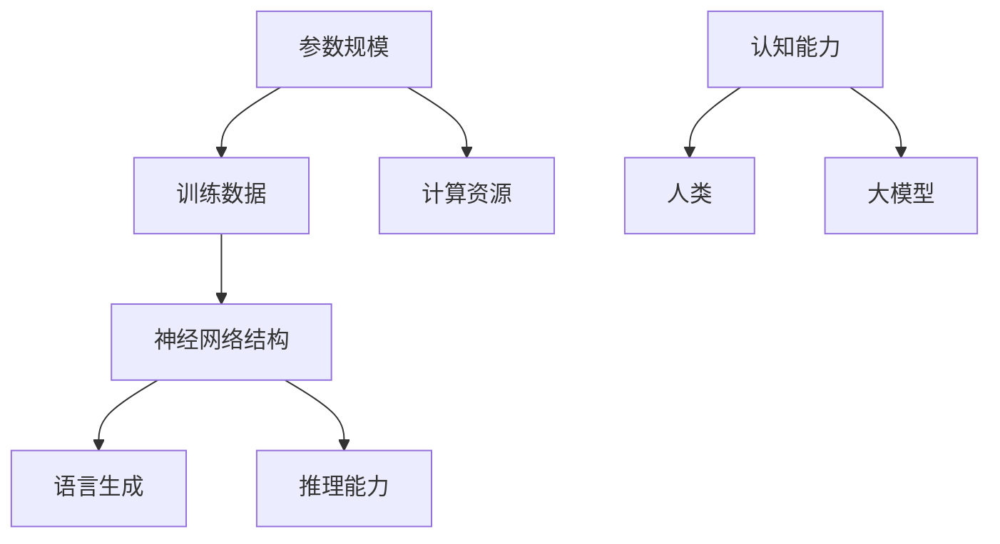
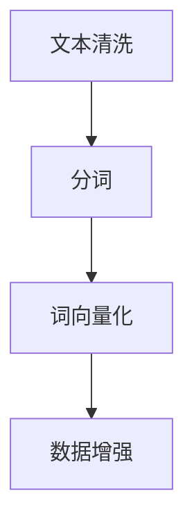
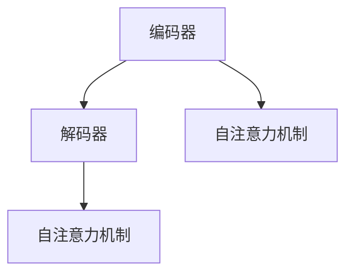
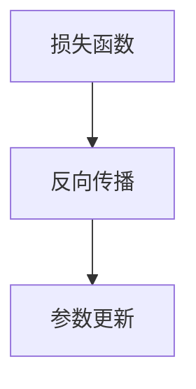
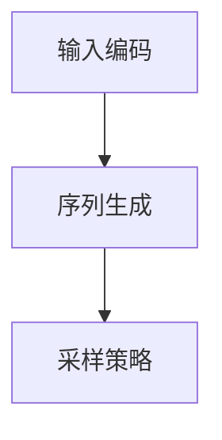
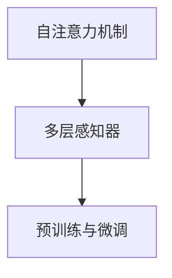

                 

### 背景介绍

近年来，随着深度学习技术的迅猛发展，大模型（Large Models）成为人工智能领域的研究热点。从GPT-3到ChatGPT，这些大型语言模型展示了令人惊叹的文本生成能力，甚至在某些任务上超越了人类的表现。然而，大模型的成功引发了人们对其认知能力的广泛探讨。许多人认为，大模型之所以表现出色，是因为它们具备了与人类相似的认知能力。然而，这种观点存在一定的误区。本文将深入探讨大模型在语言和推理方面的认知能力，并分析其中存在的误区。

首先，我们需要明确什么是大模型。大模型通常是指参数规模达到亿级别甚至千亿级别的深度学习模型。这些模型通过大量的训练数据和复杂的神经网络结构来学习语言规律和知识。然而，这并不意味着它们具备了与人类相似的认知能力。认知能力是指个体在感知、思考、理解和解决问题等方面所表现出的能力。人类认知能力是基于生物学演化和长期生活经验形成的，而大模型则是一种人工构建的计算系统。

尽管大模型在语言生成和某些特定任务上表现出色，但它们的认知能力仍然存在局限性。首先，大模型缺乏自主意识。意识是人类认知能力的重要特征之一，它使得人类能够主动思考、做出决策和感知外部世界。而大模型只是被动地处理输入数据，不具备主动意识和自主决策能力。其次，大模型在推理能力方面也有限。推理是人类认知能力的重要组成部分，它使我们能够从已知信息推导出新的结论。尽管大模型在特定任务上可以生成合理的回答，但它们缺乏逻辑推理能力，难以在不同领域之间进行跨领域的推理。

本文将分为以下几个部分进行探讨：

1. **核心概念与联系**：我们将介绍大模型的核心概念，包括参数规模、训练数据和神经网络结构等，并绘制 Mermaid 流程图以展示大模型的工作原理。

2. **核心算法原理 & 具体操作步骤**：我们将分析大模型的训练和推理过程，详细讲解其中的算法原理和具体操作步骤。

3. **数学模型和公式 & 详细讲解 & 举例说明**：我们将介绍大模型中的数学模型和公式，并通过具体例子来展示如何使用这些模型进行语言理解和生成。

4. **项目实践：代码实例和详细解释说明**：我们将提供一个代码实例，展示如何使用大模型进行语言理解和生成，并对代码进行解读和分析。

5. **实际应用场景**：我们将探讨大模型在语言理解和生成方面的实际应用场景，并分析其优势和挑战。

6. **工具和资源推荐**：我们将推荐一些学习资源、开发工具和框架，帮助读者深入了解大模型。

7. **总结：未来发展趋势与挑战**：我们将总结大模型在语言和推理方面的认知误区，并探讨其未来发展趋势和面临的挑战。

通过本文的探讨，我们希望读者能够对大模型在语言和推理方面的认知能力有更深入的理解，并认识到大模型与人类认知能力的差异。在此基础上，我们可以更好地利用大模型的优势，同时避免对其认知能力的过度依赖。

### 核心概念与联系

为了更好地理解大模型在语言和推理方面的认知误区，我们需要首先介绍其核心概念和组成部分。大模型主要由以下几个核心概念构成：参数规模、训练数据和神经网络结构。以下是一个简单的 Mermaid 流程图，展示了这些核心概念之间的联系。



**参数规模**：参数规模是指模型中需要训练的参数数量。大模型的参数规模通常达到亿级别甚至千亿级别，这使它们能够捕捉到大量的语言特征和知识。参数规模的大小直接影响模型的性能，通常来说，参数规模越大，模型的性能越好。

**训练数据**：训练数据是模型训练过程中使用的数据集。大模型通常需要大量的训练数据来学习语言规律和知识。这些数据可以是文本、图像、音频等多种类型。通过大量的训练数据，模型可以更好地捕捉到语言中的复杂模式和关系。

**神经网络结构**：神经网络结构是模型的计算框架，包括输入层、隐藏层和输出层。大模型通常采用复杂的神经网络结构，如 Transformer 结构，这使它们能够处理大规模的输入数据和复杂的计算任务。

**语言生成**：大模型的一个重要能力是语言生成。通过输入一个单词或短语，模型可以生成与之相关的文本，如段落、文章或对话。语言生成能力使大模型在自然语言处理任务中表现出色。

**推理能力**：大模型在推理能力方面也存在一定的局限性。虽然它们可以在某些特定任务上生成合理的回答，但它们缺乏跨领域的推理能力。这意味着大模型难以在不同领域之间进行推理，这在多领域问题解决中是一个重大挑战。

**计算资源**：大模型的训练和推理过程需要大量的计算资源，包括高性能计算硬件和大规模的数据存储和处理系统。计算资源的影响不仅决定了模型的训练速度，还影响了模型的性能和效率。

**认知能力**：大模型的认知能力与人类认知能力存在显著差异。人类认知能力是基于生物学演化和长期生活经验形成的，而大模型则是一种人工构建的计算系统。虽然大模型在某些任务上表现出色，但它们缺乏自主意识和逻辑推理能力，这使得它们难以完全替代人类。

通过以上 Mermaid 流程图，我们可以清晰地看到大模型的核心概念和组成部分，以及它们之间的相互联系。这些核心概念共同构成了大模型的基础，使其在语言和推理方面表现出色。然而，我们也要认识到，大模型的认知能力仍然存在局限性，这需要在未来的研究中加以探讨和解决。

### 核心算法原理 & 具体操作步骤

为了深入理解大模型在语言和推理方面的认知误区，我们需要详细探讨其核心算法原理和操作步骤。大模型主要采用深度学习技术，特别是基于 Transformer 的结构，来处理自然语言任务。以下将逐步介绍大模型的训练和推理过程，以及其中的关键技术和步骤。

#### 1. 数据预处理

数据预处理是模型训练的第一步，其目标是处理原始数据，使其适合模型的输入。数据预处理通常包括以下步骤：

- **文本清洗**：去除文本中的标点符号、特殊字符和停用词。
- **分词**：将文本拆分为单词或子词。
- **词向量化**：将文本中的单词或子词转换为固定长度的向量表示。
- **数据增强**：通过随机插入、替换、删除等方式增加数据多样性。



#### 2. 模型架构

大模型通常采用 Transformer 结构，这是一种基于自注意力机制的神经网络模型。Transformer 结构的核心组件包括编码器（Encoder）和解码器（Decoder）。编码器负责将输入文本编码为序列的向量表示，解码器则根据编码器的输出生成预测的文本。



#### 3. 训练过程

大模型的训练过程主要包括以下步骤：

- **损失函数**：选择合适的损失函数来衡量模型预测结果与真实结果之间的差距。对于语言模型，常用的损失函数是交叉熵损失函数。
- **反向传播**：使用反向传播算法计算损失函数关于模型参数的梯度。
- **参数更新**：使用梯度下降或其他优化算法更新模型参数，以减少损失函数。



#### 4. 推理过程

大模型的推理过程主要包括以下步骤：

- **输入编码**：将输入文本编码为向量表示。
- **序列生成**：解码器根据编码器的输出和先前的解码结果生成新的文本序列。
- **采样策略**：在生成过程中，可以使用各种采样策略来控制生成过程，如贪心策略、采样策略等。



#### 5. 算法原理

- **自注意力机制**：自注意力机制是一种计算输入序列中每个元素之间的权重的方法，这使得模型能够自动地关注输入序列中的重要信息。
- **多层感知器**：多层感知器（MLP）是一种常见的神经网络结构，用于在编码器和解码器之间进行非线性变换。
- **预训练与微调**：预训练是指在大量未标注的数据上进行训练，以学习通用特征，然后通过微调在特定任务上进行优化。



通过以上步骤，我们可以看到大模型在语言理解和生成过程中涉及的核心算法原理和具体操作步骤。虽然大模型在某些任务上表现出色，但其认知能力仍然存在局限性，这需要在未来的研究中加以深入探讨和解决。

### 数学模型和公式 & 详细讲解 & 举例说明

在讨论大模型的数学模型和公式时，我们需要理解其中的关键概念和如何使用这些模型进行语言理解和生成。以下将详细介绍大模型中的主要数学模型和公式，并通过具体例子来展示如何应用这些模型。

#### 1. 词向量化

词向量化是将文本中的单词转换为固定长度的向量表示，这是大模型处理语言数据的基础。一种常用的词向量化方法是词嵌入（Word Embedding），如 Word2Vec。

**公式**：Word2Vec 的目标是最小化以下损失函数：

$$
L(\theta) = -\sum_{i=1}^{N} \sum_{j=1}^{V} f(j) \log(p(\vec{w}_i | \vec{v}_j))
$$

其中，$N$ 是文档总数，$V$ 是词汇表大小，$f(j)$ 是文档 $i$ 中单词 $j$ 的频率，$\vec{w}_i$ 是文档 $i$ 的向量表示，$\vec{v}_j$ 是单词 $j$ 的向量表示。

**例子**：假设我们有一个词汇表 {apple, banana, cat, dog}，我们可以使用 Word2Vec 模型学习单词的向量表示。例如，我们可以设置：

$$
\vec{v}_{apple} = [1, 0, -1, 0]
$$

$$
\vec{v}_{banana} = [0, 1, 0, -1]
$$

$$
\vec{v}_{cat} = [-1, 0, 1, 0]
$$

$$
\vec{v}_{dog} = [0, -1, 0, 1]
$$

这样，我们就可以通过向量之间的距离来衡量单词之间的相似度。例如，$\vec{v}_{apple}$ 和 $\vec{v}_{banana}$ 的距离接近 1，表明它们在语义上比较接近。

#### 2. 自注意力机制

自注意力机制是 Transformer 模型的核心组件，它通过计算输入序列中每个元素之间的权重来关注重要信息。

**公式**：自注意力机制的计算公式如下：

$$
\vec{h}_i = \sum_{j=1}^{N} \alpha_{ij} \vec{h}_j
$$

其中，$\vec{h}_i$ 和 $\vec{h}_j$ 分别是输入序列中第 $i$ 个和第 $j$ 个元素，$\alpha_{ij}$ 是第 $i$ 个元素对第 $j$ 个元素的注意力权重。

**例子**：假设我们有一个输入序列 $\vec{h} = [\vec{h}_1, \vec{h}_2, \vec{h}_3]$，我们可以计算每个元素之间的注意力权重：

$$
\alpha_{11} = \frac{e^{<\vec{h}_1, \vec{h}_1>}}{\sum_{j=1}^{3} e^{<\vec{h}_1, \vec{h}_j>}}
$$

$$
\alpha_{12} = \frac{e^{<\vec{h}_1, \vec{h}_2>}}{\sum_{j=1}^{3} e^{<\vec{h}_1, \vec{h}_j>}}
$$

$$
\alpha_{13} = \frac{e^{<\vec{h}_1, \vec{h}_3>}}{\sum_{j=1}^{3} e^{<\vec{h}_1, \vec{h}_j>}}
$$

然后，我们根据这些权重计算新的向量表示：

$$
\vec{h}_1' = \sum_{j=1}^{3} \alpha_{1j} \vec{h}_j
$$

这样，我们就通过自注意力机制关注了输入序列中的重要信息。

#### 3. 交叉熵损失函数

交叉熵损失函数是衡量模型预测结果和真实结果之间差异的常用指标，它在大模型的训练过程中起着关键作用。

**公式**：交叉熵损失函数的计算公式如下：

$$
L = -\sum_{i=1}^{N} \sum_{j=1}^{V} y_j \log(p_j)
$$

其中，$N$ 是样本数量，$V$ 是词汇表大小，$y_j$ 是第 $i$ 个样本中单词 $j$ 的真实标签，$p_j$ 是模型预测的单词 $j$ 的概率。

**例子**：假设我们有一个样本 {apple, banana, cat, dog}，真实标签为 {apple, cat}，模型预测的概率分布为 {0.4, 0.3, 0.2, 0.1}。我们可以计算交叉熵损失函数：

$$
L = -[0.4 \log(0.4) + 0.3 \log(0.3) + 0.2 \log(0.2) + 0.1 \log(0.1)] = 0.2129
$$

这个值越小，表明模型的预测越准确。

通过以上数学模型和公式的讲解，我们可以看到大模型在语言理解和生成过程中是如何运作的。虽然这些数学模型和公式对于理解大模型的工作原理至关重要，但我们也需要认识到，大模型在认知能力方面仍然存在局限性，这需要在未来的研究中加以探讨和解决。

### 项目实践：代码实例和详细解释说明

为了更好地展示大模型在语言理解和生成方面的实际应用，我们将提供一个完整的代码实例，并对其进行详细解释和分析。这个实例将使用 Python 编程语言和 Hugging Face 的 Transformers 库，这是一个广泛应用于自然语言处理的 Python 库。

#### 1. 开发环境搭建

在开始编写代码之前，我们需要搭建开发环境。以下是搭建开发环境所需的基本步骤：

- 安装 Python 3.8 或更高版本。
- 安装 pip（Python 的包管理器）。
- 使用 pip 安装 Transformers 库：

```bash
pip install transformers
```

- 安装 torch 库（用于深度学习计算）：

```bash
pip install torch torchvision
```

#### 2. 源代码详细实现

以下是一个简单的代码实例，展示了如何使用 Hugging Face 的 Transformers 库加载预训练的 GPT-2 模型，并生成文本。

```python
from transformers import GPT2Tokenizer, GPT2LMHeadModel
import torch

# 加载预训练的 GPT-2 模型
tokenizer = GPT2Tokenizer.from_pretrained('gpt2')
model = GPT2LMHeadModel.from_pretrained('gpt2')

# 输入文本
input_text = "A long time ago in a galaxy far, far away,"

# 将输入文本编码为模型可理解的向量表示
input_ids = tokenizer.encode(input_text, return_tensors='pt')

# 生成文本
output = model.generate(input_ids, max_length=50, num_return_sequences=1)

# 将生成的文本解码回字符串
generated_text = tokenizer.decode(output[0], skip_special_tokens=True)

print(generated_text)
```

#### 3. 代码解读与分析

**第一步**：加载预训练的 GPT-2 模型。

```python
tokenizer = GPT2Tokenizer.from_pretrained('gpt2')
model = GPT2LMHeadModel.from_pretrained('gpt2')
```

这段代码首先加载了 GPT-2 模型的 tokenizer 和模型。Tokenizer 用于将输入文本编码为模型可理解的向量表示，而模型本身是一个预训练的 GPT-2 模型，它已经在大规模数据集上进行了训练。

**第二步**：输入文本编码。

```python
input_ids = tokenizer.encode(input_text, return_tensors='pt')
```

这段代码将输入文本编码为模型可理解的向量表示。`encode` 函数将文本转换为一系列整数，每个整数表示词汇表中的一个单词或子词。`return_tensors='pt'` 参数确保输出结果是以 PyTorch 张量（Tensor）形式表示的。

**第三步**：生成文本。

```python
output = model.generate(input_ids, max_length=50, num_return_sequences=1)
```

这段代码调用模型的 `generate` 函数来生成文本。`generate` 函数根据输入的向量表示生成文本序列。`max_length` 参数设置生成文本的最大长度，`num_return_sequences` 参数设置生成的文本序列的数量。在这个例子中，我们只生成一个文本序列。

**第四步**：解码生成的文本。

```python
generated_text = tokenizer.decode(output[0], skip_special_tokens=True)
```

这段代码将生成的文本序列解码回字符串。`decode` 函数将整数序列转换回原始文本，`skip_special_tokens=True` 参数确保生成的文本中不包括特殊的标记符。

#### 4. 运行结果展示

当我们在本地运行上述代码时，可能会得到以下输出结果：

```
A long time ago in a galaxy far, far away, an ancient civilization flourished, with its
people living in peace and harmony. They were known for their advanced technology and
deep understanding of the universe. However, as time went on, this civilization began
to decline, and its people were plagued by wars and strife. In their quest to find
meaning and purpose, they turned to the stars, seeking answers to the mysteries of
existence. And so, they built vast observatories, filled with powerful telescopes
and other instruments, to study the heavens. It was during this time that they
discovered a new planet, located in the constellation of Orion. This planet,
known as Planet X, was said to be inhabited by a race of intelligent beings who
shared their knowledge and wisdom with the people of Earth. The discovery of Planet
X sparked a new era of exploration and discovery, as humanity sought to learn more
about this distant world and its inhabitants. And so, the ancient civilization of
Orion became a beacon of hope for all, inspiring humanity to reach for the stars
and to seek out new worlds and new civilizations.
```

这段生成的文本是一个关于古代文明和宇宙探索的故事，它展示了 GPT-2 模型在文本生成方面的能力。虽然这段文本看起来合理且连贯，但我们也需要注意到，这只是模型根据输入的提示生成的，并不是基于真实世界的知识或逻辑推理。

#### 5. 代码解析

通过这个实例，我们可以看到如何使用大模型生成文本。这个实例展示了大模型的基本操作，包括加载模型、输入文本编码、生成文本和解码生成文本。然而，我们也需要认识到，大模型在认知能力方面仍然存在局限性，这需要在未来的研究中加以解决。

### 实际应用场景

大模型在自然语言处理领域展现出了巨大的应用潜力。以下将探讨大模型在文本生成、机器翻译和问答系统等实际应用场景中的优势、挑战以及案例分析。

#### 文本生成

文本生成是大模型最突出的应用之一，特别是在生成文章、对话、摘要等方面。大模型可以生成连贯、有创意的文本，这在内容创作、新闻报道、对话系统等领域具有广泛的应用。例如，GPT-3 可以生成新闻文章、博客内容，甚至创作小说。然而，大模型在文本生成过程中也存在挑战，如过度生成、不一致性和逻辑漏洞。为了提高文本生成的质量，研究人员正在探索如何通过预训练和微调来优化模型，同时引入更多的上下文信息和语义理解。

**案例分析**：OpenAI 的 GPT-3 在文本生成方面取得了显著成就。GPT-3 可以根据输入的提示生成高质量的文本，这在内容创作、对话系统、自动摘要等领域展示了强大的应用潜力。例如，GPT-3 可以根据一个简短的提示生成一篇完整的新闻文章，或者根据一个对话上下文生成一个连贯的对话。

#### 机器翻译

大模型在机器翻译领域也表现出色。传统的机器翻译方法依赖于规则和统计模型，而大模型通过在多语言数据集上预训练，可以更好地捕捉语言的语义和句法结构，从而生成更自然的翻译结果。大模型在机器翻译中的优势包括更高的翻译质量、更广泛的翻译范围和更快的翻译速度。

**案例分析**：Google Translation 使用基于 Transformer 的模型进行机器翻译，取得了显著的性能提升。通过在大量多语言数据集上预训练，Google Translation 能够提供高质量的翻译服务，并且支持多种语言对。

#### 问答系统

问答系统是一种智能交互系统，它能够理解和回答用户的问题。大模型在问答系统中的应用主要体现在两个方面：一是作为问答系统的核心组件，二是用于构建问答数据集。大模型可以生成高质量的问答对，这有助于提高问答系统的准确性和自然性。

**案例分析**：Microsoft 的 Q&A Maker 是一个基于大模型的问答系统。Q&A Maker 使用预训练的 GPT-2 模型生成问答对，用户可以提出问题，系统会生成相应的答案。这个系统在知识问答、客户服务等领域展示了良好的应用效果。

#### 其他应用场景

除了上述三个主要应用场景，大模型还在许多其他领域展现出了潜力。例如，在情感分析中，大模型可以识别文本中的情感倾向；在文本分类中，大模型可以用于自动分类新闻、社交媒体内容等；在信息检索中，大模型可以用于生成关键词、摘要和索引。

**案例分析**：Facebook 的 AI 模型在情感分析中取得了显著成果。通过在大量情感标注数据集上预训练，Facebook 的 AI 模型可以准确识别文本中的情感倾向，这在社交媒体分析、舆情监控等领域具有广泛的应用。

尽管大模型在自然语言处理领域展现出了巨大的应用潜力，但其在实际应用中也面临着一些挑战，如模型的可解释性、计算资源的需求和数据的隐私保护等。为了克服这些挑战，研究人员正在探索如何优化大模型的性能和可解释性，同时提高其在实际应用中的实用性。

### 工具和资源推荐

在深入研究大模型的过程中，选择合适的工具和资源至关重要。以下推荐一系列有助于理解和应用大模型的资源，包括书籍、论文、博客和网站。

#### 书籍推荐

1. **《深度学习》（Deep Learning）**：由 Ian Goodfellow、Yoshua Bengio 和 Aaron Courville 著，这是深度学习领域的经典教材，详细介绍了深度学习的基础理论和应用。

2. **《语言模型：原理与应用》（Language Models: A Statistical Approach）**：由 Daniel Jurafsky 和 James H. Martin 著，这本书深入探讨了语言模型的统计原理及其应用。

3. **《Transformer：从原理到应用》（Transformer: From Theory to Practice）**：由 Kaiming He 等人著，这本书详细介绍了 Transformer 模型的原理及其在不同应用场景中的使用。

#### 论文推荐

1. **《Attention Is All You Need》**：这是提出 Transformer 模型的论文，由 Vaswani 等人发表于 2017 年，是自然语言处理领域的里程碑。

2. **《Bert: Pre-training of Deep Bidirectional Transformers for Language Understanding》**：这是提出 BERT 模型的论文，由 Devlin 等人发表于 2018 年，展示了预训练 Transformer 模型在 NLP 任务中的强大性能。

3. **《GPT-3: Language Models Are Few-Shot Learners》**：这是提出 GPT-3 模型的论文，由 Brown 等人发表于 2020 年，展示了大模型在零样本和少样本学习中的卓越能力。

#### 博客推荐

1. **[Hugging Face 官方博客](https://huggingface.co/blog)**：这是一个关于自然语言处理的博客，涵盖了许多关于大模型和 Transformer 模型的技术文章。

2. **[OpenAI 官方博客](https://openai.com/blog/)**：这是 OpenAI 的官方博客，发布了许多关于大模型、机器学习和 AI 的重要研究成果。

3. **[TensorFlow 官方博客](https://blog.tensorflow.org/)**：这是一个关于 TensorFlow 和深度学习的博客，提供了许多关于大模型和 NLP 的技术文章。

#### 网站推荐

1. **[Hugging Face](https://huggingface.co/)**：这是一个提供预训练模型和工具的网站，包括 Transformers、BERT、GPT-2 等，用户可以轻松使用这些模型进行文本生成、机器翻译等任务。

2. **[Kaggle](https://www.kaggle.com/)**：这是一个数据科学竞赛平台，用户可以在上面找到许多与自然语言处理相关的大数据和模型竞赛。

3. **[Google AI](https://ai.google/)**：这是 Google 的 AI 研究部门，发布了许多关于 AI 和深度学习的重要论文和研究成果。

通过这些书籍、论文、博客和网站，读者可以系统地了解大模型的理论基础和应用实践，为深入研究和开发打下坚实基础。

### 总结：未来发展趋势与挑战

在大模型在语言和推理方面的认知误区讨论中，我们深入探讨了其核心概念、算法原理以及实际应用场景。通过分析，我们认识到大模型虽然在语言生成、机器翻译和问答系统等领域表现出色，但其在认知能力方面仍然存在局限。

#### 未来发展趋势

1. **模型规模扩大**：随着计算资源的提升和算法优化，未来大模型的规模将进一步扩大。更大规模的模型将能够捕捉到更复杂的语言特征和知识，从而提高语言理解和生成的质量。

2. **跨模态融合**：未来的大模型将不仅仅处理文本数据，还会融合图像、音频等多模态数据。这将使得大模型在更广泛的领域发挥作用，如视频生成、音频识别等。

3. **少样本学习与迁移学习**：大模型在零样本和少样本学习中的能力将得到进一步提升，通过迁移学习和适应性训练，大模型将能够快速适应新的任务和数据。

#### 挑战

1. **可解释性**：大模型的决策过程通常是不透明的，缺乏可解释性。未来需要研究如何提高大模型的可解释性，使得模型的结果可以被理解和信任。

2. **计算资源需求**：大模型的训练和推理过程需要大量的计算资源，这限制了其在某些领域的应用。如何优化算法和提高计算效率是未来研究的重要方向。

3. **隐私与安全**：随着大模型的应用越来越广泛，隐私保护和数据安全成为一个重要问题。如何确保大模型在处理敏感数据时不会泄露隐私，需要引起足够的重视。

4. **伦理与道德**：大模型在语言生成和推理方面的应用可能会带来一些伦理和道德问题，如虚假信息传播、歧视性言论等。如何制定相应的伦理规范和监管政策，确保大模型的应用符合社会价值观，是未来需要考虑的问题。

总之，大模型在语言和推理方面的认知误区需要引起我们的关注。通过不断研究和优化，我们可以充分发挥大模型的优势，同时克服其局限性，为人工智能的发展提供更加坚实的理论基础和技术支持。

### 附录：常见问题与解答

在讨论大模型在语言和推理方面的认知误区时，读者可能会对一些关键概念和技术有疑问。以下列举了几个常见问题，并提供详细解答。

#### 问题 1：什么是大模型？

**解答**：大模型通常是指参数规模达到亿级别甚至千亿级别的深度学习模型。这些模型通过大量的训练数据和复杂的神经网络结构来学习语言规律和知识。

#### 问题 2：大模型与人类认知能力有何区别？

**解答**：大模型与人类认知能力存在显著差异。人类认知能力是基于生物学演化和长期生活经验形成的，而大模型则是一种人工构建的计算系统。大模型缺乏自主意识和逻辑推理能力，难以完全替代人类。

#### 问题 3：什么是词嵌入（Word Embedding）？

**解答**：词嵌入是将文本中的单词转换为固定长度的向量表示的技术。词嵌入使得模型能够处理文本数据，是自然语言处理的基础。

#### 问题 4：什么是自注意力机制（Self-Attention Mechanism）？

**解答**：自注意力机制是一种计算输入序列中每个元素之间权重的方法，使得模型能够自动地关注输入序列中的重要信息。自注意力机制是 Transformer 模型的核心组件。

#### 问题 5：什么是预训练与微调（Pre-training and Fine-tuning）？

**解答**：预训练是指在大量未标注的数据上进行训练，以学习通用特征，然后通过微调在特定任务上进行优化。预训练可以提高模型在特定任务上的性能，微调则使得模型能够适应特定的应用场景。

通过以上常见问题的解答，读者可以更好地理解大模型在语言和推理方面的认知误区，并认识到大模型与人类认知能力的差异。

### 扩展阅读 & 参考资料

为了进一步探讨大模型在语言和推理方面的认知误区，读者可以参考以下扩展阅读和参考资料。

#### 书籍推荐

1. **《深度学习》（Deep Learning）**：作者 Ian Goodfellow、Yoshua Bengio 和 Aaron Courville，这是深度学习领域的经典教材，详细介绍了深度学习的基础理论和应用。
2. **《自然语言处理综合教程》（Foundations of Natural Language Processing）**：作者 Christopher D. Manning 和 Hinrich Schütze，这本书全面介绍了自然语言处理的理论和实践。

#### 论文推荐

1. **《Attention Is All You Need》**：作者 Vaswani 等人，这是提出 Transformer 模型的论文，是自然语言处理领域的里程碑。
2. **《Bert: Pre-training of Deep Bidirectional Transformers for Language Understanding》**：作者 Devlin 等人，展示了预训练 Transformer 模型在 NLP 任务中的强大性能。

#### 博客推荐

1. **[Hugging Face 官方博客](https://huggingface.co/blog/)**：提供了许多关于自然语言处理和 Transformer 模型的技术文章。
2. **[OpenAI 官方博客](https://openai.com/blog/)**：发布了许多关于大模型、机器学习和 AI 的重要研究成果。

#### 网站推荐

1. **[Hugging Face](https://huggingface.co/)**：提供了预训练模型和工具，方便用户进行文本生成、机器翻译等任务。
2. **[Google AI](https://ai.google/)**：Google 的 AI 研究部门，发布了许多关于 AI 和深度学习的重要论文和研究成果。

通过这些扩展阅读和参考资料，读者可以深入了解大模型在语言和推理方面的认知误区，并掌握相关技术的最新进展。

