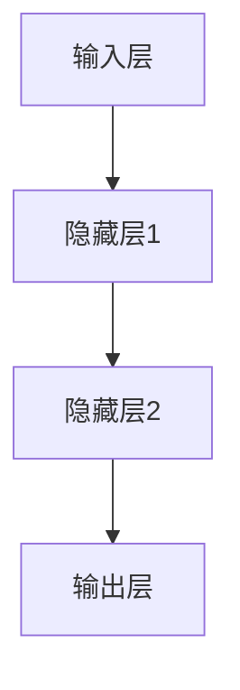
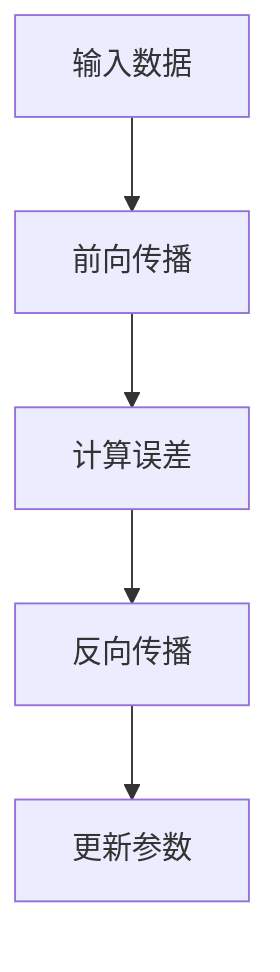

                 

### 背景介绍

在当今信息技术飞速发展的时代，人工智能（AI）正逐步渗透到我们生活的方方面面。从智能家居、自动驾驶到自然语言处理和图像识别，AI技术正在不断革新我们的生活方式。然而，AI技术的发展不仅仅局限于应用层面，更深层次的理论研究同样备受关注。其中，大模型（Large Models）的发展成为了当前AI领域的一大热点。

大模型是指拥有数亿乃至数万亿参数的深度学习模型。这些模型在训练过程中能够学习到海量数据中的复杂模式，从而在各个领域展现出惊人的表现。例如，GPT-3模型拥有1750亿个参数，能够生成高质量的自然语言文本；BERT模型则拥有3.4亿个参数，在多项自然语言处理任务中取得了优异的成绩。

尽管大模型在AI领域中取得了显著的成果，但人们对其认知和理解仍然存在诸多误解。一方面，许多人认为大模型具有类似人类的智能，能够进行复杂的推理和思考。另一方面，有人认为大模型仅仅是“黑箱”，其内部运作机制并不透明，难以解释。

本文旨在探讨大模型的认知误解，通过逐步分析推理的方式，揭示大模型的真实面貌。我们将从以下几个方面展开讨论：

1. **大模型的基本原理与架构**：介绍大模型的基本概念，包括其结构、训练方法和应用场景。
2. **大模型的推理能力**：分析大模型的推理能力，探讨其是否具有类似人类的智能。
3. **大模型的可解释性问题**：讨论大模型的可解释性，解释为什么大模型被认为是“黑箱”。
4. **大模型在实际应用中的挑战与局限性**：分析大模型在实际应用中面临的挑战和局限性。

通过本文的讨论，我们希望能够帮助读者更加深入地理解大模型，认清其优势与不足，从而为未来的AI研究和发展提供有价值的参考。

### 核心概念与联系

为了深入探讨大模型的认知误解，我们首先需要了解大模型的基本原理与架构。大模型，顾名思义，是指那些具有数亿乃至数万亿参数的深度学习模型。这些模型在训练过程中能够学习到海量数据中的复杂模式，从而在各个领域展现出惊人的表现。

#### 1. 大模型的结构

大模型通常采用深度神经网络（Deep Neural Network，DNN）的结构。深度神经网络由多个层次（layer）的神经元（neuron）组成，每个层次都对输入数据进行加工处理，最终输出一个结果。层次之间的连接构成了网络的“结构”。在DNN中，每个神经元都与前一层的所有神经元相连，并通过权重（weight）和偏置（bias）进行加权求和，然后通过激活函数（activation function）进行处理。

以下是一个简单的DNN结构示例：



在这个示例中，输入层（Input Layer）接收外部输入数据，经过隐藏层（Hidden Layer）的加工处理后，最终由输出层（Output Layer）生成预测结果。

#### 2. 大模型的训练方法

大模型的训练通常采用反向传播（Backpropagation）算法。反向传播是一种基于梯度下降（Gradient Descent）的优化方法，用于调整网络中的权重和偏置，使预测结果更加接近真实值。

训练过程可以分为以下几个步骤：

1. **前向传播**：将输入数据传递到网络中，经过各层的加工处理，最终得到输出结果。
2. **计算误差**：计算输出结果与真实值之间的误差。
3. **反向传播**：将误差传递回网络，通过反向传播算法计算各层的梯度，并根据梯度调整权重和偏置。
4. **更新参数**：使用调整后的权重和偏置更新网络参数。

以下是一个简单的反向传播算法流程图：



#### 3. 大模型的应用场景

大模型在多个领域都取得了显著的成果。以下是一些典型应用场景：

1. **自然语言处理**：大模型在自然语言处理（Natural Language Processing，NLP）领域表现出色。例如，GPT-3模型能够生成高质量的文本，BERT模型则在多项NLP任务中取得了优异的成绩。
2. **计算机视觉**：大模型在计算机视觉（Computer Vision，CV）领域同样有着广泛的应用。例如，ResNet模型在图像分类任务中取得了突破性的成绩；YOLO模型则在目标检测任务中表现出色。
3. **语音识别**：大模型在语音识别（Automatic Speech Recognition，ASR）领域也取得了显著的成果。例如，基于深度学习的语音识别系统在准确率和速度方面都有了显著的提升。
4. **推荐系统**：大模型在推荐系统（Recommender System）中也发挥了重要作用。例如，基于深度学习的推荐算法能够根据用户的历史行为和兴趣，为用户推荐相关的内容。

#### 4. 大模型的挑战与局限性

尽管大模型在多个领域取得了显著成果，但其在实际应用中仍然面临诸多挑战和局限性。以下是一些主要挑战：

1. **计算资源需求**：大模型通常需要大量的计算资源和时间进行训练。这意味着在实际应用中，大模型可能难以在资源受限的环境下运行。
2. **数据依赖性**：大模型的训练依赖于海量数据。在数据稀缺或数据质量不高的情况下，大模型的表现可能会受到影响。
3. **可解释性问题**：大模型的内部运作机制复杂，其推理过程往往难以解释。这使得大模型在实际应用中存在一定的风险和不确定性。
4. **过拟合问题**：大模型在训练过程中容易发生过拟合现象，即模型对训练数据的拟合程度过高，而无法对新数据产生良好的预测效果。

为了解决这些问题，研究人员正在探索多种方法，包括改进模型结构、优化训练算法、增强数据质量等。通过不断的研究和探索，我们有理由相信大模型将在未来的AI发展中发挥更加重要的作用。

### 核心算法原理 & 具体操作步骤

大模型的核心算法原理主要基于深度神经网络（DNN）的反向传播（Backpropagation）算法。反向传播算法是一种基于梯度下降（Gradient Descent）的优化方法，用于调整网络中的权重（weight）和偏置（bias），从而提高模型的预测准确性。下面我们将详细解释反向传播算法的原理和具体操作步骤。

#### 1. 梯度下降原理

梯度下降是一种优化算法，用于最小化损失函数。在神经网络中，损失函数衡量的是预测值与真实值之间的差距。梯度下降的核心思想是通过不断调整网络的权重和偏置，使得损失函数的值逐渐减小，从而达到最小化损失的目的。

在梯度下降过程中，我们需要计算损失函数关于每个权重的梯度。梯度是指损失函数在某一点处的斜率，它指示了损失函数在该点处的最优调整方向。通过计算梯度，我们可以找到损失函数的最小值，从而得到最佳的权重和偏置。

#### 2. 反向传播算法

反向传播算法是一种实现梯度下降的方法，它通过前向传播和反向传播两个过程来计算梯度。

**前向传播**：

前向传播是指将输入数据传递到网络中，通过各层的神经元计算，最终得到输出结果。在每一层，神经元将输入值乘以权重，加上偏置，然后通过激活函数进行处理。激活函数常用的有 sigmoid 函数、ReLU 函数等。

前向传播的具体步骤如下：

1. 初始化权重和偏置，通常采用随机初始化。
2. 将输入数据输入到网络的输入层。
3. 通过各层的神经元计算，将输出值传递到下一层。
4. 最终得到输出层的预测结果。

**反向传播**：

反向传播是指从输出层开始，逐层向前计算每个神经元关于输入数据的梯度。具体步骤如下：

1. 计算输出层神经元的梯度。
2. 将输出层神经元的梯度传递到隐藏层。
3. 对于每一层，计算该层所有神经元的梯度。
4. 更新该层的权重和偏置。

反向传播的具体计算过程如下：

**计算输出层梯度**：

输出层神经元的梯度可以通过损失函数的导数计算得到。常用的损失函数有均方误差（MSE）、交叉熵（Cross-Entropy）等。以下以均方误差为例，介绍输出层梯度的计算方法。

假设输出层有 $L$ 个神经元，预测结果为 $y$，真实标签为 $t$，则均方误差（MSE）为：

$$
MSE = \frac{1}{2} \sum_{i=1}^{L} (y_i - t_i)^2
$$

均方误差关于每个输出神经元 $y_i$ 的梯度为：

$$
\frac{\partial MSE}{\partial y_i} = y_i - t_i
$$

**计算隐藏层梯度**：

隐藏层神经元的梯度可以通过链式法则（Chain Rule）计算得到。假设当前层为第 $l$ 层，输出层为第 $L$ 层，则第 $l$ 层神经元 $a_l$ 的梯度可以表示为：

$$
\frac{\partial MSE}{\partial a_l} = \frac{\partial MSE}{\partial z_l} \cdot \frac{\partial z_l}{\partial a_l}
$$

其中，$z_l$ 是第 $l$ 层神经元的输出，$a_l$ 是第 $l$ 层神经元的输入。

**更新权重和偏置**：

在计算完梯度后，我们需要更新权重和偏置。权重和偏置的更新公式如下：

$$
w_l^{(i)} := w_l^{(i)} - \alpha \cdot \frac{\partial MSE}{\partial w_l^{(i)}}
$$

$$
b_l^{(i)} := b_l^{(i)} - \alpha \cdot \frac{\partial MSE}{\partial b_l^{(i)}}
$$

其中，$w_l^{(i)}$ 是第 $l$ 层第 $i$ 个神经元的权重，$b_l^{(i)}$ 是第 $l$ 层第 $i$ 个神经元的偏置，$\alpha$ 是学习率。

通过不断迭代更新权重和偏置，模型将逐渐收敛，预测结果将逐渐接近真实值。

#### 3. 梯度消失与梯度爆炸

在反向传播算法中，梯度消失和梯度爆炸是两个常见问题。

**梯度消失**：

当网络层数较多或激活函数的选择不当时，梯度可能在反向传播过程中逐渐减小。这导致网络难以更新权重和偏置，从而使训练过程变得非常缓慢。

**梯度爆炸**：

梯度爆炸是指梯度在反向传播过程中逐渐增大，可能导致网络参数的更新过大，从而使模型无法收敛。

为了解决这些问题，研究人员提出了多种方法，如：

1. **归一化**：通过归一化输入数据和激活值，减少梯度消失和梯度爆炸问题。
2. **权重初始化**：通过合理选择权重和偏置的初始化方法，降低梯度消失和梯度爆炸的风险。
3. **使用激活函数**：选择合适的激活函数，如ReLU函数，可以提高梯度传播的效果。

通过以上方法，我们可以更好地应对反向传播算法中的梯度问题，从而提高模型的训练效果。

### 数学模型和公式 & 详细讲解 & 举例说明

在深度学习模型中，数学模型和公式扮演着至关重要的角色。它们不仅描述了模型的内部工作机制，还为我们提供了调整模型参数、优化模型性能的工具。在本节中，我们将详细讲解大模型中的几个关键数学模型和公式，并通过具体示例来说明其应用和效果。

#### 1. 前向传播与反向传播公式

深度学习模型的前向传播和反向传播过程可以通过以下公式表示：

**前向传播**：

对于一层神经网络，输入 $x$ 通过权重 $w$ 和偏置 $b$ 进行线性变换，然后通过激活函数 $f$ 得到输出 $y$：

$$
z = wx + b \\
y = f(z)
$$

常见的激活函数有：

- **Sigmoid函数**：

$$
f(x) = \frac{1}{1 + e^{-x}}
$$

- **ReLU函数**：

$$
f(x) = \max(0, x)
$$

**反向传播**：

在反向传播过程中，我们计算每个层输出关于输入的梯度，从而更新权重和偏置。以下是反向传播的详细计算过程：

对于输出层，损失函数 $J$ 关于输出 $y$ 的梯度可以表示为：

$$
\frac{\partial J}{\partial y} = - \frac{\partial L}{\partial y} = y - t
$$

其中，$L$ 是损失函数，$t$ 是真实标签。

对于隐藏层，梯度可以通过链式法则进行计算：

$$
\frac{\partial J}{\partial z} = \frac{\partial J}{\partial y} \cdot \frac{\partial y}{\partial z} \\
\frac{\partial z}{\partial x} = \frac{\partial z}{\partial w} \cdot \frac{\partial w}{\partial x} + \frac{\partial z}{\partial b} \cdot \frac{\partial b}{\partial x}
$$

其中，$x$ 是输入，$w$ 和 $b$ 分别是权重和偏置。

#### 2. 损失函数

损失函数是衡量模型预测值与真实值之间差距的关键指标。常见的损失函数有：

- **均方误差（MSE）**：

$$
MSE = \frac{1}{m} \sum_{i=1}^{m} (y_i - \hat{y}_i)^2
$$

其中，$y_i$ 是真实标签，$\hat{y}_i$ 是预测值，$m$ 是样本数量。

- **交叉熵（Cross-Entropy）**：

$$
CE = - \frac{1}{m} \sum_{i=1}^{m} [y_i \cdot \log(\hat{y}_i) + (1 - y_i) \cdot \log(1 - \hat{y}_i)]
$$

其中，$y_i$ 是真实标签，$\hat{y}_i$ 是预测概率。

#### 3. 示例说明

为了更好地理解这些数学模型和公式，我们通过一个简单的示例来说明。

假设我们有一个二分类问题，输入为 $x$，输出为 $y$（0或1）。真实标签 $t$ 为1，预测概率 $\hat{y}$ 为0.6。

**前向传播**：

输入 $x$ 经过一层神经网络，权重 $w$ 为0.5，偏置 $b$ 为0。激活函数为ReLU函数。

$$
z = wx + b = 0.5 \cdot x + 0 \\
y = \max(0, z) = \max(0, 0.5 \cdot x) = 0
$$

**反向传播**：

输出层损失函数为MSE：

$$
J = MSE = \frac{1}{2} \cdot (y - t)^2 = \frac{1}{2} \cdot (0 - 1)^2 = 0.5
$$

输出层关于输入的梯度：

$$
\frac{\partial J}{\partial y} = y - t = 0 - 1 = -1
$$

隐藏层关于输入的梯度：

$$
\frac{\partial J}{\partial z} = \frac{\partial J}{\partial y} \cdot \frac{\partial y}{\partial z} = -1 \cdot \frac{\partial \max(0, z)}{\partial z} = -1
$$

更新权重和偏置：

$$
w := w - \alpha \cdot \frac{\partial J}{\partial w} = 0.5 - \alpha \cdot (-1) \\
b := b - \alpha \cdot \frac{\partial J}{\partial b} = 0 - \alpha \cdot 0 = 0
$$

通过这个简单的示例，我们可以看到前向传播和反向传播的过程以及损失函数和梯度计算的方法。在实际应用中，这些数学模型和公式可以帮助我们优化模型性能，提高预测准确性。

### 项目实践：代码实例和详细解释说明

为了更好地理解大模型的应用和实现，我们将通过一个具体的案例来进行项目实践。本案例将利用TensorFlow框架实现一个基于深度学习的手写数字识别项目。

#### 1. 开发环境搭建

在进行项目实践之前，我们需要搭建合适的开发环境。以下是搭建TensorFlow开发环境的步骤：

**步骤1：安装Python**  
确保系统已安装Python 3.6及以上版本。

**步骤2：安装TensorFlow**  
在终端执行以下命令安装TensorFlow：

```bash
pip install tensorflow
```

**步骤3：验证安装**  
在Python环境中执行以下代码，验证TensorFlow是否安装成功：

```python
import tensorflow as tf
print(tf.__version__)
```

如果输出TensorFlow的版本信息，则说明安装成功。

#### 2. 源代码详细实现

以下是本项目的源代码，我们将逐行进行详细解释。

```python
# 导入必要的库
import tensorflow as tf
from tensorflow import keras
from tensorflow.keras import layers
from tensorflow.keras.datasets import mnist
import numpy as np

# 加载数据集
(x_train, y_train), (x_test, y_test) = mnist.load_data()

# 数据预处理
x_train = x_train.astype("float32") / 255
x_test = x_test.astype("float32") / 255

# 将标签转换为one-hot编码
y_train = keras.utils.to_categorical(y_train, 10)
y_test = keras.utils.to_categorical(y_test, 10)

# 建立模型
model = keras.Sequential()
model.add(layers.Conv2D(32, (3, 3), activation="relu", input_shape=(28, 28, 1)))
model.add(layers.MaxPooling2D((2, 2)))
model.add(layers.Conv2D(64, (3, 3), activation="relu"))
model.add(layers.MaxPooling2D((2, 2)))
model.add(layers.Conv2D(64, (3, 3), activation="relu"))
model.add(layers.Flatten())
model.add(layers.Dense(64, activation="relu"))
model.add(layers.Dense(10, activation="softmax"))

# 编译模型
model.compile(optimizer="adam", loss="categorical_crossentropy", metrics=["accuracy"])

# 训练模型
model.fit(x_train, y_train, epochs=10, batch_size=64)

# 评估模型
test_score = model.evaluate(x_test, y_test, verbose=2)
print("Test accuracy:", test_score[1])
```

**代码解释**：

- **导入库**：首先导入TensorFlow和相关库，如Keras（一个高层次的神经网络API）。

- **加载数据集**：使用Keras内置的MNIST手写数字数据集。MNIST数据集包含60,000个训练样本和10,000个测试样本，每个样本是一个28x28的灰度图像，标签是一个0到9之间的整数。

- **数据预处理**：将图像数据转换为浮点数类型，并归一化到0到1之间。将标签转换为one-hot编码，以便用于多分类问题。

- **建立模型**：使用Keras的Sequential模型，添加多层卷积神经网络（Conv2D），最大池化层（MaxPooling2D），全连接层（Dense）。卷积层用于提取图像特征，全连接层用于分类。

- **编译模型**：配置优化器（adam），损失函数（categorical_crossentropy，用于多分类问题），以及评估指标（accuracy）。

- **训练模型**：使用fit函数训练模型，设置训练轮次（epochs）和批处理大小（batch_size）。

- **评估模型**：使用evaluate函数评估模型在测试集上的表现，并打印测试准确率。

#### 3. 代码解读与分析

**卷积层（Conv2D）**：

卷积层是神经网络中最基本的层之一，用于提取图像的局部特征。在这个项目中，我们使用了三层卷积层，每层卷积核的大小分别为3x3。卷积层通过滑动卷积核（filter）在输入图像上，计算局部特征图的卷积值。激活函数（ReLU）用于增加网络的非线性能力。

```python
model.add(layers.Conv2D(32, (3, 3), activation="relu", input_shape=(28, 28, 1)))
model.add(layers.MaxPooling2D((2, 2)))
model.add(layers.Conv2D(64, (3, 3), activation="relu"))
model.add(layers.MaxPooling2D((2, 2)))
model.add(layers.Conv2D(64, (3, 3), activation="relu"))
```

**全连接层（Dense）**：

全连接层将前一层的特征映射到输出类别。在最后一层，我们使用了softmax激活函数，将输出概率映射到10个类别中。

```python
model.add(layers.Flatten())
model.add(layers.Dense(64, activation="relu"))
model.add(layers.Dense(10, activation="softmax"))
```

**优化器和损失函数**：

我们使用Adam优化器，这是一种自适应学习率优化算法。损失函数使用categorical_crossentropy，这是一个适合多分类问题的损失函数。

```python
model.compile(optimizer="adam", loss="categorical_crossentropy", metrics=["accuracy"])
```

**模型训练和评估**：

通过fit函数进行模型训练，设置10个训练轮次和64个批处理大小。最后，使用evaluate函数评估模型在测试集上的准确率。

```python
model.fit(x_train, y_train, epochs=10, batch_size=64)
test_score = model.evaluate(x_test, y_test, verbose=2)
print("Test accuracy:", test_score[1])
```

通过这个案例，我们展示了如何使用TensorFlow实现一个手写数字识别项目。代码简洁明了，易于理解。在实际应用中，我们可以根据需要调整网络结构、优化器和学习率等参数，以获得更好的模型性能。

### 实际应用场景

大模型在多个实际应用场景中展现出了强大的能力和广泛的应用前景。以下是一些典型应用场景及其实际案例：

#### 1. 自然语言处理（NLP）

大模型在自然语言处理领域有着广泛的应用，包括文本生成、情感分析、机器翻译、问答系统等。例如，GPT-3模型凭借其强大的语言理解和生成能力，在多个NLP任务中取得了显著的成果。在文本生成方面，GPT-3可以生成高质量的文章、新闻、故事等；在情感分析方面，GPT-3可以分析用户评论、社交媒体帖子等，判断其情感倾向；在机器翻译方面，GPT-3可以提供高质量的机器翻译服务，支持多种语言之间的翻译。

#### 2. 计算机视觉（CV）

大模型在计算机视觉领域同样表现卓越，包括图像分类、目标检测、图像生成等。例如，ResNet模型在图像分类任务中取得了突破性的成绩，大大提升了图像分类的准确率；YOLO模型则在目标检测任务中表现出色，可以在实时应用中快速检测出图像中的目标物体；生成对抗网络（GAN）可以生成高质量、逼真的图像，应用于图像修复、风格迁移等领域。

#### 3. 语音识别（ASR）

大模型在语音识别领域也取得了显著进展，可以用于语音到文本的转换、语音情感分析等。例如，基于深度学习的语音识别系统在准确率和速度方面都有了显著的提升，可以应用于智能助手、语音搜索、实时字幕生成等领域。

#### 4. 推荐系统

大模型在推荐系统中也发挥了重要作用，可以基于用户的历史行为和兴趣，为用户推荐相关的内容、商品等。例如，基于深度学习的推荐算法可以更好地理解用户的兴趣和需求，提供个性化的推荐服务。

#### 5. 医疗健康

大模型在医疗健康领域也展现出强大的潜力，包括疾病诊断、药物研发、健康监测等。例如，通过分析患者的病历、基因数据等，大模型可以帮助医生进行更准确的疾病诊断和治疗方案推荐；在药物研发方面，大模型可以预测药物分子的活性，加速新药的发现和研发过程。

#### 6. 金融领域

大模型在金融领域同样有着广泛的应用，包括股票市场预测、风险控制、信用评估等。例如，通过分析历史股价、宏观经济数据等，大模型可以预测股票市场的走势，为投资者提供决策参考；在风险控制方面，大模型可以识别潜在的金融风险，提高金融机构的风险管理水平。

#### 7. 教育领域

大模型在教育领域也展现出巨大的潜力，包括智能辅导、个性化教学、考试评分等。例如，通过分析学生的学习行为和成绩，大模型可以提供个性化的学习建议，帮助学生提高学习效果；在考试评分方面，大模型可以自动评阅试卷，提高评分效率和准确性。

总的来说，大模型在各个领域都有着广泛的应用和巨大的潜力，为人类社会的进步和发展带来了新的机遇和挑战。

### 工具和资源推荐

为了帮助读者更好地学习和实践大模型技术，本文将推荐一些优质的工具和资源。

#### 1. 学习资源推荐

**书籍**：

- 《深度学习》（Ian Goodfellow, Yoshua Bengio, Aaron Courville 著）：这是一本经典的深度学习教材，详细介绍了深度学习的基础知识和核心算法。

- 《Python深度学习》（François Chollet 著）：这本书是TensorFlow的主要作者所写，适合初学者和有一定基础的读者，详细介绍了深度学习在Python中的实现。

- 《动手学深度学习》（阿斯顿·张等著）：这本书是一本开源的深度学习教材，通过大量的实例和代码，帮助读者更好地理解深度学习的原理和实践。

**论文**：

- “A Theoretical Exploration of Deep Learning” by Y. LeCun, Y. Bengio, and G. Hinton：这篇论文提出了深度学习的三个关键问题，并探讨了深度学习的理论基础。

- “Bridging the Gap Between Generative and Discriminative Models” by D. P. Kingma and M. Welling：这篇论文介绍了深度生成模型（如GAN）的基本原理和应用。

**博客**：

- Deep Learning Blog：由Ian Goodfellow创办，介绍了深度学习领域的最新研究成果和应用。

- Fast.ai Blog：这是一个提供免费深度学习课程的博客，内容涵盖深度学习的实用技巧和最佳实践。

**网站**：

- TensorFlow.org：这是TensorFlow的官方网站，提供了丰富的文档、教程和示例代码。

- Keras.io：Keras是一个高级神经网络API，提供了简洁易用的接口，适合快速构建和实验深度学习模型。

#### 2. 开发工具框架推荐

- **TensorFlow**：TensorFlow是Google开发的开源深度学习框架，支持多种平台和编程语言，适合用于构建和训练大规模深度学习模型。

- **PyTorch**：PyTorch是Facebook开发的开源深度学习框架，具有动态计算图和灵活的编程接口，适合快速原型开发和实验。

- **Keras**：Keras是一个高级神经网络API，基于TensorFlow和Theano开发，提供了简洁易用的接口，适合快速构建和训练深度学习模型。

- **MXNet**：MXNet是Apache基金会开发的开源深度学习框架，支持多种编程语言和平台，适合大规模生产环境中的深度学习应用。

#### 3. 相关论文著作推荐

- “Deep Learning” by Ian Goodfellow, Yoshua Bengio, and Aaron Courville：这是一本深度学习领域的经典著作，详细介绍了深度学习的理论基础和应用。

- “Generative Adversarial Nets” by Ian Goodfellow et al.：这篇论文提出了生成对抗网络（GAN）的基本原理和应用。

- “Bridging the Gap Between Generative and Discriminative Models” by D. P. Kingma and M. Welling：这篇论文探讨了深度生成模型和判别模型之间的联系。

通过以上工具和资源的推荐，读者可以更好地了解大模型技术，掌握深度学习的核心原理和实践方法。

### 总结：未来发展趋势与挑战

随着人工智能技术的不断发展，大模型已经成为AI领域的研究热点和应用方向。然而，大模型的发展并非一帆风顺，其面临着诸多挑战和机遇。

**发展趋势**：

1. **模型规模的不断扩大**：随着计算资源和数据量的增加，大模型将不断突破现有的规模限制，向更大、更复杂的模型演进。例如，谷歌的TF-Indexing算法已经能够高效地处理万亿级别的参数。

2. **模型结构的创新**：研究人员将持续探索新的神经网络结构，以提高大模型的性能和可解释性。例如，Transformer结构的广泛应用标志着序列建模的新时代。

3. **跨领域的融合应用**：大模型在不同领域的应用将越来越深入，如医疗健康、金融、教育等，推动AI技术的跨界发展。

4. **数据隐私与安全**：随着大模型对数据依赖性的增强，如何确保数据隐私和安全将成为重要议题。隐私增强学习（Privacy-Preserving Learning）和联邦学习（Federated Learning）等技术有望解决这一问题。

**挑战**：

1. **计算资源需求**：大模型通常需要大量的计算资源和时间进行训练，这对硬件设施提出了更高要求。如何优化算法、提高计算效率是当前研究的一个重要方向。

2. **数据质量和多样性**：大模型对数据质量有较高要求，且数据多样性对模型性能有很大影响。如何获取更多、更高质量的数据，以及如何解决数据不平衡问题是亟待解决的挑战。

3. **可解释性问题**：大模型的内部运作机制复杂，其推理过程往往难以解释。如何提高大模型的可解释性，使其决策过程更加透明和可靠，是当前研究的一个重要难题。

4. **过拟合问题**：大模型在训练过程中容易发生过拟合现象，即模型对训练数据的拟合程度过高，而无法对新数据产生良好的预测效果。如何避免过拟合，提高模型的泛化能力，是当前研究的一个热点。

5. **伦理与法律问题**：大模型在应用过程中，可能会涉及到伦理和法律问题，如歧视、隐私泄露等。如何制定合适的伦理和法律框架，确保大模型的合理应用，是当前研究的一个重要方向。

总的来说，大模型技术的发展前景广阔，但也面临着诸多挑战。通过不断的研究和创新，我们有理由相信，大模型将在未来的AI发展中发挥更加重要的作用，推动人类社会的进步。

### 附录：常见问题与解答

**Q1**：为什么大模型需要大量的数据？

A1：大模型需要大量的数据是因为深度神经网络通过从大量数据中学习，提取出更加复杂和抽象的特征。这些特征有助于提高模型的泛化能力，使其能够在未见过的数据上产生良好的预测效果。数据量越大，模型能够学习的模式就越多，从而提高模型的性能。

**Q2**：大模型的训练时间为什么那么长？

A2：大模型的训练时间长主要是由于以下几个原因：

1. **模型规模**：大模型拥有数亿乃至数万亿的参数，每个参数都需要通过大量数据来优化，从而需要更多的计算资源。
2. **梯度下降**：训练大模型通常采用梯度下降算法，每个梯度计算都需要对大量数据进行计算，这导致了计算复杂度较高。
3. **硬件限制**：尽管计算硬件的进步提高了计算速度，但大模型的训练仍然需要大量的计算资源，这可能会受到硬件限制。

**Q3**：为什么大模型容易发生过拟合？

A3：大模型容易发生过拟合的原因主要有以下几点：

1. **参数数量多**：大模型拥有大量的参数，这些参数可能会对训练数据产生过拟合，使得模型在训练数据上表现优异，但在未见过的数据上表现不佳。
2. **训练数据有限**：当训练数据量相对较少时，大模型可能会过度依赖这些数据，从而对训练数据进行过拟合。
3. **缺乏正则化**：大模型通常没有采用足够的正则化方法，如dropout、L1/L2正则化等，这可能导致模型过拟合。

**Q4**：如何解决大模型的可解释性问题？

A4：解决大模型的可解释性问题可以从以下几个方面着手：

1. **可视化**：通过可视化模型的结构和权重，帮助用户理解模型的工作原理。
2. **解释性算法**：开发专门的可解释性算法，如LIME、SHAP等，这些算法可以提供局部解释，帮助用户理解模型在特定输入下的决策过程。
3. **简化模型**：通过简化模型结构，减少参数数量，提高模型的可解释性。
4. **数据解释**：对输入数据进行解释，帮助用户理解输入数据如何影响模型输出。

**Q5**：大模型在医疗健康领域有哪些应用？

A5：大模型在医疗健康领域有多种应用，包括：

1. **疾病诊断**：通过分析患者的病历和基因数据，大模型可以帮助医生进行疾病诊断和风险评估。
2. **药物研发**：大模型可以预测药物分子的活性，加速新药的发现和研发过程。
3. **健康监测**：大模型可以分析健康数据，如心率、血压等，提供个性化的健康建议。
4. **医学图像分析**：大模型可以用于医学图像的分割、识别和分类，辅助医生进行诊断。

### 扩展阅读 & 参考资料

为了进一步深入理解大模型的相关知识，以下是几篇具有代表性的学术论文和书籍推荐：

1. **论文**：

   - “A Theoretical Exploration of Deep Learning” by Y. LeCun, Y. Bengio, and G. Hinton
   - “Bridging the Gap Between Generative and Discriminative Models” by D. P. Kingma and M. Welling
   - “Generative Adversarial Nets” by Ian Goodfellow et al.

2. **书籍**：

   - 《深度学习》（Ian Goodfellow, Yoshua Bengio, Aaron Courville 著）
   - 《Python深度学习》（François Chollet 著）
   - 《动手学深度学习》（阿斯顿·张等著）

3. **网站**：

   - TensorFlow.org
   - Keras.io
   - Fast.ai Blog

通过阅读这些论文和书籍，读者可以更全面地了解大模型的理论基础、实现方法及其应用领域，为自己的研究和实践提供有价值的参考。

