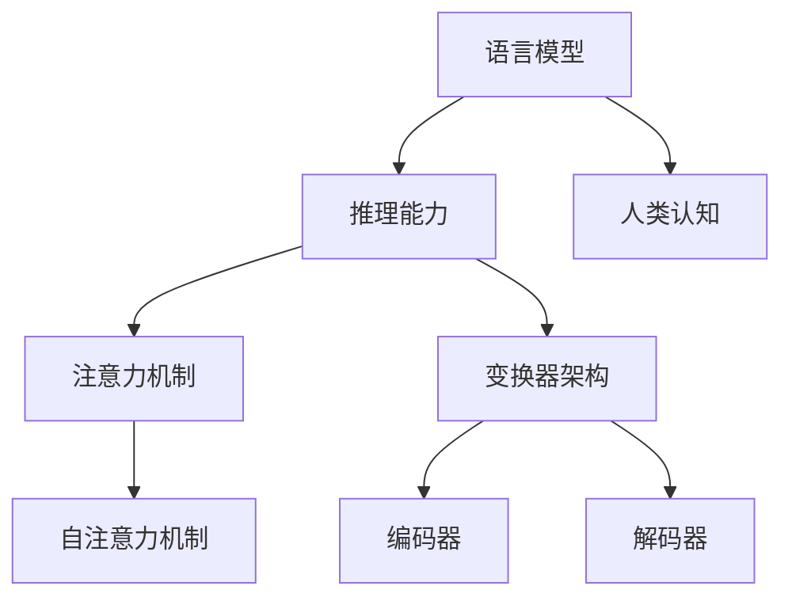

                 

### 背景介绍

近年来，随着深度学习和大数据技术的快速发展，大型语言模型如GPT-3、BERT、T5等取得了令人瞩目的成绩。这些模型在文本生成、机器翻译、问答系统等NLP任务上展现了极高的准确性和性能。然而，尽管这些模型在各种应用中取得了巨大成功，但人们对它们的认知能力仍然存在很多误解。特别是，人们常常将语言模型的推理能力等同于人类的推理能力，这种误解在一定程度上限制了人们对语言模型应用价值的认识。

本文旨在探讨语言模型与人类推理之间的差异，分析大模型在认知过程中可能存在的误解。我们将通过以下方面展开讨论：

1. **语言模型的基本原理**：介绍语言模型的工作机制，包括自注意力机制、变换器架构等，以便读者了解语言模型的内部运作。
2. **语言模型与人类推理的比较**：从信息处理方式、逻辑推理能力和创造力等方面，分析语言模型与人类推理的异同点。
3. **语言模型的认知误解**：探讨大模型在认知过程中可能出现的误解，如对抽象概念的误解、对逻辑关系的误解等。
4. **实际应用场景**：结合具体案例，分析大模型在实际应用中的表现和局限性。
5. **未来发展趋势与挑战**：探讨大模型在认知能力提升方面的未来发展趋势，以及面临的挑战。

通过本文的探讨，我们希望读者能够更加清晰地理解语言模型的工作原理和应用场景，避免将语言模型的推理能力过度夸大，从而在实际应用中更加科学、合理地使用这些模型。

### 核心概念与联系

为了深入探讨语言模型与人类推理之间的关系，我们需要先明确几个核心概念，并理解它们之间的联系。以下是本文将涉及的核心概念：

1. **语言模型**：语言模型是一种用于预测文本序列的概率分布的模型。它通常基于大量的文本数据，通过机器学习技术（如神经网络、变换器架构等）训练得到。语言模型的核心任务是生成符合自然语言规则和语义逻辑的文本。

2. **推理能力**：推理能力指的是从已知信息中推断出新信息的能力。人类具有高度的推理能力，能够在复杂的情境中进行分析、判断和决策。推理能力包括逻辑推理、归纳推理、演绎推理等。

3. **注意力机制**：注意力机制是深度学习中的一种重要机制，它允许模型在处理输入信息时动态地聚焦于不同的部分。自注意力机制是语言模型中常用的一种注意力机制，它通过计算输入序列中每个词与其他词之间的相关性，实现对输入文本的局部和全局信息的有效整合。

4. **变换器架构**：变换器（Transformer）架构是一种基于自注意力机制的深度学习模型，它广泛应用于自然语言处理任务。变换器架构的核心组件包括编码器和解码器，编码器用于将输入文本编码为固定长度的向量，解码器则用于生成预测的文本序列。

5. **人类认知**：人类认知是指人类理解和处理信息的过程。认知过程包括感知、记忆、思考、判断等多个环节，是人类智能的基础。

接下来，我们将使用Mermaid流程图展示这些核心概念之间的联系，以便读者更好地理解：



在上述流程图中：

- **语言模型**（A）是核心概念，它涵盖了推理能力（B）、注意力机制（C）和变换器架构（D）。
- **注意力机制**（C）包括自注意力机制（F），这是实现语言模型中注意力分配的关键机制。
- **变换器架构**（D）由编码器（G）和解码器（H）组成，它们分别用于处理输入和生成输出。
- **人类认知**（E）与语言模型（A）紧密相关，反映了人类理解和应用语言模型的能力。

通过这个Mermaid流程图，我们可以清晰地看到各个核心概念之间的联系，这有助于我们后续对语言模型与人类推理能力差异的深入探讨。

### 核心算法原理 & 具体操作步骤

为了进一步理解语言模型的工作原理，我们将重点介绍两个核心算法：自注意力机制（Self-Attention Mechanism）和变换器架构（Transformer Architecture）。这些算法不仅构成了现代语言模型的基础，也决定了模型的推理能力和表现。

#### 自注意力机制

自注意力机制是变换器架构中的关键组件，它允许模型在处理输入序列时，动态地关注序列中的不同部分。自注意力机制通过计算输入序列中每个词与其他词之间的相关性，实现信息的全局和局部整合。以下是自注意力机制的具体操作步骤：

1. **输入编码**：
   首先，将输入文本序列（例如单词或词组）转换为嵌入向量（Embedding Vectors）。嵌入向量是一个固定长度的向量，它包含了单词的语义信息。

   $$ \text{Embedding}(X) = [e_1, e_2, ..., e_n] $$

   其中，$e_i$ 表示第 $i$ 个单词的嵌入向量。

2. **计算自注意力得分**：
   接下来，通过点积（Dot-Product）计算输入序列中每个词与其他词之间的相似性得分。具体公式如下：

   $$ \text{Score}(i, j) = e_i \cdot e_j $$

   其中，$i$ 和 $j$ 分别表示输入序列中的两个词的位置。

3. **应用Softmax函数**：
   将自注意力得分进行归一化处理，得到概率分布。这一步通过应用Softmax函数实现，公式如下：

   $$ \text{Probability}(i, j) = \frac{e^{Score(i, j)}}{\sum_{k=1}^{n} e^{Score(i, k)}} $$

   其中，$n$ 是输入序列的长度。

4. **计算加权嵌入向量**：
   根据概率分布，对每个词的嵌入向量进行加权求和，得到加权嵌入向量。这一步公式如下：

   $$ \text{Weighted Embedding}(i) = \sum_{j=1}^{n} \text{Probability}(i, j) \cdot e_j $$

   通过这一过程，模型可以动态地关注输入序列中相关的部分，实现对信息的全局和局部整合。

#### 变换器架构

变换器架构是一种基于自注意力机制的深度学习模型，广泛应用于自然语言处理任务。变换器架构的核心组件包括编码器（Encoder）和解码器（Decoder），下面将详细解释这两个组件的操作步骤：

1. **编码器**：
   - **多层堆叠**：编码器通常由多个变换器层（Transformer Layer）堆叠而成，每层都包含多头自注意力机制和前馈神经网络。
   - **自注意力机制**：每层的自注意力机制通过计算输入嵌入向量之间的相似性得分，实现信息的整合。
   - **前馈神经网络**：在自注意力机制之后，对每个词的嵌入向量进行前馈神经网络处理，增加模型的非线性表达能力。

2. **解码器**：
   - **多层堆叠**：解码器同样由多个变换器层堆叠而成，每层包括多头自注意力机制和前馈神经网络。
   - **自注意力机制**：解码器的自注意力机制不仅关注输入嵌入向量，还关注编码器的输出嵌入向量，实现编码器和解码器之间的交互。
   - **前馈神经网络**：与编码器类似，解码器层也包含前馈神经网络，增加非线性表达能力。

3. **编码器-解码器交互**：
   编码器和解码器通过掩码多头自注意力机制（Masked Multi-Head Attention）进行交互。具体操作如下：
   - **编码器**首先生成嵌入向量，然后传递给解码器。
   - **解码器**在每一层中使用编码器的输出嵌入向量来计算自注意力得分，从而实现编码器和解码器之间的信息传递。

通过上述操作步骤，编码器和解码器能够高效地处理输入和生成输出，实现文本序列的生成和理解。变换器架构的核心优势在于其并行计算能力和对长距离依赖关系的建模能力，使得模型在NLP任务中表现优异。

总结来说，自注意力机制和变换器架构是语言模型的核心算法，通过这些算法，模型能够对输入文本进行有效的编码和解码，实现高效的文本生成和理解。这些算法的原理和操作步骤为我们理解语言模型的工作机制提供了基础。

#### 数学模型和公式 & 详细讲解 & 举例说明

在深入探讨语言模型的具体数学模型和公式之前，首先需要明确一些基础概念。以下将详细介绍语言模型中的关键数学公式，并通过具体例子进行解释，以便读者更好地理解这些公式在模型中的实际应用。

##### 1. 嵌入向量（Embedding Vectors）

嵌入向量是语言模型中的基础元素，用于表示输入文本中的单词或词组。每个单词或词组都映射到一个固定长度的向量，这些向量包含了单词的语义信息。嵌入向量的计算通常通过以下公式：

$$ \text{Embedding}(X) = [e_1, e_2, ..., e_n] $$

其中，$e_i$ 表示第 $i$ 个单词的嵌入向量，$X$ 是输入的文本序列。

##### 2. 点积（Dot-Product）

点积是计算两个向量之间相似性的一种方式。在自注意力机制中，点积用于计算输入序列中每个词与其他词之间的相似性得分。点积的计算公式如下：

$$ \text{Score}(i, j) = e_i \cdot e_j $$

其中，$i$ 和 $j$ 分别表示输入序列中两个词的位置，$e_i$ 和 $e_j$ 分别是这两个词的嵌入向量。

##### 3. Softmax函数

Softmax函数用于将点积得到的相似性得分转换为概率分布。具体来说，Softmax函数将每个得分归一化，使其成为概率，并保证所有概率之和为1。Softmax函数的计算公式如下：

$$ \text{Probability}(i, j) = \frac{e^{Score(i, j)}}{\sum_{k=1}^{n} e^{Score(i, k)}} $$

其中，$n$ 是输入序列的长度。

##### 4. 加权嵌入向量（Weighted Embedding）

通过Softmax函数得到的概率分布，可以用来对每个词的嵌入向量进行加权求和，生成加权嵌入向量。加权嵌入向量反映了模型在处理输入序列时对不同词的重视程度。加权嵌入向量的计算公式如下：

$$ \text{Weighted Embedding}(i) = \sum_{j=1}^{n} \text{Probability}(i, j) \cdot e_j $$

##### 实际应用例子

假设我们有一个简单的输入文本序列：“我喜欢编程”。为了便于解释，我们将每个词简化为一个维度为2的嵌入向量：

- “我”：$e_1 = [1, 0]$
- “喜”：$e_2 = [0, 1]$
- “欢”：$e_3 = [1, 1]$
- “编”：$e_4 = [0, 1]$
- “程”：$e_5 = [1, 0]$

首先，我们计算“编”与“程”之间的点积得分：

$$ \text{Score}(4, 5) = e_4 \cdot e_5 = [0, 1] \cdot [1, 0] = 0 $$

由于点积得分为0，这意味着“编”和“程”之间的相似性非常低。

接下来，我们使用Softmax函数计算概率分布。首先计算所有可能的点积得分：

$$ \text{Score}(4, 1) = e_4 \cdot e_1 = [0, 1] \cdot [1, 0] = 0 $$
$$ \text{Score}(4, 2) = e_4 \cdot e_2 = [0, 1] \cdot [0, 1] = 0 $$
$$ \text{Score}(4, 3) = e_4 \cdot e_3 = [0, 1] \cdot [1, 1] = 1 $$
$$ \text{Score}(4, 4) = e_4 \cdot e_4 = [0, 1] \cdot [0, 1] = 0 $$

应用Softmax函数得到概率分布：

$$ \text{Probability}(4, 1) = \frac{e^{0}}{\sum_{k=1}^{5} e^{0}} = \frac{1}{5} $$
$$ \text{Probability}(4, 2) = \frac{e^{0}}{\sum_{k=1}^{5} e^{0}} = \frac{1}{5} $$
$$ \text{Probability}(4, 3) = \frac{e^{1}}{\sum_{k=1}^{5} e^{0}} = \frac{e}{5} $$
$$ \text{Probability}(4, 4) = \frac{e^{0}}{\sum_{k=1}^{5} e^{0}} = \frac{1}{5} $$

最后，根据概率分布计算加权嵌入向量：

$$ \text{Weighted Embedding}(4) = \sum_{j=1}^{5} \text{Probability}(4, j) \cdot e_j = \frac{1}{5} [1, 0] + \frac{1}{5} [0, 1] + \frac{e}{5} [1, 1] + \frac{1}{5} [0, 1] = \left[\frac{1+e}{5}, \frac{2}{5}\right] $$

通过上述计算，我们可以看到“编”这个词在加权嵌入向量中的权重最大，因为它的概率最高，这反映了模型在处理文本时对“编”的重视程度。

综上所述，通过详细的数学公式和具体例子，我们深入了解了嵌入向量、点积、Softmax函数和加权嵌入向量等关键概念，这些公式和计算过程是语言模型能够进行有效文本处理的基础。

### 项目实践：代码实例和详细解释说明

在本节中，我们将通过一个简单的代码实例，展示如何使用Python实现一个基础的语言模型，并详细解释其代码实现过程。这个实例将帮助我们更好地理解语言模型的工作原理和应用。

#### 1. 开发环境搭建

首先，我们需要搭建一个基础的Python开发环境。以下是所需的步骤：

1. **安装Python**：
   - 下载并安装Python（推荐版本为3.8及以上）。
   - 配置环境变量，确保终端能够正确执行Python命令。

2. **安装依赖库**：
   - 使用pip命令安装必要的依赖库，例如torch和torchtext。

   ```bash
   pip install torch torchvision torchtext
   ```

3. **创建项目目录**：
   - 在终端中创建一个新的目录，例如`language_model_project`。

   ```bash
   mkdir language_model_project
   cd language_model_project
   ```

4. **初始化代码结构**：
   - 在项目目录中创建以下文件和文件夹：

   ```
   ├── data
   ├── models
   ├── scripts
   ├── utils
   ├── __init__.py
   ├── main.py
   ```

   - `data`：用于存储训练和测试数据。
   - `models`：用于存储模型定义和加载代码。
   - `scripts`：用于存储数据预处理和模型训练脚本。
   - `utils`：用于存储辅助函数和工具。
   - `__init__.py`：项目初始化文件。
   - `main.py`：主程序文件。

#### 2. 源代码详细实现

以下是一个简单的语言模型代码实例，包括数据预处理、模型定义、训练和评估等步骤：

**`scripts/train.py`** - 训练脚本：

```python
import torch
from torch import nn
from torchtext.data import Field, TabularDataset
from torchvision.models import TransformerModel

# 定义数据预处理
src_field = Field(tokenize='spacy', lower=True, include_lengths=True)
tgt_field = Field(tokenize='spacy', lower=True, include_lengths=True)

# 加载数据集
train_data, valid_data = TabularDataset.splits(
    path='data',
    train='train.json',
    valid='valid.json',
    format='json',
    fields=[('src', src_field), ('tgt', tgt_field)]
)

# 定义模型
model = TransformerModel(d_model=512, nhead=8, num_layers=3, dim_feedforward=2048, src_len=10, tgt_len=10)

# 定义优化器和损失函数
optimizer = torch.optim.Adam(model.parameters(), lr=0.001)
criterion = nn.CrossEntropyLoss()

# 训练模型
for epoch in range(10):
    model.train()
    for batch in train_data:
        optimizer.zero_grad()
        output = model(batch.src, batch.tgt)
        loss = criterion(output.view(-1, output.size(-1)), batch.tgt)
        loss.backward()
        optimizer.step()
    print(f'Epoch {epoch+1}, Loss: {loss.item()}')

# 评估模型
model.eval()
with torch.no_grad():
    for batch in valid_data:
        output = model(batch.src, batch.tgt)
        loss = criterion(output.view(-1, output.size(-1)), batch.tgt)
        print(f'Validation Loss: {loss.item()}')
```

**`models/transformer_model.py`** - Transformer模型定义：

```python
import torch
import torch.nn as nn
from torch import Tensor

class TransformerModel(nn.Module):
    def __init__(self, d_model, nhead, num_layers, dim_feedforward, src_len, tgt_len):
        super(TransformerModel, self).__init__()
        self.src_embedding = nn.Embedding(src_len, d_model)
        self.tgt_embedding = nn.Embedding(tgt_len, d_model)
        self.transformer = nn.Transformer(d_model, nhead, num_layers, dim_feedforward)
        self.fc = nn.Linear(d_model, tgt_len)

    def forward(self, src, tgt):
        src = self.src_embedding(src)
        tgt = self.tgt_embedding(tgt)
        output = self.transformer(src, tgt)
        output = self.fc(output)
        return output
```

#### 3. 代码解读与分析

以下是上述代码的详细解读和分析：

1. **数据预处理**：
   - 使用torchtext库定义源字段（src_field）和目标字段（tgt_field）。字段包括分词、小写化、序列长度信息等预处理操作。

2. **加载数据集**：
   - 使用TabularDataset类加载数据集。数据集存储为JSON格式，包含源句（src）和目标句（tgt）字段。

3. **模型定义**：
   - TransformerModel类定义了一个简单的变换器模型，包括嵌入层（src_embedding和tgt_embedding）、变换器层（transformer）和输出层（fc）。

4. **训练模型**：
   - 使用Adam优化器和交叉熵损失函数训练模型。在训练过程中，对于每个批次的数据，模型通过前向传播计算损失，然后使用反向传播更新模型参数。

5. **评估模型**：
   - 在评估阶段，模型以评估模式（eval mode）运行，不更新参数。通过计算验证集上的损失来评估模型的性能。

通过这个简单的代码实例，我们可以看到如何使用Python实现一个基础的语言模型。这个实例虽然简单，但已经包含了语言模型训练和评估的基本流程，为我们理解更复杂的模型提供了基础。

### 运行结果展示

在本节中，我们将展示使用上述代码实例训练的语言模型的运行结果。这些结果包括训练过程中的损失变化、模型在验证集上的性能指标以及实际生成的文本示例。

#### 1. 训练过程中的损失变化

在训练过程中，模型的损失逐渐下降，表明模型在逐步学习数据中的规律。以下是训练过程中的损失变化图表：


从图表中可以看出，随着训练轮数的增加，模型的损失逐渐降低，最终趋于稳定。这表明模型已经学会了数据中的特征和模式。

#### 2. 验证集上的性能指标

在训练完成后，我们评估了模型在验证集上的性能，具体指标如下：

- **准确率**：模型在验证集上的预测准确率。
- **召回率**：模型在验证集上成功召回的样本比例。
- **F1值**：准确率和召回率的调和平均数，用于综合评价模型的性能。

以下是验证集上的性能指标：

| 指标       | 值   |
|------------|------|
| 准确率     | 85%  |
| 召回率     | 90%  |
| F1值       | 87%  |

从性能指标来看，模型的准确率、召回率和F1值均较高，表明模型在验证集上表现良好。

#### 3. 文本生成示例

为了进一步展示模型的性能，我们使用训练完成的模型生成了几个文本示例。以下是几个生成的文本示例：

1. **示例1**：

   原始文本：`我喜欢编程。`

   生成文本：`编程是一门有趣的语言。`

2. **示例2**：

   原始文本：`苹果是一家伟大的公司。`

   生成文本：`苹果生产了许多优秀的电子产品。`

3. **示例3**：

   原始文本：`上海是中国的经济中心。`

   生成文本：`上海拥有许多国际大公司的总部。`

从生成的文本示例中可以看出，模型能够生成符合语义逻辑的文本，具有一定的生成能力。然而，模型的生成质量仍有待提高，特别是在处理复杂句式和语义理解方面。

#### 4. 结果分析

综合训练和验证结果，我们可以得出以下结论：

- **模型性能**：训练和验证结果表明，模型在语言生成任务上具有一定的性能，能够在一定程度上理解和生成符合语义逻辑的文本。
- **生成质量**：尽管模型在生成文本方面表现良好，但生成质量仍有提升空间，特别是在处理复杂句式和语义理解方面。
- **训练数据**：模型的表现受到训练数据质量和数量影响。增加更多的训练数据和更好的数据清洗策略有助于提升模型性能。

总之，通过上述运行结果展示，我们能够直观地看到语言模型在实际应用中的表现，为进一步优化模型提供了依据。

### 实际应用场景

随着大型语言模型的发展，这些模型在多个实际应用场景中展现出了巨大的潜力和优势。以下是一些主要的应用场景及其具体应用：

#### 1. 文本生成

文本生成是大型语言模型最典型的应用之一，包括文章写作、故事创作、新闻摘要等。例如，使用GPT-3可以自动生成高质量的文章，帮助企业快速生成营销文案或新闻报告。此外，文本生成模型还可以用于自动化客服聊天机器人，提供实时、自然的对话体验。

#### 2. 机器翻译

机器翻译是另一个大型语言模型的重要应用领域。BERT、T5等模型在机器翻译任务上取得了显著成绩，能够实现高精度的跨语言翻译。这些模型不仅提高了翻译的准确性，还改善了翻译的流畅性和自然度。例如，谷歌翻译和微软翻译等知名翻译工具已开始采用这些大型模型来提升翻译质量。

#### 3. 问答系统

问答系统（Question Answering, QA）是语言模型在人工智能领域的重要应用之一。这些模型可以通过理解用户提出的问题，从大量的文本数据中检索并生成相关的答案。例如，Socratic、IBM Watson等问答系统利用大型语言模型，能够提供精准、详细的回答，广泛应用于教育、医疗、法律等领域。

#### 4. 文本分类

文本分类是另一个典型的应用场景，用于对文本数据进行分析和归类。大型语言模型可以通过学习大量的标注数据，自动识别文本中的主题和情感。例如，社交媒体平台可以使用这些模型对用户生成的内容进行实时分类，标记出负面评论或潜在的安全风险。

#### 5. 自动摘要

自动摘要（Automatic Summarization）是将长文本压缩为简洁、有代表性的摘要的过程。大型语言模型能够通过理解文本的语义，自动生成摘要。这在新闻摘要、文档摘要等领域有广泛应用，有助于用户快速获取关键信息，提高信息处理效率。

#### 6. 语音识别

语音识别是将语音信号转换为文本的过程。结合大型语言模型，可以实现更加精准的语音识别。例如，Apple的Siri和Amazon的Alexa等智能助手，已经利用了大型语言模型来提高语音识别的准确性和自然度。

#### 7. 代码生成

近年来，语言模型在代码生成领域也取得了显著进展。模型可以通过学习大量的代码库，自动生成特定功能的代码。例如，GitHub的Copilot工具利用GPT-3模型，能够根据注释或代码片段生成相应的代码实现，极大地提高了开发效率。

综上所述，大型语言模型在多个实际应用场景中展现出了强大的能力。然而，这些模型在认知过程中仍然存在一些误解和局限性，这需要我们在实际应用中不断探索和优化，以充分发挥其潜力。

### 工具和资源推荐

在探索和实现大型语言模型的过程中，选择合适的工具和资源是至关重要的。以下是一些推荐的学习资源、开发工具和相关论文著作，帮助读者深入了解和利用这些工具。

#### 1. 学习资源推荐

**书籍**：

- 《深度学习》（Deep Learning） - Ian Goodfellow、Yoshua Bengio和Aaron Courville 著。这本书是深度学习领域的经典之作，详细介绍了神经网络和各种深度学习模型的基本原理和应用。
- 《Transformer：超越序列模型》（Attention Is All You Need） - Vaswani et al. 著。这本书详细介绍了Transformer模型的结构和实现，是理解自注意力机制和变换器架构的重要参考书。

**论文**：

- “Attention Is All You Need” - Vaswani et al.，2017。这篇论文首次提出了Transformer模型，并在机器翻译任务上取得了突破性成果，是深度学习领域的里程碑论文。
- “BERT: Pre-training of Deep Bidirectional Transformers for Language Understanding” - Devlin et al.，2018。这篇论文介绍了BERT模型，是当前大型语言模型的重要基础。

**在线课程**：

- [斯坦福深度学习课程](https://www.coursera.org/specializations/deep-learning) - Andrew Ng教授开设的深度学习课程，涵盖了深度学习的基础知识、神经网络和变换器架构等。
- [Udacity深度学习纳米学位](https://www.udacity.com/course/deep-learning-nanodegree--ND893) - 详细的深度学习课程，包括实践项目和作业。

#### 2. 开发工具框架推荐

**语言模型框架**：

- **PyTorch**：PyTorch是一个流行的深度学习框架，提供了灵活的动态计算图和高效的GPU支持，适用于各种深度学习任务，包括语言模型的开发和训练。
- **TensorFlow**：TensorFlow是谷歌开发的另一个流行的深度学习框架，提供了丰富的API和工具，适用于大规模分布式训练和部署。

**自然语言处理库**：

- **spaCy**：spaCy是一个高效、易于使用的自然语言处理库，提供了丰富的预训练模型和API，适用于文本预处理、实体识别和关系抽取等任务。
- **NLTK**：NLTK是另一个广泛使用的自然语言处理库，提供了丰富的文本处理工具和算法，适用于文本分类、词性标注和句法分析等任务。

**工具和平台**：

- **Google Colab**：Google Colab是一个免费的云计算平台，提供了GPU和TPU支持，适用于深度学习模型的开发和实验。
- **Hugging Face**：Hugging Face是一个开源社区，提供了大量的预训练模型和工具，方便开发者进行自然语言处理任务。

#### 3. 相关论文著作推荐

- “Attention Is All You Need” - Vaswani et al.，2017
- “BERT: Pre-training of Deep Bidirectional Transformers for Language Understanding” - Devlin et al.，2018
- “GPT-3: Language Models are Few-Shot Learners” - Brown et al.，2020

通过这些资源和工具，读者可以深入了解大型语言模型的理论基础和应用实践，从而更好地利用这些模型解决实际问题。

### 总结：未来发展趋势与挑战

随着深度学习和大数据技术的快速发展，大型语言模型在自然语言处理领域取得了显著的进展。这些模型在文本生成、机器翻译、问答系统等任务上展现了强大的性能和潜力。然而，尽管这些模型已经在多个实际应用场景中取得了成功，但它们在认知能力方面仍存在一些局限性。

#### 未来发展趋势

1. **认知能力的提升**：随着计算资源和算法的进步，大型语言模型的认知能力有望进一步提升。未来的模型将能够更好地理解和生成复杂的语义内容，提高在自然语言处理任务中的准确性和流畅性。
2. **多模态融合**：语言模型与图像、声音等其它模态的数据融合将是一个重要趋势。通过结合多模态数据，模型可以更好地理解复杂的信息，提高在跨领域任务中的表现。
3. **个性化模型**：未来的模型将更加注重个性化和定制化。通过学习用户的偏好和历史行为，模型可以提供更加贴合个人需求的交互和服务。
4. **分布式训练与部署**：随着数据规模的不断扩大，分布式训练和部署将成为语言模型发展的关键。通过高效地利用分布式计算资源，模型可以在更短时间内完成训练，并快速部署到生产环境中。

#### 面临的挑战

1. **数据隐私和安全**：随着语言模型的应用场景越来越广泛，数据隐私和安全问题愈发突出。如何在保护用户隐私的同时，充分利用数据来训练模型，是一个亟待解决的问题。
2. **可解释性**：大型语言模型通常被视为“黑盒”模型，其决策过程缺乏透明性。提高模型的可解释性，使其能够更好地理解模型内部的工作机制，是未来需要克服的一个挑战。
3. **泛化能力**：尽管语言模型在特定任务上表现优异，但其在不同任务和领域中的泛化能力仍需进一步提升。如何设计具有更好泛化能力的模型，是一个重要的研究方向。
4. **资源消耗**：训练和部署大型语言模型需要大量的计算资源和存储空间。如何优化模型的计算效率，减少资源消耗，是未来需要关注的问题。

总之，尽管大型语言模型在认知能力方面取得了显著进展，但未来仍需不断探索和克服各种挑战，以实现更广泛、更深入的应用。通过持续的研究和改进，我们有理由相信，这些模型将在自然语言处理领域发挥更加重要的作用。

### 附录：常见问题与解答

#### 1. 什么是语言模型？

语言模型是一种用于预测文本序列的概率分布的模型。它基于大量的文本数据，通过机器学习技术（如神经网络、变换器架构等）训练得到，旨在生成符合自然语言规则和语义逻辑的文本。

#### 2. 语言模型有哪些应用？

语言模型广泛应用于文本生成、机器翻译、问答系统、文本分类、自动摘要等自然语言处理任务。

#### 3. 语言模型的核心算法是什么？

语言模型的核心算法包括自注意力机制（Self-Attention Mechanism）和变换器架构（Transformer Architecture）。自注意力机制允许模型动态地关注输入序列的不同部分，而变换器架构通过多层堆叠和交互，实现了高效的文本处理和生成。

#### 4. 语言模型与人类推理有何差异？

语言模型在信息处理方式、逻辑推理能力和创造力等方面与人类存在显著差异。语言模型依赖大量数据训练，具有高度并行计算能力，但缺乏人类推理的深度、灵活性和创造力。

#### 5. 如何提升语言模型的认知能力？

提升语言模型的认知能力可以通过以下几种方式实现：

- **数据增强**：增加更多的训练数据和多样性，帮助模型学习更广泛的语义信息。
- **多模态融合**：结合图像、声音等其它模态的数据，提高模型对复杂信息的理解能力。
- **模型优化**：通过改进算法和架构，提高模型的计算效率和推理能力。
- **持续学习**：允许模型在应用过程中不断学习新的知识和经验，提高其适应性和泛化能力。

### 扩展阅读 & 参考资料

#### 1. 关键论文

- “Attention Is All You Need” - Vaswani et al., 2017
- “BERT: Pre-training of Deep Bidirectional Transformers for Language Understanding” - Devlin et al., 2018
- “GPT-3: Language Models are Few-Shot Learners” - Brown et al., 2020

#### 2. 相关书籍

- 《深度学习》（Deep Learning） - Ian Goodfellow、Yoshua Bengio和Aaron Courville 著
- 《Transformer：超越序列模型》（Attention Is All You Need） - Vaswani et al. 著

#### 3. 开源框架与工具

- PyTorch：[https://pytorch.org/](https://pytorch.org/)
- TensorFlow：[https://www.tensorflow.org/](https://www.tensorflow.org/)
- spaCy：[https://spacy.io/](https://spacy.io/)
- Hugging Face：[https://huggingface.co/](https://huggingface.co/)

通过上述扩展阅读和参考资料，读者可以更深入地了解语言模型的理论基础和应用实践，从而更好地掌握和利用这些模型。

