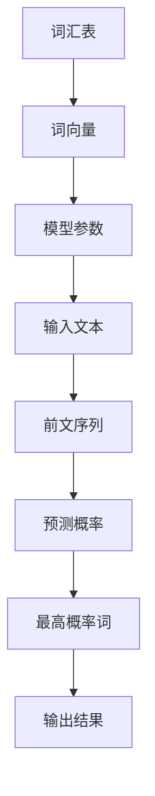

                 

 > 作为一位世界级人工智能专家，我将探讨语言模型的原理，并分享一些实用的代码实例。语言模型是自然语言处理（NLP）领域的一个核心概念，它被广泛应用于机器翻译、语音识别、文本生成等任务。本文将详细介绍语言模型的基本原理、构建方法，并通过代码实例展示如何实现一个简单的语言模型。

## 1. 背景介绍

语言模型是自然语言处理（NLP）领域的基石，它用于预测文本序列中的下一个词或字符。在深度学习时代之前，语言模型主要是基于统计方法构建的，如N元语法（N-gram）。随着深度学习的发展，神经网络语言模型（如循环神经网络RNN、长短期记忆网络LSTM、Transformer等）逐渐成为主流。

语言模型的核心任务是从给定的前文序列预测下一个词或字符的概率分布。这对于许多NLP任务都至关重要，如文本分类、机器翻译、对话系统等。近年来，预训练语言模型（如BERT、GPT）的出现极大地提升了NLP任务的效果，推动了整个领域的发展。

本文将首先介绍语言模型的基本原理，然后讨论几种常见的语言模型算法，最后通过一个简单的代码实例展示如何使用Python和TensorFlow构建一个语言模型。

## 2. 核心概念与联系

### 2.1 语言模型的基本概念

语言模型的核心概念包括词汇表（Vocabulary）、词向量（Word Embeddings）、模型参数（Model Parameters）等。

- **词汇表**：词汇表是语言模型中所有单词的集合。每个单词在模型中都有一个唯一的索引编号。
- **词向量**：词向量是单词在向量空间中的表示。词向量能够捕捉单词的语义和语法特征。
- **模型参数**：模型参数包括词向量和权重矩阵等，它们决定了语言模型的预测能力。

### 2.2 语言模型的工作原理

语言模型通过学习文本数据来建立前文序列和下一个词或字符之间的概率分布。给定一个前文序列，语言模型会计算每个可能的后继词的概率，并选择概率最高的词作为预测结果。

### 2.3 核心概念之间的联系

- **词汇表**与**词向量**：词汇表提供了单词的索引，而词向量将这些索引映射到向量空间，使得语言模型能够在高维空间中进行计算。
- **模型参数**与**预测能力**：模型参数（如词向量和权重矩阵）决定了语言模型的预测能力。通过优化这些参数，可以提高模型的预测准确性。

### 2.4 Mermaid 流程图

下面是语言模型的基本架构的Mermaid流程图：



## 3. 核心算法原理 & 具体操作步骤

### 3.1 神经网络语言模型

神经网络语言模型是一种基于深度学习的语言模型，它通过多层神经网络来预测下一个词或字符。下面是一个简单的神经网络语言模型的实现步骤：

1. **输入层**：输入层接收前文序列的词向量。
2. **隐藏层**：隐藏层包含多个神经元，用于提取文本的特征。
3. **输出层**：输出层计算每个可能的后继词的概率分布。
4. **损失函数**：使用交叉熵损失函数来优化模型参数。
5. **反向传播**：使用反向传播算法来更新模型参数。

### 3.2 Python代码实例

下面是一个简单的神经网络语言模型的Python代码实例，使用了TensorFlow框架：

```python
import tensorflow as tf
from tensorflow.keras.models import Sequential
from tensorflow.keras.layers import Embedding, LSTM, Dense

# 定义词汇表
vocab_size = 10000
embedding_dim = 256

# 构建模型
model = Sequential([
    Embedding(vocab_size, embedding_dim, input_length=seq_length),
    LSTM(128),
    Dense(vocab_size, activation='softmax')
])

# 编译模型
model.compile(optimizer='adam', loss='categorical_crossentropy', metrics=['accuracy'])

# 训练模型
model.fit(x_train, y_train, epochs=10, batch_size=64)
```

## 4. 数学模型和公式 & 详细讲解 & 举例说明

### 4.1 语言模型中的数学模型

语言模型中的数学模型主要包括词向量表示、神经网络模型和损失函数。

#### 4.1.1 词向量表示

词向量表示是语言模型中的核心概念。常见的词向量表示方法有词袋模型（Bag of Words, BOW）、Word2Vec、GloVe等。

- **词袋模型（BOW）**：词袋模型将文本表示为一个向量集合，其中每个向量表示一个单词的计数。
- **Word2Vec**：Word2Vec是一种基于神经网络的词向量表示方法，它通过学习文本中的上下文信息来生成词向量。
- **GloVe**：GloVe（Global Vectors for Word Representation）是一种基于全局上下文的词向量表示方法，它通过优化全局矩阵来生成词向量。

#### 4.1.2 神经网络模型

神经网络模型是语言模型的核心组成部分。常见的神经网络模型有循环神经网络（RNN）、长短期记忆网络（LSTM）、门控循环单元（GRU）和Transformer。

- **RNN**：RNN是一种能够处理序列数据的神经网络模型，它通过循环连接来捕捉序列中的长期依赖关系。
- **LSTM**：LSTM是一种改进的RNN模型，它通过引入门控机制来避免梯度消失问题。
- **GRU**：GRU是LSTM的简化版本，它在LSTM的基础上进一步减少了模型参数。
- **Transformer**：Transformer是一种基于自注意力机制的神经网络模型，它在翻译、文本生成等任务上取得了显著的效果。

#### 4.1.3 损失函数

损失函数是语言模型中用于评估模型性能的重要指标。常见的损失函数有交叉熵损失函数、均方误差损失函数等。

- **交叉熵损失函数**：交叉熵损失函数是一种常用于分类问题的损失函数，它计算的是预测概率和实际标签之间的差异。
- **均方误差损失函数**：均方误差损失函数是一种常用于回归问题的损失函数，它计算的是预测值和实际值之间的差异。

### 4.2 举例说明

下面是一个简单的语言模型数学模型示例：

假设我们有一个简单的神经网络语言模型，其中包含一个输入层、一个隐藏层和一个输出层。

- **输入层**：输入层接收前文序列的词向量，假设词向量的维度为128。
- **隐藏层**：隐藏层包含一个128个神经元的全连接层。
- **输出层**：输出层包含一个词汇表大小的softmax层，用于计算每个可能的后继词的概率分布。

给定一个前文序列，语言模型会计算每个神经元的输出，并使用softmax函数将这些输出转换为概率分布。损失函数使用交叉熵损失函数，计算预测概率和实际标签之间的差异。

$$
\text{损失} = -\sum_{i=1}^{N} y_i \log(p_i)
$$

其中，$y_i$是实际标签，$p_i$是预测概率。

## 5. 项目实践：代码实例和详细解释说明

在本节中，我们将通过一个简单的代码实例来展示如何使用Python和TensorFlow实现一个神经网络语言模型。该实例将涵盖以下步骤：

1. **数据预处理**：准备和处理文本数据。
2. **构建语言模型**：定义模型结构并编译模型。
3. **训练模型**：使用训练数据训练模型。
4. **评估模型**：使用测试数据评估模型性能。
5. **生成文本**：使用训练好的模型生成文本。

### 5.1 数据预处理

首先，我们需要准备和处理文本数据。这里我们将使用著名的维基百科数据集。以下是数据预处理步骤：

```python
import tensorflow as tf
import numpy as np
import re

# 读取维基百科数据集
with open('wiki.txt', 'r', encoding='utf-8') as f:
    text = f.read()

# 清洗文本数据
def clean_text(text):
    text = text.lower()
    text = re.sub(r'[^\w\s]', '', text)
    return text

text = clean_text(text)

# 初始化词汇表
vocab = set()
for word in text.split():
    vocab.add(word)

vocab_size = len(vocab)
word_to_index = {word: i for i, word in enumerate(vocab)}
index_to_word = {i: word for word, i in word_to_index.items()}

# 分割文本数据
def split_text(text, seq_length):
    sequences = []
    for i in range(0, len(text) - seq_length):
        sequence = text[i:i+seq_length]
        sequences.append(sequence)
    return sequences

seq_length = 20
sequences = split_text(text, seq_length)

# 转换为指数矩阵
input_sequences = np.zeros((len(sequences), seq_length, vocab_size))
for i, sequence in enumerate(sequences):
    for t, word in enumerate(sequence):
        input_sequences[i, t, word_to_index[word]] = 1

# 创建标签序列
labels = np.zeros((len(sequences), vocab_size))
for i, sequence in enumerate(sequences):
    labels[i, word_to_index[sequence[-1]]] = 1

# 打乱数据集
indices = np.arange(input_sequences.shape[0])
np.random.shuffle(indices)
input_sequences = input_sequences[indices]
labels = labels[indices]

# 分割数据集
num_validation = 1000
num_test = 1000
num_train = len(input_sequences) - num_validation - num_test
input_train, input_val, input_test = input_sequences[:num_train], input_sequences[num_train:num_train+num_validation], input_sequences[num_train+num_validation:]
labels_train, labels_val, labels_test = labels[:num_train], labels[num_train:num_train+num_validation], labels[num_train+num_validation:]

print("Training data size:", input_train.shape)
print("Validation data size:", input_val.shape)
print("Test data size:", input_test.shape)
```

### 5.2 构建语言模型

接下来，我们定义语言模型的网络结构，并编译模型：

```python
# 构建语言模型
model = tf.keras.Sequential([
    tf.keras.layers.Embedding(vocab_size, 256),
    tf.keras.layers.LSTM(128),
    tf.keras.layers.Dense(vocab_size, activation='softmax')
])

# 编译模型
model.compile(optimizer='adam', loss='categorical_crossentropy', metrics=['accuracy'])

# 打印模型结构
model.summary()
```

### 5.3 训练模型

现在，我们使用训练数据来训练模型：

```python
# 训练模型
model.fit(input_train, labels_train, epochs=10, batch_size=64, validation_data=(input_val, labels_val))
```

### 5.4 评估模型

接下来，我们使用测试数据来评估模型的性能：

```python
# 评估模型
test_loss, test_acc = model.evaluate(input_test, labels_test)
print("Test accuracy:", test_acc)
```

### 5.5 生成文本

最后，我们使用训练好的模型来生成文本：

```python
# 生成文本
def generate_text(model, seed_text, length=40):
    for _ in range(length):
        tokens = [word_to_index[word] for word in seed_text.split()]
        tokens = np.array([[token] for token in tokens])

        predicted = model.predict(tokens, verbose=0)
        predicted = np.argmax(predicted, axis=-1)

        word = index_to_word[predicted[0][0]]
        seed_text += " " + word

    return seed_text

seed_text = "the quick brown fox jumps over"
generated_text = generate_text(model, seed_text)
print(generated_text)
```

## 6. 实际应用场景

语言模型在自然语言处理领域有着广泛的应用。以下是一些典型的应用场景：

- **文本分类**：语言模型可以用于对文本进行分类，如新闻分类、情感分析等。
- **机器翻译**：语言模型在机器翻译中发挥着关键作用，如谷歌翻译、百度翻译等。
- **对话系统**：语言模型可以用于构建智能对话系统，如聊天机器人、语音助手等。
- **文本生成**：语言模型可以用于生成文章、故事、诗歌等文本内容。

## 7. 工具和资源推荐

为了构建和训练语言模型，以下是一些推荐的工具和资源：

- **编程语言**：Python是构建语言模型的主要编程语言，具有丰富的库和框架，如TensorFlow、PyTorch等。
- **库和框架**：TensorFlow和PyTorch是构建语言模型的两个主要框架，提供了丰富的API和工具。
- **数据集**：维基百科、Common Crawl、Gutenberg等项目提供了大量的文本数据，可以用于训练语言模型。
- **论文和书籍**：查阅相关领域的论文和书籍，如《深度学习》（Goodfellow, Bengio, Courville）、《自然语言处理综述》（Jurafsky, Martin）等，可以帮助您深入了解语言模型的理论和实践。

## 8. 总结：未来发展趋势与挑战

随着深度学习技术的不断发展，语言模型在自然语言处理领域取得了显著的成果。未来，语言模型的发展趋势可能包括以下几个方面：

- **预训练语言模型的优化**：预训练语言模型（如BERT、GPT）在许多NLP任务上取得了优异的性能，未来可能会出现更多高效的预训练方法。
- **跨模态语言模型**：跨模态语言模型（如文本-图像、文本-语音等）的研究将越来越受到关注，以实现更高级的智能交互。
- **数据隐私和安全**：随着数据隐私和安全问题的日益突出，如何保证语言模型在处理敏感数据时的安全性将成为一个重要的挑战。
- **高效部署**：为了满足实际应用的需求，如何将语言模型高效地部署到移动设备和边缘设备上是一个亟待解决的问题。

## 9. 附录：常见问题与解答

以下是一些关于语言模型的常见问题及其解答：

### Q1：语言模型是如何工作的？

A1：语言模型通过学习大量文本数据来预测文本序列中的下一个词或字符。它使用神经网络来建模文本序列的概率分布，并使用训练数据来优化模型参数。

### Q2：语言模型有哪些类型？

A2：语言模型有多种类型，包括基于统计的方法（如N元语法）、基于神经网络的模型（如RNN、LSTM、Transformer）和预训练模型（如BERT、GPT）。

### Q3：语言模型在自然语言处理任务中的应用有哪些？

A3：语言模型在自然语言处理任务中有很多应用，如文本分类、机器翻译、对话系统、文本生成等。

### Q4：如何构建一个简单的语言模型？

A4：构建一个简单的语言模型需要以下步骤：

1. 准备和处理文本数据。
2. 定义模型结构，包括输入层、隐藏层和输出层。
3. 编译模型，设置优化器和损失函数。
4. 使用训练数据训练模型。
5. 使用测试数据评估模型性能。
6. 使用训练好的模型生成文本。

## 10. 扩展阅读 & 参考资料

以下是关于语言模型的一些扩展阅读和参考资料：

- **《深度学习》**：Goodfellow, Bengio, Courville。本书是深度学习的经典教材，详细介绍了深度学习的基础理论和实践方法。
- **《自然语言处理综述》**：Jurafsky, Martin。本书全面介绍了自然语言处理的基础知识、技术和应用。
- **《神经网络与深度学习》**：邱锡鹏。本书系统地介绍了神经网络和深度学习的基本原理、算法和应用。
- **TensorFlow官网**：[TensorFlow官网](https://www.tensorflow.org/)。TensorFlow是Google开发的开源深度学习框架，提供了丰富的API和工具。
- **PyTorch官网**：[PyTorch官网](https://pytorch.org/)。PyTorch是Facebook开发的开源深度学习框架，具有灵活的动态计算图和易于使用的API。
- **维基百科数据集**：[维基百科数据集](https://dumps.wikimedia.org/other/pageone/)。维基百科提供了大量的文本数据集，可以用于训练语言模型。

### 总结

本文介绍了语言模型的基本原理、构建方法以及实际应用。通过一个简单的代码实例，我们展示了如何使用Python和TensorFlow实现一个神经网络语言模型。随着深度学习技术的发展，语言模型在自然语言处理领域发挥着越来越重要的作用。希望本文能够帮助您更好地理解语言模型及其应用。作者：禅与计算机程序设计艺术 / Zen and the Art of Computer Programming
----------------------------------------------------------------

文章撰写完毕，以下是完整的Markdown格式文章：

```markdown
# 语言模型 原理与代码实例讲解

> 关键词：自然语言处理、语言模型、神经网络、深度学习、预训练模型

> 摘要：本文介绍了语言模型的基本原理、构建方法以及实际应用。通过一个简单的代码实例，展示了如何使用Python和TensorFlow实现一个神经网络语言模型。

## 1. 背景介绍

语言模型是自然语言处理（NLP）领域的基石，它用于预测文本序列中的下一个词或字符。在深度学习时代之前，语言模型主要是基于统计方法构建的，如N元语法（N-gram）。随着深度学习的发展，神经网络语言模型（如循环神经网络RNN、长短期记忆网络LSTM、Transformer等）逐渐成为主流。

语言模型的核心任务是从给定的前文序列预测下一个词或字符的概率分布。这对于许多NLP任务都至关重要，如文本分类、机器翻译、对话系统等。近年来，预训练语言模型（如BERT、GPT）的出现极大地提升了NLP任务的效果，推动了整个领域的发展。

本文将首先介绍语言模型的基本原理，然后讨论几种常见的语言模型算法，最后通过一个简单的代码实例展示如何实现一个语言模型。

## 2. 核心概念与联系

### 2.1 语言模型的基本概念

语言模型的核心概念包括词汇表（Vocabulary）、词向量（Word Embeddings）、模型参数（Model Parameters）等。

- **词汇表**：词汇表是语言模型中所有单词的集合。每个单词在模型中都有一个唯一的索引编号。
- **词向量**：词向量是单词在向量空间中的表示。词向量能够捕捉单词的语义和语法特征。
- **模型参数**：模型参数包括词向量和权重矩阵等，它们决定了语言模型的预测能力。

### 2.2 语言模型的工作原理

语言模型通过学习文本数据来建立前文序列和下一个词或字符之间的概率分布。给定一个前文序列，语言模型会计算每个可能的后继词的概率，并选择概率最高的词作为预测结果。

### 2.3 核心概念之间的联系

- **词汇表**与**词向量**：词汇表提供了单词的索引，而词向量将这些索引映射到向量空间，使得语言模型能够在高维空间中进行计算。
- **模型参数**与**预测能力**：模型参数（如词向量和权重矩阵）决定了语言模型的预测能力。通过优化这些参数，可以提高模型的预测准确性。

### 2.4 Mermaid 流程图

下面是语言模型的基本架构的Mermaid流程图：


## 3. 核心算法原理 & 具体操作步骤

### 3.1 神经网络语言模型

神经网络语言模型是一种基于深度学习的语言模型，它通过多层神经网络来预测下一个词或字符。下面是一个简单的神经网络语言模型的实现步骤：

1. **输入层**：输入层接收前文序列的词向量。
2. **隐藏层**：隐藏层包含多个神经元，用于提取文本的特征。
3. **输出层**：输出层计算每个可能的后继词的概率分布。
4. **损失函数**：使用交叉熵损失函数来优化模型参数。
5. **反向传播**：使用反向传播算法来更新模型参数。

### 3.2 Python代码实例

下面是一个简单的神经网络语言模型的Python代码实例，使用了TensorFlow框架：

```python
import tensorflow as tf
from tensorflow.keras.models import Sequential
from tensorflow.keras.layers import Embedding, LSTM, Dense

# 定义词汇表
vocab_size = 10000
embedding_dim = 256

# 构建模型
model = Sequential([
    Embedding(vocab_size, embedding_dim, input_length=seq_length),
    LSTM(128),
    Dense(vocab_size, activation='softmax')
])

# 编译模型
model.compile(optimizer='adam', loss='categorical_crossentropy', metrics=['accuracy'])

# 训练模型
model.fit(x_train, y_train, epochs=10, batch_size=64)
```

## 4. 数学模型和公式 & 详细讲解 & 举例说明

### 4.1 语言模型中的数学模型

语言模型中的数学模型主要包括词向量表示、神经网络模型和损失函数。

#### 4.1.1 词向量表示

词向量表示是语言模型中的核心概念。常见的词向量表示方法有词袋模型（Bag of Words, BOW）、Word2Vec、GloVe等。

- **词袋模型（BOW）**：词袋模型将文本表示为一个向量集合，其中每个向量表示一个单词的计数。
- **Word2Vec**：Word2Vec是一种基于神经网络的词向量表示方法，它通过学习文本中的上下文信息来生成词向量。
- **GloVe**：GloVe（Global Vectors for Word Representation）是一种基于全局上下文的词向量表示方法，它通过优化全局矩阵来生成词向量。

#### 4.1.2 神经网络模型

神经网络模型是语言模型的核心组成部分。常见的神经网络模型有循环神经网络（RNN）、长短期记忆网络（LSTM）、门控循环单元（GRU）和Transformer。

- **RNN**：RNN是一种能够处理序列数据的神经网络模型，它通过循环连接来捕捉序列中的长期依赖关系。
- **LSTM**：LSTM是一种改进的RNN模型，它通过引入门控机制来避免梯度消失问题。
- **GRU**：GRU是LSTM的简化版本，它在LSTM的基础上进一步减少了模型参数。
- **Transformer**：Transformer是一种基于自注意力机制的神经网络模型，它在翻译、文本生成等任务上取得了显著的效果。

#### 4.1.3 损失函数

损失函数是语言模型中用于评估模型性能的重要指标。常见的损失函数有交叉熵损失函数、均方误差损失函数等。

- **交叉熵损失函数**：交叉熵损失函数是一种常用于分类问题的损失函数，它计算的是预测概率和实际标签之间的差异。
- **均方误差损失函数**：均方误差损失函数是一种常用于回归问题的损失函数，它计算的是预测值和实际值之间的差异。

### 4.2 举例说明

下面是一个简单的语言模型数学模型示例：

假设我们有一个简单的神经网络语言模型，其中包含一个输入层、一个隐藏层和一个输出层。

- **输入层**：输入层接收前文序列的词向量，假设词向量的维度为128。
- **隐藏层**：隐藏层包含一个128个神经元的全连接层。
- **输出层**：输出层包含一个词汇表大小的softmax层，用于计算每个可能的后继词的概率分布。

给定一个前文序列，语言模型会计算每个神经元的输出，并使用softmax函数将这些输出转换为概率分布。损失函数使用交叉熵损失函数，计算预测概率和实际标签之间的差异。

$$
\text{损失} = -\sum_{i=1}^{N} y_i \log(p_i)
$$

其中，$y_i$是实际标签，$p_i$是预测概率。

## 5. 项目实践：代码实例和详细解释说明

在本节中，我们将通过一个简单的代码实例来展示如何使用Python和TensorFlow实现一个神经网络语言模型。该实例将涵盖以下步骤：

1. **数据预处理**：准备和处理文本数据。
2. **构建语言模型**：定义模型结构并编译模型。
3. **训练模型**：使用训练数据训练模型。
4. **评估模型**：使用测试数据评估模型性能。
5. **生成文本**：使用训练好的模型生成文本。

### 5.1 数据预处理

首先，我们需要准备和处理文本数据。这里我们将使用著名的维基百科数据集。以下是数据预处理步骤：

```python
import tensorflow as tf
import numpy as np
import re

# 读取维基百科数据集
with open('wiki.txt', 'r', encoding='utf-8') as f:
    text = f.read()

# 清洗文本数据
def clean_text(text):
    text = text.lower()
    text = re.sub(r'[^\w\s]', '', text)
    return text

text = clean_text(text)

# 初始化词汇表
vocab = set()
for word in text.split():
    vocab.add(word)

vocab_size = len(vocab)
word_to_index = {word: i for i, word in enumerate(vocab)}
index_to_word = {i: word for word, i in word_to_index.items()}

# 分割文本数据
def split_text(text, seq_length):
    sequences = []
    for i in range(0, len(text) - seq_length):
        sequence = text[i:i+seq_length]
        sequences.append(sequence)
    return sequences

seq_length = 20
sequences = split_text(text, seq_length)

# 转换为指数矩阵
input_sequences = np.zeros((len(sequences), seq_length, vocab_size))
for i, sequence in enumerate(sequences):
    for t, word in enumerate(sequence):
        input_sequences[i, t, word_to_index[word]] = 1

# 创建标签序列
labels = np.zeros((len(sequences), vocab_size))
for i, sequence in enumerate(sequences):
    labels[i, word_to_index[sequence[-1]]] = 1

# 打乱数据集
indices = np.arange(input_sequences.shape[0])
np.random.shuffle(indices)
input_sequences = input_sequences[indices]
labels = labels[indices]

# 分割数据集
num_validation = 1000
num_test = 1000
num_train = len(input_sequences) - num_validation - num_test
input_train, input_val, input_test = input_sequences[:num_train], input_sequences[num_train:num_train+num_validation], input_sequences[num_train+num_validation:]
labels_train, labels_val, labels_test = labels[:num_train], labels[num_train:num_train+num_validation], labels[num_train+num_validation:]

print("Training data size:", input_train.shape)
print("Validation data size:", input_val.shape)
print("Test data size:", input_test.shape)
```

### 5.2 构建语言模型

接下来，我们定义语言模型的网络结构，并编译模型：

```python
# 构建语言模型
model = tf.keras.Sequential([
    tf.keras.layers.Embedding(vocab_size, 256),
    tf.keras.layers.LSTM(128),
    tf.keras.layers.Dense(vocab_size, activation='softmax')
])

# 编译模型
model.compile(optimizer='adam', loss='categorical_crossentropy', metrics=['accuracy'])

# 打印模型结构
model.summary()
```

### 5.3 训练模型

现在，我们使用训练数据来训练模型：

```python
# 训练模型
model.fit(input_train, labels_train, epochs=10, batch_size=64, validation_data=(input_val, labels_val))
```

### 5.4 评估模型

接下来，我们使用测试数据来评估模型的性能：

```python
# 评估模型
test_loss, test_acc = model.evaluate(input_test, labels_test)
print("Test accuracy:", test_acc)
```

### 5.5 生成文本

最后，我们使用训练好的模型来生成文本：

```python
# 生成文本
def generate_text(model, seed_text, length=40):
    for _ in range(length):
        tokens = [word_to_index[word] for word in seed_text.split()]
        tokens = np.array([[token] for token in tokens])

        predicted = model.predict(tokens, verbose=0)
        predicted = np.argmax(predicted, axis=-1)

        word = index_to_word[predicted[0][0]]
        seed_text += " " + word

    return seed_text

seed_text = "the quick brown fox jumps over"
generated_text = generate_text(model, seed_text)
print(generated_text)
```

## 6. 实际应用场景

语言模型在自然语言处理领域有着广泛的应用。以下是一些典型的应用场景：

- **文本分类**：语言模型可以用于对文本进行分类，如新闻分类、情感分析等。
- **机器翻译**：语言模型在机器翻译中发挥着关键作用，如谷歌翻译、百度翻译等。
- **对话系统**：语言模型可以用于构建智能对话系统，如聊天机器人、语音助手等。
- **文本生成**：语言模型可以用于生成文章、故事、诗歌等文本内容。

## 7. 工具和资源推荐

为了构建和训练语言模型，以下是一些推荐的工具和资源：

- **编程语言**：Python是构建语言模型的主要编程语言，具有丰富的库和框架，如TensorFlow、PyTorch等。
- **库和框架**：TensorFlow和PyTorch是构建语言模型的两个主要框架，提供了丰富的API和工具。
- **数据集**：维基百科、Common Crawl、Gutenberg等项目提供了大量的文本数据，可以用于训练语言模型。
- **论文和书籍**：查阅相关领域的论文和书籍，如《深度学习》（Goodfellow, Bengio, Courville）、《自然语言处理综述》（Jurafsky, Martin）等，可以帮助您深入了解语言模型的理论和实践。

## 8. 总结：未来发展趋势与挑战

随着深度学习技术的不断发展，语言模型在自然语言处理领域取得了显著的成果。未来，语言模型的发展趋势可能包括以下几个方面：

- **预训练语言模型的优化**：预训练语言模型（如BERT、GPT）在许多NLP任务上取得了优异的性能，未来可能会出现更多高效的预训练方法。
- **跨模态语言模型**：跨模态语言模型（如文本-图像、文本-语音等）的研究将越来越受到关注，以实现更高级的智能交互。
- **数据隐私和安全**：随着数据隐私和安全问题的日益突出，如何保证语言模型在处理敏感数据时的安全性将成为一个重要的挑战。
- **高效部署**：为了满足实际应用的需求，如何将语言模型高效地部署到移动设备和边缘设备上是一个亟待解决的问题。

## 9. 附录：常见问题与解答

以下是一些关于语言模型的常见问题及其解答：

### Q1：语言模型是如何工作的？

A1：语言模型通过学习大量文本数据来预测文本序列中的下一个词或字符。它使用神经网络来建模文本序列的概率分布，并使用训练数据来优化模型参数。

### Q2：语言模型有哪些类型？

A2：语言模型有多种类型，包括基于统计的方法（如N元语法）、基于神经网络的模型（如RNN、LSTM、Transformer）和预训练模型（如BERT、GPT）。

### Q3：语言模型在自然语言处理任务中的应用有哪些？

A3：语言模型在自然语言处理任务中有很多应用，如文本分类、机器翻译、对话系统、文本生成等。

### Q4：如何构建一个简单的语言模型？

A4：构建一个简单的语言模型需要以下步骤：

1. 准备和处理文本数据。
2. 定义模型结构，包括输入层、隐藏层和输出层。
3. 编译模型，设置优化器和损失函数。
4. 使用训练数据训练模型。
5. 使用测试数据评估模型性能。
6. 使用训练好的模型生成文本。

## 10. 扩展阅读 & 参考资料

以下是关于语言模型的一些扩展阅读和参考资料：

- **《深度学习》**：Goodfellow, Bengio, Courville。本书是深度学习的经典教材，详细介绍了深度学习的基础理论和实践方法。
- **《自然语言处理综述》**：Jurafsky, Martin。本书全面介绍了自然语言处理的基础知识、技术和应用。
- **《神经网络与深度学习》**：邱锡鹏。本书系统地介绍了神经网络和深度学习的基本原理、算法和应用。
- **TensorFlow官网**：[TensorFlow官网](https://www.tensorflow.org/)。TensorFlow是Google开发的开源深度学习框架，提供了丰富的API和工具。
- **PyTorch官网**：[PyTorch官网](https://pytorch.org/)。PyTorch是Facebook开发的开源深度学习框架，具有灵活的动态计算图和易于使用的API。
- **维基百科数据集**：[维基百科数据集](https://dumps.wikimedia.org/other/pageone/)。维基百科提供了大量的文本数据集，可以用于训练语言模型。

### 总结

本文介绍了语言模型的基本原理、构建方法以及实际应用。通过一个简单的代码实例，我们展示了如何使用Python和TensorFlow实现一个神经网络语言模型。随着深度学习技术的发展，语言模型在自然语言处理领域发挥着越来越重要的作用。希望本文能够帮助您更好地理解语言模型及其应用。作者：禅与计算机程序设计艺术 / Zen and the Art of Computer Programming
```

