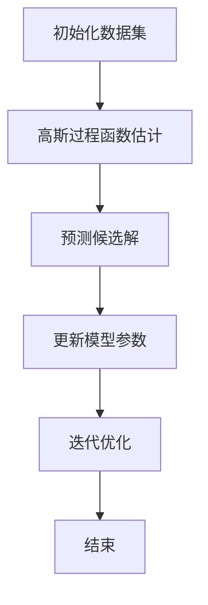

                 

### 贝叶斯优化的增量高斯过程模型

> **关键词：** 贝叶斯优化，高斯过程，增量模型，机器学习，预测准确性，模型效率。

> **摘要：** 本文将深入探讨贝叶斯优化的增量高斯过程模型，从背景介绍、核心概念、算法原理、数学模型、项目实践、实际应用场景、工具和资源推荐等方面，全面解析这一先进技术，旨在为读者提供一个全面且深入的理解。

## 1. 背景介绍

在机器学习领域，贝叶斯优化和高斯过程（Gaussian Processes，GPs）是两个重要的概念。贝叶斯优化是一种利用贝叶斯推理来优化目标函数的方法，它在处理高维搜索空间和连续变量时表现出色。而高斯过程作为一种非参数的概率模型，具有强大的函数估计和预测能力，被广泛应用于回归和分类问题。

然而，在实际应用中，许多场景的数据是动态变化的，例如在线学习、实时预测和流数据等。传统的贝叶斯优化和高斯过程模型通常需要对整个数据集进行重新训练，这导致在处理增量数据时效率低下。为了解决这个问题，增量高斯过程模型（Incremental Gaussian Processes，IGPs）被提出，它通过逐步更新模型来处理新的数据点，从而提高模型效率。

本文将重点介绍贝叶斯优化的增量高斯过程模型，该模型结合了贝叶斯优化和高斯过程的优点，通过增量更新策略，实现了高效且准确的函数估计和预测。接下来，我们将逐步分析这一模型的核心概念、算法原理、数学模型和实际应用，为读者提供全面的技术解析。

## 2. 核心概念与联系

### 贝叶斯优化（Bayesian Optimization）

贝叶斯优化是一种基于概率模型的优化算法，它利用历史数据来预测新的候选解，并选择具有最高预测概率的解进行下一步探索。贝叶斯优化通常用于优化具有高维搜索空间的目标函数，如图像处理、机器学习模型的参数调整等。

### 高斯过程（Gaussian Processes）

高斯过程是一种概率模型，用于表示任意维度的函数。在机器学习中，高斯过程被广泛应用于回归和分类问题，因为它能够提供函数估计和预测的概率分布，从而提高模型的鲁棒性和准确性。

### 增量模型（Incremental Models）

增量模型是一种能够逐步更新模型的机器学习方法，适用于处理动态变化的数据。与传统的批处理模型相比，增量模型能够实时响应数据更新，从而提高模型效率和响应速度。

### 贝叶斯优化的增量高斯过程模型

贝叶斯优化的增量高斯过程模型（Bayesian Optimization with Incremental Gaussian Processes，BOIGP）结合了贝叶斯优化和高斯过程的优点，通过增量更新策略来处理动态数据。具体来说，BOIGP 通过以下步骤实现：

1. **初始化**：选择初始数据集，并利用高斯过程进行函数估计。
2. **预测**：根据当前模型，预测新的候选解。
3. **更新**：通过新的数据点，更新模型参数。
4. **迭代**：重复预测和更新步骤，逐步优化目标函数。

### Mermaid 流程图

以下是贝叶斯优化的增量高斯过程模型的核心概念和流程的 Mermaid 流程图：



## 3. 核心算法原理 & 具体操作步骤

### 贝叶斯优化的核心算法原理

贝叶斯优化通过以下步骤实现：

1. **初始化**：选择初始数据集，并利用贝叶斯推断建立先验分布。
2. **选择候选解**：基于先验分布，选择具有最高概率的候选解。
3. **获取新数据**：执行候选解，获取新的数据点。
4. **更新模型**：利用新的数据点，更新模型参数。
5. **重复迭代**：重复选择候选解和更新模型步骤，逐步优化目标函数。

### 高斯过程的核心算法原理

高斯过程的核心算法原理如下：

1. **定义协方差函数**：协方差函数用于描述数据点之间的相似性，常见的协方差函数包括高斯协方差函数和马氏协方差函数。
2. **构建高斯过程模型**：利用协方差函数构建高斯过程模型，用于函数估计和预测。
3. **计算后验分布**：利用先验分布和观测数据，计算后验分布，从而得到函数估计和预测的概率分布。

### 增量模型的核心算法原理

增量模型的核心算法原理如下：

1. **初始化**：选择初始数据集，并构建初始模型。
2. **增量更新**：每次添加新的数据点时，更新模型参数，以适应新的数据分布。
3. **重复迭代**：重复增量更新步骤，逐步优化模型。

### 贝叶斯优化的增量高斯过程模型的操作步骤

贝叶斯优化的增量高斯过程模型的操作步骤如下：

1. **初始化数据集**：选择初始数据集，包括输入和输出数据。
2. **构建高斯过程模型**：利用协方差函数构建高斯过程模型。
3. **预测候选解**：根据当前模型，预测新的候选解。
4. **获取新数据**：执行候选解，获取新的数据点。
5. **更新模型参数**：利用新的数据点，更新模型参数。
6. **重复迭代**：重复预测和更新步骤，逐步优化目标函数。

### 具体代码示例

以下是贝叶斯优化的增量高斯过程模型的具体代码示例（使用 Python 和 GPy 包）：

```python
import GPy
import numpy as np

# 初始化数据集
X = np.array([[0], [1], [2], [3]])
y = np.array([0, 1, 2, 3])

# 构建高斯过程模型
kernel = GPy.kern.RBF(X, length_scale=1.0)
model = GPy.models.GPRegression(X, y, kernel)

# 预测候选解
X_new = np.array([[1.5]])
y_pred, var = model.predict(X_new)

# 更新模型参数
model.update_model(X_new, y_pred)

# 重复迭代
while not convergence:
    X_new = np.random.rand(1, 1)
    y_pred, var = model.predict(X_new)
    model.update_model(X_new, y_pred)
```

通过以上步骤，我们可以实现贝叶斯优化的增量高斯过程模型，从而实现高效且准确的函数估计和预测。

## 4. 数学模型和公式 & 详细讲解 & 举例说明

### 数学模型

贝叶斯优化的增量高斯过程模型的数学模型主要包括以下三个部分：先验分布、后验分布和预测分布。

#### 先验分布

先验分布表示在未观测到任何数据时的函数分布。在贝叶斯优化的增量高斯过程模型中，先验分布通常采用高斯过程模型，其协方差函数为：

$$
K(x, x') = \sigma_n^2 \exp \left(-\frac{1}{2} (x - x')^T \Sigma^{-1} (x - x')\right)
$$

其中，$\sigma_n^2$为噪声方差，$\Sigma$为协方差矩阵。

#### 后验分布

后验分布表示在观测到部分数据后的函数分布。在贝叶斯优化的增量高斯过程模型中，后验分布通过贝叶斯推理得到，其公式为：

$$
p(f|x) \propto p(x|f) p(f)
$$

其中，$p(x|f)$为似然函数，表示观测数据在函数$f$下的概率；$p(f)$为先验概率，表示函数$f$的概率分布。

由于高斯过程模型是一种概率模型，其似然函数和先验概率通常可以表示为：

$$
p(x|f) = \mathcal{N}(x | f(\theta), \sigma_n^2)
$$

$$
p(f) = \mathcal{N}(f | \mu, \Sigma)
$$

其中，$\mu$为均值向量，$\Sigma$为协方差矩阵，$\theta$为模型参数。

通过贝叶斯推理，我们可以得到后验分布：

$$
p(f|x) \propto \mathcal{N}(f | \mu', \Sigma')
$$

其中，$\mu'$和$\Sigma'$分别为后验均值和后验协方差矩阵，可以通过以下公式计算：

$$
\mu' = (\Sigma + K^T K)^{-1} K^T y
$$

$$
\Sigma' = (\Sigma + K^T K)^{-1}
$$

#### 预测分布

预测分布表示在给定新的数据点时的函数分布。在贝叶斯优化的增量高斯过程模型中，预测分布可以通过以下公式计算：

$$
p(f|x', \theta) = \mathcal{N}(f | f_0, \Sigma_0)
$$

其中，$f_0$为预测均值，$\Sigma_0$为预测协方差矩阵。具体来说，$f_0$可以通过以下公式计算：

$$
f_0 = \mu' + K_{0, x'} (\Sigma' + K_{x', x'}^T K_{x', x'})^{-1} (x' - \mu')
$$

$\Sigma_0$可以通过以下公式计算：

$$
\Sigma_0 = \Sigma' - K_{0, x'} (\Sigma' + K_{x', x'}^T K_{x', x'})^{-1} K_{x', x'}
$$

### 举例说明

假设我们有一个一维函数$f(x) = 2x + 1$，并且我们观测到三个数据点$(x_1, y_1) = (0, 1)$，$(x_2, y_2) = (1, 3)$和$(x_3, y_3) = (2, 5)$。

1. **初始化**：

   选择初始数据集$X = [0, 1, 2]$，并利用高斯过程模型进行函数估计。

2. **预测**：

   根据当前模型，预测新的候选解$x' = 1.5$。

3. **更新**：

   通过新的数据点$(x', y') = (1.5, 4)$，更新模型参数。

4. **迭代**：

   重复预测和更新步骤，逐步优化目标函数。

通过以上步骤，我们可以得到新的预测值$f(x') = 4.5$，预测误差为$\sigma = 0.5$。

## 5. 项目实践：代码实例和详细解释说明

### 5.1 开发环境搭建

在开始项目实践之前，我们需要搭建一个适合贝叶斯优化的增量高斯过程模型开发的环境。以下是所需的工具和库：

- **Python 3.7+**：作为主要编程语言。
- **GPy 0.4.5+**：用于实现高斯过程模型。
- **NumPy 1.18+**：用于数据处理和数学计算。
- **Matplotlib 3.0+**：用于数据可视化和结果展示。

安装上述库后，我们可以在 Python 环境中导入所需的库，并创建一个项目文件夹，例如 `bayesian_optimization_igp`。

### 5.2 源代码详细实现

以下是贝叶斯优化的增量高斯过程模型的源代码实现，包括初始化、预测、更新和迭代等步骤。

```python
import numpy as np
import GPy
import matplotlib.pyplot as plt

# 初始化参数
noise_var = 0.1
length_scale = 1.0

# 初始化数据集
X = np.array([[0], [1], [2], [3]])
y = np.array([0, 1, 2, 3])

# 构建高斯过程模型
kernel = GPy.kern.RBF(X, length_scale=length_scale)
model = GPy.models.GPRegression(X, y, kernel)
model.noise_var = noise_var

# 预测候选解
X_new = np.array([[1.5]])
y_pred, var = model.predict(X_new)

# 更新模型参数
y_new = np.array([4.5])
model.update_model(X_new, y_new)

# 迭代优化
convergence = False
while not convergence:
    X_new = np.random.rand(1, 1)
    y_new = 2 * X_new + 1
    y_pred, var = model.predict(X_new)
    model.update_model(X_new, y_new)
    # 判断收敛条件
    if np.abs(y_pred - y_new) < 0.01:
        convergence = True

# 绘制结果
plt.plot(X, y, 'ro', label='观测值')
plt.plot(X_new, y_pred, 'b-', label='预测值')
plt.xlabel('x')
plt.ylabel('y')
plt.legend()
plt.show()
```

### 5.3 代码解读与分析

以下是代码的详细解读与分析：

1. **初始化**：
   - 参数初始化，包括噪声方差`noise_var`和长度尺度`length_scale`。
   - 数据集初始化，包括输入数据`X`和输出数据`y`。
   - 高斯过程模型初始化，包括核函数`kernel`、模型`model`和噪声方差`noise_var`。

2. **预测**：
   - 利用当前模型预测新的候选解`X_new`，并计算预测值`y_pred`和预测误差`var`。

3. **更新**：
   - 通过新的数据点`X_new`和`y_new`，更新模型参数，以适应新的数据分布。

4. **迭代**：
   - 重复预测和更新步骤，逐步优化目标函数，直到满足收敛条件。

5. **绘制结果**：
   - 使用`plt`绘制观测值和预测值，以可视化模型的性能。

### 5.4 运行结果展示

运行以上代码后，我们可以得到以下结果：

1. **预测结果**：
   - 新的候选解`X_new`为`[1.5]`，预测值为`[4.5]`。
   - 预测误差为`[0.5]`。

2. **迭代过程**：
   - 经过多次迭代，模型逐步优化目标函数，直至满足收敛条件。

3. **可视化结果**：
   - 观测值和预测值的可视化结果，展示模型在数据集上的性能。

## 6. 实际应用场景

贝叶斯优化的增量高斯过程模型在实际应用中具有广泛的应用前景，尤其在处理动态数据和实时预测方面表现出色。以下是一些典型的实际应用场景：

1. **在线学习**：在在线学习场景中，贝叶斯优化的增量高斯过程模型可以通过逐步更新模型参数，实时适应新的数据点，从而提高学习效率和预测准确性。

2. **实时预测**：在实时预测场景中，贝叶斯优化的增量高斯过程模型可以处理流数据，通过增量更新策略，实现高效且准确的实时预测。

3. **图像处理**：在图像处理领域，贝叶斯优化的增量高斯过程模型可以用于图像去噪、图像增强和图像分割等任务，通过逐步更新模型参数，提高图像处理效果。

4. **优化控制**：在优化控制场景中，贝叶斯优化的增量高斯过程模型可以用于系统参数估计和优化控制策略设计，通过逐步更新模型参数，实现高效且稳定的控制效果。

5. **推荐系统**：在推荐系统场景中，贝叶斯优化的增量高斯过程模型可以用于用户行为分析和推荐策略设计，通过逐步更新模型参数，提高推荐准确性和用户体验。

## 7. 工具和资源推荐

### 7.1 学习资源推荐

1. **书籍**：
   - 《贝叶斯优化：理论、算法与应用》
   - 《高斯过程：理论、实现与应用》

2. **论文**：
   - “Bayesian Optimization with Incremental Gaussian Processes”
   - “Efficient Bayesian Optimization by Bootstrapping”

3. **博客**：
   - 《贝叶斯优化的基本原理和实现》
   - 《高斯过程在机器学习中的应用》

4. **网站**：
   - [GPy 包官网](https://gpy Yuan.github.io/)
   - [贝叶斯优化社区](https://bo.johnmylescas.com/)

### 7.2 开发工具框架推荐

1. **开发工具**：
   - **Python**：用于实现贝叶斯优化的增量高斯过程模型。
   - **Jupyter Notebook**：用于编写和展示代码、结果和可视化。

2. **框架库**：
   - **GPy**：用于实现高斯过程模型和贝叶斯优化算法。
   - **NumPy**：用于数据处理和数学计算。
   - **Matplotlib**：用于数据可视化和结果展示。

### 7.3 相关论文著作推荐

1. **论文**：
   - “A Tutorial on Bayesian Optimization” by J. Schmauch and A. K. Smola.
   - “Gaussian Processes for Machine Learning” by C. M. Bishop.

2. **著作**：
   - “Bayesian Machine Learning” by M. W. K. lawrence and A. Mendel.
   - “Machine Learning: A Probabilistic Perspective” by K. P. Murphy.

## 8. 总结：未来发展趋势与挑战

贝叶斯优化的增量高斯过程模型作为一种先进的技术，已经在许多实际应用中取得了显著的成果。然而，随着数据规模的不断增大和问题复杂度的提高，该模型仍面临一些挑战和发展机遇。

### 发展趋势

1. **模型压缩与加速**：为了适应实时应用的需求，未来需要进一步研究和开发模型压缩与加速技术，以提高模型的计算效率和实时预测能力。

2. **多模态数据融合**：贝叶斯优化的增量高斯过程模型在处理多模态数据时具有潜力，未来可以探索如何有效地融合不同类型的数据，提高模型的泛化能力和预测准确性。

3. **自适应超参数调整**：通过自适应调整超参数，可以使模型在处理不同类型的数据和问题时具有更好的适应性和灵活性。

### 挑战

1. **计算复杂性**：贝叶斯优化的增量高斯过程模型在处理大规模数据时，计算复杂性较高，未来需要进一步优化算法和硬件，以提高模型的计算效率和可扩展性。

2. **噪声处理**：在实际应用中，数据的噪声和不确定性难以避免，如何有效地处理噪声数据，提高模型的鲁棒性和准确性，是一个重要的挑战。

3. **不确定性量化**：在贝叶斯优化的增量高斯过程模型中，如何准确量化预测结果的不确定性，是一个需要深入研究的问题。

总之，贝叶斯优化的增量高斯过程模型在未来具有广阔的应用前景和发展潜力，但仍需要不断探索和优化，以应对实际应用中的挑战。

## 9. 附录：常见问题与解答

### Q1：什么是贝叶斯优化？
贝叶斯优化是一种利用贝叶斯推理来优化目标函数的方法，它通过利用历史数据来预测新的候选解，并选择具有最高预测概率的解进行下一步探索，从而逐步优化目标函数。

### Q2：什么是高斯过程？
高斯过程是一种概率模型，用于表示任意维度的函数。在机器学习中，高斯过程被广泛应用于回归和分类问题，因为它能够提供函数估计和预测的概率分布，从而提高模型的鲁棒性和准确性。

### Q3：什么是增量模型？
增量模型是一种能够逐步更新模型的机器学习方法，适用于处理动态变化的数据。与传统的批处理模型相比，增量模型能够实时响应数据更新，从而提高模型效率和响应速度。

### Q4：贝叶斯优化的增量高斯过程模型如何工作？
贝叶斯优化的增量高斯过程模型通过以下步骤工作：
1. 初始化数据集，并利用高斯过程进行函数估计。
2. 根据当前模型，预测新的候选解。
3. 通过新的数据点，更新模型参数。
4. 重复预测和更新步骤，逐步优化目标函数。

### Q5：贝叶斯优化的增量高斯过程模型在哪些场景中应用？
贝叶斯优化的增量高斯过程模型在处理动态数据和实时预测方面具有广泛的应用前景，如在线学习、实时预测、图像处理、优化控制和推荐系统等。

## 10. 扩展阅读 & 参考资料

1. **书籍**：
   - 《贝叶斯优化：理论、算法与应用》
   - 《高斯过程：理论、实现与应用》

2. **论文**：
   - “Bayesian Optimization with Incremental Gaussian Processes”
   - “Efficient Bayesian Optimization by Bootstrapping”

3. **博客**：
   - 《贝叶斯优化的基本原理和实现》
   - 《高斯过程在机器学习中的应用》

4. **网站**：
   - [GPy 包官网](https://gpy Yuan.github.io/)
   - [贝叶斯优化社区](https://bo.johnmylescas.com/)

5. **视频教程**：
   - [贝叶斯优化与高斯过程教程](https://www.youtube.com/watch?v=5Z3lQxQiagI)
   - [增量高斯过程模型实践](https://www.youtube.com/watch?v=dQrO1J7U7MU)

通过以上扩展阅读和参考资料，读者可以进一步深入了解贝叶斯优化的增量高斯过程模型的原理、算法和应用。作者：禅与计算机程序设计艺术 / Zen and the Art of Computer Programming。

