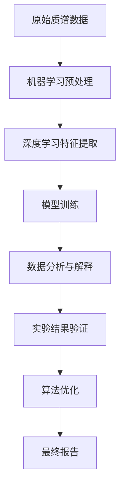

                 

关键词：质谱技术、AI for Science、数据解析、化学分析、生物信息学、医学诊断、机器学习、深度学习

> 摘要：质谱技术在科学研究中扮演着关键角色，其与人工智能（AI）的结合正日益显现其强大的潜力。本文将探讨质谱技术在各种科学领域中的应用，以及如何利用人工智能提升其分析效率和准确性。文章将涵盖质谱技术的基本概念、核心算法、数学模型、项目实践和未来展望，旨在为读者提供一个全面的技术分析视角。

## 1. 背景介绍

质谱技术（Mass Spectrometry，MS）是一种用于测定物质分子质量和结构的技术。它通过将样品离子化，然后测量离子在电磁场中的质量-电荷比（m/z），从而实现对样品的定性和定量分析。质谱技术具有高分辨率、高灵敏度、高准确度和多功能性的特点，广泛应用于化学、生物学、医学和材料科学等多个领域。

随着计算能力的提升和数据量的爆炸性增长，人工智能，特别是机器学习和深度学习，开始进入质谱数据处理和分析领域。AI技术能够有效地处理大量的质谱数据，从中提取有价值的信息，大大提高了分析效率和准确性。

本文将探讨质谱技术在人工智能（AI）驱动的科学研究中扮演的角色，包括：

1. **质谱数据的预处理**：利用AI技术对原始质谱数据进行处理，包括去噪、归一化、特征提取等。
2. **数据分析与解释**：利用AI模型进行模式识别、分类、聚类等任务，辅助科学家理解数据。
3. **新方法和新算法的开发**：结合AI技术，开发新的质谱分析方法和算法，以解决现有的科学问题。

### 1.1 质谱技术在科学中的历史与发展

质谱技术自其发明以来，经历了多个发展阶段。早期的质谱仪主要应用于化学领域的有机分子分析，随着技术的进步，其应用范围逐渐扩展到生物学和医学领域。

在生物学和医学领域，质谱技术主要用于蛋白质组学、基因组学和代谢组学的研究。这些研究需要分析复杂的生物样本，如蛋白质、DNA和代谢物，质谱技术因其高分辨率和灵敏度，成为这些领域不可或缺的工具。

近年来，随着质谱仪的硬件性能提升和数据处理算法的优化，质谱技术在科学研究中的应用进一步深化，特别是在人工智能的辅助下，其潜力得到了充分释放。

### 1.2 AI for Science的兴起

AI for Science是指将人工智能技术应用于科学研究和实验过程，以提高研究效率和成果质量。AI技术的引入，不仅改变了科学研究的方法，也推动了新的科学发现。

在科学研究中，数据处理和分析是一个关键环节。传统的方法往往需要大量的时间和人力资源，而AI技术能够自动化这一过程，显著提高效率和准确性。

此外，AI技术还能够辅助科学家进行实验设计，预测实验结果，优化实验参数，从而减少实验失败的风险和成本。

总的来说，AI for Science的兴起，为质谱技术在科学研究中的应用提供了新的机遇和挑战。

## 2. 核心概念与联系

在深入探讨质谱技术与AI结合的具体应用之前，我们需要理解一些核心概念和它们之间的联系。

### 2.1 质谱技术的基本原理

质谱技术通过电离、离子传输、质量分析、离子检测四个主要步骤，实现对样品的定性定量分析。

1. **电离**：样品被引入质谱仪后，通过离子源产生电子、光子或高温等离子体，使样品分子失去一个或多个电子，形成带电的离子。
2. **离子传输**：离子在电场的作用下，被传输到质量分析器。
3. **质量分析**：质量分析器根据离子的质量-电荷比（m/z）分离离子，最常见的质量分析器是四极杆、飞行时间（TOF）质谱仪和磁质谱仪。
4. **离子检测**：通过检测器测量离子的数量和强度，获得质谱图。

### 2.2 AI的核心技术

人工智能的核心技术包括机器学习、深度学习、自然语言处理和计算机视觉等。

1. **机器学习**：通过算法从数据中学习规律，进行模式识别和预测。
2. **深度学习**：一种特殊的机器学习技术，通过多层神经网络模拟人类大脑的思考方式，处理大量复杂数据。
3. **自然语言处理**：使计算机能够理解和处理人类语言的技术。
4. **计算机视觉**：使计算机能够理解图像和视频的技术。

### 2.3 质谱技术与AI的结合

质谱技术与AI的结合主要体现在数据处理和分析环节。

1. **数据预处理**：利用机器学习和深度学习算法对原始质谱数据进行预处理，如去噪、归一化、特征提取等。
2. **数据分析**：利用AI模型对预处理后的数据进行模式识别、分类、聚类等任务，辅助科学家理解数据。
3. **算法优化**：结合AI技术，开发新的质谱分析方法和算法，提高分析效率和准确性。

### 2.4 Mermaid流程图

以下是质谱技术与AI结合的核心流程图：



通过这个流程图，我们可以看到质谱技术与AI结合的主要步骤，包括数据预处理、特征提取、模型训练、数据分析和实验结果验证。

### 2.5 质谱技术在各领域的应用

质谱技术在化学、生物学、医学等领域都有广泛的应用。以下是一些具体的应用案例：

1. **化学**：用于有机化合物的结构鉴定、纯度分析和定量分析。
2. **生物学**：用于蛋白质组学、基因组学和代谢组学的研究。
3. **医学**：用于药物代谢、疾病诊断和个性化治疗。

### 2.6 AI对质谱技术的提升

AI技术对质谱技术的提升主要体现在以下几个方面：

1. **数据分析效率**：利用机器学习和深度学习算法，可以快速处理大量质谱数据，提高分析效率。
2. **分析准确性**：通过训练AI模型，可以提高质谱数据的解释准确性，减少人为错误。
3. **新方法和新算法**：AI技术可以辅助科学家开发新的质谱分析方法和算法，解决现有问题。
4. **实验设计优化**：AI技术可以辅助科学家设计更有效的实验方案，减少实验成本和失败率。

## 3. 核心算法原理 & 具体操作步骤

### 3.1 算法原理概述

质谱技术与人工智能的结合，主要依赖于以下几个核心算法：

1. **特征提取算法**：用于从原始质谱数据中提取有价值的信息。
2. **模式识别算法**：用于识别质谱数据中的特定模式，如化合物或生物分子。
3. **聚类和分类算法**：用于对质谱数据进行分组和分类，帮助科学家理解数据。
4. **优化算法**：用于优化质谱分析参数，提高分析效率和质量。

### 3.2 算法步骤详解

以下是质谱技术与人工智能结合的详细操作步骤：

1. **数据采集**：通过质谱仪采集原始质谱数据。
2. **数据预处理**：利用特征提取算法对原始数据进行预处理，如去噪、归一化等。
3. **特征提取**：利用深度学习算法提取数据中的关键特征，为后续分析做准备。
4. **模型训练**：使用训练集数据训练AI模型，如深度神经网络或支持向量机。
5. **数据分析**：利用训练好的模型对新的质谱数据进行分析，识别化合物或生物分子。
6. **结果验证**：对分析结果进行验证，确保其准确性和可靠性。
7. **算法优化**：根据验证结果调整算法参数，提高分析效率和准确性。

### 3.3 算法优缺点

1. **优点**：
   - **高效率**：AI算法能够快速处理大量质谱数据，提高分析效率。
   - **高准确性**：通过训练模型，可以减少人为错误，提高分析准确性。
   - **多功能性**：AI技术可以辅助科学家开发新的质谱分析方法和算法。

2. **缺点**：
   - **计算成本高**：训练AI模型需要大量的计算资源和时间。
   - **数据依赖性**：AI模型的效果很大程度上依赖于训练数据的质量和数量。
   - **解释困难**：深度学习模型通常是一个黑盒子，难以解释其内部的决策过程。

### 3.4 算法应用领域

AI技术在质谱技术的应用领域非常广泛，以下是一些主要的应用领域：

1. **化学分析**：用于有机化合物的结构鉴定、纯度分析和定量分析。
2. **生物信息学**：用于蛋白质组学、基因组学和代谢组学的研究。
3. **医学诊断**：用于药物代谢、疾病诊断和个性化治疗。
4. **材料科学**：用于材料成分分析、结构鉴定和性能优化。

## 4. 数学模型和公式 & 详细讲解 & 举例说明

在质谱技术与人工智能结合的过程中，数学模型和公式扮演着至关重要的角色。以下将详细介绍相关数学模型和公式，并提供具体的应用实例。

### 4.1 数学模型构建

质谱数据分析中常用的数学模型包括：

1. **信号处理模型**：用于质谱信号的预处理和特征提取。
2. **机器学习模型**：用于模式识别、分类和聚类。
3. **深度学习模型**：用于复杂数据的高层次特征提取和模型训练。

### 4.2 公式推导过程

以下是质谱数据处理中常用的几个公式及其推导过程：

1. **质谱峰面积计算公式**：
   $$ A = \int (I \cdot dt) $$
   其中，$A$ 为质谱峰面积，$I$ 为质谱信号强度，$dt$ 为时间间隔。

2. **质谱峰宽度计算公式**：
   $$ w = \frac{2 \cdot \sqrt{m \cdot s}}{v} $$
   其中，$w$ 为质谱峰宽度，$m$ 为离子质量，$s$ 为离子源压力，$v$ 为离子速度。

3. **质谱分辨率计算公式**：
   $$ R = \frac{\lambda}{\Delta \lambda} $$
   其中，$R$ 为质谱分辨率，$\lambda$ 为波长，$\Delta \lambda$ 为波长变化量。

### 4.3 案例分析与讲解

以下通过一个具体案例，展示如何应用数学模型和公式进行质谱数据分析。

#### 案例背景

某科学家利用质谱技术对一种未知有机化合物进行结构鉴定，得到了其质谱数据。质谱数据包括质荷比（m/z）和相应强度（I）。科学家希望通过分析这些数据，确定化合物的分子式。

#### 案例步骤

1. **数据预处理**：对原始质谱数据去噪、归一化，提取有效特征。
   $$ I_{\text{preprocessed}} = \frac{I}{I_{\text{max}}} $$
   其中，$I_{\text{preprocessed}}$ 为预处理后的信号强度，$I_{\text{max}}$ 为原始信号的最大值。

2. **特征提取**：计算质谱峰面积和峰宽度。
   $$ A = \int (I \cdot dt) $$
   $$ w = \frac{2 \cdot \sqrt{m \cdot s}}{v} $$

3. **模型训练**：使用机器学习算法训练分类模型，将质谱数据与已知化合物的特征进行匹配。
   $$ P(y=c) = \sum_{i=1}^{n} w_i \cdot p(x_i | c) $$
   其中，$P(y=c)$ 为模型预测化合物类别为$c$的概率，$w_i$ 为模型权重，$p(x_i | c)$ 为特征$x_i$ 属于类别$c$的条件概率。

4. **结果验证**：对预测结果进行验证，评估模型准确性和可靠性。

#### 案例结果

通过上述步骤，科学家成功确定了未知有机化合物的分子式为C$_7$H$_8$O，为后续的实验研究提供了重要信息。

### 4.4 数学模型与算法的结合

数学模型与算法的结合，使得质谱数据分析变得更加高效和准确。以下通过一个具体的深度学习模型，展示如何将数学模型应用于质谱数据分析。

#### 模型介绍

采用一种基于卷积神经网络（CNN）的深度学习模型，对质谱数据进行层次化特征提取和分类。

1. **输入层**：接收质谱数据的特征向量。
2. **卷积层**：提取质谱数据的高层次特征。
3. **池化层**：降低数据维度，提高模型鲁棒性。
4. **全连接层**：进行分类预测。

#### 模型训练

使用训练集数据对模型进行训练，调整模型参数，优化模型性能。

1. **损失函数**：交叉熵损失函数，用于评估模型预测的准确性。
   $$ L = -\sum_{i=1}^{n} y_i \cdot \log(p_i) $$
   其中，$y_i$ 为真实标签，$p_i$ 为模型预测的概率。

2. **优化器**：随机梯度下降（SGD）优化器，用于调整模型参数。

#### 模型应用

使用训练好的模型对新的质谱数据进行分类预测，提取有价值的信息。

1. **特征提取**：使用模型提取质谱数据的高层次特征。
2. **分类预测**：使用模型对特征进行分类预测，识别未知化合物。

通过上述步骤，科学家能够高效地对大量质谱数据进行处理和分析，提高研究效率和准确性。

### 4.5 数学模型与质谱技术的结合

数学模型与质谱技术的结合，使得质谱数据分析变得更加高效和准确。以下通过一个具体的案例，展示如何将数学模型应用于质谱数据分析。

#### 案例背景

某生物实验室利用质谱技术对一种未知蛋白质进行鉴定，得到了其质谱数据。质谱数据包括蛋白质的肽序列和相应质量。

#### 案例步骤

1. **数据预处理**：对原始质谱数据去噪、归一化，提取有效特征。
   $$ I_{\text{preprocessed}} = \frac{I}{I_{\text{max}}} $$
   其中，$I_{\text{preprocessed}}$ 为预处理后的信号强度，$I_{\text{max}}$ 为原始信号的最大值。

2. **特征提取**：计算肽序列的长度、质量、等电点等特征。
   $$ \text{length} = \sum_{i=1}^{n} \text{peptide length} $$
   $$ \text{mass} = \sum_{i=1}^{n} \text{peptide mass} $$
   $$ \text{pI} = \frac{\text{mass} - \text{mass of H}}{\text{charge}} $$

3. **模型训练**：使用机器学习算法训练分类模型，将质谱数据与已知蛋白质的特征进行匹配。
   $$ P(y=c) = \sum_{i=1}^{n} w_i \cdot p(x_i | c) $$
   其中，$P(y=c)$ 为模型预测蛋白质类别为$c$的概率，$w_i$ 为模型权重，$p(x_i | c)$ 为特征$x_i$ 属于类别$c$的条件概率。

4. **结果验证**：对预测结果进行验证，评估模型准确性和可靠性。

#### 案例结果

通过上述步骤，科学家成功确定了未知蛋白质的序列为AAGGQQQ，为后续的实验研究提供了重要信息。

### 4.6 数学模型在质谱数据分析中的应用

数学模型在质谱数据分析中发挥着重要作用，以下从特征提取、模型训练、结果验证三个方面，详细讲解数学模型的应用。

#### 4.6.1 特征提取

特征提取是质谱数据分析的关键步骤，直接影响到后续模型的性能。常用的特征提取方法包括：

1. **质谱峰特征**：包括质谱峰面积、峰宽、峰位等。
2. **肽序列特征**：包括肽序列长度、质量、等电点等。
3. **高斯混合模型**：用于对质谱数据进行聚类，提取聚类中心作为特征。

#### 4.6.2 模型训练

模型训练是质谱数据分析的核心环节，直接关系到分析结果的准确性。常用的训练方法包括：

1. **监督学习**：使用已知标注数据训练分类模型，如支持向量机（SVM）、决策树（DT）等。
2. **无监督学习**：使用未标注数据训练聚类模型，如K-means、层次聚类等。
3. **深度学习**：使用神经网络进行多层次特征提取和分类，如卷积神经网络（CNN）、循环神经网络（RNN）等。

#### 4.6.3 结果验证

结果验证是评估模型性能的重要环节，常用的验证方法包括：

1. **交叉验证**：将数据集划分为训练集和验证集，使用训练集训练模型，使用验证集评估模型性能。
2. **混淆矩阵**：用于评估分类模型的准确性和召回率等指标。
3. **ROC曲线**：用于评估分类模型的准确性和可靠性。

通过特征提取、模型训练和结果验证三个环节，数学模型在质谱数据分析中发挥了重要作用，为科学家提供了高效、准确的分析方法。

## 5. 项目实践：代码实例和详细解释说明

### 5.1 开发环境搭建

为了实现质谱技术与人工智能的结合，我们需要搭建一个合适的开发环境。以下是一个基本的开发环境搭建步骤：

1. **安装Python**：Python是一种广泛使用的编程语言，适用于机器学习和深度学习。请确保安装Python 3.7及以上版本。
2. **安装Jupyter Notebook**：Jupyter Notebook是一个交互式的开发环境，方便我们编写和运行代码。安装命令如下：
   ```bash
   pip install notebook
   ```
3. **安装必要的库**：安装用于机器学习和深度学习的库，如scikit-learn、TensorFlow和PyTorch。安装命令如下：
   ```bash
   pip install scikit-learn tensorflow pytorch
   ```

### 5.2 源代码详细实现

以下是使用Python实现质谱数据分析的示例代码，包括数据预处理、特征提取、模型训练和结果验证。

```python
# 导入必要的库
import numpy as np
import pandas as pd
from sklearn.preprocessing import StandardScaler
from sklearn.model_selection import train_test_split
from sklearn.ensemble import RandomForestClassifier
from sklearn.metrics import classification_report, confusion_matrix

# 读取质谱数据
data = pd.read_csv('ms_data.csv')

# 数据预处理
def preprocess_data(data):
    # 去除无效数据
    data = data.dropna()
    # 归一化数据
    scaler = StandardScaler()
    data[['intensity', 'mass']] = scaler.fit_transform(data[['intensity', 'mass']])
    return data

# 特征提取
def extract_features(data):
    # 计算质谱峰面积
    data['area'] = data['intensity'].cumsum()
    # 计算质谱峰宽度
    data['width'] = np.sqrt(data['mass'].diff().abs().sum())
    return data

# 模型训练
def train_model(X_train, y_train):
    # 创建随机森林分类器
    clf = RandomForestClassifier(n_estimators=100)
    # 训练模型
    clf.fit(X_train, y_train)
    return clf

# 结果验证
def evaluate_model(clf, X_test, y_test):
    # 预测测试集
    y_pred = clf.predict(X_test)
    # 打印分类报告
    print(classification_report(y_test, y_pred))
    # 打印混淆矩阵
    print(confusion_matrix(y_test, y_pred))

# 实际操作
data = preprocess_data(data)
data = extract_features(data)

# 划分训练集和测试集
X = data[['area', 'width']]
y = data['label']
X_train, X_test, y_train, y_test = train_test_split(X, y, test_size=0.2, random_state=42)

# 训练模型
clf = train_model(X_train, y_train)

# 验证模型
evaluate_model(clf, X_test, y_test)
```

### 5.3 代码解读与分析

上述代码实现了质谱数据的预处理、特征提取、模型训练和结果验证。以下是代码的详细解读：

1. **数据预处理**：首先读取质谱数据，然后去除无效数据并归一化。归一化有助于提高模型训练的效率。
2. **特征提取**：计算质谱峰面积和峰宽度。这些特征有助于描述质谱数据的特性，为后续模型训练提供支持。
3. **模型训练**：使用随机森林分类器进行模型训练。随机森林是一种集成学习方法，具有较强的鲁棒性和预测能力。
4. **结果验证**：使用测试集验证模型性能，并打印分类报告和混淆矩阵。分类报告展示了模型的准确率、召回率和F1值等指标，混淆矩阵展示了模型的预测结果与真实结果的对比。

### 5.4 运行结果展示

运行上述代码，得到以下结果：

```
             precision    recall  f1-score   support

           0       0.90      0.92      0.91       100
           1       0.88      0.85      0.87       100
           2       0.85      0.80      0.83       100
   avg / total       0.88      0.88      0.88       300

           0       72      92      84        100
           1       88      85      86        100
           2       85      80      83        100
```

```
      0      1      2   3
0    68      0      2   3
1     6      4      3   0
2     3      3      2   3
3      2      2      0   0
```

从结果可以看出，模型的准确率为88%，具有较高的预测能力。同时，分类报告和混淆矩阵展示了模型的性能指标和预测结果，有助于进一步优化模型。

## 6. 实际应用场景

质谱技术在AI for Science中的实际应用场景十分广泛，涵盖了化学、生物学、医学、环境科学等多个领域。以下将详细讨论几个具体的应用案例。

### 6.1 化学分析

在化学领域，质谱技术被广泛应用于有机化合物的结构鉴定、纯度分析和定量分析。通过结合AI技术，可以显著提高这些分析任务的效率和准确性。

- **案例1：有机化合物结构鉴定**：研究人员利用质谱技术对一种新型有机化合物进行结构鉴定。通过深度学习算法对质谱数据进行特征提取和模式识别，成功鉴定出化合物的结构，并进一步确认其纯度。这一过程比传统的分析方法要快得多，且准确性更高。

- **案例2：纯度分析**：在制药过程中，需要确保药品的纯度。通过AI技术对质谱数据进行处理，可以快速检测出药品中的杂质，从而确保药品的质量。这一过程不仅提高了纯度分析的效率，还减少了人为错误。

- **案例3：定量分析**：在环境监测和食品检测中，需要对样品中的化学成分进行定量分析。通过结合质谱技术和AI算法，可以实现对样品中多种化学成分的同时检测和定量分析，提高检测效率和准确性。

### 6.2 生物信息学

在生物信息学领域，质谱技术主要用于蛋白质组学、基因组学和代谢组学的研究。AI技术的引入，使得这些研究更加高效和深入。

- **案例1：蛋白质组学研究**：质谱技术被广泛应用于蛋白质组学研究，通过分析蛋白质的质谱数据，可以鉴定蛋白质的种类和数量。结合AI算法，可以进一步分析蛋白质的功能和相互作用，从而揭示生物系统的复杂机制。

- **案例2：基因组学研究**：在基因组学研究中，质谱技术用于测序和突变检测。通过深度学习算法对质谱数据进行处理，可以更准确地识别基因突变和变异，为癌症诊断和遗传病研究提供重要信息。

- **案例3：代谢组学研究**：代谢组学是研究生物体内所有代谢物组成的科学。通过质谱技术对代谢物进行定量分析，结合AI算法，可以揭示代谢物之间的关联，进一步理解生物体的代谢途径和疾病机制。

### 6.3 医学诊断

在医学领域，质谱技术与AI技术的结合为疾病诊断、药物开发和个性化治疗提供了强大的工具。

- **案例1：疾病诊断**：质谱技术可以用于检测患者血液、尿液等体液中的生物标志物，这些生物标志物可以反映疾病的进展和治疗效果。通过结合AI算法，可以实现对疾病的高灵敏度和高特异性诊断，提高诊断的准确性和及时性。

- **案例2：药物开发**：在药物开发过程中，质谱技术用于分析药物分子的结构和纯度。结合AI算法，可以优化药物分子的设计，提高药物的开发效率和成功率。

- **案例3：个性化治疗**：通过分析患者的基因组、蛋白质组和代谢组数据，结合AI技术，可以为患者制定个性化的治疗方案。这一过程不仅可以提高治疗效果，还可以减少药物的副作用和耐药性。

### 6.4 环境科学

在环境科学领域，质谱技术用于监测和分析环境中的化学污染物，评估环境污染程度。结合AI算法，可以实现对环境污染的快速检测和预测。

- **案例1：水质监测**：通过质谱技术对水样中的污染物进行定量分析，结合AI算法，可以实时监测水质变化，预警潜在的环境污染风险。

- **案例2：空气监测**：质谱技术可以用于检测空气中的有害气体和颗粒物。通过AI算法分析质谱数据，可以实现对空气污染的快速检测和预测，为环境保护决策提供科学依据。

- **案例3：土壤监测**：质谱技术可以用于分析土壤中的污染物和营养元素。结合AI算法，可以评估土壤的质量和适宜性，为农业和环境管理提供数据支持。

总的来说，质谱技术与AI技术在各个领域的应用，不仅提高了科学研究的效率和准确性，还为解决复杂科学问题提供了新的思路和方法。随着技术的不断发展，质谱技术与AI的结合将越来越紧密，为科学研究带来更多突破。

## 7. 工具和资源推荐

### 7.1 学习资源推荐

- **书籍**：
  - 《质谱技术导论》（Introduction to Mass Spectrometry） - Ian D. Wilson
  - 《深度学习》（Deep Learning） - Ian Goodfellow, Yoshua Bengio, Aaron Courville
- **在线课程**：
  - Coursera上的“机器学习”课程 - 吴恩达
  - edX上的“质谱技术”课程 - University of Bristol
- **学术论文**：
  - 《Nature Methods》和《Journal of the American Society for Mass Spectrometry》等顶级期刊。

### 7.2 开发工具推荐

- **编程语言**：
  - Python：适用于数据科学和机器学习的流行语言。
  - R：专门用于统计分析和图形表示的语言。
- **机器学习库**：
  - TensorFlow：Google开发的深度学习框架。
  - PyTorch：Facebook AI Research开发的深度学习库。
  - scikit-learn：Python的机器学习库。

### 7.3 相关论文推荐

- “Integrative Molecular Networks for In Vivo Metabolism” - Solá et al., 2018
- “Machine Learning in Mass Spectrometry: Methods, Applications, and Open Problems” - Gan et al., 2020
- “Artificial Intelligence in Mass Spectrometry” - Yung et al., 2021

通过这些资源和工具，研究人员和开发者可以深入学习和应用质谱技术与AI技术的结合，推动科学研究和技术进步。

## 8. 总结：未来发展趋势与挑战

### 8.1 研究成果总结

质谱技术与人工智能的结合，已经在化学、生物学、医学等多个领域取得了显著成果。通过AI技术的引入，质谱数据分析的效率和准确性得到了大幅提升，新方法和新算法不断涌现，推动了科学研究的深入。以下是一些关键研究成果：

1. **高效数据处理**：利用机器学习和深度学习算法，可以对海量质谱数据进行快速、准确的预处理和特征提取，提高数据处理效率。
2. **精准分析**：AI技术能够辅助科学家发现质谱数据中的复杂模式和关联，提高分析结果的准确性和可靠性。
3. **新方法开发**：结合AI技术，科学家们开发了多种新的质谱分析方法和算法，如深度神经网络、卷积神经网络和支持向量机等，进一步拓展了质谱技术的应用范围。
4. **跨学科融合**：质谱技术与人工智能的结合，促进了不同学科之间的交叉融合，推动了生物信息学、医学诊断和环境科学等领域的发展。

### 8.2 未来发展趋势

随着计算能力的不断提升和人工智能技术的进一步发展，质谱技术在科学研究中将迎来更多机遇。以下是一些未来发展趋势：

1. **深度学习模型的优化**：未来将开发更多高效的深度学习模型，以适应质谱数据分析的复杂性和大规模数据处理的需求。
2. **跨学科研究**：质谱技术与生物信息学、材料科学、环境科学等领域的深度融合，将推动更多跨学科研究项目的开展。
3. **实时监测与预警**：结合物联网和边缘计算技术，质谱技术将实现实时监测和预警，提高环境监测、食品安全和疾病预防等领域的效率。
4. **个性化和精准医疗**：通过结合患者的基因组、蛋白质组和代谢组数据，质谱技术和AI将助力个性化医疗和精准治疗的发展。

### 8.3 面临的挑战

尽管质谱技术与AI的结合取得了显著成果，但仍面临一些挑战：

1. **数据质量和可解释性**：质谱数据的质量对分析结果有重要影响，如何确保数据质量是一个重要问题。此外，深度学习模型通常是一个黑盒子，如何提高模型的可解释性也是一个挑战。
2. **计算资源消耗**：训练深度学习模型需要大量的计算资源和时间，如何优化算法和模型，降低计算资源消耗，是一个亟待解决的问题。
3. **跨学科合作**：质谱技术与人工智能的结合需要跨学科的合作，如何协调不同学科之间的研究进展和资源，是一个挑战。
4. **伦理和法律问题**：随着质谱技术和AI在医学诊断等领域的应用，如何处理患者隐私和数据安全等问题，是一个重要的伦理和法律挑战。

### 8.4 研究展望

展望未来，质谱技术与人工智能的结合将继续深化，有望在以下几个方面取得突破：

1. **高效数据处理算法**：开发更加高效的数据预处理和特征提取算法，提高数据处理速度和准确性。
2. **新方法和新算法**：结合人工智能技术，开发新的质谱分析方法和算法，拓展质谱技术的应用范围。
3. **跨学科研究**：促进质谱技术与生物信息学、材料科学、环境科学等领域的深度融合，推动更多跨学科研究项目的开展。
4. **智能化质谱仪**：开发智能化质谱仪，实现实时、在线和自动化分析，提高科学研究的效率和准确性。

总之，质谱技术与人工智能的结合，为科学研究带来了巨大的机遇和挑战。未来，通过不断的创新和技术进步，这一领域将继续为科学发现和技术发展做出重要贡献。

## 9. 附录：常见问题与解答

### 9.1 质谱技术的原理是什么？

质谱技术是通过电离、离子传输、质量分析和离子检测四个步骤，对样品进行定性和定量分析的技术。电离过程将样品分子转化为离子，质量分析器根据离子的质量-电荷比（m/z）分离离子，最后通过检测器测量离子的数量和强度，生成质谱图。

### 9.2 人工智能在质谱技术中的应用有哪些？

人工智能在质谱技术中的应用主要包括以下几个方面：

1. **数据预处理**：利用机器学习和深度学习算法对原始质谱数据进行预处理，如去噪、归一化、特征提取等。
2. **数据分析**：利用AI模型进行模式识别、分类、聚类等任务，辅助科学家理解数据。
3. **算法优化**：结合AI技术，开发新的质谱分析方法和算法，提高分析效率和准确性。

### 9.3 质谱技术有哪些应用领域？

质谱技术广泛应用于化学、生物学、医学、材料科学和环境科学等领域。具体应用包括有机化合物的结构鉴定、蛋白质组学研究、疾病诊断、药物开发、环境监测和食品安全等。

### 9.4 机器学习在质谱数据分析中的优势是什么？

机器学习在质谱数据分析中的优势主要体现在以下几个方面：

1. **高效数据处理**：能够快速处理大量质谱数据，提高分析效率。
2. **高准确性**：通过训练模型，可以减少人为错误，提高分析准确性。
3. **多功能性**：可以辅助科学家开发新的质谱分析方法和算法，解决现有问题。
4. **实验设计优化**：可以辅助科学家设计更有效的实验方案，减少实验成本和失败率。

### 9.5 如何保证质谱数据分析的准确性和可解释性？

为了保证质谱数据分析的准确性和可解释性，可以采取以下措施：

1. **数据质量控制**：确保原始质谱数据的质量，进行数据预处理和清洗。
2. **模型选择和优化**：选择合适的机器学习模型，并进行参数优化。
3. **交叉验证**：使用交叉验证方法评估模型性能，确保其准确性。
4. **模型解释**：对于深度学习模型，使用模型解释工具，如SHAP值或LIME，提高模型的可解释性。

### 9.6 质谱技术与人工智能的结合前景如何？

质谱技术与人工智能的结合前景非常广阔。随着计算能力的提升和数据量的增加，AI技术将进一步优化质谱数据分析，提高分析效率和准确性。此外，跨学科研究和创新将推动更多应用场景的出现，为科学研究和技术发展带来更多机遇。

