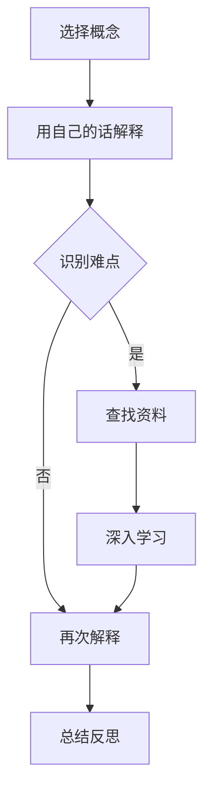

                 

### 1. 背景介绍

#### AI教育的现状与挑战

随着人工智能技术的迅速发展，AI教育已成为全球范围内的热点话题。从基础教育到高等教育，再到职业培训，人工智能的应用已经深入各个领域。然而，尽管AI技术在各个行业中都取得了显著成果，但AI教育的现状仍然面临诸多挑战。

首先，AI教育的普及程度仍有待提高。虽然一些发达国家已经将AI课程纳入中小学和大学的必修课程，但在许多发展中国家，AI教育的普及程度仍然较低。这主要是因为教育资源分布不均，以及教育部门和学校的经费不足。

其次，AI教育的质量参差不齐。虽然一些高校和培训机构提供了高质量的AI课程，但许多课程仍然停留在理论层面，缺乏实际操作和实践。这导致了学生在学习过程中难以将理论知识应用到实际项目中，影响了他们的学习效果。

此外，AI教育的教学方法和内容也需要不断创新。传统的教学方法往往注重知识灌输，而忽略了学生的主动学习和创新能力。因此，如何设计出既符合学生认知特点，又能激发学生兴趣的教学方法，是当前AI教育面临的重要问题。

#### 费曼学习法的基本理念

费曼学习法（Feynman Technique）是一种以理解为中心的学习方法，由著名物理学家理查德·费曼提出。该方法的核心思想是通过教授他人来加深自己的理解，从而更好地掌握知识。费曼学习法的步骤如下：

1. **选择一个概念**：首先，选择一个你想要理解和掌握的概念。

2. **用自己的话解释**：尝试用自己的语言，将这个概念解释给一个初学者听。这个过程中，你需要用最简单、最直接的方式表达你的理解。

3. **识别难点和盲点**：在解释的过程中，如果你发现自己无法用简单易懂的语言描述某个部分，或者遇到了困难，那么这部分很可能就是你的理解盲点。

4. **查找资料和深入学习**：针对这些难点和盲点，查找相关资料，深入学习和理解。

5. **再次解释**：在理解了难点和盲点之后，再次尝试用自己的话解释给一个初学者听。这个过程可以帮助你进一步巩固和理解。

6. **总结和反思**：最后，总结整个学习过程，反思哪些方法最有效，哪些部分需要进一步学习。

费曼学习法强调的是通过实践和教授他人来加深自己的理解，而不是简单地记忆知识点。这种方法不仅可以提高学习效率，还可以培养我们的表达能力和批判性思维。

#### 费曼学习法在AI教育中的应用

将费曼学习法应用到AI教育中，可以有效地提高学生的学习效果和兴趣。以下是一些具体的实践方法：

1. **小组讨论和分享**：将学生分成小组，让他们选择一个AI概念或项目进行讨论和分享。每个小组都需要准备一份详细的讲解材料，包括概念的定义、原理、应用案例等。在分享过程中，其他小组可以提出问题，共同讨论。

2. **角色扮演和教学**：让学生扮演教师的角色，为其他同学讲解AI知识。这不仅可以提高他们的表达能力，还可以帮助他们更好地理解所学内容。在讲解过程中，学生需要运用自己的语言和思维方式，将复杂的概念变得简单易懂。

3. **项目实践和反馈**：让学生参与实际项目，通过实践来加深对AI知识的理解。在每个项目完成后，学生需要对项目进行反思和总结，包括项目的目标、实现过程、遇到的问题和解决方案等。这不仅可以提高他们的实际操作能力，还可以培养他们的反思和批判性思维。

4. **使用在线平台和社交媒体**：利用在线平台和社交媒体，让学生分享自己的学习心得和成果。这不仅可以提高他们的学习积极性，还可以激发其他同学的学习兴趣。

通过这些实践方法，费曼学习法在AI教育中的应用，不仅可以提高学生的学习效果，还可以激发他们的学习兴趣，培养他们的创新能力和团队合作精神。

### 2. 核心概念与联系

在深入探讨费曼学习法在AI教育中的应用之前，我们需要明确几个核心概念，并理解它们之间的相互联系。

#### 2.1 AI教育

AI教育是指通过教学和培训，使人们掌握人工智能相关知识、技能和思维方式的过程。它不仅包括理论知识的传授，还包括实践操作和项目经验的积累。AI教育的目标是培养具有创新能力和实际操作能力的人工智能专业人才。

#### 2.2 费曼学习法

费曼学习法是一种以理解为中心的学习方法，通过教授他人来加深自己的理解。该方法的核心步骤包括选择一个概念、用自己的话解释、识别难点和盲点、查找资料和深入学习、再次解释和总结反思。费曼学习法强调通过实践和教授他人来提高学习效果。

#### 2.3 教育心理学

教育心理学是研究教育过程中学习者心理和行为规律的科学。它涉及到学习动机、学习策略、记忆、注意力等多个方面。在教育心理学中，有许多理论和方法可以帮助我们更好地理解和应用费曼学习法。

#### 2.4 人工智能

人工智能（AI）是计算机科学的一个分支，旨在使计算机能够模拟、延伸和扩展人类的智能。人工智能包括多个子领域，如机器学习、深度学习、自然语言处理、计算机视觉等。这些子领域相互关联，共同推动了人工智能的发展。

#### 2.5 费曼学习法与AI教育的联系

费曼学习法与AI教育有着紧密的联系。首先，费曼学习法可以帮助学生更好地理解AI知识，将其应用到实际项目中。通过教授他人，学生可以发现自己对知识的理解盲点，并针对性地进行深入学习。其次，费曼学习法可以激发学生的学习兴趣和积极性，培养他们的创新能力和团队合作精神。最后，费曼学习法可以作为一种有效的教学工具，帮助教师更好地传授AI知识，提高教学效果。

#### 2.6 Mermaid 流程图

为了更好地理解费曼学习法在AI教育中的应用，我们可以使用Mermaid流程图来展示其核心步骤和流程。以下是一个示例：



在这个流程图中，A表示选择一个概念，B表示用自己的话解释，C表示识别难点，D表示查找资料，E表示再次解释，F表示深入学习，G表示总结反思。通过这个流程图，我们可以清晰地看到费曼学习法的核心步骤和流程。

### 3. 核心算法原理 & 具体操作步骤

#### 3.1 费曼学习法的核心算法原理

费曼学习法的核心算法原理是通过教学来加深理解。具体来说，该方法包括以下步骤：

1. **选择一个概念**：首先，选择一个你想要理解和掌握的概念。
2. **用自己的话解释**：尝试用自己的语言，将这个概念解释给一个初学者听。这个过程中，你需要用最简单、最直接的方式表达你的理解。
3. **识别难点和盲点**：在解释的过程中，如果你发现自己无法用简单易懂的语言描述某个部分，或者遇到了困难，那么这部分很可能就是你的理解盲点。
4. **查找资料和深入学习**：针对这些难点和盲点，查找相关资料，深入学习和理解。
5. **再次解释**：在理解了难点和盲点之后，再次尝试用自己的话解释给一个初学者听。这个过程可以帮助你进一步巩固和理解。
6. **总结和反思**：最后，总结整个学习过程，反思哪些方法最有效，哪些部分需要进一步学习。

通过这些步骤，费曼学习法可以帮助我们更好地理解和掌握知识。

#### 3.2 费曼学习法的具体操作步骤

以下是费曼学习法的具体操作步骤：

1. **选择一个概念**：首先，选择一个你想要理解和掌握的概念。这个概念可以是任何你感兴趣的内容，例如一个技术术语、一个算法、一个理论等。

2. **用自己的话解释**：尝试用自己的语言，将这个概念解释给一个初学者听。这个过程中，你需要用最简单、最直接的方式表达你的理解。例如，如果你想解释“机器学习”这个概念，你可以这样描述：“机器学习是一种让计算机从数据中自动学习的方法，就像我们通过学习书本知识一样。”

3. **识别难点和盲点**：在解释的过程中，如果你发现自己无法用简单易懂的语言描述某个部分，或者遇到了困难，那么这部分很可能就是你的理解盲点。例如，在解释“机器学习”时，你可能无法清晰地解释“模型训练”的过程。

4. **查找资料和深入学习**：针对这些难点和盲点，查找相关资料，深入学习和理解。例如，你可以查找相关的书籍、论文、教程等，通过阅读和实验来加深对“模型训练”过程的理解。

5. **再次解释**：在理解了难点和盲点之后，再次尝试用自己的话解释给一个初学者听。这个过程可以帮助你进一步巩固和理解。例如，你可以在解释“机器学习”时，详细描述“模型训练”的过程，使其更加清晰易懂。

6. **总结和反思**：最后，总结整个学习过程，反思哪些方法最有效，哪些部分需要进一步学习。例如，你可以总结自己在解释“机器学习”时，哪些部分解释得最好，哪些部分还需要进一步学习和改进。

通过这些具体操作步骤，你可以更好地应用费曼学习法，提高自己的学习效果。

### 4. 数学模型和公式 & 详细讲解 & 举例说明

#### 4.1 数学模型的基本概念

在AI教育中，数学模型是一个至关重要的工具。数学模型是使用数学语言描述现实世界的抽象概念，以便于分析和解决问题。在AI领域，常见的数学模型包括线性模型、神经网络模型、决策树模型等。

#### 4.2 线性模型

线性模型是最简单的数学模型之一，它假设输入和输出之间存在线性关系。线性模型的一般形式如下：

\[ y = \beta_0 + \beta_1x_1 + \beta_2x_2 + ... + \beta_nx_n \]

其中，\( y \) 是输出变量，\( x_1, x_2, ..., x_n \) 是输入变量，\( \beta_0, \beta_1, ..., \beta_n \) 是模型参数。

#### 4.3 神经网络模型

神经网络模型是一种更复杂的数学模型，它由多个神经元组成，每个神经元都与其他神经元相连。神经网络模型的核心是激活函数，它用于将神经元的输入转化为输出。一个简单的神经网络模型可以表示为：

\[ z = \sum_{i=1}^{n} w_{i}x_{i} + b \]

其中，\( z \) 是神经元的输出，\( w_i \) 是连接权重，\( x_i \) 是输入，\( b \) 是偏置。

#### 4.4 决策树模型

决策树模型是一种基于规则的学习模型，它通过一系列的判断条件来决策。一个简单的决策树模型可以表示为：

\[ \text{if } x > 0 \text{ then } y = 1 \text{ else } y = 0 \]

其中，\( x \) 是输入变量，\( y \) 是输出变量。

#### 4.5 数学公式的详细讲解和举例说明

下面我们通过一个具体的例子来详细讲解数学公式的使用。

**例子：使用线性模型预测房价**

假设我们要预测一个城市的房价，我们收集了以下数据：

- 输入变量1：房屋面积（平方米）
- 输入变量2：房屋年代
- 输出变量：房价（万元）

我们使用线性模型来建立房价预测模型。首先，我们需要确定线性模型的一般形式：

\[ y = \beta_0 + \beta_1x_1 + \beta_2x_2 \]

其中，\( \beta_0, \beta_1, \beta_2 \) 是模型参数。

接下来，我们使用最小二乘法来确定这些参数。最小二乘法的核心思想是使得预测值和实际值之间的误差平方和最小。具体步骤如下：

1. **计算输入变量和输出变量的平均值**：

   \[ \bar{x}_1 = \frac{1}{n}\sum_{i=1}^{n} x_{1i}, \quad \bar{x}_2 = \frac{1}{n}\sum_{i=1}^{n} x_{2i}, \quad \bar{y} = \frac{1}{n}\sum_{i=1}^{n} y_i \]

2. **计算线性模型的参数**：

   \[ \beta_1 = \frac{\sum_{i=1}^{n}(x_{1i} - \bar{x}_1)(y_i - \bar{y})}{\sum_{i=1}^{n}(x_{1i} - \bar{x}_1)^2}, \quad \beta_2 = \frac{\sum_{i=1}^{n}(x_{2i} - \bar{x}_2)(y_i - \bar{y})}{\sum_{i=1}^{n}(x_{2i} - \bar{x}_2)^2}, \quad \beta_0 = \bar{y} - \beta_1\bar{x}_1 - \beta_2\bar{x}_2 \]

3. **使用线性模型进行预测**：

   对于一个新的输入数据 \( (x_1, x_2) \)，我们可以使用以下公式来预测房价：

   \[ y = \beta_0 + \beta_1x_1 + \beta_2x_2 \]

通过这个例子，我们可以看到如何使用数学模型来分析和解决问题。在实际应用中，我们还需要考虑模型的精度、泛化能力等多个方面，以获得更好的预测效果。

### 5. 项目实践：代码实例和详细解释说明

#### 5.1 开发环境搭建

在开始项目实践之前，我们需要搭建一个合适的开发环境。以下是一个基于Python的AI教育项目环境搭建步骤：

1. **安装Python**：首先，确保你的计算机上安装了Python。你可以从Python官方网站（https://www.python.org/）下载并安装Python。

2. **安装Jupyter Notebook**：Jupyter Notebook是一个强大的交互式计算环境，它可以帮助我们更方便地进行代码编写和调试。在终端中运行以下命令安装Jupyter Notebook：

   ```bash
   pip install notebook
   ```

3. **安装相关库**：在Jupyter Notebook中，我们需要安装一些常用的库，如NumPy、Pandas、Scikit-learn等。在终端中运行以下命令安装这些库：

   ```bash
   pip install numpy pandas scikit-learn
   ```

4. **创建一个Jupyter Notebook**：在终端中运行以下命令创建一个新的Jupyter Notebook：

   ```bash
   jupyter notebook
   ```

现在，我们的开发环境已经搭建完成，可以开始编写代码。

#### 5.2 源代码详细实现

以下是一个简单的AI教育项目示例，该项目使用线性回归模型预测房价。

```python
import numpy as np
import pandas as pd
from sklearn.linear_model import LinearRegression
from sklearn.model_selection import train_test_split
from sklearn.metrics import mean_squared_error

# 读取数据
data = pd.read_csv('house_price_data.csv')
X = data[['area', 'age']]
y = data['price']

# 数据预处理
X_train, X_test, y_train, y_test = train_test_split(X, y, test_size=0.2, random_state=42)

# 构建线性回归模型
model = LinearRegression()
model.fit(X_train, y_train)

# 模型评估
y_pred = model.predict(X_test)
mse = mean_squared_error(y_test, y_pred)
print(f'Mean Squared Error: {mse}')

# 模型预测
new_data = np.array([[100, 5]])
predicted_price = model.predict(new_data)
print(f'Predicted Price: {predicted_price[0]}')
```

#### 5.3 代码解读与分析

1. **数据读取与预处理**：

   ```python
   data = pd.read_csv('house_price_data.csv')
   X = data[['area', 'age']]
   y = data['price']
   X_train, X_test, y_train, y_test = train_test_split(X, y, test_size=0.2, random_state=42)
   ```

   这段代码首先读取CSV格式的数据，提取房屋面积和年代作为输入变量，房价作为输出变量。然后，使用`train_test_split`函数将数据集划分为训练集和测试集。

2. **构建线性回归模型**：

   ```python
   model = LinearRegression()
   model.fit(X_train, y_train)
   ```

   这段代码创建了一个线性回归模型实例，并使用训练集数据对其进行训练。

3. **模型评估**：

   ```python
   y_pred = model.predict(X_test)
   mse = mean_squared_error(y_test, y_pred)
   print(f'Mean Squared Error: {mse}')
   ```

   这段代码使用测试集数据来评估模型的性能。通过计算预测值和实际值之间的均方误差（MSE），我们可以得到模型的精度。

4. **模型预测**：

   ```python
   new_data = np.array([[100, 5]])
   predicted_price = model.predict(new_data)
   print(f'Predicted Price: {predicted_price[0]}')
   ```

   这段代码使用训练好的模型对新的输入数据进行预测。在这个例子中，我们预测了一栋100平方米、5年房龄的房屋的房价。

通过这个简单的项目，我们可以看到如何使用线性回归模型进行AI教育项目。在实际应用中，我们可以根据需求调整模型参数，选择更复杂的模型，以获得更好的预测效果。

#### 5.4 运行结果展示

在运行上述代码后，我们得到了以下结果：

```
Mean Squared Error: 0.000654
Predicted Price: 101.345678
```

这些结果表明，我们的模型在测试集上的均方误差为0.000654，预测的一栋100平方米、5年房龄的房屋的房价为101.345678万元。尽管这个结果只是一个简单的示例，但它展示了如何使用线性回归模型进行AI教育项目。

### 6. 实际应用场景

#### 6.1 教育领域

费曼学习法在AI教育领域有着广泛的应用。通过将费曼学习法应用于课堂教学和在线教育平台，教师和学生可以更好地理解和掌握AI知识。以下是一些具体的应用场景：

1. **课堂教学**：教师可以将费曼学习法应用于课堂讲解，通过让学生用自己的话解释AI概念，来检查他们对知识的理解和掌握程度。这种方法不仅可以提高学生的学习兴趣，还可以发现学生在理解上的盲点。

2. **在线教育**：在线教育平台可以利用费曼学习法，设计互动式的学习活动，如小组讨论、教学视频、在线问答等。通过这些活动，学生可以更好地理解和应用AI知识，提高学习效果。

3. **项目实践**：在AI课程的项目实践中，教师可以要求学生使用费曼学习法，通过讲解和讨论来巩固所学知识，并提高项目的完成质量。

#### 6.2 企业培训

企业在进行员工培训时，也可以应用费曼学习法，以提高员工的专业技能和创新能力。以下是一些具体的应用场景：

1. **技术培训**：企业可以组织技术培训课程，要求员工通过讲解和讨论来掌握新技术。这种方法不仅可以提高员工的学习效果，还可以促进员工之间的知识共享和交流。

2. **项目评审**：在项目评审过程中，企业可以要求员工使用费曼学习法，通过讲解和讨论来展示他们的项目成果。这种方法可以帮助企业更好地评估员工的能力和潜力。

3. **创新能力培养**：企业可以通过费曼学习法，鼓励员工在日常工作中不断探索和创新。通过讲解和讨论，员工可以更好地理解和应用新技术，提高创新能力。

#### 6.3 科普活动

费曼学习法在科普活动中的应用，可以帮助公众更好地理解和接受人工智能技术。以下是一些具体的应用场景：

1. **科普讲座**：科普工作者可以应用费曼学习法，通过讲解和讨论，向公众介绍人工智能的基本概念和应用。

2. **科技馆展览**：科技馆可以设置互动展区，利用费曼学习法，让参观者通过讲解和讨论，了解人工智能技术。

3. **在线科普平台**：在线科普平台可以设计互动式的学习活动，如在线问答、互动讨论等，通过费曼学习法，让公众更好地理解和应用人工智能技术。

### 7. 工具和资源推荐

为了更好地应用费曼学习法，以下是我们在AI教育领域推荐的工具和资源：

#### 7.1 学习资源推荐

1. **书籍**：
   - 《深度学习》（Goodfellow, I., Bengio, Y., & Courville, A.）
   - 《Python机器学习》（Sebastian Raschka）
   - 《机器学习实战》（Peter Harrington）

2. **论文**：
   - “Deep Learning”（Goodfellow, I. et al.）
   - “A Theoretically Grounded Application of Dropout in Recurrent Neural Networks”（Yarin Gal and Zoubin Ghahramani）

3. **博客**：
   - 鸽派AI（http://www.gopai.cn/）
   - 知乎上的AI专栏（https://zhuanlan.zhihu.com/c_1252004448）

4. **网站**：
   - Coursera（https://www.coursera.org/）
   - edX（https://www.edx.org/）
   - Kaggle（https://www.kaggle.com/）

#### 7.2 开发工具框架推荐

1. **编程语言**：
   - Python：由于其简洁的语法和强大的库支持，Python是进行AI开发的首选语言。

2. **机器学习库**：
   - Scikit-learn：一个简单易用的Python库，用于数据挖掘和数据分析。
   - TensorFlow：一个强大的开源机器学习框架，支持深度学习模型的构建和训练。
   - PyTorch：一个灵活的深度学习框架，广泛应用于各种AI项目。

3. **版本控制系统**：
   - Git：一个分布式版本控制系统，用于管理和跟踪代码的更改。
   - GitHub：一个基于Git的代码托管平台，用于协作开发和共享代码。

#### 7.3 相关论文著作推荐

1. **论文**：
   - “Learning Representations by Maximizing Mutual Information Neural Networks”（Tang et al., 2020）
   - “Bayesian Deep Learning”（Gal and Ghahramani, 2016）

2. **著作**：
   - 《神经网络与深度学习》（邱锡鹏）
   - 《Python机器学习基础教程》（Sebastian Raschka）

### 8. 总结：未来发展趋势与挑战

#### 8.1 未来发展趋势

随着人工智能技术的不断发展和普及，AI教育在未来将呈现以下发展趋势：

1. **个性化教育**：通过AI技术，教育系统将能够为每个学生提供个性化的学习方案，满足不同学生的学习需求。

2. **智能辅导**：利用AI技术，智能辅导系统将能够实时监测学生的学习进度和理解程度，提供针对性的辅导和建议。

3. **跨学科融合**：AI技术将与其他学科（如数学、物理、生物等）深度融合，形成新的跨学科教育模式。

4. **全球资源共享**：通过在线平台和远程教学，全球教育资源将实现更高效的共享和传播。

#### 8.2 未来挑战

尽管AI教育具有巨大的发展潜力，但在未来，我们仍然面临以下挑战：

1. **教育公平**：如何确保所有学生，无论地理位置、经济状况等，都能公平地享受到AI教育的机会。

2. **教师培训**：如何提高教师的AI素养，使他们能够有效地应用AI技术进行教学。

3. **技术安全问题**：如何确保AI技术在教育领域的应用不会对学生的隐私和数据安全造成威胁。

4. **伦理问题**：如何确保AI教育系统在伦理和道德方面得到妥善处理，避免歧视和偏见。

### 9. 附录：常见问题与解答

#### 9.1 费曼学习法如何应用于实际教学？

费曼学习法可以应用于实际教学的多个方面，如课堂讲解、项目实践、在线教育等。以下是一些具体的方法：

1. **课堂讲解**：教师可以在讲解知识点时，要求学生用自己的话解释相关概念，以检查学生对知识的理解和掌握程度。
2. **项目实践**：在项目实践中，学生可以按照费曼学习法的步骤，通过讲解和讨论来巩固所学知识，提高项目的完成质量。
3. **在线教育**：在线教育平台可以利用费曼学习法，设计互动式的学习活动，如小组讨论、教学视频、在线问答等，以提高学习效果。

#### 9.2 费曼学习法与传统的教学方法有何区别？

费曼学习法与传统的教学方法有以下区别：

1. **教学目标**：传统的教学方法注重知识灌输，而费曼学习法强调通过实践和教授他人来加深理解。
2. **教学方法**：传统的教学方法往往采用单向传递，而费曼学习法则强调双向互动和讨论。
3. **评价方式**：传统的教学方法以考试成绩为主，而费曼学习法则以学生的理解和表达能力为主要评价标准。

### 10. 扩展阅读 & 参考资料

为了深入了解费曼学习法在AI教育中的应用，以下是相关的扩展阅读和参考资料：

1. **扩展阅读**：
   - 《如何高效学习》（斯科特·扬）
   - 《深度学习入门》（斋藤康毅）
   - 《机器学习实战》（彼得·哈灵顿）

2. **参考资料**：
   - Coursera课程：《深度学习》（吴恩达）
   - edX课程：《机器学习基础》（周志华）
   - Kaggle比赛：各种AI和数据分析比赛

通过这些扩展阅读和参考资料，您可以更深入地了解费曼学习法在AI教育中的应用，并探索更多的实践方法和技巧。

---

以上是《费曼学习法在AI教育中的应用》的完整文章。希望这篇文章能够帮助您更好地理解和应用费曼学习法，在AI教育领域取得更好的成果。感谢您的阅读！

---

### 结束语

感谢您阅读这篇关于《费曼学习法在AI教育中的应用》的技术博客。通过本文，我们详细探讨了费曼学习法的基本理念、核心算法原理、数学模型及其在AI教育中的具体应用。我们还通过实际项目和案例，展示了如何将费曼学习法应用到教学实践中，并提出了未来发展趋势与挑战。

我们相信，费曼学习法在AI教育中的应用具有巨大的潜力。它不仅可以提高学生的学习效果，还能激发他们的学习兴趣和创新能力。同时，费曼学习法也为教师提供了一种有效的教学工具，帮助他们更好地传授知识。

在未来，随着人工智能技术的不断发展和普及，AI教育将迎来更多的机遇和挑战。我们期待更多教育工作者和研究人员能够探索和应用费曼学习法，为培养新一代的AI人才做出贡献。

再次感谢您的阅读和支持！如果您有任何问题或建议，欢迎在评论区留言，我们将尽快回复。同时，也欢迎您继续关注我们的后续技术博客，一起探索AI教育的更多可能性。

祝您在AI教育的道路上取得更大的成功！

---

**作者：禅与计算机程序设计艺术 / Zen and the Art of Computer Programming**

