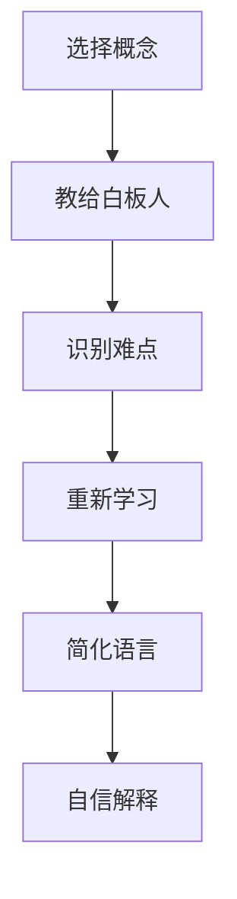

                 

 在现代企业和组织中，团队学习与成长的重要性日益凸显。为了提升团队整体的技术能力和解决问题的效率，我们需要探索更有效的学习方法和策略。本文将介绍一种被称为“费曼提问法”的学习方法，并探讨如何将其应用于团队学习中，以促进团队成员的深度理解和持续成长。

## 1. 背景介绍

费曼提问法（Feynman Technique）起源于物理学家理查德·费曼（Richard Feynman）的教学方法。费曼以其简洁明了的讲解风格和对复杂概念的深入理解而闻名。费曼提问法的核心理念是通过提问来检验和巩固自己的知识。这种方法不仅适用于个人学习，也能有效地应用于团队学习场景中。

在团队学习环境中，费曼提问法可以帮助成员：

1. **深化理解**：通过提问和回答，团队成员能够更加深入地理解所学知识。
2. **培养表达能力**：团队成员在解释问题过程中，需要用自己的语言来表达复杂的概念，这有助于提升表达能力和沟通技巧。
3. **识别知识盲点**：在回答过程中，团队成员可能会发现自己的知识盲点，从而有针对性地进行补充学习。
4. **促进合作与交流**：费曼提问法鼓励团队成员之间的互动，有助于建立更加紧密的团队合作关系。

## 2. 核心概念与联系

### 费曼提问法的四个步骤

**步骤一：选择一个概念**

选择一个你想要深入理解的概念或知识点。

**步骤二：教给一个“白板”的人**

想象你正在向一个完全不懂这个概念的人解释，你只能使用最基本、最直观的语言和概念。

**步骤三：识别难点**

在解释的过程中，如果你遇到了难以解释清楚的地方，这通常意味着你对这个概念的理解不够深刻。这时，你需要回到原点，重新学习和理解这部分内容。

**步骤四：简化语言**

用尽可能简洁、清晰的语言重新解释这个概念，直到你能够自信地用简单的语言解释清楚。

### 费曼提问法的 Mermaid 流程图



## 3. 核心算法原理 & 具体操作步骤

### 核心算法原理

费曼提问法的核心算法原理是通过提问和回答来检验和巩固知识。这种方法强调：

1. **主动学习**：通过主动解释和提问，而不是被动接受信息，可以更好地记忆和理解知识。
2. **反馈机制**：通过他人的反馈来识别和理解自己的知识盲点。

### 具体操作步骤

**步骤一：选择概念**

选择一个团队中普遍存在的、有争议的或复杂的问题或概念。

**步骤二：构建学习小组**

将团队成员分为小组，每个小组负责一个概念的学习和解释。

**步骤三：角色扮演**

每个小组成员分别扮演“教师”和“学生”。教师负责向学生解释选定的概念，学生则提出问题以检验教师的理解深度。

**步骤四：反馈与改进**

教师解释完毕后，学生提出问题。教师回答问题后，整个小组讨论并评估解释的清晰度和准确性。

**步骤五：总结与分享**

每个小组分享他们的学习和讨论结果，整个团队进行总结和反馈。

## 4. 数学模型和公式 & 详细讲解 & 举例说明

### 数学模型和公式

费曼提问法的数学模型可以简化为：

$$
模型 = 知识理解度 \times 提问频率
$$

### 详细讲解

- **知识理解度**：表示团队成员对某个概念的理解程度。理解度越高，说明对概念掌握得越牢固。
- **提问频率**：表示团队成员在解释过程中提问的次数。提问频率越高，说明团队成员越主动地参与学习过程。

### 举例说明

**例子**：假设团队正在学习机器学习中的“线性回归”概念。

- **知识理解度**：团队成员需要通过阅读教材、观看视频、参与讨论等方式，深入理解线性回归的原理、公式和应用场景。
- **提问频率**：在小组讨论中，团队成员可以互相提问，例如“线性回归中的损失函数是什么？”、“如何解释线性回归中的权重更新过程？”等问题。

## 5. 项目实践：代码实例和详细解释说明

### 项目背景

在一个软件开发团队中，成员们需要学习一种新的编程语言。为了提高学习效率，团队决定使用费曼提问法进行学习。

### 代码实例

```python
# 示例：Python 中列表的基本操作

# 定义一个列表
my_list = [1, 2, 3, 4, 5]

# 添加元素
my_list.append(6)

# 移除元素
my_list.remove(2)

# 获取元素
element = my_list[2]

# 遍历列表
for item in my_list:
    print(item)
```

### 详细解释说明

1. **定义列表**：使用 `my_list = [1, 2, 3, 4, 5]` 创建一个包含五个整数的列表。
2. **添加元素**：使用 `my_list.append(6)` 在列表末尾添加一个元素。
3. **移除元素**：使用 `my_list.remove(2)` 移除列表中的元素。
4. **获取元素**：使用 `element = my_list[2]` 获取列表中的第三个元素。
5. **遍历列表**：使用 `for item in my_list:` 遍历列表并打印每个元素。

通过费曼提问法，团队成员可以互相提问，例如：

- **提问**：“如何添加元素到列表？”
- **回答**：“使用 append() 方法。”
- **提问**：“如何移除列表中的元素？”
- **回答**：“使用 remove() 方法。”

## 6. 实际应用场景

### 教育领域

费曼提问法在教育领域中应用广泛。教师可以将其应用于课堂教学中，鼓励学生提问和解释概念，从而提高学习效果。

### 企业培训

在企业培训中，费曼提问法可以帮助员工快速掌握新技能和知识。例如，新员工可以通过向同事提问来了解公司的运作方式。

### 团队协作

在团队协作项目中，费曼提问法有助于团队成员之间建立更好的沟通和理解。团队成员可以通过提问和回答来共同解决问题。

### 个人学习

个人学习者可以使用费曼提问法来检验自己的知识掌握情况。通过向自己提问，个人可以更好地理解和记忆所学内容。

## 7. 工具和资源推荐

### 工具

- **Mermaid**：用于绘制流程图的在线工具，可以帮助团队绘制费曼提问法的流程图。
- **MindMap**：用于构建思维导图的工具，可以帮助团队整理和梳理知识结构。

### 资源

- **《费曼学习法》**：一本关于费曼学习法的书籍，详细介绍了如何应用这种方法提高学习效果。
- **费曼提问法教学视频**：在 YouTube 上可以找到许多关于费曼提问法的教学视频，适用于不同领域的知识学习。

## 8. 总结：未来发展趋势与挑战

### 发展趋势

- **跨学科应用**：费曼提问法不仅在技术领域有广泛应用，还逐渐渗透到心理学、教育学等领域。
- **个性化学习**：随着人工智能技术的发展，费曼提问法有望与个性化学习系统结合，为每个学习者提供更精准的学习建议。

### 挑战

- **知识鸿沟**：对于某些复杂领域，团队成员可能难以用简单的语言解释复杂的概念，这需要更多的时间和经验积累。
- **文化差异**：在不同文化背景下，费曼提问法的应用可能面临挑战，需要适应不同的沟通和交流方式。

## 9. 附录：常见问题与解答

### 问题一：如何选择合适的概念？

**解答**：选择那些在团队中普遍存在的、有争议的或复杂的问题或概念。这样可以确保团队成员都有共同的学习目标和兴趣。

### 问题二：如何评估学习效果？

**解答**：可以通过定期的学习评估和团队讨论来评估学习效果。同时，鼓励团队成员相互反馈，以识别和解决知识盲点。

## 10. 扩展阅读 & 参考资料

- **《费曼学习法》**：Richard P. Feynman, "The Pleasure of Finding Things Out"
- **《深度工作》**：Cal Newport, "Deep Work"
- **《如何学习》**：Peter Hollins, "How to Learn"

---

通过费曼提问法，团队不仅可以提升成员的知识水平，还能培养良好的学习习惯和团队合作精神。让我们一起探索和应用这种方法，推动团队不断成长和进步。

## 文章关键词

- 费曼提问法
- 团队学习
- 学习策略
- 教学方法
- 知识巩固
- 沟通技巧
- 知识传递
- 技术培训
- 个人成长
- 教育心理学

## 文章摘要

本文介绍了费曼提问法在团队学习中的应用，探讨其如何促进成员深度理解和持续成长。文章从背景介绍、核心概念与联系、操作步骤、数学模型、实际应用场景等多个角度展开，提供了丰富的实例和资源推荐，旨在为团队提供一种有效提升学习效果的方法。

### 作者署名

作者：禅与计算机程序设计艺术 / Zen and the Art of Computer Programming

---

感谢您的阅读，希望本文能够帮助您在团队学习中找到新的方法和灵感。如果您有任何问题或建议，欢迎在评论区留言，让我们共同探讨和学习。再次感谢您的关注和支持！

