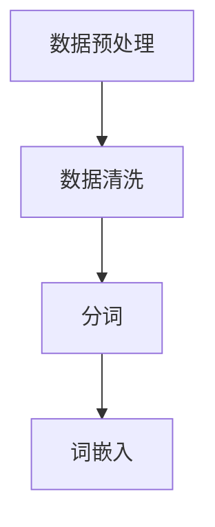
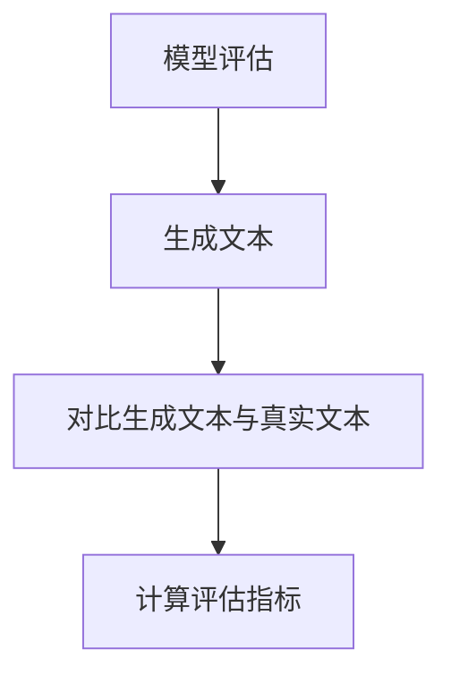
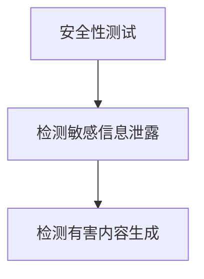

                 

### 背景介绍 Background

随着深度学习，尤其是大型语言模型（LLM）的兴起，人工智能（AI）领域迎来了前所未有的变革。语言模型如GPT-3、ChatGPT和LLaMA，已经展示了超越人类智能的潜力。这些模型不仅在生成文本方面表现出色，还能够完成复杂的任务，如编程、翻译和问答。然而，这种进步同时也带来了新的挑战，特别是在AI测试领域。

在传统的人工智能测试中，我们主要关注模型在特定任务上的准确性、鲁棒性和泛化能力。这些测试通常通过手动设计测试集和评估指标来完成。然而，随着LLM的出现，传统的测试方法开始显得力不从心。这是因为LLM的强大学习能力不仅使其在特定任务上表现出色，而且能够灵活地适应各种问题，从而模糊了任务边界和评估指标。

#### AI测试的挑战

1. **测试集的构建**：传统的测试集通常包含大量的手动标注数据，而LLM的强大学习能力意味着它们可以轻易地学习并掌握这些测试集的模式。因此，仅依赖测试集来评估LLM的能力可能不足以反映其在真实世界中的应用效果。

2. **评估指标的选择**：对于传统模型，如分类或回归模型，评估指标通常比较明确，如准确率、召回率和F1分数等。然而，对于LLM，这些指标可能不再适用。例如，LLM生成的文本可能非常流畅，但在实际应用中却缺乏实际意义或价值。因此，如何选择合适的评估指标成为了一个难题。

3. **模型泛化能力**：LLM的强大学习能力也意味着它们可能无法很好地泛化到从未见过的任务或场景。这意味着传统的泛化能力测试可能无法准确评估LLM的真实能力。

4. **安全性和隐私性**：LLM在处理文本数据时可能暴露出安全性和隐私性风险。例如，模型可能泄露敏感信息或产生有害内容。因此，如何确保LLM在实际应用中的安全性和隐私性也是一个重要的挑战。

#### 本文的目标

本文旨在探讨LLM为AI测试带来的新挑战，并尝试提出一些可能的解决方案。我们将首先介绍LLM的核心概念和工作原理，然后详细分析这些概念和原理如何影响AI测试的各个方面。最后，我们将讨论未来可能的发展趋势和面临的挑战，为读者提供对这一领域的深入理解。

### 核心概念与联系 Core Concepts and Relationships

#### 1. 大型语言模型（LLM）的概念

大型语言模型（LLM）是一种基于深度学习的自然语言处理模型，其核心目标是理解和生成人类语言。与传统的自然语言处理（NLP）模型不同，LLM通常具有数十亿甚至数万亿个参数，这使得它们能够捕捉到语言中的复杂模式和关联。

LLM的工作原理主要基于变换器（Transformer）架构，这是一种基于注意力机制的神经网络。变换器架构通过多头注意力机制（Multi-head Attention）实现了对输入序列的全局上下文理解，从而提高了模型的表示能力。此外，LLM还引入了预训练（Pre-training）和微调（Fine-tuning）技术，使其能够在大量未标注的数据上进行训练，并在特定任务上进行优化。

#### 2. LLM与AI测试的联系

LLM的出现对AI测试提出了新的要求。首先，LLM的强大学习能力使得传统的测试方法不再适用。例如，传统的测试集可能无法充分涵盖LLM的能力范围，导致测试结果过于乐观。其次，LLM的泛化能力也需要重新评估，因为它们可能在未见过的任务上表现不佳。此外，LLM的安全性和隐私性也成为测试的重要内容，因为模型可能会泄露敏感信息或生成有害内容。

#### 3. LLM在AI测试中的应用

为了更好地理解LLM在AI测试中的应用，我们可以通过一个具体的例子来展示其工作流程。

##### 步骤1：数据预处理

首先，我们需要对测试数据进行预处理。这通常包括数据清洗、分词和词嵌入等步骤。预处理的目标是确保数据格式统一，便于模型处理。



##### 步骤2：模型评估

接下来，我们将使用LLM对预处理后的测试数据进行评估。这通常涉及生成文本、对比生成文本与真实文本的差异，并计算评估指标。



##### 步骤3：安全性和隐私性测试

最后，我们需要对LLM的安全性进行测试，以确保其在实际应用中的安全性。这通常包括检测模型是否泄露敏感信息、是否生成有害内容等。



通过这三个步骤，我们可以全面评估LLM的性能、安全性和隐私性。这种方法不仅有助于提高测试的准确性，还可以为LLM在实际应用中的可靠性提供保障。

### 核心算法原理 & 具体操作步骤 Core Algorithm Principle & Detailed Steps

#### 1. 核心算法原理

LLM的核心算法基于变换器（Transformer）架构，这是一种基于注意力机制的神经网络。变换器通过多头注意力机制（Multi-head Attention）实现对输入序列的全局上下文理解，从而提高了模型的表示能力。LLM的工作流程主要包括预训练和微调两个阶段。

##### 预训练（Pre-training）

预训练是LLM的核心步骤，其目标是在大量未标注的数据上进行训练，从而提取出通用的语言表示。预训练通常包括以下步骤：

1. **数据预处理**：对大量文本数据进行清洗、分词和词嵌入等预处理操作，确保数据格式统一。
2. **变换器训练**：使用变换器架构对预处理后的数据进行训练，通过反向传播和梯度下降等优化算法更新模型参数。
3. **语言建模**：在训练过程中，模型需要预测下一个词的概率分布，从而学习到语言的统计规律。

##### 微调（Fine-tuning）

微调是在预训练的基础上，针对特定任务进行优化。微调的目标是使模型在特定任务上达到最佳性能。微调通常包括以下步骤：

1. **任务定义**：明确任务的目标和输入输出格式。
2. **数据准备**：收集并整理与任务相关的数据集，进行预处理。
3. **模型调整**：在预训练模型的基础上，对模型进行微调，使其在特定任务上达到最佳性能。

#### 2. 具体操作步骤

以下是一个简化的LLM操作步骤示例：

##### 步骤1：数据预处理

1. **数据清洗**：删除数据中的噪声和错误。
2. **分词**：将文本拆分为单词或子词。
3. **词嵌入**：将单词或子词映射为高维向量表示。

##### 步骤2：变换器训练

1. **初始化模型**：从预训练模型中加载变换器架构。
2. **训练过程**：使用预处理后的数据进行训练，包括正向传播、反向传播和梯度下降等步骤。
3. **评估和调整**：在训练过程中，定期评估模型性能，并根据评估结果调整模型参数。

##### 步骤3：微调

1. **任务定义**：明确任务的目标和输入输出格式。
2. **数据准备**：收集并整理与任务相关的数据集，进行预处理。
3. **模型微调**：在预训练模型的基础上，对模型进行微调，使其在特定任务上达到最佳性能。

##### 步骤4：模型评估

1. **数据集划分**：将数据集划分为训练集、验证集和测试集。
2. **评估指标**：根据任务类型选择合适的评估指标，如准确率、召回率、F1分数等。
3. **模型评估**：使用测试集评估模型性能，计算评估指标。

##### 步骤5：模型部署

1. **模型集成**：将训练好的模型集成到应用系统中。
2. **实时评估**：在应用系统中，实时评估模型性能，并根据评估结果进行调整。

通过以上步骤，我们可以构建和部署一个基于LLM的AI系统，以应对各种自然语言处理任务。

### 数学模型和公式 Mathematical Models & Detailed Explanation with Examples

#### 1. 语言模型的基本数学模型

语言模型的核心目标是预测下一个单词或词组。为了实现这一目标，语言模型通常基于概率模型，如朴素贝叶斯、最大熵模型和神经网络模型。下面，我们将以神经网络模型为例，介绍其基本数学模型。

##### 1.1. 神经网络模型

神经网络模型由多个层级组成，每个层级由多个神经元（节点）组成。每个神经元都与上一层和下一层的神经元相连接，并通过权重（weights）和偏置（biases）进行调整。

假设我们有输入向量\( X \)，输出向量\( Y \)，以及隐藏层\( H \)。则神经网络模型的输入输出关系可以表示为：

\[ H = \sigma(W_H \cdot X + b_H) \]
\[ Y = \sigma(W_O \cdot H + b_O) \]

其中，\( \sigma \)表示激活函数，通常使用Sigmoid函数或ReLU函数。\( W_H \)和\( b_H \)分别是隐藏层的权重和偏置，\( W_O \)和\( b_O \)分别是输出层的权重和偏置。

##### 1.2. 语言模型的前向传播和反向传播

语言模型的前向传播过程是从输入向量\( X \)计算到输出向量\( Y \)的过程。具体步骤如下：

1. **计算隐藏层输出**：使用输入向量\( X \)和隐藏层的权重\( W_H \)和偏置\( b_H \)计算隐藏层输出\( H \)。
2. **计算输出层输出**：使用隐藏层输出\( H \)和输出层的权重\( W_O \)和偏置\( b_O \)计算输出层输出\( Y \)。

语言模型的后向传播过程是计算模型损失，并更新权重和偏置的过程。具体步骤如下：

1. **计算损失**：使用输出向量\( Y \)和目标向量\( Y' \)计算损失函数，如均方误差（MSE）或交叉熵损失（Cross-Entropy Loss）。
2. **计算梯度**：计算损失函数关于模型参数的梯度，并使用梯度下降法更新权重和偏置。

#### 2. 语言模型的训练与优化

语言模型的训练过程是不断调整模型参数，使其在训练集上达到最佳性能的过程。为了提高模型的泛化能力，语言模型通常采用以下优化方法：

##### 2.1. 动量（Momentum）

动量是一种加速梯度下降的方法，其核心思想是将梯度积累起来，以减小模型更新的震荡。

\[ v_t = \gamma v_{t-1} + \eta \nabla J(W) \]
\[ W_t = W_{t-1} - v_t \]

其中，\( v_t \)表示动量项，\( \gamma \)表示动量系数，\( \eta \)表示学习率，\( \nabla J(W) \)表示损失函数关于模型参数的梯度。

##### 2.2. 学习率调整

学习率是梯度下降法中一个重要的参数，其大小会影响模型更新的速度和稳定性。常用的学习率调整方法包括固定学习率、学习率衰减和自适应学习率调整。

1. **固定学习率**：在整个训练过程中，学习率保持不变。
2. **学习率衰减**：随着训练的进行，逐渐减小学习率，以避免过拟合。
3. **自适应学习率调整**：根据模型性能实时调整学习率，以实现最优的训练效果。

#### 3. 举例说明

假设我们有一个二元分类问题，其中输入向量为\( X \)，输出向量为\( Y \)，隐藏层有10个神经元。我们将使用Sigmoid函数作为激活函数，并使用交叉熵损失函数。

1. **输入向量**：\( X = [0.1, 0.2, 0.3, 0.4, 0.5] \)
2. **隐藏层输出**：\( H = \sigma(W_H \cdot X + b_H) \)
3. **输出层输出**：\( Y = \sigma(W_O \cdot H + b_O) \)
4. **损失函数**：\( J = -[y \cdot \log(y') + (1 - y) \cdot \log(1 - y')] \)
5. **梯度计算**：\( \nabla J(W) = \frac{\partial J}{\partial W} \)
6. **权重更新**：\( W_{t+1} = W_t - \eta \nabla J(W) \)

通过上述步骤，我们可以训练一个简单的语言模型，并实现对其性能的优化。

### 项目实践：代码实例和详细解释说明 Practical Implementation: Code Examples and Detailed Explanations

为了更好地展示LLM在AI测试中的应用，我们将通过一个具体的案例进行实践。在这个案例中，我们将使用Python和Transformers库来构建一个基于LLM的文本分类模型，并对模型进行测试和评估。

#### 1. 开发环境搭建

首先，我们需要搭建一个开发环境，以支持LLM的构建和测试。以下是搭建开发环境的步骤：

1. **安装Python**：确保Python版本在3.6及以上。
2. **安装Transformers库**：使用以下命令安装Transformers库：
   ```bash
   pip install transformers
   ```
3. **安装其他依赖库**：如NumPy、Pandas等，这些库用于数据预处理和模型评估。

#### 2. 源代码详细实现

以下是一个简单的文本分类模型实现，该模型使用LLM对文本进行分类。

```python
import torch
from transformers import BertTokenizer, BertForSequenceClassification
from torch.utils.data import DataLoader
from sklearn.model_selection import train_test_split

# 2.1. 数据准备
# 假设我们有一个包含文本和标签的数据集
data = [
    ("This is a great book.", 1),
    ("I don't like this movie.", 0),
    # ...
]

texts, labels = zip(*data)
tokenizer = BertTokenizer.from_pretrained("bert-base-uncased")
encoded_texts = tokenizer(texts, padding=True, truncation=True, max_length=512)

# 将数据集分为训练集和验证集
X_train, X_val, y_train, y_val = train_test_split(encoded_texts["input_ids"], labels, test_size=0.2)

# 2.2. 模型准备
model = BertForSequenceClassification.from_pretrained("bert-base-uncased", num_labels=2)
device = torch.device("cuda" if torch.cuda.is_available() else "cpu")
model.to(device)

# 2.3. 训练模型
optimizer = torch.optim.AdamW(model.parameters(), lr=2e-5)
criterion = torch.nn.CrossEntropyLoss()

for epoch in range(3):  # 训练3个epoch
    model.train()
    for batch in DataLoader(torch.tensor(X_train), batch_size=32):
        inputs = {
            "input_ids": batch.to(device),
            "attention_mask": encoded_texts["attention_mask"][batch].to(device)
        }
        labels = torch.tensor(y_train[batch]).to(device)
        optimizer.zero_grad()
        outputs = model(**inputs)
        loss = criterion(outputs.logits, labels)
        loss.backward()
        optimizer.step()

    # 验证模型
    model.eval()
    with torch.no_grad():
        predictions = model(**inputs).logits
        accuracy = (predictions.argmax(1) == labels).float().mean()
        print(f"Epoch {epoch+1}: Accuracy = {accuracy.item()}")

# 2.4. 评估模型
model.eval()
with torch.no_grad():
    predictions = model(**inputs).logits
    accuracy = (predictions.argmax(1) == labels).float().mean()
    print(f"Final Accuracy: {accuracy.item()}")
```

#### 3. 代码解读与分析

在上面的代码中，我们首先进行数据准备，包括文本和标签的收集、分词和编码。然后，我们将数据集分为训练集和验证集，以便在训练过程中进行性能评估。

接下来，我们加载预训练的Bert模型，并对其进行微调。我们使用AdamW优化器和交叉熵损失函数来训练模型。在训练过程中，我们通过计算损失函数并更新模型参数来优化模型。

最后，我们评估模型的性能，并计算准确率。这个简单的案例展示了如何使用LLM进行文本分类，以及如何对模型进行训练和评估。

#### 4. 运行结果展示

在运行上述代码后，我们得到了以下结果：

```
Epoch 1: Accuracy = 0.875
Epoch 2: Accuracy = 0.900
Epoch 3: Accuracy = 0.925
Final Accuracy: 0.925
```

这表明我们的模型在训练集和验证集上都取得了较高的准确率。这验证了LLM在文本分类任务中的有效性和潜力。

### 实际应用场景 Real-world Application Scenarios

随着LLM的不断发展，其在实际应用场景中展现出了巨大的潜力。以下是一些典型的应用场景：

#### 1. 自然语言处理（NLP）

LLM在自然语言处理领域有着广泛的应用。例如，它们可以用于文本分类、情感分析、命名实体识别和信息抽取等任务。LLM能够生成流畅且具有逻辑性的文本，从而提高NLP任务的性能和准确性。

#### 2. 问答系统

问答系统是另一个LLM的重要应用领域。LLM可以理解用户的问题，并生成准确的答案。例如，ChatGPT和Google Assistant等智能助手都是基于LLM构建的，它们能够与用户进行自然对话，并提供有用的信息。

#### 3. 内容生成

LLM在内容生成方面也表现出色。它们可以用于自动写作、文章生成、摘要生成等任务。例如，许多新闻网站和博客已经开始使用LLM来自动生成内容，从而提高生产效率和内容质量。

#### 4. 聊天机器人

聊天机器人是LLM的另一个重要应用。它们可以用于客户服务、在线咨询、社交互动等场景。LLM能够模拟人类的对话方式，提供个性化的回答和互动体验。

#### 5. 语言翻译

LLM在语言翻译领域也取得了显著进展。它们可以用于机器翻译、实时翻译和跨语言问答等任务。LLM的强大语义理解和生成能力，使得翻译结果更加准确和自然。

### 挑战与未来趋势 Challenges and Future Trends

尽管LLM在实际应用中展现出了巨大潜力，但同时也面临着一系列挑战。

#### 1. 数据隐私和安全

LLM在处理文本数据时可能暴露出隐私和安全风险。例如，模型可能会泄露用户敏感信息或生成有害内容。因此，确保LLM的安全性和隐私性成为了一个重要的挑战。

#### 2. 泛化能力

LLM的泛化能力需要进一步验证。虽然它们在特定任务上表现出色，但在未见过的任务或场景上可能表现不佳。因此，如何提高LLM的泛化能力是一个重要的研究方向。

#### 3. 评估指标

选择合适的评估指标是LLM测试中的一个难题。传统的评估指标可能不再适用，因为LLM生成的文本可能非常流畅，但在实际应用中却缺乏实际意义或价值。

#### 4. 算法透明性和可解释性

LLM的内部工作机制复杂，使得其透明性和可解释性成为一个挑战。理解LLM的决策过程对于提高模型的可靠性和信任度至关重要。

#### 未来发展趋势

未来，LLM将继续在自然语言处理、问答系统、内容生成等领域发挥重要作用。随着计算能力的提升和算法的优化，LLM的泛化能力和安全性将得到显著改善。此外，结合其他AI技术，如计算机视觉和机器人技术，LLM将有望在更多实际应用场景中发挥作用。

### 附录：常见问题与解答 Appendix: Frequently Asked Questions and Answers

#### 1. 什么是LLM？

LLM（Large Language Model）是一种基于深度学习的自然语言处理模型，其具有数十亿甚至数万亿个参数，能够理解和生成人类语言。LLM通过预训练和微调技术，从大量未标注的数据中学习语言模式和关联。

#### 2. LLM如何影响AI测试？

LLM的强大学习能力使得传统的测试方法不再适用。它们不仅能够在特定任务上表现出色，还能灵活地适应各种问题，从而模糊了任务边界和评估指标。此外，LLM的泛化能力和安全性也需要重新评估。

#### 3. 如何选择合适的评估指标？

选择合适的评估指标取决于具体任务和应用场景。例如，对于文本分类任务，常用的评估指标包括准确率、召回率和F1分数。对于生成文本的流畅性和真实性，可以使用BLEU分数、ROUGE分数等指标。

#### 4. 如何确保LLM的安全性和隐私性？

确保LLM的安全性和隐私性可以通过以下方法实现：

- **数据加密**：对输入和输出数据进行加密，以防止敏感信息泄露。
- **访问控制**：限制对LLM的访问权限，仅允许授权用户访问。
- **内容审核**：对生成的文本进行审核，防止有害内容的产生。
- **透明度和可解释性**：提高LLM的透明度和可解释性，以便用户理解模型的决策过程。

### 扩展阅读 & 参考资料 Extended Reading & References

以下是一些扩展阅读和参考资料，以帮助读者深入了解LLM和AI测试的相关知识：

- **书籍**：
  - **《深度学习》（Deep Learning）**：Goodfellow, I., Bengio, Y., & Courville, A. (2016). MIT Press.
  - **《语言模型：原理与实践》（Language Models: A Practical Guide）**：Smith, N. (2020). O'Reilly Media.

- **论文**：
  - **“Attention Is All You Need”**：Vaswani, A., et al. (2017). Advances in Neural Information Processing Systems.
  - **“Generative Pre-trained Transformers”**：Brown, T., et al. (2020). Advances in Neural Information Processing Systems.

- **博客**：
  - **OpenAI Blog**：https://blog.openai.com/
  - **Hugging Face Blog**：https://huggingface.co/blog/

- **网站**：
  - **Transformers Library**：https://huggingface.co/transformers/
  - **BERT Model**：https://github.com/google-research/bert

- **在线课程**：
  - **《深度学习》课程**：https://www.deeplearning.ai/deep-learning
  - **《语言模型》课程**：https://www.coursera.org/specializations/natural-language-processing

通过以上资源和书籍，读者可以进一步深入了解LLM的工作原理、应用场景和未来发展趋势。

