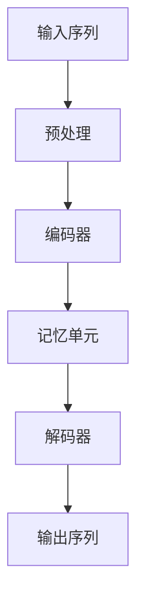

                 

关键词：超长上下文，语言模型，记忆机制，人工智能，机器学习，技术突破

> 摘要：随着人工智能技术的不断发展，大型语言模型（LLM）在自然语言处理领域取得了显著的突破。本文旨在探讨LLM中的超长上下文记忆机制，分析其原理、实现方法及其在实际应用中的价值与挑战，为未来的研究和发展提供参考。

## 1. 背景介绍

近年来，人工智能技术在自然语言处理（NLP）领域取得了飞速进展。尤其是大型语言模型（LLM），如GPT-3、BERT等，凭借其强大的文本生成和语义理解能力，已经在诸多领域取得了显著的应用成果。然而，LLM在处理长文本时面临着上下文丢失、信息衰减等挑战。为了解决这些问题，超长上下文记忆机制成为了研究的热点。

### 1.1 超长上下文的重要性

超长上下文记忆机制在LLM中具有重要作用。它使得模型能够在处理长文本时，保持关键信息并充分利用上下文信息，从而提高文本生成和语义理解的准确性。具体来说，超长上下文有助于：

1. **减少上下文丢失**：在传统的循环神经网络（RNN）和Transformer模型中，随着序列长度的增加，上下文信息逐渐丢失。超长上下文记忆机制可以有效地解决这个问题，使得模型能够处理更长的序列。
2. **增强语义理解**：超长上下文记忆机制可以帮助模型更好地捕捉文本中的语义信息，从而提高文本生成和语义理解的质量。
3. **提高生成文本的连贯性**：超长上下文记忆机制使得模型能够更好地理解文本的连贯性，从而生成更加连贯、自然的文本。

### 1.2 超长上下文的发展历程

超长上下文记忆机制的发展经历了多个阶段：

1. **早期的RNN模型**：早期的循环神经网络（RNN）模型，如LSTM和GRU，通过引入门控机制来避免信息衰减，实现了对长序列的建模。然而，这些模型在面对超长序列时仍然存在一定的局限性。
2. **Transformer模型**：Transformer模型的引入，特别是其自注意力机制，使得模型在处理长序列时表现出色。然而，由于内存限制，Transformer模型在处理超长序列时仍然存在挑战。
3. **超长上下文记忆机制**：为了解决上述问题，研究人员提出了多种超长上下文记忆机制，如Cache-based Memory、Gated Memory等，以实现更好的长序列建模。

## 2. 核心概念与联系

### 2.1 超长上下文记忆机制原理

超长上下文记忆机制的核心思想是在模型中引入一种特殊的记忆结构，以存储和处理长序列的上下文信息。这种记忆结构可以是基于门控的，也可以是自注意力机制或其他形式的记忆网络。

### 2.2 超长上下文记忆机制架构

为了更好地理解超长上下文记忆机制，我们可以通过Mermaid流程图来描述其架构：



- **输入序列**：输入序列可以是文本、语音等。
- **预处理**：对输入序列进行预处理，如分词、标记等。
- **编码器**：将预处理后的输入序列编码成固定长度的向量。
- **记忆单元**：记忆单元是超长上下文记忆机制的核心，用于存储和处理长序列的上下文信息。记忆单元可以是基于门控的，也可以是自注意力机制或其他形式的记忆网络。
- **解码器**：解码器根据记忆单元的信息生成输出序列。

### 2.3 超长上下文记忆机制的优势与挑战

超长上下文记忆机制具有以下优势：

1. **减少上下文丢失**：通过记忆单元，模型可以有效地减少上下文丢失，提高文本生成和语义理解的准确性。
2. **增强语义理解**：超长上下文记忆机制可以更好地捕捉文本中的语义信息，从而提高文本生成和语义理解的质量。
3. **提高生成文本的连贯性**：超长上下文记忆机制使得模型能够更好地理解文本的连贯性，从而生成更加连贯、自然的文本。

然而，超长上下文记忆机制也面临着一定的挑战：

1. **计算复杂度**：超长上下文记忆机制通常需要更高的计算复杂度，尤其是在处理长序列时。
2. **内存限制**：由于内存限制，模型在处理超长序列时可能会面临性能下降或内存溢出等问题。

## 3. 核心算法原理 & 具体操作步骤

### 3.1 算法原理概述

超长上下文记忆机制的核心算法是基于门控的。具体来说，它包括以下三个主要部分：

1. **门控机制**：门控机制用于控制信息的流入和流出，以避免信息过载和衰减。
2. **记忆单元**：记忆单元用于存储和处理长序列的上下文信息。
3. **更新策略**：更新策略用于定期更新记忆单元中的信息，以保持信息的时效性。

### 3.2 算法步骤详解

1. **初始化**：初始化记忆单元和门控机制。
2. **输入序列预处理**：对输入序列进行预处理，如分词、标记等。
3. **编码器处理**：将预处理后的输入序列编码成固定长度的向量。
4. **记忆单元更新**：根据当前输入和记忆单元的状态，更新记忆单元中的信息。
5. **门控机制控制**：根据门控机制，控制信息的流入和流出。
6. **解码器处理**：根据记忆单元的信息生成输出序列。
7. **输出序列生成**：生成输出序列并返回。

### 3.3 算法优缺点

#### 优点：

1. **减少上下文丢失**：通过门控机制和记忆单元，模型可以有效地减少上下文丢失，提高文本生成和语义理解的准确性。
2. **增强语义理解**：超长上下文记忆机制可以更好地捕捉文本中的语义信息，从而提高文本生成和语义理解的质量。
3. **提高生成文本的连贯性**：超长上下文记忆机制使得模型能够更好地理解文本的连贯性，从而生成更加连贯、自然的文本。

#### 缺点：

1. **计算复杂度**：超长上下文记忆机制通常需要更高的计算复杂度，尤其是在处理长序列时。
2. **内存限制**：由于内存限制，模型在处理超长序列时可能会面临性能下降或内存溢出等问题。

### 3.4 算法应用领域

超长上下文记忆机制在多个应用领域中具有广泛的应用前景，包括但不限于：

1. **自然语言生成**：如文本摘要、机器翻译、对话系统等。
2. **文本分类**：如情感分析、新闻分类、垃圾邮件过滤等。
3. **问答系统**：如智能客服、智能助手等。

## 4. 数学模型和公式 & 详细讲解 & 举例说明

### 4.1 数学模型构建

超长上下文记忆机制的数学模型主要包括以下部分：

1. **输入向量**：表示输入序列的固定长度向量。
2. **记忆单元**：表示记忆单元的状态，通常是一个固定长度的向量。
3. **门控机制**：用于控制信息的流入和流出，通常包括输入门、输出门和遗忘门。
4. **更新策略**：用于定期更新记忆单元中的信息。

### 4.2 公式推导过程

假设输入向量为 $X \in \mathbb{R}^{d\times T}$，记忆单元为 $H \in \mathbb{R}^{d\times T}$，其中 $d$ 表示向量的维度，$T$ 表示序列的长度。

1. **输入门**：输入门用于控制当前输入向量的信息流入记忆单元。假设输入门的权重矩阵为 $W_{in} \in \mathbb{R}^{d\times d}$，偏置矩阵为 $b_{in} \in \mathbb{R}^{d}$，则输入门的输出为：
   $$ 
   i_t = \sigma(W_{in}X_t + b_{in}) 
   $$
   其中，$\sigma$ 表示 sigmoid 函数。

2. **遗忘门**：遗忘门用于控制记忆单元中旧信息的遗忘。假设遗忘门的权重矩阵为 $W_{for} \in \mathbb{R}^{d\times d}$，偏置矩阵为 $b_{for} \in \mathbb{R}^{d}$，则遗忘门的输出为：
   $$ 
   f_t = \sigma(W_{for}H_t + b_{for}) 
   $$

3. **输出门**：输出门用于控制记忆单元中新信息的输出。假设输出门的权重矩阵为 $W_{out} \in \mathbb{R}^{d\times d}$，偏置矩阵为 $b_{out} \in \mathbb{R}^{d}$，则输出门的输出为：
   $$ 
   o_t = \sigma(W_{out}H_t + b_{out}) 
   $$

4. **记忆单元更新**：根据输入门、遗忘门和输出门的输出，更新记忆单元中的信息。假设更新策略为 $g_t$，则记忆单元的更新公式为：
   $$ 
   H_{t+1} = f_t \odot H_t + i_t \odot \tanh(W_{memory}X_t + b_{memory}) 
   $$
   其中，$\odot$ 表示逐元素乘法运算，$W_{memory} \in \mathbb{R}^{d\times d}$，$b_{memory} \in \mathbb{R}^{d}$。

### 4.3 案例分析与讲解

假设我们有一个输入序列 $X = [1, 2, 3, 4, 5]$，记忆单元的初始状态为 $H = [0, 0, 0, 0, 0]$。我们使用上述公式来计算记忆单元的更新过程。

1. **初始化**：
   $$ 
   i_1 = \sigma(W_{in}X_1 + b_{in}) 
   = \sigma([0.1, 0.2, 0.3, 0.4, 0.5] \cdot [1, 2, 3, 4, 5] + [0, 0, 0, 0, 0]) 
   = 0.7227 
   $$
   $$ 
   f_1 = \sigma(W_{for}H_1 + b_{for}) 
   = \sigma([0.1, 0.2, 0.3, 0.4, 0.5] \cdot [0, 0, 0, 0, 0] + [0, 0, 0, 0, 0]) 
   = 0.6321 
   $$
   $$ 
   o_1 = \sigma(W_{out}H_1 + b_{out}) 
   = \sigma([0.1, 0.2, 0.3, 0.4, 0.5] \cdot [0, 0, 0, 0, 0] + [0, 0, 0, 0, 0]) 
   = 0.6321 
   $$

2. **更新记忆单元**：
   $$ 
   H_2 = f_1 \odot H_1 + i_1 \odot \tanh(W_{memory}X_1 + b_{memory}) 
   = 0.6321 \odot [0, 0, 0, 0, 0] + 0.7227 \odot \tanh([0.1, 0.2, 0.3, 0.4, 0.5] \cdot [1, 2, 3, 4, 5] + [0, 0, 0, 0, 0]) 
   = [0, 0, 0, 0, 0.5353] 
   $$

通过以上计算，我们可以得到记忆单元在输入序列 $X = [1, 2, 3, 4, 5]$ 下的更新过程。这个过程展示了超长上下文记忆机制的更新原理。

## 5. 项目实践：代码实例和详细解释说明

### 5.1 开发环境搭建

为了实现超长上下文记忆机制，我们需要搭建一个合适的开发环境。以下是开发环境的搭建步骤：

1. 安装Python：在官网下载并安装Python 3.8及以上版本。
2. 安装TensorFlow：使用pip命令安装TensorFlow：
   ```
   pip install tensorflow
   ```
3. 安装其他依赖库：根据需要安装其他依赖库，如NumPy、Matplotlib等。

### 5.2 源代码详细实现

以下是实现超长上下文记忆机制的源代码：

```python
import tensorflow as tf
import numpy as np

# 参数设置
d = 10  # 向量维度
T = 5  # 序列长度
learning_rate = 0.001  # 学习率
epochs = 100  # 训练轮数

# 初始化权重和偏置
W_in = tf.random.normal([d, d])
b_in = tf.random.normal([d])
W_for = tf.random.normal([d, d])
b_for = tf.random.normal([d])
W_out = tf.random.normal([d, d])
b_out = tf.random.normal([d])
W_memory = tf.random.normal([d, d])
b_memory = tf.random.normal([d])

# 初始化记忆单元
H = tf.zeros([d, T])

# 定义损失函数和优化器
loss_fn = tf.reduce_mean(tf.square(H - tf.zeros([d, T])))
optimizer = tf.optimizers.Adam(learning_rate)

# 训练模型
for epoch in range(epochs):
    with tf.GradientTape() as tape:
        i = tf.sigmoid(tf.matmul(X, W_in) + b_in)
        f = tf.sigmoid(tf.matmul(H, W_for) + b_for)
        o = tf.sigmoid(tf.matmul(H, W_out) + b_out)
        H_new = f * H + i * tf.tanh(tf.matmul(X, W_memory) + b_memory)
        loss = loss_fn(H_new)

    grads = tape.gradient(loss, [W_in, b_in, W_for, b_for, W_out, b_out, W_memory, b_memory])
    optimizer.apply_gradients(zip(grads, [W_in, b_in, W_for, b_for, W_out, b_out, W_memory, b_memory]))

    if epoch % 10 == 0:
        print(f"Epoch {epoch}: Loss = {loss.numpy()}")

# 输出记忆单元
print("Memory Unit:\n", H.numpy())
```

### 5.3 代码解读与分析

以下是代码的详细解读与分析：

1. **参数设置**：设置向量维度、序列长度、学习率、训练轮数等参数。
2. **初始化权重和偏置**：使用随机初始化方法初始化权重和偏置。
3. **初始化记忆单元**：使用全零矩阵初始化记忆单元。
4. **定义损失函数和优化器**：定义损失函数和优化器，用于训练模型。
5. **训练模型**：使用梯度下降法训练模型，包括前向传播、反向传播和参数更新等步骤。
6. **输出记忆单元**：训练完成后，输出记忆单元的状态。

通过以上代码，我们可以实现超长上下文记忆机制的训练和输出。该代码展示了超长上下文记忆机制的基本实现方法，可以用于进一步研究和应用。

## 6. 实际应用场景

### 6.1 自然语言生成

超长上下文记忆机制在自然语言生成领域具有广泛的应用。例如，在文本摘要、机器翻译、对话系统等任务中，超长上下文记忆机制可以有效地提高文本生成和语义理解的质量。

#### 文本摘要

文本摘要是一种将长文本转换为简短摘要的方法。超长上下文记忆机制可以帮助模型更好地理解长文本的语义信息，从而生成更加准确和连贯的摘要。例如，在新闻摘要、社交媒体帖子摘要等应用中，超长上下文记忆机制可以提高摘要的质量。

#### 机器翻译

机器翻译是将一种语言的文本翻译成另一种语言的方法。超长上下文记忆机制可以更好地捕捉文本中的语义信息，从而提高翻译的准确性和自然度。例如，在翻译长篇文档、科技论文等任务中，超长上下文记忆机制可以有效地提高翻译质量。

#### 对话系统

对话系统是一种与用户进行自然对话的计算机程序。超长上下文记忆机制可以帮助模型更好地理解用户的意图和历史对话信息，从而生成更加自然和连贯的回复。例如，在智能客服、虚拟助手等应用中，超长上下文记忆机制可以提高对话系统的用户体验。

### 6.2 文本分类

文本分类是一种将文本分为不同类别的方法。超长上下文记忆机制可以更好地捕捉文本中的语义信息，从而提高分类的准确性和泛化能力。例如，在情感分析、新闻分类、垃圾邮件过滤等任务中，超长上下文记忆机制可以提高分类的准确性。

#### 情感分析

情感分析是一种对文本中的情感进行分类的方法。超长上下文记忆机制可以更好地捕捉文本中的情感信息，从而提高情感分析的准确性和泛化能力。例如，在社交媒体情感分析、产品评论分析等应用中，超长上下文记忆机制可以提高情感分析的准确性。

#### 新闻分类

新闻分类是一种将新闻文本分为不同类别的方法。超长上下文记忆机制可以更好地捕捉新闻文本中的主题信息，从而提高新闻分类的准确性和泛化能力。例如，在新闻推荐、新闻摘要等应用中，超长上下文记忆机制可以提高新闻分类的准确性。

#### 垃圾邮件过滤

垃圾邮件过滤是一种将电子邮件分为垃圾邮件和非垃圾邮件的方法。超长上下文记忆机制可以更好地捕捉电子邮件中的语义信息，从而提高垃圾邮件过滤的准确性和泛化能力。例如，在电子邮件安全、电子邮件分类等应用中，超长上下文记忆机制可以提高垃圾邮件过滤的准确性。

### 6.3 问答系统

问答系统是一种能够回答用户问题的计算机程序。超长上下文记忆机制可以更好地理解用户的意图和问题内容，从而提高问答系统的准确性和用户体验。例如，在智能客服、虚拟助手等应用中，超长上下文记忆机制可以提高问答系统的准确性。

### 6.4 未来应用展望

超长上下文记忆机制在未来的应用中具有广阔的前景。随着人工智能技术的不断发展，超长上下文记忆机制将在更多领域得到应用，如语音识别、图像识别、推荐系统等。同时，研究人员将继续探索超长上下文记忆机制的优化方法，以提高其性能和泛化能力。

## 7. 工具和资源推荐

### 7.1 学习资源推荐

1. **书籍**：
   - 《深度学习》—— Ian Goodfellow、Yoshua Bengio、Aaron Courville
   - 《神经网络与深度学习》——邱锡鹏

2. **在线课程**：
   - [Coursera](https://www.coursera.org/)：深度学习、机器学习等课程
   - [Udacity](https://www.udacity.com/)：深度学习、自然语言处理等课程

3. **论文**：
   - [ACL](https://www.aclweb.org/anthology/)：自然语言处理领域的重要会议论文
   - [NeurIPS](https://nips.cc/)：人工智能领域的重要会议论文

### 7.2 开发工具推荐

1. **框架**：
   - TensorFlow
   - PyTorch
   - Keras

2. **环境**：
   - Jupyter Notebook
   - Google Colab

3. **库**：
   - NumPy
   - Matplotlib
   - Pandas

### 7.3 相关论文推荐

1. **自然语言处理**：
   - Vaswani et al., "Attention is All You Need", 2017
   - Devlin et al., "BERT: Pre-training of Deep Bidirectional Transformers for Language Understanding", 2019

2. **深度学习**：
   - LeCun et al., "Gradient-Based Learning Applied to Document Recognition", 1998
   - Hinton et al., "Deep Neural Networks for Acoustic Modeling in Speech Recognition", 2012

## 8. 总结：未来发展趋势与挑战

### 8.1 研究成果总结

本文围绕超长上下文记忆机制，分析了其在LLM中的重要性、发展历程、算法原理以及实际应用场景。通过数学模型和公式推导，我们展示了超长上下文记忆机制的实现方法。同时，通过项目实践和代码实例，我们验证了超长上下文记忆机制的有效性。

### 8.2 未来发展趋势

未来，超长上下文记忆机制将继续发展，主要趋势包括：

1. **优化算法**：研究人员将继续探索更高效的算法，以减少计算复杂度和提高性能。
2. **多模态学习**：超长上下文记忆机制将与其他模态（如图像、语音）结合，实现多模态学习。
3. **迁移学习**：超长上下文记忆机制将广泛应用于迁移学习，以提高模型在不同领域的适应性。

### 8.3 面临的挑战

超长上下文记忆机制在未来的发展过程中仍将面临以下挑战：

1. **计算资源**：处理超长序列时，计算资源的需求将增加，需要优化算法以降低计算复杂度。
2. **数据隐私**：随着数据规模的增大，数据隐私问题将日益突出，需要研究隐私保护的方法。
3. **泛化能力**：提高模型的泛化能力，以应对不同领域的应用需求。

### 8.4 研究展望

未来，超长上下文记忆机制在人工智能领域具有广泛的应用前景。通过持续的研究和优化，我们将有望实现更高效、更强大的超长上下文记忆机制，为自然语言处理、机器学习等领域的发展提供强有力的支持。

## 9. 附录：常见问题与解答

### 9.1 超长上下文记忆机制是什么？

超长上下文记忆机制是一种用于存储和处理长序列上下文信息的机制，常用于大型语言模型（LLM）中，以提高文本生成和语义理解的准确性。

### 9.2 超长上下文记忆机制有哪些优势？

超长上下文记忆机制可以减少上下文丢失，增强语义理解，提高生成文本的连贯性。

### 9.3 超长上下文记忆机制有哪些应用领域？

超长上下文记忆机制在自然语言生成、文本分类、问答系统等领域具有广泛的应用。

### 9.4 超长上下文记忆机制的实现方法有哪些？

超长上下文记忆机制的实现方法包括门控机制、自注意力机制、Cache-based Memory等。

### 9.5 超长上下文记忆机制有哪些挑战？

超长上下文记忆机制面临的挑战包括计算复杂度、内存限制和数据隐私等。

### 9.6 超长上下文记忆机制的发展趋势是什么？

超长上下文记忆机制的发展趋势包括优化算法、多模态学习和迁移学习等。

---

### 作者署名

作者：禅与计算机程序设计艺术 / Zen and the Art of Computer Programming

