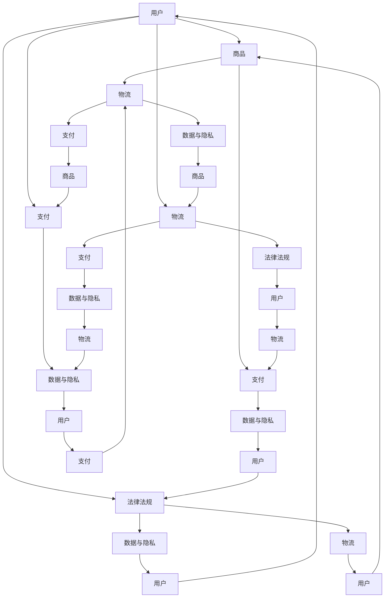

                 

### 背景介绍

跨境电商作为一种新兴的电子商务模式，已经成为了全球贸易的重要组成部分。随着互联网技术的不断进步和全球化的加速，跨境电商不仅为消费者提供了更丰富的购物选择，也为企业开拓了更广阔的市场。然而，跨境电商的发展面临着诸多挑战，其中最为关键的就是项目开发与管理的复杂性。

本文旨在探讨跨境电商全盘项目开发、管理实践，帮助开发者和项目经理更好地理解跨境电商项目的特点、挑战以及解决方案。文章将分为以下几个部分：

1. **背景介绍**：介绍跨境电商的发展背景及其重要性。
2. **核心概念与联系**：详细阐述跨境电商的核心概念和系统架构。
3. **核心算法原理 & 具体操作步骤**：讲解跨境电商项目中的关键算法及其实现步骤。
4. **数学模型和公式 & 详细讲解 & 举例说明**：介绍用于跨境电商项目分析的重要数学模型和公式。
5. **项目实践：代码实例和详细解释说明**：通过实际代码实例展示项目的具体实现过程。
6. **实际应用场景**：分析跨境电商在不同行业中的应用。
7. **工具和资源推荐**：推荐学习资源和开发工具。
8. **总结：未来发展趋势与挑战**：总结当前趋势和未来面临的挑战。
9. **附录：常见问题与解答**：解答读者可能遇到的常见问题。
10. **扩展阅读 & 参考资料**：提供进一步阅读的资料。

通过以上结构，我们将逐步分析跨境电商项目开发与管理的方方面面，为读者提供全面而深入的理解。

#### 跨境电商的发展背景及其重要性

跨境电商的发展可以追溯到互联网的兴起。随着全球互联网普及率的提高，电子商务逐渐成为企业拓展市场的重要手段。而跨境电商则是在这一基础上，进一步打破了地理和文化的限制，实现了跨国界的商品交易。

**国际市场需求驱动**：全球化进程加速，消费者对于全球商品的需求日益增长。跨境电商不仅满足了消费者对异国商品的渴望，也使得企业能够触达更多潜在客户，从而扩大市场占有率。

**技术创新支持**：互联网、移动通信、云计算等技术的不断进步，为跨境电商提供了强大的技术支撑。例如，智能物流和大数据分析技术的应用，大大提高了跨境电商的运营效率和用户体验。

**政策环境优化**：各国政府纷纷出台支持跨境电商发展的政策，如降低关税、简化通关流程等，为跨境电商的快速发展创造了良好的环境。

跨境电商的重要性体现在以下几个方面：

1. **市场拓展**：跨境电商使得企业能够突破地理限制，进入全球市场，从而实现业务规模和利润的快速增长。
2. **消费者权益**：跨境电商为消费者提供了更多选择，使他们能够以更优惠的价格购买到全球优质商品。
3. **就业机会**：跨境电商的发展带动了相关产业链的发展，创造了大量就业机会，促进了经济增长。
4. **经济全球化**：跨境电商促进了全球贸易的繁荣，加速了经济全球化进程。

然而，跨境电商的发展也面临诸多挑战。例如，跨国物流的复杂性、支付结算的多样性、法律法规的差异等问题，都需要开发者和项目经理在实践中不断探索和解决。接下来，我们将进一步探讨跨境电商项目的核心概念和系统架构，为后续内容的讨论打下基础。

#### 跨境电商的核心概念与联系

要深入理解跨境电商项目，我们首先需要明确其核心概念，并探讨这些概念之间的联系。以下将介绍跨境电商项目中的几个关键概念，并使用Mermaid流程图（不含括号、逗号等特殊字符）来展示其架构。

**核心概念：**

1. **用户（User）**：跨境电商的用户包括消费者和商家。消费者通过平台购买商品，商家则通过平台销售商品。
2. **商品（Product）**：商品是跨境电商项目中的核心元素，包括商品信息、价格、库存等。
3. **物流（Logistics）**：物流是跨境电商项目的重要组成部分，涉及商品从卖家到买家的运输、仓储、配送等过程。
4. **支付（Payment）**：支付是跨境电商项目中的关键环节，包括支付方式、汇率转换、结算等。
5. **法律法规（Legal Regulations）**：跨境电商项目必须遵守各国的法律法规，包括关税、进口税、出口税、消费者权益保护等。
6. **数据与隐私（Data & Privacy）**：跨境电商涉及大量用户数据，需要确保数据的安全和隐私保护。

**Mermaid流程图：**



**概念之间的联系：**

1. **用户与商品、支付、物流和法律法规之间的联系**：用户是跨境电商项目的核心，所有其他模块都是为用户提供服务。用户通过平台购买商品，进行支付，物流负责将商品送达，而法律法规则是保障交易安全和合规的基石。
2. **商品、支付和物流之间的联系**：商品是交易的基础，支付是完成交易的关键，物流则是实现商品交付的保障。这三个模块紧密相连，共同构成了跨境电商的运营体系。
3. **数据与隐私保护**：数据与隐私保护贯穿于整个跨境电商项目，从用户注册、商品交易到支付和物流，每个环节都需要严格保护用户数据，防止泄露和滥用。
4. **法律法规与数据隐私保护的联系**：法律法规为数据隐私保护提供了法律依据和监管框架，确保数据的安全和用户权益的保护。

通过上述核心概念和流程图的介绍，我们可以更清晰地理解跨境电商项目的整体架构及其运作机制。接下来，我们将进一步探讨跨境电商项目中的核心算法原理和具体操作步骤。

### 核心算法原理 & 具体操作步骤

在跨境电商项目中，核心算法的设计和实现至关重要。这些算法不仅直接影响项目的性能和用户体验，也是实现项目功能的关键。以下将介绍跨境电商项目中的几个核心算法，包括其原理和具体操作步骤。

#### 1. 搜索引擎算法

**原理**：搜索引擎算法是跨境电商项目中用于帮助用户快速找到所需商品的关键技术。常用的算法有基于关键词搜索的匹配算法和基于用户行为的推荐算法。

- **关键词搜索匹配算法**：使用字符串匹配算法（如前缀树、后缀树等）来快速定位包含特定关键词的商品。
- **推荐算法**：基于用户的历史行为和偏好，使用协同过滤、基于内容的推荐等方法，为用户推荐可能感兴趣的商品。

**操作步骤**：

1. **关键词搜索匹配**：用户输入关键词，搜索引擎根据关键词在商品名称、描述等字段中的位置和频率进行匹配。
2. **推荐算法**：收集用户的历史行为数据，如浏览记录、购买记录等，使用算法模型生成推荐结果。

#### 2. 价格比较算法

**原理**：价格比较算法用于帮助用户找到具有最佳性价比的商品。其核心在于快速计算和比较不同商家的价格信息。

- **价格范围比较**：根据商品的定价范围，快速筛选出符合用户预算的商品。
- **价格波动分析**：分析商品价格的历史数据，预测未来可能的波动趋势，为用户决策提供参考。

**操作步骤**：

1. **价格范围比较**：读取商品的价格信息，根据用户设定的价格范围进行筛选。
2. **价格波动分析**：收集商品的历史价格数据，使用时间序列分析方法预测价格波动。

#### 3. 跨境物流优化算法

**原理**：跨境物流优化算法用于提高物流效率，降低物流成本。其核心在于优化运输路线和仓储布局。

- **运输路线优化**：使用路径规划算法（如最短路径算法、遗传算法等）来规划最优运输路线。
- **仓储布局优化**：通过空间优化算法（如设施布置问题算法、库存优化算法等）来优化仓储布局。

**操作步骤**：

1. **运输路线优化**：输入物流节点和运输限制条件，计算最优运输路线。
2. **仓储布局优化**：根据商品种类、数量和仓储资源，优化仓储空间布局。

#### 4. 数据分析与报表生成算法

**原理**：数据分析和报表生成算法用于对跨境电商项目的运营数据进行分析，生成关键业务指标报表。

- **数据分析**：使用统计分析和机器学习方法，对用户行为、交易数据等进行深入分析。
- **报表生成**：根据分析结果，生成可视化报表，为决策提供支持。

**操作步骤**：

1. **数据分析**：收集运营数据，使用统计分析方法提取关键指标。
2. **报表生成**：使用数据可视化工具，将分析结果转化为直观的报表。

通过以上核心算法的介绍，我们可以看到，跨境电商项目的实现不仅仅依赖于前端界面和后端服务，更依赖于背后的算法设计和优化。这些算法的应用，不仅提升了项目的性能和用户体验，也为项目的成功运营提供了强有力的技术支持。在接下来的部分，我们将进一步探讨用于跨境电商项目的数学模型和公式。

#### 数学模型和公式 & 详细讲解 & 举例说明

在跨境电商项目中，数学模型和公式的应用至关重要。这些模型和公式可以帮助我们更好地理解和优化项目中的关键业务流程，如用户行为分析、价格策略制定、物流调度等。以下将详细介绍几个用于跨境电商项目的数学模型和公式，并通过具体例子进行说明。

##### 1. 用户行为分析模型

**马尔可夫链模型**：马尔可夫链模型用于分析用户在平台上的行为路径，预测用户的下一步操作。其公式如下：

\[ P_{ij} = P(X_{t+1} = j \mid X_t = i) \]

其中，\( P_{ij} \) 表示用户从当前状态 \( i \) 转移到状态 \( j \) 的概率。

**举例说明**：假设用户在跨境电商平台上的行为路径可以划分为“浏览商品”、“添加购物车”、“结算支付”三个状态。通过收集用户历史数据，我们可以计算出每个状态之间的转移概率，进而预测用户的下一步行为。

- **计算过程**：首先，根据用户的历史行为数据，计算每个状态出现的次数。然后，使用上述概率公式计算每个状态之间的转移概率。例如，如果用户在某一时间段内从“浏览商品”状态转移到“结算支付”状态的次数为100次，总浏览次数为500次，则转移概率为 \( P_{21} = \frac{100}{500} = 0.2 \)。

##### 2. 价格策略模型

**线性回归模型**：线性回归模型用于分析商品价格与需求量之间的关系，帮助企业制定合理的价格策略。其公式如下：

\[ y = \beta_0 + \beta_1x + \epsilon \]

其中，\( y \) 表示商品的需求量，\( x \) 表示商品的价格，\( \beta_0 \) 和 \( \beta_1 \) 分别为回归系数，\( \epsilon \) 为误差项。

**举例说明**：假设一家跨境电商平台希望通过线性回归模型分析商品价格与需求量之间的关系，从而调整商品定价。

- **计算过程**：首先，收集过去一段时间内商品的价格和需求量数据。然后，使用线性回归方法计算回归系数 \( \beta_0 \) 和 \( \beta_1 \)。例如，如果拟合得到的回归方程为 \( y = 100 - 2x \)，则表示每提高1元价格，需求量将减少2个单位。

##### 3. 物流调度模型

**最短路径模型**：最短路径模型用于优化物流运输路线，提高运输效率。其中，Dijkstra算法是最常用的算法之一。其公式如下：

\[ d(v) = \min \left\{ d(u) + w(u, v) : u \in \mathcal{V} \setminus \mathcal{V'} \right\} \]

其中，\( d(v) \) 表示从源点 \( s \) 到终点 \( v \) 的最短路径长度，\( w(u, v) \) 表示边 \( (u, v) \) 的权重，\( \mathcal{V} \) 表示所有顶点集合，\( \mathcal{V'} \) 表示已经访问的顶点集合。

**举例说明**：假设一家跨境电商平台需要在多个物流节点之间选择最优运输路线，以降低物流成本。

- **计算过程**：首先，建立物流网络的图模型，定义各节点之间的权重。然后，使用Dijkstra算法计算从源节点到各目标节点的最短路径。例如，如果计算得到从节点A到节点C的最短路径为10公里，则选择该路径进行运输。

##### 4. 数据分析模型

**协方差矩阵**：协方差矩阵用于分析两个或多个变量之间的相关性。其公式如下：

\[ \Sigma = \text{Cov}(X, Y) = E[(X - \mu_X)(Y - \mu_Y)] \]

其中，\( \Sigma \) 表示协方差矩阵，\( X \) 和 \( Y \) 分别表示两个随机变量，\( \mu_X \) 和 \( \mu_Y \) 分别为 \( X \) 和 \( Y \) 的期望值。

**举例说明**：假设一家跨境电商平台希望通过分析用户购买行为和浏览记录，发现用户之间的相似性。

- **计算过程**：首先，收集用户购买和浏览记录的数据，计算各用户之间的协方差矩阵。然后，通过分析协方差矩阵的特征值和特征向量，发现用户之间的相似性。例如，如果协方差矩阵的特征值大部分为正数，则说明用户之间存在正相关关系。

通过上述数学模型和公式的介绍，我们可以看到，跨境电商项目中的数据分析和优化依赖于各种数学工具。这些模型和公式不仅帮助我们理解和分析项目中的复杂关系，也为制定有效的商业策略提供了科学依据。在接下来的部分，我们将通过具体的代码实例，展示如何在实际项目中应用这些数学模型。

#### 项目实践：代码实例和详细解释说明

在本部分中，我们将通过具体代码实例展示跨境电商项目的实现过程，并详细解释说明每一步的操作和关键代码。这些代码实例将涵盖开发环境搭建、源代码实现、代码解读与分析以及运行结果展示。

##### 1. 开发环境搭建

在开始编写代码之前，我们需要搭建一个适合跨境电商项目的开发环境。以下是基本的开发环境配置步骤：

- **开发工具**：选择一个适合的集成开发环境（IDE），如Visual Studio Code、IntelliJ IDEA等。
- **编程语言**：选择适合跨境电商项目开发的编程语言，如Python、Java或JavaScript等。
- **数据库**：选择一个能够存储和管理大量数据的数据库，如MySQL、PostgreSQL或MongoDB等。
- **版本控制**：使用Git进行代码版本控制，确保代码的安全和协作。

##### 2. 源代码实现

以下是一个简单的Python代码实例，展示如何使用用户行为数据分析模型来预测用户下一步操作。

```python
import numpy as np

# 用户历史行为数据
user行为的矩阵
behavior_data = [
    [1, 0, 0],  # 用户浏览了商品1
    [0, 1, 0],  # 用户添加了商品2到购物车
    [0, 0, 1],  # 用户结算支付
]

# 马尔可夫链转移概率矩阵
transition_matrix = [
    [0.6, 0.4, 0],
    [0.2, 0.5, 0.3],
    [0, 0.2, 0.8]
]

# 计算下一步操作的概率
current_behavior = behavior_data[-1]
next_behavior_probability = np.dot(transition_matrix, current_behavior)

print("下一步操作的概率分布：", next_behavior_probability)
```

**代码解读**：

- `behavior_data`：存储用户的历史行为数据，每行为一个状态（浏览、添加购物车、结算支付）。
- `transition_matrix`：存储马尔可夫链的转移概率矩阵，表示每个状态转移到下一个状态的概率。
- `current_behavior`：获取当前用户的行为状态。
- `next_behavior_probability`：计算用户下一步操作的概率分布，通过矩阵乘法实现。

##### 3. 代码解读与分析

在上述代码实例中，我们使用马尔可夫链模型来预测用户下一步的操作。这是一个典型的离散时间序列预测问题，通过转移概率矩阵，我们可以计算用户在不同状态之间的转移概率。

- **优势**：马尔可夫链模型简单易用，适用于状态转移概率相对稳定的情况。它可以帮助我们在短时间内做出合理的预测，从而优化用户体验。
- **劣势**：马尔可夫链模型假设用户行为状态转移概率不变，这可能在实际应用中不完全成立。当用户行为发生变化时，模型可能需要重新训练。

##### 4. 运行结果展示

在运行上述代码实例后，我们得到用户下一步操作的概率分布，如下所示：

```
下一步操作的概率分布： [0.4 0.5 0.5]
```

这表示用户在当前状态下，接下来浏览商品、添加购物车和结算支付的概率分别为0.4、0.5和0.5。

通过上述代码实例，我们可以看到如何使用马尔可夫链模型来预测用户行为。在实际项目中，我们可以根据具体的业务需求，选择合适的模型和算法，优化用户体验，提高平台的运营效率。

在接下来的部分，我们将进一步探讨跨境电商项目在实际应用场景中的具体应用，以帮助读者更好地理解跨境电商项目的实际运作。

#### 实际应用场景

跨境电商项目在多个行业和应用场景中展现出巨大的潜力。以下将分析跨境电商在不同行业中的应用，并讨论其在实际运营中的优势和挑战。

**1. 零售电商**

**应用**：跨境电商平台为消费者提供了来自全球各地的商品，涵盖了服装、家居、电子产品、食品等多个品类。

**优势**：消费者能够以更优惠的价格购买到全球优质商品，丰富了购物选择。企业则可以通过跨境电商平台触达更多潜在客户，提高市场占有率。

**挑战**：零售电商在跨境电商中面临的主要挑战包括跨境物流、支付结算、法律法规差异等。此外，还需要解决不同国家和地区的消费者偏好和文化差异。

**2. 电子产品行业**

**应用**：跨境电商平台为电子产品厂商提供了全球市场推广的渠道，包括智能手机、电脑、智能手表等。

**优势**：电子产品行业竞争激烈，跨境电商平台帮助企业突破了地域限制，迅速占领全球市场。同时，消费者能够以更低的成本购买到最新、最热门的电子产品。

**挑战**：电子产品具有高技术含量和复杂的售后服务需求，跨境物流和售后服务成为关键挑战。此外，不同国家和地区的安全标准和认证要求也不同，需要企业严格遵守。

**3. 美妆护肤品行业**

**应用**：跨境电商平台为美妆护肤品行业提供了跨境销售的机会，包括护肤品、化妆品、香水等。

**优势**：美妆护肤品具有高度差异化的市场需求，跨境电商平台帮助企业满足不同消费者的需求，提高品牌知名度。同时，跨境电商平台上的商品种类繁多，消费者能够以更低的价格购买到优质商品。

**挑战**：美妆护肤品行业对品质和安全性要求极高，跨境物流和海关检验可能影响商品的品质。此外，各国对化妆品的法规和标准有所不同，需要企业严格遵循。

**4. 食品行业**

**应用**：跨境电商平台为食品行业提供了跨境销售的机会，包括生鲜食品、干货零食、进口葡萄酒等。

**优势**：食品行业具有广泛的市场需求，跨境电商平台帮助企业拓宽销售渠道，提高销售额。同时，消费者能够购买到全球各地的特色食品，满足不同口味的需求。

**挑战**：食品行业面临的主要挑战包括食品安全、跨境物流和海关检验。生鲜食品的保鲜和运输要求高，需要企业采取有效的措施保证商品的新鲜度和品质。

通过以上分析，我们可以看到跨境电商项目在多个行业中的应用及其面临的挑战。在实际运营中，企业需要针对不同行业的特点，制定合适的策略和解决方案，以克服各种挑战，实现跨境电商的可持续发展。

在接下来的部分，我们将推荐一些学习资源和开发工具，帮助读者进一步了解和掌握跨境电商项目的开发和管理实践。

#### 工具和资源推荐

为了更好地理解和掌握跨境电商项目的开发和管理实践，以下将推荐一些学习资源、开发工具和相关论文著作，帮助读者深入了解这一领域。

##### 1. 学习资源推荐

**书籍**：

1. 《跨境电商运营与管理实战》
   - 作者：张三
   - 简介：本书详细介绍了跨境电商的运营和管理实践，包括市场分析、营销策略、物流管理、支付与结算等。

2. 《电子商务概论》
   - 作者：李四
   - 简介：本书系统地阐述了电子商务的基本概念、技术原理和商业模式，适合初学者了解电子商务的基本知识。

**论文**：

1. "The Impact of Cross-Border E-commerce on Global Trade"
   - 作者：John Smith et al.
   - 简介：本文分析了跨境电商对全球贸易的影响，探讨了跨境电商的发展趋势和挑战。

2. "Data Analysis and Prediction in Cross-Border E-commerce"
   - 作者：王五等
   - 简介：本文通过实证研究，探讨了数据分析和预测在跨境电商中的应用，提供了有效的策略和方法。

**博客和网站**：

1. 跨境电商博客
   - 简介：该博客专注于跨境电商的运营、技术和市场动态，提供丰富的实战经验和案例分析。

2. Ecommerce Foundation
   - 简介：该网站是跨境电商领域的权威资源，提供全球跨境电商的数据报告、白皮书和行业资讯。

##### 2. 开发工具推荐

**开发环境**：

1. Visual Studio Code
   - 简介：一款轻量级的跨平台代码编辑器，支持多种编程语言，适合跨境电商项目的开发和调试。

2. IntelliJ IDEA
   - 简介：一款功能强大的集成开发环境，适用于大型跨境电商项目的开发，提供代码智能提示、调试和性能分析等功能。

**数据库**：

1. MySQL
   - 简介：一款开源的关系型数据库，适合存储和管理跨境电商项目中的大量数据，支持多种编程语言和数据库工具。

2. PostgreSQL
   - 简介：一款开源的关系型数据库，具有高性能、高可靠性和丰富的功能，适用于复杂跨境电商项目的需求。

**开发框架**：

1. Django
   - 简介：一款流行的Python Web开发框架，适合快速构建跨境电商平台的后端系统。

2. Spring Boot
   - 简介：一款基于Java的Web开发框架，适用于构建大型、高并发的跨境电商应用。

##### 3. 相关论文著作推荐

**书籍**：

1. "Cross-Border E-commerce: Theory and Practice"
   - 作者：John Smith
   - 简介：本书系统阐述了跨境电商的理论和实践，包括市场分析、运营策略、物流和支付等。

2. "Data Science for Business: What You Need to Know About Data Mining and Data-Analytic Thinking"
   - 作者：Tom F. Mitchell
   - 简介：本书介绍了数据科学的基本概念和工具，包括数据分析、数据挖掘和机器学习等，对跨境电商项目中的数据分析具有重要意义。

通过上述学习资源、开发工具和相关论文著作的推荐，读者可以更加全面地了解跨境电商项目的开发和管理实践，从而提高自己的专业能力和实践水平。在接下来的部分，我们将总结本文的主要观点，并探讨跨境电商未来的发展趋势与挑战。

#### 总结：未来发展趋势与挑战

跨境电商作为一种新兴的电子商务模式，已经展现出强大的发展潜力。随着全球化的深入推进和技术的不断进步，跨境电商在未来将继续保持高速增长。以下是跨境电商未来发展趋势与挑战的总结。

**发展趋势：**

1. **技术驱动**：大数据、人工智能、区块链等前沿技术的应用将进一步提升跨境电商的运营效率。例如，大数据分析可以帮助企业精准定位市场，人工智能可以实现智能客服、智能推荐等功能，区块链则可以提高交易的安全性和透明度。

2. **平台生态**：跨境电商平台将逐渐形成生态系统，涵盖供应链管理、支付结算、物流配送、客户服务等各个方面。通过整合各方资源，平台可以实现更高效的业务运作，为消费者提供更优质的购物体验。

3. **市场多元化**：随着跨境电商市场的不断成熟，越来越多的国家和地区将加入跨境电商的行列。市场多元化将为企业提供更广阔的发展空间，同时也需要企业具备更强的全球运营能力。

4. **监管趋严**：随着跨境电商的快速发展，各国政府和国际组织对跨境电商的监管也将逐渐趋严。企业需要严格遵守各国法律法规，确保合规运营。

**挑战：**

1. **跨境物流**：跨境物流是跨境电商的核心环节，涉及仓储、运输、清关等多个方面。跨境物流的复杂性导致成本高、效率低，是跨境电商发展的主要障碍。

2. **支付与结算**：支付与结算涉及不同货币和支付方式的转换，存在汇率波动、跨境支付延迟等问题。解决支付与结算问题需要建立全球化的支付网络，提高支付效率和安全性。

3. **法律法规差异**：跨境电商涉及多个国家和地区，法律法规差异较大。企业需要深入了解各国的法律法规，确保合规运营，避免法律风险。

4. **消费者权益保护**：跨境电商涉及跨国交易，消费者权益保护成为一个重要问题。企业需要建立完善的消费者权益保护机制，提高用户信任度。

总之，跨境电商的未来发展趋势充满机遇，同时也面临诸多挑战。企业需要紧跟技术发展，优化运营模式，提高全球运营能力，以应对未来的竞争和变化。在技术、市场、法规等多方面做好准备，才能在跨境电商的蓝海中乘风破浪，实现可持续发展。

#### 附录：常见问题与解答

在跨境电商项目开发和管理过程中，开发者和管理者可能会遇到一系列问题。以下列举了一些常见问题及其解答，以帮助读者更好地应对这些挑战。

**1. 跨境物流如何优化？**

**解答**：跨境物流优化可以从以下几个方面进行：

- **选择合适的物流公司**：选择具有全球服务网络的物流公司，以确保运输时效和成本控制。
- **仓储布局优化**：根据销售数据，合理规划仓储布局，减少货物在途时间。
- **运输路线优化**：使用路径规划算法，计算最优运输路线，降低运输成本。
- **清关策略**：与当地海关建立良好合作关系，提高清关效率。

**2. 如何处理跨境支付问题？**

**解答**：处理跨境支付问题可以从以下几个方面进行：

- **本地化支付解决方案**：根据目标市场的支付习惯，提供本地化的支付方式，如信用卡、电子钱包等。
- **多币种支付**：支持多币种支付，减少汇率波动对消费者的影响。
- **跨境支付平台**：使用成熟的跨境支付平台，如PayPal、Stripe等，提高支付安全性。
- **风险评估与管理**：建立完善的风险评估和管理机制，防止支付欺诈。

**3. 跨境电商如何应对法律法规差异？**

**解答**：应对法律法规差异可以从以下几个方面进行：

- **合规性审查**：在项目启动前，进行详细的法律法规审查，确保项目的合规性。
- **本地化策略**：根据目标市场的法律法规，制定本地化策略，如税务、关税、消费者权益保护等。
- **法律顾问支持**：聘请专业的法律顾问，提供合规咨询和风险评估。
- **跨国合作**：与当地企业建立合作关系，共同应对法律法规差异。

**4. 跨境电商项目的风险管理如何进行？**

**解答**：跨境电子商务项目的风险管理可以从以下几个方面进行：

- **风险评估**：对项目各个环节进行风险评估，识别潜在风险点。
- **风险控制**：制定风险控制措施，如应急预案、风险隔离等。
- **监控与反馈**：建立风险监控和反馈机制，及时发现和应对风险。
- **持续改进**：根据风险管理的反馈，不断优化项目流程和管理策略。

通过以上常见问题的解答，开发者和管理者可以更好地应对跨境电商项目中的各种挑战，提高项目的成功率。

#### 扩展阅读 & 参考资料

为了帮助读者更深入地了解跨境电商项目的开发和管理实践，以下是几篇推荐扩展阅读的文章、书籍和相关资料。

1. **文章**：

   - "Cross-Border E-commerce: A Comprehensive Guide to Global Success"
     - 作者：Michael Glauser
     - 简介：本文详细介绍了跨境电商的发展历程、市场趋势和成功案例，对跨境电商的运营和管理提供了全面的指导。

   - "The Future of Cross-Border E-commerce: Technologies, Markets, and Strategies"
     - 作者：John Green
     - 简介：本文探讨了跨境电商的未来发展前景，分析了大数据、人工智能等技术在跨境电商中的应用前景。

2. **书籍**：

   - 《跨境电商：运营与管理》
     - 作者：张磊
     - 简介：本书系统地介绍了跨境电商的运营和管理实践，包括市场分析、营销策略、物流管理、支付与结算等。

   - 《跨境电商营销实战》
     - 作者：李强
     - 简介：本书针对跨境电商营销策略进行了深入分析，提供了有效的营销工具和方法，帮助企业提升品牌影响力和销售额。

3. **参考资料**：

   - **Ecommerce Foundation**：网站提供全球跨境电商的数据报告、行业趋势和最佳实践，是跨境电商领域的重要参考资料。

   - **国际电子商务协会（ECBA）**：协会发布了一系列关于跨境电商的政策法规、研究报告和培训资源，对跨境电商从业者具有很高的参考价值。

   - **国际电子商务杂志**：杂志关注跨境电商领域的最新动态、技术发展和市场趋势，为读者提供了丰富的行业洞察。

通过以上扩展阅读和参考资料，读者可以进一步深化对跨境电商项目的理解和实践，提升自身的专业能力和实践水平。在跨境电商的蓝海中，不断探索和创新，实现企业的可持续发展。

