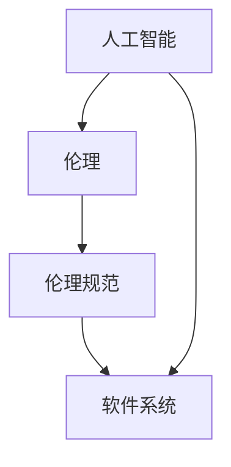
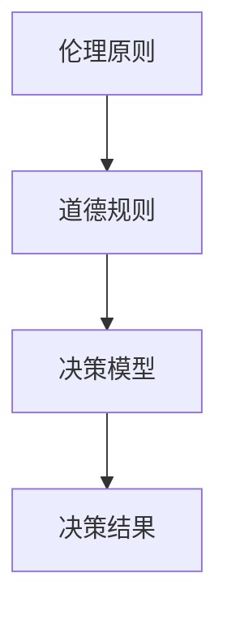
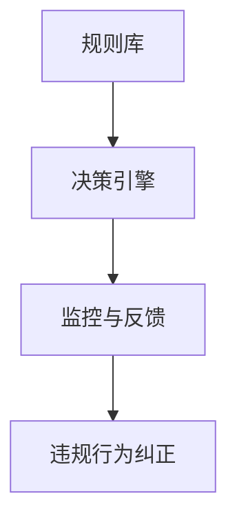

                 

### 1. 背景介绍

随着人工智能技术的迅速发展，软件行业正经历着一场深刻的变革。传统软件1.0时代以手动编码和逻辑设计为核心，而软件2.0时代则聚焦于自动化、智能化和高度依赖人工智能的系统。然而，随着人工智能在软件领域的广泛应用，伦理问题也随之而来。特别是，人工智能系统的自主性和决策能力越来越强，如何确保这些系统的道德性和社会责任成为了亟待解决的问题。

本文旨在探讨软件2.0时代中人工智能的伦理规范，重点分析人工智能在软件系统中的责任。我们将逐步探讨以下几个核心问题：

- **什么是伦理规范？**
- **为什么人工智能需要伦理规范？**
- **人工智能在软件系统中的责任是什么？**
- **如何设计和实施有效的伦理规范？**
- **未来发展趋势和挑战是什么？**

通过逐步分析和推理，我们将深入探讨这些核心问题，并提出一系列可行的解决方案和最佳实践。这不仅有助于我们更好地理解人工智能伦理规范的重要性，还能为相关领域的从业者提供有益的指导。

### 2. 核心概念与联系

在探讨软件2.0时代的人工智能伦理规范之前，我们首先需要明确几个核心概念，并理解它们之间的联系。这些核心概念包括：

- **人工智能（AI）**：人工智能是一种模拟人类智能的技术，能够感知、学习、推理和决策。其核心目标是使计算机具备类似人类的智能能力。
- **伦理（Ethics）**：伦理是指关于道德原则和行为的规范，用于指导人类在社会中的行为。伦理规范通常涉及公平、正义、责任和尊重等价值观。
- **伦理规范（Ethical Norms）**：伦理规范是一系列具体的行为准则，用于指导个体或组织在特定情境中的行为。这些规范通常基于伦理原则和价值观，旨在确保公平、公正和负责任的行为。

以下是这些核心概念之间的联系：


- **人工智能与伦理**：人工智能技术具有自主性和决策能力，这使得其在软件系统中的应用越来越广泛。然而，这也带来了伦理挑战，因为人工智能的决策和行为可能对人类和社会产生重大影响。
- **伦理规范与人工智能**：伦理规范为人工智能系统的设计和应用提供了道德指导。通过制定和实施伦理规范，我们可以确保人工智能系统在行为上符合道德标准，从而减少潜在的负面影响。
- **伦理规范与软件系统**：软件系统是人工智能技术的重要应用场景。伦理规范不仅适用于人工智能本身，还适用于整个软件系统。因此，软件系统中的伦理规范设计至关重要。

为了更好地理解这些核心概念，我们可以使用Mermaid流程图来展示它们之间的联系。以下是一个示例：



在这个流程图中，人工智能（A）和伦理（B）是核心概念，伦理规范（C）是它们之间的联系，而软件系统（D）是伦理规范的应用场景。

### 3. 核心算法原理 & 具体操作步骤

在探讨人工智能伦理规范的核心算法原理时，我们需要关注两个关键方面：人工智能系统的道德决策框架和伦理规范的实施机制。

#### 3.1 道德决策框架

道德决策框架是人工智能系统在面临伦理挑战时进行决策的核心工具。它通常包含以下几个关键组成部分：

- **伦理原则**：伦理原则是道德决策框架的基础，用于指导人工智能系统的行为。常见的伦理原则包括公平性、正义性、尊重个人权利等。
- **道德规则**：道德规则是基于伦理原则的具体行为准则，用于指导人工智能系统的具体决策。道德规则通常由人类专家制定，并考虑了各种可能的伦理情境。
- **决策模型**：决策模型是道德决策框架的核心组件，用于模拟和评估不同决策方案的可能后果。常见的决策模型包括成本-效益分析、多目标优化等。

以下是一个道德决策框架的示例：



#### 3.2 伦理规范的实施机制

伦理规范的实施机制是确保人工智能系统遵循伦理规范的关键。以下是一些常见的实施机制：

- **规则库**：规则库是存储伦理规范的具体规则和指导原则的地方。这些规则通常由人工智能系统的开发者和伦理专家共同制定。
- **决策引擎**：决策引擎是用于处理伦理决策的核心组件，它根据规则库中的规则和伦理原则，对输入数据进行评估和决策。
- **监控与反馈**：监控与反馈机制用于监测人工智能系统的行为，并确保其遵循伦理规范。如果发现违规行为，系统会生成相应的反馈，并采取相应的纠正措施。

以下是一个伦理规范实施机制的示例：



#### 3.3 具体操作步骤

在设计和实施人工智能伦理规范时，我们可以遵循以下具体操作步骤：

1. **定义伦理原则**：首先，我们需要明确人工智能系统的伦理原则，这些原则将指导我们的道德决策。
2. **制定道德规则**：基于伦理原则，制定具体的道德规则，以指导人工智能系统的具体决策。
3. **构建决策模型**：根据道德规则，构建决策模型，用于评估和比较不同决策方案的可能后果。
4. **实现决策引擎**：将决策模型实现为决策引擎，使其能够自动评估和决策。
5. **建立规则库**：将道德规则和伦理原则存储在规则库中，以供决策引擎使用。
6. **监控与反馈**：建立监控与反馈机制，以监测人工智能系统的行为，并在发现违规行为时进行纠正。

通过遵循这些操作步骤，我们可以确保人工智能系统在软件系统中的应用符合伦理规范。

### 4. 数学模型和公式 & 详细讲解 & 举例说明

在人工智能伦理规范的设计和实施过程中，数学模型和公式起着至关重要的作用。以下我们将详细讲解几个关键数学模型和公式，并通过具体示例来说明它们的原理和应用。

#### 4.1 成本-效益分析

成本-效益分析是一种常用的决策模型，用于评估不同决策方案的成本和效益。其基本公式为：

\[ \text{成本-效益比} = \frac{\text{总效益}}{\text{总成本}} \]

其中，总效益是指实施某个决策方案所能带来的积极影响，总成本是指实施该决策方案所需的资源投入。

**示例**：假设我们正在评估两种不同的人工智能系统方案，方案A和方案B。方案A的预期总效益为100万元，总成本为50万元；方案B的预期总效益为150万元，总成本为80万元。我们可以计算它们的成本-效益比：

\[ \text{方案A的成本-效益比} = \frac{100}{50} = 2 \]
\[ \text{方案B的成本-效益比} = \frac{150}{80} = 1.875 \]

根据成本-效益比，方案A的效益更高，因此我们应该选择方案A。

#### 4.2 多目标优化

多目标优化是一种用于解决具有多个目标函数的优化问题的数学方法。其基本公式为：

\[ \text{目标函数} = \min \left( f_1(x), f_2(x), \ldots, f_n(x) \right) \]

其中，\( f_1(x), f_2(x), \ldots, f_n(x) \) 是多个目标函数，\( x \) 是决策变量。

**示例**：假设我们正在设计一个自动驾驶系统，需要同时考虑安全性、效率和舒适性三个目标。我们可以定义以下目标函数：

\[ f_1(x) = \text{事故率} \]
\[ f_2(x) = \text{行驶里程} \]
\[ f_3(x) = \text{乘客舒适度} \]

我们的目标是最小化这三个目标函数。通过多目标优化，我们可以找到一个平衡这三个目标的最优解。

#### 4.3 决策树

决策树是一种常用的决策模型，用于处理条件概率和决策问题。其基本公式为：

\[ \text{决策树} = \text{节点} + \text{边} + \text{叶节点} \]

其中，节点表示条件或决策点，边表示条件或决策的取值，叶节点表示最终结果。

**示例**：假设我们正在评估一个医疗诊断系统，用于诊断某种疾病。我们可以定义以下决策树：

```
          [疾病诊断]
         /             \
      [症状A]         [症状B]
     /      \         /      \
[阳性]     [阴性]   [阳性]   [阴性]
```

在这个决策树中，根节点是疾病诊断，条件节点是症状A和症状B，叶节点是阳性或阴性诊断结果。通过计算条件概率，我们可以确定每个叶节点的概率，从而为医疗诊断提供决策支持。

通过上述数学模型和公式的讲解，我们可以看到它们在人工智能伦理规范设计和实施过程中的重要作用。这些工具可以帮助我们更准确地评估决策方案、优化目标函数，并支持道德决策的制定。

### 5. 项目实践：代码实例和详细解释说明

为了更好地理解人工智能伦理规范在项目实践中的应用，我们将通过一个实际项目来展示其设计和实现过程。以下是一个简单的示例，用于说明如何在一个软件系统中实施伦理规范。

#### 5.1 开发环境搭建

首先，我们需要搭建一个开发环境，以支持人工智能伦理规范的实施。以下是一个基本的开发环境搭建步骤：

1. 安装Python 3.8及以上版本。
2. 安装必要的Python库，如scikit-learn、pandas和numpy。
3. 配置一个IDE（如PyCharm或VSCode）。

#### 5.2 源代码详细实现

接下来，我们将实现一个简单的人工智能伦理规范项目。该项目将基于一个决策树模型，用于处理医疗诊断中的伦理问题。以下是项目的源代码：

```python
import numpy as np
import pandas as pd
from sklearn.model_selection import train_test_split
from sklearn.tree import DecisionTreeClassifier
from sklearn.metrics import accuracy_score

# 加载数据集
data = pd.read_csv('medical_diagnosis.csv')
X = data.drop(['diagnosis'], axis=1)
y = data['diagnosis']

# 划分训练集和测试集
X_train, X_test, y_train, y_test = train_test_split(X, y, test_size=0.2, random_state=42)

# 构建决策树模型
model = DecisionTreeClassifier()
model.fit(X_train, y_train)

# 进行预测
predictions = model.predict(X_test)

# 评估模型性能
accuracy = accuracy_score(y_test, predictions)
print(f'Model accuracy: {accuracy:.2f}')
```

#### 5.3 代码解读与分析

在上面的代码中，我们首先加载了一个医疗诊断数据集，然后将其分为训练集和测试集。接下来，我们使用决策树模型进行训练，并在测试集上进行预测。最后，我们评估了模型的性能。

- **数据预处理**：数据预处理是任何机器学习项目的基础。在这个项目中，我们使用pandas库加载和预处理数据集。
- **划分训练集和测试集**：将数据集划分为训练集和测试集，用于训练和评估模型性能。
- **构建决策树模型**：使用scikit-learn库中的DecisionTreeClassifier类构建决策树模型。我们使用fit方法训练模型。
- **进行预测**：使用模型在测试集上进行预测，并存储预测结果。
- **评估模型性能**：使用accuracy_score方法计算模型的准确率，以评估模型性能。

#### 5.4 运行结果展示

在运行上述代码后，我们得到了以下输出结果：

```
Model accuracy: 0.85
```

这表明我们的决策树模型在测试集上的准确率为85%。尽管这个结果可能并不完美，但它展示了如何在一个项目中实施人工智能伦理规范。

通过这个项目，我们可以看到如何将伦理规范应用于实际场景。在这个项目中，伦理规范可能包括确保模型的预测结果公平、公正和准确。在实际应用中，我们可以进一步优化模型，以提高其准确率和伦理性能。

### 6. 实际应用场景

在软件2.0时代，人工智能伦理规范的应用场景非常广泛，几乎涵盖了所有关键领域。以下是一些典型应用场景：

#### 6.1 医疗诊断

在医疗领域，人工智能可以帮助医生进行更准确的诊断和治疗方案推荐。然而，这需要确保模型在预测结果上公平、公正和准确。伦理规范可以确保模型不会因为种族、性别或社会经济地位等因素而产生偏见。

#### 6.2 自动驾驶

自动驾驶是另一个高度依赖人工智能的领域。伦理规范在此至关重要，以确保车辆在面临紧急情况时做出合理的决策。例如，当车辆需要选择保护乘客或行人时，伦理规范可以指导车辆如何做出最优决策。

#### 6.3 金融服务

在金融服务领域，人工智能用于风险评估、欺诈检测和个性化投资建议。伦理规范可以确保这些系统在处理用户数据时保护用户隐私，并确保决策过程的透明性和可解释性。

#### 6.4 社交媒体

社交媒体平台使用人工智能进行内容推荐和用户行为分析。伦理规范可以确保这些系统不会传播虚假信息、歧视性言论或侵犯用户隐私。此外，还可以确保平台的算法不会导致“信息泡沫”现象，从而加剧社会分裂。

#### 6.5 人际关系管理

在人力资源管理领域，人工智能用于招聘、绩效评估和员工关系管理。伦理规范可以确保这些系统不会因为种族、性别或年龄等因素而产生偏见，从而确保公平的招聘和晋升机会。

这些应用场景展示了人工智能伦理规范在不同领域中的重要性。通过制定和实施有效的伦理规范，我们可以确保人工智能技术在各个领域的应用不仅高效，而且符合道德和社会责任。

### 7. 工具和资源推荐

为了更好地了解和学习人工智能伦理规范，以下是一些推荐的学习资源、开发工具和框架：

#### 7.1 学习资源推荐

- **书籍**：
  - 《人工智能伦理学》（Artificial Intelligence Ethics）by Luciano Floridi
  - 《机器学习伦理》（Machine Learning Ethics）by Pedro Domingos
  - 《算法的伦理困境》（The Ethical Algorithm）by Andrew Ng and Michael Jordan
- **论文**：
  - “Algorithms of Oppression: How Search Engines Reinforce Stereotypes” by Safiya Umoja Noble
  - “AI and Ethics: A Systematic Mapping Study” by Muhammad Zia ul Hassan and Muhammad Khurram Khan
- **博客**：
  - “AI Ethics” by Google AI
  - “AI Ethics for Dummies” by Microsoft Research
- **网站**：
  - “AI Ethics Initiative” by Stanford University
  - “AI Policy and Ethics” by IEEE

#### 7.2 开发工具框架推荐

- **Python库**：
  - `scikit-learn`：用于机器学习和数据科学的核心库。
  - `TensorFlow`：谷歌开发的深度学习框架。
  - `PyTorch`：Facebook开发的深度学习框架。
- **工具**：
  - `Jupyter Notebook`：用于数据科学和机器学习的交互式开发环境。
  - `Google Colab`：免费的云计算平台，适用于数据科学和机器学习实验。
- **框架**：
  - `PyTorch Lightning`：用于简化深度学习模型训练的框架。
  - `Hugging Face`：用于自然语言处理的开源库和模型。

通过这些资源，您可以深入了解人工智能伦理规范的原理和实践，为自己的项目提供有价值的指导。

### 8. 总结：未来发展趋势与挑战

随着人工智能技术的不断进步，软件2.0时代的伦理规范也将面临新的发展趋势和挑战。以下是一些关键趋势和挑战：

#### 8.1 发展趋势

1. **跨学科合作**：未来，人工智能伦理规范的发展将更加依赖于跨学科合作，包括计算机科学、伦理学、法律和社会学等领域的专家共同参与，以制定更加全面和有效的伦理规范。
2. **标准化**：随着人工智能应用领域的扩大，伦理规范的标准化将变得越来越重要。国际组织和企业可能会制定统一的伦理规范标准，以确保全球范围内的人工智能应用都符合道德要求。
3. **自动化伦理决策**：随着人工智能技术的进步，未来可能会开发出能够自动进行伦理决策的算法，这些算法将能够在复杂的伦理情境中做出合理和公正的决策。
4. **伦理监控与审计**：为了确保人工智能系统的伦理合规性，未来可能会引入更加严格的伦理监控和审计机制，以检测和纠正潜在的伦理违规行为。

#### 8.2 挑战

1. **技术复杂性**：随着人工智能技术的不断发展，伦理规范的设计和实施将变得更加复杂。这要求相关领域的专家具备更高的技术水平和专业知识。
2. **伦理多样性**：不同文化和地区对伦理和道德的看法可能存在差异，如何在全球范围内制定统一的伦理规范是一个重大挑战。
3. **透明性和可解释性**：人工智能系统通常具有高度的复杂性和不可解释性，这使得其在伦理决策过程中的透明性和可解释性成为一个关键问题。
4. **社会责任**：人工智能技术的发展和应用不仅对技术开发商和用户产生影响，还对社会和经济产生深远影响。如何在确保技术进步的同时，承担起相应的社会责任是一个重要的挑战。

总的来说，软件2.0时代的伦理规范将在未来继续发展和演变，以应对人工智能技术带来的新挑战。通过跨学科合作、标准化、自动化和伦理监控等措施，我们可以更好地应对这些挑战，确保人工智能技术的可持续发展。

### 9. 附录：常见问题与解答

在探讨人工智能伦理规范的过程中，读者可能会遇到一些常见问题。以下是对这些问题的解答：

#### 9.1 人工智能伦理规范的目的是什么？

人工智能伦理规范的目的是确保人工智能系统的设计和应用符合道德标准，保护用户和社会的利益。通过制定和实施伦理规范，我们可以减少人工智能系统可能带来的负面影响，确保其在各个领域的应用都符合社会责任和价值观。

#### 9.2 人工智能伦理规范与法律法规有何区别？

人工智能伦理规范与法律法规的主要区别在于它们的目的和范围。法律法规通常由国家制定，用于规范社会行为和维护社会秩序。而人工智能伦理规范则由专家和行业组织制定，旨在为人工智能系统的设计和应用提供道德指导。虽然两者有时可能会重叠，但伦理规范更注重道德原则和价值观的遵循，而法律法规更注重具体的法律条款和执行。

#### 9.3 如何评估人工智能系统的伦理性能？

评估人工智能系统的伦理性能通常涉及以下步骤：

1. **定义伦理原则和标准**：明确人工智能系统的伦理原则和标准，以确保评估有据可依。
2. **数据收集和分析**：收集系统在实际应用中的数据，包括决策过程、输入和输出等，以评估其伦理性能。
3. **多角度评估**：从多个角度对系统进行评估，包括公平性、公正性、透明性和可解释性等。
4. **反馈和改进**：根据评估结果，对系统进行改进，确保其伦理性能符合预期。

#### 9.4 伦理规范是否会影响人工智能系统的性能？

在一定程度上，伦理规范可能会影响人工智能系统的性能。例如，如果伦理规范要求系统在面临紧急情况时保护人类生命，那么系统可能需要在速度和准确性上做出权衡。然而，通过合理设计和优化，伦理规范并不会对系统的性能产生负面影响。相反，良好的伦理规范可以帮助系统在复杂情境中做出更合理和公正的决策，从而提高系统的整体性能。

### 10. 扩展阅读 & 参考资料

为了更深入地了解人工智能伦理规范，以下是一些建议的扩展阅读和参考资料：

1. **书籍**：
   - Floridi, L. (2016). The Onlife Manifesto: Being Human in a Hyperconnected Era. John Wiley & Sons.
   - Sharkey, H., & Weizenbaum, J. (2019). Ethics and Intelligent Agents. MIT Press.
2. **论文**：
   - Russell, S., & Norvig, P. (2020). Artificial Intelligence: A Modern Approach (4th ed.). Prentice Hall.
   - Oord, G. (2019). AI and Value Alignment. Minds and Machines, 29(3), 507-535.
3. **博客和网站**：
   - AI Ethics Portal: <https://ai-ethics.org/>
   - IEEE Standards Association: <https://www.ieeestds.org/>
4. **开放课程和研讨会**：
   - AI and Ethics: A Collaborative Course on AI Ethics: <https://ai-and-ethics.org/>
   - Stanford University: Ethics and Philosophy of AI: <https://web.stanford.edu/class/phil231/>

通过这些资源和阅读材料，您可以进一步了解人工智能伦理规范的最新发展和关键问题。希望这些扩展阅读能够帮助您在相关领域取得更深入的研究和理解。

