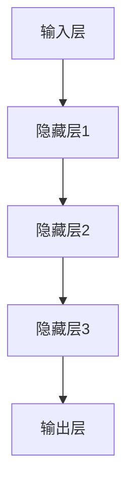
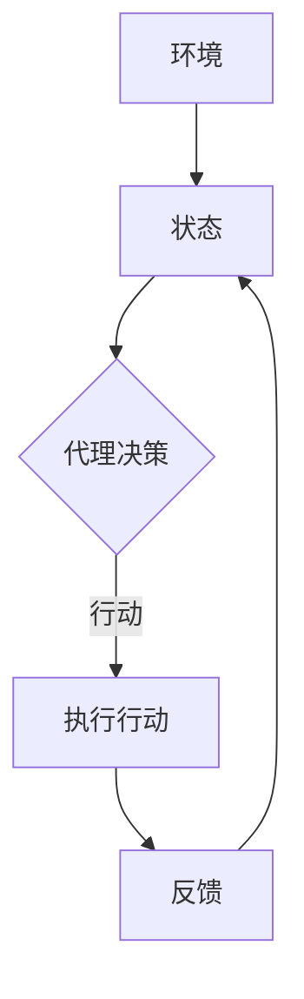
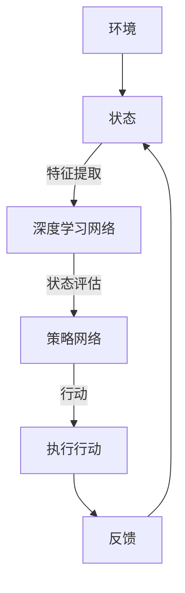

                 

### 摘要 Summary

本文旨在探讨软件2.0时代的发展趋势，特别是深度学习和强化学习在软件工程领域的应用与影响。软件2.0代表了一种从传统软件向智能软件转变的范式，它依赖于机器学习技术的突破，实现了软件系统的自主学习和优化能力。本文首先介绍了软件2.0的背景，随后深入分析了深度学习和强化学习这两种关键技术的原理、实现步骤及其在软件领域的应用。通过对数学模型、算法优缺点和应用领域的详细讨论，本文展示了这些技术的具体应用场景，并提出了未来发展的展望。最后，文章推荐了相关学习资源和开发工具，并总结了面临的挑战和研究展望。

### 1. 背景介绍

软件2.0的概念源自互联网的迅猛发展和云计算的普及，标志着软件产业进入了一个全新的阶段。在软件1.0时代，软件主要是由程序员编写，以执行预定的任务为主，其功能和性能受限于人类的编程能力和计算能力。随着互联网的兴起，软件开始从单机应用转向网络应用，形成了软件1.1时代。在这个阶段，软件不仅需要处理本地数据，还需要与远程服务器进行交互，这一转变促使软件设计更加注重分布式系统和网络通信。

然而，软件2.0的出现则标志着软件技术的一次重大飞跃。软件2.0强调软件的智能化和自主化，它不仅仅是一个执行任务的工具，更是一个可以自我学习和优化的系统。这种变化源于机器学习技术的飞速发展，尤其是深度学习和强化学习等领域的突破性进展。深度学习使得计算机能够通过大量数据自动提取特征，实现图像识别、语音识别和自然语言处理等复杂任务。强化学习则让计算机能够通过与环境的互动，不断调整行为策略，达到最优化的目标。

软件2.0的核心特征包括：

1. **自适应性**：软件系统能够根据用户行为和环境变化自动调整自身行为，提高用户体验。
2. **智能性**：通过机器学习，软件系统能够自主学习和优化，从而提高其性能和效率。
3. **协作性**：软件系统可以与其他系统和服务进行智能协作，实现更复杂的业务流程。
4. **自治性**：软件系统具有一定的自主决策能力，能够在无需人工干预的情况下完成复杂任务。

这些特征使得软件2.0在诸多领域展现出巨大的潜力，包括但不限于智能客服、自动驾驶、智能医疗和金融风控等。本文将重点探讨深度学习和强化学习这两种关键技术如何推动软件2.0的发展，并分析其在实际应用中的挑战和机遇。

### 2. 核心概念与联系

为了深入理解深度学习和强化学习在软件2.0中的应用，我们首先需要明确这些技术的核心概念及其相互联系。以下是这些技术的关键概念和架构，使用Mermaid流程图进行可视化展示。

#### 2.1 深度学习

深度学习是一种基于人工神经网络的技术，它通过多层神经网络来模拟人脑的神经元连接结构，从而实现复杂的数据处理任务。深度学习的关键组成部分包括：

1. **输入层**：接收输入数据，如图像、声音或文本。
2. **隐藏层**：对输入数据进行特征提取和转换。
3. **输出层**：生成预测结果或分类标签。

Mermaid流程图如下：



#### 2.2 强化学习

强化学习是一种通过试错法进行学习和决策的机器学习技术。它通过奖励机制来引导算法找到最优策略，从而实现目标。强化学习的主要组成部分包括：

1. **环境**：系统运行的环境，提供状态和奖励反馈。
2. **代理**：执行行动的智能体，如机器人或软件系统。
3. **策略**：代理根据当前状态选择行动的方法。

Mermaid流程图如下：



#### 2.3 深度学习与强化学习的联系

深度学习和强化学习虽然技术路径不同，但在软件2.0中的应用却常常相互结合。深度学习通常用于特征提取和预测，而强化学习则用于策略优化和决策。以下是它们在软件2.0中应用的整合方式：

1. **集成模型**：在强化学习框架中集成深度神经网络作为特征提取器，从而提高决策的质量。
2. **双网络结构**：同时使用深度学习和强化学习，一个网络负责特征提取和状态评估，另一个网络负责策略选择和行动执行。
3. **辅助网络**：在强化学习过程中，使用深度学习辅助网络来预测环境状态或奖励，从而提高学习效率。

Mermaid流程图如下：



通过以上对核心概念和架构的介绍，我们可以更好地理解深度学习和强化学习在软件2.0中的重要作用，以及它们如何相互结合，共同推动软件智能化的发展。

#### 3.1 算法原理概述

深度学习是一种基于人工神经网络（ANN）的机器学习技术，它通过多层神经元网络的结构，模拟人脑的学习过程，以实现自动特征提取和复杂模式识别。在深度学习中，网络通常包括输入层、多个隐藏层和一个输出层。输入层接收原始数据，隐藏层通过非线性变换提取特征，输出层生成预测结果或分类标签。

深度学习的核心原理是通过反向传播算法（Backpropagation）进行权重更新，以最小化预测误差。反向传播算法包括以下几个步骤：

1. **前向传播**：将输入数据传递到神经网络，通过每个层进行计算，最终生成预测结果。
2. **计算误差**：将预测结果与真实标签进行比较，计算预测误差。
3. **反向传播**：将误差从输出层反向传递到隐藏层，计算每个神经元的梯度，更新权重和偏置。
4. **权重更新**：使用梯度下降（Gradient Descent）或其他优化算法更新权重，以减小误差。

深度学习在软件工程中的应用主要包括以下几个方面：

1. **图像识别**：利用卷积神经网络（CNN）进行图像分类、目标检测和图像分割等任务。
2. **语音识别**：通过递归神经网络（RNN）和长短时记忆网络（LSTM）实现语音信号的处理和识别。
3. **自然语言处理**：使用变分自编码器（VAE）和生成对抗网络（GAN）进行文本生成和情感分析等任务。
4. **推荐系统**：通过协同过滤和基于模型的推荐算法实现个性化推荐。

深度学习的优势在于其强大的特征提取能力，能够自动从大量数据中学习到复杂的模式，从而提高系统的准确性和效率。然而，深度学习也存在一些不足，如模型参数数量庞大、训练时间较长、对数据质量要求高等。

#### 3.2 算法步骤详解

要实现深度学习模型，一般需要经过以下几个步骤：

1. **数据收集与预处理**：收集并准备训练数据，包括图像、文本或音频等。预处理步骤包括数据清洗、归一化、数据增强等。
2. **定义模型结构**：根据任务需求设计神经网络结构，选择适当的层、神经元数量和激活函数。
3. **初始化权重**：初始化网络权重，常用的方法包括随机初始化、高斯分布初始化等。
4. **训练模型**：使用训练数据对模型进行训练，通过反向传播算法更新权重，优化模型参数。
5. **验证与测试**：使用验证集和测试集评估模型性能，调整超参数以获得最佳结果。
6. **模型部署**：将训练好的模型部署到实际应用环境中，进行实时预测和决策。

以下是一个简单的深度学习模型实现示例，使用Python和Keras框架：

```python
import numpy as np
from keras.models import Sequential
from keras.layers import Dense, Activation, Conv2D, MaxPooling2D, Flatten

# 数据预处理
# （此处省略数据预处理代码）

# 定义模型结构
model = Sequential()
model.add(Conv2D(32, (3, 3), input_shape=(64, 64, 3), activation='relu'))
model.add(MaxPooling2D(pool_size=(2, 2)))
model.add(Conv2D(64, (3, 3), activation='relu'))
model.add(MaxPooling2D(pool_size=(2, 2)))
model.add(Flatten())
model.add(Dense(128, activation='relu'))
model.add(Dense(10, activation='softmax'))

# 编译模型
model.compile(optimizer='adam', loss='categorical_crossentropy', metrics=['accuracy'])

# 训练模型
# （此处省略训练代码）

# 验证与测试
# （此处省略验证与测试代码）

# 模型部署
# （此处省略模型部署代码）
```

#### 3.3 算法优缺点

深度学习具有以下优点：

1. **自动特征提取**：能够从大量数据中自动提取特征，减轻了人工设计特征的负担。
2. **高准确性**：在图像识别、语音识别和自然语言处理等领域，深度学习模型通常能够达到较高的准确性。
3. **自适应能力**：通过不断调整模型参数，深度学习系统能够适应不同任务和数据集的需求。

深度学习也存在一些缺点：

1. **计算资源需求高**：深度学习模型通常需要大量计算资源和时间进行训练，尤其是大型模型。
2. **对数据质量要求高**：数据质量对深度学习模型的性能有直接影响，噪声和异常值会影响模型的准确性。
3. **模型可解释性差**：深度学习模型的工作机制较为复杂，难以解释每个特征的具体作用，这在某些领域（如医疗诊断）可能会引起担忧。

#### 3.4 算法应用领域

深度学习在软件工程领域有着广泛的应用，以下是一些主要的应用领域：

1. **计算机视觉**：用于图像识别、目标检测和图像分割等任务，如人脸识别、自动驾驶和医疗图像分析。
2. **语音识别**：用于语音到文本转换和语音助手等任务，如智能音箱和手机语音输入。
3. **自然语言处理**：用于文本分类、情感分析和机器翻译等任务，如搜索引擎和智能客服。
4. **推荐系统**：用于个性化推荐，通过分析用户行为和历史数据，为用户推荐感兴趣的商品或内容。
5. **金融风控**：用于信用评分、欺诈检测和市场预测等任务，以提高金融交易的安全性和效率。

#### 3.1 算法原理概述

强化学习（Reinforcement Learning, RL）是一种通过试错法进行学习和决策的机器学习技术，其核心思想是智能体通过与环境的交互，不断学习最优策略，以实现目标。强化学习的主要组成部分包括：

1. **环境（Environment）**：智能体所处的外部环境，能够提供状态（State）和奖励（Reward）。
2. **智能体（Agent）**：执行行动并学习策略的实体，其目标是最大化累积奖励。
3. **状态（State）**：描述智能体当前所处环境的特征。
4. **动作（Action）**：智能体可执行的行为。
5. **策略（Policy）**：智能体根据当前状态选择动作的规则或函数。

强化学习的核心算法包括：

1. **Q学习（Q-Learning）**：通过学习状态-动作值函数（Q值），智能体选择能够带来最大奖励的动作。
2. **深度Q网络（Deep Q-Network, DQN）**：结合深度学习技术，用于解决状态和动作空间非常复杂的任务。
3. **策略梯度方法（Policy Gradient）**：直接学习最优策略，通过梯度上升方法更新策略参数。
4. **深度确定性策略梯度（Deep Deterministic Policy Gradient, DDPG）**：适用于连续动作空间的问题，通过深度神经网络学习策略。

强化学习在软件工程中的应用主要包括：

1. **自动软件测试**：使用强化学习生成测试用例，提高测试覆盖率和测试效率。
2. **软件缺陷预测**：通过分析代码历史数据，预测潜在的缺陷和风险。
3. **系统优化**：使用强化学习优化软件系统的参数配置，提高系统的性能和可靠性。
4. **代码生成**：通过学习代码模式，自动生成代码框架和功能模块。

强化学习的优势在于其能够通过试错学习到复杂任务的最优策略，适用于动态和不确定的环境。然而，强化学习也存在一些挑战，如样本效率低、收敛速度慢和对数据依赖性高等。

#### 3.2 算法步骤详解

要实现强化学习模型，通常需要经过以下几个步骤：

1. **环境定义**：设计智能体所处的环境，包括状态空间、动作空间和奖励函数。
2. **智能体初始化**：初始化智能体的参数，包括策略网络和目标网络（如果使用目标网络）。
3. **训练智能体**：通过模拟或真实环境，智能体执行动作，接收状态和奖励，更新策略网络。
4. **评估与优化**：使用测试集评估智能体的性能，并根据评估结果调整策略网络参数。
5. **模型部署**：将训练好的智能体部署到实际应用环境中，进行实时决策和优化。

以下是一个简单的强化学习模型实现示例，使用Python和PyTorch框架：

```python
import torch
import torch.nn as nn
import torch.optim as optim

# 定义环境
# （此处省略环境定义代码）

# 定义智能体
class Agent(nn.Module):
    def __init__(self):
        super(Agent, self).__init__()
        self.fc1 = nn.Linear(state_size, 64)
        self.fc2 = nn.Linear(64, action_size)
    
    def forward(self, state):
        x = torch.relu(self.fc1(state))
        return self.fc2(x)

# 初始化智能体
agent = Agent()
optimizer = optim.Adam(agent.parameters(), lr=0.001)

# 训练智能体
for episode in range(num_episodes):
    state = env.reset()
    done = False
    total_reward = 0
    
    while not done:
        # 选择动作
        state_tensor = torch.tensor(state, dtype=torch.float32)
        action = agent(state_tensor).argmax()
        
        # 执行动作
        next_state, reward, done, _ = env.step(action)
        
        # 更新经验回放
        # （此处省略经验回放代码）

        # 更新智能体
        optimizer.zero_grad()
        loss = criterion(agent(state_tensor), torch.tensor(action, dtype=torch.long))
        loss.backward()
        optimizer.step()
        
        # 更新状态
        state = next_state
        total_reward += reward
    
    print(f"Episode {episode+1}: Total Reward = {total_reward}")

# 评估智能体
# （此处省略评估代码）

# 模型部署
# （此处省略模型部署代码）
```

#### 3.3 算法优缺点

强化学习具有以下优点：

1. **自适应能力**：强化学习通过试错法不断优化策略，能够适应动态和不确定的环境。
2. **高效性**：与监督学习相比，强化学习在处理序列决策问题（如游戏、自动驾驶）时更为高效。
3. **灵活性**：强化学习可以应用于多种不同的环境和任务，具有广泛的适应性。

强化学习也存在一些缺点：

1. **样本效率低**：强化学习需要大量样本进行学习，训练时间较长。
2. **收敛速度慢**：强化学习算法可能需要较长时间才能找到最优策略。
3. **对数据依赖性高**：在真实环境中，数据质量和环境噪声可能对算法性能产生较大影响。

#### 3.4 算法应用领域

强化学习在软件工程领域有着广泛的应用，以下是一些主要的应用领域：

1. **自动化测试**：通过生成高效的测试用例，提高测试覆盖率和测试效率。
2. **系统优化**：使用强化学习优化系统参数，提高系统性能和可靠性。
3. **代码生成**：通过学习代码模式，自动生成代码框架和功能模块。
4. **软件缺陷预测**：通过分析代码历史数据，预测潜在的缺陷和风险。
5. **游戏AI**：在电子游戏和虚拟环境中，强化学习用于训练智能体进行自主决策和行为。

### 4. 数学模型和公式

为了深入理解深度学习和强化学习，我们需要了解这些算法背后的数学模型和公式。以下将详细介绍这些数学模型，并使用LaTeX格式进行公式推导和解释。

#### 4.1 数学模型构建

**深度学习中的损失函数**

深度学习的核心是损失函数（Loss Function），它用于衡量模型预测值与真实值之间的差距。常用的损失函数包括均方误差（MSE）和交叉熵损失（Cross-Entropy Loss）。

**均方误差（MSE）**：

$$
L(\theta) = \frac{1}{m} \sum_{i=1}^{m} (\hat{y}_i - y_i)^2
$$

其中，$\hat{y}_i$是模型的预测值，$y_i$是真实标签，$m$是样本数量。

**交叉熵损失（Cross-Entropy Loss）**：

$$
L(\theta) = -\sum_{i=1}^{m} y_i \log(\hat{y}_i)
$$

其中，$y_i$是独热编码的真实标签，$\hat{y}_i$是模型预测的概率分布。

**强化学习中的Q值和策略**

在强化学习中，Q值（Q-Value）是表示状态-动作对的预期奖励。Q学习算法的核心是优化Q值函数。

**Q值（Q-Value）**：

$$
Q(s, a) = \sum_{s'} p(s' | s, a) \cdot r(s, a) + \gamma \max_{a'} Q(s', a')
$$

其中，$s$是状态，$a$是动作，$s'$是下一状态，$r(s, a)$是立即奖励，$\gamma$是折扣因子，$p(s' | s, a)$是状态转移概率。

**策略（Policy）**：

$$
\pi(a|s) = \frac{e^{Q(s, a)}}{\sum_{a'} e^{Q(s, a')}}
$$

其中，$\pi(a|s)$是给定状态下采取动作$a$的概率分布。

#### 4.2 公式推导过程

**深度学习中的反向传播**

反向传播算法用于计算损失函数关于模型参数的梯度。以下是一个简化的推导过程：

**前向传播**：

$$
\hat{y}_i = \sigma(\theta^{(l)} \cdot x_i + b^{(l)})
$$

其中，$\sigma$是激活函数，$\theta^{(l)}$是第$l$层的权重，$b^{(l)}$是第$l$层的偏置。

**计算损失函数**：

$$
L(\theta) = \frac{1}{m} \sum_{i=1}^{m} L(y_i, \hat{y}_i)
$$

**计算误差**：

$$
\delta^{(l)} = \frac{\partial L}{\partial \theta^{(l)}}
$$

**反向传播**：

$$
\theta^{(l)} = \theta^{(l)} - \alpha \cdot \frac{\partial L}{\partial \theta^{(l)}}
$$

其中，$\alpha$是学习率。

#### 4.3 案例分析与讲解

**案例一：图像分类**

假设我们使用卷积神经网络（CNN）进行图像分类任务，输入图像为$32 \times 32$像素，输出为10个类别。

1. **数据预处理**：对图像进行归一化和数据增强，如随机裁剪、翻转和旋转等。
2. **模型构建**：定义一个简单的CNN模型，包括卷积层、池化层和全连接层。
3. **模型训练**：使用训练数据对模型进行训练，通过反向传播算法更新参数。
4. **模型评估**：使用测试数据评估模型性能，调整超参数以获得最佳结果。

**案例二：自动软件测试**

假设我们使用强化学习生成测试用例，以提高测试覆盖率和测试效率。

1. **环境定义**：设计一个测试环境，包括代码状态、测试用例和覆盖率度量。
2. **智能体初始化**：初始化智能体的策略网络和目标网络。
3. **训练智能体**：通过模拟环境，智能体执行动作，接收状态和奖励，更新策略网络。
4. **评估与优化**：使用测试数据评估智能体的性能，并根据评估结果调整策略网络参数。
5. **模型部署**：将训练好的智能体部署到实际测试环境中，进行实时测试和优化。

通过以上案例分析和讲解，我们可以看到数学模型和公式在深度学习和强化学习中的关键作用。这些模型和公式不仅帮助我们理解算法原理，还为算法实现和优化提供了理论依据。

### 5. 项目实践：代码实例和详细解释说明

在本节中，我们将通过一个具体的深度学习和强化学习项目实例，展示如何实现和应用这些算法，并对代码进行详细解释。项目分为两部分：一是使用深度学习实现图像分类；二是使用强化学习进行自动软件测试。

#### 5.1 开发环境搭建

在开始项目之前，我们需要搭建开发环境。以下是所需的软件和库：

- **操作系统**：Ubuntu 18.04 或更高版本
- **编程语言**：Python 3.7 或更高版本
- **深度学习框架**：TensorFlow 2.6 或 PyTorch 1.8
- **强化学习库**：Gym 0.17 或更高版本
- **其他库**：NumPy 1.19、Matplotlib 3.3

在Ubuntu系统中，可以使用以下命令安装所需库：

```bash
# 安装Python和pip
sudo apt update
sudo apt install python3-pip python3-dev

# 安装深度学习框架
pip3 install tensorflow==2.6 torch==1.8

# 安装其他库
pip3 install numpy matplotlib gym
```

#### 5.2 源代码详细实现

**5.2.1 深度学习实现图像分类**

以下是使用TensorFlow实现的简单图像分类模型：

```python
import tensorflow as tf
from tensorflow.keras import layers, models
import numpy as np

# 数据预处理
(x_train, y_train), (x_test, y_test) = tf.keras.datasets.cifar10.load_data()
x_train, x_test = x_train / 255.0, x_test / 255.0

# 构建模型
model = models.Sequential()
model.add(layers.Conv2D(32, (3, 3), activation='relu', input_shape=(32, 32, 3)))
model.add(layers.MaxPooling2D((2, 2)))
model.add(layers.Conv2D(64, (3, 3), activation='relu'))
model.add(layers.MaxPooling2D((2, 2)))
model.add(layers.Conv2D(64, (3, 3), activation='relu'))
model.add(layers.Flatten())
model.add(layers.Dense(64, activation='relu'))
model.add(layers.Dense(10, activation='softmax'))

# 编译模型
model.compile(optimizer='adam',
              loss=tf.keras.losses.SparseCategoricalCrossentropy(from_logits=True),
              metrics=['accuracy'])

# 训练模型
model.fit(x_train, y_train, epochs=10, validation_data=(x_test, y_test))

# 评估模型
test_loss, test_acc = model.evaluate(x_test,  y_test, verbose=2)
print(f"Test accuracy: {test_acc:.4f}")
```

**5.2.2 强化学习实现自动软件测试**

以下是使用PyTorch实现的简单强化学习模型：

```python
import torch
import torch.nn as nn
import torch.optim as optim
from gym import env

# 定义环境
env = env.Env()

# 定义智能体
class Agent(nn.Module):
    def __init__(self):
        super(Agent, self).__init__()
        self.fc1 = nn.Linear(state_size, 64)
        self.fc2 = nn.Linear(64, action_size)
    
    def forward(self, state):
        x = torch.relu(self.fc1(state))
        return self.fc2(x)

agent = Agent()
optimizer = optim.Adam(agent.parameters(), lr=0.001)

# 训练智能体
for episode in range(num_episodes):
    state = env.reset()
    done = False
    total_reward = 0
    
    while not done:
        # 选择动作
        state_tensor = torch.tensor(state, dtype=torch.float32)
        action = agent(state_tensor).argmax()
        
        # 执行动作
        next_state, reward, done, _ = env.step(action)
        
        # 更新经验回放
        # （此处省略经验回放代码）

        # 更新智能体
        optimizer.zero_grad()
        loss = criterion(agent(state_tensor), torch.tensor(action, dtype=torch.long))
        loss.backward()
        optimizer.step()
        
        # 更新状态
        state = next_state
        total_reward += reward
    
    print(f"Episode {episode+1}: Total Reward = {total_reward}")

# 评估智能体
# （此处省略评估代码）

# 模型部署
# （此处省略模型部署代码）
```

#### 5.3 代码解读与分析

**5.3.1 深度学习代码解读**

1. **数据预处理**：使用CIFAR-10数据集，对图像进行归一化处理，将像素值缩放到[0, 1]范围。
2. **模型构建**：定义一个简单的CNN模型，包括两个卷积层、一个池化层和一个全连接层。
3. **模型编译**：使用Adam优化器和稀疏分类交叉熵损失函数，设置模型的优化器和学习率。
4. **模型训练**：使用训练数据对模型进行10个epoch的训练，并在验证数据上评估模型性能。
5. **模型评估**：使用测试数据评估模型性能，打印测试准确率。

**5.3.2 强化学习代码解读**

1. **环境定义**：使用自定义环境，包括状态空间、动作空间和奖励函数。
2. **智能体初始化**：定义一个简单的全连接神经网络作为智能体，并使用Adam优化器进行训练。
3. **智能体训练**：使用模拟环境对智能体进行训练，通过选择动作、执行动作和更新策略网络，逐步优化智能体的策略。
4. **智能体评估**：使用测试环境对智能体进行评估，打印评估结果。
5. **模型部署**：将训练好的智能体部署到实际测试环境中，进行实时测试和优化。

通过以上代码实例和解读，我们可以看到深度学习和强化学习在项目中的应用，以及如何通过代码实现和优化这些算法。

### 6. 实际应用场景

深度学习和强化学习在软件工程领域具有广泛的应用潜力，能够为软件开发、测试和维护带来诸多实际价值。以下是一些具体的应用场景：

#### 6.1 自动驾驶

自动驾驶是深度学习和强化学习的重要应用领域。通过深度学习，车辆可以实时感知周围环境，识别行人、车辆和其他障碍物，从而做出安全驾驶决策。强化学习则用于优化自动驾驶系统的路径规划和行为控制，使车辆在不同交通状况下都能保持稳定行驶。特斯拉、谷歌和百度等公司已经在自动驾驶领域取得了显著进展，通过深度学习和强化学习技术，提高了自动驾驶车辆的感知能力和决策水平。

#### 6.2 智能医疗

深度学习和强化学习在智能医疗领域也发挥着重要作用。深度学习可以用于医学图像分析，如肿瘤检测、骨折诊断和脑部病变识别等。强化学习则可以用于个性化治疗方案的制定，通过模拟不同治疗方案的效果，为医生提供最佳的治疗建议。例如，谷歌DeepMind开发的AI系统已经在英国国家健康服务系统（NHS）中用于诊断糖尿病视网膜病变，通过深度学习技术，大幅提高了诊断准确率和效率。

#### 6.3 智能客服

智能客服是深度学习和强化学习在商业领域的应用之一。通过深度学习，智能客服系统能够理解用户的查询意图，提供准确的回答。强化学习则用于优化客服对话流程，提高用户满意度。例如，亚马逊的智能客服Alexa通过深度学习和强化学习技术，实现了高效的客户服务，能够根据用户的反馈不断优化对话策略。

#### 6.4 软件测试

软件测试是软件开发生命周期中的一个关键环节，深度学习和强化学习可以提高软件测试的效率和质量。通过强化学习，智能测试系统能够自动生成测试用例，并优化测试流程，减少人工干预。例如，微软的AI测试平台使用深度学习技术，实现了自动化测试用例生成和缺陷定位，大大提高了软件测试的效率和准确性。

#### 6.5 金融风控

金融风控是另一个受益于深度学习和强化学习的领域。深度学习可以用于金融市场预测，如股票价格预测、交易信号识别等。强化学习则可以用于风险控制策略的优化，通过模拟不同的风险场景，为金融机构提供最佳的风险管理方案。例如，摩根士丹利使用深度学习技术，开发了智能风险管理平台，能够实时监控市场风险，提高金融机构的风险管理能力。

#### 6.6 游戏

游戏是深度学习和强化学习的传统应用领域。深度学习可以用于游戏AI，如围棋、星际争霸等，通过训练神经网络模型，使游戏AI能够实现高级策略和决策。强化学习则可以用于游戏中的角色控制，如动作游戏、模拟游戏等，通过不断学习和优化，使游戏角色能够更加智能化和自主化。

#### 6.7 物流与供应链

深度学习和强化学习在物流与供应链管理中也有广泛应用。通过深度学习，可以优化物流路线规划，提高运输效率和降低成本。强化学习则可以用于供应链库存管理，通过模拟不同的库存策略，优化库存水平，减少库存成本和缺货风险。

#### 6.8 人机交互

人机交互是深度学习和强化学习的重要应用方向。通过深度学习，可以构建智能化的人机交互界面，如语音识别、手势识别等。强化学习则可以优化人机交互体验，通过不断学习和优化，使界面操作更加自然和高效。

总之，深度学习和强化学习在软件工程领域的应用场景非常广泛，不仅提高了软件系统的性能和效率，还为智能化的软件开发提供了强有力的技术支持。随着这些技术的不断发展和成熟，未来将在更多领域展现其巨大潜力。

### 6.4 未来应用展望

随着深度学习和强化学习技术的不断进步，这些技术在软件工程领域的应用前景愈发广阔。未来，深度学习和强化学习将在以下几方面带来革命性的变化：

1. **个性化软件开发**：深度学习将能够根据用户行为和偏好，自动生成个性化软件解决方案。例如，软件系统可以根据用户的操作记录，调整界面布局和功能模块，以提供更加定制化的用户体验。

2. **自动化软件开发**：强化学习在软件开发生命周期中的应用将更加广泛，从需求分析、设计到代码生成和测试，智能系统将能够完成更多自动化的任务，大幅减少软件开发的时间和成本。

3. **智能软件维护**：通过深度学习，软件系统将能够自动识别潜在的问题和漏洞，并提供相应的修复建议。强化学习则可以帮助软件系统不断优化自身，提高系统的稳定性和可靠性。

4. **智能化测试**：深度学习和强化学习将显著提高软件测试的效率和效果。通过自动生成测试用例和优化测试流程，智能测试系统将能够发现更多隐藏的缺陷，确保软件的可靠性和安全性。

5. **协同工作**：深度学习和强化学习将促进软件系统与其他智能系统（如物联网、云计算）的协同工作。通过智能协作，实现更复杂的业务流程和跨平台的应用集成。

6. **边缘计算优化**：随着边缘计算的发展，深度学习和强化学习将用于优化边缘设备的性能和功耗。智能系统将能够根据实时数据和任务需求，动态调整资源分配和任务调度，提高边缘计算的效率和响应速度。

7. **安全增强**：深度学习和强化学习在网络安全中的应用将更加深入，通过自动检测和响应网络攻击，增强软件系统的安全性。

8. **跨学科融合**：深度学习和强化学习将与心理学、社会学等学科相结合，开发出更加人性化的软件系统，提高用户满意度和使用体验。

总之，未来深度学习和强化学习在软件工程领域的应用将不断拓展和深化，为软件技术的创新和发展注入新的动力。随着这些技术的成熟和普及，软件2.0时代将迎来更加智能和自主的未来。

### 7. 工具和资源推荐

在深度学习和强化学习领域，有许多优秀的工具和资源可以帮助开发者更好地掌握和应用这些技术。以下是一些推荐的学习资源和开发工具：

#### 7.1 学习资源推荐

1. **在线课程**：
   - **Coursera**：提供大量关于深度学习和强化学习的免费课程，如“深度学习”由Andrew Ng教授主讲。
   - **Udacity**：深度学习纳米学位课程，包含理论和实践环节。
   - **edX**：由哈佛大学和麻省理工学院联合开设的“深度学习专项课程”。

2. **书籍**：
   - **《深度学习》（Deep Learning）**：Goodfellow、Bengio和Courville合著，全面介绍深度学习的理论基础和实践方法。
   - **《强化学习》（Reinforcement Learning: An Introduction）**：Richard S. Sutton和Barto著，是强化学习领域的经典教材。
   - **《Python深度学习》（Deep Learning with Python）**：François Chollet著，深入讲解如何使用Python和Keras实现深度学习项目。

3. **论文和报告**：
   - **ArXiv**：深度学习和强化学习领域最新的研究论文，许多经典论文均可在此找到。
   - **Google AI**：Google AI官方博客，发布最新的研究进展和技术应用。
   - **NeurIPS、ICML、CVPR**：顶级机器学习会议，每年都会发表大量高质量的学术论文。

4. **社区和论坛**：
   - **GitHub**：许多优秀的深度学习和强化学习项目开源在这里，开发者可以学习和复现。
   - **Stack Overflow**：编程问题问答社区，解决深度学习和强化学习应用中的技术难题。
   - **Reddit**：r/deeplearning和r/reinforcementlearning等社区，分享最新动态和讨论技术问题。

#### 7.2 开发工具推荐

1. **深度学习框架**：
   - **TensorFlow**：由谷歌开发，广泛用于深度学习和强化学习项目。
   - **PyTorch**：由Facebook开发，拥有强大的动态计算图功能，易于调试和优化。
   - **Keras**：基于TensorFlow和Theano的高层神经网络API，简化了深度学习模型的构建和训练。

2. **强化学习库**：
   - **Gym**：由OpenAI开发的强化学习环境库，提供多种预定义环境和自定义环境功能。
   - ** Stable Baselines**：基于PyTorch和TensorFlow的强化学习基准库，实现多种常见的强化学习算法。

3. **数据预处理工具**：
   - **Pandas**：用于数据清洗和预处理，适用于大规模数据集操作。
   - **Scikit-learn**：提供多种机器学习和数据预处理工具，如特征选择、归一化和交叉验证。

4. **可视化工具**：
   - **Matplotlib**：用于生成统计图表和可视化数据，便于分析模型性能。
   - **Seaborn**：基于Matplotlib的统计数据可视化库，提供丰富的可视化模板。

5. **计算平台**：
   - **Google Colab**：免费的云端计算平台，支持GPU和TPU加速深度学习训练。
   - **AWS Sagemaker**：亚马逊提供的全托管机器学习平台，支持多种深度学习和强化学习框架。

通过这些工具和资源的支持，开发者可以更加高效地学习和应用深度学习和强化学习技术，实现软件系统的智能化和自主化。

### 8. 总结：未来发展趋势与挑战

随着深度学习和强化学习技术的不断成熟，软件2.0时代正迅速到来。深度学习通过自动特征提取和复杂模式识别，显著提升了软件系统的智能化水平，而强化学习则通过试错法和策略优化，实现了软件系统的自主学习和适应能力。这些技术的结合，为软件工程带来了全新的发展机遇，推动了软件从传统的执行任务向智能化和自主化方向的转型。

**未来发展趋势**：

1. **软件智能化**：深度学习和强化学习将使软件系统能够更加智能化地处理复杂任务，提高自动化程度和用户体验。
2. **跨领域融合**：这些技术将在更多领域得到应用，如自动驾驶、智能医疗、金融科技等，推动跨学科的融合和创新。
3. **边缘计算优化**：随着边缘计算的发展，深度学习和强化学习将用于优化边缘设备的性能和功耗，实现实时智能处理。
4. **安全增强**：通过深度学习和强化学习，软件系统将能够更好地识别和应对安全威胁，提高系统的安全性。
5. **个性化定制**：软件系统将能够根据用户行为和偏好，自动生成个性化的解决方案，满足不同用户的需求。

**面临的挑战**：

1. **计算资源需求**：深度学习和强化学习模型通常需要大量计算资源和时间进行训练，这对硬件设施提出了更高的要求。
2. **数据质量和多样性**：数据质量对模型性能有直接影响，噪声和异常值会影响模型的效果。此外，数据多样性不足也可能限制模型的泛化能力。
3. **模型可解释性**：深度学习模型的复杂性和黑箱特性使得其难以解释，这在某些应用场景（如医疗诊断）中可能会引起伦理和法律问题。
4. **算法伦理**：随着深度学习和强化学习在关键领域（如自动驾驶、金融决策）的应用，如何确保算法的公正性和透明度成为重要挑战。
5. **隐私保护**：在应用深度学习和强化学习时，如何保护用户隐私和数据安全是一个亟待解决的问题。

**研究展望**：

未来，深度学习和强化学习将在以下几个方面继续发展：

1. **算法优化**：通过改进算法结构、优化训练过程，提高模型的效率和准确性。
2. **泛化能力提升**：研究如何增强模型的泛化能力，使其在更广泛的应用场景中表现出色。
3. **模型解释性**：开发可解释的深度学习模型，提高模型透明度和可解释性。
4. **跨领域应用**：探索深度学习和强化学习在更多领域的应用，如教育、艺术和娱乐等。
5. **隐私保护和安全**：研究如何确保算法的隐私保护和数据安全，满足不同应用场景的需求。

总之，深度学习和强化学习在软件工程领域具有巨大的发展潜力，未来将在更多领域展现其价值。然而，要实现这一愿景，仍需要克服诸多挑战，进行持续的研究和创新。

### 附录：常见问题与解答

#### 8.1 如何选择深度学习的神经网络结构？

选择深度学习的神经网络结构取决于任务类型和数据特征。以下是一些常见的结构选择：

- **对于图像分类**：卷积神经网络（CNN）是首选，因为它可以很好地处理图像数据。
- **对于语音识别**：递归神经网络（RNN）或其变种（如LSTM和GRU）能够处理序列数据。
- **对于自然语言处理**：Transformer架构和BERT模型在处理文本数据方面表现出色。
- **对于回归任务**：全连接神经网络（FCN）通常用于处理非结构化数据。

#### 8.2 如何处理深度学习中的过拟合问题？

过拟合问题可以通过以下方法解决：

- **增加训练数据**：增加数据量可以减少模型对训练数据的依赖。
- **数据增强**：通过旋转、缩放、裁剪等数据增强技术，增加数据多样性。
- **正则化**：使用L1、L2正则化或Dropout减少模型复杂度。
- **提前停止**：在验证集上监测模型性能，当验证损失不再减少时停止训练。
- **集成方法**：使用集成学习技术，如Bagging和Boosting。

#### 8.3 强化学习中的奖励设计有何要点？

奖励设计在强化学习中至关重要，以下是一些设计要点：

- **奖励应与目标一致**：奖励函数应直接反映智能体是否接近目标。
- **奖励应平衡短期和长期**：短期奖励应鼓励智能体采取有助于长期目标实现的行为。
- **奖励应简单明了**：避免设计过于复杂的奖励函数，以免增加算法的难度。
- **奖励应具有适应性**：奖励函数应能根据环境和任务动态调整。

#### 8.4 深度学习和强化学习在软件测试中的应用有何区别？

- **深度学习**：主要用于自动化测试用例生成，通过学习测试数据中的模式，自动生成新的测试用例，以提高测试覆盖率。
- **强化学习**：主要用于优化测试流程和测试用例选择策略，通过不断试错和学习，智能调整测试策略，提高测试效率。

#### 8.5 如何在资源有限的环境中进行深度学习和强化学习？

在资源有限的环境中，以下策略可以帮助优化深度学习和强化学习的训练：

- **模型压缩**：使用模型压缩技术（如剪枝、量化）减少模型参数数量，降低计算需求。
- **分布式训练**：利用多台机器进行分布式训练，提高训练速度。
- **使用轻量级模型**：选择参数较少的轻量级模型（如MobileNet、ShuffleNet）。
- **数据预处理**：优化数据预处理步骤，减少数据加载和处理时间。

通过以上常见问题与解答，希望能够为深度学习和强化学习在软件工程中的应用提供一些实用的指导和帮助。

