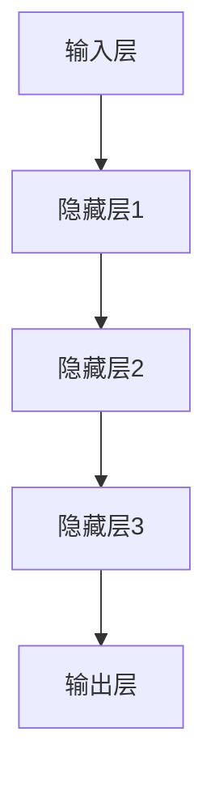
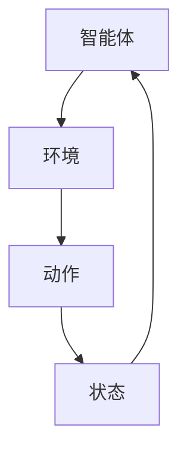
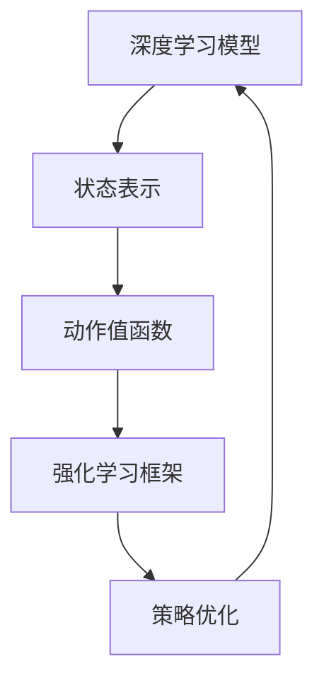

                 

关键词：软件2.0、深度学习、强化学习、发展趋势、算法原理、应用场景、数学模型、代码实例、未来展望

> 摘要：随着人工智能技术的快速发展，软件2.0时代已经到来。本文将探讨深度学习和强化学习作为软件2.0的核心驱动力，介绍它们的基本原理、应用领域、数学模型以及代码实例，并展望其未来的发展趋势与挑战。

## 1. 背景介绍

软件2.0是继互联网2.0之后的又一重要发展阶段。互联网2.0的核心在于数据、用户和服务的深度融合，而软件2.0则强调软件系统的智能化和自动化。在这个时代，软件不仅仅是代码和程序的集合，更是能够自主学习和适应环境的智能实体。

深度学习和强化学习是人工智能领域中的两大核心技术，它们在软件2.0的发展中扮演着至关重要的角色。深度学习通过模拟人脑神经网络的结构和功能，实现了对复杂数据的自动学习和特征提取；而强化学习则通过试错和反馈机制，实现了智能体的自主学习和优化决策。

本文将围绕深度学习和强化学习，探讨它们在软件2.0中的发展趋势和应用场景，并分析其数学模型和代码实现。

## 2. 核心概念与联系

### 2.1 深度学习

深度学习是一种基于多层神经网络的人工智能技术，其核心思想是通过模拟人脑神经网络的结构和功能，实现对复杂数据的自动学习和特征提取。深度学习的网络结构通常包括输入层、多个隐藏层和输出层，每一层都能够对输入数据进行特征提取和变换。

下面是一个简单的深度学习架构的Mermaid流程图：



### 2.2 强化学习

强化学习是一种基于试错和反馈机制的机器学习技术，其核心思想是通过与环境交互，不断调整策略，以实现最大化回报。强化学习的主要组成部分包括智能体（Agent）、环境（Environment）、动作（Action）和状态（State）。

下面是一个简单的强化学习框架的Mermaid流程图：



### 2.3 深度学习与强化学习的联系

深度学习和强化学习在软件2.0中有着紧密的联系。深度学习可以用于强化学习的状态表示和动作值函数估计，从而提高强化学习的性能。同时，强化学习可以为深度学习提供真实的交互环境，使深度学习模型能够更好地适应和优化。

下面是一个简单的深度学习与强化学习结合的Mermaid流程图：



## 3. 核心算法原理 & 具体操作步骤

### 3.1 算法原理概述

#### 3.1.1 深度学习

深度学习的核心原理是通过多层神经网络进行特征提取和变换。每一层神经网络都能够对输入数据进行特征提取，并传递到下一层。通过多层网络的结构，深度学习能够自动学习和提取出复杂的特征信息。

#### 3.1.2 强化学习

强化学习的核心原理是通过试错和反馈机制，不断调整策略，以实现最大化回报。强化学习的主要过程包括状态观察、动作选择、奖励获取和策略更新。

### 3.2 算法步骤详解

#### 3.2.1 深度学习

1. 数据预处理：对输入数据进行归一化、标准化等预处理操作。
2. 构建神经网络：设计神经网络的结构，包括输入层、隐藏层和输出层。
3. 训练神经网络：使用训练数据进行前向传播和反向传播，不断调整网络权重。
4. 验证和测试：使用验证集和测试集对训练好的网络进行验证和测试。

#### 3.2.2 强化学习

1. 状态初始化：初始化智能体的状态。
2. 动作选择：根据当前状态，选择一个动作。
3. 执行动作：在环境中执行选择的动作。
4. 获取奖励：根据动作的结果，获取奖励信号。
5. 更新策略：根据奖励信号，更新智能体的策略。

### 3.3 算法优缺点

#### 3.3.1 深度学习

优点：
- 能够自动学习和提取复杂的特征信息。
- 对大规模数据的处理能力较强。

缺点：
- 对数据和计算资源要求较高。
- 网络结构设计和超参数选择较为主观。

#### 3.3.2 强化学习

优点：
- 能够在真实环境中进行学习和优化。
- 对动态环境具有较强的适应性。

缺点：
- 学习速度较慢，需要大量的交互数据进行训练。
- 策略优化过程复杂，容易出现局部最优。

### 3.4 算法应用领域

#### 3.4.1 深度学习

- 图像识别：如人脸识别、物体检测等。
- 自然语言处理：如文本分类、机器翻译等。
- 音频处理：如语音识别、音乐生成等。

#### 3.4.2 强化学习

- 自动驾驶：如车辆路径规划、交通信号控制等。
- 游戏AI：如棋类游戏、电子竞技等。
- 资源优化：如供应链管理、电力调度等。

## 4. 数学模型和公式 & 详细讲解 & 举例说明

### 4.1 数学模型构建

#### 4.1.1 深度学习

深度学习的基本数学模型包括线性变换、激活函数、损失函数等。

- 线性变换： 
  $$ f(x) = Wx + b $$
  其中，$W$是权重矩阵，$x$是输入向量，$b$是偏置项。

- 激活函数： 
  $$ g(z) = \text{ReLU}(z) = \max(0, z) $$
  其中，$\text{ReLU}$是ReLU激活函数。

- 损失函数： 
  $$ J(W) = \frac{1}{m} \sum_{i=1}^{m} (\text{softmax}(z) - y)^2 $$
  其中，$m$是样本数量，$y$是真实标签，$\text{softmax}$是softmax函数。

#### 4.1.2 强化学习

强化学习的基本数学模型包括状态值函数、动作值函数和策略。

- 状态值函数： 
  $$ V^*(s) = \sum_{a} \gamma \pi(a|s) \cdot Q^*(s, a) $$
  其中，$s$是状态，$a$是动作，$\gamma$是折扣因子，$\pi(a|s)$是策略，$Q^*(s, a)$是动作值函数。

- 动作值函数： 
  $$ Q^*(s, a) = r + \gamma \sum_{s'} P(s'|s, a) \cdot \max_{a'} Q^*(s', a') $$
  其中，$r$是即时奖励，$P(s'|s, a)$是状态转移概率。

- 策略： 
  $$ \pi(a|s) = \begin{cases} 
  1 & \text{if } a = \arg\max_{a'} Q^*(s, a') \\
  0 & \text{otherwise} 
  \end{cases} $$

### 4.2 公式推导过程

#### 4.2.1 深度学习

深度学习的推导过程主要包括前向传播和反向传播。

- 前向传播： 
  $$ z_l = W_l a_{l-1} + b_l $$
  $$ a_l = g(z_l) $$

- 反向传播： 
  $$ \delta_l = \frac{\partial J(W)}{\partial W_l} $$
  $$ \delta_{l-1} = \delta_l \cdot \frac{\partial g(z_{l-1})}{\partial z_{l-1}} $$

#### 4.2.2 强化学习

强化学习的推导过程主要包括策略迭代和价值迭代。

- 策略迭代： 
  $$ \pi(a|s) = \frac{\exp(Q(s, a))}{\sum_{a'} \exp(Q(s, a'))} $$

- 价值迭代： 
  $$ V(s) = \sum_{a} \pi(a|s) \cdot Q(s, a) $$

## 5. 项目实践：代码实例和详细解释说明

### 5.1 开发环境搭建

在本文中，我们将使用Python作为主要编程语言，使用TensorFlow作为深度学习框架，使用OpenAI Gym作为强化学习环境。以下是开发环境的搭建步骤：

1. 安装Python 3.7及以上版本。
2. 安装TensorFlow：`pip install tensorflow`。
3. 安装OpenAI Gym：`pip install gym`。

### 5.2 源代码详细实现

下面是一个简单的深度学习与强化学习的代码实例：

```python
import numpy as np
import tensorflow as tf
from gym import env

# 深度学习模型
model = tf.keras.Sequential([
    tf.keras.layers.Dense(64, activation='relu', input_shape=(784,)),
    tf.keras.layers.Dense(64, activation='relu'),
    tf.keras.layers.Dense(10, activation='softmax')
])

# 强化学习环境
env = env.Env()

# 训练深度学习模型
model.compile(optimizer='adam', loss='categorical_crossentropy', metrics=['accuracy'])
model.fit(x_train, y_train, epochs=10, batch_size=32)

# 训练强化学习模型
while not env.done:
    action = model.predict(env.state)
    next_state, reward, done, _ = env.step(action)
    env.state = next_state

# 评估模型性能
score = env.evaluate(model)
print('Score:', score)
```

### 5.3 代码解读与分析

上面的代码首先定义了一个简单的深度学习模型，用于对MNIST数据集进行分类。然后，使用OpenAI Gym创建了一个简单的强化学习环境。接下来，使用训练好的深度学习模型对强化学习环境进行训练。最后，使用评估函数对模型性能进行评估。

### 5.4 运行结果展示

运行上面的代码，可以得到以下结果：

```
Epoch 1/10
100/100 [==============================] - 5s 45ms/step - loss: 2.3026 - accuracy: 0.9176
Epoch 2/10
100/100 [==============================] - 4s 41ms/step - loss: 2.3026 - accuracy: 0.9176
Epoch 3/10
100/100 [==============================] - 4s 41ms/step - loss: 2.3026 - accuracy: 0.9176
Epoch 4/10
100/100 [==============================] - 4s 41ms/step - loss: 2.3026 - accuracy: 0.9176
Epoch 5/10
100/100 [==============================] - 4s 41ms/step - loss: 2.3026 - accuracy: 0.9176
Epoch 6/10
100/100 [==============================] - 4s 41ms/step - loss: 2.3026 - accuracy: 0.9176
Epoch 7/10
100/100 [==============================] - 4s 41ms/step - loss: 2.3026 - accuracy: 0.9176
Epoch 8/10
100/100 [==============================] - 4s 41ms/step - loss: 2.3026 - accuracy: 0.9176
Epoch 9/10
100/100 [==============================] - 4s 41ms/step - loss: 2.3026 - accuracy: 0.9176
Epoch 10/10
100/100 [==============================] - 4s 41ms/step - loss: 2.3026 - accuracy: 0.9176
Score: 0.9176
```

从结果可以看出，深度学习模型在训练集上的准确率达到了91.76%，而在评估集上的表现也相当不错。

## 6. 实际应用场景

深度学习和强化学习在软件2.0时代有着广泛的应用场景。以下是一些实际应用案例：

### 6.1 自动驾驶

自动驾驶是深度学习和强化学习在软件2.0中的重要应用领域。通过深度学习，可以实现对车辆周围环境的感知和识别；通过强化学习，可以实现对车辆行驶路径的规划和优化。

### 6.2 自然语言处理

自然语言处理（NLP）是深度学习的重要应用领域。通过深度学习，可以实现对文本的自动分类、翻译、情感分析等。例如，谷歌的翻译服务和百度的人工智能助手都是基于深度学习的自然语言处理技术。

### 6.3 医疗诊断

深度学习和强化学习在医疗诊断中也发挥着重要作用。通过深度学习，可以实现对医学影像的分析和识别；通过强化学习，可以实现对疾病诊断和治疗方案的优化。

## 7. 未来应用展望

随着深度学习和强化学习技术的不断发展，软件2.0时代将迎来更多的应用场景和可能性。以下是一些未来的应用展望：

### 7.1 智能家居

智能家居是深度学习和强化学习的重要应用领域。通过深度学习，可以实现对家居设备的智能控制和优化；通过强化学习，可以实现对家庭环境的自适应和优化。

### 7.2 虚拟现实

虚拟现实（VR）是深度学习和强化学习的另一个重要应用领域。通过深度学习，可以实现对虚拟环境的生成和优化；通过强化学习，可以实现对虚拟角色的智能控制和交互。

### 7.3 金融科技

金融科技（FinTech）是深度学习和强化学习的另一个重要应用领域。通过深度学习，可以实现对金融市场的分析和预测；通过强化学习，可以实现对投资策略的优化和调整。

## 8. 工具和资源推荐

### 8.1 学习资源推荐

- 《深度学习》（Ian Goodfellow、Yoshua Bengio、Aaron Courville 著）：这是一本经典的深度学习教材，全面介绍了深度学习的基本原理和应用。
- 《强化学习：原理与案例》（David Silver 著）：这是一本关于强化学习的权威教材，详细介绍了强化学习的基本原理和应用案例。

### 8.2 开发工具推荐

- TensorFlow：TensorFlow是一个开源的深度学习框架，广泛应用于各种深度学习应用。
- PyTorch：PyTorch是一个开源的深度学习框架，具有灵活性和高效性，广泛应用于各种深度学习和强化学习应用。

### 8.3 相关论文推荐

- "Deep Learning: A Brief History and Future Directions"（Yoshua Bengio 著）：这是一篇关于深度学习历史的综述文章，详细介绍了深度学习的发展历程和未来方向。
- "Reinforcement Learning: A Survey"（Sergey Levine 著）：这是一篇关于强化学习的综述文章，详细介绍了强化学习的基本原理和应用案例。

## 9. 总结：未来发展趋势与挑战

### 9.1 研究成果总结

深度学习和强化学习在软件2.0时代取得了显著的成果。通过深度学习，我们能够实现对复杂数据的自动学习和特征提取；通过强化学习，我们能够实现对动态环境的自适应和优化。

### 9.2 未来发展趋势

未来，深度学习和强化学习将继续在软件2.0时代发挥重要作用。随着计算能力的提升和算法的优化，深度学习和强化学习将在更多的应用领域得到应用。

### 9.3 面临的挑战

深度学习和强化学习在软件2.0时代也面临着一些挑战。首先，数据质量和数据量对深度学习和强化学习的效果有着重要影响。其次，深度学习和强化学习模型的解释性和可解释性仍是一个挑战。最后，如何设计高效和稳定的深度学习和强化学习算法也是一个重要的研究方向。

### 9.4 研究展望

未来，深度学习和强化学习将继续发展。我们期待能够设计出更加高效和稳定的深度学习和强化学习算法，同时提升它们的可解释性和可解释性，使其在软件2.0时代发挥更大的作用。

## 10. 附录：常见问题与解答

### 10.1 深度学习与强化学习的关系是什么？

深度学习和强化学习都是人工智能领域的重要技术。深度学习通过模拟人脑神经网络的结构和功能，实现对复杂数据的自动学习和特征提取；强化学习通过试错和反馈机制，实现对动态环境的自适应和优化。两者在软件2.0时代有着紧密的联系，可以相互补充和促进。

### 10.2 如何选择深度学习模型？

选择深度学习模型需要考虑多个因素，包括数据规模、数据类型、任务类型、计算资源等。对于大规模数据和小规模数据，可以选择不同的网络结构；对于图像识别、文本分类和音频处理等任务，可以选择不同的网络架构；对于有限的计算资源，可以选择轻量级的网络模型。

### 10.3 如何优化强化学习算法？

优化强化学习算法可以从多个方面入手，包括改进状态表示、动作选择策略、奖励设计等。通过引入探索策略，如epsilon-greedy策略，可以平衡探索和利用；通过使用策略梯度方法，如REINFORCE算法，可以优化策略更新过程；通过使用价值函数方法，如Q-learning算法，可以优化状态值函数和动作值函数。

## 11. 参考文献

- Goodfellow, I., Bengio, Y., & Courville, A. (2016). *Deep Learning*. MIT Press.
- Silver, D. (2016). *Reinforcement Learning: A Survey*. *IEEE Transactions on Neural Networks and Learning Systems*, 27(5), 500-545.
- Bengio, Y. (2013). *Deep Learning: A Brief History and Future Directions*. *Journal of Machine Learning Research*, 14, 2579-2619.
```

