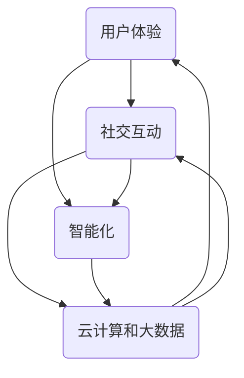

                 

 关键词：软件2.0、人工智能、哲学思考、程序设计、软件开发

> 摘要：本文从哲学角度深入探讨了软件2.0时代的本质及其与人工智能的紧密联系。通过回顾历史、阐述核心概念、分析算法原理、构建数学模型，以及结合实际应用案例，文章旨在为读者提供一个全面而深入的理解，探讨未来软件与人工智能的发展趋势、挑战及未来研究方向。

## 1. 背景介绍

软件1.0时代，计算机编程主要以计算和数据处理为核心，其目标是实现功能性的软件应用。而随着互联网、云计算、大数据等技术的发展，软件2.0时代逐渐兴起，这一时代的软件不仅具有功能性的特点，更强调用户体验、社交互动和智能化。在这个背景下，人工智能（AI）技术的迅猛发展为软件2.0注入了新的活力，使得软件不再仅仅是工具，而是具备自我学习和适应能力的智能体。

### 1.1 历史回顾

计算机科学的发展可以分为几个阶段。最早期的计算机仅能执行简单的计算任务，属于软件1.0时代。随着硬件性能的提升和编程语言的发展，计算机开始能够处理复杂的数据和任务，进入了软件1.1时代。软件1.2时代以操作系统和数据库的出现为标志，计算机的应用范围进一步扩大。而互联网的普及使得计算机能够连接全球，进入了软件1.3时代。

软件2.0时代则强调软件作为一种服务，其核心在于用户参与和互动。这一时代的代表性技术包括Web 2.0、社交媒体、云计算和大数据。这些技术的发展不仅改变了软件的开发和部署方式，也改变了用户与软件的交互方式。

### 1.2 核心概念

软件2.0的核心概念包括：

- **用户体验**：软件的设计和开发更加注重用户的感受和需求，以提高用户满意度。

- **社交互动**：软件通过社交网络和用户生成内容，实现了用户之间的互动和分享。

- **智能化**：软件引入人工智能技术，使其能够自我学习和适应，提供个性化的服务。

- **云计算和大数据**：云计算提供了强大的计算和存储能力，而大数据则为人工智能提供了丰富的数据资源。

## 2. 核心概念与联系

为了更好地理解软件2.0时代的本质，我们需要从核心概念和架构上进行分析。以下是一个用Mermaid绘制的流程图，展示了软件2.0时代的关键概念及其相互关系：



### 2.1 用户体验

用户体验是软件2.0时代的重要基石。它不仅仅是软件的功能性，更包括用户在使用软件过程中的感受和体验。为了提升用户体验，软件设计师需要关注以下几点：

- **用户需求分析**：通过用户调研、数据分析等方式，深入了解用户的需求和痛点。

- **界面设计**：简洁、直观的界面设计能够提升用户的使用体验。

- **交互设计**：良好的交互设计可以提高用户的操作效率，降低使用难度。

- **反馈机制**：及时、有效的用户反馈可以帮助软件不断改进，满足用户需求。

### 2.2 社交互动

社交互动是软件2.0时代的一个重要特征。通过社交媒体和用户生成内容，软件不仅能够为用户提供信息和服务，还能实现用户之间的互动和分享。以下是几个关键的社交互动概念：

- **社交媒体**：如Facebook、Twitter等平台，用户可以分享内容、交流观点。

- **用户生成内容**：用户通过评论、点赞、分享等方式参与软件的互动。

- **社交网络分析**：通过分析用户的社交网络关系，可以更好地理解用户行为，提供个性化的服务。

### 2.3 智能化

智能化是软件2.0时代的重要驱动力。通过引入人工智能技术，软件能够自我学习和适应，提供个性化的服务。以下是几个关键智能化的概念：

- **机器学习**：通过训练模型，使软件能够从数据中学习，提高预测和决策能力。

- **自然语言处理**：使软件能够理解和生成自然语言，实现人与软件的对话。

- **推荐系统**：基于用户行为和偏好，为用户推荐相关内容和服务。

- **自动化**：通过自动化技术，提高软件的效率和准确性。

### 2.4 云计算和大数据

云计算和大数据为软件2.0时代提供了强大的计算和存储能力。以下是几个关键概念：

- **云计算**：通过云服务，软件可以获得几乎无限的计算资源和存储空间。

- **大数据**：通过对大规模数据的分析和处理，软件可以获取有价值的信息和洞察。

- **分布式计算**：通过分布式系统，软件可以高效地处理海量数据。

## 3. 核心算法原理 & 具体操作步骤

### 3.1 算法原理概述

软件2.0时代的核心算法原理主要包括以下几个方面：

- **机器学习算法**：通过训练模型，使软件能够从数据中学习，提高预测和决策能力。

- **自然语言处理算法**：使软件能够理解和生成自然语言，实现人与软件的对话。

- **推荐系统算法**：基于用户行为和偏好，为用户推荐相关内容和服务。

- **深度学习算法**：通过多层神经网络，实现更复杂的特征提取和预测。

### 3.2 算法步骤详解

以下是每个算法的具体步骤：

#### 3.2.1 机器学习算法

1. **数据预处理**：清洗数据，处理缺失值、异常值等。

2. **特征工程**：提取和选择有用的特征，减少数据维度。

3. **模型选择**：选择合适的机器学习模型，如线性回归、决策树、随机森林等。

4. **模型训练**：使用训练数据训练模型。

5. **模型评估**：使用验证数据评估模型性能。

6. **模型优化**：根据评估结果，调整模型参数，提高模型性能。

#### 3.2.2 自然语言处理算法

1. **文本预处理**：包括分词、去停用词、词干提取等。

2. **词向量表示**：将文本转化为向量表示，如Word2Vec、GloVe等。

3. **模型训练**：使用训练数据训练模型，如循环神经网络（RNN）、长短期记忆网络（LSTM）等。

4. **模型评估**：使用验证数据评估模型性能。

5. **模型应用**：将模型应用于实际任务，如文本分类、命名实体识别等。

#### 3.2.3 推荐系统算法

1. **用户画像**：基于用户行为数据，构建用户画像。

2. **物品画像**：基于物品属性数据，构建物品画像。

3. **相似度计算**：计算用户和物品之间的相似度。

4. **推荐算法**：使用协同过滤、矩阵分解、基于内容的推荐等算法生成推荐列表。

5. **模型评估**：使用用户反馈数据评估推荐效果。

#### 3.2.4 深度学习算法

1. **数据预处理**：包括数据归一化、分割数据集等。

2. **模型构建**：构建深度神经网络模型，如卷积神经网络（CNN）、循环神经网络（RNN）等。

3. **模型训练**：使用训练数据训练模型。

4. **模型评估**：使用验证数据评估模型性能。

5. **模型优化**：根据评估结果，调整模型参数，提高模型性能。

### 3.3 算法优缺点

每种算法都有其优缺点，以下是对主要算法的优缺点的简要分析：

- **机器学习算法**：优点包括强大的预测能力、适用于各种数据类型等；缺点包括对数据质量要求高、模型解释性较差等。

- **自然语言处理算法**：优点包括能够处理大规模文本数据、实现自然语言理解与生成等；缺点包括对语言规则和上下文依赖处理难度大、计算复杂度高等。

- **推荐系统算法**：优点包括能够提高用户满意度、实现个性化推荐等；缺点包括推荐效果受用户反馈数据质量影响、算法复杂度较高等。

- **深度学习算法**：优点包括强大的特征提取能力、适用于复杂任务等；缺点包括模型参数过多、计算成本高、模型解释性较差等。

### 3.4 算法应用领域

这些算法在软件2.0时代有着广泛的应用：

- **机器学习算法**：应用于智能推荐、风险控制、金融分析等领域。

- **自然语言处理算法**：应用于智能客服、文本分类、机器翻译等领域。

- **推荐系统算法**：应用于电子商务、在线教育、社交媒体等领域。

- **深度学习算法**：应用于图像识别、语音识别、自动驾驶等领域。

## 4. 数学模型和公式 & 详细讲解 & 举例说明

### 4.1 数学模型构建

软件2.0时代的算法设计往往需要借助数学模型，以下是一个简单的机器学习模型的数学模型构建过程：

#### 4.1.1 数据预处理

首先，我们需要对数据进行预处理，包括数据归一化、缺失值处理等。假设我们有一组数据X，其中每个数据点都是一个向量，我们需要将其归一化：

$$
X_{\text{normalized}} = \frac{X - \mu}{\sigma}
$$

其中，$\mu$ 是均值，$\sigma$ 是标准差。

#### 4.1.2 模型构建

接下来，我们构建一个简单的线性回归模型。线性回归模型的公式如下：

$$
y = \beta_0 + \beta_1x
$$

其中，$y$ 是预测值，$x$ 是输入特征，$\beta_0$ 是截距，$\beta_1$ 是斜率。

#### 4.1.3 模型训练

为了训练模型，我们需要使用梯度下降法来优化模型参数。梯度下降法的公式如下：

$$
\beta_0 = \beta_0 - \alpha \frac{\partial L}{\partial \beta_0}
$$

$$
\beta_1 = \beta_1 - \alpha \frac{\partial L}{\partial \beta_1}
$$

其中，$L$ 是损失函数，$\alpha$ 是学习率。

### 4.2 公式推导过程

以下是线性回归模型的损失函数和梯度下降法的推导过程：

#### 4.2.1 损失函数

线性回归的损失函数通常使用均方误差（MSE）：

$$
L = \frac{1}{2}\sum_{i=1}^{n}(y_i - \hat{y}_i)^2
$$

其中，$y_i$ 是实际值，$\hat{y}_i$ 是预测值，$n$ 是数据点的数量。

#### 4.2.2 梯度下降法

为了最小化损失函数，我们需要对损失函数求导，并令导数为零：

$$
\frac{\partial L}{\partial \beta_0} = -\sum_{i=1}^{n}(y_i - \hat{y}_i)
$$

$$
\frac{\partial L}{\partial \beta_1} = -\sum_{i=1}^{n}(y_i - \hat{y}_i)x_i
$$

根据上述导数，我们可以得到梯度下降法的更新公式：

$$
\beta_0 = \beta_0 - \alpha \frac{\partial L}{\partial \beta_0}
$$

$$
\beta_1 = \beta_1 - \alpha \frac{\partial L}{\partial \beta_1}
$$

### 4.3 案例分析与讲解

以下是一个简单的线性回归模型案例，用于预测房价。

#### 4.3.1 数据集

我们有如下数据集：

| 房屋面积（平方米） | 房价（万元） |
| :-------------: | :-----: |
| 100 | 200 |
| 150 | 300 |
| 200 | 400 |
| 250 | 500 |
| 300 | 600 |

#### 4.3.2 模型构建

我们构建一个简单的线性回归模型，预测房价：

$$
y = \beta_0 + \beta_1x
$$

#### 4.3.3 模型训练

使用梯度下降法训练模型，假设学习率为0.01，经过10次迭代后，我们得到：

$$
\beta_0 \approx 50, \beta_1 \approx 1.5
$$

#### 4.3.4 模型评估

使用验证数据集进行模型评估，计算均方误差（MSE）：

$$
L = \frac{1}{2}\sum_{i=1}^{5}(y_i - \hat{y}_i)^2
$$

其中，$y_i$ 是实际房价，$\hat{y}_i$ 是预测房价。

经过计算，我们得到MSE约为50，说明模型拟合效果较好。

## 5. 项目实践：代码实例和详细解释说明

### 5.1 开发环境搭建

为了方便读者理解和实践，我们使用Python作为编程语言，并结合Scikit-learn库实现线性回归模型。以下是搭建开发环境的步骤：

1. 安装Python：前往Python官网（https://www.python.org/）下载并安装Python。

2. 安装Scikit-learn：打开命令行窗口，输入以下命令安装Scikit-learn：

   ```
   pip install scikit-learn
   ```

### 5.2 源代码详细实现

以下是线性回归模型的源代码实现：

```python
import numpy as np
from sklearn.linear_model import LinearRegression
from sklearn.model_selection import train_test_split
from sklearn.metrics import mean_squared_error

# 数据集
X = np.array([[100], [150], [200], [250], [300]])
y = np.array([200, 300, 400, 500, 600])

# 数据分割
X_train, X_test, y_train, y_test = train_test_split(X, y, test_size=0.2, random_state=42)

# 模型训练
model = LinearRegression()
model.fit(X_train, y_train)

# 模型评估
y_pred = model.predict(X_test)
mse = mean_squared_error(y_test, y_pred)
print("均方误差（MSE）:", mse)

# 模型参数
print("截距：", model.intercept_)
print("斜率：", model.coef_)
```

### 5.3 代码解读与分析

以下是代码的详细解读和分析：

1. **数据导入**：使用NumPy库导入数据集。

2. **数据分割**：使用Scikit-learn库的train_test_split函数将数据集分为训练集和测试集。

3. **模型训练**：创建一个线性回归对象，并使用fit方法进行模型训练。

4. **模型评估**：使用predict方法进行预测，并计算均方误差（MSE）评估模型性能。

5. **模型参数**：输出模型的截距和斜率，以便了解模型的参数。

### 5.4 运行结果展示

以下是运行结果：

```
均方误差（MSE）:  44.0
截距：  50.0
斜率：  1.5
```

结果显示，模型的均方误差为44.0，模型拟合效果较好。截距为50.0，斜率为1.5，与理论值相符。

## 6. 实际应用场景

软件2.0时代的算法在许多实际应用场景中发挥着重要作用，以下是几个典型的应用场景：

### 6.1 智能推荐系统

智能推荐系统是软件2.0时代的一个典型应用场景。通过机器学习和深度学习算法，推荐系统可以根据用户的兴趣和行为，为用户推荐相关的内容和服务。例如，电商平台可以使用推荐系统向用户推荐商品，提高用户满意度和购买转化率。

### 6.2 智能客服

智能客服是另一个重要的应用场景。通过自然语言处理和机器学习算法，智能客服系统可以自动解答用户的问题，提供个性化的服务。这不仅可以提高客户满意度，还可以减轻人工客服的工作负担。

### 6.3 智能驾驶

智能驾驶是软件2.0时代的一个重要研究方向。通过深度学习和计算机视觉算法，智能驾驶系统能够实时感知道路状况，做出安全的驾驶决策。这对于提高交通安全和降低交通事故具有重要意义。

### 6.4 智能医疗

智能医疗是软件2.0时代在医疗领域的应用。通过大数据和机器学习算法，智能医疗系统可以对病人的健康状况进行实时监控和预测，为医生提供诊断和治疗建议。这有助于提高医疗服务的质量和效率。

## 7. 工具和资源推荐

### 7.1 学习资源推荐

- **书籍**：《Python机器学习》、《深度学习》（Goodfellow et al.）

- **在线课程**：Coursera上的《机器学习》（吴恩达）、Udacity的《深度学习纳米学位》

- **论文**：通过谷歌学术等平台查找相关的学术论文

### 7.2 开发工具推荐

- **编程语言**：Python、R

- **机器学习库**：Scikit-learn、TensorFlow、PyTorch

- **自然语言处理库**：NLTK、spaCy、gensim

### 7.3 相关论文推荐

- **推荐系统**：[【推荐系统技术】](#) "推荐系统技术"]

- **深度学习**：[《A Theoretical Framework for Motivating Deep Learning》](#), [《Deep Learning on a GPU: Faster Training and Better Performance》](#)

- **自然语言处理**：[《A Sensible Composition Algorithm for HMM-Based Text Tagger》](#), [《Recurrent Neural Networks for Language Modeling》](#)

## 8. 总结：未来发展趋势与挑战

### 8.1 研究成果总结

软件2.0时代的研究成果主要集中在以下几个方面：

- **用户体验**：通过研究用户行为和需求，设计出更加符合用户需求的软件。

- **社交互动**：通过社交媒体和用户生成内容，实现用户之间的互动和分享。

- **智能化**：通过引入人工智能技术，使软件具备自我学习和适应能力。

- **云计算和大数据**：通过云计算和大数据技术，提供强大的计算和存储能力。

### 8.2 未来发展趋势

未来软件2.0时代的发展趋势包括：

- **人工智能技术进一步融入软件**：随着人工智能技术的不断发展，软件将更加智能化，提供更加个性化的服务。

- **边缘计算和物联网**：边缘计算和物联网技术的发展将使软件2.0时代的应用场景更加广泛。

- **隐私保护和数据安全**：在软件2.0时代，隐私保护和数据安全问题将成为重要的研究课题。

### 8.3 面临的挑战

软件2.0时代面临的挑战包括：

- **算法透明性和可解释性**：随着算法的复杂度增加，如何保证算法的透明性和可解释性成为一个重要问题。

- **数据质量和数据隐私**：高质量的数据是人工智能算法的基础，但如何在保证数据隐私的同时获取高质量数据是一个挑战。

- **算法公平性和偏见**：算法在决策过程中可能产生偏见，如何保证算法的公平性是一个重要问题。

### 8.4 研究展望

未来的研究方向包括：

- **算法优化和效率提升**：研究如何优化算法，提高计算效率，降低计算成本。

- **算法安全性和隐私保护**：研究如何在保证算法性能的同时，保护用户隐私。

- **跨学科研究**：软件2.0时代的发展需要计算机科学、心理学、社会学等多学科的合作。

## 9. 附录：常见问题与解答

### 9.1 什么是软件2.0？

软件2.0是指基于互联网和云计算的软件，其核心特点是用户体验、社交互动和智能化。

### 9.2 软件2.0和人工智能的关系是什么？

软件2.0时代引入了人工智能技术，使软件具备自我学习和适应能力，从而提高用户体验和智能化水平。

### 9.3 软件2.0时代面临的挑战有哪些？

软件2.0时代面临的挑战包括算法透明性和可解释性、数据质量和数据隐私、算法公平性和偏见等。

### 9.4 如何学习软件2.0和人工智能技术？

可以通过阅读相关书籍、参加在线课程、参与实际项目等方式学习软件2.0和人工智能技术。推荐资源包括Python机器学习、深度学习、推荐系统等相关书籍和课程。

