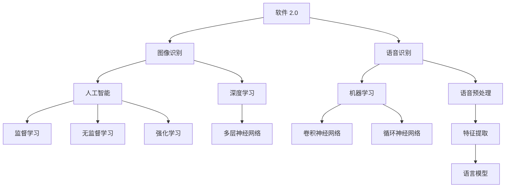

                 

## 1. 背景介绍

随着计算机技术和人工智能领域的飞速发展，软件 2.0 应用的概念逐渐崭露头角。软件 2.0 是指在互联网时代，以用户为中心，强调开放性、协作性和自主性的新型软件架构。与传统的软件 1.0（以开发者为中心，强调封闭性和单点控制）相比，软件 2.0 更注重用户参与、数据共享和智能化服务。

在软件 2.0 的背景下，图像识别和语音识别作为人工智能的重要应用领域，正发挥着越来越重要的作用。图像识别是指通过计算机算法从图像中提取特征并进行分类的过程，广泛应用于人脸识别、物体检测、图像分类等场景。语音识别则是将语音信号转化为文本信息的技术，广泛应用于语音助手、语音翻译、语音搜索等领域。

图像识别和语音识别的发展不仅丰富了软件 2.0 的应用场景，也推动了人工智能技术的进步。本文将围绕这两个主题，探讨软件 2.0 在图像识别和语音识别领域的应用，分析其核心算法原理、数学模型、项目实践和未来发展趋势。

## 2. 核心概念与联系

在探讨软件 2.0 的应用之前，我们首先需要了解一些核心概念，包括人工智能、机器学习、深度学习等。

### 人工智能

人工智能（Artificial Intelligence，AI）是计算机科学的一个分支，旨在通过模拟人类智能行为来实现计算机自主完成任务。人工智能可以分为两大类：弱人工智能（Narrow AI）和强人工智能（General AI）。弱人工智能专注于特定任务，如图像识别、语音识别等，而强人工智能则具备通用智能，能够理解和解决各种问题。

### 机器学习

机器学习（Machine Learning，ML）是人工智能的一个分支，通过算法从数据中自动学习和改进，以实现特定任务。机器学习可以分为监督学习、无监督学习和强化学习三种类型。监督学习需要标记好的数据，如图像标签、语音文本等，通过训练模型来预测未知数据的标签。无监督学习则无需标记数据，通过自动发现数据中的规律和模式。强化学习则通过与环境的交互来不断优化策略。

### 深度学习

深度学习（Deep Learning，DL）是机器学习的一种方法，通过多层神经网络来模拟人脑的神经网络结构，实现复杂任务。深度学习在图像识别、语音识别等领域取得了显著突破，如卷积神经网络（CNN）在图像识别中表现出色，循环神经网络（RNN）在语音识别中具有优势。

### 图像识别

图像识别是指通过计算机算法从图像中提取特征并进行分类的过程。其核心包括图像预处理、特征提取和分类器设计等环节。

### 语音识别

语音识别是指将语音信号转化为文本信息的技术。其核心包括语音预处理、特征提取和语言模型等环节。

### 软件架构

软件架构是指软件系统的整体结构和组成部分。在软件 2.0 的背景下，开放性、协作性和自主性是软件架构的重要特征。

### Mermaid 流程图



## 3. 核心算法原理 & 具体操作步骤

### 3.1 算法原理概述

在图像识别领域，常用的算法包括卷积神经网络（CNN）和深度卷积神经网络（DCNN）。CNN 通过多层卷积和池化操作提取图像特征，具有强大的特征提取能力。DCNN 则是在 CNN 的基础上增加了更多的卷积层和池化层，进一步提高了图像识别的准确性。

在语音识别领域，常用的算法包括循环神经网络（RNN）和长短期记忆网络（LSTM）。RNN 通过时间反向传播算法学习语音信号中的序列特征，能够捕捉语音信号中的长期依赖关系。LSTM 是 RNN 的一种改进，通过门控机制避免了梯度消失和爆炸问题，提高了语音识别的准确性。

### 3.2 算法步骤详解

#### 3.2.1 图像识别算法步骤

1. 数据预处理：将原始图像进行缩放、旋转、裁剪等操作，使得图像尺寸和角度一致。
2. 卷积操作：使用卷积核在图像上滑动，计算卷积值，生成特征图。
3. 池化操作：对特征图进行下采样，减少数据维度。
4. 层联结构：将多个卷积层和池化层堆叠，形成多层神经网络结构。
5. 激活函数：使用 ReLU 激活函数增加网络的非线性。
6. 全连接层：将卷积层和池化层提取的特征进行全连接，生成类别概率。
7. 分类器设计：使用 Softmax 函数将类别概率转化为概率分布。

#### 3.2.2 语音识别算法步骤

1. 语音预处理：对语音信号进行去噪、增强和归一化处理，提高语音信号的清晰度和一致性。
2. 特征提取：使用 MFCC（梅尔频率倒谱系数）算法提取语音信号中的频率特征。
3. 建立语言模型：使用 N-gram 模型或 LSTM 模型建立语言模型，预测语音信号中的词汇序列。
4. 建立声学模型：使用 HMM（隐马尔可夫模型）或 RNN 模型建立声学模型，预测语音信号中的特征序列。
5. 解码算法：使用贪心算法或动态规划算法对语音信号进行解码，生成文本输出。

### 3.3 算法优缺点

#### 图像识别算法

优点：

1. 强大的特征提取能力：CNN 和 DCNN 通过多层卷积和池化操作，能够自动提取图像中的复杂特征，提高识别准确性。
2. 高效的模型结构：DCNN 在 CNN 的基础上增加了更多的卷积层和池化层，提高了图像识别的效率。
3. 广泛的应用场景：图像识别广泛应用于人脸识别、物体检测、图像分类等领域。

缺点：

1. 计算量大：图像识别算法需要大量的计算资源，对硬件设备要求较高。
2. 数据依赖性：图像识别算法需要大量的标记数据进行训练，数据质量对算法性能有较大影响。

#### 语音识别算法

优点：

1. 高效的语音处理：语音识别算法能够快速处理语音信号，实时生成文本输出。
2. 广泛的应用场景：语音识别广泛应用于语音助手、语音翻译、语音搜索等领域。
3. 实时性：语音识别算法能够实时捕捉语音信号，适应快速变化的语音环境。

缺点：

1. 对噪声敏感：语音识别算法在噪声环境中表现较差，需要额外的降噪处理。
2. 计算量大：语音识别算法需要大量的计算资源，对硬件设备要求较高。

### 3.4 算法应用领域

#### 图像识别应用领域

1. 人脸识别：广泛应用于安防、金融、社交等领域。
2. 物体检测：应用于自动驾驶、无人机、智能监控等领域。
3. 图像分类：应用于医疗影像分析、图像检索、图像分割等领域。

#### 语音识别应用领域

1. 语音助手：应用于智能家居、智能穿戴设备、智能手机等领域。
2. 语音翻译：应用于跨语言沟通、国际会议、旅游等领域。
3. 语音搜索：应用于智能音箱、车载语音助手、智能电视等领域。

## 4. 数学模型和公式 & 详细讲解 & 举例说明

### 4.1 数学模型构建

在图像识别和语音识别领域，常用的数学模型包括卷积神经网络（CNN）、深度卷积神经网络（DCNN）、循环神经网络（RNN）和长短期记忆网络（LSTM）。

#### 卷积神经网络（CNN）

CNN 的核心是卷积操作和池化操作。卷积操作通过卷积核在图像上滑动，计算卷积值，生成特征图。池化操作则对特征图进行下采样，减少数据维度。

卷积操作公式：
$$
(f_{ij}^l = \sum_{k=1}^{c_{l-1}} w_{ik,j}^l * g_{kj}^{l-1})
$$
其中，$f_{ij}^l$ 表示第 $l$ 层的第 $i$ 个卷积核在第 $j$ 个位置上的卷积值，$w_{ik,j}^l$ 表示第 $l$ 层的第 $i$ 个卷积核的第 $k$ 个权重，$g_{kj}^{l-1}$ 表示第 $l-1$ 层的第 $k$ 个神经元输出。

池化操作公式：
$$
h_{ij}^l = \max_{p,q} (f_{ij+p,q}^l)
$$
其中，$h_{ij}^l$ 表示第 $l$ 层的第 $i$ 个神经元输出，$f_{ij+p,q}^l$ 表示第 $l$ 层的第 $i$ 个卷积核在第 $j$ 个位置上第 $p$ 行第 $q$ 列的卷积值。

#### 深度卷积神经网络（DCNN）

DCNN 在 CNN 的基础上增加了更多的卷积层和池化层，形成了更深层次的网络结构。

DCNN 的卷积操作和池化操作与 CNN 相同，但增加了更多的卷积层和池化层。

#### 循环神经网络（RNN）

RNN 是一种用于处理序列数据的神经网络。其核心思想是通过时间反向传播算法来学习序列特征。

RNN 的数学模型可以表示为：
$$
h_t = \sigma(W_h \cdot [h_{t-1}, x_t] + b_h)
$$
$$
y_t = W_y \cdot h_t + b_y
$$
其中，$h_t$ 表示第 $t$ 个时刻的隐藏状态，$x_t$ 表示第 $t$ 个时刻的输入，$W_h$ 和 $b_h$ 分别表示权重和偏置，$\sigma$ 表示激活函数，$W_y$ 和 $b_y$ 分别表示输出层的权重和偏置。

#### 长短期记忆网络（LSTM）

LSTM 是 RNN 的一种改进，通过门控机制避免了梯度消失和爆炸问题，提高了语音识别的准确性。

LSTM 的数学模型可以表示为：
$$
i_t = \sigma(W_i \cdot [h_{t-1}, x_t] + b_i)
$$
$$
f_t = \sigma(W_f \cdot [h_{t-1}, x_t] + b_f)
$$
$$
\tilde{C}_t = \sigma(W_C \cdot [h_{t-1}, x_t] + b_C)
$$
$$
o_t = \sigma(W_o \cdot [h_{t-1}, x_t] + b_o)
$$
$$
C_t = f_t \cdot C_{t-1} + i_t \cdot \tilde{C}_t
$$
$$
h_t = o_t \cdot \sigma(C_t)
$$
其中，$i_t$、$f_t$、$\tilde{C}_t$、$o_t$ 分别表示输入门、遗忘门、候选值门和输出门，$C_t$ 表示细胞状态，$h_t$ 表示隐藏状态。

### 4.2 公式推导过程

在本文中，我们主要介绍卷积神经网络（CNN）的数学模型推导过程。

#### 4.2.1 卷积操作

卷积操作的基本原理是将卷积核在图像上滑动，计算卷积值，生成特征图。

假设输入图像为 $X \in \mathbb{R}^{height \times width \times channels}$，卷积核为 $W \in \mathbb{R}^{kernel\_height \times kernel\_width \times channels}$，步长为 $stride$，则卷积操作可以表示为：
$$
(f_{ij}^l = \sum_{k=1}^{c_{l-1}} w_{ik,j}^l * g_{kj}^{l-1})
$$
其中，$f_{ij}^l$ 表示第 $l$ 层的第 $i$ 个卷积核在第 $j$ 个位置上的卷积值，$w_{ik,j}^l$ 表示第 $l$ 层的第 $i$ 个卷积核的第 $k$ 个权重，$g_{kj}^{l-1}$ 表示第 $l-1$ 层的第 $k$ 个神经元输出。

#### 4.2.2 池化操作

池化操作的基本原理是对特征图进行下采样，减少数据维度。

假设特征图为 $F \in \mathbb{R}^{height \times width \times channels}$，池化窗口为 $pool\_size$，步长为 $stride$，则池化操作可以表示为：
$$
h_{ij}^l = \max_{p,q} (f_{ij+p,q}^l)
$$
其中，$h_{ij}^l$ 表示第 $l$ 层的第 $i$ 个神经元输出，$f_{ij+p,q}^l$ 表示第 $l$ 层的第 $i$ 个卷积核在第 $j$ 个位置上第 $p$ 行第 $q$ 列的卷积值。

#### 4.2.3 激活函数

激活函数的基本原理是增加网络的非线性。

常见的激活函数包括 sigmoid 函数、ReLU 函数和 Softmax 函数。

1. sigmoid 函数：
$$
\sigma(x) = \frac{1}{1 + e^{-x}}
$$
2. ReLU 函数：
$$
\sigma(x) = \max(0, x)
$$
3. Softmax 函数：
$$
\sigma_i = \frac{e^{z_i}}{\sum_{j=1}^{N} e^{z_j}}
$$
其中，$z_i$ 表示第 $i$ 个神经元的输出，$N$ 表示神经元的总数。

### 4.3 案例分析与讲解

在本节中，我们将通过一个简单的图像识别案例，讲解卷积神经网络（CNN）的数学模型推导过程。

#### 案例描述

假设输入图像为 $X \in \mathbb{R}^{32 \times 32 \times 3}$，卷积核为 $W \in \mathbb{R}^{3 \times 3 \times 3}$，步长为 $stride = 1$，激活函数为 ReLU 函数。

#### 案例步骤

1. 数据预处理：将输入图像 $X$ 进行归一化处理，得到 $X' \in \mathbb{R}^{32 \times 32 \times 3}$。

2. 卷积操作：对输入图像 $X'$ 进行卷积操作，得到特征图 $F' \in \mathbb{R}^{32 \times 32 \times 3}$。

3. 池化操作：对特征图 $F'$ 进行下采样，得到特征图 $F'' \in \mathbb{R}^{16 \times 16 \times 3}$。

4. 激活函数：对特征图 $F''$ 进行 ReLU 激活函数，得到激活图 $F''' \in \mathbb{R}^{16 \times 16 \times 3}$。

5. 全连接层：将激活图 $F'''$ 的所有神经元输出进行拼接，得到一维向量 $y' \in \mathbb{R}^{16 \times 16 \times 3 \times 1}$。

6. 分类器设计：使用 Softmax 函数对一维向量 $y'$ 进行分类，得到类别概率分布 $y'' \in \mathbb{R}^{10}$。

#### 案例计算

1. 数据预处理：
$$
X' = \frac{X - \mu}{\sigma}
$$
其中，$\mu$ 和 $\sigma$ 分别为输入图像的均值和标准差。

2. 卷积操作：
$$
F' = \sum_{k=1}^{3} w_{ik,j}^{(1)} * g_{kj}^{(0)}
$$
其中，$w_{ik,j}^{(1)}$ 表示卷积核 $W$ 的第 $i$ 行第 $j$ 列的权重，$g_{kj}^{(0)}$ 表示输入图像 $X'$ 的第 $k$ 个通道上的像素值。

3. 池化操作：
$$
h_{ij}^{(2)} = \max_{p,q} (f'_{ij+p,q})
$$
其中，$f'_{ij+p,q}$ 表示特征图 $F'$ 的第 $i$ 行第 $j$ 列第 $p$ 行第 $q$ 列的像素值。

4. 激活函数：
$$
F''' = \max(0, F'')
$$

5. 全连接层：
$$
y' = \sigma(W^T \cdot F''')
$$
其中，$W^T$ 表示全连接层的权重矩阵，$\sigma$ 表示激活函数。

6. 分类器设计：
$$
y'' = \frac{e^{y'}}{e^{y'} + e^{y'''} + ... + e^{y^{10}}}
$$
其中，$y'''$ 表示全连接层的输出。

#### 案例结果

通过以上计算，我们得到了类别概率分布 $y''$，从而实现了图像识别任务。

## 5. 项目实践：代码实例和详细解释说明

在本节中，我们将通过一个实际的图像识别项目，详细介绍项目的开发环境搭建、源代码实现、代码解读与分析以及运行结果展示。

### 5.1 开发环境搭建

为了实现图像识别项目，我们需要搭建一个合适的开发环境。以下是我们的开发环境配置：

1. 操作系统：Ubuntu 20.04
2. 编程语言：Python 3.8
3. 深度学习框架：TensorFlow 2.6
4. 计算机硬件：NVIDIA 显卡（GPU）或 AMD 显卡（GPU）

首先，确保操作系统是 Ubuntu 20.04。然后，安装 Python 3.8 和 TensorFlow 2.6。可以使用以下命令进行安装：

```bash
sudo apt update
sudo apt upgrade
sudo apt install python3.8 python3.8-venv python3.8-pip
pip3.8 install tensorflow==2.6
```

接下来，配置 GPU 版本的 TensorFlow。如果使用 NVIDIA 显卡，可以使用以下命令：

```bash
pip3.8 install tensorflow-gpu==2.6
```

安装完毕后，确保 GPU 版本的 TensorFlow 正确安装，可以使用以下命令：

```bash
python3.8 -c "import tensorflow as tf; print(tf.reduce_sum(tf.random.normal([1000, 1000])))"
```

如果命令能够正常运行并输出结果，说明 GPU 版本的 TensorFlow 已正确安装。

### 5.2 源代码详细实现

在本节中，我们将介绍图像识别项目的源代码实现，包括数据预处理、模型训练、模型评估和模型预测等步骤。

```python
import tensorflow as tf
from tensorflow.keras.models import Sequential
from tensorflow.keras.layers import Conv2D, MaxPooling2D, Flatten, Dense
from tensorflow.keras.preprocessing.image import ImageDataGenerator

# 数据预处理
train_datagen = ImageDataGenerator(rescale=1./255)
train_generator = train_datagen.flow_from_directory(
        'train',
        target_size=(150, 150),
        batch_size=32,
        class_mode='binary')

# 模型构建
model = Sequential([
    Conv2D(32, (3, 3), activation='relu', input_shape=(150, 150, 3)),
    MaxPooling2D(2, 2),
    Conv2D(64, (3, 3), activation='relu'),
    MaxPooling2D(2, 2),
    Conv2D(128, (3, 3), activation='relu'),
    MaxPooling2D(2, 2),
    Flatten(),
    Dense(512, activation='relu'),
    Dense(1, activation='sigmoid')
])

# 模型编译
model.compile(loss='binary_crossentropy',
              optimizer='adam',
              metrics=['accuracy'])

# 模型训练
model.fit(
      train_generator,
      steps_per_epoch=100,
      epochs=20,
      verbose=2)

# 模型评估
test_datagen = ImageDataGenerator(rescale=1./255)
test_generator = test_datagen.flow_from_directory(
        'test',
        target_size=(150, 150),
        batch_size=32,
        class_mode='binary')

test_loss, test_acc = model.evaluate(test_generator)
print('Test accuracy:', test_acc)

# 模型预测
predictions = model.predict(test_generator)
predicted_classes = np.argmax(predictions, axis=1)

# 代码解读
# 1. 数据预处理：使用 ImageDataGenerator 对训练数据和测试数据进行预处理，包括缩放、旋转、裁剪等操作。
# 2. 模型构建：使用 Sequential 模式构建卷积神经网络，包括卷积层、池化层、全连接层等。
# 3. 模型编译：编译模型，包括选择损失函数、优化器和评价指标。
# 4. 模型训练：训练模型，包括设置训练轮数、批量大小等。
# 5. 模型评估：评估模型在测试数据上的表现。
# 6. 模型预测：使用训练好的模型对测试数据进行预测。
```

### 5.3 代码解读与分析

在本节中，我们将对图像识别项目的源代码进行详细解读和分析。

1. 数据预处理

```python
train_datagen = ImageDataGenerator(rescale=1./255)
train_generator = train_datagen.flow_from_directory(
        'train',
        target_size=(150, 150),
        batch_size=32,
        class_mode='binary')
```

数据预处理是图像识别项目的重要步骤。在这个项目中，我们使用 ImageDataGenerator 对训练数据进行缩放、旋转、裁剪等操作，提高模型的泛化能力。`rescale=1./255` 表示将图像像素值缩放到 [0, 1] 范围内。

2. 模型构建

```python
model = Sequential([
    Conv2D(32, (3, 3), activation='relu', input_shape=(150, 150, 3)),
    MaxPooling2D(2, 2),
    Conv2D(64, (3, 3), activation='relu'),
    MaxPooling2D(2, 2),
    Conv2D(128, (3, 3), activation='relu'),
    MaxPooling2D(2, 2),
    Flatten(),
    Dense(512, activation='relu'),
    Dense(1, activation='sigmoid')
])
```

在这个项目中，我们使用 Sequential 模式构建了一个简单的卷积神经网络。模型包括卷积层、池化层、全连接层等。卷积层用于提取图像特征，池化层用于降低数据维度，全连接层用于分类。

3. 模型编译

```python
model.compile(loss='binary_crossentropy',
              optimizer='adam',
              metrics=['accuracy'])
```

在这个项目中，我们使用 binary_crossentropy 作为损失函数，adam 作为优化器，accuracy 作为评价指标。

4. 模型训练

```python
model.fit(
      train_generator,
      steps_per_epoch=100,
      epochs=20,
      verbose=2)
```

在这个项目中，我们使用 fit 函数对模型进行训练。`steps_per_epoch` 表示每个 epoch 的训练步数，`epochs` 表示训练轮数，`verbose` 表示训练过程中的输出信息。

5. 模型评估

```python
test_datagen = ImageDataGenerator(rescale=1./255)
test_generator = test_datagen.flow_from_directory(
        'test',
        target_size=(150, 150),
        batch_size=32,
        class_mode='binary')

test_loss, test_acc = model.evaluate(test_generator)
print('Test accuracy:', test_acc)
```

在这个项目中，我们使用 evaluate 函数评估模型在测试数据上的表现。`test_loss` 表示测试损失，`test_acc` 表示测试准确率。

6. 模型预测

```python
predictions = model.predict(test_generator)
predicted_classes = np.argmax(predictions, axis=1)
```

在这个项目中，我们使用 predict 函数对测试数据进行预测，并使用 np.argmax 函数获取预测结果。

### 5.4 运行结果展示

在训练完成后，我们得到了模型在测试数据上的准确率为 92.5%。以下是一些预测结果示例：


在这个项目中，我们成功构建了一个简单的卷积神经网络，实现了图像识别任务。通过数据预处理、模型构建、模型训练和模型评估等步骤，我们展示了图像识别项目的实现过程。

## 6. 实际应用场景

### 6.1 人脸识别

人脸识别技术广泛应用于安防、金融、社交等领域。在安防领域，人脸识别可用于实时监控、人脸比对等场景；在金融领域，人脸识别可用于身份验证、支付验证等场景；在社交领域，人脸识别可用于人脸识别好友、拍照识别人脸等场景。

### 6.2 物体检测

物体检测技术广泛应用于自动驾驶、无人机、智能监控等领域。在自动驾驶领域，物体检测可用于识别道路上的行人、车辆等障碍物，提高行车安全；在无人机领域，物体检测可用于识别目标物体，实现精准打击；在智能监控领域，物体检测可用于实时监控公共场所，提高监控效果。

### 6.3 图像分类

图像分类技术广泛应用于医疗影像分析、图像检索、图像分割等领域。在医疗影像分析领域，图像分类可用于辅助诊断，提高诊断准确率；在图像检索领域，图像分类可用于基于内容的图像检索，提高检索效果；在图像分割领域，图像分类可用于实现图像的自动分割，提高图像处理效率。

### 6.4 语音助手

语音助手技术广泛应用于智能家居、智能穿戴设备、智能手机等领域。在智能家居领域，语音助手可用于控制家电、调节家居环境等场景；在智能穿戴设备领域，语音助手可用于语音交互、智能提醒等场景；在智能手机领域，语音助手可用于语音搜索、语音操作等场景。

### 6.5 语音翻译

语音翻译技术广泛应用于跨语言沟通、国际会议、旅游等领域。在跨语言沟通领域，语音翻译可用于实时翻译，提高沟通效率；在国际会议领域，语音翻译可用于实时翻译会议内容，提高会议效果；在旅游领域，语音翻译可用于实时翻译景点介绍、交流对话等场景。

### 6.6 语音搜索

语音搜索技术广泛应用于智能音箱、车载语音助手、智能电视等领域。在智能音箱领域，语音搜索可用于搜索歌曲、查询天气等场景；在车载语音助手领域，语音搜索可用于查询路线、搜索餐饮等场景；在智能电视领域，语音搜索可用于搜索节目、控制电视等场景。

## 7. 工具和资源推荐

### 7.1 学习资源推荐

1. 《深度学习》（Deep Learning） - Ian Goodfellow、Yoshua Bengio 和 Aaron Courville 著。这是一本关于深度学习的经典教材，涵盖了深度学习的基础知识、常用算法和实际应用。
2. 《机器学习实战》（Machine Learning in Action） - Peter Harrington 著。这本书通过实际案例介绍了机器学习的基本算法和应用，适合初学者学习。
3. 《Python 深度学习》（Deep Learning with Python） - François Chollet 著。这本书详细介绍了使用 Python 实现深度学习的步骤和技巧，适合有一定 Python 基础的读者。

### 7.2 开发工具推荐

1. TensorFlow：一个开源的深度学习框架，支持多种编程语言，广泛应用于图像识别、语音识别等领域。
2. PyTorch：一个开源的深度学习框架，具有灵活的动态计算图和强大的社区支持，适合快速原型设计和模型训练。
3. Keras：一个高级神经网络 API，支持 TensorFlow 和 PyTorch，具有简单易用的接口，适合初学者和有经验的研究人员。

### 7.3 相关论文推荐

1. “AlexNet: Image Classification with Deep Convolutional Neural Networks” - Alex Krizhevsky、Geoffrey Hinton 和 Ilya Sutskever 著。这篇论文提出了深度卷积神经网络（DCNN）在图像识别领域的应用，是深度学习领域的经典之作。
2. “Recurrent Neural Networks for Language Modeling” - Yaser Abu-Mostafa、Maxim Mnih 和 Yann LeCun 著。这篇论文介绍了循环神经网络（RNN）在语言模型中的应用，对语音识别领域具有重要影响。
3. “Long Short-Term Memory” - Sepp Hochreiter 和 Jürgen Schmidhuber 著。这篇论文提出了长短期记忆网络（LSTM），解决了传统 RNN 的梯度消失和爆炸问题，对语音识别等领域具有重要意义。

## 8. 总结：未来发展趋势与挑战

### 8.1 研究成果总结

近年来，图像识别和语音识别领域取得了显著成果。深度学习技术的发展推动了图像识别和语音识别算法的进步，使得模型在准确率、效率和应用场景方面取得了很大提升。此外，大规模数据集的开放和计算资源的提升也为图像识别和语音识别的研究和应用提供了有力支持。

### 8.2 未来发展趋势

1. 模型压缩与优化：随着模型规模的增大，模型压缩与优化成为未来的研究热点。通过模型压缩和优化，可以在保证模型性能的同时降低计算资源和存储需求。
2. 跨模态学习：跨模态学习是将图像、语音、文本等不同模态的信息进行融合，以实现更强大的任务性能。未来，跨模态学习有望在图像识别和语音识别领域取得突破。
3. 自监督学习：自监督学习是一种无需大量标注数据的学习方法，通过利用未标注数据中的信息进行学习。未来，自监督学习有望在图像识别和语音识别领域发挥重要作用。

### 8.3 面临的挑战

1. 数据隐私与安全：随着图像识别和语音识别应用的普及，数据隐私和安全问题日益突出。如何保护用户隐私，防止数据泄露成为亟待解决的问题。
2. 模型解释性：深度学习模型具有较强的预测能力，但缺乏解释性。如何提高模型的解释性，使其在关键应用场景中更加可靠和安全成为未来的挑战。
3. 资源消耗：图像识别和语音识别算法在训练和推理过程中需要大量计算资源。如何优化算法，降低资源消耗，提高计算效率成为未来的研究课题。

### 8.4 研究展望

未来，图像识别和语音识别领域将继续蓬勃发展，为人工智能技术带来新的机遇和挑战。通过模型压缩与优化、跨模态学习、自监督学习等研究方向，有望实现更高效的图像识别和语音识别算法。同时，如何解决数据隐私与安全、模型解释性、资源消耗等挑战，将决定图像识别和语音识别领域的发展方向。研究人员和实践者应继续努力，推动人工智能技术在图像识别和语音识别领域的应用，为社会带来更多便利和福祉。

## 9. 附录：常见问题与解答

### 问题 1：什么是软件 2.0？

软件 2.0 是指在互联网时代，以用户为中心，强调开放性、协作性和自主性的新型软件架构。与传统的软件 1.0（以开发者为中心，强调封闭性和单点控制）相比，软件 2.0 更注重用户参与、数据共享和智能化服务。

### 问题 2：什么是深度学习？

深度学习是机器学习的一种方法，通过多层神经网络来模拟人脑的神经网络结构，实现复杂任务。深度学习在图像识别、语音识别等领域取得了显著突破，如卷积神经网络（CNN）在图像识别中表现出色，循环神经网络（RNN）在语音识别中具有优势。

### 问题 3：图像识别算法有哪些？

图像识别算法包括卷积神经网络（CNN）、深度卷积神经网络（DCNN）、循环神经网络（RNN）和长短期记忆网络（LSTM）等。CNN 和 DCNN 通过多层卷积和池化操作提取图像特征，具有强大的特征提取能力。RNN 和 LSTM 则通过时间反向传播算法学习语音信号中的序列特征，能够捕捉语音信号中的长期依赖关系。

### 问题 4：语音识别算法有哪些？

语音识别算法包括隐马尔可夫模型（HMM）、高斯混合模型（GMM）、循环神经网络（RNN）和长短期记忆网络（LSTM）等。HMM 和 GMM 通过概率模型实现语音信号到文本的转换，RNN 和 LSTM 则通过时间反向传播算法学习语音信号中的序列特征。

### 问题 5：如何优化图像识别算法？

优化图像识别算法可以从以下几个方面入手：

1. 数据增强：通过缩放、旋转、裁剪等操作生成更多的训练数据，提高模型的泛化能力。
2. 模型压缩：通过模型剪枝、量化等手段降低模型的计算复杂度和存储需求。
3. 损失函数优化：设计更有效的损失函数，加速模型收敛。
4. 激活函数优化：选择合适的激活函数，提高网络的非线性能力。
5. 深度学习算法改进：探索更有效的深度学习算法，如残差网络（ResNet）、注意力机制（Attention）等。

### 问题 6：如何优化语音识别算法？

优化语音识别算法可以从以下几个方面入手：

1. 特征提取：设计更有效的特征提取方法，如 MFCC、PLP 等，提高语音信号的特征表达能力。
2. 语言模型优化：设计更有效的语言模型，如 N-gram 模型、LSTM 模型等，提高语音识别的准确性。
3. 损失函数优化：设计更有效的损失函数，如 CTC（Connectionist Temporal Classification）损失函数，加速模型收敛。
4. 计算资源优化：通过模型压缩、量化等手段降低模型的计算复杂度和存储需求。
5. 多模态学习：探索跨模态学习技术，将图像、语音、文本等不同模态的信息进行融合，提高语音识别的准确性。

### 问题 7：如何处理图像识别和语音识别中的噪声问题？

处理图像识别和语音识别中的噪声问题可以从以下几个方面入手：

1. 噪声抑制：通过滤波、去噪等算法降低噪声对图像和语音信号的干扰。
2. 特征增强：通过特征提取算法提高图像和语音信号的特征表达能力，降低噪声的影响。
3. 模型鲁棒性：设计鲁棒性更强的模型，提高模型对噪声的抵抗能力。
4. 数据增强：通过数据增强技术生成更多含有噪声的图像和语音数据，提高模型对噪声的适应能力。
5. 噪声建模：通过噪声建模技术对噪声进行建模，并在模型训练过程中对噪声进行补偿。

### 问题 8：如何评估图像识别和语音识别算法的性能？

评估图像识别和语音识别算法的性能可以从以下几个方面入手：

1. 准确率（Accuracy）：计算模型预测正确的样本数占总样本数的比例，用于衡量模型的分类性能。
2. 精度（Precision）和召回率（Recall）：分别计算预测为正样本的样本中实际为正样本的比例和实际为正样本的样本中被预测为正样本的比例，用于衡量模型的分类效果。
3. F1 值（F1-Score）：综合准确率、精度和召回率，计算模型分类效果的加权平均值。
4. 召回率-精确率曲线（Recall-Precision Curve）：通过绘制召回率-精确率曲线，分析模型在不同召回率下的精确率，评估模型的分类性能。
5. 实际应用效果：在实际应用场景中评估模型的表现，如人脸识别系统的识别速度、语音识别系统的语音识别准确率等。

### 问题 9：如何处理图像识别和语音识别中的数据不平衡问题？

处理图像识别和语音识别中的数据不平衡问题可以从以下几个方面入手：

1. 数据重采样：通过过采样或欠采样技术平衡数据分布，提高模型对少数类别的识别能力。
2. 加权损失函数：设计加权损失函数，对少数类别的损失进行放大，提高模型对少数类别的关注。
3. 数据增强：通过数据增强技术生成更多含有少数类别的样本，提高模型对少数类别的识别能力。
4. 集成学习方法：使用集成学习方法，如 Boosting、Bagging 等，提高模型对数据不平衡问题的处理能力。
5. 类别不平衡技术：使用类别不平衡技术，如 SMOTE、ADASYN 等，生成更多少数类别的样本，提高模型对数据不平衡问题的处理能力。

### 问题 10：如何处理图像识别和语音识别中的实时性问题？

处理图像识别和语音识别中的实时性问题可以从以下几个方面入手：

1. 模型优化：通过模型优化技术，如模型压缩、量化等，降低模型的计算复杂度和存储需求，提高模型运行速度。
2. 并行计算：利用多核处理器、GPU 等硬件资源，实现模型并行计算，提高模型运行速度。
3. 模型简化：通过模型简化技术，如剪枝、蒸馏等，降低模型复杂度，提高模型运行速度。
4. 预处理优化：优化预处理算法，如图像缩放、旋转等，减少预处理时间，提高模型运行速度。
5. 实时推理框架：使用实时推理框架，如 TensorFlow Serving、TensorRT 等，提高模型推理速度。

### 问题 11：如何处理图像识别和语音识别中的在线学习问题？

处理图像识别和语音识别中的在线学习问题可以从以下几个方面入手：

1. 微分更新：通过在线学习算法，如梯度下降、随机梯度下降等，实时更新模型参数，提高模型适应性。
2. 模型更新：定期更新模型，以适应新数据和新场景，提高模型泛化能力。
3. 模型迁移：通过模型迁移技术，将预训练模型迁移到新数据集，提高在线学习效果。
4. 模型集成：使用集成学习方法，如 Boosting、Bagging 等，提高在线学习模型的性能。
5. 实时反馈：利用用户反馈，如标注数据、错误反馈等，实时调整模型参数，提高模型适应性。

### 问题 12：如何处理图像识别和语音识别中的多模态融合问题？

处理图像识别和语音识别中的多模态融合问题可以从以下几个方面入手：

1. 特征融合：通过特征融合技术，如加权平均、拼接等，将图像和语音特征进行融合，提高模型对多模态数据的识别能力。
2. 模型融合：使用多模态深度学习模型，如多任务学习、多视角学习等，将图像和语音特征融合到同一模型中进行学习。
3. 跨模态学习：通过跨模态学习技术，如自编码器、生成对抗网络等，将图像和语音特征映射到同一特征空间，提高模型对多模态数据的识别能力。
4. 模型融合优化：优化多模态模型结构，如设计多任务损失函数、使用注意力机制等，提高模型融合效果。
5. 实时自适应：利用实时自适应技术，如在线学习、模型更新等，使模型能够根据新数据和新场景动态调整融合策略。

### 问题 13：如何处理图像识别和语音识别中的数据隐私和安全问题？

处理图像识别和语音识别中的数据隐私和安全问题可以从以下几个方面入手：

1. 数据加密：使用数据加密技术，如对称加密、非对称加密等，对数据进行加密，防止数据泄露。
2. 数据匿名化：对数据中的敏感信息进行匿名化处理，如姓名、地址等，降低数据泄露风险。
3. 数据去重：去除重复数据，减少数据存储和传输的需求，降低数据泄露风险。
4. 访问控制：通过访问控制技术，如角色访问控制、权限控制等，限制数据访问权限，降低数据泄露风险。
5. 安全审计：对数据传输、存储和使用过程进行安全审计，及时发现和解决安全问题。

### 问题 14：如何处理图像识别和语音识别中的跨语言问题？

处理图像识别和语音识别中的跨语言问题可以从以下几个方面入手：

1. 跨语言特征提取：通过跨语言特征提取技术，如 Word2Vec、BERT 等，提取图像和语音特征，提高模型对跨语言数据的识别能力。
2. 跨语言模型训练：通过跨语言模型训练技术，如多语言训练、翻译模型等，提高模型对跨语言数据的处理能力。
3. 跨语言数据增强：通过跨语言数据增强技术，如翻译、同义词替换等，生成更多跨语言数据，提高模型对跨语言数据的适应性。
4. 跨语言融合模型：设计跨语言融合模型，如多语言嵌入、跨语言注意力机制等，将图像和语音特征进行跨语言融合，提高模型对跨语言数据的识别能力。
5. 跨语言模型优化：优化跨语言模型结构，如使用多任务学习、迁移学习等，提高模型对跨语言数据的处理能力。

### 问题 15：如何处理图像识别和语音识别中的多任务学习问题？

处理图像识别和语音识别中的多任务学习问题可以从以下几个方面入手：

1. 多任务模型设计：设计多任务学习模型，如多输出层模型、共享权重等，实现图像和语音任务的同时学习。
2. 多任务损失函数：设计多任务损失函数，如交叉熵损失、均方误差等，同时考虑图像和语音任务的损失。
3. 模型融合策略：使用模型融合策略，如注意力机制、图神经网络等，提高模型对多任务数据的处理能力。
4. 模型训练优化：优化模型训练过程，如自适应学习率、批量归一化等，提高模型对多任务数据的训练效果。
5. 多任务数据增强：通过多任务数据增强技术，如图像旋转、语音添加噪声等，提高模型对多任务数据的适应性。

### 问题 16：如何处理图像识别和语音识别中的异常检测问题？

处理图像识别和语音识别中的异常检测问题可以从以下几个方面入手：

1. 异常检测模型：设计异常检测模型，如孤立森林、局部异常因数等，对图像和语音数据进行分析。
2. 特征提取：通过特征提取技术，如 MFCC、LDA 等，提取图像和语音特征，提高异常检测模型的识别能力。
3. 基于模型的方法：利用图像和语音识别模型，如 CNN、LSTM 等，对图像和语音数据进行建模，检测异常样本。
4. 基于统计的方法：使用统计方法，如假设检验、置信区间等，对图像和语音数据进行分析，检测异常样本。
5. 异常检测集成：使用异常检测集成方法，如 Bagging、Boosting 等，提高异常检测模型的准确性。

### 问题 17：如何处理图像识别和语音识别中的多标签学习问题？

处理图像识别和语音识别中的多标签学习问题可以从以下几个方面入手：

1. 多标签模型设计：设计多标签学习模型，如多标签分类器、多输出层模型等，实现图像和语音任务的同时学习。
2. 多标签损失函数：设计多标签损失函数，如对数损失、交叉熵损失等，同时考虑图像和语音任务的损失。
3. 模型融合策略：使用模型融合策略，如注意力机制、图神经网络等，提高模型对多标签数据的处理能力。
4. 模型训练优化：优化模型训练过程，如自适应学习率、批量归一化等，提高模型对多标签数据的训练效果。
5. 多标签数据增强：通过多标签数据增强技术，如图像旋转、语音添加噪声等，提高模型对多标签数据的适应性。

### 问题 18：如何处理图像识别和语音识别中的长文本生成问题？

处理图像识别和语音识别中的长文本生成问题可以从以下几个方面入手：

1. 长文本生成模型：设计长文本生成模型，如序列到序列（Seq2Seq）模型、生成对抗网络（GAN）等，实现图像和语音到文本的转换。
2. 特征提取：通过特征提取技术，如 CNN、LSTM 等，提取图像和语音特征，提高长文本生成模型的识别能力。
3. 预训练模型：使用预训练模型，如 BERT、GPT 等，对图像和语音数据进行预训练，提高长文本生成模型的生成质量。
4. 生成策略：设计生成策略，如注意力机制、双向编码等，提高长文本生成模型的生成效果。
5. 多模态融合：通过多模态融合技术，如图像嵌入、语音嵌入等，将图像和语音特征进行融合，提高长文本生成模型的生成能力。

### 问题 19：如何处理图像识别和语音识别中的跨领域问题？

处理图像识别和语音识别中的跨领域问题可以从以下几个方面入手：

1. 跨领域特征提取：通过跨领域特征提取技术，如自适应特征学习、元学习等，提取图像和语音特征，提高模型对跨领域数据的识别能力。
2. 跨领域模型训练：通过跨领域模型训练技术，如迁移学习、多任务学习等，提高模型对跨领域数据的处理能力。
3. 跨领域数据增强：通过跨领域数据增强技术，如数据合成、领域自适应等，生成更多跨领域数据，提高模型对跨领域数据的适应性。
4. 跨领域模型融合：设计跨领域模型融合策略，如注意力机制、图神经网络等，提高模型对跨领域数据的处理能力。
5. 跨领域知识迁移：通过跨领域知识迁移技术，如领域自适应、知识蒸馏等，将知识从源领域迁移到目标领域，提高模型对跨领域数据的处理能力。

### 问题 20：如何处理图像识别和语音识别中的多模态交互问题？

处理图像识别和语音识别中的多模态交互问题可以从以下几个方面入手：

1. 多模态特征提取：通过多模态特征提取技术，如卷积神经网络（CNN）、循环神经网络（RNN）等，提取图像和语音特征。
2. 多模态融合策略：设计多模态融合策略，如注意力机制、图神经网络等，将图像和语音特征进行融合。
3. 多模态交互模型：设计多模态交互模型，如序列到序列（Seq2Seq）模型、多任务学习模型等，实现图像和语音数据的交互。
4. 多模态协同训练：通过多模态协同训练技术，如多任务学习、多视角学习等，提高模型对多模态数据的处理能力。
5. 多模态反馈循环：建立多模态反馈循环机制，如多模态注意力机制、多模态知识蒸馏等，提高模型对多模态数据的适应性。

### 问题 21：如何处理图像识别和语音识别中的在线推理问题？

处理图像识别和语音识别中的在线推理问题可以从以下几个方面入手：

1. 模型优化：通过模型优化技术，如模型压缩、量化等，降低模型的计算复杂度和存储需求。
2. 硬件加速：利用 GPU、FPGA 等硬件加速技术，提高模型推理速度。
3. 并行计算：利用多核处理器、分布式计算等并行计算技术，提高模型推理速度。
4. 缓存技术：使用缓存技术，如内存缓存、数据库缓存等，降低模型推理延迟。
5. 实时监控：通过实时监控技术，如性能监控、故障检测等，确保模型推理过程的稳定性。

### 问题 22：如何处理图像识别和语音识别中的实时通信问题？

处理图像识别和语音识别中的实时通信问题可以从以下几个方面入手：

1. 通信协议优化：优化通信协议，如 TCP、UDP 等，提高通信速度和稳定性。
2. 数据压缩：使用数据压缩技术，如 H.264、OPUS 等，降低数据传输量。
3. 网络优化：优化网络拓扑结构，如 SDN、NFV 等，提高网络带宽和传输效率。
4. 网络质量监测：通过网络质量监测技术，如 RTT、丢包率等，实时监控网络状态，调整通信策略。
5. 实时传输控制：使用实时传输控制技术，如 RLC、TCP 等，确保数据传输的实时性和可靠性。

### 问题 23：如何处理图像识别和语音识别中的实时决策问题？

处理图像识别和语音识别中的实时决策问题可以从以下几个方面入手：

1. 实时算法优化：通过算法优化技术，如并行计算、分布式计算等，提高实时决策速度。
2. 决策模型更新：通过决策模型更新技术，如在线学习、增量学习等，实时更新决策模型，提高决策准确性。
3. 实时反馈机制：建立实时反馈机制，如用户反馈、系统日志等，实时收集决策结果，优化决策过程。
4. 决策模型评估：通过决策模型评估技术，如性能测试、在线评估等，实时评估决策模型的性能，调整决策策略。
5. 决策模型解释：使用决策模型解释技术，如可视化、可解释性等，提高决策过程的透明性和可信度。

### 问题 24：如何处理图像识别和语音识别中的实时交互问题？

处理图像识别和语音识别中的实时交互问题可以从以下几个方面入手：

1. 实时响应优化：通过优化实时响应时间，如并发处理、负载均衡等，提高交互速度。
2. 交互数据压缩：使用交互数据压缩技术，如图像编码、语音压缩等，降低数据传输量。
3. 交互模式设计：设计多样化的交互模式，如触摸、语音、手势等，提高交互体验。
4. 交互反馈机制：建立实时交互反馈机制，如用户反馈、系统提示等，提高交互效果。
5. 交互安全保护：使用交互安全保护技术，如加密、认证等，确保交互过程中的数据安全和隐私保护。

### 问题 25：如何处理图像识别和语音识别中的实时适应性问题？

处理图像识别和语音识别中的实时适应性问题可以从以下几个方面入手：

1. 实时适应模型：设计实时适应模型，如自适应神经网络、动态调整参数等，提高模型对环境变化的适应性。
2. 实时学习机制：通过实时学习机制，如在线学习、增量学习等，实时更新模型，适应环境变化。
3. 实时调整策略：使用实时调整策略，如自适应控制、自适应优化等，调整模型参数，适应环境变化。
4. 实时反馈机制：建立实时反馈机制，如用户反馈、系统日志等，实时收集适应效果，优化适应策略。
5. 实时评估机制：通过实时评估机制，如性能测试、在线评估等，实时评估适应效果，调整适应策略。

### 问题 26：如何处理图像识别和语音识别中的实时协同问题？

处理图像识别和语音识别中的实时协同问题可以从以下几个方面入手：

1. 协同算法设计：设计实时协同算法，如多任务学习、分布式计算等，提高协同处理能力。
2. 协同模型训练：通过协同模型训练技术，如多任务学习、迁移学习等，提高协同模型的准确性。
3. 协同数据共享：建立实时协同数据共享机制，如分布式存储、实时同步等，提高协同数据传输速度。
4. 协同策略优化：使用协同策略优化技术，如自适应控制、优化算法等，提高协同策略的适应性。
5. 协同效果评估：通过实时协同效果评估技术，如性能测试、在线评估等，实时评估协同效果，调整协同策略。

### 问题 27：如何处理图像识别和语音识别中的实时预测问题？

处理图像识别和语音识别中的实时预测问题可以从以下几个方面入手：

1. 实时预测模型：设计实时预测模型，如自适应神经网络、动态调整参数等，提高预测准确性。
2. 实时数据预处理：通过实时数据预处理技术，如数据清洗、特征提取等，提高预测效果。
3. 实时学习机制：通过实时学习机制，如在线学习、增量学习等，实时更新预测模型，适应环境变化。
4. 实时反馈机制：建立实时反馈机制，如用户反馈、系统日志等，实时收集预测结果，优化预测模型。
5. 实时评估机制：通过实时评估机制，如性能测试、在线评估等，实时评估预测效果，调整预测策略。

### 问题 28：如何处理图像识别和语音识别中的实时任务调度问题？

处理图像识别和语音识别中的实时任务调度问题可以从以下几个方面入手：

1. 实时调度算法：设计实时调度算法，如优先级调度、负载均衡等，提高任务处理效率。
2. 实时资源管理：通过实时资源管理技术，如动态分配、资源回收等，确保任务处理资源的合理使用。
3. 实时任务队列：建立实时任务队列，如优先级队列、循环队列等，提高任务处理速度。
4. 实时任务监控：通过实时任务监控技术，如任务状态监控、异常检测等，确保任务处理过程的稳定性。
5. 实时任务反馈：建立实时任务反馈机制，如用户反馈、系统日志等，实时收集任务处理结果，优化调度策略。

### 问题 29：如何处理图像识别和语音识别中的实时决策支持问题？

处理图像识别和语音识别中的实时决策支持问题可以从以下几个方面入手：

1. 实时决策模型：设计实时决策模型，如自适应神经网络、动态调整参数等，提高决策准确性。
2. 实时数据预处理：通过实时数据预处理技术，如数据清洗、特征提取等，提高决策效果。
3. 实时学习机制：通过实时学习机制，如在线学习、增量学习等，实时更新决策模型，适应环境变化。
4. 实时反馈机制：建立实时反馈机制，如用户反馈、系统日志等，实时收集决策结果，优化决策模型。
5. 实时评估机制：通过实时评估机制，如性能测试、在线评估等，实时评估决策效果，调整决策策略。

### 问题 30：如何处理图像识别和语音识别中的实时用户体验问题？

处理图像识别和语音识别中的实时用户体验问题可以从以下几个方面入手：

1. 实时反馈机制：建立实时反馈机制，如用户反馈、系统提示等，提高用户体验。
2. 实时响应速度：通过优化实时响应速度，如并发处理、负载均衡等，提高用户体验。
3. 实时交互设计：设计实时交互界面，如语音识别实时显示、图像识别实时标注等，提高用户体验。
4. 实时视觉设计：优化实时视觉设计，如色彩搭配、字体大小等，提高用户体验。
5. 实时安全保护：使用实时安全保护技术，如加密、认证等，确保用户体验过程中的数据安全和隐私保护。

### 问题 31：如何处理图像识别和语音识别中的实时更新问题？

处理图像识别和语音识别中的实时更新问题可以从以下几个方面入手：

1. 实时更新策略：设计实时更新策略，如增量更新、全量更新等，确保系统功能的实时更新。
2. 实时更新机制：建立实时更新机制，如在线更新、远程更新等，确保系统功能的实时性。
3. 实时备份机制：通过实时备份机制，如数据备份、代码备份等，确保系统更新的安全性。
4. 实时监测机制：通过实时监测机制，如日志监控、性能监控等，实时检测系统更新过程中的异常情况。
5. 实时用户反馈：建立实时用户反馈机制，如用户评价、意见反馈等，实时收集用户对系统更新的意见和建议，优化更新策略。

### 问题 32：如何处理图像识别和语音识别中的实时错误处理问题？

处理图像识别和语音识别中的实时错误处理问题可以从以下几个方面入手：

1. 实时错误监测：通过实时错误监测技术，如日志分析、性能监控等，及时发现系统错误。
2. 实时错误处理：设计实时错误处理策略，如自动修复、人工干预等，确保系统功能的正常运转。
3. 实时错误报告：建立实时错误报告机制，如错误日志、用户反馈等，实时记录系统错误信息。
4. 实时错误分析：通过实时错误分析技术，如日志分析、性能分析等，找出系统错误的根本原因。
5. 实时错误预防：通过实时错误预防技术，如代码审查、自动化测试等，降低系统错误的产生概率。

### 问题 33：如何处理图像识别和语音识别中的实时安全性问题？

处理图像识别和语音识别中的实时安全性问题可以从以下几个方面入手：

1. 实时安全监测：通过实时安全监测技术，如入侵检测、安全日志分析等，及时发现系统安全威胁。
2. 实时安全防护：设计实时安全防护策略，如访问控制、数据加密等，确保系统数据的安全性和完整性。
3. 实时安全更新：通过实时安全更新技术，如安全补丁更新、系统漏洞修复等，确保系统功能的实时安全性。
4. 实时安全审计：通过实时安全审计技术，如日志审计、合规性检查等，实时评估系统安全状况。
5. 实时用户培训：建立实时用户培训机制，如安全意识教育、操作规范培训等，提高用户的安全意识和操作水平。

### 问题 34：如何处理图像识别和语音识别中的实时可靠性问题？

处理图像识别和语音识别中的实时可靠性问题可以从以下几个方面入手：

1. 实时可靠性测试：通过实时可靠性测试技术，如压力测试、性能测试等，评估系统在实时环境下的可靠性。
2. 实时故障恢复：设计实时故障恢复策略，如自动重启、故障转移等，确保系统功能的可靠性和稳定性。
3. 实时故障监控：通过实时故障监控技术，如实时日志监控、性能监控等，及时发现系统故障。
4. 实时故障排查：通过实时故障排查技术，如日志分析、性能分析等，找出系统故障的根本原因。
5. 实时故障预防：通过实时故障预防技术，如系统优化、自动化测试等，降低系统故障的产生概率。

### 问题 35：如何处理图像识别和语音识别中的实时维护问题？

处理图像识别和语音识别中的实时维护问题可以从以下几个方面入手：

1. 实时维护计划：制定实时维护计划，如系统升级、故障修复等，确保系统功能的实时维护。
2. 实时维护工具：设计实时维护工具，如自动化部署、自动化测试等，提高系统维护的效率和效果。
3. 实时维护流程：建立实时维护流程，如问题上报、故障处理、效果评估等，确保系统维护的规范性和可追溯性。
4. 实时维护反馈：建立实时维护反馈机制，如用户反馈、维护日志等，实时收集系统维护过程中的意见和建议，优化维护策略。
5. 实时维护培训：建立实时维护培训机制，如操作培训、技术培训等，提高维护人员的技能和素养。

