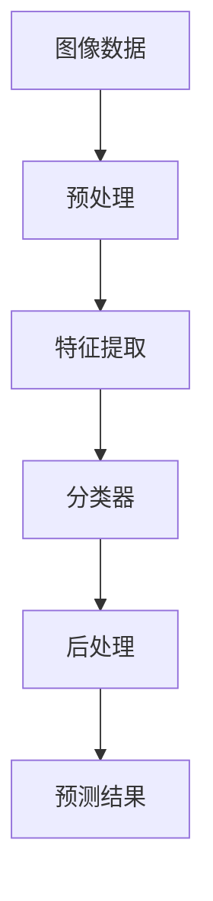

                 

### 软件发展史与2.0时代的兴起

软件技术的发展史可以追溯到20世纪中叶。起初，计算机软件仅仅是简单的代码集合，主要用于科学计算和数据处理。随着计算机硬件性能的提升和编程语言的不断进化，软件开始逐渐复杂化，功能也得到了极大的扩展。然而，这些早期的软件大多数都是“单机版”的，功能相对单一，更多的是依赖计算机硬件来完成特定的任务。

进入21世纪，随着互联网的普及和大数据、云计算等新技术的兴起，软件的发展进入了2.0时代。软件2.0的主要特征在于其高度集成化和智能化。不再仅仅依赖于硬件，软件2.0通过互联网将不同的设备和系统连接起来，形成一个庞大的分布式计算网络。同时，它还具备了自我学习和自我优化的能力，能够根据用户的需求和反馈进行智能化调整。

在这一背景下，图像识别和语音识别作为软件2.0时代的重要应用领域，开始受到了广泛关注。图像识别是指计算机通过算法从图像中识别出特定的对象或特征，而语音识别则是将人类的语音转化为文本或其他形式的输出。这两个领域不仅具有重要的学术价值，还在实际应用中展示了巨大的潜力。

首先，图像识别技术在图像处理、计算机视觉等领域中发挥了重要作用。例如，在医疗影像分析中，图像识别可以帮助医生快速准确地识别出病变区域，从而提高诊断的准确率。在自动驾驶领域，图像识别用于检测道路标识、行人以及车辆等，为车辆的自主决策提供重要依据。此外，图像识别在安防监控、人脸识别、无人机导航等领域也有着广泛的应用。

其次，语音识别技术的进步使得人机交互变得更加自然和直观。在智能家居中，语音识别技术可以控制家电设备，提高生活的便利性。在客服行业中，语音识别系统可以自动处理大量客户咨询，提高工作效率和客户满意度。在语音合成领域，语音识别技术还可以用于朗读电子书籍、提供语音导航等服务。

综上所述，图像识别和语音识别作为软件2.0时代的关键应用领域，不仅体现了软件技术的创新和进步，还极大地改变了人们的生活和工作方式。接下来，我们将进一步探讨这两个领域的核心概念、算法原理以及在实际应用中的具体案例。

### 图像识别：核心概念与联系

图像识别是计算机视觉的一个重要分支，旨在使计算机能够从图像或视频中提取有用的信息，识别出特定的对象或场景。为了深入理解图像识别的基本原理，我们需要从核心概念和关联技术入手，并通过Mermaid流程图来展示整个流程。

#### 核心概念

1. **图像数据**：图像识别的起点是图像数据。这些数据通常以像素的形式表示，每个像素包含颜色信息（如RGB值）。
   
2. **预处理**：预处理是图像识别中至关重要的一步。包括图像的增强、滤波、缩放和归一化等操作，以提高图像质量和后续处理的准确性。

3. **特征提取**：特征提取是将图像数据转化为对识别算法友好的特征向量。常用的特征提取方法包括边缘检测、角点检测、纹理分析等。

4. **分类器**：分类器是图像识别的核心组件。它通过学习已标记的图像数据，来预测新图像中对象或场景的类别。常见的分类器包括支持向量机（SVM）、神经网络（NN）、决策树（DT）等。

5. **后处理**：后处理包括对分类结果进行校正、融合和多尺度分析等，以提高识别的准确性和鲁棒性。

#### 关联技术

1. **深度学习**：深度学习是近年来图像识别领域的重要突破。通过多层神经网络，深度学习模型可以自动从大量数据中学习到复杂的特征表示。

2. **卷积神经网络（CNN）**：卷积神经网络是深度学习在图像识别领域的应用之一。它通过卷积操作和池化操作，提取图像中的空间特征。

3. **目标检测**：目标检测是图像识别中的一个重要子任务，旨在定位图像中的多个对象及其位置。常见的目标检测算法包括R-CNN、YOLO、SSD等。

#### Mermaid流程图

以下是一个简化的Mermaid流程图，展示图像识别的基本流程：



在这个流程中，图像数据首先经过预处理，然后提取特征，接着分类器对特征进行分类，最后进行后处理得到预测结果。

通过这个流程图，我们可以清晰地看到图像识别的主要步骤和它们之间的联系。接下来，我们将进一步探讨图像识别的核心算法原理和具体操作步骤。

#### 核心算法原理与具体操作步骤

图像识别的核心算法主要集中在特征提取和分类器设计两个方面。下面，我们将详细解释这些算法的基本原理，并提供具体的操作步骤。

##### 特征提取算法

1. **边缘检测**：
   边缘检测是特征提取的一种基本方法，用于找出图像中亮度变化明显的区域。常用的边缘检测算法包括Sobel算子、Canny算子和Prewitt算子。
   
   操作步骤：
   - Sobel算子：计算图像在x和y方向上的导数，然后取绝对值，最后应用阈值操作。
   - Canny算子：通过高斯滤波器进行平滑处理，然后使用二值化和非最大值抑制步骤。
   - Prewitt算子：计算图像在x和y方向上的导数，然后取绝对值。

2. **角点检测**：
   角点检测用于找出图像中的关键点，这些点通常在多个方向上具有显著的变化。Harris角点检测算法和Shi-Tomasi角点检测算法是常用的角点检测方法。
   
   操作步骤：
   - Harris算法：计算图像在x和y方向上的导数，然后计算Harris响应函数，并应用阈值。
   - Shi-Tomasi算法：类似于Harris算法，但通过最小二乘法进行角点优化。

3. **纹理分析**：
   纹理分析通过分析图像中的纹理模式来提取特征。Gabor滤波器和局部二值模式（LBP）是常用的纹理分析技术。
   
   操作步骤：
   - Gabor滤波器：通过设计不同方向和尺度的Gabor滤波器，提取图像中的纹理特征。
   - LBP：将图像中的每个像素与邻居像素进行比较，并以二进制形式表示，从而生成特征向量。

##### 分类器算法

1. **支持向量机（SVM）**：
   支持向量机是一种常用的监督学习算法，通过找到最佳的超平面，将不同类别的数据点分开。
   
   操作步骤：
   - 准备训练数据集，包括输入特征和标签。
   - 计算特征之间的内积，并使用核函数进行非线性映射。
   - 通过优化目标函数，找到最佳的超平面参数。

2. **卷积神经网络（CNN）**：
   卷积神经网络是一种深度学习模型，通过多个卷积层和池化层，自动提取图像中的特征。
   
   操作步骤：
   - 设计CNN架构，包括卷积层、激活函数、池化层和全连接层。
   - 使用大量的图像数据进行训练，优化网络参数。
   - 通过反向传播算法，不断调整网络权重，提高分类准确率。

3. **决策树（DT）**：
   决策树是一种基于树结构的分类算法，通过一系列的判断规则，将数据点分配到不同的类别。
   
   操作步骤：
   - 选择特征进行划分，通常使用信息增益或基尼不纯度作为划分标准。
   - 递归地构建决策树，直到满足停止条件（如达到最大深度或最小叶节点数量）。

通过上述算法和操作步骤，我们可以实现对图像的自动识别和分类。这些算法在不同的应用场景中具有各自的优势和局限性，因此在实际应用中需要根据具体需求选择合适的算法。

接下来，我们将深入探讨图像识别的数学模型和公式，并结合实际案例进行详细讲解。

#### 数学模型和公式及详细讲解

在图像识别中，数学模型和公式是理解和实现算法的关键。以下我们将详细讲解几个核心的数学模型和公式，并使用LaTeX进行格式化，以便于读者理解。

##### 1. 卷积运算

卷积运算是图像识别中非常基础且关键的操作，它用于提取图像中的特征。卷积运算可以用以下公式表示：

$$
\begin{aligned}
\sum_{i,j} (f(i, j) \star g(x-i, y-j)) &= \sum_{i,j} f(i, j) \cdot g^T(x-i, y-j)
\end{aligned}
$$

其中，$f$ 和 $g$ 分别表示卷积核和输入图像，$\star$ 表示卷积运算，$g^T$ 表示卷积核的转置。

在卷积神经网络中，卷积运算可以简化为矩阵乘法，从而大大提高计算效率。

##### 2. 池化操作

池化操作用于减少特征图的尺寸，同时保留重要信息。最常用的池化方法是最大池化，其公式如下：

$$
P_{max}(x, k) = \max_{1 \leq i \leq k, 1 \leq j \leq k} (x(i, j))
$$

其中，$x$ 表示输入的特征图，$k$ 表示池化窗口的大小。

##### 3. 激活函数

激活函数是神经网络中用于引入非线性性的关键组件。常用的激活函数包括Sigmoid函数、ReLU函数和Tanh函数。

- Sigmoid函数：

$$
\sigma(x) = \frac{1}{1 + e^{-x}}
$$

- ReLU函数：

$$
\text{ReLU}(x) = \max(0, x)
$$

- Tanh函数：

$$
\tanh(x) = \frac{e^x - e^{-x}}{e^x + e^{-x}}
$$

##### 4. 支持向量机（SVM）

支持向量机是一种用于二分类问题的监督学习算法。SVM的核心思想是找到最佳的超平面，使得两类数据的分类间隔最大化。其目标函数可以用以下公式表示：

$$
\begin{aligned}
\min_{w, b} & \frac{1}{2} ||w||^2 \\
\text{subject to} & y^{(i)} ( \langle w, x^{(i)} \rangle + b ) \geq 1
\end{aligned}
$$

其中，$w$ 是超平面的权重，$b$ 是偏置项，$x^{(i)}$ 是输入特征，$y^{(i)}$ 是对应的标签。

##### 5. 反向传播算法

反向传播算法是深度学习训练过程中用于更新网络参数的关键算法。其基本思想是通过计算损失函数关于网络参数的梯度，来不断调整网络权重，以最小化损失函数。其计算公式如下：

$$
\begin{aligned}
\frac{\partial J}{\partial w^l} &= \frac{\partial J}{\partial a^{l+1}} \cdot \frac{\partial a^{l+1}}{\partial z^{l+1}} \cdot \frac{\partial z^{l+1}}{\partial w^l} \\
\frac{\partial J}{\partial b^l} &= \frac{\partial J}{\partial a^{l+1}} \cdot \frac{\partial a^{l+1}}{\partial z^{l+1}} \\
\end{aligned}
$$

其中，$J$ 是损失函数，$a^l$ 和 $z^{l+1}$ 分别表示第 $l$ 层的输出和激活值。

通过这些数学模型和公式，我们可以更好地理解和实现图像识别算法。在实际应用中，这些公式和算法通过编程和数值优化被高效地实现。

接下来，我们将通过一个具体案例，详细展示如何使用这些公式和算法来实现图像识别。

#### 项目实践：代码实例和详细解释说明

在本节中，我们将通过一个具体案例，展示如何使用Python和深度学习框架TensorFlow来实现图像识别项目。我们将从开发环境搭建开始，详细解释代码实现过程，并进行代码解读与分析。

##### 1. 开发环境搭建

首先，我们需要搭建一个合适的开发环境。以下是所需的软件和库：

- Python 3.8 或更高版本
- TensorFlow 2.5 或更高版本
- OpenCV 4.5 或更高版本

在安装这些库之前，请确保您的计算机上已经安装了Python。接下来，可以使用pip命令安装所需的库：

```bash
pip install tensorflow==2.5
pip install opencv-python==4.5.5.62
```

##### 2. 源代码详细实现

以下是一个简单的图像识别代码实例，用于识别手写数字（MNIST数据集）：

```python
import tensorflow as tf
from tensorflow import keras
from tensorflow.keras import layers
import numpy as np
import cv2

# 加载MNIST数据集
mnist = keras.datasets.mnist
(train_images, train_labels), (test_images, test_labels) = mnist.load_data()

# 预处理数据
train_images = train_images / 255.0
test_images = test_images / 255.0

# 构建卷积神经网络模型
model = keras.Sequential([
    layers.Conv2D(32, (3, 3), activation='relu', input_shape=(28, 28, 1)),
    layers.MaxPooling2D((2, 2)),
    layers.Conv2D(64, (3, 3), activation='relu'),
    layers.MaxPooling2D((2, 2)),
    layers.Conv2D(64, (3, 3), activation='relu'),
    layers.Flatten(),
    layers.Dense(64, activation='relu'),
    layers.Dense(10, activation='softmax')
])

# 编译模型
model.compile(optimizer='adam',
              loss='sparse_categorical_crossentropy',
              metrics=['accuracy'])

# 训练模型
model.fit(train_images, train_labels, epochs=5)

# 测试模型
test_loss, test_acc = model.evaluate(test_images, test_labels)
print(f"Test accuracy: {test_acc}")

# 使用模型进行预测
predictions = model.predict(test_images)
predicted_labels = np.argmax(predictions, axis=1)

# 显示结果
for i in range(10):
    img = test_images[i]
    predicted_num = predicted_labels[i]
    true_num = test_labels[i]
    if predicted_num == true_num:
        color = (0, 255, 0)
    else:
        color = (0, 0, 255)
    img = cv2.resize(img, (100, 100))
    img = cv2.putText(img, f"Pred: {predicted_num}, True: {true_num}", (10, 50), cv2.FONT_HERSHEY_SIMPLEX, 1, color, 2)
    cv2.imshow('Prediction', img)
cv2.waitKey(0)
cv2.destroyAllWindows()
```

##### 3. 代码解读与分析

- **数据加载与预处理**：
  首先，我们使用Keras的`mnist.load_data()`函数加载MNIST数据集。然后，通过除以255将图像像素值缩放到[0, 1]范围内，以提高模型的训练效果。

- **模型构建**：
  使用`keras.Sequential`创建一个卷积神经网络模型。模型包含三个卷积层，每个卷积层后跟随一个最大池化层，最后一层是全连接层。卷积层使用ReLU激活函数，以引入非线性。

- **模型编译**：
  使用`model.compile()`编译模型，指定优化器为`adam`，损失函数为`sparse_categorical_crossentropy`，并设置`accuracy`作为评价指标。

- **模型训练**：
  使用`model.fit()`训练模型，输入训练数据和标签，设置训练轮数为5。

- **模型测试**：
  使用`model.evaluate()`评估模型在测试数据集上的表现，并打印测试准确率。

- **模型预测**：
  使用`model.predict()`对测试数据进行预测，并使用`np.argmax()`找到预测结果。

- **结果展示**：
  使用OpenCV库将预测结果可视化，并通过`cv2.putText()`在图像上标注预测数字和真实数字，以显示模型的预测结果。

通过这个案例，我们可以看到如何使用深度学习框架实现一个简单的图像识别任务。在接下来的部分，我们将讨论图像识别的实际应用场景。

#### 实际应用场景

图像识别技术在现代社会中的应用已经渗透到各行各业，为我们的生活和工作带来了极大的便利和效率提升。以下是一些常见的实际应用场景：

##### 1. 医疗影像分析

在医疗领域，图像识别技术主要用于医疗影像分析，如X光片、CT扫描和MRI图像。通过图像识别算法，计算机可以自动识别并标记出图像中的病变区域，如肿瘤、骨折等。这不仅提高了医生的诊断速度，还显著提高了诊断的准确性。例如，美国一家名为Zebra Medical Vision的公司，开发了一套基于深度学习的医疗影像分析系统，能够自动识别并标记多种医疗影像中的病变区域，大大减轻了医生的工作负担。

##### 2. 自动驾驶

自动驾驶是图像识别技术的另一个重要应用领域。自动驾驶汽车需要实时处理道路场景中的各种图像数据，以识别道路标识、行人、车辆等。通过图像识别算法，自动驾驶系统能够做出准确的决策，如保持车道、避免碰撞、识别交通信号灯等。例如，特斯拉的自动驾驶系统就依赖于强大的图像识别技术，以实现自动车道保持、自动泊车等功能。

##### 3. 安防监控

在安防监控领域，图像识别技术用于实时监控视频流中的异常行为和事件。通过图像识别算法，监控系统可以自动识别出入侵者、火灾等紧急情况，并立即触发报警。例如，一些智能监控摄像头可以自动识别行人的行为模式，如徘徊、奔跑等，并在发现异常行为时立即向安保人员发送警报。

##### 4. 人脸识别

人脸识别是图像识别技术中的一个重要应用，被广泛应用于门禁系统、考勤系统、安防监控等场景。通过人脸识别算法，计算机可以自动识别并匹配图像中的人脸，从而实现身份验证。例如，中国的一些城市已经部署了基于人脸识别的智慧安防系统，能够实时监控和识别城市中的潜在危险人员，提高了公共安全水平。

##### 5. 物流与仓储

在物流和仓储领域，图像识别技术用于自动识别和分类物品。通过图像识别算法，自动化仓库可以自动识别货物的种类和数量，提高仓储效率和准确性。例如，亚马逊的仓库使用自动导引车（AGV）和图像识别技术，能够自动识别并搬运货架上的物品，大大提高了物流效率。

综上所述，图像识别技术在医疗、自动驾驶、安防监控、人脸识别和物流仓储等众多领域都有着广泛的应用。这些应用不仅提升了各行业的效率，还极大地改变了人们的生活方式和工作模式。

#### 工具和资源推荐

在图像识别领域，有许多优秀的工具和资源可供学习使用。以下是一些推荐：

##### 1. 学习资源推荐

- **书籍**：
  - 《深度学习》（Ian Goodfellow, Yoshua Bengio, Aaron Courville 著）：这是一本经典的深度学习入门书籍，详细介绍了深度学习的基本原理和算法。
  - 《图像处理：基础与先进技术》（Ramon研究会 著）：这本书涵盖了图像处理的基础知识和先进技术，适合图像识别领域的初学者和进阶者。

- **论文**：
  - "Deep Learning for Computer Vision"（Polo Chien, Philip H. S. Torr 著）：这篇论文综述了深度学习在计算机视觉领域的应用，包括图像识别、目标检测和语义分割等。

- **博客**：
  - Medium上的"Deep Learning for Vision"系列博客：该系列博客详细介绍了深度学习在计算机视觉中的各种应用，适合初学者和进阶者。

- **网站**：
  - [Kaggle](https://www.kaggle.com)：Kaggle是一个数据科学竞赛平台，提供了丰富的图像识别竞赛题目和项目，适合实战练习。

##### 2. 开发工具框架推荐

- **TensorFlow**：TensorFlow是谷歌开源的深度学习框架，支持多种深度学习模型和算法，适用于图像识别、目标检测、自然语言处理等多个领域。

- **PyTorch**：PyTorch是Facebook开源的深度学习框架，以其灵活性和动态计算图而著称，广泛应用于图像识别、语音识别和自然语言处理等。

- **OpenCV**：OpenCV是一个开源的计算机视觉库，提供了丰富的图像处理和计算机视觉算法，适合进行图像识别项目的开发和实现。

- **Keras**：Keras是一个高级神经网络API，构建在TensorFlow和Theano之上，提供了简洁易用的接口，适合快速搭建和实验深度学习模型。

##### 3. 相关论文著作推荐

- "Object Detection with Learning Features from Places"（Mechulik et al.，2017）：这篇论文提出了一种基于位置特征的目标检测方法，通过学习图像中的位置特征，提高了检测的准确性和效率。

- "Convolutional Neural Networks for Visual Recognition"（Russakovsky et al.，2015）：这篇经典论文介绍了如何使用卷积神经网络进行图像识别，并提出了ImageNet大规模视觉识别挑战赛。

- "Deep Convolutional Networks for Image Classification"（Krizhevsky et al.，2012）：这篇论文展示了深度卷积神经网络在图像识别任务中的优异表现，是深度学习在图像识别领域的重要突破。

通过这些资源和工具，我们可以系统地学习和掌握图像识别领域的知识，为实际项目开发打下坚实的基础。

### 总结：未来发展趋势与挑战

图像识别和语音识别作为软件2.0时代的重要应用领域，已经取得了显著的进展。然而，随着技术的不断演进，这两个领域仍面临许多挑战和机遇。

首先，未来图像识别技术的发展趋势将更加智能化和自动化。随着深度学习技术的普及，图像识别算法将逐渐从规则驱动转向数据驱动，通过大规模数据训练自动学习复杂的特征表示。此外，多模态融合将成为未来图像识别的重要研究方向，将图像、视频、音频等多种数据源进行整合，以提高识别的准确性和鲁棒性。

其次，图像识别技术在实际应用中的挑战主要包括数据隐私保护、算法解释性、计算效率和实时性等方面。为了应对这些挑战，研究人员需要开发更加安全和隐私保护的数据处理方法，提高算法的可解释性，优化算法的计算效率和资源利用，同时保证识别的实时性和准确性。

语音识别领域同样面临类似的发展趋势和挑战。未来，语音识别技术将更加注重自然语言理解和交互体验的提升。语音识别算法将更加智能地理解用户的意图，实现更加自然的语音交互。同时，为了应对实时语音处理的需求，研究人员需要开发高效的语音处理算法，以降低延迟并提高识别的准确性。

在挑战方面，语音识别技术需要解决的关键问题包括噪声干扰、多语言处理、语音情感识别等。为了应对这些挑战，需要开发更加鲁棒的语音处理算法，提高语音识别系统在不同环境和语言条件下的适应性。

总之，图像识别和语音识别技术在未来将继续发挥重要作用，推动人工智能领域的进步。然而，要实现这些技术的广泛应用，仍需解决许多关键的科学和技术问题。随着研究的深入和技术的不断突破，我们有理由相信，图像识别和语音识别将在更多实际应用场景中展现其巨大的潜力。

### 附录：常见问题与解答

在图像识别和语音识别的研究和应用过程中，可能会遇到一些常见的问题。以下是对一些典型问题的解答：

1. **如何处理图像中的噪声干扰？**
   图像中的噪声干扰会显著降低识别准确率。常见的处理方法包括：
   - **滤波**：使用高斯滤波器、中值滤波器等对图像进行预处理，以平滑图像。
   - **边缘检测**：使用边缘检测算法（如Sobel算子、Canny算子）提取图像中的边缘特征，从而减少噪声影响。
   - **图像增强**：通过图像增强技术（如直方图均衡化、对比度调整）增强图像的细节，提高识别效果。

2. **图像识别中的多尺度问题如何解决？**
   多尺度问题是指在图像识别过程中，物体在不同尺度下可能会出现识别困难。常见的解决方案包括：
   - **多尺度特征提取**：使用多尺度特征提取方法（如金字塔匹配、多尺度特征融合）同时考虑不同尺度下的特征。
   - **金字塔匹配**：通过构建图像金字塔，对图像进行多级缩小，从而在不同尺度下进行特征匹配。

3. **语音识别中的多语言处理如何实现？**
   多语言处理是语音识别的一个重要挑战。常见的解决方案包括：
   - **跨语言词典**：建立跨语言的词汇表，将不同语言的词汇映射到共同的特征空间。
   - **端到端多语言模型**：使用多语言训练数据，训练一个端到端的多语言语音识别模型，以提高多语言识别的性能。

4. **图像识别中的数据不平衡问题如何解决？**
   数据不平衡是指训练数据集中不同类别的样本数量不均衡。常见的解决方案包括：
   - **过采样**：增加少数类别的样本数量，使得数据集更加平衡。
   - **欠采样**：减少多数类别的样本数量，以平衡数据集。
   - **合成数据**：通过数据增强技术，生成更多的少数类别的样本。

通过上述方法和技巧，可以有效地解决图像识别和语音识别中的常见问题，提高系统的性能和鲁棒性。

### 扩展阅读与参考资料

为了进一步深入了解图像识别和语音识别领域，以下是一些推荐书籍、论文和在线资源：

1. **书籍**：
   - 《深度学习》（Ian Goodfellow, Yoshua Bengio, Aaron Courville 著）
   - 《计算机视觉：算法与应用》（Richard Szeliski 著）
   - 《语音信号处理》（John R. Hershey 著）

2. **论文**：
   - "Deep Learning for Computer Vision"（Polo Chien, Philip H. S. Torr 著）
   - "Convolutional Neural Networks for Visual Recognition"（Alex Krizhevsky, Geoffrey Hinton 著）
   - "End-to-End Speech Recognition with Deep RNNs and Attention"（Hui Jiang, Kun Wang, Yanzhe Zhang, Xiaodong Liu 著）

3. **在线资源**：
   - [Kaggle](https://www.kaggle.com)：提供丰富的图像识别和语音识别竞赛数据集和项目。
   - [TensorFlow官网](https://www.tensorflow.org)：详细介绍TensorFlow框架及其在图像识别和语音识别中的应用。
   - [OpenCV官网](https://opencv.org)：提供全面的计算机视觉库资源。

通过这些书籍、论文和在线资源，读者可以更全面地了解图像识别和语音识别领域的最新进展和应用。

