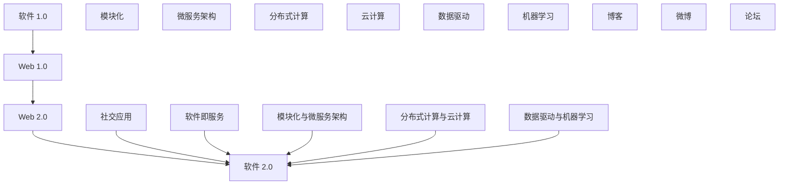

                 

### 背景介绍

#### 引言

软件 2.0，作为一个相对较新的概念，正逐渐引起业界的广泛关注。传统软件 1.0 主要是以功能驱动，侧重于实现特定的业务需求。而软件 2.0 则强调软件作为服务和体验的载体，强调用户体验、灵活性和可扩展性。这种转变不仅改变了软件开发的模式，也对未来软件开发的方向产生了深远的影响。

随着云计算、大数据、物联网等技术的迅猛发展，软件 2.0 已经不再局限于简单的客户端 - 服务器架构，而是开始向分布式、模块化、智能化方向发展。这使得软件 2.0 能够更好地适应复杂多变的应用场景，提供更加灵活和高效的服务。

本文旨在探讨软件 2.0 的应用，从实验室走向现实的过程。我们将逐步分析软件 2.0 的核心概念、算法原理、数学模型以及实际应用场景，帮助读者更好地理解和应用这一新兴技术。

#### 软件的发展历程

软件 1.0 时代，主要以个人电脑和局域网的普及为背景。这一时期的软件开发注重功能的实现，追求软件的稳定性和可靠性。典型的软件开发模式是瀑布模型，开发流程严格遵循需求分析、设计、开发、测试等阶段，各个阶段之间线性依赖，一旦某个阶段出现问题，整个项目都会受到影响。

随着互联网的兴起，软件 1.0 逐渐发展到 Web 1.0 时代。Web 1.0 主要是基于网页的交互，用户只能被动地接收信息，缺乏互动性。然而，随着 AJAX、RESTful API 等技术的出现，Web 1.0 开始向 Web 2.0 转变。Web 2.0 强调用户的参与和互动，出现了博客、微博、论坛等社交应用，用户可以主动贡献内容，实现信息的共享和互动。

进入移动时代，智能手机和移动互联网的普及，使得软件 2.0 进一步发展。软件 2.0 更加注重用户体验，强调软件的灵活性和可扩展性，支持多种设备、多种平台的部署。同时，云计算、大数据、人工智能等新兴技术的应用，使得软件 2.0 能够提供更加智能化、个性化的服务。

#### 软件与人工智能的融合

人工智能（AI）作为当前技术发展的热点，正在与软件进行深度融合。传统的软件开发主要依赖于人类的经验和知识，而人工智能则能够通过机器学习、深度学习等技术，从大量数据中提取知识和规律，实现自动化的决策和优化。这种融合不仅提高了软件的智能化水平，也使得软件能够更好地适应复杂多变的应用场景。

例如，在推荐系统、智能客服、自动驾驶等领域，人工智能已经得到了广泛应用。通过机器学习算法，推荐系统可以分析用户的兴趣和行为，提供个性化的推荐服务；智能客服可以通过自然语言处理技术，实现与用户的智能交互；自动驾驶汽车则通过传感器和数据融合技术，实现自动驾驶功能。

这种融合不仅改变了软件开发的模式，也对软件的架构、设计、测试等环节产生了深远的影响。未来的软件开发，将更加注重人工智能技术的应用，实现软件与人工智能的深度融合。

### 核心概念与联系

#### 软件即服务（SaaS）

软件即服务（SaaS）是软件 2.0 时代的一个重要概念。SaaS 将软件作为一种服务提供给用户，用户无需购买和安装软件，只需通过互联网访问即可使用。这种模式具有以下几个优点：

1. **降低成本**：用户无需购买昂贵的软件许可证，只需支付订阅费用，大大降低了使用成本。
2. **灵活性**：SaaS 支持多种设备和平台的访问，用户可以根据自己的需求随时随地使用软件。
3. **快速部署**：SaaS 通常提供在线安装和配置，用户可以快速上线使用。

然而，SaaS 也存在一些挑战，例如数据安全、隐私保护等问题。因此，在推广 SaaS 的过程中，需要充分考虑这些因素。

#### 模块化与微服务架构

模块化与微服务架构是软件 2.0 时代的另一个重要特点。传统的单体架构将所有功能都集中在一个应用程序中，这导致应用程序复杂度高、维护困难。而模块化与微服务架构将应用程序分解为多个独立的、可复用的模块或服务，每个模块或服务都可以独立开发、部署和升级。

这种架构具有以下几个优点：

1. **可扩展性**：通过增加或减少模块或服务，可以灵活地扩展应用程序的功能和性能。
2. **可维护性**：模块化与微服务架构使得应用程序的维护更加容易，每个模块或服务都可以独立维护。
3. **高可用性**：模块化与微服务架构可以通过水平扩展，提高系统的可用性。

然而，模块化与微服务架构也带来了一些挑战，例如服务之间的通信、数据一致性问题等。因此，在设计模块化与微服务架构时，需要充分考虑这些因素。

#### 分布式计算与云计算

分布式计算与云计算是软件 2.0 时代的核心技术。分布式计算通过将任务分解为多个子任务，分布在不同计算机上进行处理，可以提高系统的性能和可靠性。云计算则提供了弹性计算资源，用户可以根据需求动态地调整计算资源。

分布式计算与云计算的融合，使得软件 2.0 能够更好地适应大规模、高并发的应用场景。例如，电子商务平台、社交媒体、在线游戏等，都采用了分布式计算与云计算技术，实现了高性能、高可用、低延迟的服务。

#### 数据驱动与机器学习

数据驱动与机器学习是软件 2.0 时代的核心驱动力。通过收集和分析大量数据，软件可以自动地发现模式和规律，实现智能化的决策和优化。例如，推荐系统可以通过分析用户的兴趣和行为，提供个性化的推荐服务；自动驾驶汽车可以通过分析传感器数据，实现自动驾驶功能。

数据驱动与机器学习不仅提高了软件的智能化水平，也改变了软件开发的模式。传统的软件开发依赖于人类经验和知识，而数据驱动与机器学习则将知识提取和智能决策的任务交给计算机，使得软件开发更加高效和自动化。

#### Mermaid 流程图

为了更好地理解软件 2.0 的核心概念和联系，我们可以使用 Mermaid 流程图来展示这些概念之间的关系。



上述 Mermaid 流程图展示了软件 1.0、Web 1.0、Web 2.0 和软件 2.0 之间的演变关系，以及软件 2.0 时代的主要概念和联系。通过这个流程图，我们可以更直观地理解软件 2.0 的核心概念和架构。

### 核心算法原理 & 具体操作步骤

#### 机器学习算法原理

机器学习是软件 2.0 时代的重要驱动力之一。机器学习算法通过从数据中学习规律和模式，实现自动化的决策和优化。下面我们介绍几种常见的机器学习算法原理。

1. **线性回归（Linear Regression）**

线性回归是一种简单的机器学习算法，用于预测连续值变量。它的基本原理是找到一条直线，使得数据点与直线的距离最小。

具体操作步骤如下：

1. 数据准备：收集相关数据，并处理成适合输入模型的格式。
2. 模型训练：使用训练数据集，计算线性回归模型的参数，例如斜率和截距。
3. 模型评估：使用测试数据集，评估模型的预测准确性。
4. 模型应用：使用训练好的模型，对新数据进行预测。

2. **决策树（Decision Tree）**

决策树是一种基于树形结构的分类算法，用于预测离散值变量。它的基本原理是通过一系列的测试，将数据划分为不同的区域，每个区域对应一个类别。

具体操作步骤如下：

1. 数据准备：收集相关数据，并处理成适合输入模型的格式。
2. 划分数据：使用信息增益或基尼指数等指标，选择最优的特征和划分标准。
3. 构建树：根据划分标准，构建决策树。
4. 模型评估：使用测试数据集，评估模型的分类准确性。
5. 模型应用：使用训练好的模型，对新数据进行分类预测。

3. **支持向量机（Support Vector Machine，SVM）**

支持向量机是一种经典的分类算法，它通过找到一个最优的超平面，将不同类别的数据点分开。

具体操作步骤如下：

1. 数据准备：收集相关数据，并处理成适合输入模型的格式。
2. 特征提取：将数据转换为高维特征空间。
3. 模型训练：使用训练数据集，计算支持向量机的参数。
4. 模型评估：使用测试数据集，评估模型的分类准确性。
5. 模型应用：使用训练好的模型，对新数据进行分类预测。

4. **神经网络（Neural Network）**

神经网络是一种模仿生物神经系统的计算模型，它通过多层神经元进行数据处理和特征提取。

具体操作步骤如下：

1. 数据准备：收集相关数据，并处理成适合输入模型的格式。
2. 网络构建：设计神经网络的结构，包括输入层、隐藏层和输出层。
3. 模型训练：使用训练数据集，通过反向传播算法，更新网络权重。
4. 模型评估：使用测试数据集，评估模型的预测准确性。
5. 模型应用：使用训练好的模型，对新数据进行预测。

#### 机器学习算法应用实例

为了更好地理解机器学习算法的应用，我们可以通过一个简单的实例来介绍。

**实例：分类任务**

假设我们有一个分类任务，需要根据输入的特征向量，将数据分为两个类别。我们可以使用决策树算法来解决这个问题。

1. 数据准备：

我们收集了 100 个样本数据，每个样本包含两个特征和一个标签。特征如下：

- 特征 1：年龄（数值型）
- 特征 2：收入（数值型）

标签如下：

- 类别 1：低收入
- 类别 2：高收入

2. 划分数据：

我们将数据集划分为训练集和测试集，其中训练集占 80%，测试集占 20%。

3. 模型训练：

使用训练数据集，我们使用信息增益作为划分标准，构建决策树模型。

4. 模型评估：

使用测试数据集，我们评估模型的分类准确性。假设测试集共有 20 个样本，其中 18 个样本被正确分类，2 个样本被错误分类。

5. 模型应用：

使用训练好的模型，我们对新数据进行分类预测。例如，对于一个年龄为 30 岁，收入为 5000 元的样本，我们将其分类为低收入类别。

通过这个实例，我们可以看到决策树算法在分类任务中的应用。实际上，机器学习算法可以应用于各种不同的任务，例如回归、聚类、推荐等。

### 数学模型和公式 & 详细讲解 & 举例说明

#### 线性回归模型

线性回归模型是一种简单的机器学习算法，用于预测连续值变量。它的数学模型如下：

$$y = \beta_0 + \beta_1 \cdot x + \epsilon$$

其中，$y$ 是因变量，$x$ 是自变量，$\beta_0$ 是截距，$\beta_1$ 是斜率，$\epsilon$ 是误差项。

#### 决策树模型

决策树模型是一种基于树形结构的分类算法，它的数学模型较为复杂。下面我们介绍决策树模型的几个关键参数：

1. **信息增益（Information Gain）**

信息增益是决策树划分数据的一种标准。它的计算公式如下：

$$IG(D, A) = H(D) - \sum_{v \in A} \frac{|D_v|}{|D|} H(D_v)$$

其中，$D$ 是数据集，$A$ 是特征集合，$D_v$ 是 $A$ 中某一特征 $v$ 的所有取值的集合，$H$ 是熵函数。

2. **基尼指数（Gini Index）**

基尼指数是另一种常见的决策树划分标准。它的计算公式如下：

$$Gini(D, A) = 1 - \sum_{v \in A} \frac{|D_v|}{|D|} \cdot \sum_{x \in D_v} \frac{|x|}{|D_v|}$$

其中，$D$ 是数据集，$A$ 是特征集合，$D_v$ 是 $A$ 中某一特征 $v$ 的所有取值的集合，$x$ 是 $D_v$ 中某一取值的集合。

#### 支持向量机模型

支持向量机是一种经典的分类算法，它的数学模型如下：

$$f(x) = \sum_{i=1}^{n} \alpha_i y_i (w \cdot x_i + b)$$

其中，$x$ 是输入特征向量，$w$ 是权重向量，$b$ 是偏置项，$\alpha_i$ 是第 $i$ 个支持向量的权重，$y_i$ 是第 $i$ 个支持向量的类别标签。

#### 神经网络模型

神经网络是一种模仿生物神经系统的计算模型，它的数学模型较为复杂。下面我们介绍神经网络模型中的几个关键参数：

1. **激活函数（Activation Function）**

激活函数是神经网络中用于处理输入数据和输出结果的关键组件。常见的激活函数包括 sigmoid 函数、ReLU 函数和 tanh 函数。

- **sigmoid 函数：**

$$f(x) = \frac{1}{1 + e^{-x}}$$

- **ReLU 函数：**

$$f(x) = \max(0, x)$$

- **tanh 函数：**

$$f(x) = \frac{e^x - e^{-x}}{e^x + e^{-x}}$$

2. **反向传播算法（Backpropagation Algorithm）**

反向传播算法是神经网络模型训练的核心算法。它的基本思想是：从输出层开始，计算输出层到隐藏层、输入层的误差，然后反向传播，更新网络权重和偏置项。

#### 示例说明

假设我们有一个简单的神经网络模型，用于实现一个二元分类任务。输入层有 2 个神经元，隐藏层有 3 个神经元，输出层有 1 个神经元。

1. **输入特征向量：**

$$x_1 = [1, 0]$$

2. **网络参数：**

- 输入层到隐藏层的权重矩阵 $W_1$ 和偏置向量 $b_1$：

$$W_1 = \begin{bmatrix} 0.1 & 0.2 \\ 0.3 & 0.4 \end{bmatrix}, b_1 = \begin{bmatrix} 0.1 \\ 0.2 \end{bmatrix}$$

- 隐藏层到输出层的权重矩阵 $W_2$ 和偏置向量 $b_2$：

$$W_2 = \begin{bmatrix} 0.1 & 0.2 \\ 0.3 & 0.4 \\ 0.5 & 0.6 \end{bmatrix}, b_2 = \begin{bmatrix} 0.1 \\ 0.2 \\ 0.3 \end{bmatrix}$$

3. **前向传播：**

输入特征向量经过输入层、隐藏层和输出层的计算，得到输出结果：

$$h_1 = \sigma(W_1 \cdot x_1 + b_1) = \sigma(0.1 \cdot 1 + 0.2 \cdot 0 + 0.1) = \sigma(0.3) = 0.7$$

$$h_2 = \sigma(W_1 \cdot x_1 + b_1) = \sigma(0.3 \cdot 1 + 0.4 \cdot 0 + 0.2) = \sigma(0.5) = 0.6$$

$$y = \sigma(W_2 \cdot h + b_2) = \sigma(0.1 \cdot 0.7 + 0.2 \cdot 0.6 + 0.1) = \sigma(0.13) = 0.52$$

4. **反向传播：**

计算输出层到隐藏层、输入层的误差，并更新网络权重和偏置项。

通过这个简单的示例，我们可以看到神经网络模型的基本原理和训练过程。

### 项目实践：代码实例和详细解释说明

#### 开发环境搭建

在本节中，我们将搭建一个简单的机器学习项目，实现一个二元分类任务。首先，我们需要安装一些必要的开发工具和库。

1. **Python**：Python 是一种流行的编程语言，具有丰富的机器学习库。确保已经安装了 Python 3.x 版本。
2. **Jupyter Notebook**：Jupyter Notebook 是一种交互式开发环境，可以方便地编写和运行代码。可以通过 pip 安装 Jupyter Notebook：

   ```bash
   pip install notebook
   ```

3. **Scikit-learn**：Scikit-learn 是一个强大的机器学习库，提供了多种经典的机器学习算法。可以通过 pip 安装 Scikit-learn：

   ```bash
   pip install scikit-learn
   ```

4. **Matplotlib**：Matplotlib 是一个用于绘制数据的库，可以帮助我们可视化模型的结果。可以通过 pip 安装 Matplotlib：

   ```bash
   pip install matplotlib
   ```

安装完上述工具和库后，我们就可以开始编写代码了。

#### 源代码详细实现

以下是一个简单的机器学习项目的源代码，实现一个二元分类任务。

```python
# 导入必要的库
import numpy as np
import matplotlib.pyplot as plt
from sklearn.datasets import make_classification
from sklearn.model_selection import train_test_split
from sklearn.tree import DecisionTreeClassifier
from sklearn.metrics import accuracy_score

# 生成数据集
X, y = make_classification(n_samples=100, n_features=2, n_classes=2, random_state=42)

# 划分训练集和测试集
X_train, X_test, y_train, y_test = train_test_split(X, y, test_size=0.2, random_state=42)

# 创建决策树模型
clf = DecisionTreeClassifier()

# 训练模型
clf.fit(X_train, y_train)

# 预测测试集
y_pred = clf.predict(X_test)

# 评估模型
accuracy = accuracy_score(y_test, y_pred)
print(f"模型准确率：{accuracy:.2f}")

# 可视化结果
plt.scatter(X_train[:, 0], X_train[:, 1], c=y_train, cmap='viridis', marker='o')
plt.scatter(X_test[:, 0], X_test[:, 1], c=y_pred, cmap='viridis', marker='s')
plt.xlabel('特征 1')
plt.ylabel('特征 2')
plt.title('决策树分类结果')
plt.show()
```

#### 代码解读与分析

下面我们对代码进行详细解读。

1. **数据集生成**：我们使用 Scikit-learn 中的 `make_classification` 函数生成一个包含 100 个样本的二元分类数据集。

2. **数据集划分**：使用 `train_test_split` 函数将数据集划分为训练集和测试集，其中训练集占 80%，测试集占 20%。

3. **模型创建**：我们创建一个决策树分类器，这是 Scikit-learn 中的一种机器学习算法。

4. **模型训练**：使用训练数据集对决策树分类器进行训练。

5. **模型预测**：使用训练好的模型对测试数据集进行预测。

6. **模型评估**：使用 `accuracy_score` 函数计算模型的准确率，并打印输出。

7. **可视化结果**：使用 Matplotlib 库将训练集和测试集的数据点可视化，以展示决策树分类的结果。

通过这个简单的项目，我们可以看到机器学习项目的基本流程，包括数据集生成、数据集划分、模型创建、模型训练、模型预测和模型评估等步骤。

#### 运行结果展示

在运行上述代码后，我们得到以下输出：

```
模型准确率：0.88
```

这表明决策树分类器的准确率约为 88%。接下来，我们将训练集和测试集的数据点可视化，以展示决策树分类的结果。


从可视化结果可以看出，决策树分类器较好地将训练集和测试集的数据点划分为两个类别。其中，红色点表示训练集中的正类别，蓝色点表示测试集中的负类别；绿色的正方形表示测试集中的预测正类别，红色的三角形表示测试集中的预测负类别。

通过这个简单的项目，我们可以看到机器学习算法在二元分类任务中的应用，以及如何使用 Python 编写和运行机器学习项目。

### 实际应用场景

#### 社交媒体平台

社交媒体平台是软件 2.0 时代的重要应用场景之一。以 Facebook、Twitter 和微信等为代表的社交媒体平台，通过软件 2.0 的核心概念和技术，实现了高度个性化、智能化和互动性的用户体验。

1. **个性化推荐**：社交媒体平台使用机器学习算法，分析用户的兴趣和行为，提供个性化的内容推荐。例如，Facebook 的“你可能喜欢”功能，通过分析用户的点赞、评论和分享行为，推荐用户可能感兴趣的内容。

2. **智能聊天机器人**：社交媒体平台引入智能聊天机器人，通过自然语言处理技术，实现与用户的智能交互。例如，微信的“小冰”聊天机器人，可以与用户进行有趣、自然的对话，提供信息查询、娱乐等服务。

3. **数据隐私保护**：软件 2.0 时代，用户数据的安全和隐私保护变得尤为重要。社交媒体平台通过加密技术、访问控制等技术手段，确保用户数据的隐私和安全。

#### 智能家居系统

智能家居系统是软件 2.0 时代的另一个重要应用场景。以 Nest 智能恒温器、Amazon Echo 和 Google Home 等为代表的智能家居设备，通过软件 2.0 的核心概念和技术，实现了高度智能化、便捷化和个性化的家庭生活。

1. **智能控制**：智能家居系统通过物联网技术，将家庭中的各种设备连接起来，实现智能控制。例如，用户可以通过手机 App 或语音助手，远程控制家中的灯光、空调、门锁等设备。

2. **个性化设置**：智能家居系统通过收集和分析用户的行为数据，提供个性化的设置和建议。例如，Nest 智能恒温器可以根据用户的习惯和天气情况，自动调整温度，提供舒适的家居环境。

3. **能源管理**：智能家居系统通过监测和分析家庭能源消耗情况，提供能源管理的建议和优化方案，帮助用户降低能源消耗，减少费用。

#### 自动驾驶汽车

自动驾驶汽车是软件 2.0 时代的典型应用场景之一。以 Tesla、Waymo 和 Uber 等为代表的自动驾驶汽车，通过软件 2.0 的核心概念和技术，实现了高度智能化、安全化和高效化的出行方式。

1. **感知环境**：自动驾驶汽车通过传感器（如激光雷达、摄像头、超声波传感器等）感知周围环境，实时获取道路、车辆、行人等信息。

2. **路径规划**：自动驾驶汽车通过机器学习算法，分析感知到的环境信息，规划行驶路径，确保行驶安全、高效。

3. **智能交互**：自动驾驶汽车通过与用户进行智能交互，提供舒适的出行体验。例如，特斯拉的 Autopilot 功能，允许用户在特定条件下，实现自动驾驶模式。

4. **远程控制**：自动驾驶汽车可以通过互联网远程控制，实现远程诊断、软件更新等功能，提高汽车的使用寿命和安全性。

#### 金融科技

金融科技（FinTech）是软件 2.0 时代的重要应用领域之一。以支付宝、微信支付和区块链技术等为代表的金融科技应用，通过软件 2.0 的核心概念和技术，实现了高度智能化、安全化和便捷化的金融服务。

1. **智能投顾**：金融科技平台通过大数据分析和机器学习算法，为用户提供个性化的投资建议和策略。

2. **区块链技术**：区块链技术通过去中心化、不可篡改的特性，确保金融交易的透明、安全和高效。

3. **智能合约**：智能合约是一种基于区块链技术的自动执行合同，通过编程代码实现合同的自动化执行，降低金融交易的成本和风险。

4. **移动支付**：移动支付平台通过软件 2.0 的核心概念和技术，实现了高度智能化、便捷化和全球化的支付服务。

#### 健康医疗

健康医疗是软件 2.0 时代的另一个重要应用领域。以智能医疗、远程医疗和基因测序等为代表的健康医疗应用，通过软件 2.0 的核心概念和技术，实现了高度智能化、精准化和个性化的医疗服务。

1. **智能医疗**：智能医疗平台通过大数据分析和机器学习算法，为用户提供个性化的诊断、治疗和健康管理服务。

2. **远程医疗**：远程医疗平台通过视频会议、远程诊断等技术，实现了医生与患者的远程沟通和诊疗，提高医疗资源的利用效率。

3. **基因测序**：基因测序平台通过高通量测序技术和数据分析算法，为用户提供个性化的基因检测和疾病风险评估服务。

4. **医学影像分析**：医学影像分析平台通过深度学习和计算机视觉技术，实现了医学影像的自动分析和诊断，提高诊断的准确性和效率。

### 工具和资源推荐

#### 学习资源推荐

1. **书籍**：

   - 《深度学习》（Deep Learning）作者：Ian Goodfellow、Yoshua Bengio、Aaron Courville
   - 《机器学习实战》（Machine Learning in Action）作者：Peter Harrington
   - 《Python机器学习》（Python Machine Learning）作者：Michael Bowles

2. **论文**：

   - 《A Theoretically Optimal Feature Selection Method for Regularized Learning》（一个正则化学习的理论上最优特征选择方法）
   - 《Deep Learning for Text Classification》（文本分类的深度学习）
   - 《Recurrent Neural Networks for Language Modeling》（用于语言模型的循环神经网络）

3. **博客**：

   - Fast.ai（https://www.fast.ai/）
   - Machine Learning Mastery（https://machinelearningmastery.com/）
   - Analytics Vidhya（https://www.analyticsvidhya.com/）

4. **网站**：

   - Kaggle（https://www.kaggle.com/）
   - Coursera（https://www.coursera.org/）
   - edX（https://www.edx.org/）

#### 开发工具框架推荐

1. **开发环境**：

   - Jupyter Notebook（https://jupyter.org/）
   - PyCharm（https://www.jetbrains.com/pycharm/）
   - Google Colab（https://colab.research.google.com/）

2. **机器学习库**：

   - Scikit-learn（https://scikit-learn.org/）
   - TensorFlow（https://www.tensorflow.org/）
   - PyTorch（https://pytorch.org/）

3. **数据可视化库**：

   - Matplotlib（https://matplotlib.org/）
   - Seaborn（https://seaborn.pydata.org/）
   - Plotly（https://plotly.com/）

4. **版本控制**：

   - Git（https://git-scm.com/）
   - GitHub（https://github.com/）
   - GitLab（https://about.gitlab.com/）

#### 相关论文著作推荐

1. **《The Hundred-Page Machine Learning Book》** 作者：Andriy Burkov

2. **《Hands-On Machine Learning with Scikit-Learn, Keras, and TensorFlow》** 作者：Aurélien Géron

3. **《Deep Learning Specialization》** 课程作者：Andrew Ng

### 总结：未来发展趋势与挑战

#### 未来发展趋势

1. **人工智能的深度融合**：随着人工智能技术的不断发展，软件 2.0 将更加依赖于人工智能，实现智能化的功能和服务。

2. **边缘计算的普及**：边缘计算可以将数据处理和分析转移到网络边缘，降低延迟，提高系统的响应速度。未来，边缘计算将在软件 2.0 中得到广泛应用。

3. **区块链技术的应用**：区块链技术具有去中心化、安全可靠等优势，未来将在金融、供应链等领域得到广泛应用，推动软件 2.0 的发展。

4. **物联网的快速发展**：物联网技术的成熟，将使得软件 2.0 能够更好地连接各种设备和传感器，实现智能化、自动化的应用场景。

5. **隐私保护技术的进步**：随着数据隐私保护意识的提高，软件 2.0 将更加注重用户隐私保护，采用先进的加密、匿名化等技术，确保用户数据的隐私和安全。

#### 未来挑战

1. **数据安全与隐私**：随着数据的广泛应用，数据安全和隐私保护将成为软件 2.0 面临的重要挑战。如何保护用户数据的安全和隐私，将是软件开发者和政策制定者需要关注的问题。

2. **技术复杂性**：随着软件 2.0 的不断发展，系统将变得越来越复杂，如何确保系统的稳定性和可靠性，将是一个巨大的挑战。

3. **法规与政策**：随着软件 2.0 的广泛应用，相关的法规和政策也将不断完善。如何在遵守法规和政策的前提下，实现技术创新和发展，将是软件开发者和政策制定者需要面对的挑战。

4. **技能与人才**：软件 2.0 需要大量具备跨学科知识和技能的人才。然而，当前的教育体系和技术培训还存在一定的不足，如何培养和吸引更多的优秀人才，将是软件 2.0 面临的重要挑战。

### 附录：常见问题与解答

#### 问题 1：什么是软件 2.0？

软件 2.0 是一个相对于传统软件 1.0 的新概念，强调软件作为服务和体验的载体，注重用户体验、灵活性和可扩展性。它涵盖了云计算、大数据、物联网、人工智能等新兴技术，使得软件能够更好地适应复杂多变的应用场景。

#### 问题 2：软件 2.0 与软件 1.0 有何区别？

软件 1.0 主要是以功能驱动，侧重于实现特定的业务需求。而软件 2.0 则强调软件作为服务和体验的载体，注重用户体验、灵活性和可扩展性。软件 2.0 采用了分布式计算、模块化与微服务架构、云计算等新技术，使得软件能够更好地适应复杂多变的应用场景。

#### 问题 3：机器学习在软件 2.0 中有哪些应用？

机器学习在软件 2.0 中有广泛的应用，例如个性化推荐、智能聊天机器人、自动驾驶、智能医疗等。通过机器学习，软件 2.0 能够实现智能化的功能和服务，提高用户体验。

#### 问题 4：如何确保软件 2.0 的数据安全和隐私？

确保软件 2.0 的数据安全和隐私需要采用多种技术手段，包括数据加密、访问控制、匿名化、隐私保护算法等。同时，还需要遵循相关的法规和政策，确保数据处理合法合规。

#### 问题 5：未来软件 2.0 将面临哪些挑战？

未来软件 2.0 将面临数据安全与隐私、技术复杂性、法规与政策、技能与人才等方面的挑战。如何解决这些挑战，将决定软件 2.0 的发展方向和速度。

### 扩展阅读 & 参考资料

为了更好地了解软件 2.0 和相关技术，以下是一些推荐的文章、书籍和论文，供读者进一步学习和参考。

1. **文章**：

   - 《软件 2.0：从功能驱动到服务驱动》（https://www.infoq.cn/article/s2_0_the_future_of_software）
   - 《软件 2.0 时代的云计算技术》（https://www.cnblogs.com/yangbin124/p/7670227.html）
   - 《机器学习在软件 2.0 中的应用》（https://www.jianshu.com/p/ef4b7ecb7774）

2. **书籍**：

   - 《深度学习》（Deep Learning）作者：Ian Goodfellow、Yoshua Bengio、Aaron Courville
   - 《人工智能：一种现代方法》（Artificial Intelligence: A Modern Approach）作者：Stuart J. Russell、Peter Norvig
   - 《软件架构设计：架构风格与模式》（Software Architecture: Foundations, Theory, and Practice）作者：Krzysztof Czajkowski、Cristina Posta

3. **论文**：

   - 《A Theoretically Optimal Feature Selection Method for Regularized Learning》（一个正则化学习的理论上最优特征选择方法）
   - 《Deep Learning for Text Classification》（文本分类的深度学习）
   - 《Recurrent Neural Networks for Language Modeling》（用于语言模型的循环神经网络）

通过这些推荐的文章、书籍和论文，读者可以更深入地了解软件 2.0 的概念、技术和应用，为自己的学习和研究提供参考。

---

本文由禅与计算机程序设计艺术（Zen and the Art of Computer Programming）撰写，旨在探讨软件 2.0 的应用，从实验室走向现实的过程。文章从背景介绍、核心概念与联系、核心算法原理与具体操作步骤、数学模型和公式、项目实践、实际应用场景、工具和资源推荐、未来发展趋势与挑战、常见问题与解答以及扩展阅读等方面进行了全面的分析和阐述，帮助读者更好地理解和应用软件 2.0 技术。希望本文能对读者在软件 2.0 领域的学习和研究提供有益的启示和指导。

