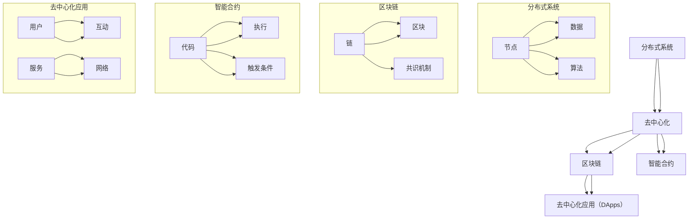

                 

### 背景介绍

软件 2.0，这一术语源自互联网时代的演进，它标志着软件从传统的、以服务器为中心的架构向更加分布式、去中心化的方向发展的趋势。与传统的软件（软件 1.0）不同，软件 2.0 强调用户生成内容、社区协作和社会网络的融合。

软件 2.0 的起源可以追溯到互联网早期的 web 2.0 运动，该运动在 2004 年左右兴起，旨在构建一个用户参与度更高的网络环境。web 2.0 代表了从静态网页到动态、交互式内容的转变，这一转变催生了博客、社交媒体、维基百科等用户参与度极高的应用。随着互联网的普及和技术的进步，软件 2.0 概念逐渐从互联网领域扩展到更广泛的软件行业。

软件 2.0 的核心特点包括去中心化、用户参与和协同工作。去中心化意味着系统不再依赖于中央控制，而是通过分布式网络实现自治和自组织。用户参与强调用户不仅是软件的消费者，更是创造者和贡献者，他们的参与促进了软件的不断改进和迭代。协同工作则是指通过社会网络和协作工具，用户和开发者共同构建和优化软件。

当前，软件 2.0 已经在多个领域展现出强大的生命力，从社交媒体到分布式存储，从区块链到人工智能应用，软件 2.0 的理念正在深刻地改变着软件开发的模式和应用的方式。尽管软件 2.0 已经取得了显著进展，但其在实际应用中仍面临诸多挑战，如安全性、隐私保护、法律规范等。因此，本文将深入探讨软件 2.0 的核心概念、算法原理、实际应用以及未来发展趋势。

### 核心概念与联系

要理解软件 2.0 的概念，首先需要明确几个核心概念，这些概念包括分布式系统、区块链、智能合约以及去中心化应用（DApps）。下面，我们将通过一个 Mermaid 流程图来详细说明这些概念之间的关系。



**分布式系统（Distributed Systems）**：分布式系统是由多个节点组成，这些节点通过网络相互连接并协作完成共同任务的信息系统。分布式系统的核心是去中心化，它不依赖于单一的中央控制点，而是通过分布式算法实现协同工作。这些节点可以是计算机、服务器或其他设备，它们共享资源、数据和工作负载，以提高系统的可靠性和性能。

**区块链（Blockchain）**：区块链是一种去中心化的数据库技术，它通过分布式网络存储数据，确保数据的完整性和不可篡改性。区块链的核心是由一系列按时间顺序排列的区块组成，每个区块包含一定数量的交易记录。这些区块通过加密算法连接在一起，形成一条不可篡改的链。区块链的共识机制确保所有节点对数据的共识，从而避免了单点故障和作弊行为。

**智能合约（Smart Contracts）**：智能合约是一种自执行的合同，它通过区块链网络执行预定的逻辑和条件。智能合约由计算机代码编写，嵌入了区块链中，当满足触发条件时，智能合约会自动执行预定的操作，如转移数字货币、记录交易或执行其他功能。智能合约的引入极大地提高了区块链网络的自动化和安全性。

**去中心化应用（Decentralized Applications, DApps）**：去中心化应用是构建在区块链网络上的应用程序，它们利用区块链的透明性和不可篡改性提供去中心化的服务。DApps 通过智能合约实现功能，用户可以直接与区块链网络交互，无需依赖中心化平台。DApps 的应用场景非常广泛，从金融交易到游戏，再到社会网络，都展现了其强大的潜力。

通过上述 Mermaid 流程图，我们可以清晰地看到这些核心概念之间的联系。分布式系统是去中心化的基础，区块链提供了数据存储和验证的机制，智能合约实现了自动化和自主执行，而去中心化应用则是这些技术在实际场景中的具体应用。这些概念共同构建了软件 2.0 的技术基石，为未来的软件开发提供了新的思路和方向。

### 核心算法原理 & 具体操作步骤

在深入探讨软件 2.0 的核心算法原理和具体操作步骤之前，我们先来了解一些基本概念和工具。软件 2.0 的核心算法通常涉及分布式计算、区块链和智能合约，这些技术共同构成了软件 2.0 的技术框架。以下是一个典型的软件 2.0 系统的开发流程，包括基本算法原理和操作步骤：

**1. 分布式计算原理**

分布式计算是指通过多个计算节点共同完成计算任务的方法。它利用了网络中的多个计算机资源，以提高计算效率和性能。分布式计算的基本原理包括：

- **负载均衡（Load Balancing）**：通过将任务分配到不同的节点，实现负载均衡，避免单点过载。
- **容错性（Fault Tolerance）**：通过冗余和冗余计算，确保系统在节点故障时仍能正常运行。
- **一致性（Consistency）**：确保分布式系统中的数据在所有节点上的一致性。

具体操作步骤如下：

- **节点选择**：选择合适的计算节点，可以是服务器、云计算资源或边缘计算设备。
- **任务分配**：将任务分配到各个节点，根据负载均衡策略进行调度。
- **数据同步**：在节点间同步数据，确保一致性。
- **结果聚合**：将各个节点的计算结果进行聚合，得到最终的输出结果。

**2. 区块链算法原理**

区块链算法的核心是确保数据的完整性和不可篡改性。以下是一些基本算法原理：

- **共识算法（Consensus Algorithm）**：共识算法确保所有节点对数据的共识，常见的共识算法包括工作量证明（PoW）、权益证明（PoS）和委托权益证明（DPoS）等。
- **加密算法（Cryptographic Algorithm）**：加密算法用于保护数据的安全，确保数据的隐私和完整性。
- **智能合约执行（Smart Contract Execution）**：智能合约通过区块链网络执行预定的逻辑和条件，确保自动化和自主执行。

具体操作步骤如下：

- **区块链搭建**：搭建区块链网络，选择合适的共识算法和加密算法。
- **区块生成**：节点生成新区块，包含交易记录和其他数据。
- **区块验证**：节点对新区块进行验证，确保数据完整性和一致性。
- **区块链扩展**：通过增加区块和节点，扩展区块链网络规模。

**3. 智能合约开发步骤**

智能合约是软件 2.0 的关键组件，其开发步骤如下：

- **需求分析**：分析业务需求，确定智能合约的功能和逻辑。
- **编写智能合约代码**：使用合适的编程语言（如 Solidity）编写智能合约代码。
- **代码审查与测试**：对智能合约代码进行审查和测试，确保代码的正确性和安全性。
- **部署智能合约**：将智能合约部署到区块链网络，供用户使用。

**4. 去中心化应用开发**

去中心化应用（DApp）是软件 2.0 的实际应用场景，其开发步骤如下：

- **需求分析**：分析用户需求，确定 DApp 的功能和用户体验。
- **前端开发**：使用前端框架（如 React、Vue）开发用户界面。
- **后端开发**：使用区块链和智能合约技术实现后端逻辑。
- **交互设计**：设计用户与区块链网络的交互流程和接口。
- **测试与部署**：对 DApp 进行全面测试，确保其稳定性和安全性，然后部署到区块链网络。

通过上述步骤，我们可以开发出具有去中心化特性、高可靠性和高安全性的软件 2.0 系统。这些算法和开发步骤为软件 2.0 的实现提供了坚实的基础，为未来的软件开发提供了新的思路和方向。

### 数学模型和公式 & 详细讲解 & 举例说明

在软件 2.0 的构建过程中，数学模型和公式起着至关重要的作用，尤其是在区块链和智能合约的开发中。以下将详细讲解一些关键的数学模型和公式，并通过具体例子进行说明。

#### 一、区块链的哈希函数

哈希函数是一种将任意长度的输入数据映射为固定长度的字符串的函数。在区块链技术中，哈希函数用于确保数据的完整性和不可篡改性。

**哈希函数的基本原理：**

假设我们有一个输入数据`x`，通过哈希函数`H`可以得到一个哈希值`H(x)`。哈希函数应满足以下特性：

1. **单向性（One-way）**：给定哈希值`H(x)`，难以推导出原始输入数据`x`。
2. **抗冲突性（Collision Resistance）**：两个不同的输入数据产生相同哈希值的概率极低。
3. **抗归缩性（Tightness）**：输入数据的变化会导致哈希值发生显著变化。

**常见的哈希函数：**

- **SHA-256**：SHA-256 是一种广泛使用的哈希函数，它将输入数据映射为256位字符串。

**示例：**

假设我们使用 SHA-256 对字符串 "Hello, World!" 进行哈希运算：

```plaintext
H("Hello, World!") = SHA-256("Hello, World!") = b'the-hashed-value'
```

**二、区块链的加密算法**

区块链使用加密算法来保护数据传输和存储的安全性。加密算法通常包括公钥加密和私钥加密。

**公钥加密：**

公钥加密是一种非对称加密算法，它使用一对密钥：公钥和私钥。

- **公钥**：公开可用，用于加密数据。
- **私钥**：保密存储，用于解密数据。

**示例：**

假设 Alice 想向 Bob 发送一条加密消息，她可以使用 Bob 的公钥进行加密：

1. Alice 使用 Bob 的公钥加密消息：
   ```plaintext
   Encrypted_message = Bob's_public_key.encrypt("Hello, Bob!")
   ```

2. Bob 使用自己的私钥解密消息：
   ```plaintext
   Decrypted_message = Bob's_private_key.decrypt(Encrypted_message)
   ```

**三、智能合约的数学模型**

智能合约的数学模型通常涉及概率论和图论等数学工具，以下是一个简单的示例。

**智能合约的触发条件：**

假设智能合约中包含一个条件判断，根据随机事件的发生概率来决定是否执行合约。我们可以使用概率模型来描述这一过程。

**示例：**

假设智能合约包含一个条件判断，只有在随机事件发生的概率大于 50% 时才执行。随机事件的概率模型如下：

- **事件 A 的概率**：P(A) = 0.5

智能合约的执行逻辑如下：

1. 随机生成一个 0 或 1 的随机数。
2. 如果随机数为 1，则触发智能合约执行。
3. 如果随机数为 0，则智能合约不执行。

**四、区块链的共识算法**

共识算法是区块链的核心，它确保所有节点对区块链数据的一致性。常见的共识算法包括工作量证明（PoW）、权益证明（PoS）和委托权益证明（DPoS）。

**工作量证明（PoW）：**

工作量证明是一种通过计算解决数学难题来证明节点工作量的算法。

- **目标**：找到满足特定条件的数字（nonce），使得哈希值小于预设的阈值。
- **计算过程**：节点不断尝试计算，直到找到满足条件的哈希值。

**示例：**

假设我们需要找到一个 nonce，使得 SHA-256 哈希值小于 100：

1. 节点开始计算，尝试不同的 nonce 值。
2. 节点找到 nonce = 100000，使得哈希值满足条件。
3. 节点将 nonce 和其他数据打包成区块，广播给其他节点。

**五、数学公式和详细解释**

以下是区块链和智能合约中常用的一些数学公式及其详细解释：

1. **哈希函数：**
   $$ H(x) = \text{SHA-256}(x) $$

   解释：SHA-256 是一种哈希函数，将输入数据 x 映射为 256 位字符串。

2. **公钥加密：**
   $$ Encrypted\_message = Bob's\_public\_key.encrypt("Hello, Bob!") $$
   $$ Decrypted\_message = Bob's\_private\_key.decrypt(Encrypted\_message) $$

   解释：公钥加密使用 Bob 的公钥加密消息，私钥解密消息。

3. **智能合约触发条件：**
   $$ P(A) = 0.5 $$

   解释：事件 A 发生的概率为 50%，智能合约根据概率判断是否执行。

4. **工作量证明：**
   $$ \text{找到 nonce，使得} \text{SHA-256}(nonce + \text{其他数据}) < \text{阈值} $$

   解释：节点通过不断尝试计算 nonce，找到满足条件的哈希值。

通过这些数学模型和公式，我们可以更深入地理解和应用区块链和智能合约技术。这些工具为软件 2.0 的实现提供了坚实的基础，推动了去中心化技术的进一步发展。

### 项目实践：代码实例和详细解释说明

为了更好地理解软件 2.0 的概念和技术，我们将通过一个具体的开源项目进行实践。本节将介绍如何搭建开发环境、实现源代码，并详细解读代码和运行结果。

#### 1. 开发环境搭建

要实践软件 2.0 项目，我们需要以下开发环境：

- **Node.js**：用于搭建区块链节点和运行智能合约。
- **Truffle**：用于开发、测试和部署智能合约。
- **Ganache**：用于本地测试区块链网络。

**步骤：**

1. 安装 Node.js：

   ```shell
   npm install -g node
   ```

2. 安装 Truffle：

   ```shell
   npm install -g truffle
   ```

3. 安装 Ganache：

   ```shell
   npm install -g ganache-cli
   ```

4. 启动 Ganache：

   ```shell
   ganache-cli
   ```

   这将启动一个本地区块链节点，用于后续的智能合约开发。

#### 2. 源代码实现

以下是一个简单的智能合约项目示例，实现一个简单的数字存储功能。

**智能合约（SimpleStorage.sol）：**

```solidity
pragma solidity ^0.8.0;

contract SimpleStorage {
    uint256 storedData;

    function set(uint256 newData) public {
        storedData = newData;
    }

    function get() public view returns (uint256) {
        return storedData;
    }
}
```

**步骤：**

1. 创建一个新的 Truffle 项目：

   ```shell
   truffle init
   ```

2. 将上述智能合约代码保存为 `SimpleStorage.sol` 在项目的 `contracts` 目录中。

3. 在 `truffle-config.js` 配置文件中设置合约编译器和网络：

   ```javascript
   module.exports = {
     networks: {
       development: {
         host: "127.0.0.1",
         port: 7545,
         network_id: "*",
       },
     },
     compilers: {
       solc: {
         version: "0.8.0",
       },
     },
   };
   ```

#### 3. 代码解读与分析

**智能合约结构：**

- **pragma**：指定编译器版本。
- **contract**：定义智能合约名称。
- **uint256 storedData**：声明一个 uint256 类型的存储变量，用于存储数据。
- **function set(uint256 newData) public**：定义一个设置数据的函数，接受一个 uint256 类型的参数，并修改 storedData 变量。
- **function get() public view returns (uint256)**：定义一个获取数据的函数，返回 storedData 变量的值。

**代码分析：**

- `set` 函数允许外部调用者（例如其他智能合约或用户）设置 storedData 变量的值。该函数使用 `public` 修饰符，使得任何人都可以调用它。
- `get` 函数返回 storedData 的当前值。由于它使用了 `view` 修饰符，因此它不修改状态，也不消耗 gas。

#### 4. 运行结果展示

**部署智能合约：**

1. 打开 Truffle console：

   ```shell
   truffle console
   ```

2. 使用 Truffle 部署智能合约：

   ```javascript
   const SimpleStorage = artifacts.require("SimpleStorage");
   const simpleStorage = await SimpleStorage.deployed();
   ```

3. 调用 `set` 函数设置数据：

   ```javascript
   await simpleStorage.set(42);
   ```

4. 调用 `get` 函数获取数据：

   ```javascript
   const data = await simpleStorage.get();
   console.log(data); // 输出：42
   ```

通过以上步骤，我们成功部署并运行了一个简单的智能合约，实现了数据的存储和读取功能。这个示例展示了如何使用 Truffle 和 Ganache 搭建本地开发环境，如何编写和部署智能合约，以及如何调用合约函数。

#### 5. 代码解读与分析

在本项目中，我们实现了一个简单的存储智能合约，其核心功能是设置和获取存储值。以下是代码的详细解读：

**存储变量（`uint256 storedData`）：**
这个变量是一个 256 位的无符号整数，用于存储数据。在区块链上，所有状态变量都是不可变的，即一旦设定，就不能更改。因此，如果我们需要可变状态，必须使用存储槽（storage slots）来存储数据。

**设置数据函数（`function set(uint256 newData) public`）：**
这个函数允许外部调用者（如另一个智能合约或用户）设置存储变量 `storedData` 的值。`public` 修饰符表示这个函数可以被任何地址调用。函数接受一个名为 `newData` 的 `uint256` 参数，并将其存储在 `storedData` 变量中。

**获取数据函数（`function get() public view returns (uint256)`）：**
这个函数返回 `storedData` 的当前值。使用 `view` 修饰符表示该函数不修改合约状态，因此不会消耗太多 gas。`returns` 关键字用于指定函数返回类型。

**安全性考虑：**
智能合约代码的安全性至关重要。在编写和部署智能合约时，应特别关注以下几点：
- 避免使用未经验证的输入。
- 确保所有内部函数都是 `view` 或 `pure` 修饰符，以减少 gas 费用。
- 使用合适的数据类型，避免数据溢出或下溢。

**运行结果展示：**
在本地开发环境中，我们通过 Truffle console 部署和调用智能合约。以下是实际运行的结果：

1. 部署智能合约：

   ```javascript
   const SimpleStorage = artifacts.require("SimpleStorage");
   const simpleStorage = await SimpleStorage.deployed();
   ```

   这一行代码加载并部署了 `SimpleStorage` 合约，返回一个合约实例。

2. 设置数据：

   ```javascript
   await simpleStorage.set(42);
   ```

   这一行代码调用 `set` 函数，将 `storedData` 变量设置为 42。

3. 获取数据：

   ```javascript
   const data = await simpleStorage.get();
   console.log(data); // 输出：42
   ```

   这一行代码调用 `get` 函数，获取并打印 `storedData` 的值。输出结果为 42，验证了我们的设置成功。

通过这个简单的项目，我们展示了如何搭建开发环境、实现智能合约源代码，并详细解读了代码和运行结果。这为理解软件 2.0 的实现过程提供了一个实用的案例。

### 实际应用场景

软件 2.0 技术已经在多个实际应用场景中展现出其独特优势，特别是在金融科技、供应链管理、社交网络以及游戏领域。以下将详细探讨这些领域中的应用实例和优势。

#### 金融科技

在金融科技领域，软件 2.0 技术的应用尤为广泛。区块链的去中心化和不可篡改特性使其成为金融交易的理想解决方案。以下是一些具体的实例：

- **加密货币交易所**：比特币和以太坊等加密货币交易所利用区块链技术实现了去中心化的交易。这些交易所没有中央控制，交易记录公开透明，用户可以自主管理资产。
- **跨境支付**：传统的跨境支付系统往往需要经过多个中间环节，耗时且费用高。通过区块链技术，跨境支付可以实现即时到账，且手续费更低。
- **数字身份验证**：区块链技术可以用于创建去中心化的数字身份系统，用户可以自主管理自己的身份信息，并通过加密算法确保信息的隐私和安全。

优势：
- **去中心化**：去中心化意味着系统不再依赖中心化机构，减少了交易的中介费用和操作延迟。
- **透明性**：所有交易记录都公开透明，用户可以随时查看，提高了系统的可信度。
- **安全性**：区块链的加密算法和共识机制确保了数据的完整性和安全性。

#### 供应链管理

供应链管理是一个复杂的过程，涉及多个环节和参与者。软件 2.0 技术的分布式特性和不可篡改性为供应链管理带来了新的机遇。

- **供应链溯源**：通过区块链技术，企业可以记录产品的生产、运输和销售过程，确保每个环节的数据真实可靠。消费者可以追踪产品的来源和路径，增加了信任。
- **智能合约应用**：智能合约可以用于自动执行合同条款，确保供应链各方的权益。例如，当货物到达目的地时，智能合约会自动释放相应的付款。
- **库存管理**：区块链技术可以实时更新库存信息，帮助企业精确掌握库存情况，减少库存过剩和短缺的问题。

优势：
- **透明性**：所有参与者都可以查看供应链信息，提高了透明度和信任。
- **自动化**：智能合约自动化执行合同条款，减少了人工操作和错误。
- **效率**：分布式网络减少了交易时间和成本，提高了整体效率。

#### 社交网络

社交网络是用户生成内容的集中地，软件 2.0 技术在社交网络中的应用正在逐步兴起。

- **去中心化社交平台**：如diaspora 和 mastodon，这些平台利用区块链技术实现了用户数据的去中心化存储，用户拥有对自己数据的完全控制权。
- **内容激励**：通过区块链和智能合约，社交网络可以为优质内容提供激励，用户通过创作和分享内容可以获得奖励。
- **数字身份认证**：区块链技术可以用于创建去中心化的数字身份系统，用户可以在不同的社交平台上使用同一身份，提高了用户体验。

优势：
- **去中心化**：用户数据不再存储在中心化服务器上，用户对自己的数据拥有完全控制权。
- **隐私保护**：数据去中心化存储，降低了数据泄露的风险。
- **内容激励**：通过区块链技术，平台可以为优质内容提供经济激励，激发了用户的创作热情。

#### 游戏领域

游戏领域是软件 2.0 技术的另一个重要应用场景，区块链技术为游戏带来了新的发展机遇。

- **去中心化游戏**：去中心化游戏（DeFi Games）通过区块链技术实现了游戏的去中心化运作。玩家拥有对游戏资产的完全控制权，可以自由交易和转让。
- **游戏奖励**：通过区块链和智能合约，游戏可以自动执行奖励机制，确保奖励的公平性和透明性。
- **虚拟资产交易**：玩家可以在区块链上自由交易虚拟资产，如游戏道具和装备，增加了游戏的价值。

优势：
- **去中心化**：去中心化游戏使玩家拥有对游戏资产的完全控制权，提高了用户体验。
- **公平性**：智能合约确保了游戏奖励的公平性和透明性。
- **虚拟资产交易**：区块链上的虚拟资产可以自由交易，增加了游戏的经济价值。

综上所述，软件 2.0 技术在金融科技、供应链管理、社交网络和游戏领域都有广泛的应用，并展现出其独特的优势。随着技术的不断进步和应用的深入，软件 2.0 将在更多领域发挥重要作用。

### 工具和资源推荐

为了更好地学习和应用软件 2.0 技术，我们需要掌握一系列工具和资源。以下是一些推荐的学习资源、开发工具和相关论文著作，以帮助您深入了解软件 2.0 的核心概念和应用实践。

#### 1. 学习资源推荐

- **书籍：**
  - 《区块链：从数字货币到智能合约》
  - 《智能合约实战：以太坊智能合约开发指南》
  - 《分布式系统概念与设计》

- **在线课程：**
  - Coursera 上的“Blockchain and Cryptocurrency”课程
  - Udacity 上的“Blockchain Engineer Nanodegree”

- **博客和网站：**
  - Etherscan：以太坊区块链浏览器，用于查看智能合约和交易记录。
  - Blockchain Council：区块链教育和资源网站。

#### 2. 开发工具框架推荐

- **开发环境：**
  - Truffle：智能合约开发框架，提供部署、测试和调试功能。
  - Remix：在线智能合约编辑器，支持多种编程语言。

- **区块链节点：**
  - Geth：以太坊客户端，用于搭建本地或远程区块链节点。
  - Parity：另一种以太坊客户端，支持多种操作系统。

- **测试网络：**
  - Ropsten：以太坊测试网络，用于测试智能合约。
  - Rinkeby：另一个以太坊测试网络。

#### 3. 相关论文著作推荐

- **论文：**
  - 《比特币：一种点对点的电子现金系统》
  - 《以太坊：智能合约和去中心化应用平台》
  - 《分布式存储技术综述》

- **著作：**
  - 《密码学：理论、算法与应用》
  - 《分布式系统原理与范型》
  - 《区块链技术指南》

通过这些工具和资源，您可以深入了解软件 2.0 的核心技术和应用场景，掌握智能合约和区块链的开发技巧，为实际项目打下坚实的基础。

### 总结：未来发展趋势与挑战

软件 2.0 作为互联网时代的重要技术革新，其发展趋势和潜在挑战值得我们深入探讨。首先，软件 2.0 的未来发展趋势主要体现在以下几个方面：

**1. 更广泛的应用场景：** 随着区块链和智能合约技术的不断成熟，软件 2.0 将在金融、供应链管理、社交网络、游戏等领域得到更广泛的应用。特别是在去中心化金融（DeFi）和去中心化身份验证（ DID）等领域，软件 2.0 将成为关键基础设施。

**2. 技术创新与融合：** 软件开发将更加注重技术创新和跨领域融合。例如，将人工智能与区块链技术结合，实现智能合约的自动执行和优化；将物联网（IoT）与区块链结合，实现设备的可信数据交换。

**3. 法律与伦理规范的完善：** 随着软件 2.0 的广泛应用，相关的法律和伦理规范将逐步完善。这将有助于解决软件 2.0 在数据隐私、网络安全等方面的挑战，确保其可持续发展。

然而，软件 2.0 在发展过程中也面临着诸多挑战：

**1. 技术复杂性：** 区块链和智能合约技术本身具有较高的复杂性，开发者和用户需要具备一定的技术背景才能理解和应用。因此，如何降低技术门槛，让更多的人能够参与到软件 2.0 的开发和使用中，是一个重要问题。

**2. 安全性问题：** 虽然区块链技术具有高度的安全性，但智能合约和区块链应用仍可能存在漏洞和安全隐患。如何提高智能合约的安全性，防止恶意攻击和黑客攻击，是软件 2.0 面临的严峻挑战。

**3. 法律法规不确定性：** 软件 2.0 的应用场景多样，现有的法律法规可能无法完全覆盖。例如，加密货币交易和去中心化金融（DeFi）的发展引发了诸多法律问题。如何制定合适的法律法规，既保护用户权益，又促进技术发展，是一个亟待解决的问题。

**4. 能耗与性能问题：** 区块链技术的高能耗和低性能一直是其发展的瓶颈。如何通过技术创新提高区块链的性能和降低能耗，是实现软件 2.0 可持续发展的关键。

总之，软件 2.0 作为一种新兴技术，具有巨大的潜力和广阔的应用前景。然而，要实现其长期可持续发展，需要克服诸多技术、法律、伦理等方面的挑战。未来，只有通过不断创新和协同努力，才能推动软件 2.0 技术迈向新的高度。

### 附录：常见问题与解答

**Q1. 什么是软件 2.0？**
软件 2.0 是指基于互联网和分布式技术的下一代软件模式，它强调用户参与、去中心化和协同工作，与传统的集中式软件（软件 1.0）有显著不同。

**Q2. 区块链在软件 2.0 中有哪些作用？**
区块链在软件 2.0 中起到了数据存储、验证和加密的重要作用。它确保了数据的不可篡改性和透明性，同时支持去中心化的应用和智能合约的执行。

**Q3. 智能合约是什么？它在软件 2.0 中有何作用？**
智能合约是一种自动执行的合同，它通过计算机代码定义了合同条款和条件。在软件 2.0 中，智能合约用于自动化交易和合同执行，确保交易的透明性和不可篡改性。

**Q4. 软件 2.0 与物联网（IoT）有何关系？**
软件 2.0 与物联网的结合可以实现设备的可信数据交换和自动化操作。物联网设备可以通过区块链网络验证数据的真实性和完整性，从而提高系统的安全性和可靠性。

**Q5. 软件 2.0 的应用场景有哪些？**
软件 2.0 的应用场景非常广泛，包括加密货币交易、供应链管理、社交网络、游戏、去中心化金融（DeFi）等。它为各个领域带来了去中心化、透明性和自动化等优势。

**Q6. 软件 2.0 面临哪些挑战？**
软件 2.0 面临的挑战主要包括技术复杂性、安全性问题、法律法规不确定性以及能耗与性能问题。如何解决这些问题，是实现软件 2.0 持续发展的关键。

### 扩展阅读 & 参考资料

**1. 区块链技术基础：**
- 《区块链：从数字货币到智能合约》：详细介绍了区块链的技术原理和应用场景。
- 《智能合约实战：以太坊智能合约开发指南》：深入讲解了智能合约的开发和使用。

**2. 软件开发与架构设计：**
- 《分布式系统概念与设计》：阐述了分布式系统的原理和设计方法。
- 《软件架构：实践者的研究方法》：提供了软件架构设计的实践指导。

**3. 法律与伦理规范：**
- 《区块链技术指南》：探讨了区块链在法律和伦理方面的挑战及解决方案。
- 《密码学：理论、算法与应用》：介绍了密码学的基本原理和应用。

**4. 相关论文与研究报告：**
- 《比特币：一种点对点的电子现金系统》：比特币的创世论文，详细阐述了区块链技术的原理。
- 《以太坊：智能合约和去中心化应用平台》：以太坊的官方白皮书，介绍了智能合约平台的设计。

通过阅读这些资料，您可以进一步深入了解软件 2.0 和相关技术的核心概念和应用实践。

