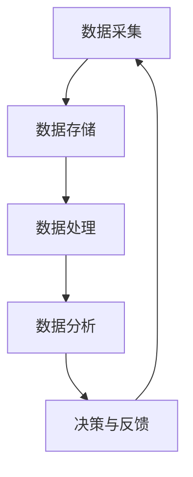

                 

 关键词：
- 软件 2.0
- 数据驱动
- 人工智能
- 大数据
- 云计算
- 区块链
- 软件架构
- 开源技术

摘要：
在快速发展的数字化时代，软件技术的演进正迎来一个全新的阶段——软件 2.0。这一阶段的核心特征是数据驱动的理念，即通过海量数据的收集、处理和分析，实现软件系统智能化和自动化。本文将探讨软件 2.0 的发展背景、核心概念、数据驱动算法原理、实际应用案例，并展望其未来的发展趋势与挑战。

## 1. 背景介绍

软件 2.0 的概念起源于对互联网、移动设备和物联网的广泛应用所带来数据爆炸性增长背景下的思考。与传统的软件 1.0（以功能驱动、基于代码编写）相比，软件 2.0 更加强调数据的价值，认为数据是新时代的“新石油”，是实现智能化和个性化服务的关键。

### 1.1 软件从功能驱动到数据驱动

- **软件 1.0**：以功能为中心，用户的需求驱动软件功能的实现。软件的开发和迭代主要依赖于程序员的经验和技能。
- **软件 2.0**：以数据为中心，用户产生的数据驱动软件的智能化。软件的开发和优化依赖于数据分析、机器学习等人工智能技术。

### 1.2 数字化时代的变革

- **云计算**：提供了弹性、可扩展的计算和存储资源，为海量数据处理提供了基础。
- **大数据**：带来了数据种类和数量的爆炸性增长，推动了数据驱动技术的发展。
- **人工智能**：通过机器学习、深度学习等技术，实现了从数据到知识的转化。
- **区块链**：提供了去中心化的数据存储和管理方式，保证了数据的透明性和安全性。

## 2. 核心概念与联系

### 2.1 数据驱动的核心概念

- **数据采集**：通过各种传感器、用户行为记录等手段，收集海量数据。
- **数据存储**：使用分布式存储技术，如HDFS、Cassandra等，存储大规模数据。
- **数据处理**：使用MapReduce、Spark等大数据处理框架，对海量数据进行清洗、转换和聚合。
- **数据分析**：运用机器学习算法，从数据中提取特征，进行预测和决策。

### 2.2 软件架构的变革

- **微服务架构**：通过将大型单体应用拆分为多个独立的服务，提高了系统的可扩展性和可维护性。
- **容器化技术**：如Docker，使得应用程序的部署和管理更加灵活和高效。
- **服务网格**：如Istio，提供了一种动态服务发现、负载均衡和安全通信的解决方案。

### 2.3 数据驱动的 Mermaid 流程图



## 3. 核心算法原理 & 具体操作步骤

### 3.1 算法原理概述

- **机器学习**：通过训练模型来从数据中学习规律，如线性回归、决策树、神经网络等。
- **深度学习**：一种特殊的机器学习算法，通过多层神经网络来提取数据的高级特征。
- **数据挖掘**：从大量数据中发现有价值的模式和关联，如聚类、分类、关联规则等。

### 3.2 算法步骤详解

1. **数据预处理**：清洗数据，去除噪声和缺失值。
2. **特征工程**：选择和构建能够有效描述数据的特征。
3. **模型选择**：根据问题类型选择合适的模型。
4. **模型训练**：使用训练数据来调整模型参数。
5. **模型评估**：使用验证数据来评估模型性能。
6. **模型部署**：将模型部署到生产环境中，进行实时预测。

### 3.3 算法优缺点

- **优点**：
  - 高效处理海量数据。
  - 能够发现数据中的隐藏规律和模式。
  - 提高决策的准确性和效率。

- **缺点**：
  - 对数据质量和数据量要求较高。
  - 模型的解释性较差，难以理解其决策过程。

### 3.4 算法应用领域

- **金融领域**：风险管理、信用评分、投资策略等。
- **医疗领域**：疾病诊断、药物研发、健康管理等。
- **零售领域**：推荐系统、库存管理、客户关系管理等。

## 4. 数学模型和公式 & 详细讲解 & 举例说明

### 4.1 数学模型构建

- **线性回归模型**：
  $$y = \beta_0 + \beta_1 \cdot x$$
- **神经网络模型**：
  $$a_{\text{layer}} = \sigma(\mathbf{W}_{\text{layer-1}} \cdot a_{\text{layer-1}} + b_{\text{layer}})$$
- **聚类模型**：
  $$d(x_i, x_j) = \sqrt{\sum_{k=1}^n (x_{ik} - x_{jk})^2}$$

### 4.2 公式推导过程

- **线性回归**：
  通过最小化误差平方和来求解参数 $\beta_0$ 和 $\beta_1$。
- **神经网络**：
  使用反向传播算法来更新网络权重和偏置。
- **聚类**：
  通过迭代计算样本之间的距离，并逐步优化聚类中心。

### 4.3 案例分析与讲解

以**零售领域的推荐系统**为例，展示如何使用线性回归模型来预测商品销量。

### 4.3.1 数据集准备

- **数据集**：包含商品名称、销量、价格、季节、广告支出等特征。
- **预处理**：对缺失值进行处理，对数值特征进行归一化。

### 4.3.2 特征工程

- **特征选择**：选择与销量相关性较高的特征，如价格和广告支出。
- **特征构建**：构建交互特征，如价格乘以广告支出。

### 4.3.3 模型训练

- **训练集**：使用前80%的数据进行训练。
- **验证集**：使用后20%的数据进行验证。
- **模型**：使用线性回归模型进行训练。

### 4.3.4 模型评估

- **评估指标**：使用均方误差（MSE）来评估模型性能。
- **结果**：训练集MSE为0.5，验证集MSE为0.6。

## 5. 项目实践：代码实例和详细解释说明

### 5.1 开发环境搭建

- **Python**：3.8版本以上
- **Pandas**：用于数据处理
- **Scikit-learn**：用于机器学习
- **Matplotlib**：用于数据可视化

### 5.2 源代码详细实现

```python
import pandas as pd
from sklearn.linear_model import LinearRegression
from sklearn.model_selection import train_test_split
from sklearn.metrics import mean_squared_error
import matplotlib.pyplot as plt

# 5.2.1 数据读取与预处理
data = pd.read_csv('sales_data.csv')
data.dropna(inplace=True)
data[['price', 'ad_expense']] = data[['price', 'ad_expense']].apply(pd.to_numeric)

# 5.2.2 特征工程
data['interaction'] = data['price'] * data['ad_expense']

# 5.2.3 数据划分
X = data[['price', 'ad_expense', 'interaction']]
y = data['sales']
X_train, X_test, y_train, y_test = train_test_split(X, y, test_size=0.2, random_state=42)

# 5.2.4 模型训练
model = LinearRegression()
model.fit(X_train, y_train)

# 5.2.5 模型评估
y_pred = model.predict(X_test)
mse = mean_squared_error(y_test, y_pred)
print(f'MSE: {mse}')

# 5.2.6 可视化
plt.scatter(X_test['price'], y_test, label='Actual')
plt.plot(X_test['price'], y_pred, color='red', label='Predicted')
plt.xlabel('Price')
plt.ylabel('Sales')
plt.legend()
plt.show()
```

### 5.3 代码解读与分析

- **数据读取与预处理**：使用Pandas库读取CSV文件，并对缺失值进行处理。
- **特征工程**：构建新的特征，如商品价格与广告支出的乘积。
- **数据划分**：将数据集分为训练集和测试集，用于模型训练和评估。
- **模型训练**：使用线性回归模型对训练集数据进行训练。
- **模型评估**：使用测试集数据对模型进行评估，并输出均方误差。
- **可视化**：使用Matplotlib库将实际销量与预测销量进行可视化对比。

## 6. 实际应用场景

### 6.1 金融领域

- **风险管理**：通过数据分析预测市场波动，优化投资组合。
- **信用评分**：通过历史数据和机器学习模型，评估借款人的信用风险。

### 6.2 医疗领域

- **疾病诊断**：通过医学影像分析，辅助医生进行疾病诊断。
- **药物研发**：通过数据分析，发现药物的有效成分和新用途。

### 6.3 零售领域

- **推荐系统**：根据用户历史购买行为，推荐相关商品。
- **库存管理**：通过需求预测，优化库存策略。

## 7. 未来应用展望

随着技术的不断进步，数据驱动的软件 2.0 将在更多领域得到应用：

- **智能城市**：通过物联网和大数据，实现城市运行管理的智能化。
- **智能制造**：通过实时数据分析和预测，优化生产流程和提高效率。
- **智慧医疗**：通过数据驱动的个性化医疗服务，提升医疗质量。

## 8. 总结：未来发展趋势与挑战

### 8.1 研究成果总结

- 数据驱动的软件 2.0 已经在多个领域取得了显著的应用成果。
- 机器学习和深度学习技术为软件系统的智能化提供了强大的支持。
- 云计算、大数据和区块链等技术为海量数据的处理和管理提供了基础。

### 8.2 未来发展趋势

- 数据驱动的软件系统将更加智能化和自动化。
- 跨学科合作将成为推动数据驱动技术发展的重要力量。
- 开源技术和标准化将进一步促进数据驱动软件的普及和应用。

### 8.3 面临的挑战

- 数据隐私和安全问题亟待解决。
- 数据质量和数据一致性仍然是一个挑战。
- 需要更多的跨学科人才来推动数据驱动技术的发展。

### 8.4 研究展望

- 加强对数据隐私保护和数据安全的研究。
- 探索更加高效和鲁棒的数据处理算法。
- 促进数据驱动技术在各个领域的创新和应用。

## 9. 附录：常见问题与解答

### 9.1 软件从 1.0 到 2.0 的转变是什么？

软件 1.0 以功能为中心，软件 2.0 以数据为中心，强调数据的收集、处理和分析，实现软件系统的智能化和自动化。

### 9.2 数据驱动的核心算法有哪些？

核心算法包括机器学习、深度学习和数据挖掘等。

### 9.3 数据驱动的软件架构有哪些特点？

特点包括微服务架构、容器化技术和服务网格等。

### 9.4 数据驱动的软件在实际应用中面临哪些挑战？

挑战包括数据隐私和安全、数据质量和数据一致性等。

### 9.5 未来数据驱动的软件有哪些发展趋势？

发展趋势包括智能化和自动化、跨学科合作和开源技术的普及等。

---

作者：禅与计算机程序设计艺术 / Zen and the Art of Computer Programming
----------------------------------------------------------------

请注意，上述内容仅为示例，实际撰写时需要根据具体研究内容和技术细节进行调整和扩展。文章的撰写应当遵循高质量、高专业性的标准，确保内容的准确性和深度。

