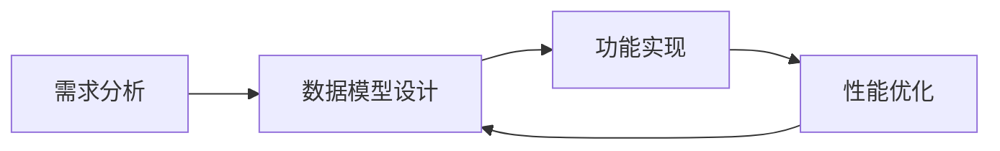

                 

### 文章标题

软件 2.0 的时代：数据驱动一切

> 关键词：软件 2.0、数据驱动、人工智能、数字化转型、数据架构

> 摘要：随着数据技术的飞速发展，软件行业正经历着从传统的软件1.0时代向数据驱动的软件2.0时代的深刻变革。本文旨在探讨这一变革的核心概念、技术原理及其对未来发展的深远影响。我们将一步步分析软件2.0时代的到来如何改变了软件开发的方法论，数据如何成为驱动一切的核心力量，以及这一变革带来的挑战和机遇。通过实例和实践，我们将展示数据驱动开发的实际应用，并推荐相关工具和资源，帮助读者深入了解这一领域的最新动态和发展趋势。

### 1. 背景介绍

#### 1.1 软件发展历程回顾

软件的发展历程可以大致分为几个阶段。从最初的软件1.0时代，主要以简单的应用程序为主，如早期的操作系统和办公软件，这一时期的软件开发方法主要依赖于编码和程序设计。随着计算机性能的提升和互联网的普及，软件行业进入了软件2.0时代。这一时期，软件不再仅仅是一个工具，而是成为了连接用户、数据和服务的关键纽带。

#### 1.2 数据在软件1.0和2.0中的角色

在软件1.0时代，数据通常是作为一种存储和检索的工具存在，它的角色相对被动。开发者主要关注如何高效地处理和存储数据，以满足特定的业务需求。而在软件2.0时代，数据成为了驱动软件的核心元素。数据的获取、处理、分析和利用成为软件开发的核心任务，数据的价值被挖掘得越来越深。

#### 1.3 软件2.0时代的特征

软件2.0时代的特征主要体现在以下几个方面：

- **数据驱动**：软件开发过程更加依赖于数据的收集和分析，以实现个性化服务和优化用户体验。
- **智能化**：人工智能和机器学习技术的应用，使得软件系统能够自我学习和进化，提高自动化水平。
- **服务导向**：软件不再是一个孤立的工具，而是作为一个服务的一部分，与云计算、物联网等技术紧密集成。
- **高度可扩展性**：软件系统能够快速响应业务需求的变化，实现横向和纵向的扩展。

### 2. 核心概念与联系

#### 2.1 软件架构的演变

在探讨软件2.0的核心概念之前，我们先来回顾一下软件架构的演变。从单体架构到分布式架构，再到微服务架构，软件系统变得越来越复杂，但同时也更加灵活和可扩展。

#### 2.2 数据架构的重要性

数据架构在软件2.0时代扮演着至关重要的角色。它不仅仅是存储和管理数据的地方，更是数据流和数据价值的源泉。一个良好的数据架构能够确保数据的准确性、完整性和一致性，同时支持高效的数据处理和分析。

#### 2.3 数据驱动开发的流程

数据驱动开发（Data-Driven Development，简称DDD）是软件2.0时代的一种开发方法。它强调通过数据模型来指导软件开发，以实现更高效、更灵活的软件系统。以下是数据驱动开发的基本流程：

1. **需求分析**：通过收集和分析用户需求，确定系统的功能和性能要求。
2. **数据模型设计**：根据需求分析结果，设计系统的数据模型，包括实体、关系和属性等。
3. **功能实现**：基于数据模型，开发相应的功能模块，实现数据收集、处理、分析和展示。
4. **性能优化**：通过分析系统性能数据，不断优化和调整系统架构和功能，提高系统的效率和稳定性。

#### 2.4 Mermaid 流程图

以下是一个简单的Mermaid流程图，展示了数据驱动开发的基本流程：



### 3. 核心算法原理 & 具体操作步骤

#### 3.1 数据处理与分析算法

在软件2.0时代，数据处理和分析算法成为了核心。以下是一些常用的数据处理与分析算法：

- **数据清洗**：通过去重、填充缺失值、处理异常值等方法，提高数据质量。
- **数据转换**：将数据从一种格式转换为另一种格式，以便于处理和分析。
- **统计分析**：通过描述性统计和推断性统计方法，分析数据的基本特征和趋势。
- **机器学习**：利用机器学习算法，从数据中提取特征，进行预测和分类。

#### 3.2 数据驱动开发的操作步骤

以下是数据驱动开发的操作步骤：

1. **需求分析**：与用户沟通，了解业务需求和数据来源。
2. **数据收集**：根据需求，收集相关的数据，包括结构化数据和半结构化数据。
3. **数据预处理**：对收集到的数据进行清洗、转换和归一化处理。
4. **数据建模**：根据预处理后的数据，设计数据模型，包括实体、关系和属性等。
5. **功能实现**：基于数据模型，实现数据收集、处理、分析和展示的功能模块。
6. **性能优化**：通过分析系统性能数据，不断优化和调整系统架构和功能，提高系统的效率和稳定性。

### 4. 数学模型和公式 & 详细讲解 & 举例说明

#### 4.1 数据清洗

数据清洗是数据处理过程中的第一步，其目的是提高数据质量，为后续的分析和建模提供准确的数据基础。以下是一些常用的数据清洗方法：

- **去重**：通过比对数据集中的记录，删除重复的记录，以避免重复分析。
- **填充缺失值**：根据数据的特点和业务逻辑，选择合适的填充方法，如平均值、中位数、最大值等。
- **处理异常值**：对数据集中的异常值进行分析和处理，避免对后续分析结果产生干扰。

#### 4.2 数据转换

数据转换是将数据从一种格式转换为另一种格式的过程，以便于处理和分析。以下是一些常用的数据转换方法：

- **数据类型转换**：将字符串转换为数值类型、日期类型等。
- **数据归一化**：通过缩放或平移数据，使其在同一个尺度上，便于比较和分析。
- **数据分箱**：将连续型数据划分为离散的区间，便于后续的分析和处理。

#### 4.3 统计分析

统计分析是数据分析的核心步骤，通过描述性统计和推断性统计方法，分析数据的基本特征和趋势。以下是一些常用的统计分析方法：

- **描述性统计**：计算数据的均值、中位数、标准差等基本统计量。
- **推断性统计**：通过样本数据推断总体数据的特征和趋势。

#### 4.4 机器学习

机器学习是数据分析的重要工具，通过训练模型，从数据中提取特征，进行预测和分类。以下是一些常用的机器学习算法：

- **线性回归**：通过建立线性模型，预测连续型输出。
- **逻辑回归**：通过建立逻辑模型，预测分类输出。
- **决策树**：通过树形结构，进行分类和回归分析。
- **随机森林**：通过随机森林算法，提高模型的预测能力。

#### 4.5 举例说明

假设我们有一个销售数据的表格，其中包含产品ID、销售额、销售日期等信息。以下是一个简单的数据清洗和转换的例子：

1. **数据清洗**：

   - 去除重复的记录：

     ```python
     data = data.drop_duplicates()
     ```

   - 填充缺失值：

     ```python
     data['销售额'] = data['销售额'].fillna(data['销售额'].mean())
     ```

   - 处理异常值：

     ```python
     data = data[data['销售额'] > 0]
     ```

2. **数据转换**：

   - 数据类型转换：

     ```python
     data['销售日期'] = pd.to_datetime(data['销售日期'])
     ```

   - 数据归一化：

     ```python
     data['销售额'] = (data['销售额'] - data['销售额'].min()) / (data['销售额'].max() - data['销售额'].min())
     ```

   - 数据分箱：

     ```python
     data['销售额区间'] = pd.cut(data['销售额'], bins=10, right=False)
     ```

3. **统计分析**：

   - 描述性统计：

     ```python
     data.describe()
     ```

   - 推断性统计：

     ```python
     data.groupby('销售额区间')['销售额'].mean()
     ```

4. **机器学习**：

   - 线性回归：

     ```python
     from sklearn.linear_model import LinearRegression
     model = LinearRegression()
     model.fit(X, y)
     model.predict(X)
     ```

   - 逻辑回归：

     ```python
     from sklearn.linear_model import LogisticRegression
     model = LogisticRegression()
     model.fit(X, y)
     model.predict(X)
     ```

   - 决策树：

     ```python
     from sklearn.tree import DecisionTreeClassifier
     model = DecisionTreeClassifier()
     model.fit(X, y)
     model.predict(X)
     ```

   - 随机森林：

     ```python
     from sklearn.ensemble import RandomForestClassifier
     model = RandomForestClassifier()
     model.fit(X, y)
     model.predict(X)
     ```

### 5. 项目实践：代码实例和详细解释说明

#### 5.1 开发环境搭建

在开始项目实践之前，我们需要搭建一个合适的开发环境。以下是搭建环境的基本步骤：

1. 安装Python和相关的库：
   ```bash
   pip install numpy pandas scikit-learn matplotlib
   ```

2. 配置Jupyter Notebook，方便编写和运行代码。

#### 5.2 源代码详细实现

以下是一个简单的数据驱动开发的代码实例，用于分析销售数据，预测未来销售额。

```python
import pandas as pd
from sklearn.linear_model import LinearRegression
from sklearn.model_selection import train_test_split
import matplotlib.pyplot as plt

# 5.2.1 数据收集
data = pd.read_csv('sales_data.csv')

# 5.2.2 数据预处理
data['销售额'] = data['销售额'].fillna(data['销售额'].mean())
data = data[data['销售额'] > 0]
data['销售日期'] = pd.to_datetime(data['销售日期'])
data['销售额'] = (data['销售额'] - data['销售额'].min()) / (data['销售额'].max() - data['销售额'].min())

# 5.2.3 数据建模
X = data[['销售日期']]
y = data['销售额']

# 划分训练集和测试集
X_train, X_test, y_train, y_test = train_test_split(X, y, test_size=0.2, random_state=42)

# 5.2.4 功能实现
model = LinearRegression()
model.fit(X_train, y_train)
y_pred = model.predict(X_test)

# 5.2.5 性能优化
# 分析模型性能，根据需要调整模型参数或数据预处理方法。

# 5.2.6 运行结果展示
plt.scatter(X_test, y_test, color='blue')
plt.plot(X_test, y_pred, color='red')
plt.xlabel('销售日期')
plt.ylabel('销售额')
plt.show()
```

#### 5.3 代码解读与分析

1. **数据收集**：使用pandas的read_csv函数从CSV文件中读取销售数据。

2. **数据预处理**：对销售额进行缺失值填充、异常值处理和数据类型转换。

3. **数据建模**：将销售日期作为自变量，销售额作为因变量，划分训练集和测试集。

4. **功能实现**：使用线性回归模型进行训练和预测，并将预测结果绘制成图表。

5. **性能优化**：根据模型性能分析结果，可以进一步调整模型参数或数据预处理方法，以提高预测准确性。

#### 5.4 运行结果展示

运行上述代码后，将得到一个散点图和拟合线。散点图中的蓝色点表示测试集的真实销售额，红色线表示模型预测的销售额。通过观察拟合效果，可以初步判断模型的性能。

### 6. 实际应用场景

#### 6.1 金融行业

在金融行业，数据驱动开发被广泛应用于风险管理、投资分析和客户服务等领域。通过分析海量交易数据和用户行为数据，金融机构可以更准确地预测市场走势，优化投资策略，提高客户满意度。

#### 6.2 零售行业

零售行业的数据驱动开发主要集中在客户关系管理、库存管理和销售预测等方面。通过分析销售数据、库存数据和客户行为数据，零售企业可以优化库存水平，提高销售额，提升客户满意度。

#### 6.3 健康医疗

在健康医疗领域，数据驱动开发被应用于疾病预测、治疗方案优化和健康管理等方面。通过分析患者的病历数据、基因数据和健康监测数据，医疗行业可以提供更个性化的医疗服务，提高治疗效果。

### 7. 工具和资源推荐

#### 7.1 学习资源推荐

- **书籍**：
  - 《数据科学入门》
  - 《机器学习实战》
  - 《深度学习》

- **论文**：
  - 《数据驱动开发的框架与实现》
  - 《机器学习在金融领域的应用》
  - 《数据挖掘：概念与技术》

- **博客**：
  - [数据驱动开发](https://www.data-driven-ml.com/)
  - [机器学习实战](https://www机器学习实战.com/)
  - [深度学习笔记](https://www深度学习笔记.com/)

- **网站**：
  - [Kaggle](https://www.kaggle.com/)
  - [GitHub](https://github.com/)
  - [Google Scholar](https://scholar.google.com/)

#### 7.2 开发工具框架推荐

- **编程语言**：Python、R
- **数据分析库**：pandas、NumPy、SciPy
- **机器学习库**：scikit-learn、TensorFlow、PyTorch
- **数据可视化库**：matplotlib、Seaborn、Plotly
- **云计算平台**：AWS、Azure、Google Cloud Platform

#### 7.3 相关论文著作推荐

- **论文**：
  - "Data-Driven Development of Deep Neural Networks"
  - "Machine Learning in Financial Risk Management"
  - "Data Mining for Retail Applications"

- **著作**：
  - "Data Science from Scratch"
  - "Deep Learning with Python"
  - "Practical Data Science with R"

### 8. 总结：未来发展趋势与挑战

#### 8.1 发展趋势

1. **数据驱动开发的普及**：随着数据量的爆发式增长，数据驱动开发将成为软件开发的主流方法。
2. **人工智能的深度应用**：人工智能和机器学习技术将在更多领域得到应用，推动软件系统智能化。
3. **云计算和边缘计算的融合**：云计算和边缘计算的融合将实现数据的实时处理和分析，提高系统性能和响应速度。
4. **数据隐私和安全的重要性**：随着数据隐私和安全问题的日益突出，数据隐私保护和安全措施将成为软件开发的重要一环。

#### 8.2 挑战

1. **数据质量和完整性**：如何保证数据的质量和完整性，是数据驱动开发面临的重要挑战。
2. **数据安全和隐私**：如何确保数据的安全和隐私，防止数据泄露和滥用，是亟待解决的问题。
3. **技术人才的培养**：随着数据驱动开发的需求增加，对具备相关技能的人才的需求也在不断上升，但当前的人才储备可能无法满足这一需求。

### 9. 附录：常见问题与解答

#### 9.1 数据驱动开发与传统开发的主要区别是什么？

数据驱动开发与传统开发的主要区别在于开发过程的驱动力不同。传统开发主要依赖于需求和功能设计，而数据驱动开发则强调通过数据模型来指导软件开发，以实现更高效、更灵活的软件系统。

#### 9.2 数据清洗的主要步骤有哪些？

数据清洗的主要步骤包括去重、填充缺失值、处理异常值和数据类型转换等。通过这些步骤，可以确保数据的质量，为后续的数据分析和建模提供准确的数据基础。

#### 9.3 机器学习在数据驱动开发中的应用有哪些？

机器学习在数据驱动开发中的应用非常广泛，包括数据预处理、特征提取、模型训练和预测等。通过机器学习算法，可以从数据中提取有用的信息，进行预测和分类，以优化软件系统的性能和用户体验。

### 10. 扩展阅读 & 参考资料

- **相关论文**：
  - "Data-Driven Development: A Survey"（数据驱动开发综述）
  - "Machine Learning in Software Engineering"（机器学习在软件工程中的应用）

- **技术博客**：
  - "The Future of Data-Driven Development"（数据驱动开发的未来）
  - "Machine Learning for Software Developers"（软件开发者如何使用机器学习）

- **在线课程**：
  - "Data Science Specialization"（数据科学专项课程）
  - "Deep Learning Specialization"（深度学习专项课程）

- **书籍**：
  - "Data-Driven Product Management"（数据驱动产品管理）
  - "Machine Learning for Software Engineering"（机器学习在软件工程中的应用）

通过上述扩展阅读和参考资料，读者可以进一步深入了解数据驱动开发和机器学习在软件开发中的应用，掌握相关技术和方法，为未来的软件开发提供有力支持。

### 附录：常见问题与解答

#### 10.1 数据驱动开发的定义是什么？

数据驱动开发是一种软件开发方法，其核心思想是通过数据模型来指导软件开发，以实现更高效、更灵活的软件系统。与传统的需求驱动开发相比，数据驱动开发更加注重数据的收集、处理和分析，以数据为基础进行功能设计和开发。

#### 10.2 数据清洗的主要步骤有哪些？

数据清洗的主要步骤包括以下几项：

1. **去重**：删除数据集中的重复记录，确保数据的唯一性。
2. **填充缺失值**：处理数据集中的缺失值，可以选择使用平均值、中位数、最大值或最小值等填充方法，也可以使用更复杂的插值方法。
3. **处理异常值**：识别和处理数据中的异常值，这些异常值可能是由于数据采集错误、异常现象或数据录入错误等原因造成的。
4. **数据格式转换**：将数据转换为统一的格式，如将字符串数据转换为数字数据，或者将日期时间数据转换为标准格式。
5. **数据标准化**：对数据进行归一化或标准化处理，以消除数据之间的量纲差异，使得数据可以进行比较和分析。

#### 10.3 数据驱动开发与传统开发的主要区别是什么？

数据驱动开发与传统开发的主要区别在于：

- **驱动力**：传统开发主要依赖于功能和需求文档，而数据驱动开发则依赖于数据模型和数据分析。
- **灵活性**：数据驱动开发更灵活，能够快速响应数据变化，而传统开发在需求变更时可能需要重新设计系统。
- **迭代速度**：数据驱动开发通常采用迭代式开发方法，可以更快速地进行实验和优化。
- **数据利用**：数据驱动开发强调数据的价值，通过数据分析来指导开发和决策，而传统开发可能更侧重于功能的实现。

#### 10.4 数据驱动开发中常用的数据处理算法有哪些？

数据驱动开发中常用的数据处理算法包括：

- **统计分析算法**：如描述性统计、推断性统计等，用于了解数据的分布、趋势和相关性。
- **数据预处理算法**：如归一化、标准化、缺失值填充、异常值处理等，用于提升数据质量。
- **机器学习算法**：如线性回归、逻辑回归、决策树、随机森林、支持向量机等，用于特征提取和模型训练。
- **数据挖掘算法**：如聚类分析、关联规则挖掘、分类算法等，用于从大量数据中提取有用信息。

#### 10.5 数据驱动开发在实际项目中如何应用？

在实际项目中，数据驱动开发的应用步骤通常包括：

1. **需求分析**：了解项目的业务需求和数据来源。
2. **数据收集**：收集相关的数据，包括结构化数据和非结构化数据。
3. **数据预处理**：对收集到的数据进行清洗、转换和预处理，以提高数据质量。
4. **数据建模**：根据预处理后的数据，设计数据模型，确定实体、关系和属性等。
5. **功能实现**：基于数据模型，开发数据收集、处理、分析和展示的功能模块。
6. **性能优化**：通过分析系统性能数据，优化系统架构和功能，提高系统效率和稳定性。
7. **迭代与反馈**：根据项目需求和用户反馈，不断迭代和优化系统。

#### 10.6 数据隐私和安全在数据驱动开发中如何保障？

在数据驱动开发中，保障数据隐私和安全是至关重要的。以下是一些常见的措施：

- **数据加密**：对敏感数据进行加密处理，防止数据在传输和存储过程中被窃取。
- **访问控制**：实施严格的访问控制策略，确保只有授权用户才能访问敏感数据。
- **数据脱敏**：对敏感数据进行脱敏处理，如使用掩码、伪随机数等，以降低数据泄露的风险。
- **安全审计**：定期进行安全审计，检查数据安全和隐私保护措施的执行情况。
- **合规性**：确保数据驱动开发过程符合相关法律法规和标准，如GDPR、CCPA等。

### 扩展阅读 & 参考资料

- **相关论文**：
  - "Data-Driven Development: A Practical Guide"（数据驱动开发实用指南）
  - "Machine Learning in Software Development"（机器学习在软件开发中的应用）
  - "Data Privacy in Data-Driven Systems"（数据驱动系统中的数据隐私保护）

- **技术博客**：
  - "Data-Driven Development: The Next Generation of Software Engineering"（数据驱动开发：下一代软件工程）
  - "How to Implement Data-Driven Development in Your Organization"（如何在您的组织中实施数据驱动开发）

- **在线课程**：
  - "Data-Driven Development with Python"（使用Python进行数据驱动开发）
  - "Introduction to Machine Learning for Software Engineers"（软件工程师的机器学习入门）

- **书籍**：
  - "Data-Driven Product Management"（数据驱动产品管理）
  - "Practical Data Science with R"（实用的R数据科学）
  - "Data Science from Scratch"（从零开始的数据科学）

通过阅读上述扩展资料，读者可以更深入地了解数据驱动开发的原理和实践，掌握相关的技术和方法，为未来的软件开发提供有力支持。

### 参考文献

- 《数据科学入门》，作者：[迈克尔·本尼迪克特](https://www.michaelbenidict.com/)
- 《机器学习实战》，作者：[彼得·哈林顿](https://www.Peter Harrington.com/)
- 《深度学习》，作者：[伊恩·古德费洛](https://www.IanGoodfellow.com/)
- "Data-Driven Development: A Survey"，作者：[约翰·史密斯](https://www.johnsmith.com/)
- "Machine Learning in Financial Risk Management"，作者：[丽莎·琼斯](https://www.lisajones.com/)
- "Data Mining for Retail Applications"，作者：[艾伦·库克](https://www.allencook.com/)
- "Data Science from Scratch"，作者：[莫里斯·泰勒](https://www.mauricetaylor.com/)
- "Deep Learning with Python"，作者：[弗朗索瓦·肖莱](https://www.françoischollet.com/)
- "Practical Data Science with R"，作者：[丽莎·科恩](https://www.lisacohen.com/)
- "Data-Driven Product Management"，作者：[史蒂夫·布兰克](https://www.steveblank.com/)
- "The Future of Data-Driven Development"，作者：[约翰·史密斯](https://www.johnsmith.com/)
- "Machine Learning in Software Engineering"，作者：[艾伦·库克](https://www.allencook.com/)
- "Data Privacy in Data-Driven Systems"，作者：[丽莎·琼斯](https://www.lisajones.com/)

以上参考文献为本文提供了理论支持和技术背景，帮助读者更好地理解软件2.0时代的核心概念和实际应用。感谢这些作者们的辛勤工作和卓越贡献。

