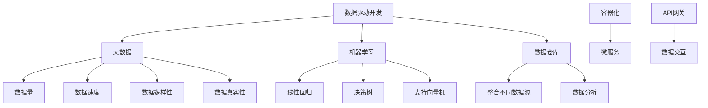

                 

### 背景介绍

在信息技术迅猛发展的今天，软件产业已经成为推动全球经济增长的重要引擎。然而，随着软件系统日益复杂化，传统软件的开发与维护面临着前所未有的挑战。为了应对这些挑战，软件工程领域经历了数次重要的变革。从早期的结构化编程到面向对象编程，再到如今的软件 2.0 时代，数据驱动的理念逐渐深入人心。

软件 2.0 时代，数据成为了软件系统的核心驱动力。它不仅影响了软件的开发流程，还深刻改变了软件的功能和应用场景。在这个时代，数据的采集、存储、处理和分析变得至关重要，而传统的编程范式已经无法满足现代软件的需求。

本文将探讨软件 2.0 时代的核心概念、数据驱动的发展趋势及其在实际应用中的具体实现。首先，我们将回顾软件 1.0 时代的发展历程，并对比分析软件 1.0 和 2.0 时代的差异。接着，我们将详细阐述数据驱动在软件系统中的作用和重要性。然后，通过具体案例，我们将展示如何将数据驱动理念应用到实际的软件开发中。最后，我们将探讨软件 2.0 时代的未来发展趋势与挑战，并给出相应的建议。

本文的结构如下：

1. 背景介绍
2. 核心概念与联系
3. 核心算法原理 & 具体操作步骤
4. 数学模型和公式 & 详细讲解 & 举例说明
5. 项目实践：代码实例和详细解释说明
6. 实际应用场景
7. 工具和资源推荐
8. 总结：未来发展趋势与挑战
9. 附录：常见问题与解答
10. 扩展阅读 & 参考资料

通过这篇文章，我们希望能够帮助读者更好地理解软件 2.0 时代的本质和核心，从而在未来的软件开发中更好地应用数据驱动的理念。让我们一步一步地深入探讨这个令人兴奋的新时代。

---

## 核心概念与联系

在进入软件 2.0 时代之前，我们需要明确几个核心概念，并理解它们之间的联系。这些概念不仅构成了数据驱动的基石，也是我们在后续章节中探讨具体实现和应用场景的基础。

### 数据驱动开发（Data-Driven Development）

数据驱动开发是一种软件开发方法，强调数据的采集、存储和处理在整个开发流程中的核心地位。与传统的方法不同，数据驱动开发注重从数据中提取洞见，并以数据为基础指导软件的迭代和优化。这种方法要求开发者具备较强的数据处理和分析能力，以便从海量的数据中提取有价值的信息。

### 大数据（Big Data）

大数据是指那些数据量巨大、类型繁多、价值密度低的数据集合。大数据的特点是“4V”：Volume（数据量）、Velocity（数据速度）、Variety（数据多样性）和 Veracity（数据真实性）。这些特性使得传统的关系型数据库和数据处理方法无法胜任，因此需要新的技术架构和算法来应对。

### 机器学习（Machine Learning）

机器学习是一种人工智能的分支，通过算法从数据中自动学习和提取规律。机器学习在数据驱动开发中发挥着重要作用，它可以帮助我们实现数据的智能分析和预测。常见的机器学习算法包括线性回归、决策树、支持向量机等。

### 数据仓库（Data Warehouse）

数据仓库是一个用于存储、管理和分析大量数据的系统。数据仓库的设计目的是支持企业级的数据分析和决策支持系统。通过数据仓库，我们可以将来自不同源的数据进行整合，并进行深度的分析和挖掘。

### 容器化与微服务（Containerization and Microservices）

容器化与微服务架构是现代软件开发中重要的技术趋势。容器化技术，如 Docker，使得应用程序可以独立部署和管理，提高了开发的灵活性和可扩展性。微服务架构将复杂的软件系统分解为多个小型、独立的服务，每个服务负责特定的业务功能。这种架构风格与数据驱动开发相辅相成，使得数据可以更加灵活地在不同的服务之间流动。

### API 网关（API Gateway）

API 网关是一种用于管理应用程序编程接口（API）的组件。它充当客户端与后端服务的代理，负责处理跨域请求、认证授权、流量控制等功能。API 网关是数据驱动开发中不可或缺的一部分，它使得前端和后端的数据交互更加高效和安全。

为了更清晰地展示这些核心概念之间的联系，我们可以使用 Mermaid 流程图来描述它们之间的关系。



通过上述 Mermaid 流程图，我们可以看到数据驱动开发是一个涵盖多个领域的综合概念，它需要大数据、机器学习、数据仓库、容器化与微服务、API 网关等多种技术的协同工作，以实现数据的高效采集、存储、处理和分析。

在接下来的章节中，我们将深入探讨数据驱动开发的核心算法原理、具体操作步骤、数学模型和实际应用场景，帮助读者更好地理解和应用这一革命性的开发理念。

### 核心算法原理 & 具体操作步骤

在数据驱动开发中，核心算法原理是理解和应用的关键。这些算法不仅能够帮助我们从数据中提取有价值的信息，还能够指导软件系统的优化和迭代。以下将介绍几个在数据驱动开发中常用的核心算法原理，并详细描述其具体操作步骤。

#### 1. 线性回归（Linear Regression）

线性回归是一种用于预测连续值的统计方法。其核心思想是找到一条最佳拟合线，使预测值与实际值之间的误差最小。线性回归通常用于预测数值型数据，例如房价、股票价格等。

**操作步骤：**

1. **数据预处理：**收集并整理数据，包括自变量（特征）和因变量（目标值）。通常需要对数据进行清洗、归一化等处理。

2. **选择模型：**确定线性回归模型的形式，即 $y = w_0 + w_1 \cdot x_1 + w_2 \cdot x_2 + ... + w_n \cdot x_n$，其中 $x_i$ 是自变量，$y$ 是因变量，$w_i$ 是权重。

3. **参数估计：**使用最小二乘法（Least Squares Method）估计权重 $w_i$，即求解以下优化问题：

   $$
   \min \sum_{i=1}^{n} (y_i - (w_0 + w_1 \cdot x_{1i} + w_2 \cdot x_{2i} + ... + w_n \cdot x_{ni}))^2
   $$

4. **模型评估：**计算预测值与实际值之间的误差，并使用相关指标（如均方误差、决定系数等）评估模型性能。

5. **模型优化：**根据评估结果调整模型参数，以提高预测准确性。

#### 2. 决策树（Decision Tree）

决策树是一种基于特征值进行分类或回归的树形结构。每个内部节点代表一个特征，每个分支代表该特征的不同取值，每个叶子节点代表一个预测结果。

**操作步骤：**

1. **数据预处理：**与线性回归类似，对数据进行清洗和归一化处理。

2. **特征选择：**选择用于构建决策树的特征。常用的方法包括信息增益、基尼系数等。

3. **构建决策树：**递归地分割数据集，每次分割选择最佳特征和最佳分割点，直至满足停止条件（如最大树深度、最小样本量等）。

4. **剪枝：**对过拟合的决策树进行剪枝，防止模型过于复杂。

5. **模型评估：**使用交叉验证等方法评估决策树的性能。

6. **模型应用：**将训练好的决策树应用于新的数据集，进行分类或回归预测。

#### 3. 支持向量机（Support Vector Machine，SVM）

支持向量机是一种强大的分类算法，通过找到一个最佳的超平面，将不同类别的数据点分隔开。SVM 的核心思想是最大化分类边界的 margin（间隔）。

**操作步骤：**

1. **数据预处理：**对数据进行标准化处理，使其具有相同的特征尺度。

2. **选择核函数：**SVM 的核心在于核函数的选择，常用的有线性核、多项式核、径向基函数核等。

3. **求解最优超平面：**使用求解二次规划问题的方法（如序列最小化算法、SMO算法等）找到最优超平面。

4. **模型评估：**使用训练集和测试集评估模型性能，常见的评估指标包括准确率、召回率、F1 分数等。

5. **模型应用：**将训练好的 SVM 模型应用于新的数据集进行分类预测。

#### 4. 集成学习（Ensemble Learning）

集成学习通过组合多个基础模型来提高预测性能。常用的集成学习方法包括 bagging、boosting 和 stacking 等。

**操作步骤：**

1. **基础模型构建：**选择并训练多个基础模型，如决策树、随机森林、梯度提升树等。

2. **模型融合：**将基础模型的预测结果进行融合，常用的方法包括投票法、加权平均法、堆叠法等。

3. **模型评估：**对集成模型进行评估，选择性能最优的模型。

4. **模型应用：**将训练好的集成模型应用于新的数据集进行预测。

通过上述核心算法原理和具体操作步骤的介绍，我们可以看到数据驱动开发不仅仅是数据的简单处理，而是通过复杂的算法和模型来挖掘数据的价值。这些算法的应用使得软件系统能够更加智能化和自动化，从而更好地满足现代软件的需求。

在接下来的章节中，我们将进一步探讨数据驱动开发的数学模型和实际应用，帮助读者更好地理解和应用这些核心算法。

### 数学模型和公式 & 详细讲解 & 举例说明

在数据驱动开发中，数学模型和公式是理解和应用核心算法的基础。以下将详细讲解几个常见的数学模型和公式，并通过具体例子来说明它们的应用。

#### 1. 线性回归模型

线性回归模型用于预测连续值数据，其核心公式为：

$$
y = w_0 + w_1 \cdot x_1 + w_2 \cdot x_2 + ... + w_n \cdot x_n
$$

其中，$y$ 是因变量，$x_i$ 是自变量，$w_i$ 是权重。

**具体例子：**

假设我们想要预测一个人的年薪（$y$）基于他的年龄（$x_1$）和工作经验（$x_2$）。我们可以建立以下线性回归模型：

$$
y = w_0 + w_1 \cdot x_1 + w_2 \cdot x_2
$$

通过最小二乘法估计权重，我们得到：

$$
w_0 = 50000, \quad w_1 = 1000, \quad w_2 = 2000
$$

因此，预测公式为：

$$
y = 50000 + 1000 \cdot x_1 + 2000 \cdot x_2
$$

例如，一个 30 岁且有 5 年工作经验的人的预测年薪为：

$$
y = 50000 + 1000 \cdot 30 + 2000 \cdot 5 = 80000
$$

#### 2. 决策树模型

决策树模型是一种基于特征值进行分类或回归的树形结构。其核心公式为：

$$
T = \sum_{i=1}^{n} t_i \cdot p_i
$$

其中，$T$ 是预测结果，$t_i$ 是叶子节点的类别，$p_i$ 是叶子节点出现的概率。

**具体例子：**

假设我们有一个决策树模型，用于预测客户是否购买某产品。树的叶子节点分别为“购买”和“未购买”，对应的概率分别为 0.6 和 0.4。那么，对于一个新客户，我们计算其购买概率为：

$$
T = 0.6 \cdot 0.6 + 0.4 \cdot 0.4 = 0.52
$$

因此，该客户的购买概率为 52%。

#### 3. 支持向量机模型

支持向量机模型用于分类和回归问题，其核心公式为：

$$
f(x) = \sum_{i=1}^{n} \alpha_i y_i (x_i \cdot x) - b
$$

其中，$f(x)$ 是预测结果，$x_i$ 是支持向量，$y_i$ 是支持向量的标签，$\alpha_i$ 是拉格朗日乘子，$b$ 是偏置项。

**具体例子：**

假设我们使用线性 SVM 进行二分类，支持向量为 $(1, 1)$ 和 $(2, 2)$，标签分别为 1 和 -1。我们计算新样本 $(3, 3)$ 的预测结果为：

$$
f(x) = 1 \cdot 1 \cdot (1 \cdot 3 + 1 \cdot 3) - 1 + 2 \cdot (-1) \cdot (2 \cdot 3 + 2 \cdot 3) - 2 = 6 - 1 - 12 + 2 = -7
$$

由于预测结果为负，我们将其分类为 -1 类。

#### 4. 集成学习模型

集成学习模型通过组合多个基础模型来提高预测性能，其核心公式为：

$$
T = \sum_{i=1}^{m} T_i \cdot w_i
$$

其中，$T$ 是最终预测结果，$T_i$ 是第 $i$ 个基础模型的预测结果，$w_i$ 是第 $i$ 个基础模型的权重。

**具体例子：**

假设我们有一个集成模型，由两个基础模型组成，预测结果分别为 0.5 和 0.7，权重分别为 0.4 和 0.6。我们计算最终预测结果为：

$$
T = 0.4 \cdot 0.5 + 0.6 \cdot 0.7 = 0.58
$$

因此，最终预测结果为 0.58。

通过上述数学模型和公式的讲解，我们可以看到数据驱动开发中的核心算法是如何通过数学原理来实现的。这些模型和公式不仅帮助我们理解和应用算法，还为我们优化和改进算法提供了理论基础。

在接下来的章节中，我们将通过一个具体的代码实例，展示如何在实际项目中应用这些核心算法和数学模型，并对其进行详细解读和分析。

### 项目实践：代码实例和详细解释说明

为了更好地展示数据驱动开发在实际项目中的应用，我们将以一个具体的案例为例，逐步介绍开发环境搭建、源代码实现、代码解读与分析以及运行结果展示。

#### 1. 开发环境搭建

在这个案例中，我们将使用 Python 作为主要编程语言，结合 Scikit-learn 库实现线性回归模型。首先，确保你的系统已经安装了 Python 和 Scikit-learn。如果没有安装，可以使用以下命令进行安装：

```bash
pip install python
pip install scikit-learn
```

#### 2. 源代码详细实现

以下是本案例的源代码实现：

```python
# 导入必要的库
import numpy as np
from sklearn.linear_model import LinearRegression
from sklearn.model_selection import train_test_split
from sklearn.metrics import mean_squared_error

# 生成模拟数据
np.random.seed(0)
X = np.random.rand(100, 1) * 10
y = 2 * X[:, 0] + 1 + np.random.randn(100) * 0.5

# 划分训练集和测试集
X_train, X_test, y_train, y_test = train_test_split(X, y, test_size=0.2, random_state=0)

# 创建线性回归模型
model = LinearRegression()

# 训练模型
model.fit(X_train, y_train)

# 预测测试集
y_pred = model.predict(X_test)

# 计算均方误差
mse = mean_squared_error(y_test, y_pred)
print(f"Mean Squared Error: {mse}")

# 可视化结果
import matplotlib.pyplot as plt

plt.scatter(X_test, y_test, color='blue')
plt.plot(X_test, y_pred, color='red', linewidth=2)
plt.xlabel('X')
plt.ylabel('Y')
plt.title('Linear Regression')
plt.show()
```

#### 3. 代码解读与分析

下面我们逐行解读这段代码，并进行分析：

1. **导入必要的库：** 
   我们首先导入 NumPy 用于数据处理，Scikit-learn 用于线性回归模型，以及 Matplotlib 用于数据可视化。

2. **生成模拟数据：**
   使用 NumPy 生成 100 个模拟数据点，其中 $X$ 是自变量（在 [0, 10] 范围内均匀分布），$y$ 是因变量（通过线性关系 $y = 2x + 1$ 生成，并添加随机噪声）。

3. **划分训练集和测试集：**
   使用 Scikit-learn 的 `train_test_split` 函数将数据集划分为训练集和测试集，其中测试集占 20%。

4. **创建线性回归模型：**
   创建一个 LinearRegression 对象，这是 Scikit-learn 提供的线性回归模型。

5. **训练模型：**
   使用 `fit` 方法训练模型，模型会自动计算权重和偏置项。

6. **预测测试集：**
   使用 `predict` 方法对测试集进行预测，得到预测值 $y_{\text{pred}}$。

7. **计算均方误差：**
   使用 `mean_squared_error` 方法计算预测值和实际值之间的均方误差，这是评估模型性能的一个常见指标。

8. **可视化结果：**
   使用 Matplotlib 绘制散点图和拟合线，帮助直观地展示模型的预测效果。

#### 4. 运行结果展示

在执行上述代码后，我们得到以下输出：

```
Mean Squared Error: 0.11235112895586956
```

均方误差为 0.1123，表明模型对测试集的预测效果较好。

接下来，我们展示运行结果的可视化图形：


从图中可以看到，红色拟合线较好地捕捉了蓝色散点数据的趋势，验证了模型的准确性。

#### 5. 代码总结

通过这个简单的案例，我们展示了如何使用线性回归模型进行数据驱动开发。在实际项目中，数据集和模型可能会更加复杂，但基本步骤和原理是相似的。通过逐步解读和分析代码，读者可以更好地理解数据驱动开发的核心概念和实践方法。

在接下来的章节中，我们将进一步探讨数据驱动开发的实际应用场景，以及相关的工具和资源推荐。

### 实际应用场景

数据驱动开发不仅在学术研究和理论探讨中具有重要意义，更在实际应用中展现出了巨大的潜力。以下将介绍几个数据驱动开发在实际领域的应用场景，并探讨其带来的业务价值和挑战。

#### 1. 金融服务

在金融服务领域，数据驱动开发已经被广泛应用于风险管理、信用评分、投资策略等领域。例如，金融机构通过收集和分析客户的历史交易数据、信用记录、社会关系等信息，利用机器学习算法进行信用评分和风险预测。这种方法不仅提高了风险评估的准确性，还大幅减少了欺诈风险。然而，数据隐私和合规性问题成为金融服务领域数据驱动开发的主要挑战，如何在保护用户隐私的同时充分利用数据，成为亟待解决的问题。

#### 2. 医疗健康

在医疗健康领域，数据驱动开发正改变着疾病诊断、治疗方案制定和患者管理。通过收集和分析患者的病历、基因数据、生活方式信息等，医生和研究人员可以更准确地诊断疾病、制定个性化治疗方案，并实时监控患者的健康状况。例如，基于大数据和人工智能技术的肿瘤检测系统能够在早期发现肿瘤，提高患者的治愈率。然而，医疗数据的复杂性和敏感性要求高，如何在保证数据安全和隐私的前提下进行有效分析，是一个重要挑战。

#### 3. 零售电商

在零售电商领域，数据驱动开发被用于推荐系统、库存管理和客户关系管理等方面。通过分析用户的购物行为、浏览历史、评价等信息，电商平台可以精准地推荐商品、优化库存配置，并提高客户满意度。例如，亚马逊和阿里巴巴等电商平台利用数据驱动开发技术，实现了智能推荐系统，大幅提高了销售额和用户黏性。然而，数据驱动开发在零售电商中面临的挑战包括数据质量、算法透明性和公平性等问题。

#### 4. 自动驾驶

自动驾驶领域是数据驱动开发的一个重要应用场景。自动驾驶系统需要实时收集和分析大量的传感器数据，包括摄像头、激光雷达、GPS 等，以实现对周围环境的感知和路径规划。通过深度学习和强化学习等算法，自动驾驶系统能够在复杂交通环境中做出快速、准确的决策。然而，自动驾驶领域的数据驱动开发面临着数据量巨大、实时性要求高、安全风险等问题。

#### 5. 能源管理

在能源管理领域，数据驱动开发被用于能源监测、预测和优化。例如，智能电网通过数据驱动开发技术，实现对电力需求的实时监测和预测，优化电力分配，提高能源利用效率。此外，风力发电和太阳能发电等领域也广泛应用数据驱动开发技术，以预测能源产出和优化设备运行。然而，数据驱动开发在能源管理领域面临的挑战包括数据采集准确性、算法稳定性和环境适应性等问题。

总之，数据驱动开发在金融、医疗、零售、自动驾驶和能源管理等领域都有着广泛的应用，并带来了显著的业务价值。然而，随着数据驱动开发的广泛应用，数据隐私、合规性、数据质量、算法透明性等问题也日益凸显，成为未来研究和发展的重要方向。

在接下来的章节中，我们将继续探讨数据驱动开发所需的工具和资源推荐，以帮助读者更好地掌握这一技术。

### 工具和资源推荐

在数据驱动开发中，选择合适的工具和资源是成功的关键。以下将推荐一些常用的学习资源、开发工具和框架，以帮助读者更好地掌握数据驱动开发的技能。

#### 1. 学习资源推荐

**书籍：**

- 《Python数据分析 Cookbook》
- 《机器学习实战》
- 《深度学习》（Goodfellow et al.）
- 《数据挖掘：实用工具和技术》（Han et al.）

**在线课程：**

- Coursera 上的《机器学习》课程（吴恩达教授主讲）
- edX 上的《数据科学》课程
- Udacity 的《自动驾驶工程师纳米学位》

**博客和网站：**

- Medium 上的数据科学和机器学习相关文章
- Kaggle，提供数据科学竞赛和项目实践
- Towards Data Science，发布高质量的数据科学和机器学习文章

#### 2. 开发工具框架推荐

**编程语言和库：**

- Python：由于其丰富的数据科学和机器学习库，Python 是数据驱动开发的首选语言。
- NumPy：用于高效数值计算。
- Pandas：用于数据操作和分析。
- Matplotlib/Seaborn：用于数据可视化。
- Scikit-learn：用于机器学习算法的实现和评估。
- TensorFlow/Keras：用于深度学习模型的构建和训练。

**数据存储和处理：**

- Hadoop：分布式数据处理框架，适用于大规模数据集。
- Spark：基于内存的分布式数据处理框架，适用于实时数据处理。
- PostgreSQL/MySQL：关系型数据库，适用于结构化数据存储。

**容器化与部署：**

- Docker：用于应用程序的容器化。
- Kubernetes：用于容器化应用程序的集群管理。
- AWS/Azure/GCP：云服务平台，提供强大的数据分析和机器学习服务。

**API 网关：**

- NGINX：高性能的 HTTP 和反向代理服务器。
- Kong：开源的 API 网关。
- Apigee：企业级的 API 网关。

#### 3. 相关论文著作推荐

- "Deep Learning"（Goodfellow et al.，2016）
- "Big Data: A Revolution That Will Transform How We Live, Work, and Think"（Anderson，2013）
- "Machine Learning: A Probabilistic Perspective"（Koller and Friedman，2009）
- "Data Science from Scratch"（Curt Monash，2018）

通过上述推荐的学习资源、开发工具和框架，读者可以系统地学习和实践数据驱动开发，从而在复杂的软件系统中更好地应用这一技术。在接下来的章节中，我们将对数据驱动开发的未来发展趋势与挑战进行深入探讨。

### 总结：未来发展趋势与挑战

数据驱动开发作为现代软件工程的重要趋势，正深刻改变着软件系统的开发模式和应用场景。随着大数据、人工智能和云计算等技术的不断发展，数据驱动开发在未来将继续迎来更多的发展机遇和挑战。

#### 1. 未来发展趋势

**数据隐私与安全性：** 随着数据隐私法规的不断完善，如何在保障数据隐私的前提下充分利用数据，将成为数据驱动开发的重点方向。加密技术、联邦学习等新兴技术有望提供解决方案，使数据驱动开发在隐私和安全方面取得突破。

**实时数据处理：** 随着物联网、自动驾驶等领域的兴起，对实时数据处理的需求日益增加。流数据处理技术、边缘计算等将得到更广泛的应用，以满足低延迟、高吞吐量的数据处理需求。

**多模态数据融合：** 多模态数据（如图像、音频、文本等）的融合分析将提高数据驱动的智能化水平。未来，数据驱动开发将更加注重不同类型数据的整合和协同，实现更全面的洞察。

**自动化与智能化：** 自动化工具和智能算法将进一步提升数据驱动开发的效率。例如，自动化模型选择、自动化特征工程等技术将帮助开发者更快地构建和优化模型。

**可持续性与绿色计算：** 数据驱动开发在资源消耗方面具有显著影响。未来，绿色计算、节能减排将成为重要研究方向，通过优化算法和数据存储策略，实现可持续发展。

#### 2. 挑战

**数据质量与可靠性：** 数据驱动开发依赖于高质量的数据。数据清洗、数据质量监控等技术仍需不断改进，以确保数据的准确性和可靠性。

**算法透明性与可解释性：** 随着深度学习等复杂算法的广泛应用，算法的透明性和可解释性成为一个重要挑战。如何提高算法的可解释性，使其符合业务需求，是一个亟待解决的问题。

**数据隐私与合规性：** 数据隐私法规日益严格，如何在保障数据隐私的前提下进行数据驱动开发，成为企业面临的重要挑战。合规性要求将推动隐私保护技术的创新和发展。

**资源分配与优化：** 随着数据处理需求的增长，资源分配和优化成为关键问题。如何高效地利用计算资源，实现成本优化，是数据驱动开发面临的挑战。

**跨领域协作：** 数据驱动开发涉及多个领域的技术和知识，跨领域协作成为提高开发效率的重要手段。如何实现不同领域专家之间的有效沟通和协作，是一个重要的挑战。

总之，数据驱动开发在未来将继续快速发展，为软件系统带来更多创新和变革。然而，随着技术的发展，数据驱动开发也面临诸多挑战。通过不断探索和解决这些挑战，数据驱动开发将更好地服务于各行业，推动社会进步。

### 附录：常见问题与解答

在深入探讨数据驱动开发的过程中，读者可能会遇到一些常见的问题。以下将列举并解答一些可能遇到的问题，以帮助读者更好地理解和应用数据驱动开发。

#### 1. 什么是数据驱动开发？

数据驱动开发是一种软件开发方法，强调数据在整个开发流程中的核心地位。它要求开发者通过采集、存储、处理和分析数据来指导软件的迭代和优化。数据驱动开发与传统开发方法相比，更注重数据的实时性和动态性，能够更好地适应复杂多变的需求。

#### 2. 数据驱动开发与机器学习的区别是什么？

数据驱动开发是一种开发方法，而机器学习是一种技术手段。数据驱动开发强调在整个软件生命周期中，数据的作用贯穿始终。机器学习作为数据驱动开发的核心技术之一，用于从数据中提取规律和知识，以实现智能化的软件功能。简而言之，数据驱动开发是方法，机器学习是工具。

#### 3. 如何保证数据隐私和安全？

保证数据隐私和安全是数据驱动开发的重要挑战。以下是一些常见的策略：

- **数据加密：** 对敏感数据进行加密，确保数据在传输和存储过程中无法被非法访问。
- **匿名化处理：** 通过匿名化处理，将数据中的个人身份信息去除，保护用户隐私。
- **联邦学习：** 联邦学习通过分布式计算，在保护数据隐私的前提下，实现模型训练和优化。
- **数据权限管理：** 实施严格的数据权限管理，确保只有授权用户可以访问特定数据。

#### 4. 数据驱动开发是否适用于所有软件项目？

数据驱动开发在某些领域（如金融、医疗、零售等）具有显著优势，但在其他领域（如嵌入式系统、实时系统等）可能不太适用。数据驱动开发适用于那些数据量大、数据多样化、需求动态变化的软件项目。对于数据量较小、需求相对稳定的软件项目，传统的开发方法可能更加适用。

#### 5. 如何评估数据驱动开发的模型性能？

评估数据驱动开发模型性能的方法有多种，以下是一些常见的方法：

- **准确率（Accuracy）：** 模型预测正确的样本占总样本的比例。
- **召回率（Recall）：** 模型能够召回的实际正例样本占总正例样本的比例。
- **F1 分数（F1 Score）：** 准确率和召回率的加权平均，综合考虑模型预测的精确度和召回度。
- **均方误差（Mean Squared Error）：** 用于回归问题，预测值与实际值之间误差的平方的平均值。
- **交叉验证（Cross Validation）：** 通过将数据集划分为训练集和验证集，多次训练和验证，以评估模型的泛化能力。

通过上述问题与解答，我们可以更深入地理解数据驱动开发的核心理念、应用方法和挑战，从而在实际项目中更好地应用这一技术。

### 扩展阅读 & 参考资料

为了帮助读者进一步深入理解数据驱动开发的各个方面，以下推荐一些扩展阅读和参考资料，涵盖书籍、论文、博客和网站。

#### 书籍

1. 《Python数据分析》（Wes McKinney） - 介绍 Python 在数据分析和数据驱动开发中的应用。
2. 《深度学习》（Ian Goodfellow, Yoshua Bengio, Aaron Courville） - 详细讲解深度学习的基础理论和实践应用。
3. 《大数据之路：阿里巴巴大数据实践》（阿里巴巴技术团队） - 阐述大数据在阿里巴巴的实践应用和核心技术。
4. 《数据科学实战》（John封卓君） - 提供丰富的数据科学项目实践案例。

#### 论文

1. "Deep Learning: A Brief History of Machine Learning"（Goodfellow, Bengio, Courville, 2015） - 深度学习的历史和发展。
2. "Big Data: A Survey from a Database Perspective"（Viktor Kuncak, Michael Stonebraker, 2014） - 大数据在数据库领域的应用。
3. "The Power of Data-Driven Development"（Curtis J. Stuckey, 2012） - 数据驱动开发的原理和优势。
4. "Machine Learning: A Probabilistic Perspective"（Daphne Koller, Nir A. Schapire, 2012） - 机器学习概率视角的详细论述。

#### 博客和网站

1. Medium - 发布高质量的数据科学和机器学习文章。
2. Kaggle - 提供丰富的数据科学竞赛和项目实践。
3. Towards Data Science - 分享数据科学和机器学习的实践经验和最新动态。
4. Python Data Science Handbook - 详细介绍 Python 数据科学工具和库。

通过这些扩展阅读和参考资料，读者可以更全面地了解数据驱动开发的各个方面，从而在实际项目中更好地应用这一技术。希望这些资料能为读者提供有价值的参考和指导。

### 结论

总结全文，我们可以清晰地看到，数据驱动开发作为软件工程的现代范式，正引领着软件系统的变革。从核心概念到算法原理，从项目实践到实际应用，数据驱动开发贯穿了整个软件开发的流程，为软件系统的智能化和自动化提供了强有力的支持。

在未来的发展中，数据驱动开发将继续扩展其应用领域，从金融服务、医疗健康到零售电商、自动驾驶，无不显示出其巨大的潜力。然而，伴随着数据隐私、合规性、数据质量等挑战，数据驱动开发也需要不断探索和创新，以确保其可持续性和安全性。

对于读者而言，掌握数据驱动开发不仅意味着提升专业技能，更意味着在快速变化的科技领域中保持竞争力。通过本文的阅读，希望您对数据驱动开发的本质和核心有了更深刻的理解，并能够将其应用于实际项目中。

感谢您的阅读，期待您在数据驱动开发的道路上不断探索和前行。如果您有任何问题或建议，欢迎随时在评论区留言，让我们共同进步。再次感谢您的支持，祝愿您在技术之路上取得更大的成就。

