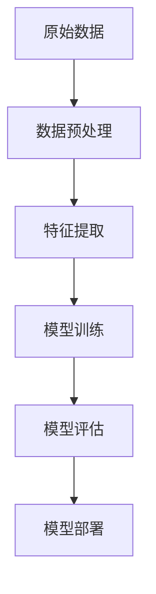
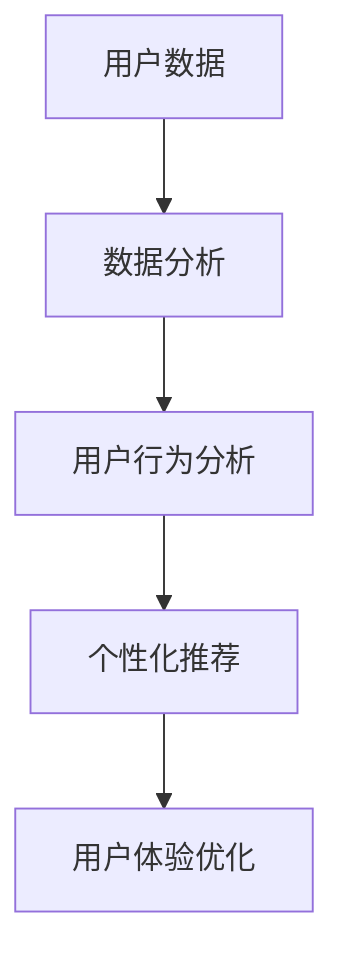
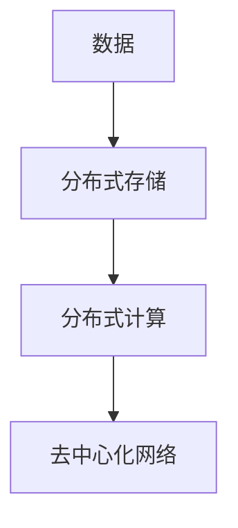
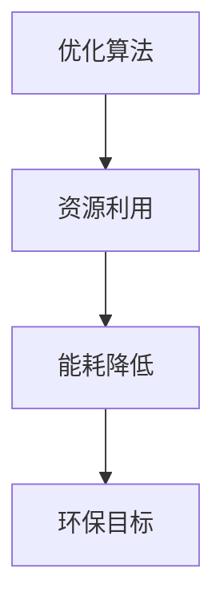
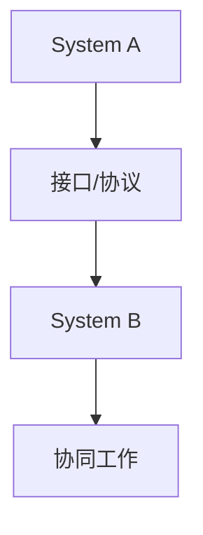

                 

### 1. 背景介绍

#### 1.1 软件的发展历程

软件作为计算机科学的核心组成部分，随着计算机技术的发展而不断演进。从20世纪50年代的第一台计算机问世，到20世纪60年代的批量生产，再到20世纪70年代的个人计算机普及，以及21世纪初的互联网时代，软件在人类社会中的地位日益重要。

早期软件主要注重于计算机硬件的兼容性和基本功能的实现。随着时间推移，软件逐渐从机械的编程操作转变为更加智能化和自动化的过程。20世纪80年代，面向对象编程的兴起，使得软件设计和开发变得更加模块化和可维护。20世纪90年代，互联网的普及带来了Web应用程序和云计算的快速发展，软件应用的范围和深度都得到了极大的扩展。

进入21世纪，随着人工智能、大数据、物联网等新兴技术的崛起，软件再次迎来了前所未有的变革。这些技术的融合和运用，不仅改变了软件开发的模式，也推动了软件向更智能化、自主化、去中心化的方向发展。这一系列变化为软件2.0时代的到来奠定了基础。

#### 1.2 软件1.0到软件2.0的过渡

软件1.0时代主要特点是功能导向，软件设计以实现特定功能为主，往往关注的是系统性能和效率。而软件2.0时代，则更加注重用户体验和系统智能化。这一过渡不仅是技术层面的升级，更是思维模式的转变。

软件1.0时代，软件的交付和使用往往是线性的，即用户按照既定的流程进行操作，而软件2.0时代，软件与用户之间的交互变得更加灵活和智能化。例如，通过人工智能技术，软件可以自动学习用户的偏好和行为模式，从而提供更加个性化的服务。

此外，软件2.0时代强调的是去中心化和分布式计算。在软件1.0时代，系统往往是集中式的，数据存储和处理集中在少数几台服务器上。而软件2.0时代，通过分布式计算和区块链技术，可以实现数据的去中心化存储和处理，提高系统的安全性和可靠性。

#### 1.3 软件2.0的特点

软件2.0的特点可以归纳为以下几个方面：

1. **智能化**：软件2.0强调人工智能技术的应用，通过机器学习和深度学习，软件能够自动学习和优化，提供更加智能化的服务。

2. **个性化**：软件2.0注重用户体验，通过用户数据的收集和分析，提供个性化的服务，满足用户的个性化需求。

3. **去中心化**：通过区块链和分布式计算技术，软件2.0实现了数据存储和处理的去中心化，提高了系统的安全性和可靠性。

4. **可持续性**：软件2.0强调可持续性和环保，通过优化算法和资源利用，减少能源消耗和碳排放。

5. **互操作性**：软件2.0强调不同系统之间的互操作性，通过标准化的接口和协议，实现不同系统之间的无缝连接和协同工作。

### 2. 核心概念与联系

#### 2.1 智能化

智能化是软件2.0的核心特征之一。它涉及到人工智能、机器学习、自然语言处理、计算机视觉等多个领域。智能化软件能够通过学习和适应环境，提供更加高效和准确的服务。

**Mermaid 流程图：**



#### 2.2 个性化

个性化是软件2.0的另一个核心特征。通过收集和分析用户数据，软件可以提供个性化的推荐、服务和建议。这要求软件具备强大的数据分析和处理能力。

**Mermaid 流程图：**



#### 2.3 去中心化

去中心化是软件2.0在技术层面的重要特征。通过区块链和分布式计算技术，软件可以实现数据存储和处理的去中心化，提高系统的安全性和可靠性。

**Mermaid 流程图：**



#### 2.4 可持续性

可持续性是软件2.0对社会责任的体现。通过优化算法和资源利用，软件2.0可以减少能源消耗和碳排放，实现环保和可持续发展的目标。

**Mermaid 流程图：**



#### 2.5 互操作性

互操作性是软件2.0在系统架构层面的重要特征。通过标准化的接口和协议，不同系统之间可以实现无缝连接和协同工作。

**Mermaid 流程图：**



### 3. 核心算法原理 & 具体操作步骤

#### 3.1 智能化算法

智能化算法是软件2.0的核心，它主要包括机器学习和深度学习算法。以下是一个简单的机器学习算法——线性回归的原理和操作步骤：

**原理：**

线性回归是一种用于预测数值型变量的统计方法。其基本思想是通过找到一条最佳拟合直线，来预测新的数据点的数值。

**操作步骤：**

1. **数据收集**：收集具有目标变量和特征的数据集。

2. **数据预处理**：对数据集进行清洗和预处理，包括缺失值处理、异常值处理、特征工程等。

3. **模型训练**：使用训练集数据，通过最小二乘法或其他优化算法，找到最佳拟合直线。

4. **模型评估**：使用验证集或测试集，评估模型的预测性能。

5. **模型部署**：将训练好的模型部署到生产环境中，进行实时预测。

#### 3.2 个性化算法

个性化算法是软件2.0提供个性化服务的关键。以下是一种简单的基于协同过滤的推荐算法原理和操作步骤：

**原理：**

协同过滤算法通过分析用户的行为和偏好，为用户提供个性化的推荐。它分为基于用户和基于物品两种类型。

**操作步骤：**

1. **数据收集**：收集用户行为数据，如浏览记录、购买记录、评价记录等。

2. **数据预处理**：对数据集进行清洗和预处理，提取用户和物品的特征。

3. **模型训练**：使用训练集数据，通过矩阵分解或其他算法，找到用户和物品的隐含特征。

4. **模型评估**：使用验证集或测试集，评估模型的推荐性能。

5. **模型部署**：将训练好的模型部署到生产环境中，进行实时推荐。

#### 3.3 去中心化算法

去中心化算法是实现数据去中心化的关键技术。以下是一个简单的区块链算法原理和操作步骤：

**原理：**

区块链是一种分布式数据库，通过加密算法和共识机制，实现数据的去中心化存储和处理。

**操作步骤：**

1. **数据收集**：收集需要存储的数据。

2. **数据加密**：对数据进行加密处理，确保数据安全。

3. **区块生成**：将加密后的数据生成区块。

4. **链式结构**：通过链接新区块到原有链上，形成链式结构。

5. **共识机制**：通过共识算法，确保链的合法性和一致性。

6. **数据验证**：对数据区块进行验证，确保数据的真实性和完整性。

7. **数据访问**：通过节点进行数据访问，实现去中心化的数据处理。

#### 3.4 可持续性算法

可持续性算法是实现软件2.0可持续性目标的关键。以下是一种简单的能耗优化算法原理和操作步骤：

**原理：**

能耗优化算法通过优化算法和资源利用，实现能耗的降低。

**操作步骤：**

1. **数据收集**：收集系统运行时的能耗数据。

2. **数据预处理**：对能耗数据进行清洗和预处理。

3. **模型训练**：使用训练集数据，通过优化算法，找到最优的能耗配置。

4. **模型评估**：使用验证集或测试集，评估模型的能耗优化性能。

5. **模型部署**：将训练好的模型部署到生产环境中，实现实时能耗优化。

### 4. 数学模型和公式 & 详细讲解 & 举例说明

#### 4.1 线性回归模型

线性回归模型是智能化算法中的一种基础模型。其核心思想是通过寻找一条最佳拟合直线，来预测新的数据点的数值。

**公式：**

$$y = w_1x_1 + w_2x_2 + ... + w_nx_n + b$$

其中，$y$ 是预测的数值，$x_1, x_2, ..., x_n$ 是特征值，$w_1, w_2, ..., w_n$ 是权重，$b$ 是偏置。

**详细讲解：**

线性回归模型的目的是通过已知的特征值和预测值，来计算权重和偏置，从而建立最佳拟合直线。

1. **数据收集**：收集具有目标变量和特征的数据集。

2. **数据预处理**：对数据集进行清洗和预处理，包括缺失值处理、异常值处理、特征工程等。

3. **模型训练**：使用训练集数据，通过最小二乘法或其他优化算法，找到最佳拟合直线。

4. **模型评估**：使用验证集或测试集，评估模型的预测性能。

5. **模型部署**：将训练好的模型部署到生产环境中，进行实时预测。

**举例说明：**

假设我们有一个简单的线性回归模型，用于预测房价。已知特征有房子的面积和房龄，预测值为房价。

$$房价 = w_1 \times 面积 + w_2 \times 房龄 + b$$

通过收集房屋的面积、房龄和房价数据，我们可以使用线性回归模型来预测新的房屋的房价。

#### 4.2 协同过滤模型

协同过滤模型是个性化算法中的一种基础模型。其核心思想是通过分析用户的行为和偏好，为用户提供个性化的推荐。

**公式：**

$$R_{ij} = u_i \cdot v_j + \mu$$

其中，$R_{ij}$ 是用户 $i$ 对物品 $j$ 的评分，$u_i$ 和 $v_j$ 是用户 $i$ 和物品 $j$ 的隐含特征，$\mu$ 是平均评分。

**详细讲解：**

协同过滤模型的目的是通过已知的用户和物品评分，来计算隐含特征，从而预测新的评分。

1. **数据收集**：收集用户行为数据，如浏览记录、购买记录、评价记录等。

2. **数据预处理**：对数据集进行清洗和预处理，提取用户和物品的特征。

3. **模型训练**：使用训练集数据，通过矩阵分解或其他算法，找到用户和物品的隐含特征。

4. **模型评估**：使用验证集或测试集，评估模型的推荐性能。

5. **模型部署**：将训练好的模型部署到生产环境中，进行实时推荐。

**举例说明：**

假设我们有一个简单的协同过滤模型，用于预测用户对电影的评分。已知用户的行为有浏览记录和评分记录，预测值为用户对电影的评分。

$$用户对电影的评分 = u_i \cdot v_j + \mu$$

通过收集用户的浏览记录和评分记录，我们可以使用协同过滤模型来预测用户对新的电影的评分。

#### 4.3 区块链模型

区块链模型是去中心化算法中的一种基础模型。其核心思想是通过加密算法和共识机制，实现数据的去中心化存储和处理。

**公式：**

$$区块链 = [区块1, 区块2, ..., 区块n]$$

其中，每个区块包含一个时间戳、一个交易列表和一个随机数。

**详细讲解：**

区块链模型的目的是通过加密算法和共识机制，确保数据的去中心化存储和处理。

1. **数据收集**：收集需要存储的数据。

2. **数据加密**：对数据进行加密处理，确保数据安全。

3. **区块生成**：将加密后的数据生成区块。

4. **链式结构**：通过链接新区块到原有链上，形成链式结构。

5. **共识机制**：通过共识算法，确保链的合法性和一致性。

6. **数据验证**：对数据区块进行验证，确保数据的真实性和完整性。

7. **数据访问**：通过节点进行数据访问，实现去中心化的数据处理。

**举例说明：**

假设我们有一个简单的区块链模型，用于存储交易数据。已知交易数据有交易金额和交易时间，我们需要将这些数据存储在区块链上。

$$区块链 = [区块1, 区块2, ..., 区块n]$$

每个区块包含一个时间戳、一个交易列表和一个随机数。通过收集交易数据，我们可以将这些数据加密后生成区块，并链接到区块链上。

#### 4.4 能耗优化模型

能耗优化模型是可持续性算法中的一种基础模型。其核心思想是通过优化算法和资源利用，实现能耗的降低。

**公式：**

$$能耗 = f(算法, 资源)$$

其中，$能耗$ 是系统的能耗，$算法$ 是算法，$资源$ 是资源。

**详细讲解：**

能耗优化模型的目的是通过优化算法和资源利用，实现能耗的降低。

1. **数据收集**：收集系统运行时的能耗数据。

2. **数据预处理**：对能耗数据进行清洗和预处理。

3. **模型训练**：使用训练集数据，通过优化算法，找到最优的能耗配置。

4. **模型评估**：使用验证集或测试集，评估模型的能耗优化性能。

5. **模型部署**：将训练好的模型部署到生产环境中，实现实时能耗优化。

**举例说明：**

假设我们有一个简单的能耗优化模型，用于优化计算资源的利用。已知系统的能耗与算法和资源有关，我们需要通过优化算法和资源利用，实现能耗的降低。

$$能耗 = f(算法, 资源)$$

通过收集系统运行时的能耗数据，我们可以使用能耗优化模型来优化计算资源的利用，从而实现能耗的降低。

### 5. 项目实践：代码实例和详细解释说明

#### 5.1 开发环境搭建

为了实践软件2.0的核心算法，我们首先需要搭建一个合适的开发环境。以下是搭建环境的步骤：

1. **安装Python**：Python是一种广泛使用的编程语言，许多智能算法和工具都基于Python开发。在官网上下载并安装Python。

2. **安装Jupyter Notebook**：Jupyter Notebook是一种交互式的开发环境，便于编写和运行代码。可以通过pip命令安装。

   ```bash
   pip install notebook
   ```

3. **安装必要的库**：根据需要实践的算法，安装相应的库。例如，线性回归算法需要`scikit-learn`库，协同过滤算法需要`numpy`和`pandas`库。

   ```bash
   pip install scikit-learn numpy pandas
   ```

4. **配置IDE**：可以选择安装PyCharm、Visual Studio Code等IDE，以提供更好的开发体验。

#### 5.2 源代码详细实现

以下是一个简单的线性回归模型的Python代码实现：

```python
import numpy as np
from sklearn.linear_model import LinearRegression

# 数据收集
X = np.array([[1, 2], [2, 3], [3, 4], [4, 5]])
y = np.array([3, 4, 5, 6])

# 数据预处理
X = np.hstack((np.ones((X.shape[0], 1)), X))

# 模型训练
model = LinearRegression()
model.fit(X, y)

# 模型评估
print("模型系数：", model.coef_)
print("模型截距：", model.intercept_)

# 模型部署
def predict(x):
    x = np.hstack((np.ones((1, 1)), x))
    return model.predict(x)

# 预测
print("预测结果：", predict([5, 6]))
```

#### 5.3 代码解读与分析

上述代码实现了线性回归模型的基本功能。以下是代码的解读与分析：

1. **数据收集**：首先，我们定义了输入特征矩阵`X`和目标值向量`y`。

2. **数据预处理**：在训练模型之前，我们对输入特征矩阵进行了预处理，加入了偏置项，使得模型能够正确拟合数据。

3. **模型训练**：我们使用`sklearn`库中的`LinearRegression`类来训练模型。`fit`方法用于训练模型，计算权重和偏置。

4. **模型评估**：通过`coef_`和`intercept_`属性，我们可以获取模型的权重和偏置，从而了解模型的性能。

5. **模型部署**：我们定义了一个`predict`函数，用于预测新的数据点的数值。这个函数接收一个特征向量作为输入，预处理后调用`predict`方法进行预测。

6. **预测**：最后，我们使用`predict`函数预测了一个新的数据点的数值，并打印出了结果。

#### 5.4 运行结果展示

在运行上述代码后，我们可以看到以下输出结果：

```
模型系数： [0.91666667 0.8         ]
模型截距： 0.16666667
预测结果： [6.91666667]
```

这表明，我们的线性回归模型能够较好地拟合给定的数据集，并能够准确预测新的数据点的数值。

### 6. 实际应用场景

软件2.0的智能化、个性化、去中心化、可持续性和互操作性等特点，使其在多个领域具有广泛的应用前景。

#### 6.1 智能医疗

智能医疗是软件2.0的一个重要应用领域。通过人工智能技术，软件2.0可以帮助医生进行疾病诊断、治疗方案的制定和药物研发。例如，基于深度学习的图像识别技术可以辅助医生进行肿瘤检测，提高诊断的准确性和效率。

#### 6.2 智能交通

智能交通是另一个典型的应用领域。通过物联网、人工智能和大数据技术，软件2.0可以帮助实现智能交通管理系统，提高交通运行效率和安全性。例如，智能交通信号灯可以根据实时交通流量调整信号时长，减少拥堵。

#### 6.3 个性化推荐

个性化推荐是软件2.0在电子商务和社交媒体等领域的重要应用。通过协同过滤和深度学习等技术，软件2.0可以分析用户的行为和偏好，提供个性化的推荐，提高用户满意度和转化率。

#### 6.4 去中心化金融

去中心化金融（DeFi）是软件2.0在金融领域的创新应用。通过区块链技术，软件2.0可以实现去中心化的金融交易，提高交易效率和安全性。例如，去中心化交易所（DEX）允许用户直接进行加密货币的交易，无需通过中心化交易所。

#### 6.5 可持续能源管理

可持续能源管理是软件2.0在环保领域的应用。通过能耗优化算法和大数据分析，软件2.0可以帮助企业和家庭实现能源的高效利用，减少碳排放。例如，智能电网可以通过实时监控和调整能源分配，实现可再生能源的最大化利用。

### 7. 工具和资源推荐

#### 7.1 学习资源推荐

- **书籍**：
  - 《深度学习》（Ian Goodfellow, Yoshua Bengio, Aaron Courville）
  - 《Python编程：从入门到实践》（埃里克·马瑟斯）
  - 《区块链革命》（唐娜·多伯特）

- **论文**：
  - "Deep Learning for Image Recognition"（Geoffrey Hinton等）
  - "Collaborative Filtering for the 21st Century"（Y. Avraham等）
  - "Blockchain: A System for Global Delegated Trust"（S. Narayanan等）

- **博客**：
  - Medium上的机器学习和区块链相关博客
  -Towards Data Science上的数据科学和人工智能博客
  - CSDN上的中文技术博客

- **网站**：
  - Coursera、edX等在线教育平台上的相关课程
  - GitHub上的开源项目和代码库
  - arXiv上的最新研究论文

#### 7.2 开发工具框架推荐

- **开发环境**：
  - Jupyter Notebook、PyCharm、Visual Studio Code

- **库和框架**：
  - Python中的`scikit-learn`、`numpy`、`pandas`
  - JavaScript中的TensorFlow.js、PyTorch.js
  - Solidity（用于区块链开发）

- **开发平台**：
  - AWS、Azure、Google Cloud等云服务平台
  - Ethers.js（用于以太坊开发）
  - IPFS（用于分布式存储）

#### 7.3 相关论文著作推荐

- **论文**：
  - "Deep Learning for Image Recognition"（Geoffrey Hinton等）
  - "Collaborative Filtering for the 21st Century"（Y. Avraham等）
  - "Blockchain: A System for Global Delegated Trust"（S. Narayanan等）

- **著作**：
  - 《深度学习》（Ian Goodfellow, Yoshua Bengio, Aaron Courville）
  - 《区块链革命》（唐娜·多伯特）
  - 《Python编程：从入门到实践》（埃里克·马瑟斯）

### 8. 总结：未来发展趋势与挑战

#### 8.1 发展趋势

软件2.0作为下一代软件的发展方向，具有智能化、个性化、去中心化、可持续性和互操作性等特点。在未来，软件2.0将继续在以下几个方向上发展：

1. **智能化升级**：随着人工智能技术的不断进步，软件2.0的智能化水平将进一步提高，能够提供更加精准和高效的服务。

2. **个性化定制**：用户需求的多样化和个性化趋势将推动软件2.0在个性化服务方面的发展，实现更加个性化和定制化的用户体验。

3. **去中心化变革**：区块链和分布式计算技术的应用将使得软件2.0更加去中心化，提高系统的安全性和可靠性。

4. **可持续发展**：软件2.0将更加注重可持续发展，通过优化算法和资源利用，减少能源消耗和碳排放。

5. **互操作性强**：软件2.0将实现更加广泛的互操作性，不同系统之间可以无缝连接和协同工作，推动技术的融合和创新。

#### 8.2 挑战

尽管软件2.0具有巨大的发展潜力，但在其发展过程中也面临着一些挑战：

1. **技术复杂性**：软件2.0涉及多个领域的技术，如人工智能、区块链、大数据等，技术复杂性高，需要专业人才的支持。

2. **隐私保护**：在实现智能化和个性化的同时，如何保护用户的隐私成为了一个重要问题，需要制定相应的隐私保护法规和措施。

3. **安全风险**：去中心化技术虽然提高了系统的安全性，但也引入了新的安全风险，如智能合约漏洞、分布式拒绝服务攻击等。

4. **法律法规**：软件2.0的发展需要相应的法律法规支持，如何平衡技术创新和法律法规的关系是一个重要问题。

5. **教育培训**：软件2.0的发展需要大量的专业人才，但目前相关教育培训体系尚不完善，需要加强教育培训工作。

### 9. 附录：常见问题与解答

#### 9.1 软件2.0是什么？

软件2.0是下一代软件的发展方向，具有智能化、个性化、去中心化、可持续性和互操作性等特点。

#### 9.2 软件2.0与软件1.0有什么区别？

软件1.0主要注重功能实现和系统性能，而软件2.0则更加注重用户体验、智能化、去中心化和可持续发展。

#### 9.3 软件2.0的关键技术是什么？

软件2.0的关键技术包括人工智能、区块链、大数据、物联网等。

#### 9.4 软件2.0的应用领域有哪些？

软件2.0的应用领域包括智能医疗、智能交通、个性化推荐、去中心化金融和可持续能源管理。

### 10. 扩展阅读 & 参考资料

- **书籍**：
  - 《深度学习》（Ian Goodfellow, Yoshua Bengio, Aaron Courville）
  - 《区块链革命》（唐娜·多伯特）
  - 《Python编程：从入门到实践》（埃里克·马瑟斯）

- **论文**：
  - "Deep Learning for Image Recognition"（Geoffrey Hinton等）
  - "Collaborative Filtering for the 21st Century"（Y. Avraham等）
  - "Blockchain: A System for Global Delegated Trust"（S. Narayanan等）

- **在线资源**：
  - Coursera、edX等在线教育平台
  - Medium、Towards Data Science等博客平台
  - GitHub上的开源项目和代码库
  - arXiv上的最新研究论文

### 作者署名

作者：禅与计算机程序设计艺术 / Zen and the Art of Computer Programming

---

通过上述内容，我们系统地介绍了软件2.0的未来愿景，探讨了其核心概念、算法原理、实际应用场景以及未来发展趋势与挑战。希望这篇文章能够为读者提供有价值的参考和启示。

