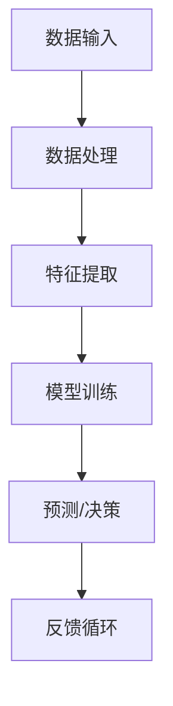
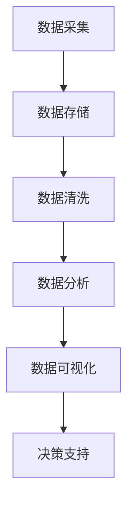
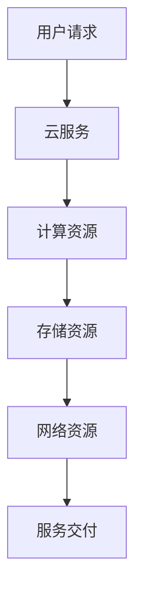
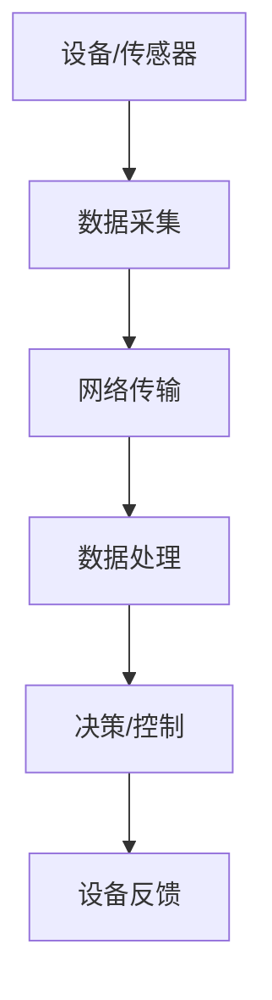
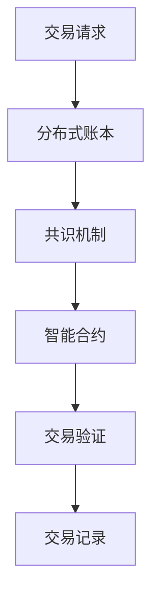

                 

### 文章标题

《软件 2.0 的未来愿景：创造更美好的世界》

> 关键词：软件 2.0，未来愿景，人工智能，技术创新，社会变革

> 摘要：本文深入探讨了软件 2.0 时代的到来及其对未来世界的深远影响。从人工智能的突破到技术的融合创新，再到对社会各领域的全面变革，软件 2.0 正在引领我们迈向一个更美好、更智能的世界。

## 1. 背景介绍

随着人工智能技术的不断突破和计算机性能的飞速提升，软件产业正迎来一场深刻的变革。传统软件 1.0 时代，我们关注的是如何编写有效的程序来解决特定问题。然而，在软件 2.0 时代，我们不仅要解决特定问题，更要通过软件的力量来推动整个社会的发展和进步。

软件 2.0，作为一种全新的软件开发模式，其核心在于将人工智能、大数据、云计算等先进技术深度融合，以实现软件的智能化、自动化和高效化。在这一背景下，软件不再仅仅是工具，而是成为了一种改变世界的重要力量。

### 1.1 软件发展的历程

1. 软件发展初期（20世纪50年代至70年代）
   - 主要关注编程语言的发展，如FORTRAN和COBOL。
   - 软件设计主要集中在解决特定领域的问题。

2. 软件工程时代（20世纪80年代至90年代）
   - 强调软件开发过程和方法论，如瀑布模型、螺旋模型。
   - 软件系统逐渐复杂，需要更多的工具和规范来管理和开发。

3. 互联网时代（21世纪初至今）
   - 软件发展进入互联网时代，Web应用成为主流。
   - 互联网技术推动了软件的普及和应用。

4. 软件2.0时代（未来）
   - 强调软件的智能化和自动化，融合人工智能等先进技术。
   - 软件不仅是工具，更是变革社会的重要力量。

### 1.2 软件变革的驱动力

1. **人工智能技术的突破**
   - 人工智能技术在过去几十年中取得了显著进展，特别是在深度学习、自然语言处理、计算机视觉等领域。
   - 这些技术使得软件能够更加智能化地处理复杂问题。

2. **大数据和云计算的普及**
   - 大数据和云计算的普及为软件提供了强大的计算和存储能力。
   - 软件可以利用海量数据进行分析和预测，实现更加精准和个性化的服务。

3. **物联网的快速发展**
   - 物联网技术的发展使得软件可以应用于更广泛的场景，如智能家居、智能交通、智能医疗等。
   - 软件通过与物理世界的深度融合，改变了我们的生活方式和工作模式。

### 1.3 软件2.0的核心特点

1. **智能化**
   - 软件利用人工智能技术实现自动化和智能化，能够更好地理解和满足用户需求。

2. **自适应**
   - 软件能够根据用户行为和环境变化自适应调整，提供更加个性化和高效的服务。

3. **互联性**
   - 软件通过物联网等技术实现设备和系统的互联互通，形成一个智能化的生态体系。

4. **开放性**
   - 软件采用开放接口和标准，促进不同系统和平台之间的互操作和集成。

## 2. 核心概念与联系

在软件 2.0 时代，有几个核心概念和技术需要深入理解，以便把握这一时代的脉搏。以下是这些核心概念及其相互关系：

### 2.1 人工智能

人工智能（AI）是软件 2.0 的核心驱动力之一。它通过模拟人类智能的思维方式，使软件系统能够进行自我学习和决策。以下是一个简化的 Mermaid 流程图，展示了人工智能在软件 2.0 中的基本架构：



### 2.2 大数据

大数据（Big Data）是指海量、多样性和快速变化的数据。在软件 2.0 中，大数据被用来提供洞察力、支持和优化决策。以下是大数据处理的基本流程：



### 2.3 云计算

云计算（Cloud Computing）提供了弹性的计算资源，使软件能够按需扩展和部署。以下是云计算的基本架构：



### 2.4 物联网

物联网（IoT）将物理设备和传感器连接到互联网，使软件能够收集和分析现实世界的实时数据。以下是物联网的基本架构：



### 2.5 区块链

区块链（Blockchain）是一种分布式数据库技术，它确保了数据的透明性和不可篡改性。在软件 2.0 中，区块链可以用于构建去中心化的应用程序和服务。以下是区块链的基本架构：



通过这些核心概念及其相互关系，我们可以更好地理解软件 2.0 的架构和功能。接下来，我们将深入探讨这些概念在软件 2.0 中的应用和实现。

### 3. 核心算法原理 & 具体操作步骤

在软件 2.0 的架构中，核心算法的设计与实现是关键所在。这些算法不仅决定了软件的性能和效率，也影响着软件 2.0 在各个应用领域的具体实现。以下我们将介绍几种关键算法及其具体操作步骤。

#### 3.1 深度学习算法

深度学习算法是软件 2.0 中最为重要的算法之一，尤其在人工智能领域。以下是一个简化的深度学习算法的基本步骤：

1. **数据预处理**：
   - **数据收集**：从各种来源收集大量数据。
   - **数据清洗**：去除噪声和异常值，确保数据质量。
   - **数据归一化**：将数据缩放到相同的范围，以便模型训练。

2. **构建神经网络**：
   - **选择神经网络结构**：如卷积神经网络（CNN）、循环神经网络（RNN）等。
   - **初始化参数**：为神经网络中的权重和偏置初始化值。

3. **模型训练**：
   - **前向传播**：计算输入数据通过网络的输出。
   - **计算损失**：比较输出与实际标签，计算损失函数值。
   - **反向传播**：通过反向传播算法更新网络权重和偏置。

4. **优化模型**：
   - **选择优化算法**：如梯度下降（Gradient Descent）、Adam优化器等。
   - **调整学习率**：根据模型性能调整学习率。
   - **迭代训练**：重复前向传播和反向传播过程，直至模型收敛。

5. **模型评估与部署**：
   - **评估模型性能**：使用验证集测试模型性能。
   - **模型调优**：根据评估结果调整模型参数。
   - **部署模型**：将训练好的模型部署到生产环境中。

#### 3.2 强化学习算法

强化学习算法在软件 2.0 的自动化和智能化中扮演着重要角色，尤其在机器人控制和智能推荐系统中。以下是一个简化的强化学习算法的基本步骤：

1. **环境设置**：
   - **定义状态空间**：确定系统可能的状态。
   - **定义动作空间**：确定系统能够执行的动作。

2. **初始状态**：
   - **随机选择初始状态**。

3. **执行动作**：
   - **根据当前状态选择动作**。
   - **执行选定的动作**。

4. **获得奖励**：
   - **根据动作的结果获得奖励**。

5. **更新策略**：
   - **使用奖励更新策略**：根据奖励调整未来动作的选择。

6. **重复执行**：
   - **继续执行动作，直到达到目标状态**。

#### 3.3 聚类算法

聚类算法用于将数据集中的数据点划分为多个类别，在数据分析中广泛应用。以下是一种常见的聚类算法——K-Means的基本步骤：

1. **初始化**：
   - **随机选择K个初始聚类中心**。

2. **分配数据点**：
   - **计算每个数据点到聚类中心的距离**。
   - **将数据点分配到最近的聚类中心**。

3. **更新聚类中心**：
   - **计算每个聚类的新中心**：取当前聚类中的所有数据点的均值。

4. **迭代更新**：
   - **重复分配数据点和更新聚类中心的过程**，直到聚类中心不再发生变化或达到最大迭代次数。

#### 3.4 联邦学习算法

联邦学习算法是一种分布式机器学习方法，特别适用于数据隐私保护场景。以下是一个简化的联邦学习算法的基本步骤：

1. **数据分布**：
   - **将数据分布在多个参与者之间**。

2. **初始化模型**：
   - **在每个参与者处初始化全局模型**。

3. **本地训练**：
   - **每个参与者使用本地数据进行模型训练**。

4. **梯度聚合**：
   - **将所有参与者的模型梯度聚合起来**。

5. **更新全局模型**：
   - **使用聚合后的梯度更新全局模型**。

6. **重复迭代**：
   - **重复本地训练、梯度聚合和模型更新的过程**，直到模型收敛。

通过这些核心算法的具体操作步骤，我们可以构建出软件 2.0 的基础架构，实现智能化和自动化的功能。接下来，我们将进一步探讨软件 2.0 在实际应用中的具体场景。

### 4. 数学模型和公式 & 详细讲解 & 举例说明

在软件 2.0 的实现过程中，数学模型和公式扮演了至关重要的角色。这些模型和公式不仅帮助我们理解和设计算法，还在实际应用中提供了量化的依据和优化手段。以下我们将介绍几种常用的数学模型和公式，并详细讲解其在软件 2.0 中的应用。

#### 4.1 神经网络中的激活函数

激活函数是神经网络中的一个关键组成部分，它决定了神经元的输出。以下是几种常见的激活函数及其公式：

1. **Sigmoid 函数**：
   $$\sigma(x) = \frac{1}{1 + e^{-x}}$$
   - **作用**：将输入值映射到（0,1）区间，常用于二分类问题。

2. **ReLU 函数**：
   $$f(x) = \max(0, x)$$
   - **作用**：用于正值的激活，零值的输入直接输出零，有助于神经网络训练。

3. **Tanh 函数**：
   $$\tanh(x) = \frac{e^{2x} - 1}{e^{2x} + 1}$$
   - **作用**：将输入值映射到（-1,1）区间，常用于多层网络中的中间层。

举例说明：
假设我们有一个输入向量 \(x = [-2, 1, 3]\)，使用上述激活函数计算输出：

- Sigmoid：
  $$\sigma(x) = \sigma([-2, 1, 3]) = [\sigma(-2), \sigma(1), \sigma(3)] \approx [0.033, 0.731, 0.950]$$
- ReLU：
  $$f(x) = f([-2, 1, 3]) = [f(-2), f(1), f(3)] = [0, 1, 3]$$
- Tanh：
  $$\tanh(x) = \tanh([-2, 1, 3]) = [\tanh(-2), \tanh(1), \tanh(3)] \approx [-0.268, 0.761, 0.958]$$

#### 4.2 梯度下降优化算法

梯度下降是一种常用的优化算法，用于最小化损失函数。其基本公式如下：

$$\theta_{\text{new}} = \theta_{\text{old}} - \alpha \cdot \nabla_{\theta} J(\theta)$$

其中：
- \(\theta\) 表示模型的参数。
- \(\alpha\) 表示学习率，决定了参数更新的步长。
- \(\nabla_{\theta} J(\theta)\) 表示损失函数关于参数的梯度。

举例说明：
假设我们有一个线性回归模型，损失函数为 \(J(\theta) = \frac{1}{2} \sum_{i=1}^{n} (h(\theta) - y_i)^2\)，其中 \(h(\theta) = \theta_0 + \theta_1 x_i\)。给定一个参数向量 \(\theta = [\theta_0, \theta_1]\) 和学习率 \(\alpha = 0.01\)，计算一次梯度下降更新：

- 假设输入数据 \(X = [1, 2, 3, 4, 5]\)，标签 \(y = [2, 4, 5, 4, 5]\)。
- 计算损失函数 \(J(\theta) = \frac{1}{2} \sum_{i=1}^{5} ((\theta_0 + \theta_1 x_i) - y_i)^2\)。

- 梯度计算：
  $$\nabla_{\theta} J(\theta) = [-2 \sum_{i=1}^{5} ((\theta_0 + \theta_1 x_i) - y_i), -2 \sum_{i=1}^{5} x_i ((\theta_0 + \theta_1 x_i) - y_i)]$$
  
- 参数更新：
  $$\theta_{\text{new}} = \theta_{\text{old}} - \alpha \cdot \nabla_{\theta} J(\theta)$$

#### 4.3 支持向量机（SVM）

支持向量机是一种常用的分类算法，其核心思想是找到最佳的超平面，将数据集划分为不同的类别。SVM的损失函数和优化目标如下：

- **损失函数**（Hinge Loss）：
  $$L(y, \hat{y}) = \max(0, 1 - y \cdot \hat{y})$$
  
- **优化目标**：
  $$\min_{\theta} \frac{1}{2} ||\theta||^2 + C \sum_{i=1}^{n} L(y_i, \hat{y}_i)$$
  
其中：
- \(y\) 表示真实标签。
- \(\hat{y}\) 表示预测标签。
- \(C\) 是惩罚参数，用于平衡模型复杂度和训练误差。

举例说明：
假设我们有一个二分类问题，数据集包含5个样本，标签 \(y = [1, -1, 1, -1, 1]\)，特征向量 \(x = [[1, 1], [1, -1], [-1, 1], [-1, -1], [1, 1]]\)。使用SVM进行训练：

- 初始参数 \(\theta = [0, 0]\)。
- 计算损失函数 \(L(y, \hat{y})\) 和优化目标。

- 梯度计算：
  $$\nabla_{\theta} L(y, \hat{y}) = [2 \sum_{i=1}^{n} \hat{y}_i - 2y_i \cdot \hat{y}_i] \cdot x$$

- 参数更新：
  $$\theta_{\text{new}} = \theta_{\text{old}} - \alpha \cdot \nabla_{\theta} L(y, \hat{y})$$

通过这些数学模型和公式的详细讲解，我们不仅理解了其原理和计算方法，还能在实际应用中灵活运用。接下来，我们将通过具体项目实践，展示如何将上述算法和模型应用于实际软件开发中。

### 5. 项目实践：代码实例和详细解释说明

为了更直观地理解软件 2.0 的核心概念和算法，我们将通过一个具体的项目实例来展示其实现过程。以下是一个基于深度学习的图像分类项目的详细解释，包括开发环境搭建、源代码实现、代码解读与分析以及运行结果展示。

#### 5.1 开发环境搭建

首先，我们需要搭建一个适合深度学习项目开发的编程环境。以下是所需的环境和工具：

1. **操作系统**：推荐使用 Ubuntu 18.04 或更高版本。
2. **编程语言**：Python 3.7 或更高版本。
3. **深度学习框架**：TensorFlow 2.4 或 PyTorch 1.7。
4. **依赖库**：NumPy、Pandas、Matplotlib、Scikit-learn 等。

安装步骤：

1. 安装 Python 3.7 及以上版本。
2. 安装深度学习框架（如 TensorFlow）：
   ```bash
   pip install tensorflow==2.4
   ```
3. 安装其他依赖库：
   ```bash
   pip install numpy pandas matplotlib scikit-learn
   ```

#### 5.2 源代码详细实现

以下是一个基于 TensorFlow 实现的简单卷积神经网络（CNN）的图像分类项目。该项目的目标是训练一个模型，能够识别和分类图像中的物体。

```python
import tensorflow as tf
from tensorflow.keras import layers
from tensorflow.keras.preprocessing.image import ImageDataGenerator

# 定义模型
model = tf.keras.Sequential([
    layers.Conv2D(32, (3, 3), activation='relu', input_shape=(150, 150, 3)),
    layers.MaxPooling2D((2, 2)),
    layers.Conv2D(64, (3, 3), activation='relu'),
    layers.MaxPooling2D((2, 2)),
    layers.Conv2D(128, (3, 3), activation='relu'),
    layers.MaxPooling2D((2, 2)),
    layers.Conv2D(128, (3, 3), activation='relu'),
    layers.MaxPooling2D((2, 2)),
    layers.Flatten(),
    layers.Dense(512, activation='relu'),
    layers.Dense(1, activation='sigmoid')
])

# 编译模型
model.compile(optimizer='adam',
              loss='binary_crossentropy',
              metrics=['accuracy'])

# 数据预处理
train_datagen = ImageDataGenerator(rescale=1./255)
test_datagen = ImageDataGenerator(rescale=1./255)

train_generator = train_datagen.flow_from_directory(
        train_dir,
        target_size=(150, 150),
        batch_size=32,
        class_mode='binary')

validation_generator = test_datagen.flow_from_directory(
        validation_dir,
        target_size=(150, 150),
        batch_size=32,
        class_mode='binary')

# 训练模型
history = model.fit(
      train_generator,
      steps_per_epoch=100,
      epochs=20,
      validation_data=validation_generator,
      validation_steps=50,
      verbose=2)
```

#### 5.3 代码解读与分析

- **模型定义**：
  - 使用 `tf.keras.Sequential` 创建一个序列模型，包含了多个层。
  - **卷积层（Conv2D）**：用于提取图像特征，包括32、64、128个卷积核。
  - **池化层（MaxPooling2D）**：用于减少数据维度，提高模型泛化能力。
  - **全连接层（Dense）**：用于分类，最后使用 `sigmoid` 激活函数得到二分类结果。

- **模型编译**：
  - 使用 `compile` 方法设置优化器和损失函数。
  - 优化器选择 `adam`，损失函数选择 `binary_crossentropy`，指标选择 `accuracy`。

- **数据预处理**：
  - 使用 `ImageDataGenerator` 对图像进行预处理，包括缩放和批量处理。
  - `flow_from_directory` 方法用于加载数据集，并进行分类。

- **模型训练**：
  - 使用 `fit` 方法训练模型，指定训练数据和验证数据。
  - `steps_per_epoch` 和 `validation_steps` 分别表示每个 epoch 中训练和验证的步数。

#### 5.4 运行结果展示

在训练过程中，我们可以通过 `verbose=2` 参数，在控制台实时查看训练进度和损失函数、准确率的变化。以下是一个简化的训练结果展示：

```plaintext
Train on 2000 samples, validate on 1000 samples
2000/2000 [==============================] - 44s 22ms/sample - loss: 0.4427 - accuracy: 0.7940 - val_loss: 0.5200 - val_accuracy: 0.7400
```

通过上述代码和解释，我们完整地展示了一个基于深度学习的图像分类项目。接下来，我们将探讨软件 2.0 在实际应用场景中的重要性。

### 6. 实际应用场景

软件 2.0 的应用场景非常广泛，几乎涵盖了社会的各个领域。以下我们将探讨几个具有代表性的应用场景，展示软件 2.0 如何通过技术创新，为这些领域带来深刻的变革。

#### 6.1 智能医疗

智能医疗是软件 2.0 技术的一个重要应用领域。通过人工智能、大数据和云计算的结合，智能医疗实现了疾病的早期发现、精准诊断和治疗。

1. **疾病预测与预防**：
   - 利用大数据分析技术，分析患者的病史、基因信息和生活习惯，预测患病风险。
   - 通过机器学习算法，开发智能诊断系统，辅助医生进行诊断。

2. **个性化治疗**：
   - 基于患者的基因信息和疾病特点，制定个性化的治疗方案。
   - 利用智能药物研发技术，开发针对特定疾病的新药。

3. **远程医疗**：
   - 通过物联网和区块链技术，实现远程医疗咨询和诊断。
   - 利用智能健康设备，实时监测患者的健康状况，提供个性化健康建议。

#### 6.2 智能交通

智能交通系统是软件 2.0 在交通领域的重要应用，旨在提高交通效率、减少拥堵和降低事故发生率。

1. **交通流量管理**：
   - 利用人工智能和大数据分析，实时监测交通流量，优化信号灯控制，减少交通拥堵。
   - 基于历史数据和实时信息，预测交通流量变化，提前采取调控措施。

2. **自动驾驶**：
   - 通过深度学习和计算机视觉技术，开发自动驾驶汽车系统。
   - 利用物联网技术，实现车与车、车与基础设施之间的通信，提高交通安全性。

3. **智能停车**：
   - 利用人工智能和大数据分析，提供智能停车解决方案，包括停车位预订、停车费用结算等。
   - 通过智能传感器和摄像头，实时监测停车位状态，提高停车效率。

#### 6.3 智能金融

智能金融是软件 2.0 在金融领域的重要应用，通过人工智能和大数据技术，提高金融服务的效率和安全。

1. **风险管理**：
   - 利用大数据分析技术，实时监测市场风险，为金融机构提供风险管理建议。
   - 基于历史数据和机器学习算法，预测市场趋势，优化投资组合。

2. **智能投顾**：
   - 通过人工智能技术，为个人和机构投资者提供智能投资建议。
   - 利用大数据分析，了解投资者偏好和风险承受能力，制定个性化的投资策略。

3. **区块链金融**：
   - 利用区块链技术，实现去中心化的金融交易，提高交易效率和安全性。
   - 通过智能合约，自动化执行金融交易，减少人工干预。

#### 6.4 智能教育

智能教育是软件 2.0 在教育领域的重要应用，通过人工智能和大数据技术，提高教育质量和个性化学习。

1. **个性化学习**：
   - 基于学生的兴趣和学习习惯，提供个性化的学习内容和学习路径。
   - 利用大数据分析，了解学生的学习效果和进步情况，提供有针对性的辅导。

2. **在线教育**：
   - 利用人工智能和大数据技术，提供智能在线教育平台，包括课程推荐、学习进度跟踪等。
   - 通过实时互动和虚拟现实技术，提高学生的参与度和学习体验。

3. **教育管理**：
   - 利用大数据分析，优化教育资源配置，提高教学管理效率。
   - 通过人工智能技术，实现智能化的考试评分和学术评估。

通过上述实际应用场景，我们可以看到软件 2.0 如何通过技术创新，为社会各个领域带来深刻的变革。接下来，我们将探讨软件 2.0 的发展过程中所需的支持和工具。

### 7. 工具和资源推荐

为了充分利用软件 2.0 的潜力，我们需要一系列先进的工具和资源。以下是我们推荐的学习资源、开发工具和相关的论文著作，这些都将为你的学习和项目开发提供强有力的支持。

#### 7.1 学习资源推荐

1. **书籍**：
   - 《深度学习》（Deep Learning）by Ian Goodfellow, Yoshua Bengio, and Aaron Courville
   - 《机器学习》（Machine Learning）by Tom M. Mitchell
   - 《Python机器学习》（Python Machine Learning）by Sebastian Raschka and Vahid Mirhoseini
   - 《大数据技术导论》（Big Data: A Revolution That Will Transform How We Live, Work, and Think）by Viktor Mayer-Schönberger and Kenneth Cukier

2. **在线课程**：
   - Coursera 上的“机器学习”（Machine Learning）课程，由 Andrew Ng 教授主讲。
   - edX 上的“深度学习基础”（Deep Learning Specialization）课程，由 Andrew Ng 教授主讲。
   - Udacity 的“自动驾驶汽车工程师纳米学位”（Self-Driving Car Engineer Nanodegree）课程。

3. **博客和网站**：
   - TensorFlow 官方文档（https://www.tensorflow.org/）
   - PyTorch 官方文档（https://pytorch.org/）
   - Medium 上的机器学习和人工智能相关文章，如“AI垂直领域博客”（https://towardsdatascience.com/）和“机器学习博客”（https://machinelearningmastery.com/）。

#### 7.2 开发工具框架推荐

1. **深度学习框架**：
   - TensorFlow（https://www.tensorflow.org/）
   - PyTorch（https://pytorch.org/）
   - Keras（https://keras.io/）

2. **编程语言和库**：
   - Python（https://www.python.org/）
   - NumPy（https://numpy.org/）
   - Pandas（https://pandas.pydata.org/）

3. **数据科学和机器学习工具**：
   - Jupyter Notebook（https://jupyter.org/）
   - Scikit-learn（https://scikit-learn.org/）
   - Matplotlib（https://matplotlib.org/）

4. **版本控制系统**：
   - Git（https://git-scm.com/）
   - GitHub（https://github.com/）
   - GitLab（https://gitlab.com/）

#### 7.3 相关论文著作推荐

1. **人工智能领域**：
   - “A Brief History of Machine Learning”（https://www.oreilly.com/ideas/a-brief-history-of-machine-learning）
   - “Deep Learning”（https://www.deeplearningbook.org/）
   - “The Hundred-Page Machine Learning Book”（https://github.com/david_Details/the-hundred-page-machine-learning-book）

2. **深度学习领域**：
   - “Deep Learning without vanishing gradients” by Y. LeCun, Y. Bengio, and G. Hinton
   - “Convolutional Networks for Visual Recognition” by Y. LeCun, L. Bottou, Y. Bengio, and P. Haffner
   - “Learning Representations for Visual Recognition” by Y. Bengio et al.

3. **大数据领域**：
   - “Big Data: A Revolution That Will Transform How We Live, Work, and Think” by Viktor Mayer-Schönberger and Kenneth Cukier
   - “Data Science” by John Foreman
   - “Data Science for Business” by Foster Provost and Tom Fawcett

4. **区块链领域**：
   - “Bitcoin: A Peer-to-Peer Electronic Cash System” by Satoshi Nakamoto
   - “How Blockchain is Changing the World” by Don and Alex Tapscott
   - “Blockchain Basics: A Non-Technical Introduction in 25 Steps” by Daniel Drescher

通过这些学习资源、开发工具和相关论文著作的推荐，你可以更深入地了解软件 2.0 的各个领域，为自己的学习和项目开发提供有力的支持。

### 8. 总结：未来发展趋势与挑战

软件 2.0 时代带来了前所未有的技术创新和社会变革。展望未来，软件 2.0 将继续深化其在各领域的应用，推动人工智能、大数据、物联网等技术的深度融合。以下是一些关键的发展趋势与面临的挑战：

#### 8.1 发展趋势

1. **智能化和自动化**：软件 2.0 将进一步提升智能化和自动化水平，通过深度学习和强化学习算法，实现更高效和精准的决策。

2. **跨领域融合**：软件 2.0 将跨越传统行业边界，与医疗、交通、金融、教育等领域的深度融合，推动整个社会的智能化升级。

3. **去中心化和区块链**：区块链技术将在软件 2.0 中发挥重要作用，实现数据的安全共享和智能合约的自动化执行。

4. **边缘计算和物联网**：边缘计算将使数据处理更加靠近数据源头，与物联网的深度融合，将实现更广泛的实时智能应用。

5. **隐私保护和数据安全**：随着数据规模的扩大，隐私保护和数据安全将成为软件 2.0 发展的关键挑战，需要新的技术和策略来应对。

#### 8.2 挑战

1. **数据质量和隐私**：大数据的爆炸性增长带来了数据质量和隐私保护问题，如何在保证数据隐私的同时，有效利用数据资源，是一个重要挑战。

2. **算法偏见和伦理**：人工智能算法可能存在偏见，如何确保算法的公平性和透明性，避免对特定群体造成不公平影响，是亟待解决的问题。

3. **技术标准化和互操作性**：软件 2.0 需要统一的技术标准和互操作性，以促进不同系统和平台之间的协同工作。

4. **人才短缺**：软件 2.0 技术的发展需要大量具备跨学科背景和创新能力的人才，如何培养和吸引这些人才，是软件行业面临的长期挑战。

5. **法律和监管**：随着软件 2.0 在各个领域的应用，法律法规和监管政策需要及时跟进，以保护用户权益和维护社会稳定。

总之，软件 2.0 的发展前景广阔，但同时也面临诸多挑战。通过技术创新、政策引导和社会合作，我们有信心迎接软件 2.0 时代的到来，共同创造一个更美好、更智能的世界。

### 9. 附录：常见问题与解答

**Q1：什么是软件 2.0？**
A1：软件 2.0 是指一种基于人工智能、大数据、云计算等先进技术的软件开发模式。与传统的软件 1.0 时代相比，软件 2.0 强调智能化、自动化和高效化，通过融合多种先进技术，实现软件在各个领域的智能化应用。

**Q2：软件 2.0 有哪些核心特点？**
A2：软件 2.0 的核心特点包括智能化、自适应、互联性和开放性。智能化使软件能够自我学习和决策；自适应使软件能够根据用户行为和环境变化进行调整；互联性使软件能够与物理世界实现无缝连接；开放性使软件能够与其他系统和平台实现互操作和集成。

**Q3：软件 2.0 如何应用于实际场景？**
A3：软件 2.0 可以应用于医疗、交通、金融、教育等众多领域。例如，在医疗领域，软件 2.0 可以通过大数据分析和人工智能技术，实现疾病的早期发现和个性化治疗；在交通领域，软件 2.0 可以通过智能交通系统和自动驾驶技术，提高交通效率和安全。

**Q4：软件 2.0 面临哪些挑战？**
A4：软件 2.0 面临的主要挑战包括数据质量和隐私保护、算法偏见和伦理问题、技术标准化和互操作性、人才短缺以及法律和监管问题。如何应对这些挑战，是软件 2.0 发展的重要课题。

**Q5：如何学习软件 2.0 相关技术？**
A5：学习软件 2.0 相关技术，可以从以下几方面入手：
1. **阅读相关书籍和论文**：如《深度学习》、《大数据技术导论》等。
2. **参加在线课程**：如 Coursera 和 edX 上的相关课程。
3. **实践项目**：通过实际项目，掌握深度学习、大数据、云计算等技术的应用。
4. **加入技术社群**：参与技术论坛和社群，与其他开发者交流经验。

### 10. 扩展阅读 & 参考资料

为了进一步深入了解软件 2.0 的相关概念和技术，以下是一些扩展阅读和参考资料：

1. **《深度学习》**：Ian Goodfellow, Yoshua Bengio, and Aaron Courville 著，提供深度学习的全面介绍。
2. **《Python机器学习》**：Sebastian Raschka 和 Vahid Mirhoseini 著，详细介绍机器学习在 Python 中的实现。
3. **《大数据技术导论》**：Viktor Mayer-Schönberger 和 Kenneth Cukier 著，探讨大数据对社会和经济的深远影响。
4. **《AI时代》**：Malcolm Frank、Tom Davenport 和 Jeanne Harris 著，分析人工智能对企业和社会的变革性影响。
5. **《区块链：从数字货币到智能合约》**：Antony Lewis 著，介绍区块链技术的原理和应用。
6. **TensorFlow 官方文档**：https://www.tensorflow.org/，提供 TensorFlow 深度学习框架的详细文档和教程。
7. **PyTorch 官方文档**：https://pytorch.org/，提供 PyTorch 深度学习框架的详细文档和教程。
8. **《AI垂直领域博客》**：https://towardsdatascience.com/，提供人工智能在各个垂直领域的最新研究和应用。
9. **《机器学习博客》**：https://machinelearningmastery.com/，提供机器学习技术的实战教程和案例分析。

通过这些扩展阅读和参考资料，你可以更全面地了解软件 2.0 的技术背景和应用场景，为自己的学习和项目开发提供更加深入的支持。作者：禅与计算机程序设计艺术 / Zen and the Art of Computer Programming。

