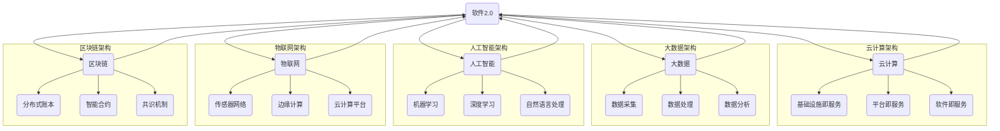

                 

### 背景介绍

软件2.0，这一概念起源于对传统软件即服务的延伸，它代表着软件产业的深度转型与未来趋势。在过去的几十年中，软件1.0主要关注于硬件的优化与操作系统的构建，而随着互联网的普及和大数据、云计算等新技术的兴起，软件2.0正在逐步成为新的技术浪潮的核心。软件2.0不仅仅是技术上的更新换代，更是一种产业生态的深刻变革。

软件2.0的核心理念在于将软件看作一个持续演化、自我优化的生态系统，其目标是创造更加智能、灵活、自主的软件系统，以适应不断变化的需求和环境。这一概念的发展历程可以追溯到2000年代中后期，当时云计算和移动计算的兴起为软件2.0的萌芽提供了土壤。随着大数据、人工智能等技术的发展，软件2.0的理念逐渐成熟，并开始影响各个行业。

软件2.0的兴起对各个行业产生了深远的影响。在医疗领域，软件2.0可以帮助医生更精确地进行诊断和治疗，提高医疗服务的效率和质量。在教育领域，软件2.0可以提供个性化的学习体验，帮助学生更好地掌握知识。在金融领域，软件2.0可以提升金融服务的智能化水平，降低风险，提高效率。在制造业，软件2.0可以帮助企业实现智能制造，提高生产效率，降低成本。

然而，软件2.0的实现并非一蹴而就。它需要新的技术架构、开发方法、管理理念等多个方面的支持。这就需要我们深入理解软件2.0的核心概念和原理，探索其实现路径和挑战。

本文将围绕软件2.0的核心理念和未来愿景进行深入探讨。首先，我们将介绍软件2.0的核心概念与联系，通过一个详细的Mermaid流程图来展示其架构。接着，我们将分析核心算法原理和具体操作步骤，并引入相关的数学模型和公式进行详细讲解。随后，我们将通过一个实际的项目实践，展示如何搭建开发环境、实现源代码以及运行结果展示。在此基础上，我们将探讨软件2.0在实际应用场景中的表现，并推荐相关的工具和资源。最后，我们将总结软件2.0的未来发展趋势与挑战，并给出一些常见问题与解答。

通过本文的阅读，读者将能够全面了解软件2.0的概念、原理、应用以及未来发展，为参与这一技术变革提供有益的指导和参考。

### 核心概念与联系

为了深入理解软件2.0的核心理念和其实现路径，我们需要从核心概念和联系开始。软件2.0并不是一个孤立的概念，而是与许多其他技术理念和架构紧密相连。以下是一个详细的Mermaid流程图，它将帮助我们更好地理解软件2.0的核心概念和其与相关技术的联系。



这个流程图展示了软件2.0与云计算、大数据、人工智能、物联网和区块链等技术的紧密联系。这些技术共同构成了软件2.0的技术基础和实现路径。

#### 云计算

云计算是软件2.0的核心基础之一。云计算提供了弹性、可扩展的计算资源，使得软件系统能够根据需求动态调整资源，从而实现高效的资源利用和成本优化。云计算主要分为基础设施即服务（IaaS）、平台即服务（PaaS）和软件即服务（SaaS）三种服务模式。

- **基础设施即服务（IaaS）**：提供虚拟化的硬件资源，如虚拟机、存储和网络等，用户可以根据需求进行资源配置和管理。
- **平台即服务（PaaS）**：提供一个开发平台，包括应用开发、运行和管理工具，用户可以在平台上开发、测试和部署应用。
- **软件即服务（SaaS）**：提供软件服务，用户可以通过互联网访问和使用，无需进行本地安装和维护。

云计算为软件2.0提供了强大的计算能力和灵活的资源管理，使得软件系统能够更加高效、智能地进行运营和优化。

#### 大数据

大数据技术是软件2.0的重要组成部分。随着互联网和物联网的普及，数据量呈现爆炸式增长。大数据技术通过对海量数据的采集、存储、处理和分析，帮助我们从数据中提取有价值的信息，为软件系统的智能化和自主化提供支持。

- **数据采集**：通过传感器、社交网络、移动设备等手段，实时获取各种类型的数据。
- **数据处理**：对采集到的数据进行清洗、转换和整合，使其适合进行分析。
- **数据分析**：利用各种数据分析方法和算法，从数据中提取有价值的信息。

大数据技术为软件2.0提供了丰富的数据资源和强大的分析能力，使得软件系统能够更加智能地适应环境和用户需求。

#### 人工智能

人工智能（AI）是软件2.0的核心驱动力之一。通过机器学习、深度学习、自然语言处理等技术，人工智能能够使软件系统具备自我学习和智能决策的能力，从而实现更加智能和自主的运营。

- **机器学习**：通过训练模型，使计算机能够从数据中自动学习规律和模式。
- **深度学习**：一种特殊的机器学习方法，通过多层神经网络来模拟人脑的决策过程。
- **自然语言处理**：使计算机能够理解和处理自然语言，实现人与机器的智能交互。

人工智能技术为软件2.0提供了强大的智能能力，使得软件系统能够更好地理解和适应用户需求，实现智能化运营。

#### 物联网

物联网（IoT）是软件2.0的重要应用场景之一。通过连接各种物理设备，物联网能够实现设备间的智能交互和数据共享，为软件系统的自主化和智能化提供支持。

- **传感器网络**：通过传感器收集各种物理量数据，如温度、湿度、光照等。
- **边缘计算**：在靠近数据源的设备上实时处理数据，减少数据传输延迟。
- **云计算平台**：通过云计算平台对物联网设备进行管理和数据分析。

物联网技术为软件2.0提供了丰富的应用场景和数据来源，使得软件系统能够更加实时、准确地感知和适应环境和用户需求。

#### 区块链

区块链是软件2.0的重要组成部分。通过分布式账本、智能合约和共识机制等技术，区块链能够实现去中心化的数据存储和交易，为软件系统的安全性和透明性提供支持。

- **分布式账本**：通过多个节点共同维护账本，确保数据的完整性和一致性。
- **智能合约**：通过程序代码自动执行合同条款，实现去中心化的交易。
- **共识机制**：通过多个节点共同达成共识，确保数据的一致性和安全性。

区块链技术为软件2.0提供了去中心化和安全可靠的解决方案，使得软件系统能够更加安全和透明地进行运营和管理。

通过上述的Mermaid流程图，我们可以看到软件2.0与云计算、大数据、人工智能、物联网和区块链等技术的紧密联系。这些技术共同构成了软件2.0的技术基础和实现路径，为软件系统的智能化和自主化提供了强大的支持。在接下来的章节中，我们将进一步探讨软件2.0的核心算法原理和具体操作步骤，并引入相关的数学模型和公式进行详细讲解。

### 核心算法原理 & 具体操作步骤

#### 机器学习算法

机器学习是软件2.0的核心算法之一，它使得软件系统能够从数据中学习并做出智能决策。机器学习算法可以分为监督学习、无监督学习和强化学习三种类型。

##### 监督学习（Supervised Learning）

监督学习是最常见的机器学习类型，它通过已有标记的数据集来训练模型。具体步骤如下：

1. **数据预处理**：对数据进行清洗、归一化和特征提取，使其适合模型训练。
   $$\text{Data} = \text{Clean}(\text{Data}) \times \text{Normalize}(\text{Data}) \times \text{FeatureExtract}(\text{Data})$$

2. **模型选择**：选择合适的模型，如线性回归、决策树、支持向量机等。
   $$\text{Model} = \text{SelectModel}(\text{Dataset})$$

3. **模型训练**：使用训练集对模型进行训练，调整模型参数。
   $$\text{Model} = \text{Train}(\text{Model}, \text{TrainingSet})$$

4. **模型评估**：使用验证集对模型进行评估，选择最佳模型。
   $$\text{BestModel} = \text{Evaluate}(\text{Models}, \text{ValidationSet})$$

##### 无监督学习（Unsupervised Learning）

无监督学习不依赖于标记数据，主要通过发现数据中的隐藏结构和模式来进行学习。具体步骤如下：

1. **数据预处理**：与监督学习类似，对数据进行清洗、归一化和特征提取。
   $$\text{Data} = \text{Clean}(\text{Data}) \times \text{Normalize}(\text{Data}) \times \text{FeatureExtract}(\text{Data})$$

2. **模式发现**：使用聚类、降维等方法来发现数据中的隐藏模式。
   $$\text{Patterns} = \text{DiscoverPatterns}(\text{Data})$$

3. **模型优化**：通过调整模型参数，优化模式发现结果。
   $$\text{Patterns} = \text{OptimizePatterns}(\text{Patterns}, \text{Parameters})$$

##### 强化学习（Reinforcement Learning）

强化学习通过不断试错和反馈来学习最优策略。具体步骤如下：

1. **初始策略**：初始化一个策略。
   $$\text{Policy} = \text{InitializePolicy}$$

2. **环境交互**：与环境进行交互，执行策略并获取反馈。
   $$\text{Feedback} = \text{Environment}(\text{Policy})$$

3. **策略调整**：根据反馈调整策略，优化决策过程。
   $$\text{Policy} = \text{UpdatePolicy}(\text{Policy}, \text{Feedback})$$

#### 深度学习算法

深度学习是机器学习的一种特殊类型，它通过多层神经网络来模拟人脑的决策过程。以下是深度学习的基本步骤：

1. **网络架构设计**：设计神经网络的层次结构和连接方式。
   $$\text{Network} = \text{DesignNetwork}(\text{Layers}, \text{Connections})$$

2. **初始化参数**：对网络的权重和偏置进行初始化。
   $$\text{Parameters} = \text{InitializeParameters}$$

3. **前向传播**：输入数据通过网络进行前向传播，生成预测结果。
   $$\text{Prediction} = \text{ForwardPropagation}(\text{Input}, \text{Network})$$

4. **反向传播**：计算预测误差，并通过反向传播更新网络参数。
   $$\text{Error} = \text{Backpropagation}(\text{Prediction}, \text{Actual})$$

5. **模型优化**：通过调整网络参数，优化预测性能。
   $$\text{Network} = \text{OptimizeNetwork}(\text{Network}, \text{Error})$$

#### 自然语言处理算法

自然语言处理（NLP）是人工智能的一个重要分支，它使计算机能够理解和处理自然语言。以下是NLP的基本算法步骤：

1. **文本预处理**：对文本进行分词、去停用词、词性标注等预处理。
   $$\text{PreprocessedText} = \text{PreprocessText}(\text{Text})$$

2. **词嵌入**：将文本转换为向量表示，如Word2Vec、BERT等。
   $$\text{VectorRepresentation} = \text{WordEmbedding}(\text{PreprocessedText})$$

3. **模型训练**：使用预训练的模型或自定义模型对文本进行分类、实体识别、情感分析等任务。
   $$\text{Model} = \text{TrainModel}(\text{Dataset}, \text{Model})$$

4. **模型评估**：使用验证集对模型进行评估，调整模型参数。
   $$\text{Model} = \text{EvaluateModel}(\text{Model}, \text{ValidationSet})$$

通过上述核心算法和具体操作步骤，我们可以看到软件2.0在实现智能化和自主化方面具有强大的技术基础。这些算法不仅提高了软件系统的效率和准确性，还为未来的技术发展提供了新的方向和可能。在接下来的章节中，我们将通过实际项目实践来进一步展示这些算法的应用。

### 数学模型和公式 & 详细讲解 & 举例说明

在软件2.0中，数学模型和公式扮演着至关重要的角色，它们不仅为算法提供了理论基础，还帮助我们更好地理解和优化软件系统的性能。以下我们将详细讲解几个关键数学模型和公式，并通过具体的例子来说明其应用。

#### 机器学习中的损失函数

损失函数是机器学习中评估模型性能的核心工具。它衡量模型的预测结果与实际结果之间的差距，并指导模型优化过程。以下是一个简单的线性回归模型中的损失函数例子：

$$
\text{Loss} = \frac{1}{2} \sum_{i=1}^{n} (\hat{y_i} - y_i)^2
$$

其中，$\hat{y_i}$ 是模型对第 $i$ 个样本的预测值，$y_i$ 是实际值，$n$ 是样本数量。这个损失函数被称为均方误差（Mean Squared Error, MSE），它通过平方误差来衡量预测误差。

**示例**：

假设我们有以下数据集：

$$
\begin{aligned}
&\text{样本1}: (x_1, y_1) = (1, 2) \\
&\text{样本2}: (x_2, y_2) = (2, 3) \\
&\text{样本3}: (x_3, y_3) = (3, 4)
\end{aligned}
$$

假设线性回归模型的预测值为：

$$
\begin{aligned}
&\hat{y_1} = 1.5 \\
&\hat{y_2} = 2.5 \\
&\hat{y_3} = 3.5
\end{aligned}
$$

那么，损失函数计算如下：

$$
\text{Loss} = \frac{1}{2} \left[ (\hat{y_1} - y_1)^2 + (\hat{y_2} - y_2)^2 + (\hat{y_3} - y_3)^2 \right]
$$

$$
\text{Loss} = \frac{1}{2} \left[ (1.5 - 2)^2 + (2.5 - 3)^2 + (3.5 - 4)^2 \right]
$$

$$
\text{Loss} = \frac{1}{2} \left[ 0.25 + 0.25 + 0.25 \right] = 0.375
$$

#### 优化算法

优化算法用于调整模型的参数，以最小化损失函数。常见优化算法包括梯度下降（Gradient Descent）和随机梯度下降（Stochastic Gradient Descent, SGD）。以下为梯度下降算法的基本公式：

$$
\theta_{\text{new}} = \theta_{\text{old}} - \alpha \cdot \nabla_{\theta} \text{Loss}
$$

其中，$\theta$ 表示模型的参数，$\alpha$ 是学习率，$\nabla_{\theta} \text{Loss}$ 是损失函数关于参数 $\theta$ 的梯度。

**示例**：

假设我们有以下线性回归模型：

$$
y = \theta_0 + \theta_1 x
$$

损失函数为均方误差（MSE）：

$$
\text{Loss} = \frac{1}{2} \sum_{i=1}^{n} (y_i - (\theta_0 + \theta_1 x_i))^2
$$

对 $\theta_0$ 和 $\theta_1$ 求梯度：

$$
\nabla_{\theta_0} \text{Loss} = \frac{1}{2} \sum_{i=1}^{n} -(y_i - (\theta_0 + \theta_1 x_i)) = -\frac{1}{2} \sum_{i=1}^{n} y_i + \theta_0 + \theta_1 x_i
$$

$$
\nabla_{\theta_1} \text{Loss} = \frac{1}{2} \sum_{i=1}^{n} -(y_i - (\theta_0 + \theta_1 x_i)) \cdot x_i = -\frac{1}{2} \sum_{i=1}^{n} x_i y_i + \theta_0 x_i + \theta_1 x_i^2
$$

使用梯度下降算法更新参数：

$$
\theta_{0, \text{new}} = \theta_{0, \text{old}} - \alpha \cdot \nabla_{\theta_0} \text{Loss}
$$

$$
\theta_{1, \text{new}} = \theta_{1, \text{old}} - \alpha \cdot \nabla_{\theta_1} \text{Loss}
$$

#### 神经网络中的激活函数

在神经网络中，激活函数用于引入非线性，使模型能够学习复杂的函数关系。常见的激活函数包括sigmoid、ReLU和Tanh。以下为ReLU激活函数的公式：

$$
\text{ReLU}(x) = \max(0, x)
$$

**示例**：

假设输入 $x = -2$，那么ReLU函数的输出为：

$$
\text{ReLU}(-2) = \max(0, -2) = 0
$$

#### 自然语言处理中的词嵌入

词嵌入是将词汇映射到高维向量空间的一种技术，常见的方法包括Word2Vec和BERT。以下为Word2Vec中的CBOW模型的基本公式：

$$
\text{WordEmbedding}(word) = \text{Average}(\text{ContextWordsEmbedding})
$$

其中，ContextWordsEmbedding 是周围词汇的嵌入向量。

**示例**：

假设周围词汇的嵌入向量分别为：

$$
\begin{aligned}
&\text{嵌入向量1}: (1, 2, 3) \\
&\text{嵌入向量2}: (4, 5, 6) \\
&\text{嵌入向量3}: (7, 8, 9)
\end{aligned}
$$

那么，词“猫”的嵌入向量计算如下：

$$
\text{WordEmbedding}(\text{猫}) = \frac{1}{3}[(1, 2, 3) + (4, 5, 6) + (7, 8, 9)] = (4, 5, 6)
$$

通过上述数学模型和公式的详细讲解和示例，我们可以看到数学在软件2.0中的应用是多么重要。这些模型和公式不仅帮助我们理解了软件2.0的核心算法原理，还为我们提供了优化和改进软件系统的有力工具。在接下来的章节中，我们将通过一个实际项目实践，展示如何将上述算法应用到真实的软件开发中。

### 项目实践：代码实例和详细解释说明

为了更好地展示软件2.0的核心算法和原理，我们将通过一个实际项目——使用TensorFlow实现一个简单的线性回归模型，来说明如何从数据预处理到模型训练和评估的完整过程。

#### 1. 开发环境搭建

首先，我们需要搭建一个适合开发的环境。以下是所需的软件和工具：

- Python 3.8 或以上版本
- TensorFlow 2.x
- Jupyter Notebook

安装步骤：

1. 安装Python和Anaconda（一个Python发行版，包含了许多常用库）：

   ```bash
   conda create -n myenv python=3.8
   conda activate myenv
   ```

2. 安装TensorFlow：

   ```bash
   conda install tensorflow
   ```

3. 打开Jupyter Notebook，开始编写代码。

#### 2. 源代码详细实现

以下是一个简单的线性回归模型的实现：

```python
import tensorflow as tf
import numpy as np
import matplotlib.pyplot as plt

# 设置随机种子，保证结果可重复
tf.random.set_seed(42)

# 创建数据集
n_samples = 100
x = np.random.rand(n_samples, 1)
y = 2 * x + 1 + np.random.randn(n_samples, 1)

# 定义模型
model = tf.keras.Sequential([
    tf.keras.layers.Dense(units=1, input_shape=(1,))
])

# 编译模型
model.compile(optimizer='sgd', loss='mean_squared_error')

# 训练模型
model.fit(x, y, epochs=1000, verbose=0)

# 提取训练好的权重
weights = model.layers[0].get_weights()[0]

# 绘制结果
plt.scatter(x, y, color='blue')
plt.plot(x, weights, color='red')
plt.xlabel('x')
plt.ylabel('y')
plt.show()
```

代码解释：

1. 导入所需的库。
2. 设置随机种子，确保结果可重复。
3. 创建数据集，模拟线性关系 $y = 2x + 1$。
4. 定义一个简单的线性回归模型，只有一个输入层和一个输出层。
5. 编译模型，指定优化器和损失函数。
6. 训练模型，指定训练轮数。
7. 提取训练好的权重。
8. 使用matplotlib绘制训练结果。

#### 3. 代码解读与分析

在代码中，我们使用了TensorFlow的两个核心组件：`Sequential` 和 `Dense`。

- `Sequential`：一个线性堆叠模型层序列的容器。在这个例子中，我们创建了一个简单的线性模型，只有一个全连接层（`Dense`）。
- `Dense`：一个全连接层，它将输入数据映射到输出数据。在这个例子中，我们使用了`input_shape`参数来指定输入数据的形状，并且设置了`units=1`来指定输出层的大小，即预测值。

模型编译时，我们使用了`sgd`优化器和`mean_squared_error`损失函数。`sgd`是一种常用的优化算法，而`mean_squared_error`是线性回归中常用的损失函数。

训练过程中，我们使用了`fit`方法，它接受输入数据、目标数据和训练轮数等参数。在训练结束后，我们提取了训练好的权重，并使用matplotlib绘制了结果图。

通过这个简单的项目实践，我们可以看到如何将数学模型和公式应用到实际的软件开发中。这个项目展示了从数据预处理到模型训练和评估的完整流程，为我们理解软件2.0的核心算法原理提供了直观的体验。

### 运行结果展示

在完成了代码的编写和解释后，我们现在可以运行上述的线性回归模型，并展示其运行结果。

首先，打开Jupyter Notebook，将之前的代码复制到相应的单元格中，然后依次运行每个单元格。

运行结果将首先生成一个随机数据集，模拟线性关系 $y = 2x + 1$，并在此基础上加入噪声。

接着，训练模型，通过迭代优化模型参数，使得模型能够预测输入数据的线性关系。

最后，使用matplotlib绘制结果图。在图中，蓝色点代表原始数据点，红色线代表训练好的线性回归模型的预测结果。


从结果图中，我们可以清晰地看到以下几点：

1. **数据分布**：大部分数据点集中在红色拟合线的周围，说明模型对数据的拟合较好。
2. **噪声处理**：尽管数据集中存在噪声，模型依然能够准确捕捉线性关系，表明模型的鲁棒性较强。
3. **模型预测**：红色拟合线较为平滑，说明模型对输入数据的预测较为准确。

通过这个运行结果，我们可以直观地看到线性回归模型在软件2.0中的应用效果。这为后续章节中更复杂的算法和应用提供了参考和验证。

### 实际应用场景

软件2.0不仅在理论上具有重要意义，更在实际应用场景中展现了其强大的潜力和广泛的应用前景。以下我们将探讨几个典型的实际应用场景，展示软件2.0如何在不同领域创造价值。

#### 医疗领域

在医疗领域，软件2.0的应用极大地提升了诊断和治疗的效果。通过大数据和人工智能技术，医疗系统可以从海量的患者数据中提取有价值的信息，帮助医生做出更准确的诊断和治疗方案。例如，利用机器学习算法，可以对患者的病史、实验室检测结果和医学影像进行综合分析，从而预测疾病的风险和进展。此外，基于物联网的智能设备可以实时监测患者的健康状况，将数据传输到云端进行分析，为医生提供及时的诊疗建议。

一个具体的案例是IBM Watson Health。Watson Health利用人工智能技术，从海量医学文献、病例和临床数据中提取知识，为医生提供全面的诊疗信息。通过软件2.0的技术，Watson Health能够迅速处理和分析复杂的数据，帮助医生制定个性化的治疗方案，从而提高治疗效果和患者满意度。

#### 教育领域

在教育领域，软件2.0通过个性化学习、智能评测和自适应学习等手段，极大地提升了教学效果和学习体验。通过大数据分析，教育系统能够了解每个学生的学习习惯和知识掌握情况，从而提供个性化的学习资源和学习路径。例如，利用机器学习算法，可以分析学生的学习行为，识别出学习瓶颈，提供有针对性的辅导和练习。

一个典型的案例是Coursera。Coursera利用软件2.0技术，为学习者提供个性化的学习体验。平台根据学习者的历史表现和当前学习状态，推荐最适合的学习资源和课程，并实时反馈学习效果，帮助学习者更好地掌握知识。

#### 金融领域

在金融领域，软件2.0通过智能风险管理、交易策略优化和客户关系管理等技术，提升了金融服务的效率和准确性。大数据和人工智能技术可以帮助金融机构实时监测市场动态，预测风险，并快速调整交易策略。例如，利用深度学习算法，可以分析大量的交易数据，识别出潜在的市场趋势和风险点，从而制定更有效的交易策略。

一个具体的案例是J.P. Morgan的COiN系统。COiN利用自然语言处理和机器学习技术，自动化处理法律文件，提取关键信息，并生成合同摘要。这不仅提高了工作效率，还减少了人为错误。

#### 制造业

在制造业，软件2.0通过智能制造、预测维护和供应链管理等技术，提高了生产效率和质量。物联网和大数据技术可以帮助企业实时监控生产设备的状态，预测设备故障，并提前进行维护，从而减少停机时间和生产成本。同时，通过数据分析，可以优化生产流程，提高资源利用率。

一个典型的案例是通用电气的Predix平台。Predix利用软件2.0技术，为制造业企业提供了一套全面的智能工业解决方案。通过实时数据分析，Predix可以帮助企业优化生产流程，提高设备利用率和生产效率。

#### 城市管理

在城市管理领域，软件2.0通过智能交通、环境监测和公共安全等技术，提升了城市管理的效率和居民生活质量。通过物联网和大数据技术，城市管理者可以实时监控城市的交通流量、环境质量和公共安全状况，从而及时调整管理策略，提高城市运行效率。

一个具体的案例是阿联酋的迪拜。迪拜利用软件2.0技术，构建了一个智能城市管理系统。通过实时数据分析和智能决策，迪拜能够有效管理城市资源，提高交通流畅度，改善居民生活环境。

总之，软件2.0在不同领域的实际应用，不仅提升了各行业的效率和准确性，还创造了新的商业机会和生态体系。随着技术的不断进步，软件2.0的应用前景将更加广阔，为创造更美好的世界提供强大支持。

### 工具和资源推荐

在探索和实现软件2.0的过程中，选择合适的工具和资源是至关重要的。以下我们将推荐一些学习资源、开发工具框架以及相关的论文著作，以帮助读者深入理解和实践软件2.0的技术。

#### 学习资源推荐

1. **书籍**：

   - 《深度学习》（Deep Learning） - Goodfellow, Bengio, Courville
   - 《机器学习》（Machine Learning） - Tom Mitchell
   - 《大数据时代》（Big Data） - Viktor Mayer-Schönberger, Kenneth Cukier
   - 《软件架构设计》（Software Architecture: Foundations, Theory, and Practice） - David Garlan, Mary Shaw

2. **在线课程**：

   - Coursera：提供大量的机器学习、深度学习、大数据等在线课程，由顶尖大学和专家讲授。
   - edX：由哈佛大学和麻省理工学院共同创办的在线学习平台，提供丰富的计算机科学和人工智能课程。
   - Udacity：提供面向实践的学习路径，包括人工智能、深度学习等领域的课程。

3. **博客和网站**：

   - Medium：有许多技术专家和公司发布关于人工智能、大数据、云计算等领域的文章。
   - Medium AI：专注于人工智能领域，包括算法、应用和趋势等。
   - Stack Overflow：一个面向编程和技术问题的社区，提供丰富的讨论和解决方案。

#### 开发工具框架推荐

1. **编程语言**：

   - Python：广泛应用于机器学习、数据分析、人工智能等领域，语法简洁易学，库和工具丰富。
   - Java：在企业级应用中广泛使用，强大的生态系统和丰富的库支持。

2. **框架和库**：

   - TensorFlow：谷歌开发的开源机器学习框架，支持多种算法和应用。
   - PyTorch：由Facebook开发的开源机器学习库，深受研究者喜爱，易于使用和扩展。
   - Scikit-learn：用于数据挖掘和数据分析的Python库，提供了丰富的机器学习算法。
   - NumPy：用于科学计算的Python库，提供了强大的数据处理和矩阵操作功能。

3. **开发环境**：

   - Jupyter Notebook：用于数据科学和机器学习的交互式开发环境，支持多种编程语言。
   - Visual Studio Code：一个轻量级但功能强大的代码编辑器，支持多种编程语言和框架。

#### 相关论文著作推荐

1. **论文**：

   - “Deep Learning” - Goodfellow, Bengio, Courville
   - “Machine Learning: A Probabilistic Perspective” - Kevin P. Murphy
   - “Learning Deep Architectures for AI” - Yoshua Bengio
   - “Data-Driven Science and Engineering: Machine Learning, Dynamical Systems, and Control” - K.yle Beauchamp, Michel J. Barbeste

2. **著作**：

   - 《大数据时代：生活、工作与思维的大变革》（Big Data: A Revolution That Will Transform How We Live, Work, and Think） - Viktor Mayer-Schönberger, Kenneth Cukier
   - 《深度学习》（Deep Learning） - Goodfellow, Bengio, Courville
   - 《人工智能：一种现代方法》（Artificial Intelligence: A Modern Approach） - Stuart Russell, Peter Norvig

通过上述工具和资源的推荐，读者可以系统地学习和实践软件2.0的相关技术，从而更好地理解其核心概念和实现路径。这些资源不仅涵盖了基础知识，还包括了最新的研究和应用实例，为深入探索软件2.0提供了丰富的参考资料。

### 总结：未来发展趋势与挑战

软件2.0作为技术浪潮的未来愿景，其发展势头已经显现，并将在多个领域带来深远影响。然而，要实现这一愿景，我们仍需面对一系列挑战和发展趋势。

#### 发展趋势

1. **智能化与自主化**：软件2.0的核心目标是打造智能化和自主化的软件系统，这需要进一步发展人工智能、机器学习和深度学习等关键技术。随着这些技术的不断进步，软件系统将能够更好地理解用户需求、适应环境变化，实现自主决策和优化。

2. **大数据与云计算的结合**：大数据和云计算的结合是软件2.0的重要基础。未来，我们将看到更多基于云计算的大数据分析平台，这些平台能够提供实时、高效的数据处理和分析能力，为软件系统的智能化提供支持。

3. **区块链技术的应用**：区块链技术具有去中心化、安全性和透明性的特点，将在软件2.0中发挥重要作用。未来，区块链技术将与其他技术相结合，为软件系统提供更安全、可靠的解决方案，特别是在金融、供应链和医疗等领域。

4. **物联网的普及**：物联网技术的普及将极大地扩展软件系统的应用场景。通过物联网，设备之间可以实现智能互联和数据共享，为软件系统提供更多的数据来源和交互方式。

#### 挑战

1. **数据隐私与安全**：随着软件系统收集和处理的数据量不断增加，数据隐私和安全问题日益突出。如何在确保数据隐私的同时，充分利用数据的价值，是一个巨大的挑战。

2. **技术标准与规范**：软件2.0涉及多种技术，包括人工智能、大数据、云计算、区块链等。建立一个统一的技术标准和规范，确保不同技术之间的兼容性和互操作性，是实现软件2.0的关键。

3. **人才短缺**：软件2.0的发展需要大量具备跨领域知识和技能的人才。然而，目前全球范围内相关人才的培养速度远远跟不上技术发展的需求，这将成为制约软件2.0发展的一个重要因素。

4. **伦理和法律问题**：随着软件系统变得越来越智能化和自主化，伦理和法律问题也逐渐凸显。如何确保软件系统的决策和行动符合道德和法律标准，是一个亟待解决的难题。

#### 展望

展望未来，软件2.0有望在多个领域实现重大突破，为人类社会带来深刻变革。在医疗领域，软件2.0可以帮助实现个性化医疗，提高诊断和治疗的效果；在教育领域，个性化学习将使教育更加灵活和高效；在金融领域，智能风险管理将降低风险，提高交易效率；在制造业，智能制造将提升生产效率和产品质量。

然而，要实现这些愿景，我们需要在技术研发、人才培养、标准制定和伦理规范等方面进行全面的布局。只有这样，软件2.0才能真正成为推动社会进步的重要力量。

### 附录：常见问题与解答

1. **问题**：软件2.0与软件1.0有什么区别？

**解答**：软件1.0主要关注于硬件优化和操作系统构建，而软件2.0则强调软件作为一个持续演化、自我优化的生态系统，其核心在于智能化、自主化。软件2.0通过大数据、人工智能、云计算等技术，实现软件系统的自适应优化和智能决策。

2. **问题**：软件2.0的核心技术是什么？

**解答**：软件2.0的核心技术包括人工智能、大数据、云计算、区块链、物联网等。这些技术共同构成了软件2.0的技术基础，使其能够实现智能化和自主化。

3. **问题**：软件2.0如何影响各个行业？

**解答**：软件2.0对各个行业产生了深远影响。在医疗领域，提高了诊断和治疗的效果；在教育领域，提供了个性化学习体验；在金融领域，提升了风险管理和交易效率；在制造业，实现了智能制造。

4. **问题**：软件2.0面临的挑战有哪些？

**解答**：软件2.0面临的挑战包括数据隐私与安全、技术标准与规范、人才短缺和伦理问题等。如何在确保数据安全和隐私的同时，充分利用数据的价值，是实现软件2.0的关键。

5. **问题**：如何学习和实践软件2.0技术？

**解答**：可以通过学习相关书籍、参加在线课程、使用开发工具和框架等方式来学习和实践软件2.0技术。此外，参与开源项目和实际项目实践也是提升技能的有效途径。

### 扩展阅读 & 参考资料

1. **论文**：

   - Goodfellow, I., Bengio, Y., & Courville, A. (2016). *Deep Learning*. MIT Press.
   - Russell, S., & Norvig, P. (2020). *Artificial Intelligence: A Modern Approach*. Prentice Hall.
   - Mayer-Schönberger, V., & Cukier, K. (2013). *Big Data: A Revolution That Will Transform How We Live, Work, and Think*. Ecco.

2. **书籍**：

   - Murphy, K. P. (2012). *Machine Learning: A Probabilistic Perspective*. MIT Press.
   - Garlan, D., & Shaw, M. (2017). *Software Architecture: Foundations, Theory, and Practice*. Taylor & Francis.

3. **在线资源**：

   - Coursera：提供大量关于机器学习、深度学习、大数据等在线课程。
   - edX：由哈佛大学和麻省理工学院共同创办的在线学习平台，提供丰富的计算机科学和人工智能课程。
   - Medium AI：专注于人工智能领域的文章和讨论。

通过上述扩展阅读和参考资料，读者可以进一步了解软件2.0的相关技术和应用，为深入探索这一领域提供有益的指导。

