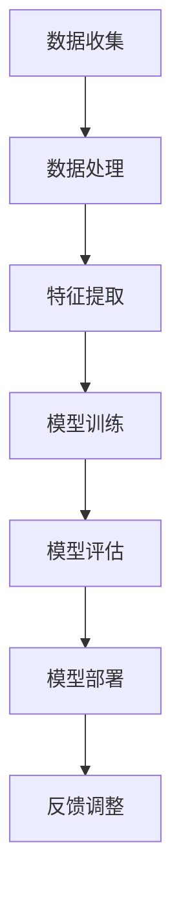

                 

 关键词：软件2.0，社会责任，科技向善，人工智能，伦理，可持续发展

> 摘要：本文探讨了软件 2.0 时代下，人工智能技术带来的社会责任。通过对当前人工智能技术的现状、存在的问题以及伦理问题进行深入分析，本文提出了科技向善的理念，并探讨了如何在实际应用中实现这一理念。

## 1. 背景介绍

随着互联网、大数据、云计算等技术的飞速发展，人工智能（AI）已经成为当前科技领域的重要热点。人工智能技术不仅为各行各业带来了巨大的变革，也带来了新的挑战。特别是在软件 2.0 时代，软件系统变得更加智能、自动化，这使得人工智能的应用范围更加广泛，但也带来了更多的社会责任问题。

软件 2.0 是指基于互联网和云计算的软件系统，它具有高度的可扩展性、灵活性、智能化等特点。在软件 2.0 时代，人工智能技术得到了广泛应用，如智能推荐系统、自动驾驶、智能客服等。然而，随着人工智能技术的不断进步，其带来的社会责任问题也日益突出。

本文旨在探讨软件 2.0 时代下，人工智能技术带来的社会责任问题，并提出科技向善的理念，以期为解决这些问题提供一些思路。

## 2. 核心概念与联系

### 2.1 人工智能技术的基本原理

人工智能（AI）是一种模拟人类智能的技术，通过机器学习、深度学习、自然语言处理等方法，使计算机能够自主地学习、推理、决策和解决问题。人工智能技术的核心概念包括：

- **机器学习**：通过数据驱动的方式，使计算机自动地从数据中学习规律和模式。
- **深度学习**：一种特殊的机器学习方法，通过多层神经网络模拟人脑的神经元结构，实现复杂任务的学习和预测。
- **自然语言处理**：使计算机能够理解、生成和处理自然语言。

### 2.2 人工智能技术的应用领域

人工智能技术已经在许多领域得到了广泛应用，如：

- **医疗健康**：通过人工智能技术，可以实现疾病诊断、药物研发、智能健康管理等功能。
- **金融服务**：智能投顾、智能风控、智能客服等应用，提高了金融行业的效率和准确性。
- **智能交通**：自动驾驶、智能交通管理、智能导航等应用，为交通领域带来了变革。
- **智能城市**：智能安防、智能照明、智能环保等应用，为城市治理提供了技术支持。

### 2.3 人工智能技术的伦理问题

随着人工智能技术的广泛应用，其带来的伦理问题也日益突出。主要涉及以下几个方面：

- **隐私保护**：人工智能系统在收集、处理和分析数据时，可能侵犯用户的隐私权。
- **算法偏见**：人工智能算法可能因为数据偏见而导致决策的不公正，从而影响社会公平。
- **失业问题**：人工智能技术的发展可能导致部分职业的失业，引发社会不稳定。
- **可控性**：如何确保人工智能系统的可控性和安全性，以避免潜在的威胁。

### 2.4 人工智能技术的架构图

以下是一个简化的 Mermaid 流程图，展示了人工智能技术的基本架构：



## 3. 核心算法原理 & 具体操作步骤

### 3.1 算法原理概述

在人工智能领域，常用的算法包括机器学习算法、深度学习算法和自然语言处理算法。以下将分别介绍这些算法的基本原理。

#### 3.1.1 机器学习算法

机器学习算法是通过训练模型来学习数据中的规律，从而进行预测或分类。常见的机器学习算法有：

- **线性回归**：通过建立一个线性模型来预测数值型目标变量。
- **逻辑回归**：通过建立一个线性模型来预测概率值。
- **支持向量机**：通过寻找一个最佳的超平面来分类数据。
- **决策树**：通过构建树形模型来分类或回归数据。

#### 3.1.2 深度学习算法

深度学习算法是一种特殊的机器学习方法，通过多层神经网络来实现复杂任务的学习和预测。常见的深度学习算法有：

- **卷积神经网络（CNN）**：通过卷积层、池化层和全连接层来处理图像数据。
- **循环神经网络（RNN）**：通过隐藏层和循环结构来处理序列数据。
- **长短期记忆网络（LSTM）**：通过记忆单元来处理长序列数据。

#### 3.1.3 自然语言处理算法

自然语言处理算法通过建立模型来理解、生成和处理自然语言。常见的自然语言处理算法有：

- **词向量表示**：通过将词语映射到高维空间来表示词语。
- **序列标注**：通过建立模型来对序列数据进行分类标注。
- **文本生成**：通过生成模型来生成新的文本。

### 3.2 算法步骤详解

以下是一个基于机器学习的分类任务的基本步骤：

#### 3.2.1 数据收集

收集用于训练的数据集，数据集应包含输入特征和目标变量。

#### 3.2.2 数据预处理

对数据进行清洗、归一化等预处理操作，以提高模型训练的效果。

#### 3.2.3 特征提取

从原始数据中提取有用的特征，用于训练模型。

#### 3.2.4 模型选择

根据任务类型和数据特点，选择合适的机器学习算法。

#### 3.2.5 模型训练

使用训练数据集对模型进行训练，通过调整模型参数来优化模型性能。

#### 3.2.6 模型评估

使用验证数据集对模型进行评估，以确定模型的效果。

#### 3.2.7 模型部署

将训练好的模型部署到实际应用场景中，进行预测或分类任务。

### 3.3 算法优缺点

#### 3.3.1 优点

- **强大的预测能力**：通过学习数据中的规律，机器学习算法可以做出准确的预测。
- **灵活的模型选择**：机器学习算法种类繁多，可以根据不同任务和数据特点选择合适的算法。
- **自动化的特征提取**：机器学习算法可以自动地从原始数据中提取有用的特征，减轻了人工特征工程的工作量。

#### 3.3.2 缺点

- **对数据质量要求高**：机器学习算法对数据质量要求较高，数据质量问题会影响模型的性能。
- **过拟合问题**：机器学习模型可能会对训练数据过度拟合，导致在验证数据上表现不佳。
- **模型解释性差**：许多机器学习模型（如深度学习模型）的黑箱特性，使得其结果难以解释。

### 3.4 算法应用领域

机器学习算法在许多领域都有广泛的应用，如：

- **金融**：信用评分、风险控制、智能投顾等。
- **医疗**：疾病诊断、药物研发、个性化治疗等。
- **电商**：推荐系统、用户行为分析等。
- **交通**：智能交通管理、自动驾驶等。

## 4. 数学模型和公式 & 详细讲解 & 举例说明

### 4.1 数学模型构建

在人工智能领域中，常用的数学模型包括线性模型、概率模型和神经网络模型。以下将分别介绍这些模型的基本公式和构建方法。

#### 4.1.1 线性模型

线性模型是一种简单的机器学习模型，通过建立一个线性方程来预测目标变量。其基本公式如下：

$$
y = \beta_0 + \beta_1 x_1 + \beta_2 x_2 + ... + \beta_n x_n
$$

其中，$y$ 是目标变量，$x_1, x_2, ..., x_n$ 是输入特征，$\beta_0, \beta_1, \beta_2, ..., \beta_n$ 是模型的参数。

线性模型的构建方法主要包括：

- **最小二乘法**：通过最小化预测值与实际值之间的误差平方和来确定参数。
- **梯度下降法**：通过迭代更新参数，使得预测值逐渐逼近实际值。

#### 4.1.2 概率模型

概率模型通过建立概率分布来预测目标变量的概率分布。常见的概率模型包括贝叶斯网络、隐马尔可夫模型等。

以贝叶斯网络为例，其基本公式如下：

$$
P(A|B) = \frac{P(B|A)P(A)}{P(B)}
$$

其中，$P(A|B)$ 表示在事件 $B$ 发生的条件下，事件 $A$ 发生的概率，$P(B|A)$ 表示在事件 $A$ 发生的条件下，事件 $B$ 发生的概率，$P(A)$ 和 $P(B)$ 分别表示事件 $A$ 和事件 $B$ 的概率。

贝叶斯网络的构建方法主要包括：

- **结构学习**：通过学习变量间的依赖关系来确定网络的拓扑结构。
- **参数学习**：通过学习变量间的条件概率分布来确定网络的参数。

#### 4.1.3 神经网络模型

神经网络模型是一种复杂的机器学习模型，通过多层神经网络来实现复杂任务的学习和预测。常见的神经网络模型包括卷积神经网络（CNN）、循环神经网络（RNN）等。

以卷积神经网络为例，其基本公式如下：

$$
h_l = \sigma(\mathbf{W}_l \cdot \mathbf{a}_{l-1} + \mathbf{b}_l)
$$

其中，$h_l$ 表示第 $l$ 层的输出，$\sigma$ 表示激活函数，$\mathbf{W}_l$ 和 $\mathbf{b}_l$ 分别表示第 $l$ 层的权重和偏置。

卷积神经网络的构建方法主要包括：

- **卷积操作**：通过卷积操作来提取图像的特征。
- **池化操作**：通过池化操作来降低特征图的维度。
- **全连接层**：通过全连接层来实现分类或回归任务。

### 4.2 公式推导过程

以下将介绍线性回归模型的推导过程。

假设我们有一个线性回归模型，其公式为：

$$
y = \beta_0 + \beta_1 x_1 + \beta_2 x_2 + ... + \beta_n x_n
$$

我们需要通过最小化预测值与实际值之间的误差平方和来确定参数 $\beta_0, \beta_1, \beta_2, ..., \beta_n$。

误差平方和（SSE）的计算公式为：

$$
SSE = \sum_{i=1}^{n}(y_i - \hat{y}_i)^2
$$

其中，$y_i$ 表示第 $i$ 个实际值，$\hat{y}_i$ 表示第 $i$ 个预测值。

为了最小化 SSE，我们可以使用梯度下降法来更新参数：

$$
\beta_j = \beta_j - \alpha \frac{\partial SSE}{\partial \beta_j}
$$

其中，$\alpha$ 表示学习率，$\frac{\partial SSE}{\partial \beta_j}$ 表示 SSE 对 $\beta_j$ 的偏导数。

通过多次迭代更新参数，我们可以得到一个最小误差平方和的模型。

### 4.3 案例分析与讲解

以下是一个线性回归的案例，我们将使用 Python 中的 scikit-learn 库来实现线性回归模型。

#### 4.3.1 数据集准备

我们使用一个简单的数据集，其中包含两个特征和一个目标变量。

```python
import numpy as np
import matplotlib.pyplot as plt
from sklearn.linear_model import LinearRegression

# 数据集
X = np.array([[1, 2], [3, 4], [5, 6], [7, 8], [9, 10]])
y = np.array([1, 3, 5, 7, 9])

# 绘制散点图
plt.scatter(X[:, 0], X[:, 1], c=y, cmap=plt.cm.Spectral)
plt.xlabel('Feature 1')
plt.ylabel('Feature 2')
plt.show()
```

#### 4.3.2 模型训练

```python
# 创建线性回归模型
model = LinearRegression()

# 训练模型
model.fit(X, y)
```

#### 4.3.3 模型评估

```python
# 计算预测值
y_pred = model.predict(X)

# 计算误差平方和
squared_error = (y - y_pred) ** 2
squared_error_sum = np.sum(squared_error)

print(f"SSE: {squared_error_sum}")
```

#### 4.3.4 模型可视化

```python
# 绘制预测曲线
plt.plot(X[:, 0], y_pred, color='red')
plt.xlabel('Feature 1')
plt.ylabel('Target')
plt.scatter(X[:, 0], X[:, 1], c=y, cmap=plt.cm.Spectral)
plt.show()
```

## 5. 项目实践：代码实例和详细解释说明

### 5.1 开发环境搭建

为了完成本文中的项目实践，我们需要搭建一个基本的开发环境。以下是一个简单的 Python 开发环境搭建步骤：

1. **安装 Python**：从官方网站（https://www.python.org/）下载并安装 Python。
2. **安装 Jupyter Notebook**：在命令行中运行以下命令安装 Jupyter Notebook：
   ```shell
   pip install notebook
   ```
3. **安装必要的库**：在命令行中运行以下命令安装必要的库：
   ```shell
   pip install numpy matplotlib scikit-learn
   ```

### 5.2 源代码详细实现

以下是一个简单的线性回归项目，我们将使用 Python 和 scikit-learn 库来实现。

```python
import numpy as np
import matplotlib.pyplot as plt
from sklearn.linear_model import LinearRegression

# 数据集
X = np.array([[1, 2], [3, 4], [5, 6], [7, 8], [9, 10]])
y = np.array([1, 3, 5, 7, 9])

# 创建线性回归模型
model = LinearRegression()

# 训练模型
model.fit(X, y)

# 计算预测值
y_pred = model.predict(X)

# 计算误差平方和
squared_error = (y - y_pred) ** 2
squared_error_sum = np.sum(squared_error)

print(f"SSE: {squared_error_sum}")

# 绘制预测曲线
plt.plot(X[:, 0], y_pred, color='red')
plt.xlabel('Feature 1')
plt.ylabel('Target')
plt.scatter(X[:, 0], X[:, 1], c=y, cmap=plt.cm.Spectral)
plt.show()
```

### 5.3 代码解读与分析

1. **数据集准备**：我们使用一个简单的数据集，其中包含两个特征和一个目标变量。数据集采用 NumPy 数组的形式存储。
2. **模型创建**：我们使用 scikit-learn 中的 LinearRegression 类创建一个线性回归模型。
3. **模型训练**：使用 `fit()` 方法训练模型，将输入特征 X 和目标变量 y 传递给模型。
4. **预测值计算**：使用 `predict()` 方法计算预测值，将输入特征 X 传递给模型。
5. **误差计算**：计算实际值 y 和预测值 y_pred 之间的误差平方和，以评估模型的效果。
6. **模型可视化**：使用 Matplotlib 绘制预测曲线和散点图，以可视化模型的效果。

### 5.4 运行结果展示

运行上述代码后，我们将在命令行中看到误差平方和的输出，以及在 Jupyter Notebook 中展示的预测曲线和散点图。这表明我们的线性回归模型已经成功训练并可以用于预测任务。

## 6. 实际应用场景

### 6.1 医疗健康

在医疗健康领域，人工智能技术可以用于疾病诊断、药物研发、个性化治疗等方面。例如，通过分析大量的医疗数据，人工智能系统可以预测病人的病情，为医生提供诊断建议。此外，人工智能还可以用于药物筛选和研发，提高新药的研发效率和准确性。

### 6.2 金融

在金融领域，人工智能技术可以用于风险控制、智能投顾、欺诈检测等方面。例如，通过分析大量的金融数据，人工智能系统可以识别出潜在的风险，为金融机构提供风险控制策略。此外，人工智能还可以为用户提供个性化的投资建议，提高投资收益。

### 6.3 智能交通

在智能交通领域，人工智能技术可以用于交通流量预测、自动驾驶、智能交通管理等方面。例如，通过分析大量的交通数据，人工智能系统可以预测交通流量，为交通管理部门提供决策支持。此外，人工智能还可以实现自动驾驶功能，提高交通效率和安全性。

### 6.4 智能城市

在智能城市领域，人工智能技术可以用于智能安防、智能照明、智能环保等方面。例如，通过分析大量的城市数据，人工智能系统可以实时监测城市的安全状况，为城市管理部门提供决策支持。此外，人工智能还可以实现智能照明和智能环保功能，提高城市的管理效率和可持续发展。

## 7. 工具和资源推荐

### 7.1 学习资源推荐

1. **在线课程**：
   - Coursera 上的“机器学习”（吴恩达教授）
   - edX 上的“深度学习”（阿里云）
   - Udacity 上的“人工智能纳米学位”
2. **书籍**：
   - 《深度学习》（Ian Goodfellow、Yoshua Bengio、Aaron Courville 著）
   - 《Python机器学习》（Sebastian Raschka、Vahid Mirjalili 著）
   - 《机器学习实战》（Peter Harrington 著）

### 7.2 开发工具推荐

1. **编程语言**：
   - Python：广泛应用于数据科学和人工智能领域。
   - R：专门用于统计分析和数据可视化。
2. **库和框架**：
   - scikit-learn：Python 中常用的机器学习库。
   - TensorFlow：谷歌开发的深度学习框架。
   - PyTorch：基于 Python 的深度学习框架。

### 7.3 相关论文推荐

1. **经典论文**：
   - “A Fast Learning Algorithm for Deep Belief Nets” （Geoffrey E. Hinton、Osama Almeida、Rumelhart、David E. 1995）
   - “Deep Learning” （Ian Goodfellow、Yoshua Bengio、Aaron Courville 2016）
2. **最新论文**：
   - “BERT: Pre-training of Deep Bidirectional Transformers for Language Understanding” （Jacob Devlin、 Ming-Wei Chang、 Kenton Lee、Kristina Toutanova 2018）
   - “GPT-3: Language Models are Few-Shot Learners” （Tom B. Brown、Bence Koksal、Dhruv Batra、Arvind Neelakantan、Kevin Room、Sylvain Goujeon、Ashish Pitloo、Jeffrey Child、Niki Parmar 2020）

## 8. 总结：未来发展趋势与挑战

### 8.1 研究成果总结

在过去的几年中，人工智能技术取得了显著的进展，无论是在理论研究还是实际应用方面。深度学习、自然语言处理、计算机视觉等领域的突破性成果，为人工智能的发展奠定了坚实的基础。同时，随着计算能力的提升和数据量的增加，人工智能技术在各个领域的应用也变得更加广泛和深入。

### 8.2 未来发展趋势

1. **算法的优化和改进**：随着人工智能技术的不断发展，算法的优化和改进将成为研究的重点，如更高效的学习算法、更鲁棒的模型等。
2. **跨领域的融合**：人工智能技术将在更多领域得到应用，如生物医学、社会科学等，跨领域的融合将带来新的研究机遇。
3. **量子计算的应用**：量子计算与人工智能的结合，将有望推动人工智能技术的发展到一个新的阶段。

### 8.3 面临的挑战

1. **数据安全和隐私**：随着人工智能技术的应用，数据安全和隐私问题日益突出，如何在保障用户隐私的同时，充分利用数据的价值，是一个亟待解决的问题。
2. **算法偏见和伦理问题**：人工智能算法的偏见和伦理问题，如算法歧视、透明度低等，需要得到广泛关注和解决。
3. **人才缺口**：随着人工智能技术的快速发展，对专业人才的需求也日益增加，如何培养和吸引更多的人才，是一个重要的挑战。

### 8.4 研究展望

在未来，人工智能技术将继续向更智能、更高效、更安全、更公平的方向发展。同时，随着技术的进步，人工智能将在更多的领域发挥重要作用，为人类社会带来更多的价值和变革。

## 9. 附录：常见问题与解答

### 9.1 人工智能是什么？

人工智能（AI）是一种模拟人类智能的技术，通过机器学习、深度学习、自然语言处理等方法，使计算机能够自主地学习、推理、决策和解决问题。

### 9.2 人工智能技术有哪些应用领域？

人工智能技术广泛应用于医疗健康、金融、智能交通、智能城市、电子商务等多个领域。

### 9.3 人工智能技术存在哪些伦理问题？

人工智能技术存在的伦理问题主要包括隐私保护、算法偏见、失业问题、可控性等。

### 9.4 如何保障人工智能技术的安全性和透明度？

保障人工智能技术的安全性和透明度需要从多个方面进行努力，如加强数据安全和隐私保护、提高算法透明度、建立监管机制等。

### 9.5 人工智能技术对未来有哪些影响？

人工智能技术对未来社会的影响将是深远和全面的，包括改变工作方式、提高生活质量、推动科技进步等。但同时，也可能带来一些挑战，如就业问题、社会不平等等。

### 9.6 如何培养人工智能人才？

培养人工智能人才需要从教育、培训、实践等多个方面进行努力，如设置相关专业课程、提供实践机会、组织竞赛活动等。

### 9.7 人工智能技术的未来发展趋势是什么？

人工智能技术的未来发展趋势包括算法优化、跨领域融合、量子计算的应用等。

## 作者署名

作者：禅与计算机程序设计艺术 / Zen and the Art of Computer Programming
----------------------------------------------------------------


