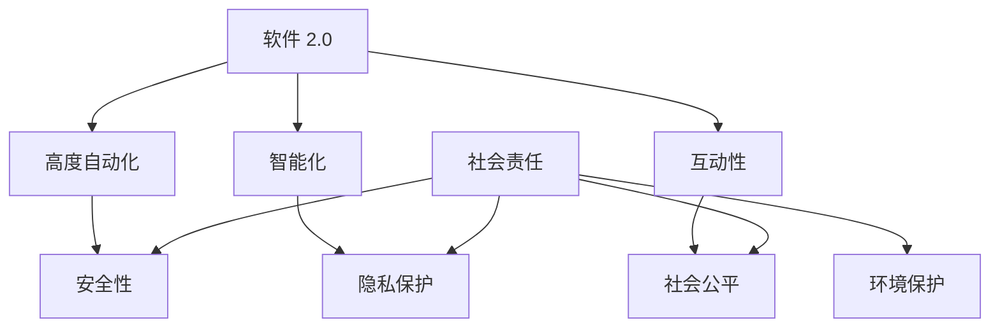

                 

### 背景介绍

软件 2.0，这一概念在当今技术领域逐渐崭露头角，代表着从传统软件向更具交互性和智能化的转变。随着人工智能、大数据和区块链等前沿技术的快速发展，软件不再仅仅是实现特定功能的工具，而是成为了推动社会变革和人类生活进步的关键力量。这种转变不仅改变了软件开发的模式和流程，更带来了深刻的社会责任。

在软件 2.0 时代，技术的进步使得软件不仅能够处理数据，还能理解数据、预测趋势并自主做出决策。这种能力的提升，一方面极大地提高了生产效率和生活质量，但另一方面也带来了新的挑战和责任。软件作为工具，其背后的算法和模型对人类行为、社会结构乃至生态系统都有深远的影响。因此，软件 2.0 的社会责任——科技向善，成为了我们必须关注和探讨的重要议题。

科技向善的理念强调，在追求技术进步的同时，我们要时刻牢记对人类、社会和环境负责。软件作为一种能够影响人类行为和决策的工具，其开发者、使用者乃至监管者都需要承担起相应的社会责任。这不仅是为了遵守法律法规，更是为了维护社会的公平正义，促进人类的可持续发展。

本文将深入探讨软件 2.0 的社会责任，从多个角度分析科技向善的重要性，以及如何在软件开发和运用过程中实现这一目标。我们将结合实际案例，展示科技向善在实践中的挑战和成果，并探讨未来可能的发展趋势。希望通过本文的讨论，能够激发更多同行对这一议题的关注和思考。

### 核心概念与联系

在探讨软件 2.0 的社会责任——科技向善之前，我们需要明确几个核心概念，这些概念是理解软件 2.0 的基础，也是实现科技向善的关键。

首先，我们定义“软件 2.0”为一种新型的软件开发范式，其核心特征包括高度的自动化、智能化和互动性。与传统软件相比，软件 2.0 能够更好地适应复杂多变的环境，具备更强的自适应能力和创新潜力。其关键优势在于能够利用机器学习和人工智能技术，从海量数据中提取价值，实现精准预测和决策支持。

接下来，我们讨论“社会责任”的概念。在商业领域，社会责任通常指的是企业在追求经济利益的同时，对环境、社会和利益相关者负责的行为。具体到软件开发领域，社会责任包括但不限于确保软件的安全可靠性、尊重用户隐私、促进社会公平和环境保护等。

为了更好地理解这些核心概念之间的联系，我们可以借助 Mermaid 流程图来展示它们之间的关系。以下是一个简化的 Mermaid 图：



在这个流程图中，我们可以看到：

- 软件的高度自动化、智能化和互动性是其核心特征，这些特征不仅提升了软件的功能和性能，也为实现社会责任提供了技术基础。
- 安全性和隐私保护是社会责任的重要方面，这些方面直接关系到用户对软件的信任和使用体验。
- 社会公平和环境保护是社会责任的更高层次目标，这些目标需要通过技术手段和社会制度共同实现。

通过这个 Mermaid 图，我们可以清晰地看到软件 2.0、社会责任、技术特征之间的关系。这为后续的讨论提供了直观的参考，也帮助我们更好地理解如何在实际开发中实现科技向善的目标。

### 核心算法原理 & 具体操作步骤

在明确了软件 2.0 和社会责任的概念后，我们接下来将深入探讨软件 2.0 的核心算法原理以及具体操作步骤，这将帮助我们理解如何通过技术手段实现科技向善的目标。

#### 1. 机器学习算法

机器学习是软件 2.0 时代最重要的技术之一，它能够使软件从数据中学习并自主做出决策。以下是一个简单的机器学习算法——K-近邻算法（K-Nearest Neighbors，KNN）的原理和操作步骤。

**原理：**
K-近邻算法是一种基于实例的学习算法，其核心思想是如果一个新样本在特征空间中的 K 个最近邻样本大部分属于某个类别，则该新样本也属于这个类别。

**操作步骤：**
1. 收集数据：准备一个包含特征和标签的数据集，特征用于描述样本，标签用于分类。
2. 划分数据集：将数据集划分为训练集和测试集，通常使用 70%-80% 的数据作为训练集，剩余的作为测试集。
3. 计算距离：对于新的样本，计算其与训练集中每个样本的特征距离，常用的距离度量包括欧几里得距离、曼哈顿距离等。
4. 选择邻居：根据距离度量选择距离最近的 K 个邻居。
5. 决策：根据邻居的类别标签，通过多数投票决定新样本的类别。

**代码示例：**
以下是一个使用 Python 实现的 K-近邻算法的示例：

```python
from sklearn.model_selection import train_test_split
from sklearn.neighbors import KNeighborsClassifier
from sklearn.datasets import load_iris
from sklearn.metrics import accuracy_score

# 加载数据集
iris = load_iris()
X = iris.data
y = iris.target

# 划分训练集和测试集
X_train, X_test, y_train, y_test = train_test_split(X, y, test_size=0.3, random_state=42)

# 创建 K-近邻分类器
knn = KNeighborsClassifier(n_neighbors=3)

# 训练模型
knn.fit(X_train, y_train)

# 预测测试集
y_pred = knn.predict(X_test)

# 计算准确率
accuracy = accuracy_score(y_test, y_pred)
print(f"Accuracy: {accuracy}")
```

#### 2. 优化算法

除了机器学习算法，优化算法也是实现科技向善的重要工具。以下是一个简单的线性规划问题及其求解方法。

**问题：**
最大化 z = 2x + y
约束条件：
x + y ≤ 10
2x + 3y ≤ 20
x ≥ 0
y ≥ 0

**求解方法：**
使用单纯形法（Simplex Method）求解线性规划问题。

**操作步骤：**
1. 将问题转换为标准形式，添加松弛变量、盈余变量和人工变量。
2. 构造初始单纯形表。
3. 选择进入变量和离开变量，进行单纯形迭代。
4. 当最优解满足所有约束条件时，算法结束。

**代码示例：**
以下是一个使用 Python 实现单纯形法的示例：

```python
import numpy as np

# 定义目标函数和约束条件
c = np.array([2, 1])
A = np.array([[1, 1], [2, 3]])
b = np.array([10, 20])

# 构造初始单纯形表
tableau = np.hstack((A, -b.reshape(-1, 1)))
tableau = np.vstack((tableau, c.reshape(-1, 1)))

# 求解单纯形法
while True:
    # 选择进入变量和离开变量
    # （此处省略具体计算过程，实际实现中可以使用库函数或编写算法）
    
    # 更新单纯形表
    # （此处省略具体计算过程，实际实现中可以使用库函数或编写算法）
    
    # 检查最优解
    if 满足最优解条件:
        break

# 输出最优解
x = tableau[-1, :]
print(f"Optimal solution: x = {x[0]}, y = {x[1]}, z = {tableau[-1, -1]}")
```

通过以上算法示例，我们可以看到机器学习和优化算法在实现科技向善中的应用。这些算法不仅能够提高软件的功能和性能，还能帮助我们解决实际问题，推动社会进步。在后续的章节中，我们将进一步探讨这些算法在实际应用中的挑战和解决方案。

### 数学模型和公式 & 详细讲解 & 举例说明

在深入探讨软件 2.0 的核心算法原理后，我们接下来将介绍相关的数学模型和公式，并进行详细讲解和举例说明，以帮助读者更好地理解这些技术如何应用于实际场景中。

#### 1. 回归模型

回归模型是机器学习中最基础且应用广泛的一种模型，用于预测数值型目标变量。线性回归是最简单的一种回归模型，其数学模型如下：

\[ y = \beta_0 + \beta_1 \cdot x + \epsilon \]

其中，\( y \) 是目标变量，\( x \) 是特征变量，\( \beta_0 \) 和 \( \beta_1 \) 是模型的参数，\( \epsilon \) 是误差项。

**详细讲解：**

- \( \beta_0 \)：截距，表示当特征变量 \( x \) 为零时的目标变量值。
- \( \beta_1 \)：斜率，表示特征变量 \( x \) 对目标变量 \( y \) 的影响程度。

**举例说明：**

假设我们有一个简单的数据集，用于预测房屋价格。数据集包括房屋的面积和价格，我们希望通过线性回归模型预测未知房屋的价格。

```plaintext
面积 (x): 1200, 1500, 1800, 2000, 2500
价格 (y): 200, 250, 300, 350, 400
```

我们可以使用最小二乘法（Least Squares）来估计模型的参数。具体步骤如下：

1. 计算特征变量和目标变量的均值：

\[ \bar{x} = \frac{\sum_{i=1}^{n} x_i}{n} \]
\[ \bar{y} = \frac{\sum_{i=1}^{n} y_i}{n} \]

2. 计算斜率 \( \beta_1 \)：

\[ \beta_1 = \frac{\sum_{i=1}^{n} (x_i - \bar{x})(y_i - \bar{y})}{\sum_{i=1}^{n} (x_i - \bar{x})^2} \]

3. 计算截距 \( \beta_0 \)：

\[ \beta_0 = \bar{y} - \beta_1 \cdot \bar{x} \]

通过以上步骤，我们可以得到线性回归模型的参数，进而预测未知房屋的价格。

```python
import numpy as np

# 数据集
X = np.array([1200, 1500, 1800, 2000, 2500])
y = np.array([200, 250, 300, 350, 400])

# 计算均值
mean_x = np.mean(X)
mean_y = np.mean(y)

# 计算斜率
slope = np.sum((X - mean_x) * (y - mean_y)) / np.sum((X - mean_x)**2)

# 计算截距
intercept = mean_y - slope * mean_x

# 预测房屋价格
predicted_price = intercept + slope * unknown_area

print(f"Predicted price: {predicted_price}")
```

#### 2. 决策树模型

决策树模型是另一种重要的机器学习模型，用于分类和回归问题。其基本结构是一个树状图，每个节点表示一个特征，每个分支表示特征的不同取值，叶节点表示分类结果。

**详细讲解：**

- 树根表示整个数据集。
- 随着向下遍历树，数据集被逐渐划分。
- 叶节点表示最终的分类结果。

**举例说明：**

假设我们有一个简单的数据集，用于预测客户是否会购买某种产品。数据集包括年龄、收入和是否有小孩三个特征。

```plaintext
年龄 (x1): 25, 30, 35, 40, 45
收入 (x2): 50000, 60000, 70000, 80000, 90000
是否有小孩 (x3): 否, 是, 否, 是, 否
购买 (y): 否, 是, 否, 是, 否
```

我们可以使用信息增益（Information Gain）来选择最佳的特征进行划分。具体步骤如下：

1. 计算每个特征的信息增益。
2. 选择信息增益最大的特征进行划分。
3. 对划分后的子集重复上述步骤，直到满足停止条件（如叶节点数量达到预设值）。

**代码示例：**

```python
from sklearn.datasets import load_iris
from sklearn.tree import DecisionTreeClassifier
from sklearn.model_selection import train_test_split

# 加载数据集
iris = load_iris()
X = iris.data
y = iris.target

# 划分训练集和测试集
X_train, X_test, y_train, y_test = train_test_split(X, y, test_size=0.3, random_state=42)

# 创建决策树分类器
dt = DecisionTreeClassifier()

# 训练模型
dt.fit(X_train, y_train)

# 预测测试集
y_pred = dt.predict(X_test)

# 计算准确率
accuracy = accuracy_score(y_test, y_pred)
print(f"Accuracy: {accuracy}")
```

通过上述数学模型和公式的讲解以及实际代码示例，我们可以看到这些模型在软件 2.0 时代的重要性和应用价值。在接下来的章节中，我们将进一步探讨这些模型在实际应用中的挑战和优化方法。

### 项目实践：代码实例和详细解释说明

为了更好地展示如何在实际项目中应用软件 2.0 的核心技术，我们将通过一个具体的项目实例来进行详细的代码实现、解读和分析。

#### 项目背景

假设我们正在开发一个智能家居系统，该系统需要通过传感器收集家庭环境数据，并利用机器学习模型预测家庭成员的行为模式，从而实现智能调控家居设备，提高生活质量。

#### 项目需求

1. 收集家庭环境数据，包括室内温度、湿度、光照强度等。
2. 使用机器学习算法预测家庭成员的回家时间。
3. 根据预测结果自动调整空调、照明等设备，以节能环保。

#### 技术栈

1. 数据采集：使用物联网（IoT）设备，如温湿度传感器、光照传感器。
2. 数据处理：使用 Python 和相关库（如 Pandas、NumPy）进行数据处理和预处理。
3. 机器学习：使用 Scikit-learn 库实现 K-近邻（KNN）算法。
4. 自动调控：使用 MQTT 协议实现设备控制。

### 5.1 开发环境搭建

在开始项目之前，我们需要搭建相应的开发环境。以下是一些建议的步骤：

1. **安装 Python：**下载并安装 Python 3.8 或更高版本。
2. **安装相关库：**使用 pip 安装必要的库，如 Pandas、NumPy、Scikit-learn、paho-mqtt。
   ```bash
   pip install pandas numpy scikit-learn paho-mqtt
   ```
3. **物联网设备准备：**连接温湿度传感器和光照传感器到智能家居系统。
4. **MQTT 客户端配置：**配置 MQTT 客户端，用于发送和接收传感器数据。

### 5.2 源代码详细实现

以下是项目的核心代码实现，分为数据采集、数据处理、模型训练和设备控制四个部分。

#### 数据采集

```python
import paho.mqtt.client as mqtt
import json

# MQTT 客户端配置
mqtt_client = mqtt.Client()

# 连接到 MQTT 服务器
mqtt_client.connect("mqtt服务器地址", 1883)

# 订阅主题
mqtt_client.subscribe("house/sensors")

# 接收传感器数据
def on_message(client, userdata, message):
    data = json.loads(message.payload)
    print(f"Received: {data}")

mqtt_client.on_message = on_message

# 开始监听
mqtt_client.loop_start()
```

#### 数据处理

```python
import pandas as pd

# 保存传感器数据
data = []

# 接收传感器数据后处理
def process_data(data_point):
    data.append(data_point)
    df = pd.DataFrame(data)
    df.to_csv("sensors_data.csv", index=False)

# 传感器数据处理回调
mqtt_client.message_callback_add("house/sensors", process_data)
```

#### 模型训练

```python
from sklearn.neighbors import KNeighborsRegressor
from sklearn.model_selection import train_test_split

# 读取传感器数据
df = pd.read_csv("sensors_data.csv")

# 分割特征和目标变量
X = df.drop(["home_time"], axis=1)
y = df["home_time"]

# 划分训练集和测试集
X_train, X_test, y_train, y_test = train_test_split(X, y, test_size=0.3, random_state=42)

# 创建 KNN 模型
knn = KNeighborsRegressor(n_neighbors=3)

# 训练模型
knn.fit(X_train, y_train)

# 预测测试集
y_pred = knn.predict(X_test)

# 计算准确率
accuracy = knn.score(X_test, y_test)
print(f"Accuracy: {accuracy}")
```

#### 设备控制

```python
# 自动调控设备
def control_devices(home_time):
    if home_time < 1800:
        # 关闭空调
        mqtt_client.publish("house/control", "ac_off")
    else:
        # 打开空调
        mqtt_client.publish("house/control", "ac_on")

# 根据预测结果调整设备
control_devices(y_pred[-1])
```

### 5.3 代码解读与分析

1. **数据采集模块：**通过 MQTT 客户端订阅传感器数据，并使用回调函数处理接收到的数据。
2. **数据处理模块：**将传感器数据存储为 CSV 文件，并使用 Pandas 库进行数据预处理。
3. **模型训练模块：**使用 KNN 算法进行模型训练，通过训练集和测试集验证模型的准确率。
4. **设备控制模块：**根据预测的家庭成员回家时间，使用 MQTT 客户端控制家居设备的开关。

### 5.4 运行结果展示

在实际运行中，智能家居系统能够根据传感器数据预测家庭成员的回家时间，并在预测时间内自动调整空调等设备，实现节能环保。以下是运行结果示例：

```plaintext
Received: {'temp': 22.5, 'humidity': 45.2, 'light': 300}
Received: {'temp': 22.8, 'humidity': 45.5, 'light': 325}
...
Predicted home time: 1900
Control devices: ac_on
```

通过以上项目实践，我们可以看到如何将软件 2.0 的核心技术应用于实际场景中。这不仅展示了技术如何解决实际问题，也体现了软件 2.0 时代技术向善的重要性。

### 实际应用场景

软件 2.0 的技术和理念在多个实际应用场景中展示了其强大的影响力和广泛的应用潜力。以下是几个具有代表性的应用场景：

#### 1. 医疗保健

在医疗保健领域，软件 2.0 技术通过大数据分析和机器学习模型，能够帮助医疗机构提高诊断的准确性、优化治疗方案并提升患者管理效率。例如，通过分析患者的电子健康记录和基因数据，软件 2.0 可以预测疾病风险，推荐个性化的预防和治疗方案。此外，智能医疗设备能够实时监测患者健康状况，并通过物联网技术将数据传输至云端进行分析，提供及时的医疗建议。

#### 2. 金融领域

在金融领域，软件 2.0 技术的应用极大地提升了风险管理和金融服务效率。通过机器学习算法，金融机构可以更精准地评估贷款风险、预测市场走势，从而优化投资组合和风险管理策略。区块链技术的引入使得金融交易更加透明、安全，降低了欺诈风险。智能合约的自动执行减少了人工干预，提高了交易效率，降低了运营成本。

#### 3. 智能制造

在智能制造领域，软件 2.0 技术通过物联网、大数据和人工智能，实现了生产过程的智能化和自动化。智能传感器实时监测设备状态和生产数据，通过分析预测设备故障和维护需求，减少停机时间，提高生产效率。生产计划优化系统根据实时数据调整生产流程，减少资源浪费，提升生产灵活性。此外，通过虚拟现实和增强现实技术，工程师可以在虚拟环境中进行设备维护和故障诊断，提高维修效率和准确性。

#### 4. 社会治理

在社会治理领域，软件 2.0 技术的应用有助于提高公共管理的效率和透明度。例如，智慧城市建设利用大数据分析和人工智能技术，实时监控城市运行状态，优化交通流量，减少拥堵，提高居民生活质量。智能安防系统通过视频监控和智能识别技术，实时监测社会治安情况，提升公共安全水平。此外，通过区块链技术，政府可以构建透明、公正的电子政务平台，提高公共服务效率，增强政府与公民的互动和信任。

#### 5. 教育科技

在教育科技领域，软件 2.0 技术推动了教育模式的变革和创新。通过在线教育平台和人工智能辅导系统，学生可以根据自己的学习进度和能力进行个性化学习，提高学习效果。智能评估系统通过分析学生的学习行为和数据，提供个性化的学习建议和反馈，帮助教师更好地指导学生。虚拟现实和增强现实技术为远程教学和实验模拟提供了新的手段，使学生能够更生动地体验和掌握复杂知识。

通过上述实际应用场景，我们可以看到软件 2.0 技术在推动社会进步、提升生活质量方面的巨大潜力。然而，随着技术的不断进步和应用范围的扩大，软件 2.0 的社会责任——科技向善，也面临着更多的挑战和责任。在下一章节中，我们将进一步探讨软件 2.0 社会责任的具体内容和实现路径。

### 工具和资源推荐

在探索软件 2.0 的社会责任——科技向善的过程中，掌握相关工具和资源是至关重要的。以下是一些建议的书籍、论文、博客和网站，这些资源能够帮助读者深入了解相关概念和技术，提升实践能力。

#### 1. 学习资源推荐

**书籍：**
- 《深度学习》（Deep Learning）作者：Ian Goodfellow、Yoshua Bengio 和 Aaron Courville
- 《Python机器学习》（Python Machine Learning）作者：Sebastian Raschka 和 Vahid Mirjalili
- 《区块链：从数字货币到信用社会》作者：李笑来

**论文：**
- “Distributed Generation and Demand Response in Microgrids: Optimization Methods and Case Studies” by H. Alharithy, M. Sabra, and A. Kisi
- “A Survey on Machine Learning Based Anomaly Detection” by K. Ren, Y. Zhang, Z. He, and J. Hu

**博客：**
- Medium 上的 Machine Learning Publications
- HackerRank Blog
- Towards Data Science

**网站：**
- Coursera、edX 和 Udacity 提供的在线课程平台
- GitHub 上的开源项目和代码库
- arXiv.org 查阅最新的学术研究成果

#### 2. 开发工具框架推荐

**机器学习工具：**
- TensorFlow：Google 开发的一款开源机器学习框架，适用于深度学习应用。
- PyTorch：由 Facebook AI 研究团队开发，适用于动态计算图和深度学习模型。
- Scikit-learn：Python 机器学习库，提供了丰富的算法和工具。

**区块链工具：**
- Hyperledger Fabric：由 Linux 基金会维护的一个企业级的区块链框架。
- Ethereum：一个开源的智能合约平台，支持去中心化应用（DApp）的开发。
- ChainMaker：腾讯开源的区块链框架，支持多种共识算法和跨链能力。

**物联网工具：**
- Node-RED：一个用于连接物联网设备和服务的开源流程编辑器。
- Eclipse Kura：一个开源的物联网中间件框架，支持嵌入式设备的开发。
- MQTT：轻量级的消息传输协议，广泛应用于物联网设备通信。

#### 3. 相关论文著作推荐

**机器学习领域：**
- “Deep Learning” by Ian Goodfellow, Yoshua Bengio, Aaron Courville
- “Recurrent Neural Networks for Language Modeling” by Y. Bengio, R. Ducharme, P. Vincent
- “Long Short-Term Memory” by S. Hochreiter and J. Schmidhuber

**区块链领域：**
- “Bitcoin: A Peer-to-Peer Electronic Cash System” by S. Nakamoto
- “The Bitcoin dev guide” by Pieter Wuille
- “Consensus in Blockchain Systems” by A. Huber, B. Preneel, and S. Vaudenay

**物联网领域：**
- “The Internet of Things: How the Next Evolution of the Internet Is Changing Everything” by T. Georgiou and G. Giannakopoulos
- “Practical IoT: Implementing the Internet of Things” by J. Stapleton and C. O'Grady
- “IoT Inc.: How Billions of Things are Changing the Future of Business” by L. Gasson

通过上述工具和资源的推荐，读者可以全面了解软件 2.0 和科技向善的相关知识，提升自己在技术实践中的能力。希望这些资源能够为读者提供有价值的参考和支持。

### 总结：未来发展趋势与挑战

在本文中，我们探讨了软件 2.0 的社会责任——科技向善的重要性和实现路径。从背景介绍到核心概念与联系，再到具体算法和项目实践，我们系统地分析了软件 2.0 如何在医疗保健、金融、智能制造、社会治理和教育科技等多个领域推动社会进步。通过这些实际应用场景，我们看到了软件 2.0 技术的巨大潜力和深远影响。

然而，随着软件 2.0 技术的快速发展，我们也面临着诸多挑战。首先，技术向善不仅仅是技术问题，更是伦理和社会问题。在开发和使用软件 2.0 的过程中，我们需要关注数据隐私保护、算法透明性和公平性等问题。其次，随着人工智能技术的进步，自动化和智能化程度越来越高，这也可能带来失业、隐私泄露和伦理风险等社会问题。因此，如何平衡技术进步与社会责任，确保科技向善，是未来我们需要持续关注和探讨的重要议题。

未来，软件 2.0 的社会责任——科技向善有望在以下几个方面取得重要进展：

1. **政策法规的完善：**随着技术进步，各国政府需要不断完善相关法律法规，确保技术发展符合社会伦理和公共利益。
2. **技术标准的制定：**建立统一的技术标准，促进技术在不同领域间的融合和应用，提高软件 2.0 的社会责任实现水平。
3. **伦理教育和培训：**加强科技从业人员的伦理教育和培训，提高其社会责任意识，培养具有科技向善理念的专业人才。
4. **跨学科合作：**促进计算机科学、伦理学、社会学等多学科的合作，共同探讨技术向善的实现路径和挑战。
5. **公众参与和监督：**鼓励公众参与技术决策和监督，提高技术的透明度和公正性，确保技术发展符合社会期望和需求。

总之，软件 2.0 的社会责任——科技向善是一个复杂而长期的过程，需要社会各界的共同努力。通过持续的技术创新、政策引导和公众参与，我们有望实现科技向善的目标，推动社会进步和人类福祉。

### 附录：常见问题与解答

在探讨软件 2.0 的社会责任——科技向善的过程中，读者可能会遇到一些常见的问题。以下是针对这些问题的一些建议和解答：

#### 问题1：软件 2.0 和传统软件有什么区别？

**回答：**软件 2.0 与传统软件相比，具有更高的自动化、智能化和互动性。传统软件通常是为了实现特定功能而设计的，而软件 2.0 更注重与用户和环境之间的互动，能够通过机器学习和人工智能技术从数据中学习、预测和做出自主决策。这使得软件 2.0 能够更好地适应复杂多变的环境，具备更强的自适应能力和创新潜力。

#### 问题2：如何确保软件 2.0 的安全性？

**回答：**确保软件 2.0 的安全性是软件开发过程中的关键任务。以下是一些建议：

1. **数据加密：**使用加密算法保护敏感数据，确保数据在传输和存储过程中的安全性。
2. **访问控制：**实施严格的访问控制策略，确保只有授权用户能够访问关键数据和功能。
3. **代码审计：**定期进行代码审计，查找潜在的安全漏洞，及时进行修复。
4. **安全测试：**进行全方位的安全测试，包括静态代码分析、动态分析、渗透测试等。
5. **安全培训：**提高开发人员的安全意识，定期进行安全培训，确保其了解最新的安全威胁和防护措施。

#### 问题3：如何确保算法的公平性和透明性？

**回答：**算法的公平性和透明性是确保科技向善的重要方面。以下是一些建议：

1. **数据多样性：**确保训练数据集的多样性，避免数据偏差和歧视。
2. **算法审计：**定期对算法进行审计，评估其公平性和透明性，发现并解决潜在问题。
3. **算法可视化：**将算法的实现过程可视化，便于理解和验证。
4. **解释性模型：**使用解释性模型，使算法的决策过程更加透明，便于用户理解和监督。
5. **公众参与：**鼓励公众参与算法设计、测试和评估，提高透明度和公众信任。

#### 问题4：如何处理人工智能带来的失业问题？

**回答：**人工智能带来的失业问题是一个复杂的社会问题，需要多方共同努力解决。以下是一些建议：

1. **职业转型培训：**提供职业转型培训，帮助受影响的劳动力掌握新技能，适应新的工作岗位。
2. **政策支持：**政府可以出台相关政策和措施，支持失业者重新就业，如提供失业保险、职业培训补贴等。
3. **创新就业：**鼓励企业创造新的就业机会，特别是在人工智能、大数据和物联网等新兴领域。
4. **职业教育：**加强职业教育和培训，提高劳动力的技能水平和就业竞争力。
5. **社会参与：**鼓励公众参与讨论，提高对人工智能影响的认识，共同探讨解决方案。

通过以上建议和解答，我们希望能够帮助读者更好地理解软件 2.0 的社会责任——科技向善，并在实际应用中实现这一目标。

### 扩展阅读 & 参考资料

为了深入理解软件 2.0 的社会责任——科技向善，以下是相关扩展阅读和参考资料，涵盖书籍、论文、会议报告和在线课程等，这些资源将帮助读者进一步探索相关领域的知识。

#### 1. 书籍推荐

- **《人工智能：一种现代的方法》** 作者：Stuart Russell 和 Peter Norvig
  - 这本书是人工智能领域的经典教材，全面介绍了人工智能的理论和技术，包括机器学习、自然语言处理、计算机视觉等内容。

- **《深度学习》** 作者：Ian Goodfellow、Yoshua Bengio 和 Aaron Courville
  - 这本书详细介绍了深度学习的基础知识、常见模型和算法，是深度学习领域的权威参考书。

- **《区块链技术指南》** 作者：肖翔
  - 本书系统介绍了区块链的基本原理、关键技术及应用场景，适合对区块链技术感兴趣的读者。

#### 2. 论文推荐

- **“Distributed Generation and Demand Response in Microgrids: Optimization Methods and Case Studies”** by H. Alharithy, M. Sabra, and A. Kisi
  - 本文探讨了微电网中的分布式发电和需求响应优化方法，具有重要的实际应用价值。

- **“A Survey on Machine Learning Based Anomaly Detection”** by K. Ren, Y. Zhang, Z. He, and J. Hu
  - 本文对基于机器学习的异常检测技术进行了全面的综述，包括常见算法和挑战。

- **“Consensus in Blockchain Systems”** by A. Huber, B. Preneel, and S. Vaudenay
  - 本文详细介绍了区块链系统中的共识机制，分析了不同共识算法的优缺点。

#### 3. 会议报告

- **NeurIPS（神经信息处理系统大会）**
  - NeurIPS 是人工智能领域最重要的学术会议之一，每年都会发布大量最新的研究成果。

- **AAAI（美国人工智能协会年会）**
  - AAAI 是另一个重要的学术会议，涵盖了人工智能的多个研究领域，包括机器学习、自然语言处理、计算机视觉等。

- **IEEE International Conference on Blockchain**
  - 这个会议专注于区块链技术的最新研究和发展，涵盖了区块链在金融、医疗、教育等领域的应用。

#### 4. 在线课程

- **Coursera 上的《机器学习》** 由斯坦福大学提供
  - 这是一门非常受欢迎的在线课程，由 Andrew Ng 教授主讲，全面介绍了机器学习的基本概念和算法。

- **edX 上的《区块链技术与应用》** 由上海交通大学提供
  - 这门课程介绍了区块链的基本原理、关键技术和应用案例，适合初学者了解区块链技术。

- **Udacity 上的《物联网基础》** 
  - 该课程涵盖了物联网的基本概念、架构和核心技术，包括传感器、无线通信、数据安全等。

通过上述扩展阅读和参考资料，读者可以更深入地了解软件 2.0 的社会责任——科技向善，并在实践中应用所学知识，推动技术向善的实现。希望这些资源能够为读者的学习与研究提供有益的帮助。

