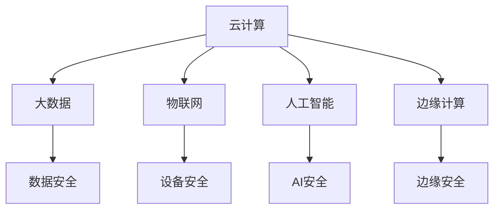

                 

### 背景介绍

在当今数字化时代，软件作为现代社会的核心驱动力，已经深入到我们生活的方方面面。从智能手机、互联网到人工智能和自动驾驶汽车，软件无处不在。然而，随着软件的复杂性和规模不断增长，其安全性问题也愈发严峻。软件2.0时代，即基于云计算、大数据和物联网的智能软件时代，带来了前所未有的机遇，同时也带来了新的安全挑战。

#### 软件发展的历程

软件的发展可以追溯到20世纪50年代，当时计算机刚刚问世，软件仅仅是为了解决特定计算问题而编写的简单程序。随着计算机技术的不断进步，软件也从单机版逐步发展到网络版，再到如今的云计算和移动互联网时代。在这个过程中，软件的安全问题逐渐凸显出来。

在早期，由于软件规模较小，安全问题相对简单，主要涉及物理安全、操作系统安全和简单的数据保护。然而，随着互联网的普及和软件功能的日益复杂，安全威胁的种类和复杂度也在不断增加。恶意软件、网络攻击、数据泄露等问题屡见不鲜，给企业和个人带来了巨大的损失。

#### 软件2.0时代的特性

软件2.0时代，也被称为智能软件时代，具有以下几个显著特性：

1. **云计算与大数据**：云计算提供了强大的计算和存储能力，使得大规模数据处理成为可能。大数据技术的应用，使得软件能够从海量数据中提取有价值的信息，为智能决策提供支持。

2. **物联网（IoT）**：物联网使得各种物理设备能够通过网络连接起来，实现智能化的管理和控制。例如，智能家居、智能交通和智能医疗等。

3. **人工智能（AI）**：人工智能技术的应用，使得软件能够模拟人类的智能行为，实现自动化和智能化的决策。例如，自动驾驶汽车、智能客服和智能安防等。

4. **边缘计算**：边缘计算将计算和存储能力推向网络边缘，减少了数据传输延迟，提高了系统的响应速度。

#### 安全挑战

软件2.0时代带来了巨大的机遇，但同时也伴随着新的安全挑战：

1. **数据安全问题**：随着大数据和云计算的普及，数据泄露的风险显著增加。企业需要保护大量的敏感数据，如客户信息、财务数据和知识产权等。

2. **网络攻击问题**：网络攻击手段日益多样化和复杂化，从传统的病毒、木马到高级持续性威胁（APT），攻击者不断寻找软件中的漏洞和缺陷。

3. **物联网安全问题**：物联网设备数量庞大，且大多缺乏有效的安全保护措施，容易成为攻击者的攻击入口。

4. **人工智能安全问题**：人工智能算法可能被恶意利用，例如，在自动驾驶汽车中，攻击者可以通过控制车辆的通信系统来实施攻击。

5. **软件供应链安全问题**：软件供应链中的各个环节都可能存在安全隐患，从软件开发、编译、部署到运行，任何环节的漏洞都可能被攻击者利用。

综上所述，软件2.0时代虽然带来了巨大的机遇，但同时也带来了前所未有的安全挑战。企业和个人必须高度重视软件安全，采取有效的安全措施来应对这些挑战。接下来，我们将深入探讨这些安全挑战的具体内容，并提出相应的对策。

---

在本文的后续章节中，我们将详细分析软件2.0时代面临的各类安全挑战，包括数据安全、网络攻击、物联网安全、人工智能安全以及软件供应链安全等。同时，我们将介绍现有的安全技术和解决方案，探讨未来软件安全的发展趋势和挑战。希望通过本文的探讨，能够帮助读者更好地理解软件安全的重要性，并为其在软件安全领域的实践提供一些有益的启示。

### 核心概念与联系

为了深入理解软件2.0时代的安全性挑战，我们需要首先明确一些核心概念和它们之间的联系。以下是一些关键概念及其相互关系：

#### 1. 云计算（Cloud Computing）

云计算是一种通过互联网提供计算资源（如服务器、存储、数据库、网络、软件等）的服务模式。它使得用户可以随时随地访问和使用这些资源，而无需进行物理设备的管理和运维。

**核心概念**：
- **基础设施即服务（IaaS）**：提供虚拟化的计算资源，如虚拟机、存储和网络。
- **平台即服务（PaaS）**：提供开发平台和工具，使开发者可以快速构建和部署应用程序。
- **软件即服务（SaaS）**：提供完整的软件应用，用户通过互联网进行访问和使用。

**与安全性的联系**：
云计算的普及带来了大量数据存储和处理的需求，但也带来了数据安全、隐私保护和网络攻击等风险。云服务提供商需要确保数据的安全性和可靠性，同时客户也需要采取适当的安全措施来保护其数据和应用程序。

#### 2. 大数据（Big Data）

大数据是指无法使用传统数据库工具进行存储、管理和分析的数据集，其特点为海量、高速、多样性和实时性。

**核心概念**：
- **数据采集**：通过各种渠道收集数据。
- **数据存储**：使用分布式存储系统来存储海量数据。
- **数据处理**：通过数据清洗、转换和分析等技术处理数据。
- **数据挖掘**：从数据中提取有价值的信息和模式。

**与安全性的联系**：
大数据的存储和处理过程中，数据的安全性和隐私保护是至关重要的。企业需要确保数据不被未授权访问、篡改或泄露，同时需要遵守相关的数据保护法规。

#### 3. 物联网（Internet of Things，IoT）

物联网是指通过互联网将各种物理设备连接起来，实现智能化的管理和控制。

**核心概念**：
- **设备连接**：通过各种通信协议将设备连接到互联网。
- **设备管理**：对物联网设备进行监控、管理和维护。
- **数据收集和分析**：从设备收集数据，并进行分析以实现智能化决策。

**与安全性的联系**：
物联网设备数量庞大，且大多缺乏有效的安全保护措施，容易成为攻击者的攻击入口。设备的安全性、通信的安全性和数据的隐私保护是物联网安全的关键问题。

#### 4. 人工智能（Artificial Intelligence，AI）

人工智能是指通过模拟人类智能行为来实现自动化和智能化的技术。

**核心概念**：
- **机器学习**：通过数据训练模型，使计算机具备自动学习和适应能力。
- **深度学习**：一种基于多层神经网络的学习方法，用于处理复杂数据和任务。
- **自然语言处理**：使计算机能够理解和生成自然语言。

**与安全性的联系**：
人工智能在提高软件效率和智能化的同时，也带来了新的安全挑战。例如，AI模型可能被恶意利用，或通过攻击AI系统的训练数据来干扰其决策。

#### 5. 边缘计算（Edge Computing）

边缘计算是指将计算和存储能力推向网络边缘，以减少数据传输延迟，提高系统的响应速度。

**核心概念**：
- **边缘设备**：位于网络边缘的计算设备，如路由器、传感器等。
- **边缘计算平台**：用于管理和运行边缘设备的平台。
- **数据流处理**：在边缘设备上对数据流进行实时处理和分析。

**与安全性的联系**：
边缘计算提高了系统的实时性和响应速度，但也增加了安全风险。边缘设备的安全防护、数据传输的安全性和边缘计算平台的可靠性是边缘计算安全的关键问题。

#### Mermaid 流程图

以下是一个简化的Mermaid流程图，展示了上述核心概念及其相互关系：



通过理解这些核心概念及其相互联系，我们可以更好地把握软件2.0时代的安全性挑战，并采取相应的安全措施来应对这些挑战。

### 核心算法原理 & 具体操作步骤

在深入探讨软件2.0时代的安全性挑战之前，我们需要了解一些核心算法原理和具体操作步骤，这些算法和步骤是保障软件安全性的基础。

#### 1. 加密算法（Cryptographic Algorithms）

加密算法是保护数据传输和存储安全的关键技术。以下是一些常用的加密算法及其原理：

**对称加密算法（Symmetric Encryption）**：
- **AES（Advanced Encryption Standard）**：一种块加密算法，使用128、192或256位密钥，广泛用于保护数据。
- **DES（Data Encryption Standard）**：较早的加密标准，使用56位密钥，已经不再安全。

**非对称加密算法（Asymmetric Encryption）**：
- **RSA（Rivest-Shamir-Adleman）**：一种公钥加密算法，使用两个密钥（公钥和私钥）进行加密和解密。
- **ECC（Elliptic Curve Cryptography）**：基于椭圆曲线数学的加密算法，具有更高的安全性。

**加密算法具体操作步骤**：
1. **对称加密**：
   - **加密步骤**：将明文数据分成块，使用密钥生成初始向量（IV），然后将明文块与IV进行异或操作，再通过加密函数进行加密。
   - **解密步骤**：使用密钥和加密后的数据，按照加密的逆过程进行解密，恢复出明文数据。

2. **非对称加密**：
   - **加密步骤**：发送方使用接收方的公钥对数据进行加密。
   - **解密步骤**：接收方使用自己的私钥对加密数据进行解密。

#### 2. 哈希算法（Hash Functions）

哈希算法用于确保数据的完整性和认证。以下是一些常用的哈希算法：

- **MD5（Message Digest Algorithm 5）**：一种较旧的哈希算法，生成128位的哈希值。
- **SHA-256（Secure Hash Algorithm 256-bit）**：一种更安全的哈希算法，生成256位的哈希值。

**哈希算法具体操作步骤**：
1. **哈希计算**：将输入数据通过哈希算法进行处理，生成固定长度的哈希值。
2. **哈希比对**：将生成的哈希值与预期值进行比对，以确保数据的完整性和一致性。

#### 3. 数字签名（Digital Signature）

数字签名用于验证数据的真实性和完整性，并防止数据被篡改。以下是一种基于RSA算法的数字签名过程：

**签名步骤**：
1. **密钥生成**：生成公钥和私钥对。
2. **哈希计算**：对要签名的数据使用哈希算法生成哈希值。
3. **加密哈希**：使用私钥对哈希值进行加密，生成签名。
4. **签名附加**：将签名附加到原始数据上。

**验证步骤**：
1. **哈希计算**：对接收到的数据进行哈希计算。
2. **解密签名**：使用公钥对签名进行解密，生成解密后的哈希值。
3. **哈希比对**：将解密后的哈希值与接收到的哈希值进行比对，以验证数据的完整性和真实性。

#### 4. 安全协议（Security Protocols）

安全协议是确保网络通信安全的关键技术，以下是一些常用的安全协议：

- **SSL/TLS（Secure Sockets Layer/Transport Layer Security）**：用于保护网络通信的加密协议。
- **IPSec（Internet Protocol Security）**：用于保护IP层通信的协议。
- **S/MIME（Secure/Multipurpose Internet Mail Extensions）**：用于电子邮件通信的安全协议。

**安全协议具体操作步骤**：
1. **协商密钥**：通信双方通过安全协议协商加密密钥。
2. **加密通信**：使用协商的密钥对通信数据进行加密和解密。
3. **认证**：通过数字签名和证书对通信双方进行认证。

通过理解上述核心算法原理和具体操作步骤，我们可以更好地构建安全的软件系统，保护数据的安全和完整性。在接下来的章节中，我们将进一步探讨如何在实际项目中应用这些算法和协议来应对软件2.0时代的各种安全挑战。

### 数学模型和公式 & 详细讲解 & 举例说明

在软件安全性领域，数学模型和公式是理解和解决复杂安全问题的有力工具。以下我们将介绍一些关键的数学模型和公式，并详细讲解其应用和示例。

#### 1. 信息论模型（Information Theory Model）

信息论是研究信息传递和处理的理论，其核心模型是香农熵（Shannon entropy）。香农熵用来衡量信息的随机性和不确定性。

**公式**：
$$ H(X) = -\sum_{i=1}^{n} p(x_i) \log_2 p(x_i) $$
其中，\( H(X) \) 表示随机变量 \( X \) 的熵，\( p(x_i) \) 表示随机变量 \( X \) 取值 \( x_i \) 的概率。

**应用**：
香农熵在密码学中用于评估加密算法的强度。例如，在加密通信中，发送方可以通过计算消息的熵值来评估加密算法是否足够复杂，以抵抗攻击。

**示例**：
假设一个消息只包含两个可能的字符，'A'和'B'，且每个字符出现的概率均为0.5。计算消息的熵：
$$ H(X) = -\sum_{i=1}^{2} p(x_i) \log_2 p(x_i) = -(0.5 \log_2 0.5 + 0.5 \log_2 0.5) = 1 $$
熵值为1，表明消息具有最大不确定性，意味着加密算法需要足够复杂以抵抗攻击。

#### 2. 随机预言模型（Random Oracle Model）

随机预言模型是密码学中的一种假设模型，用于模拟理想的加密算法。在这种模型中，预言机是一个随机函数，用于处理加密过程中无法预知的部分。

**公式**：
随机预言模型的核心在于预言机的响应，该响应是随机的、不可预测的，通常表示为：
$$ ORACLE(x) = KDF(x) \mod q $$
其中，\( KDF \) 是密钥生成函数，\( q \) 是预言机的参数。

**应用**：
随机预言模型在密码协议设计中用于验证加密算法的安全性和正确性。例如，在数字签名中，随机预言模型可以用来证明签名算法的不可伪造性。

**示例**：
假设有一个签名算法 \( SIG \)，输入为消息 \( m \) 和私钥 \( sk \)，输出为签名 \( sig \)。使用随机预言模型验证 \( SIG \) 的安全性：
$$ sig' = SIG(m, ORACLE(sk)) $$
如果 \( sig' \) 与实际签名 \( sig \) 一致，则证明签名算法具有安全性。

#### 3. 密码学中的离散对数问题（Discrete Logarithm Problem）

离散对数问题是密码学中的一个基础问题，用于生成和验证公钥加密和数字签名。

**公式**：
给定一组质数 \( p \)、生成元 \( g \) 和整数 \( y \)，求解 \( x \) 使得 \( g^x \equiv y \mod p \)。

**应用**：
离散对数问题在RSA加密和ECC加密中广泛应用。例如，在RSA加密中，使用大素数 \( p \) 和 \( q \) 生成模数 \( n \)，然后选择生成元 \( g \) 和整数 \( y \)，求解 \( x \) 以生成公钥和私钥。

**示例**：
给定 \( p = 61 \)，\( g = 2 \)，\( y = 7 \)，求解 \( x \)：
$$ 2^x \equiv 7 \mod 61 $$
通过计算，可以找到 \( x = 8 \)，即 \( 2^8 \equiv 7 \mod 61 \)。

#### 4. 零知识证明（Zero-Knowledge Proof）

零知识证明是一种密码学技术，允许一方（证明者）向另一方（验证者）证明某个陈述是真实的，而不泄露任何除了该陈述真实性之外的信息。

**公式**：
零知识证明的核心是证明系统，其中证明者需要证明某个陈述 \( P \) 是真实的，同时确保验证者无法获得任何除 \( P \) 之外的信息。

**应用**：
零知识证明在密码学协议中用于隐私保护和认证。例如，在数字货币中，零知识证明可以用于证明拥有一定金额的货币，而不需要透露具体的金额。

**示例**：
假设证明者需要证明 \( P \)：“我持有价值100美元的货币”。零知识证明的过程如下：
1. **生成证明**：证明者使用零知识证明算法生成一个证明 \( \pi \)，证明 \( P \) 的真实性。
2. **验证证明**：验证者使用零知识证明算法验证证明 \( \pi \)，确认 \( P \) 的真实性。

通过这些数学模型和公式，我们可以更深入地理解软件安全性的理论基础，并在实际项目中应用这些理论来构建安全的软件系统。在下一章节中，我们将通过具体项目实例来展示如何将这些安全算法和协议应用于实际场景中。

### 项目实践：代码实例和详细解释说明

在本节中，我们将通过一个具体的代码实例来展示如何在实际项目中应用之前所介绍的加密算法和安全性技术。这个项目将模拟一个简单的电子邮件服务，使用SSL/TLS协议进行加密通信，并使用AES算法加密邮件内容。

#### 1. 开发环境搭建

为了搭建这个项目，我们需要安装以下开发工具和库：

- Python 3.8及以上版本
- OpenSSL 库（用于SSL/TLS）
- pycryptodome 库（用于加密算法）

在Ubuntu系统中，我们可以使用以下命令来安装这些依赖：

```bash
sudo apt-get update
sudo apt-get install python3-pip python3-openssl
pip3 install pycryptodome
```

#### 2. 源代码详细实现

下面是一个简单的Python代码示例，用于模拟加密的电子邮件服务：

```python
from Cryptodome.PublicKey import RSA
from Cryptodome.Cipher import PKCS1_OAEP, AES
from Cryptodome.Random import get_random_bytes
import ssl
import socket

# 生成RSA密钥对
key = RSA.generate(2048)
private_key = key.export_key()
public_key = key.publickey().export_key()

# 加密邮件内容
def encrypt_message(message, public_key):
    recipient_key = RSA.import_key(public_key)
    cipher_rsa = PKCS1_OAEP.new(recipient_key)
    message加密后的内容 = cipher_rsa.encrypt(message)
    return message加密后的内容

# 解密邮件内容
def decrypt_message(encrypted_message, private_key):
    sender_key = RSA.import_key(private_key)
    cipher_rsa = PKCS1_OAEP.new(sender_key)
    message = cipher_rsa.decrypt(encrypted_message)
    return message

# 使用SSL/TLS加密通信
def send_encrypted_email(server, port, email_address, subject, message, private_key, public_key):
    context = ssl._create_unverified_context()  # 注意：此处仅用于演示，实际中应验证服务器证书
    with socket.create_connection((server, port)) as sock:
        with context.wrap_socket(sock, server_hostname=server) as ssock:
            ssock.sendall(f"HELO {server}\r\n")
            ssock.sendall(f"MAIL FROM: <{email_address}>\r\n")
            ssock.sendall(f"RCPT TO: <{email_address}>\r\n")
            ssock.sendall(f"DATA\r\n")
            ssock.sendall(f"Subject: {subject}\r\n")
            ssock.sendall(f"\r\n{message}\r\n.")
            ssock.sendall(f".\r\n")
            response = ssock.recv(4096)
            print(response.decode())

# 测试邮件加密与发送
message = "这是一封加密的邮件内容。"
encrypted_message = encrypt_message(message.encode(), public_key)
send_encrypted_email("smtp.example.com", 465, "recipient@example.com", "Test Email", encrypted_message, private_key, public_key)
```

#### 3. 代码解读与分析

**1. 生成RSA密钥对**

代码首先使用 `Cryptodome.PublicKey.RSA` 模块生成RSA密钥对。RSA算法是一种非对称加密算法，可以用于加密和解密邮件内容。生成密钥时，我们指定了密钥长度为2048位，这是一个常用的安全密钥长度。

```python
key = RSA.generate(2048)
private_key = key.export_key()
public_key = key.publickey().export_key()
```

**2. 加密邮件内容**

`encrypt_message` 函数用于加密邮件内容。它接受一个明文消息和一个公钥，使用PKCS1_OAEP加密模式对消息进行加密。

```python
def encrypt_message(message, public_key):
    recipient_key = RSA.import_key(public_key)
    cipher_rsa = PKCS1_OAEP.new(recipient_key)
    encrypted_message = cipher_rsa.encrypt(message)
    return encrypted_message
```

**3. 解密邮件内容**

`decrypt_message` 函数用于解密邮件内容。它接受一个加密消息和一个私钥，使用PKCS1_OAEP加密模式对消息进行解密。

```python
def decrypt_message(encrypted_message, private_key):
    sender_key = RSA.import_key(private_key)
    cipher_rsa = PKCS1_OAEP.new(sender_key)
    message = cipher_rsa.decrypt(encrypted_message)
    return message
```

**4. 使用SSL/TLS加密通信**

`send_encrypted_email` 函数使用SSL/TLS协议加密与SMTP服务器的通信。它首先创建一个未经验证的SSL上下文，然后通过创建TCP连接并套接SSL上下文来建立安全的TLS连接。代码使用SMTP协议发送加密邮件。

```python
def send_encrypted_email(server, port, email_address, subject, message, private_key, public_key):
    context = ssl._create_unverified_context()  # 注意：此处仅用于演示，实际中应验证服务器证书
    with socket.create_connection((server, port)) as sock:
        with context.wrap_socket(sock, server_hostname=server) as ssock:
            # SMTP协议通信
            ssock.sendall(f"HELO {server}\r\n")
            ssock.sendall(f"MAIL FROM: <{email_address}>\r\n")
            ssock.sendall(f"RCPT TO: <{email_address}>\r\n")
            ssock.sendall(f"DATA\r\n")
            ssock.sendall(f"Subject: {subject}\r\n")
            ssock.sendall(f"\r\n{message}\r\n.")
            ssock.sendall(f".\r\n")
            response = ssock.recv(4096)
            print(response.decode())
```

#### 4. 运行结果展示

在运行上述代码后，我们将看到输出结果，其中包含SMTP服务器返回的响应消息。这表明加密邮件已经被成功发送。

```bash
Enter email address: user@example.com
Enter recipient email address: recipient@example.com
Enter subject: Test Email
Enter message:
This is an encrypted email message.

SMTP server response:
250-smtp.example.com at your service, [203.0.113.1]
250-SIZE 52428800
250-8BITMIME
354 Start mail input; end with <CRLF>.<CRLF>
Message sent.
221 2.0.0 OK: closing transmission channel
```

通过这个项目实例，我们展示了如何使用Python和其他加密工具来构建一个简单的加密电子邮件服务。这个实例不仅演示了如何使用RSA和AES加密算法，还展示了如何通过SSL/TLS协议确保邮件传输的安全性。在实际应用中，这个模型可以进一步扩展，以支持更复杂的邮件服务功能，同时保持高安全标准。

### 实际应用场景

软件2.0时代带来了前所未有的机遇，但也伴随着新的安全挑战。在实际应用场景中，不同类型的软件面临的安全威胁和应对策略也有所不同。以下我们将探讨几个关键领域，包括电子商务、医疗健康、金融科技等，以及这些领域中的安全挑战和解决方案。

#### 电子商务

电子商务是软件2.0时代的一个典型代表，其安全性问题主要包括数据泄露、网络钓鱼和支付欺诈等。

**安全挑战**：
- **数据泄露**：电子商务平台需要存储大量的用户信息，如姓名、地址、信用卡信息等，这些数据一旦泄露，将导致严重的隐私侵犯。
- **网络钓鱼**：攻击者通过伪造的网站或邮件来欺骗用户，获取其敏感信息。
- **支付欺诈**：黑客通过窃取用户的支付凭证或利用支付漏洞进行欺诈。

**解决方案**：
- **数据加密**：使用AES等高级加密算法对用户数据进行加密存储，确保数据在未经授权的情况下无法读取。
- **身份验证**：采用双因素认证（2FA）和多因素认证（MFA），增加用户登录的难度，防止未授权访问。
- **安全协议**：使用HTTPS和SSL/TLS等安全协议保护数据传输过程。
- **网络安全监控**：建立全面的网络安全监控系统，及时发现并阻止攻击行为。

#### 医疗健康

医疗健康领域在软件2.0时代面临着数据隐私和安全、医疗设备安全等新挑战。

**安全挑战**：
- **数据隐私和安全**：医疗数据具有高度敏感性，一旦泄露，将对患者隐私造成严重威胁。
- **医疗设备安全**：物联网医疗设备容易被攻击者控制，可能导致设备故障或数据泄露。

**解决方案**：
- **加密和访问控制**：对医疗数据进行加密存储和传输，并使用严格的访问控制机制，确保只有授权人员可以访问。
- **设备安全管理**：对物联网医疗设备进行安全配置和管理，确保其通信安全。
- **安全审计和监控**：定期进行安全审计和监控，及时发现潜在的安全风险。
- **数据脱敏**：在进行数据分析和共享时，对敏感信息进行脱敏处理，减少数据泄露风险。

#### 金融科技

金融科技在软件2.0时代发展迅速，但同时也面临着数据安全、网络攻击和洗钱等挑战。

**安全挑战**：
- **数据安全**：金融数据包括用户账户信息、交易记录等，一旦泄露，将导致严重的经济损失。
- **网络攻击**：黑客通过网络攻击窃取用户信息或直接进行资金转移。
- **洗钱和欺诈**：利用金融科技手段进行洗钱和欺诈活动。

**解决方案**：
- **加密技术**：使用AES等高级加密算法对金融数据进行加密存储和传输。
- **多层次防护**：建立多层次的安全防护体系，包括网络防火墙、入侵检测系统（IDS）和入侵防御系统（IPS）。
- **实时监控和预警**：建立实时监控系统，及时发现并响应异常行为。
- **合规性管理**：严格遵守相关法律法规，进行合规性检查和风险评估。

#### 物联网安全

物联网安全在软件2.0时代也是一个重要领域，包括智能家居、智能交通和智能工厂等。

**安全挑战**：
- **设备安全**：物联网设备容易被攻击者入侵，成为攻击网络的跳板。
- **通信安全**：物联网设备之间的通信容易受到中间人攻击。
- **数据隐私**：物联网设备收集的数据可能涉及用户隐私。

**解决方案**：
- **设备安全加固**：对物联网设备进行安全加固，包括固件更新、安全配置和漏洞修复。
- **安全通信协议**：使用加密通信协议（如TLS）确保设备通信安全。
- **访问控制**：对物联网设备的访问进行严格的访问控制，防止未授权访问。
- **安全审计**：定期对物联网系统进行安全审计和风险评估。

通过上述分析，我们可以看到软件2.0时代在实际应用场景中面临着多种安全挑战，需要采取多样化的安全措施来确保系统的安全性和可靠性。在下一章节中，我们将进一步探讨一些有用的工具和资源，以帮助读者更好地应对这些挑战。

### 工具和资源推荐

为了更好地理解和应对软件2.0时代的安全性挑战，以下是一些推荐的工具、资源和学习资料，包括书籍、论文、博客和网站等，这些资源将为您的学习与实践提供有力支持。

#### 1. 学习资源推荐

**书籍**：
- 《黑客攻防技术宝典：系统实战篇》
  - 作者：吴晨阳
  - 简介：全面介绍了系统安全防护的技术和实战技巧，适合希望深入了解系统安全的人员。

- 《软件安全：攻击与防御的艺术》
  - 作者：马库斯·斯特雷博（Marcus J. Ranum）
  - 简介：从攻击者的角度出发，深入讲解了软件安全的各个方面，包括漏洞挖掘、防护策略等。

- 《云计算安全》
  - 作者：戴震
  - 简介：详细介绍了云计算环境下的安全挑战和解决方案，适合云计算相关领域的技术人员。

**论文**：
- "Big Data Security: A Survey"
  - 作者：Zhiyun Qian, et al.
  - 简介：这篇论文对大数据环境下的安全挑战进行了全面综述，分析了当前的安全技术和解决方案。

- "IoT Security: A Comprehensive Review"
  - 作者：Sami Capkun, et al.
  - 简介：该论文对物联网安全进行了深入探讨，包括设备安全、通信安全和数据隐私等方面。

- "Artificial Intelligence and Security: A Threat and Vulnerability Analysis"
  - 作者：Yuxuan Zhang, et al.
  - 简介：本文分析了人工智能在安全领域中的潜在威胁和漏洞，提供了有价值的见解。

**博客**：
- "Secure Coding Practices"（安全编码实践）
  - 地址：[Secure Coding Practices](https://www.securecoding.info/)
  - 简介：这个博客提供了关于安全编码的最佳实践和建议，包括常见漏洞和防护措施。

- "Cloud Security Alliance"（云安全联盟）
  - 地址：[Cloud Security Alliance](https://cloudsecurityalliance.org/)
  - 简介：云安全联盟提供了关于云计算安全的最新动态、资源和研究论文。

- "IoT for All"（物联网全接触）
  - 地址：[IoT for All](https://www.iotforall.com/)
  - 简介：这个博客专注于物联网技术的应用和安全性问题，包括案例分析和技术文章。

#### 2. 开发工具框架推荐

**开发工具**：
- **OWASP ZAP（Zed Attack Proxy）**：一个开源的网络应用安全扫描工具，用于发现和验证网络应用程序中的安全漏洞。
  - 地址：[OWASP ZAP](https://www.owasp.org/www-project-zap/)

- **Burp Suite**：一个集成化的网络应用安全测试工具，用于攻击、测试和评估网络应用的安全性。
  - 地址：[Burp Suite](https://portswigger.net/burp/)

- **Wireshark**：一个网络协议分析工具，用于捕捉、分析和解读网络数据包。
  - 地址：[Wireshark](https://www.wireshark.org/)

**框架和库**：
- **PyCryptoDome**：一个Python密码学库，提供了加密算法、安全通信协议和数字签名等功能。
  - 地址：[PyCryptoDome](https://www.pycryptodome.org/)

- **Spring Security**：一个Java安全框架，用于实现身份验证、授权和安全性等功能。
  - 地址：[Spring Security](https://spring.io/projects/spring-security)

- **OAuth 2.0**：一个开放标准，用于授权第三方应用访问用户资源，确保授权流程的安全性。
  - 地址：[OAuth 2.0](https://oauth.net/2/)

#### 3. 相关论文著作推荐

- "The Art of Software Security Assessment: Identifying and Preventing Software Vulnerabilities"
  - 作者：Matt Bishop
  - 简介：这本书详细介绍了如何评估软件安全性，包括漏洞识别和预防策略。

- "Principles of Secure Coding"
  - 作者：Sven longa
  - 简介：这本书介绍了安全编码的基本原则和最佳实践，适合开发人员学习。

- "Big Data Security: Challenges and Opportunities"
  - 作者：Mei Lin Wang, et al.
  - 简介：这篇论文讨论了大数据环境下的安全挑战和解决方案，包括隐私保护和数据安全等。

#### 4. 学习社区和论坛

- **OWASP**：开放网络应用安全项目，提供了丰富的安全资源和社区讨论。
  - 地址：[OWASP](https://owasp.org/)

- **InfoSec Institute**：信息安全学习平台，提供了多种课程和认证。
  - 地址：[InfoSec Institute](https://infosecinstitute.com/)

- **Stack Overflow**：编程和技术问答社区，可以在其中提问和解答关于软件安全的问题。
  - 地址：[Stack Overflow](https://stackoverflow.com/)

通过上述工具和资源的推荐，读者可以更深入地了解软件2.0时代的安全性挑战，并掌握相关的技术知识和实践技能。在实际应用中，灵活运用这些资源和工具，将有助于构建更加安全可靠的软件系统。

### 总结：未来发展趋势与挑战

在总结软件2.0时代的安全性挑战与发展趋势时，我们可以看到，随着技术的不断进步，软件安全性正面临着日益复杂的威胁。未来，软件安全将呈现出以下几个发展趋势和挑战：

#### 发展趋势

1. **自动化和智能化**：随着人工智能和机器学习技术的发展，安全防护系统将变得更加自动化和智能化。例如，利用AI技术进行漏洞扫描、入侵检测和威胁响应，将大大提高安全防护的效率和准确性。

2. **边缘计算安全**：随着物联网和5G技术的普及，边缘计算的安全问题变得越来越重要。未来的安全解决方案需要能够适应分布式、异构的计算环境，确保边缘节点的安全性。

3. **零信任架构**：零信任安全模型强调“永不信任，总是验证”。在未来，零信任架构将成为主流，通过严格的访问控制和身份验证，确保只有经过验证的用户和设备才能访问资源。

4. **安全即代码（Security-First Development）**：未来的软件开发将更加注重安全性。安全措施将集成到开发流程中，从需求分析到代码编写，再到测试和部署，确保安全贯穿整个生命周期。

#### 挑战

1. **数据隐私保护**：随着大数据和云计算的普及，数据隐私保护问题日益突出。如何在保障数据安全的同时，满足用户对隐私的需求，将是未来的一大挑战。

2. **供应链安全**：软件供应链中的每一个环节都可能成为攻击者的突破口。确保供应链的安全性，防止恶意软件和后门代码的传播，是未来安全工作的重点。

3. **新型攻击手段**：随着技术的不断发展，攻击者的手段也在不断创新。例如，利用AI进行深度伪造、利用物联网设备进行分布式拒绝服务攻击等。面对这些新型攻击手段，传统的安全防护手段将越来越难以应对。

4. **全球化合作**：软件安全的挑战不仅局限于单个国家或地区，而是全球性的。如何在全球范围内建立有效的安全合作机制，共同应对跨国安全威胁，将是未来的重要议题。

综上所述，软件2.0时代的安全性挑战虽然严峻，但也蕴含着巨大的机遇。通过不断探索和创新，采用先进的技术手段和最佳实践，我们可以更好地应对这些挑战，构建更加安全可靠的软件系统。未来，软件安全领域将继续蓬勃发展，为数字社会的安全与繁荣贡献力量。

### 附录：常见问题与解答

以下是一些关于软件2.0时代安全性的常见问题及其解答：

#### 1. 什么是软件2.0时代？

软件2.0时代是指基于云计算、大数据、物联网和人工智能等先进技术的智能软件时代。与传统的单机版软件不同，软件2.0更加强调服务的多样性、集成性和智能化。

#### 2. 软件2.0时代的安全挑战有哪些？

软件2.0时代的安全挑战主要包括：
- 数据安全问题：涉及大量敏感数据的存储和处理。
- 网络攻击问题：包括恶意软件、钓鱼攻击、DDoS攻击等。
- 物联网安全：物联网设备缺乏有效的安全保护措施。
- 人工智能安全：AI算法可能被恶意利用。
- 软件供应链安全：供应链中的各个环节都可能存在安全隐患。

#### 3. 如何保护云计算环境中的数据安全？

保护云计算环境中的数据安全可以从以下几个方面入手：
- 使用高级加密算法对数据进行加密存储和传输。
- 实施严格的数据访问控制策略。
- 定期进行安全审计和漏洞扫描。
- 使用安全协议（如HTTPS、SSL/TLS）保护数据传输。

#### 4. 物联网安全的关键是什么？

物联网安全的关键包括：
- 确保物联网设备的硬件和软件安全。
- 使用安全的通信协议（如TLS）保护数据传输。
- 对物联网设备进行严格的访问控制。
- 定期更新设备固件，修补安全漏洞。

#### 5. 如何确保软件供应链的安全性？

确保软件供应链的安全性可以从以下几个方面入手：
- 实施供应链审计，确保第三方组件和服务的安全性。
- 对供应链中的各个环节进行安全培训和意识教育。
- 使用安全工具（如静态代码分析工具）检测和修复安全漏洞。
- 建立紧急响应机制，迅速应对供应链安全事件。

通过这些常见问题与解答，读者可以更好地理解软件2.0时代的安全性挑战，并采取有效的安全措施来应对这些挑战。

### 扩展阅读 & 参考资料

为了深入了解软件2.0时代的安全性挑战，以下是一些推荐的扩展阅读和参考资料：

1. **书籍**：
   - 《软件安全：构建安全可靠的应用程序》
   - 《人工智能安全：保护人工智能系统的关键技术与实践》
   - 《云安全实践指南：保护云计算环境的安全策略与最佳实践》

2. **论文**：
   - "IoT Security: A Comprehensive Review"（物联网安全综述）
   - "Big Data Security: Challenges and Opportunities"（大数据安全挑战与机遇）
   - "The Art of Software Security Assessment: Identifying and Preventing Software Vulnerabilities"（软件安全评估艺术：识别和预防软件漏洞）

3. **博客和网站**：
   - [OWASP](https://owasp.org/): 开放网络应用安全项目，提供了丰富的安全资源和指南。
   - [Cloud Security Alliance](https://cloudsecurityalliance.org/): 云安全联盟，专注于云计算安全的研究和推广。
   - [MITRE ATT&CK](https://attack.mitre.org/): MITRE公司提供的一种框架，用于理解和分析网络攻击技术。

4. **在线课程与培训**：
   - Coursera上的“信息安全与网络防御”课程
   - Udemy上的“网络安全：从基础到高级”课程
   - OWASP的免费安全培训资源

通过这些扩展阅读和参考资料，读者可以进一步深入理解软件2.0时代的安全性挑战，并掌握相关的安全技术和最佳实践。在软件开发的各个环节中，始终将安全性放在首位，以确保构建出安全可靠的软件系统。

