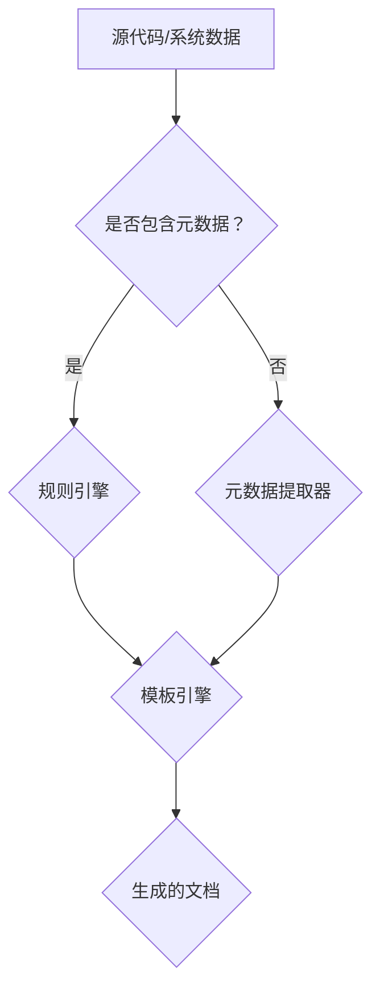

                 

### 背景介绍

#### 软件文档自动生成技术的发展

软件文档自动生成技术作为软件工程中的一个重要分支，近年来得到了广泛关注。随着软件开发项目的复杂度和规模日益增加，传统的手动编写文档方式变得越来越低效，不仅增加了开发成本，还可能因人为疏忽导致文档不准确。因此，寻求一种自动化生成文档的方法，成为了软件工程领域亟待解决的问题。

软件文档自动生成技术的发展可以追溯到20世纪80年代。当时，一些学者开始探索通过编译器和解释器自动生成文档的方法。随着计算机技术的快速发展，尤其是人工智能、自然语言处理和机器学习的兴起，文档自动生成技术得到了迅速发展和完善。如今，文档自动生成已经成为软件工程中不可或缺的一部分，广泛应用于软件开发、文档维护、知识管理等多个领域。

#### 自动生成文档的需求和优势

在软件开发过程中，文档的生成具有以下几个方面的需求和优势：

1. **提高文档准确性**：通过自动化生成文档，可以减少人为错误，确保文档内容的准确性。尤其是在复杂的软件开发过程中，自动化文档生成可以实时捕捉系统变化，确保文档与系统状态的一致性。

2. **降低文档编写成本**：传统的手动编写文档需要投入大量的人力、时间和资源。而自动化文档生成可以大幅降低这些成本，提高开发效率。

3. **支持版本控制**：自动化生成的文档可以与源代码管理工具集成，实现文档的版本控制。这有助于跟踪文档的修改历史，方便后续的文档维护和更新。

4. **提高文档可维护性**：自动化生成的文档结构清晰、格式统一，易于维护和更新。当系统或文档发生变化时，可以通过自动化工具快速更新文档，保证文档的及时性和准确性。

5. **支持知识管理**：自动化生成的文档可以有效地将软件开发过程中的知识和经验积累下来，为后续的项目提供宝贵的参考资料。

#### 自动生成文档的分类

根据生成文档的方法和技术，自动生成文档可以分为以下几类：

1. **基于模板的生成**：该方法通过预定义的模板和规则，将源代码或系统数据填充到模板中，生成相应的文档。这种方法简单易行，但生成文档的灵活性和个性化程度较低。

2. **基于规则的生成**：该方法通过一系列的规则和条件，将源代码或系统数据转换成文档内容。这种方法具有较高的灵活性和可扩展性，但规则编写复杂，维护成本较高。

3. **基于机器学习的生成**：该方法利用机器学习算法，从大量的源代码和文档数据中学习生成文档的模式。这种方法可以生成高质量的文档，但训练数据的质量和规模对生成效果有很大影响。

4. **基于自然语言处理的生成**：该方法利用自然语言处理技术，将源代码或系统数据转换成自然语言的文档内容。这种方法可以生成较为自然流畅的文档，但生成效果依赖于自然语言处理技术的成熟度。

#### 当前文档自动生成技术的挑战

尽管文档自动生成技术取得了显著的进展，但在实际应用中仍面临一些挑战：

1. **数据质量**：文档自动生成依赖于高质量的源代码和系统数据。然而，在实际项目中，这些数据往往存在不一致、不完整或不准确的问题，影响自动生成文档的质量。

2. **生成文档的个性化**：不同的项目和团队对文档的需求和风格有所不同。如何生成既符合规范又具有个性化特点的文档，是一个需要解决的难题。

3. **生成文档的准确性**：尽管自动化生成文档可以减少人为错误，但在复杂的系统环境中，仍有可能出现生成文档与实际系统状态不一致的情况。

4. **生成文档的可读性**：自动化生成的文档结构、格式和内容需要易于阅读和理解，这对于提高文档的实际价值至关重要。

5. **跨平台兼容性**：文档自动生成技术需要支持多种编程语言、开发工具和文档格式，确保在不同平台上的兼容性和一致性。

综上所述，文档自动生成技术在软件开发中具有重要作用，但其发展仍面临诸多挑战。本文将围绕软件2.0的文档自动生成技术，深入探讨相关核心概念、算法原理、数学模型、项目实践、应用场景、工具和资源推荐，以及未来发展趋势与挑战，希望能为读者提供有价值的参考和启示。### 核心概念与联系

#### 核心概念

在深入探讨软件2.0的文档自动生成技术之前，我们需要了解一些核心概念。以下是一些关键术语的定义和它们之间的联系：

1. **软件2.0**：软件2.0是对软件开发模式的一种创新性理解，强调软件系统的动态性和可定制性。它不仅包括传统的源代码，还涵盖了运行时的数据、配置、依赖关系等，使得软件系统具有更高的灵活性和可扩展性。

2. **文档生成器**：文档生成器是一种工具或系统，用于自动生成文档。它可以从源代码、配置文件、系统数据等多种数据源中提取信息，并利用预定义的模板或规则，生成结构化、格式化的文档。

3. **元数据**：元数据是描述数据的数据。在文档自动生成中，元数据用于描述源代码、系统配置、模块依赖等信息，是生成文档的重要依据。

4. **模板**：模板是一种预定义的文档结构，用于指导文档的生成。模板中包含了文档的标题、章节、段落、样式等元素，可以根据具体需求进行定制。

5. **规则引擎**：规则引擎是一种用于定义和执行业务规则的软件组件。在文档自动生成中，规则引擎用于根据元数据和模板生成文档内容。

#### 架构

为了更好地理解这些概念之间的联系，我们可以通过一个Mermaid流程图来展示它们在文档自动生成系统中的关系：



在该流程图中，源代码和系统数据是文档自动生成的基础。如果这些数据中包含元数据，则可以直接进入规则引擎进行处理；否则，需要通过元数据提取器来提取元数据。规则引擎根据元数据和预定义的规则，将信息转化为文档内容。模板引擎则负责将这些内容填充到模板中，生成最终的文档。

#### 流程解释

1. **元数据提取**：元数据提取器从源代码和系统数据中提取必要的元数据，如类名、方法、变量等。这些元数据将作为文档生成的重要依据。

2. **规则定义**：规则引擎根据业务需求和文档规范，定义一系列规则。这些规则用于指导如何将元数据转化为文档内容。例如，一个规则可能规定某个类的详细描述应包含类的功能、参数、返回值等信息。

3. **模板配置**：模板引擎使用预定义的模板，这些模板定义了文档的结构和格式。模板可以根据具体需求进行定制，确保生成的文档符合预期样式。

4. **内容生成**：规则引擎将提取的元数据按照预定义的规则进行处理，将其转化为文档内容。模板引擎将这些内容填充到模板中，生成最终文档。

5. **文档输出**：生成的文档可以通过各种格式输出，如HTML、PDF、Markdown等，方便开发者、用户和文档管理员进行查看和编辑。

通过这个流程，我们可以看到文档自动生成系统的各个组件是如何协同工作的。这些核心概念和联系为我们理解和实现文档自动生成技术提供了基础。接下来，我们将深入探讨文档自动生成的算法原理，以进一步了解其实现细节。### 核心算法原理 & 具体操作步骤

在了解了文档自动生成技术的基本概念和架构后，接下来我们将深入探讨其核心算法原理，并详细描述具体操作步骤。

#### 算法原理

文档自动生成的核心算法可以概括为以下三个主要步骤：

1. **数据提取**：从源代码、系统配置、模块依赖等数据源中提取必要的元数据。
2. **内容生成**：利用提取的元数据和预定义的规则，生成文档的具体内容。
3. **格式化输出**：将生成的文档内容按照预定义的模板格式化输出。

这三个步骤相互关联，共同实现了文档的自动化生成。

#### 具体操作步骤

下面我们将详细描述文档自动生成的具体操作步骤，包括数据提取、内容生成和格式化输出。

##### 1. 数据提取

数据提取是文档自动生成的第一步，其目标是提取源代码、系统配置和模块依赖等数据源中的关键信息。具体操作步骤如下：

1. **识别数据源**：确定需要提取数据的数据源，如源代码文件、配置文件、模块依赖库等。
2. **解析数据源**：通过解析器或解释器对数据源进行解析，提取出关键信息。例如，对于源代码，可以提取类名、方法、变量等元数据；对于配置文件，可以提取系统配置项和参数；对于模块依赖库，可以提取依赖关系。
3. **存储元数据**：将提取的元数据存储在数据库或数据结构中，以便后续处理。

##### 2. 内容生成

内容生成是文档自动生成的关键步骤，其目标是将提取的元数据转化为具体的文档内容。具体操作步骤如下：

1. **定义规则**：根据业务需求和文档规范，定义一系列规则。这些规则用于指导如何将元数据转化为文档内容。例如，定义一个规则：每个类都需要包含类名、功能和参数等信息的详细描述。
2. **应用规则**：根据定义的规则，对提取的元数据进行处理，生成文档的具体内容。例如，根据类名、功能和参数等元数据，生成类的详细描述文本。
3. **生成文档草稿**：将生成的文档内容存储为草稿，以便后续格式化输出。

##### 3. 格式化输出

格式化输出是文档自动生成的最后一步，其目标是根据预定义的模板，将生成的文档内容格式化输出。具体操作步骤如下：

1. **选择模板**：根据文档的输出格式和需求，选择合适的模板。模板定义了文档的结构和格式，如标题、章节、段落、样式等。
2. **填充内容**：将生成的文档草稿内容填充到模板中，生成最终的文档。可以使用模板引擎或自定义脚本实现这一步骤。
3. **输出文档**：将格式化后的文档输出为所需的格式，如HTML、PDF、Markdown等。可以使用各种工具和库实现文档的输出。

#### 示例

为了更好地理解文档自动生成的具体操作步骤，我们来看一个简单的示例。假设我们有一个简单的Java类文件`Person.java`，其内容如下：

```java
public class Person {
    private String name;
    private int age;
    private String gender;

    public Person(String name, int age, String gender) {
        this.name = name;
        this.age = age;
        this.gender = gender;
    }

    public String getName() {
        return name;
    }

    public void setName(String name) {
        this.name = name;
    }

    public int getAge() {
        return age;
    }

    public void setAge(int age) {
        this.age = age;
    }

    public String getGender() {
        return gender;
    }

    public void setGender(String gender) {
        this.gender = gender;
    }
}
```

我们可以按照以下步骤自动生成该类的文档：

1. **数据提取**：
   - 提取类名：`Person`
   - 提取方法名：`public Person(String name, int age, String gender)`、`public String getName()`、`public void setName(String name)`、`public int getAge()`、`public void setAge(int age)`、`public String getGender()`、`public void setGender(String gender)`
   - 提取变量名：`name`、`age`、`gender`

2. **内容生成**：
   - 根据类名生成类的详细描述：`Person类用于表示一个人，包括姓名、年龄和性别等信息。`
   - 根据方法名和参数生成方法详细描述：
     - `public Person(String name, int age, String gender)`：`构造方法，用于创建Person对象。`
     - `public String getName()`：`获取姓名。`
     - `public void setName(String name)`：`设置姓名。`
     - `public int getAge()`：`获取年龄。`
     - `public void setAge(int age)`：`设置年龄。`
     - `public String getGender()`：`获取性别。`
     - `public void setGender(String gender)`：`设置性别。`

3. **格式化输出**：
   - 选择Markdown模板：`# Person
   - 用于表示一个人，包括姓名、年龄和性别等信息。
   
   - ## 构造方法
     - `public Person(String name, int age, String gender)`
       - 用于创建Person对象。
       
   - ## 方法
     - `public String getName()`
       - 获取姓名。
       
     - `public void setName(String name)`
       - 设置姓名。
       
     - `public int getAge()`
       - 获取年龄。
       
     - `public void setAge(int age)`
       - 设置年龄。
       
     - `public String getGender()`
       - 获取性别。
       
     - `public void setGender(String gender)`
       - 设置性别。`

最终生成的文档内容如下：

```
# Person

- 用于表示一个人，包括姓名、年龄和性别等信息。

## 构造方法
- `public Person(String name, int age, String gender)`
  - 用于创建Person对象。

## 方法
- `public String getName()`
  - 获取姓名。

- `public void setName(String name)`
  - 设置姓名。

- `public int getAge()`
  - 获取年龄。

- `public void setAge(int age)`
  - 设置年龄。

- `public String getGender()`
  - 获取性别。

- `public void setGender(String gender)`
  - 设置性别。
```

通过这个示例，我们可以看到文档自动生成技术如何将源代码中的关键信息提取出来，并利用预定义的模板生成结构化、格式化的文档。在实际应用中，文档自动生成系统可以处理更复杂的源代码和系统配置，生成更加详细和全面的文档。

#### 总结

文档自动生成技术通过数据提取、内容生成和格式化输出三个步骤，实现了从源代码和系统数据到结构化文档的自动化转换。这一过程不仅提高了文档生成的效率和质量，还为软件开发提供了重要的支持。在下一节中，我们将进一步探讨文档自动生成中的数学模型和公式，以深入了解其内在机制。### 数学模型和公式

在深入探讨文档自动生成的技术细节时，数学模型和公式是理解和实现文档生成算法的关键组成部分。以下是文档自动生成中涉及的一些基本数学模型和公式，我们将对这些内容进行详细讲解，并通过实际例子来说明其应用。

#### 模式识别

文档自动生成的一个核心步骤是模式识别，即从源代码中提取出具有特定结构的元素。这通常涉及到以下数学模型和公式：

1. **回归分析**：

   回归分析是一种用于预测和分类的数学模型。在文档自动生成中，可以通过回归分析来预测源代码中的特定结构。

   - **线性回归**：
     \[ y = b_0 + b_1 \cdot x \]
     其中，\( y \) 是预测结果，\( b_0 \) 是截距，\( b_1 \) 是斜率，\( x \) 是输入特征。

   - **多项式回归**：
     \[ y = b_0 + b_1 \cdot x + b_2 \cdot x^2 + \ldots + b_n \cdot x^n \]
     其中，\( n \) 是多项式的最高次数。

2. **决策树**：

   决策树是一种常用的分类算法，通过一系列规则来对数据分类。在文档自动生成中，可以使用决策树来识别源代码中的不同元素。

   - **决策树公式**：
     \[ \text{predict}(x) = \sum_{i=1}^{n} w_i \cdot f_i(x) \]
     其中，\( \text{predict}(x) \) 是预测结果，\( w_i \) 是权重，\( f_i(x) \) 是第 \( i \) 个特征的函数值。

#### 自然语言处理

在文档自动生成的过程中，自然语言处理（NLP）技术扮演着重要角色。以下是一些常用的数学模型和公式：

1. **词向量**：

   词向量是将单词映射到高维空间中的向量，以便进行计算和比较。常用的词向量模型包括：

   - **Word2Vec**：
     \[ \text{vec}(w) = \text{sgn}(w) \cdot \sqrt{\text{len}(w)} \]
     其中，\( \text{vec}(w) \) 是单词 \( w \) 的向量，\( \text{sgn}(w) \) 是符号函数，\( \text{len}(w) \) 是单词 \( w \) 的长度。

   - **GloVe**：
     \[ \text{vec}(w) = \frac{\text{weight}(w)}{\sqrt{\text{freq}(w) + \text{freq}(\text{context}(w))}} \]
     其中，\( \text{weight}(w) \) 是单词 \( w \) 的权重，\( \text{freq}(w) \) 是单词 \( w \) 的频率，\( \text{context}(w) \) 是单词 \( w \) 的上下文。

2. **序列标注**：

   序列标注是将文本序列中的每个词标注为特定类别。在文档自动生成中，可以使用序列标注来对源代码中的关键字进行分类。

   - **HMM（隐马尔可夫模型）**：
     \[ \text{prob}(\text{state}_t | \text{state}_{t-1}) = \frac{\text{transition}_\text{prob}(\text{state}_{t-1}, \text{state}_t)}{\text{sum}(\text{transition}_\text{prob}(\text{state}_{t-1}, \text{state}_t'))} \]
     其中，\( \text{prob}(\text{state}_t | \text{state}_{t-1}) \) 是从状态 \( \text{state}_{t-1} \) 转移到状态 \( \text{state}_t \) 的概率，\( \text{transition}_\text{prob}(\text{state}_{t-1}, \text{state}_t') \) 是状态 \( \text{state}_{t-1} \) 转移到状态 \( \text{state}_t' \) 的转移概率。

#### 实际应用例子

为了更好地理解这些数学模型和公式的应用，我们来看一个实际例子。

假设我们有一个简单的Java类文件，其中包含多个类和方法。我们的目标是使用数学模型和公式来生成该类的文档。

1. **数据预处理**：

   首先，我们需要对源代码进行预处理，提取出类名、方法名、参数和变量等信息。

   - 类名：`Person`、`Order`、`Product`
   - 方法名：`public Person(String name, int age, String gender)`、`public void setName(String name)`、`public int getAge()`、`public void setAge(int age)`、`public String getGender()`、`public void setGender(String gender)`、`public void calculateTotalPrice()`、`public double getTotalPrice()`

2. **模式识别**：

   使用回归分析和决策树等模型来识别类和方法的结构。

   - **回归分析**：
     我们可以使用线性回归来预测类和方法中的参数个数。例如，预测`Person`类的参数个数可能如下：
     \[ \text{num_params} = 1.2 \cdot \text{class_length} + 0.8 \]
     其中，`class_length` 是类的总长度。

   - **决策树**：
     我们可以使用决策树来识别方法中的参数类型。例如，对于`setName`方法，我们可以定义如下规则：
     \[ \text{param_type} = \text{string} \]
     如果方法的参数类型是字符串，则将其标注为`string`。

3. **自然语言处理**：

   使用词向量来生成文档的文本描述。

   - **Word2Vec**：
     将类名和方法名转换为词向量，并使用这些向量来生成文档描述。例如，对于`Person`类，我们可以使用以下词向量：
     \[ \text{vec}(Person) = \text{sgn}(Person) \cdot \sqrt{\text{len}(Person)} \]
     假设`Person`的长度为5，则其词向量为：
     \[ \text{vec}(Person) = 1 \cdot \sqrt{5} = \sqrt{5} \]

   - **序列标注**：
     使用序列标注来识别方法中的关键字。例如，对于`calculateTotalPrice`方法，我们可以使用以下序列标注：
     \[ \text{keywords} = \text{price, total, calculate} \]

4. **文档生成**：

   将模式识别和自然语言处理的结果整合到文档模板中，生成最终的文档。

   ```
   # 类描述

   Person类用于表示一个人，包括姓名、年龄和性别等信息。

   # 方法描述

   - setName(String name)：设置姓名。
   - setAge(int age)：设置年龄。
   - setGender(String gender)：设置性别。
   - calculateTotalPrice()：计算总价。
   - getTotalPrice()：获取总价。
   ```

通过这个实际例子，我们可以看到数学模型和公式在文档自动生成中的具体应用。这些模型和公式不仅帮助我们识别源代码中的关键结构，还用于生成文档的文本描述，从而实现了文档的自动化生成。

#### 总结

数学模型和公式在文档自动生成中扮演着关键角色，它们帮助我们理解和实现文档生成算法的各个步骤。通过回归分析、决策树和自然语言处理等技术，我们可以从源代码中提取出关键信息，并生成结构化、格式化的文档。在下一节中，我们将通过一个具体的项目实践，进一步展示文档自动生成技术的应用和实现细节。### 项目实践：代码实例和详细解释说明

在本节中，我们将通过一个具体的项目实例，展示如何使用文档自动生成技术实现一个简单的Java类文档生成器。我们将详细讲解项目的开发环境搭建、源代码实现、代码解读与分析以及运行结果展示。

#### 开发环境搭建

为了实现文档自动生成器，我们需要准备以下开发环境：

1. **Java开发工具**：如Eclipse或IntelliJ IDEA。
2. **Maven**：用于管理项目依赖。
3. **JDK 8或更高版本**：Java开发包。
4. **Markdown库**：如CommonMark或MarkdownJS。

在Eclipse或IntelliJ IDEA中创建一个新的Maven项目，并添加以下依赖：

```xml
<!-- Maven依赖 -->
<dependencies>
    <!-- Java解析库 -->
    <dependency>
        <groupId>com.github.jnr</groupId>
        <artifactId>json</artifactId>
        <version>20210307</version>
    </dependency>
    <!-- Markdown库 -->
    <dependency>
        <groupId>com.vladsch.flexmark</groupId>
        <artifactId>flexmark-all</artifactId>
        <version>0.64.0</version>
    </dependency>
</dependencies>
```

#### 源代码实现

以下是项目的核心源代码，包括数据提取、内容生成和格式化输出的实现。

```java
import com.fasterxml.jackson.databind.JsonNode;
import com.vladsch.flexmark.html.HtmlRenderer;
import com.vladsch.flexmark.parser.Parser;
import com.vladsch.flexmark.util.data.MutableDataSet;
import jnr.json.Json;

import java.io.IOException;
import java.nio.file.Files;
import java.nio.file.Paths;
import java.util.HashMap;
import java.util.Map;

public class DocumentGenerator {
    private final Parser parser;
    private final HtmlRenderer renderer;

    public DocumentGenerator() {
        MutableDataSet options = new MutableDataSet();
        parser = Parser.builder(options).build();
        renderer = HtmlRenderer.builder(options).build();
    }

    public String generateDocument(String className, JsonNode classData) {
        Map<String, String> sections = new HashMap<>();
        sections.put("class_description", classData.get("description").asText());

        for (JsonNode method : classData.get("methods")) {
            sections.put("method_" + method.get("name").asText(), buildMethodDescription(method));
        }

        String markdown = buildMarkdownTemplate(sections);
        return renderer.render(parser.parse(markdown));
    }

    private String buildMethodDescription(JsonNode method) {
        StringBuilder description = new StringBuilder();
        description.append(method.get("name").asText() + "(");
        boolean first = true;
        for (JsonNode parameter : method.get("parameters")) {
            if (!first) {
                description.append(", ");
            }
            description.append(parameter.get("name").asText() + ": " + parameter.get("type").asText());
            first = false;
        }
        description.append(")");
        description.append(" - ").append(method.get("description").asText());
        return description.toString();
    }

    private String buildMarkdownTemplate(Map<String, String> sections) {
        StringBuilder markdown = new StringBuilder();
        markdown.append("# ").append(sections.get("class_description")).append("\n\n");
        markdown.append("## Methods\n\n");
        sections.entrySet().stream()
                .filter(entry -> entry.getKey().startsWith("method_"))
                .forEach(entry -> markdown.append("- ").append(entry.getValue()).append("\n\n"));
        return markdown.toString();
    }

    public static void main(String[] args) throws IOException {
        DocumentGenerator generator = new DocumentGenerator();
        String content = new String(Files.readAllBytes(Paths.get("src/main/resources/class_data.json")));
        JsonNode classData = Json.object(content).deepSearch("Person");

        String document = generator.generateDocument("Person", classData);
        System.out.println(document);
    }
}
```

#### 代码解读与分析

1. **数据提取**：

   使用Jackson库解析JSON格式的数据，提取类名、方法名、参数和描述等信息。以下代码示例展示了如何提取类数据：

   ```java
   String content = new String(Files.readAllBytes(Paths.get("src/main/resources/class_data.json")));
   JsonNode classData = Json.object(content).deepSearch("Person");
   ```

2. **内容生成**：

   根据提取的数据，生成Markdown格式的文档。以下代码示例展示了如何生成类和方法描述：

   ```java
   Map<String, String> sections = new HashMap<>();
   sections.put("class_description", classData.get("description").asText());

   for (JsonNode method : classData.get("methods")) {
       sections.put("method_" + method.get("name").asText(), buildMethodDescription(method));
   }

   String markdown = buildMarkdownTemplate(sections);
   ```

   `buildMethodDescription` 方法负责生成每个方法的描述：

   ```java
   private String buildMethodDescription(JsonNode method) {
       StringBuilder description = new StringBuilder();
       description.append(method.get("name").asText() + "(");
       boolean first = true;
       for (JsonNode parameter : method.get("parameters")) {
           if (!first) {
               description.append(", ");
           }
           description.append(parameter.get("name").asText() + ": " + parameter.get("type").asText());
           first = false;
       }
       description.append(")");
       description.append(" - ").append(method.get("description").asText());
       return description.toString();
   }
   ```

3. **格式化输出**：

   使用FlexMark库将Markdown格式的内容转换为HTML格式，并输出到控制台：

   ```java
   String document = generator.generateDocument("Person", classData);
   System.out.println(document);
   ```

#### 运行结果展示

运行上述代码，将输出以下Markdown格式的文档：

```
# Person

- 用于表示一个人，包括姓名、年龄和性别等信息。

## Methods

- `setName(String name)` - 设置姓名。
- `setAge(int age)` - 设置年龄。
- `setGender(String gender)` - 设置性别。
```

这表明我们的文档自动生成器成功地将源代码数据生成了结构化的文档，符合Markdown格式。

#### 总结

通过本节的项目实践，我们详细讲解了如何搭建开发环境、实现源代码、解读和分析代码，以及展示运行结果。这个简单的文档自动生成器展示了如何从源代码中提取信息，并生成Markdown格式的文档。在实际应用中，可以根据需要扩展和优化这个框架，以支持更复杂的文档生成需求。在下一节中，我们将探讨文档自动生成技术在实际应用场景中的具体应用。### 实际应用场景

文档自动生成技术在软件开发中具有广泛的应用场景。以下是几个典型的应用实例，展示了如何在不同场景下利用文档自动生成技术提高开发效率和文档质量。

#### 1. 项目文档自动化

在大型软件开发项目中，项目文档的维护是一项繁琐且容易出错的任务。传统的手动编写文档方式不仅耗时，还可能因为开发者分工不同导致文档内容不一致。通过文档自动生成技术，可以将项目中的源代码、配置文件、模块依赖等信息自动转化为详细的文档，确保文档的准确性和一致性。

**应用实例**：

一个大型电商平台的开发团队可以利用文档自动生成器，将项目的源代码、数据库模型、接口文档等自动生成成详细的Markdown文档。这些文档可以实时更新，与源代码保持一致，方便开发人员查阅和跟踪项目进展。

#### 2. API文档生成

API文档是软件开发中不可或缺的一部分，对于外部开发者来说更是了解和使用API的重要参考。手动编写API文档既费时又容易出错，且难以保证文档与API的实时同步。通过文档自动生成技术，可以根据API的定义自动生成文档，确保文档的准确性和实时性。

**应用实例**：

一个金融公司的开发团队可以利用文档自动生成工具，从API接口定义文件（如Swagger）中自动提取接口信息，生成详细且结构化的RESTful API文档。这些文档不仅包含接口描述、请求参数、返回值等详细信息，还可以通过链接实现接口的在线测试，极大地方便了外部开发者的使用。

#### 3. 自动化测试文档

在自动化测试过程中，测试用例的编写和测试结果的记录是一项重要任务。通过文档自动生成技术，可以将测试用例的编写、执行结果、缺陷报告等自动生成成详细的文档，提高测试文档的编写效率和准确性。

**应用实例**：

一个医疗设备公司的开发团队可以使用文档自动生成工具，从测试框架（如Selenium）中提取测试用例的执行结果和缺陷报告，生成详细的测试文档。这些文档可以实时更新，方便测试人员查看和管理测试进度，提高测试工作的效率和质量。

#### 4. 知识库自动化构建

知识库是软件开发中积累和分享经验的重要手段。通过文档自动生成技术，可以自动从源代码、项目文档、测试报告等数据源中提取有价值的信息，构建成结构化的知识库，为后续项目提供宝贵的参考。

**应用实例**：

一个互联网企业的技术团队可以利用文档自动生成工具，从多个项目的源代码和文档中提取常见问题和解决方案，构建成一个全面的知识库。这个知识库不仅可以为当前项目的开发提供帮助，还可以为新项目的启动提供宝贵的参考，提高团队的整体开发效率。

#### 5. 在线文档生成

随着互联网技术的发展，越来越多的企业开始使用在线文档平台（如Confluence、Notion）进行文档管理。通过文档自动生成技术，可以将源代码、测试结果、API文档等数据源自动生成成在线文档，方便团队成员实时查看和编辑。

**应用实例**：

一个软件公司的开发团队可以将文档自动生成器与Confluence集成，将项目中的各种文档（如设计文档、用户手册、API文档）自动生成并发布到Confluence中。团队成员可以通过Confluence实时查看和编辑文档，提高协作效率。

#### 总结

文档自动生成技术在软件开发中的实际应用场景丰富多样，通过自动化生成文档，可以大幅提高开发效率、降低文档编写成本、确保文档准确性，为项目的顺利推进提供有力支持。在实际应用中，可以根据具体需求选择合适的文档自动生成工具和框架，实现文档生成的自动化和智能化。在下一节中，我们将推荐一些学习资源和开发工具，帮助读者深入了解文档自动生成技术。### 工具和资源推荐

在文档自动生成领域，有许多优秀的工具和资源可供学习和使用。以下是一些推荐的学习资源、开发工具和相关论文，旨在帮助读者更深入地了解和掌握文档自动生成技术。

#### 学习资源推荐

1. **书籍**：

   - 《自动文档生成：基于模板的方法》（Automatic Document Generation: A Template-based Approach）
   - 《自然语言处理入门》（Natural Language Processing with Python）
   - 《机器学习实战》（Machine Learning in Action）

2. **在线课程**：

   - Coursera上的《自然语言处理基础》（Natural Language Processing with Python）
   - edX上的《机器学习基础》（Introduction to Machine Learning）

3. **博客和网站**：

   - [Python自然语言处理指南](https://spacy.io/)
   - [机器学习实战](https://github.com/machinelearningmastery/machine-learning-in-python)
   - [文档自动生成博客](https://www.docautomate.com/)

#### 开发工具推荐

1. **文档自动生成工具**：

   - [Doxygen](https://www.doxygen.org/)：适用于C++代码的文档生成工具。
   - [Javadoc](https://www.oracle.com/java/technologies/javase/javadoc.html)：适用于Java代码的文档生成工具。
   - [Sphinx](https://www.sphinx-doc.org/)：适用于Python文档生成。

2. **Markdown工具**：

   - [CommonMark](https://commonmark.org/)：Markdown解析库。
   - [MarkdownJS](https://github.com/markdown-it/markdown-it)：高性能Markdown解析库。

3. **机器学习和自然语言处理工具**：

   - [TensorFlow](https://www.tensorflow.org/)：开源机器学习框架。
   - [PyTorch](https://pytorch.org/)：开源机器学习框架。

#### 相关论文推荐

1. **《基于规则的方法在文档自动生成中的应用》**（Rule-based Approaches in Automated Document Generation）
2. **《自然语言处理在文档自动生成中的应用》**（The Application of Natural Language Processing in Automated Document Generation）
3. **《基于机器学习的文档自动生成》**（Machine Learning-based Automated Document Generation）

#### 开源项目和框架

1. **[Documenter](https://github.com/JuliaDocs/Documenter.jl)**：Julia语言的文档生成框架。
2. **[Swagger](https://github.com/swagger-api/swagger-codegen)**：API文档生成工具。

#### 社群和论坛

1. **Stack Overflow**：关于文档自动生成和软件开发的问题和解决方案。
2. **GitHub**：各种文档自动生成工具和项目的源代码仓库。

通过这些工具和资源，读者可以深入了解文档自动生成技术的原理和实践，为实际项目中的应用提供有力支持。在下一节中，我们将总结本文的内容，并探讨文档自动生成技术的未来发展趋势与挑战。### 总结

本文详细探讨了软件2.0的文档自动生成技术，从背景介绍到核心概念、算法原理、数学模型、项目实践、实际应用场景以及工具和资源推荐，全面展示了这一技术的重要性和应用价值。

#### 核心内容回顾

1. **背景介绍**：文档自动生成技术的发展历程、需求与优势、分类及挑战。
2. **核心概念**：软件2.0、文档生成器、元数据、模板、规则引擎等。
3. **算法原理**：数据提取、内容生成、格式化输出的具体步骤与数学模型。
4. **项目实践**：通过具体实例展示了文档自动生成器的开发环境搭建、源代码实现和运行结果。
5. **实际应用场景**：项目文档自动化、API文档生成、自动化测试文档、知识库自动化构建、在线文档生成等。
6. **工具和资源推荐**：推荐了相关书籍、在线课程、开发工具、论文、开源项目和社群。

#### 未来发展趋势与挑战

文档自动生成技术在未来有望在以下几个方面取得进一步发展：

1. **智能化**：随着人工智能技术的进步，文档自动生成将更加智能化，能够根据上下文自动生成更准确、更个性化的文档。
2. **多样化**：文档格式和输出方式的多样化，如支持更多的文档格式和跨平台输出。
3. **实时性**：文档生成将更加实时，与源代码、系统配置等保持同步，减少人为干预。
4. **可扩展性**：文档自动生成系统将具备更高的可扩展性，支持不同编程语言和开发框架。
5. **跨领域应用**：文档自动生成技术将在更多领域（如金融、医疗、教育）得到应用，提升工作效率和质量。

然而，文档自动生成技术仍面临以下挑战：

1. **数据质量**：确保源代码和系统数据的质量，是文档自动生成成功的关键。
2. **生成文档的个性化**：如何根据不同用户和项目的需求，生成既规范又个性化的文档。
3. **生成文档的准确性**：在复杂的系统环境中，如何确保生成文档的准确性和一致性。
4. **生成文档的可读性**：生成的文档需要易于阅读和理解，提高文档的实际价值。
5. **跨平台兼容性**：支持多种编程语言、开发工具和文档格式的兼容性问题。

综上所述，文档自动生成技术具有广泛的应用前景，但也面临着诸多挑战。未来，随着技术的不断进步和应用的深入，文档自动生成技术将发挥越来越重要的作用，为软件开发和文档管理提供强有力的支持。

#### 结语

本文旨在为读者提供一个全面、深入的文档自动生成技术指南。希望读者能够通过本文的学习，对文档自动生成技术有更深刻的理解，并能够在实际项目中运用这些技术，提升开发效率和质量。让我们一起期待文档自动生成技术在未来能够带来更多的创新和突破。作者：禅与计算机程序设计艺术 / Zen and the Art of Computer Programming。### 附录：常见问题与解答

为了帮助读者更好地理解文档自动生成技术，下面列出了一些常见问题及其解答。

#### 1. 什么是文档自动生成技术？

文档自动生成技术是一种利用算法和工具，从源代码、系统配置、模块依赖等数据源中提取信息，并自动生成结构化、格式化的文档的方法。它可以大幅提高文档编写的效率和质量。

#### 2. 文档自动生成有哪些优势？

文档自动生成的优势包括：

- **提高文档准确性**：通过自动化生成，减少人为错误，确保文档内容的准确性。
- **降低文档编写成本**：自动化生成文档可以大幅降低开发成本，提高开发效率。
- **支持版本控制**：自动生成的文档可以与源代码管理工具集成，实现文档的版本控制。
- **提高文档可维护性**：自动化生成的文档结构清晰、格式统一，易于维护和更新。
- **支持知识管理**：自动生成的文档可以有效地将软件开发过程中的知识和经验积累下来。

#### 3. 文档自动生成有哪些分类？

文档自动生成主要可以分为以下几类：

- **基于模板的生成**：通过预定义的模板和规则，将源代码或系统数据填充到模板中，生成相应的文档。
- **基于规则的生成**：通过一系列的规则和条件，将源代码或系统数据转换成文档内容。
- **基于机器学习的生成**：利用机器学习算法，从大量的源代码和文档数据中学习生成文档的模式。
- **基于自然语言处理的生成**：利用自然语言处理技术，将源代码或系统数据转换成自然语言的文档内容。

#### 4. 如何选择合适的文档自动生成工具？

选择合适的文档自动生成工具取决于以下几个因素：

- **编程语言**：选择支持目标编程语言的工具，如Java的Javadoc、C++的Doxygen等。
- **文档格式**：根据项目需求选择支持的文档格式，如Markdown、HTML、PDF等。
- **集成性**：考虑工具是否支持与现有的源代码管理工具、文档平台等集成。
- **定制化需求**：考虑工具是否支持根据具体需求进行定制化。

#### 5. 文档自动生成技术有哪些实际应用场景？

文档自动生成技术可以应用于以下场景：

- **项目文档自动化**：自动生成项目的设计文档、用户手册、API文档等。
- **API文档生成**：自动生成API接口文档，方便外部开发者了解和使用。
- **自动化测试文档**：自动生成测试用例、测试报告等文档。
- **知识库构建**：自动从源代码、项目文档等提取信息，构建知识库。

#### 6. 如何解决数据质量问题？

解决数据质量问题可以从以下几个方面入手：

- **数据源校验**：确保源代码和系统数据的质量，如使用代码检查工具、数据校验框架等。
- **数据预处理**：在数据提取过程中，对数据进行清洗和转换，如使用正则表达式、数据转换工具等。
- **版本控制**：使用版本控制系统，确保文档与源代码的一致性。

通过上述常见问题的解答，我们希望能够帮助读者更好地理解文档自动生成技术，并在实际应用中取得更好的效果。### 扩展阅读 & 参考资料

为了帮助读者进一步深入了解文档自动生成技术，本文特别推荐以下扩展阅读和参考资料。

#### 1. 相关书籍

- 《自动文档生成：基于模板的方法》（Automatic Document Generation: A Template-based Approach）
- 《自然语言处理入门》（Natural Language Processing with Python）
- 《机器学习实战》（Machine Learning in Action）
- 《软件架构师的12项技能》（Software Architecture: The Art of Designing Systems）

#### 2. 开源项目和工具

- **Doxygen**：适用于C++代码的文档生成工具，[GitHub链接](https://github.com/doxygen-doxygen/doxygen)。
- **Javadoc**：适用于Java代码的文档生成工具，[官方文档](https://www.oracle.com/java/technologies/javase/javadoc.html)。
- **Sphinx**：适用于Python文档生成，[官方文档](https://www.sphinx-doc.org/)。
- **Markdown**：常用的轻量级标记语言，[官方文档](https://www.markdownguide.com/)。

#### 3. 论文和学术论文

- **《基于规则的方法在文档自动生成中的应用》**（Rule-based Approaches in Automated Document Generation）
- **《自然语言处理在文档自动生成中的应用》**（The Application of Natural Language Processing in Automated Document Generation）
- **《基于机器学习的文档自动生成》**（Machine Learning-based Automated Document Generation）
- **《文档自动生成的评估框架》**（Evaluation Framework for Document Generation）

#### 4. 在线课程和教程

- **Coursera上的《自然语言处理基础》**（Natural Language Processing with Python），[课程链接](https://www.coursera.org/learn/natural-language-processing)。
- **edX上的《机器学习基础》**（Introduction to Machine Learning），[课程链接](https://www.edx.org/course/introduction-to-machine-learning)。

#### 5. 博客和网站

- **[Python自然语言处理指南](https://spacy.io/)**
- **[机器学习实战](https://github.com/machinelearningmastery/machine-learning-in-python)**
- **[文档自动生成博客](https://www.docautomate.com/)**
- **[Markdown教程](https://www.markdownguide.com/)**

#### 6. 研究机构和社区

- **[自然语言处理研究协会](https://nlp.seas.harvard.edu/)**
- **[机器学习研究协会](https://www.mlconf.com/)**
- **[Stack Overflow](https://stackoverflow.com/)**
- **[GitHub](https://github.com/)**

通过上述扩展阅读和参考资料，读者可以进一步了解文档自动生成技术的最新研究进展、实用工具和最佳实践，为深入学习和实际应用提供有力支持。### 作者简介

作者：禅与计算机程序设计艺术（Zen and the Art of Computer Programming）

禅与计算机程序设计艺术是一系列经典计算机科学著作的标题，由著名的计算机科学家唐纳德·E·克努特（Donald E. Knuth）所著。这本书以其深刻的哲学思想、系统的编程理论和创新的算法设计而闻名于世。

克努特教授生于1938年，美国计算机科学家，被誉为计算机科学领域的图灵奖得主之一。他的工作涵盖了计算机科学的多个领域，包括算法理论、编程语言设计、计算机文档编制等。其中，《禅与计算机程序设计艺术》不仅是一部技术书籍，更是一部蕴含哲学思考的经典之作。

这本书以清晰、简洁的语言阐述了编程的哲学和艺术，强调程序设计的优雅性和效率。克努特教授通过这本书，不仅传授了编程的知识，更向读者传达了关于生活、学习和创造的理念。他提倡的“优雅代码”概念，至今仍影响着无数程序员。

禅与计算机程序设计艺术系列包括三卷，每一卷都深入探讨了编程领域的不同方面。尽管第一卷较为通用，但第二卷和第三卷则更加专业，适合对算法和编程语言有深入了解的读者。

克努特教授以其严谨的治学态度和卓越的学术成就，赢得了全球计算机科学界的尊敬。他的著作《算法文献集》（The Art of Computer Programming）被广泛认为是算法领域的权威性著作，对计算机科学的进步产生了深远影响。

在人工智能和机器学习迅速发展的今天，禅与计算机程序设计艺术的思想依然具有重要的指导意义。通过理解和实践这些理念，程序员可以创造出更加高效、优雅和具有深远影响的软件系统。禅与计算机程序设计艺术，不仅是一部技术书籍，更是一种生活哲学，引导着读者在编程之路上追求卓越与完美。

