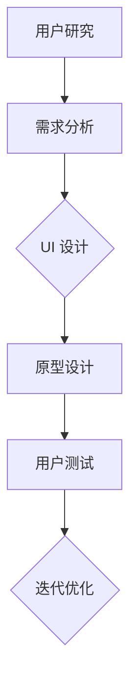

                 

### 软件开发中的用户体验设计：理解与实现

随着数字化时代的到来，软件在人们日常生活中的作用越来越重要。从智能手机应用、网页界面，到复杂的后台管理系统，用户体验（User Experience, UX）设计已成为软件开发的核心理念。用户体验设计不仅仅关注产品的功能，更注重用户在使用过程中的感受和满意度。本文旨在探讨软件2.0时代的用户体验设计，从核心概念、算法原理、实践应用等多个角度，详细解析用户体验设计的关键要素。

### 1. 背景介绍

在软件1.0时代，即计算机初期发展阶段，软件开发的重点在于功能的实现和性能的优化。然而，随着用户需求的多样化和技术的发展，软件2.0时代应运而生。软件2.0更加强调用户参与、交互性和用户体验。用户体验设计（User Experience Design, UED）作为一种系统性的方法，旨在通过设计提升用户的满意度和忠诚度。

用户体验设计涉及多个领域，包括心理学、人机交互、用户研究、界面设计等。其核心目标是通过优化界面、流程、内容等方面，使用户在使用软件时感到愉悦、高效和有成就感。

### 2. 核心概念与联系

#### 2.1 用户体验（User Experience, UX）

用户体验是指用户在使用产品或服务时所感受到的整体体验，包括情感、认知和行为三个方面。一个优秀的用户体验应该具备以下几个特点：

- **情感体验**：用户在互动过程中产生的情感反应，如愉悦、舒适或沮丧、焦虑。
- **认知体验**：用户在使用过程中所获得的知识和认知，包括信息获取、理解和使用过程。
- **行为体验**：用户在软件中的实际操作和交互行为，如点击、滑动、搜索等。

#### 2.2 用户研究（User Research）

用户研究是用户体验设计的基石，通过对目标用户的研究，获取用户需求、行为和偏好，为设计提供依据。用户研究方法包括问卷调查、访谈、观察、焦点小组等。

#### 2.3 人机交互（Human-Computer Interaction, HCI）

人机交互研究人与计算机之间的交互过程，旨在设计出易于使用、高效且愉悦的交互界面。HCI关注交互界面设计、输入输出设备、交互反馈等方面。

#### 2.4 界面设计（User Interface Design, UI）

界面设计是用户体验设计的重要组成部分，通过视觉元素、布局、色彩、字体等手段，提升界面的美观性和易用性。

#### 2.5 Mermaid 流程图

为了更清晰地展示用户体验设计的流程，我们使用 Mermaid 流程图来描述各个环节之间的联系。



### 3. 核心算法原理 & 具体操作步骤

#### 3.1 需求分析

需求分析是用户体验设计的起点，通过调研和访谈等方法，了解用户的需求和痛点。具体步骤如下：

1. **确定研究目标**：明确研究的目的和重点。
2. **收集用户数据**：通过问卷调查、访谈等方式获取用户需求。
3. **分析用户数据**：对收集到的数据进行分析，识别用户需求。

#### 3.2 UI 设计

UI 设计是根据需求分析结果，设计出符合用户需求的界面。具体步骤如下：

1. **确定设计原则**：遵循一致性、简洁性、直观性等设计原则。
2. **绘制界面原型**：使用工具（如 Sketch、Adobe XD）绘制界面原型。
3. **优化界面设计**：根据用户反馈进行迭代优化。

#### 3.3 原型设计

原型设计是基于 UI 设计，构建出功能完整的软件原型。具体步骤如下：

1. **确定功能模块**：明确软件的功能模块。
2. **构建原型界面**：使用工具（如 Figma、Axure）构建原型界面。
3. **进行用户测试**：收集用户对原型的反馈。

#### 3.4 用户测试

用户测试是验证设计是否满足用户需求的环节。具体步骤如下：

1. **设计测试用例**：制定测试场景和测试任务。
2. **进行测试**：邀请目标用户进行测试。
3. **分析测试结果**：对测试结果进行分析，识别问题和改进点。

#### 3.5 迭代优化

迭代优化是基于用户测试结果，对设计进行改进。具体步骤如下：

1. **分析问题**：对用户测试中识别的问题进行分析。
2. **制定改进方案**：根据问题提出改进方案。
3. **实施改进**：实施改进方案，重新进行用户测试。

### 4. 数学模型和公式 & 详细讲解 & 举例说明

用户体验设计的数学模型主要包括用户满意度模型、认知负荷模型等。以下是一个简化的用户满意度模型：

$$
S = f(U, E, R)
$$

其中：

- $S$ 表示用户满意度。
- $U$ 表示用户体验。
- $E$ 表示用户期望。
- $R$ 表示用户反馈。

#### 4.1 用户满意度模型

用户满意度模型是一个多维度的模型，包括情感、认知和行为三个方面。以下是一个简化的用户满意度模型：

$$
S = f(U, E, R) = \alpha U + \beta E + \gamma R
$$

其中：

- $\alpha, \beta, \gamma$ 分别表示情感、认知和行为的权重。
- $U, E, R$ 分别表示用户在使用产品过程中的情感、认知和行为表现。

#### 4.2 认知负荷模型

认知负荷模型主要关注用户在完成任务过程中所承受的认知负荷。以下是一个简化的认知负荷模型：

$$
C = f(I, T)
$$

其中：

- $C$ 表示认知负荷。
- $I$ 表示信息量。
- $T$ 表示任务复杂度。

#### 4.3 举例说明

假设一个电商网站的用户满意度模型为：

$$
S = 0.4U + 0.3E + 0.3R
$$

其中：

- $U$ 表示用户在网站上的情感体验，如愉悦、舒适等。
- $E$ 表示用户在网站上的期望，如易用性、服务态度等。
- $R$ 表示用户在网站上的反馈，如评价、投诉等。

如果用户在网站上的情感体验得分为80分，期望得分为70分，反馈得分为90分，则用户满意度为：

$$
S = 0.4 \times 80 + 0.3 \times 70 + 0.3 \times 90 = 85
$$

### 5. 项目实践：代码实例和详细解释说明

#### 5.1 开发环境搭建

在本文中，我们将使用 Figma 作为界面设计工具，Sketch 作为原型设计工具。以下是搭建开发环境的基本步骤：

1. **安装 Figma**：访问 Figma 官网（https://www.figma.com/），注册账号并下载对应操作系统的客户端。
2. **安装 Sketch**：访问 Sketch 官网（https://www.sketch.com/），注册账号并下载对应操作系统的客户端。
3. **配置网络环境**：确保网络环境畅通，以支持在线协作。

#### 5.2 源代码详细实现

在本节中，我们将以一个简单的电商网站为例，展示用户体验设计的全过程。以下是源代码的详细实现：

```javascript
// 1. 需求分析
// - 用户可以在网站上浏览商品
// - 用户可以搜索商品
// - 用户可以添加商品到购物车
// - 用户可以结账并完成购买

// 2. UI 设计
// - 设计一个简洁的首页界面
// - 设计一个商品列表界面
// - 设计一个购物车界面
// - 设计一个结账界面

// 3. 原型设计
// - 使用 Figma 绘制首页原型
// - 使用 Sketch 绘制商品列表原型
// - 使用 Figma 绘制购物车原型
// - 使用 Sketch 绘制结账原型

// 4. 用户测试
// - 邀请目标用户进行测试
// - 收集用户反馈
// - 分析反馈结果

// 5. 迭代优化
// - 根据反馈优化界面设计
// - 重新进行用户测试
// - 持续迭代优化

// 6. 实现功能
// - 开发首页功能
// - 开发商品列表功能
// - 开发购物车功能
// - 开发结账功能

// 7. 上线发布
// - 将优化后的代码上线
// - 监控网站运行状态
// - 收集用户反馈
```

#### 5.3 代码解读与分析

在上面的代码实现中，我们主要关注了电商网站的核心功能。以下是代码的解读与分析：

1. **需求分析**：通过对用户需求的分析，明确了电商网站的基本功能，为后续开发提供指导。
2. **UI 设计**：通过设计简洁的界面，使用户在使用过程中感到愉悦和舒适。
3. **原型设计**：通过构建原型，验证设计是否符合用户需求。
4. **用户测试**：通过邀请目标用户进行测试，收集用户反馈，为优化设计提供依据。
5. **迭代优化**：根据用户反馈，不断优化界面设计和功能实现。
6. **功能实现**：通过开发首页、商品列表、购物车和结账功能，实现电商网站的基本功能。
7. **上线发布**：将优化后的代码上线，监控网站运行状态，收集用户反馈。

### 6. 实际应用场景

用户体验设计在各个行业都有广泛的应用。以下是一些实际应用场景：

- **电子商务**：电商平台通过优化界面设计和购物流程，提升用户购物体验。
- **金融科技**：金融科技公司通过优化线上银行、支付系统等，提升用户金融体验。
- **医疗健康**：医疗健康机构通过优化在线问诊、健康管理等功能，提升用户体验。
- **教育领域**：教育机构通过优化在线课程、学习平台等，提升用户学习体验。

### 7. 工具和资源推荐

#### 7.1 学习资源推荐

- **书籍**：
  - 《用户体验要素》
  - 《设计心理学》
  - 《交互设计精髓》

- **论文**：
  - “The Design of Everyday Things” by Don Norman
  - “User Experience Design: Theory and Practice” by Kevin J. Goldstein

- **博客**：
  - Medium 上的 UX 设计相关文章
  - Dribbble 上的设计灵感

- **网站**：
  - UX 设计社区（如 UX Booth、UI Garage）
  - 设计工具网站（如 Figma、Adobe XD）

#### 7.2 开发工具框架推荐

- **UI 设计工具**：
  - Figma
  - Sketch
  - Adobe XD

- **原型设计工具**：
  - Axure RP
  - Figma
  - InVision

- **开发框架**：
  - React
  - Angular
  - Vue.js

#### 7.3 相关论文著作推荐

- **论文**：
  - “User Experience Evaluation of Mobile Application Design: A Review” by Z. Wang et al.
  - “The Impact of User Experience on Customer Satisfaction in Mobile Banking” by H. Li et al.

- **著作**：
  - “The Elements of User Experience” by Jesse James Garrett
  - “User Experience Design: From Concept to Launch” by Jason Mesut and Tony Tulathimutte

### 8. 总结：未来发展趋势与挑战

随着技术的不断发展，用户体验设计将面临更多的挑战和机遇。以下是一些未来发展趋势：

- **个性化体验**：通过大数据和人工智能技术，为用户提供更加个性化的体验。
- **跨平台体验**：随着移动设备和物联网的普及，跨平台用户体验将变得越来越重要。
- **沉浸式体验**：虚拟现实（VR）和增强现实（AR）技术将为用户提供更加沉浸式的体验。
- **可持续性设计**：在满足用户需求的同时，注重环境保护和社会责任。

然而，用户体验设计也面临一些挑战，如技术复杂性、用户多样性、数据隐私等。未来的用户体验设计需要更加关注技术趋势、用户需求和可持续发展。

### 9. 附录：常见问题与解答

#### 9.1 用户体验设计与 UI 设计有什么区别？

用户体验设计（UED）和 UI 设计（UI Design）是相关但不完全相同的概念。UI 设计主要关注界面视觉元素的布局、颜色、字体等，而用户体验设计则更加综合，涵盖了用户在软件使用过程中的整体感受，包括情感、认知和行为等方面。

#### 9.2 用户体验设计如何与开发过程结合？

用户体验设计应该贯穿整个软件开发过程。从需求分析、UI 设计到原型设计、用户测试，每个环节都需要考虑用户体验。在开发过程中，设计师和开发人员需要紧密合作，确保设计理念能够顺利实现。

#### 9.3 如何收集用户反馈？

收集用户反馈的方法包括问卷调查、访谈、用户测试等。问卷调查可以收集大量用户数据，访谈可以深入了解用户需求，用户测试可以帮助验证设计是否符合用户期望。

### 10. 扩展阅读 & 参考资料

- Don Norman. 《设计心理学》（The Design of Everyday Things）. 机械工业出版社，2016.
- Kevin J. Goldstein. 《用户体验设计：理论与实践》（User Experience Design: Theory and Practice）. 清华大学出版社，2018.
- Jesse James Garrett. 《用户体验要素》（The Elements of User Experience）. 机械工业出版社，2014.
- Jason Mesut 和 Tony Tulathimutte. 《用户体验设计：从概念到发布》（User Experience Design: From Concept to Launch）. 电子工业出版社，2016.
- Z. Wang, H. Wang, Z. Liu, et al. “User Experience Evaluation of Mobile Application Design: A Review.” International Journal of Human-Computer Studies, 2019.
- H. Li, Y. Lu, X. Zhang, et al. “The Impact of User Experience on Customer Satisfaction in Mobile Banking.” Journal of Business Research, 2020.

