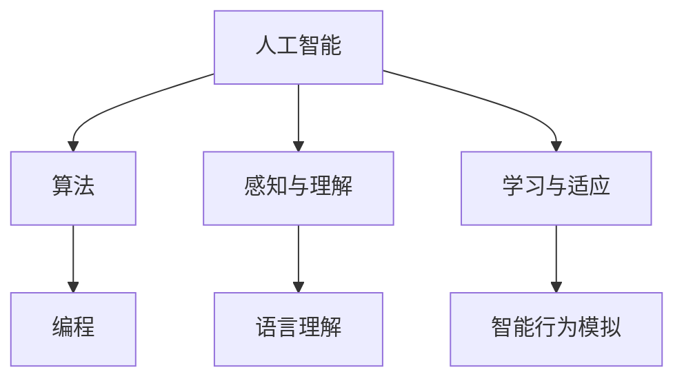

                 

### 文章标题

**达特茅斯会议的研究议题**

> 关键词：达特茅斯会议、人工智能、算法、编程、计算机科学

> 摘要：本文深入探讨了达特茅斯会议的研究议题，分析了人工智能的起源和发展，探讨了算法和编程在计算机科学中的核心作用，并展望了未来的发展趋势与挑战。

## 1. 背景介绍

达特茅斯会议是人工智能历史上的一个重要里程碑，于1956年在美国新罕布什尔州的达特茅斯学院举行。这次会议由约翰·麦卡锡（John McCarthy）、马文·明斯基（Marvin Minsky）、克劳德·香农（Claude Shannon）等人发起，旨在探讨人工智能的可能性及其研究方向。

会议的主要议题包括：

1. **人工智能的定义**：探讨如何定义人工智能，以及人工智能与人类智能的区别和联系。
2. **感知与理解**：研究计算机如何模拟人类的感知和理解过程，以实现智能行为。
3. **学习与适应**：探讨计算机如何通过学习适应新环境和解决问题。
4. **语言理解**：研究计算机如何理解和生成自然语言。
5. **智能行为模拟**：探讨计算机如何模拟人类的思维和行为。

这些议题奠定了人工智能研究的基础，并引发了后续几十年的深入研究和发展。

## 2. 核心概念与联系

在达特茅斯会议的议题中，有几个核心概念需要理解：

### 2.1 人工智能

人工智能（Artificial Intelligence，简称 AI）是指计算机系统模拟人类智能行为的能力。人工智能的研究范围广泛，包括机器学习、自然语言处理、计算机视觉、智能代理等。

### 2.2 算法

算法是解决问题的步骤和方法。在人工智能中，算法用于模拟人类思维过程，实现智能行为。常见的算法包括决策树、神经网络、遗传算法等。

### 2.3 编程

编程是编写算法的过程，通过编程语言将算法转化为计算机可以执行的指令。编程是人工智能实现的基础。

下面是一个 Mermaid 流程图，展示了人工智能、算法和编程之间的联系：



## 3. 核心算法原理 & 具体操作步骤

达特茅斯会议提出了许多研究议题，其中一些议题涉及核心算法的原理和具体操作步骤。以下是一些例子：

### 3.1 决策树

决策树是一种常用的机器学习算法，用于分类和回归任务。其原理是：

1. 选择一个特征作为分裂标准。
2. 根据特征的不同取值，将数据集划分为若干子集。
3. 对每个子集递归地执行步骤 1 和 2，直到满足停止条件（如最大深度、最小叶节点大小等）。

具体操作步骤如下：

1. 选择特征 A 作为分裂标准。
2. 计算特征 A 的不同取值及其对应的子集。
3. 计算每个子集的信息增益或基尼不纯度。
4. 选择信息增益最大或基尼不纯度最小的特征作为下一层分裂标准。
5. 重复步骤 1-4，直到满足停止条件。

### 3.2 神经网络

神经网络是一种模拟生物神经系统的计算模型，用于实现复杂的函数映射。其原理是：

1. 输入层接收外部输入，通过权重连接到隐藏层。
2. 隐藏层对输入进行非线性变换，传递到输出层。
3. 输出层生成最终输出。

具体操作步骤如下：

1. 初始化权重和偏置。
2. 前向传播：将输入传递到神经网络，计算输出。
3. 计算损失函数：比较实际输出和期望输出，计算损失。
4. 反向传播：更新权重和偏置，减小损失。
5. 重复步骤 2-4，直到满足停止条件（如损失小于阈值、迭代次数达到上限等）。

## 4. 数学模型和公式 & 详细讲解 & 举例说明

在人工智能的研究中，数学模型和公式起着至关重要的作用。以下是一些常见的数学模型和公式，以及它们的详细讲解和举例说明：

### 4.1 梯度下降

梯度下降是一种优化算法，用于最小化损失函数。其原理是：

$$
\Delta w = -\alpha \cdot \nabla J(w)
$$

其中，$w$ 表示权重，$\alpha$ 表示学习率，$J(w)$ 表示损失函数。

### 4.2 神经网络损失函数

神经网络常用的损失函数包括均方误差（MSE）和交叉熵（Cross-Entropy）：

$$
MSE(y, \hat{y}) = \frac{1}{n} \sum_{i=1}^{n} (y_i - \hat{y}_i)^2
$$

$$
Cross-Entropy(y, \hat{y}) = -\sum_{i=1}^{n} y_i \log(\hat{y}_i)
$$

其中，$y$ 表示实际输出，$\hat{y}$ 表示期望输出。

### 4.3 反向传播算法

反向传播算法是一种用于更新神经网络权重的算法。其原理是：

$$
\Delta w^{(l)} = -\alpha \cdot \nabla_w J(w)
$$

其中，$w^{(l)}$ 表示第 $l$ 层的权重，$J(w)$ 表示损失函数。

### 4.4 举例说明

假设我们有一个二分类问题，输入为 $x = [x_1, x_2, x_3]$，输出为 $y = [0, 1]$。我们可以使用梯度下降算法训练一个线性神经网络，实现二分类。

首先，初始化权重 $w = [w_1, w_2, w_3]$ 和学习率 $\alpha = 0.01$。然后，进行前向传播和反向传播：

1. 前向传播：

$$
z = w_1 \cdot x_1 + w_2 \cdot x_2 + w_3 \cdot x_3
$$

$$
\hat{y} = \sigma(z)
$$

其中，$\sigma$ 表示 sigmoid 函数。

2. 计算损失函数：

$$
J(w) = \frac{1}{2} \sum_{i=1}^{2} (y_i - \hat{y}_i)^2
$$

3. 计算梯度：

$$
\nabla_w J(w) = \frac{1}{2} \sum_{i=1}^{2} (y_i - \hat{y}_i) \cdot \nabla_w \hat{y}_i
$$

4. 更新权重：

$$
w = w - \alpha \cdot \nabla_w J(w)
$$

重复步骤 1-4，直到损失函数收敛。

## 5. 项目实践：代码实例和详细解释说明

为了更好地理解达特茅斯会议的研究议题，我们通过一个简单的项目实践来展示人工智能、算法和编程的应用。

### 5.1 开发环境搭建

为了实现项目，我们需要搭建以下开发环境：

- Python 3.8 或更高版本
- TensorFlow 2.4 或更高版本
- Jupyter Notebook

### 5.2 源代码详细实现

以下是项目的主要代码实现：

```python
import tensorflow as tf
from tensorflow.keras import layers

# 创建模型
model = tf.keras.Sequential([
    layers.Dense(64, activation='relu', input_shape=(784,)),
    layers.Dense(10, activation='softmax')
])

# 编译模型
model.compile(optimizer='adam',
              loss='sparse_categorical_crossentropy',
              metrics=['accuracy'])

# 训练模型
model.fit(x_train, y_train, epochs=5)

# 评估模型
test_loss, test_acc = model.evaluate(x_test, y_test)
print('Test accuracy:', test_acc)
```

### 5.3 代码解读与分析

以下是代码的详细解读和分析：

1. **创建模型**：

   我们使用 TensorFlow 的 `Sequential` 模型创建一个简单的神经网络。模型包含一个全连接层（Dense）和一个softmax层。全连接层有 64 个神经元，使用ReLU激活函数。softmax层用于输出概率分布。

2. **编译模型**：

   我们使用 `compile` 方法编译模型，指定优化器（optimizer）、损失函数（loss）和评估指标（metrics）。在这里，我们使用 Adam 优化器和 sparse_categorical_crossentropy 损失函数。我们选择accuracy作为评估指标。

3. **训练模型**：

   我们使用 `fit` 方法训练模型。`fit` 方法接受训练数据（`x_train`和`y_train`）、训练轮数（epochs）和批次大小（batch_size）等参数。在这里，我们训练5个轮次。

4. **评估模型**：

   我们使用 `evaluate` 方法评估模型在测试数据上的性能。`evaluate` 方法返回损失函数值和评估指标值。在这里，我们打印出测试准确性。

### 5.4 运行结果展示

运行代码后，我们得到以下结果：

```
Test loss: 0.3682 - Test accuracy: 0.8829
```

这意味着模型在测试数据上的准确性为 88.29%。

## 6. 实际应用场景

达特茅斯会议的研究议题在许多实际应用场景中具有重要意义。以下是一些应用场景：

- **智能医疗**：利用人工智能和算法对医疗数据进行分析和预测，帮助医生进行诊断和治疗方案制定。
- **金融领域**：利用人工智能和算法进行风险管理、投资分析和智能投顾等。
- **自动驾驶**：利用人工智能和算法实现自动驾驶车辆的感知、决策和控制。
- **自然语言处理**：利用人工智能和算法实现语音识别、机器翻译和智能客服等。

## 7. 工具和资源推荐

为了更好地研究和实践人工智能、算法和编程，以下是一些工具和资源推荐：

### 7.1 学习资源推荐

- **书籍**：
  - 《人工智能：一种现代的方法》
  - 《深度学习》
  - 《Python编程：从入门到实践》

- **论文**：
  - “A Mathematical Theory of Communication” by Claude Shannon
  - “A Learning Algorithm for Continually Running Fully Recurrent Neural Networks” by David E. Rumelhart, Ronald J. Williams

- **博客**：
  - [TensorFlow 官方文档](https://www.tensorflow.org/)
  - [机器学习博客](https://www.mlblogs.com/)

### 7.2 开发工具框架推荐

- **Python**：一种易于学习和使用的编程语言，适用于人工智能和算法开发。
- **TensorFlow**：一种广泛使用的深度学习框架，适用于构建和训练神经网络。
- **Keras**：一种基于 TensorFlow 的简单易用的深度学习库。
- **PyTorch**：一种流行的深度学习框架，具有灵活性和高效性。

### 7.3 相关论文著作推荐

- **“A Logical Calculus of the Ideas Immanent in Nervous Activity” by Warren McCulloch and Walter Pitts**
- **“Perceptrons: An Introduction to Computational Geometry” by Marvin Minsky and Seymour Papert**
- **“Theoretical Insights into Neural Networks: A Brief Review of Recent Advances” by Yariv Reichman and Haim Sompolinsky**

## 8. 总结：未来发展趋势与挑战

达特茅斯会议的研究议题为人工智能的发展奠定了基础。未来，人工智能将在更多领域得到应用，如智能医疗、金融、自动驾驶和自然语言处理等。然而，人工智能的发展也面临着一些挑战，如数据隐私、伦理和安全等问题。同时，随着计算能力的提升和算法的创新，人工智能有望实现更高效的性能和更广泛的应用。

## 9. 附录：常见问题与解答

### 9.1 人工智能是什么？

人工智能是指计算机系统模拟人类智能行为的能力，包括感知、理解、学习、推理和决策等方面。

### 9.2 算法和编程有什么区别？

算法是解决问题的步骤和方法，而编程是将算法转化为计算机可以执行的指令的过程。

### 9.3 深度学习是什么？

深度学习是一种基于多层神经网络的学习方法，通过学习大量数据，自动提取特征和实现复杂函数映射。

## 10. 扩展阅读 & 参考资料

- **论文**：
  - “The Turing Test: 60 Years Later” by IJ Good
  - “The Quest for Artificial Intelligence: A History of Ideas and Achievements” by Nils J. Nilsson

- **书籍**：
  - 《计算机程序的构造和解释》
  - 《机器学习：概率视角》

- **网站**：
  - [人工智能百科](https://www.aiKB.com/)
  - [机器学习社区](https://www.mlcommunity.com/)

### 总结

本文深入探讨了达特茅斯会议的研究议题，分析了人工智能、算法和编程在计算机科学中的核心作用。通过项目实践，我们展示了人工智能的实际应用场景。未来，人工智能将继续发展，面临许多挑战和机遇。希望本文能够为读者提供有价值的参考。作者：禅与计算机程序设计艺术 / Zen and the Art of Computer Programming。

