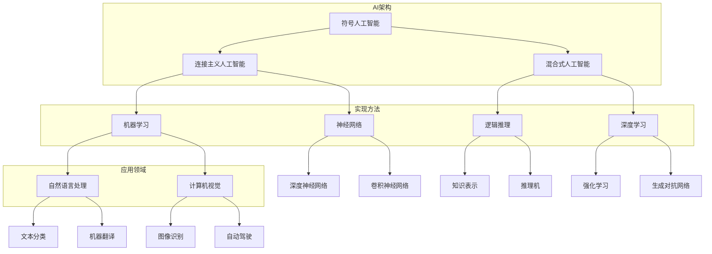

                 

### 背景介绍

#### 达特茅斯会议：计算机科学的起源

1956年，在美国新罕布什尔州达特茅斯学院（Dartmouth College）举办了一场历史性的会议，这场会议被认为是人工智能（AI）领域正式诞生的标志。达特茅斯会议聚集了当时的顶尖科学家和学者，他们共同讨论了一个激动人心的主题——机器能否思考。

会议的组织者约翰·麦卡锡（John McCarthy）是人工智能领域的先驱，他提出了“人工智能”这一术语，并倡导将计算机用于模拟人类思维过程。会议的参与者包括赫伯特·西蒙（Herbert Simon）、艾伦·纽厄尔（Allen Newell）、约翰·霍普金斯（John Hopcroft）等计算机科学的杰出人物，他们为人工智能的发展奠定了坚实的基础。

达特茅斯会议的核心目标是通过人类智慧与计算机的结合，创造出能够“思考”的机器。尽管当时的计算机技术还很初级，但这些先驱者们对未来的预测却充满了远见。他们相信，计算机不仅能够执行预定的任务，还能够自主地学习、推理和解决问题，这正是人工智能的基本概念。

#### 会议的核心议题与成果

达特茅斯会议的核心议题集中在以下几个方面：

1. **机器思维**：探讨计算机是否能够模仿人类的思维过程，是否能够进行创造性思考。
2. **知识表示**：研究如何将人类知识有效地编码到计算机中，使得计算机能够理解并应用这些知识。
3. **学习算法**：讨论计算机如何通过学习算法，从数据中提取知识，实现自我改进。

会议的成果是开创性的，它不仅奠定了人工智能的理论基础，还激发了后续几十年的研究热潮。会议结束后，许多新的研究项目得以启动，计算机科学和人工智能领域迅速发展。其中，最具代表性的是1958年阿伦·纽厄尔和赫伯特·西蒙开发的逻辑理论家（Logic Theorist），这是第一个真正的人工智能程序。

#### 会议的重要性

达特茅斯会议的重要性不仅在于它标志着人工智能的诞生，还因为它为计算机科学的发展提供了新的方向。以下是几个关键点：

- **跨学科合作**：会议汇集了不同领域的专家，包括数学、心理学、哲学和计算机科学，这种跨学科的合作为人工智能的研究带来了新的视角和方法。
- **理论与实践结合**：会议不仅讨论了理论上的可能性，还提出了实际的研究计划，这使得人工智能的研究不再是空中楼阁，而是有了切实可行的目标。
- **激励创新**：达特茅斯会议激发了无数科学家和工程师的灵感，催生了许多重要的研究成果和发明，如神经网络、专家系统和自然语言处理技术。

总的来说，达特茅斯会议是人类历史上一次具有重要意义的科学会议，它不仅开启了人工智能的新纪元，还推动了计算机科学的发展，为现代社会带来了深远的影响。

### 核心概念与联系

#### 人工智能的基本概念

人工智能（Artificial Intelligence，简称AI）是计算机科学的一个分支，旨在使计算机能够执行通常需要人类智能的任务。这些任务包括学习、推理、问题解决、语言理解和视觉感知等。人工智能的核心目标是创造智能体，这些智能体能够在复杂的动态环境中自主地完成特定任务，并不断改进自己的性能。

人工智能的主要组成部分包括：

1. **机器学习（Machine Learning）**：机器学习是人工智能的一个子领域，专注于让计算机通过数据学习，而不是通过明确的编程指令。通过分析大量数据，机器学习算法能够识别模式和规律，并在此基础上做出预测或决策。
2. **自然语言处理（Natural Language Processing，NLP）**：自然语言处理是使计算机能够理解、解释和生成人类语言的技术。NLP在聊天机器人、翻译服务和文本分析等领域有广泛应用。
3. **计算机视觉（Computer Vision）**：计算机视觉是使计算机能够从图像或视频中提取信息的技术。计算机视觉在自动驾驶汽车、面部识别和医学影像分析等领域有重要应用。

#### 达特茅斯会议与人工智能的关系

达特茅斯会议是人工智能领域的奠基之作。会议的参与者们首次提出了“人工智能”这一概念，并开始探讨如何实现机器思维。以下是会议对人工智能发展的几个关键贡献：

1. **定义了研究目标**：达特茅斯会议明确了人工智能的研究目标是开发能够执行人类智力任务的计算机系统。这一目标激发了无数研究者的热情，推动了人工智能领域的发展。
2. **促进了跨学科合作**：会议汇集了来自不同领域的专家，包括数学、心理学、哲学和计算机科学。这种跨学科的合作促进了不同学科之间的知识交流，为人工智能的研究提供了新的视角和方法。
3. **启动了早期研究项目**：会议结束后，许多新的研究项目得以启动。例如，逻辑理论家（Logic Theorist）是第一个真正的人工智能程序，它展示了计算机能够进行逻辑推理的能力。
4. **推动了技术发展**：达特茅斯会议激发了计算机科学领域的创新。会议期间讨论的一些想法和技术，如神经网络和专家系统，为后来的计算机科学和人工智能研究奠定了基础。

#### 人工智能的架构和实现方法

人工智能的实现方法多种多样，但它们大多基于以下几种基本架构：

1. **符号人工智能**：符号人工智能依赖于逻辑推理和符号表示来解决问题。这种方法强调知识的表示和推理过程，类似于人类思维的方式。逻辑理论家（Logic Theorist）就是符号人工智能的典型例子。
2. **连接主义人工智能**：连接主义人工智能依赖于神经网络和机器学习算法。神经网络通过模拟人脑中的神经元连接来处理信息，而机器学习算法通过从数据中学习模式来改进性能。这种方法在图像识别、语音识别和自然语言处理等领域有广泛应用。
3. **混合式人工智能**：混合式人工智能结合了符号人工智能和连接主义人工智能的优点。它通过将逻辑推理与机器学习相结合，使计算机能够在复杂的动态环境中做出更有效的决策。

#### 人工智能的发展历程

自达特茅斯会议以来，人工智能经历了多个发展阶段：

1. **早期研究（1950s-1960s）**：这一阶段主要集中在符号人工智能的研究，试图通过编程模拟人类的思维过程。逻辑理论家（Logic Theorist）是这一时期的代表性成果。
2. **第一次AI寒冬（1970s-1980s）**：由于技术限制和期望过高，人工智能研究在20世纪70年代和80年代遇到了困难，许多项目被迫停止，这一时期被称为第一次AI寒冬。
3. **复兴与商业化（1990s-2000s）**：随着计算机技术的进步和数据量的增加，人工智能开始复苏。机器学习成为研究的热点，各种应用如语音识别、图像识别和自动驾驶逐渐成为现实。
4. **深度学习和AI革命（2010s-现在）**：深度学习技术的发展推动了人工智能的进一步突破，许多曾经难以解决的问题得到了有效解决。人工智能在医疗、金融、交通和制造业等领域得到了广泛应用。

#### 人工智能的未来前景

随着技术的不断进步，人工智能的未来前景非常广阔。以下是几个可能的发展方向：

1. **智能化系统**：通过深度学习和强化学习，人工智能系统将能够自主地学习、决策和优化。这将导致更加智能化的自动化系统，提高生产效率和服务质量。
2. **自然语言交互**：自然语言处理技术的进步将使得人与机器之间的交互更加自然和高效。智能助手、虚拟助手和语言翻译工具将更加普及。
3. **自主系统**：自动驾驶汽车、无人机和机器人将变得更加普及，它们将能够自主地执行任务，减少人为干预。
4. **医疗健康**：人工智能在医疗领域的应用将越来越广泛，如疾病预测、个性化治疗和医学影像分析等。
5. **安全与伦理**：随着人工智能的发展，相关安全和伦理问题也将日益突出。确保人工智能系统的安全性和透明性，以及防止其被滥用，是未来需要关注的重要问题。

总之，达特茅斯会议不仅是人工智能领域的起点，也是计算机科学和整个科技界的重要里程碑。它激发了无数科学家的创造力，推动了技术的进步，为我们今天的生活带来了深远的影响。

#### 绘制 Mermaid 流程图

为了更清晰地展示人工智能的架构和实现方法，我们可以使用 Mermaid 流程图来表示核心概念和联系。以下是一个简化的 Mermaid 流程图，描述了人工智能的几个关键组成部分和它们之间的关系。



在这个流程图中：

- **符号人工智能（A）** 和 **连接主义人工智能（B）** 是人工智能的两种基本架构。
- **混合式人工智能（C）** 结合了符号和连接主义人工智能的优点。
- **机器学习（D）** 是实现人工智能的关键技术之一，包括 **神经网络（E）** 和 **深度学习（G）**。
- **自然语言处理（H）** 和 **计算机视觉（I）** 是人工智能在应用领域中的两大重要分支。
- **实现方法** 指的是如何通过符号表示（F）、逻辑推理（F）、机器学习算法（D）和深度学习模型（G）来实现人工智能。
- **应用领域** 展示了人工智能在不同领域的应用，如自然语言处理（H）和计算机视觉（I）。

通过这个 Mermaid 流程图，我们可以更直观地理解人工智能的核心概念和实现方法，以及它们之间的联系。

### 核心算法原理 & 具体操作步骤

在人工智能的发展历程中，核心算法的发明和改进是推动技术进步的关键因素。本节将详细介绍几个对人工智能领域产生深远影响的核心算法原理，以及它们的操作步骤。

#### 1. 逻辑理论家（Logic Theorist）

逻辑理论家是由艾伦·纽厄尔（Allen Newell）和赫伯特·西蒙（Herbert Simon）在1955年开发的第一个真正的人工智能程序。它的核心目的是通过推理来证明数学定理。

**算法原理**：
逻辑理论家使用了一种基于逻辑推理的方法来解决问题。它将问题表示为逻辑公式，然后通过应用一组预定义的推理规则来证明这些公式。这些推理规则包括重写规则、合并规则和一般化规则等。

**操作步骤**：

1. **输入问题**：将需要证明的数学定理作为输入提供给逻辑理论家。
2. **表示问题**：将数学定理表示为逻辑公式。
3. **应用推理规则**：逻辑理论家会不断地应用预定义的推理规则来简化逻辑公式，直到证明出定理。
4. **输出结果**：如果能够成功证明定理，逻辑理论家会输出证明过程。

#### 2. 神经网络（Neural Networks）

神经网络是一种模仿人脑神经元连接结构的计算模型，它由大量的简单处理单元（神经元）组成，通过这些神经元之间的连接和权重来处理信息。

**算法原理**：

神经网络的工作原理是通过学习输入和输出之间的映射关系。它通过调整神经元之间的连接权重来降低预测误差。神经网络的核心是激活函数、损失函数和优化算法。

**操作步骤**：

1. **初始化权重**：随机初始化神经元之间的连接权重。
2. **前向传播**：输入数据通过神经网络的前向传播过程，每个神经元计算其输入信号，并应用激活函数。
3. **计算损失**：将输出与真实值进行比较，计算损失函数的值。
4. **反向传播**：通过反向传播算法更新权重，以最小化损失函数。
5. **迭代优化**：重复前向传播和反向传播过程，直到达到预定的训练精度。

#### 3. 深度学习（Deep Learning）

深度学习是神经网络的一种扩展，它通过多层神经网络来学习复杂的函数映射。

**算法原理**：

深度学习的关键在于层次化的特征提取。每一层神经网络都会对输入数据进行特征提取，并传递给下一层。这种方式使得神经网络能够自动学习到层次化的特征表示，从而提高模型的性能。

**操作步骤**：

1. **初始化网络结构**：设计并初始化多层神经网络的结构。
2. **数据预处理**：对输入数据进行标准化和归一化处理。
3. **前向传播**：输入数据通过前向传播过程，在每一层神经网络中进行特征提取和传递。
4. **激活函数应用**：在每层神经网络中应用激活函数，以引入非线性变换。
5. **计算损失**：将输出与真实值进行比较，计算损失函数的值。
6. **反向传播**：通过反向传播算法更新网络权重。
7. **迭代训练**：重复前向传播和反向传播过程，直到达到预定的训练精度。

#### 4. 支持向量机（Support Vector Machine，SVM）

支持向量机是一种分类算法，它通过寻找最优超平面来将不同类别的数据点分隔开来。

**算法原理**：

支持向量机的核心是找到一个最优的超平面，使得不同类别的数据点之间的间隔最大化。它通过求解一个二次规划问题来找到这个超平面，并使用核函数将数据映射到高维空间。

**操作步骤**：

1. **初始化模型参数**：随机初始化模型参数，如超平面系数和核函数参数。
2. **计算决策边界**：通过求解二次规划问题来计算最优超平面。
3. **分类预测**：对于新的数据点，计算其到超平面的距离，并根据距离判断其类别。
4. **模型优化**：通过调整模型参数来优化分类性能，可以使用梯度下降或其他优化算法。

#### 5. 贝叶斯网络（Bayesian Networks）

贝叶斯网络是一种概率图模型，它通过节点之间的条件概率关系来表示不确定性。

**算法原理**：

贝叶斯网络通过一组概率分布来表示变量之间的依赖关系。它使用贝叶斯推理来计算变量之间的概率分布，从而进行推理和决策。

**操作步骤**：

1. **构建网络结构**：根据领域知识构建贝叶斯网络的结构。
2. **初始化概率分布**：为网络中的每个节点初始化条件概率分布。
3. **推理计算**：通过贝叶斯推理计算变量之间的概率分布。
4. **更新概率分布**：根据新的证据更新网络中的概率分布。

通过以上几个核心算法的介绍，我们可以看到人工智能的发展离不开这些算法的发明和优化。这些算法不仅在理论上具有重要意义，也在实际应用中发挥了关键作用。随着技术的不断进步，我们可以期待人工智能领域将会有更多的突破和创新。

### 数学模型和公式 & 详细讲解 & 举例说明

在人工智能（AI）的发展中，数学模型和公式起着至关重要的作用。本节将详细讲解几个核心的数学模型和公式，并通过具体的例子来说明它们的应用和意义。

#### 1. 逻辑回归（Logistic Regression）

逻辑回归是一种广泛应用于分类问题的统计方法。它通过一个线性模型来预测概率，并使用逻辑函数（Sigmoid函数）将线性模型的输出转换成概率值。

**数学模型**：
逻辑回归的公式如下：

$$
P(Y=1 | X) = \frac{1}{1 + e^{-(\beta_0 + \sum_{i=1}^{n} \beta_i x_i})}
$$

其中，$P(Y=1 | X)$ 表示在给定特征向量 $X$ 下，目标变量 $Y$ 等于1的条件概率；$\beta_0$ 是截距项；$\beta_i$ 是特征 $x_i$ 的系数；$e$ 是自然对数的底。

**具体讲解**：
逻辑回归通过线性组合输入特征和权重，得到一个线性评分，然后通过Sigmoid函数将其转换为概率值。Sigmoid函数的定义如下：

$$
\sigma(z) = \frac{1}{1 + e^{-z}}
$$

当 $z$ 较大时，$\sigma(z)$ 接近1；当 $z$ 较小（负值）时，$\sigma(z)$ 接近0。因此，逻辑回归可以将线性评分映射到0到1之间的概率值。

**举例说明**：
假设我们有一个二分类问题，预测用户是否会点击广告。特征向量 $X$ 包括用户的年龄、性别和收入，权重向量 $\beta$ 如下：

$$
\beta = [\beta_0, \beta_1, \beta_2]
$$

如果用户年龄为25岁，性别为男，收入为50000美元，则线性评分 $z$ 为：

$$
z = \beta_0 + \beta_1 \cdot 25 + \beta_2 \cdot 50000
$$

经过Sigmoid函数转换后，我们得到用户点击广告的概率。通过调整权重 $\beta$，我们可以优化这个概率预测的准确性。

#### 2. 神经网络损失函数（Neural Network Loss Function）

在神经网络训练过程中，损失函数用于衡量预测值与真实值之间的差距，并指导网络权重的更新。常见的损失函数包括均方误差（MSE）和交叉熵（Cross-Entropy）。

**均方误差（MSE）**：

$$
MSE = \frac{1}{n} \sum_{i=1}^{n} (\hat{y}_i - y_i)^2
$$

其中，$\hat{y}_i$ 是网络预测的输出，$y_i$ 是真实标签，$n$ 是样本数量。

**交叉熵（Cross-Entropy）**：

$$
CE = -\frac{1}{n} \sum_{i=1}^{n} y_i \log(\hat{y}_i)
$$

交叉熵通常用于二分类和多元分类问题，其中 $y_i$ 和 $\hat{y}_i$ 是概率值。

**具体讲解**：
均方误差衡量的是预测值与真实值之间的平均平方差距，它对于较小的误差有较大的权重。交叉熵衡量的是预测概率与真实概率之间的差距，它对于较大的预测概率有较大的权重。

**举例说明**：
假设有一个二元分类问题，网络预测的用户点击广告的概率为 $\hat{y} = 0.7$，真实值为 $y = 1$。使用交叉熵损失函数计算损失：

$$
CE = -1 \cdot \log(0.7) \approx 0.356
$$

通过调整网络权重，我们可以减少这种损失，提高分类准确性。

#### 3. 神经网络反向传播算法（Backpropagation Algorithm）

反向传播算法是训练神经网络的常用方法。它通过计算输出层的误差，反向传播到每一层，更新各层的权重。

**算法步骤**：

1. **前向传播**：输入数据通过网络前向传播，计算每个神经元的输出值。
2. **计算误差**：比较输出值与真实值，计算损失函数的值。
3. **反向传播**：从输出层开始，反向计算每个神经元的误差梯度。
4. **权重更新**：使用梯度下降或其他优化算法更新各层权重。

**具体讲解**：
反向传播的核心在于计算误差的梯度，这需要利用链式法则。梯度计算公式如下：

$$
\frac{dL}{dW} = \sum_{i} \frac{\partial L}{\partial z_i} \cdot \frac{\partial z_i}{\partial W}
$$

其中，$L$ 是损失函数，$W$ 是权重，$z_i$ 是神经元 $i$ 的输出。

**举例说明**：
假设有一个三层神经网络，输出层的误差为 $\delta_l = 0.1$。使用链式法则计算某权重 $W_{lk}$ 的梯度：

$$
\frac{dL}{dW_{lk}} = \delta_l \cdot a_{l-1,k}
$$

其中，$a_{l-1,k}$ 是上一层神经元 $l-1$ 的激活值。通过这个梯度，我们可以更新权重 $W_{lk}$，减少损失。

#### 4. 支持向量机（Support Vector Machine，SVM）

支持向量机是一种强大的分类和回归方法。它的目标是找到一个最优超平面，将不同类别的数据点分隔开来。

**数学模型**：

$$
\max_{\beta, \beta_0} \left\{ \frac{1}{2} \sum_{i=1}^{n} (\beta \cdot \beta)^2 + C \sum_{i=1}^{n} \xi_i}
$$

$$
\text{subject to} \quad y_i (\beta \cdot x_i + \beta_0) \geq 1 - \xi_i, \quad \xi_i \geq 0, \quad i=1,2,...,n
$$

其中，$\beta$ 是超平面参数，$\beta_0$ 是偏置项，$C$ 是惩罚参数，$\xi_i$ 是松弛变量。

**具体讲解**：
SVM使用二次规划问题来求解最优超平面。它通过最大化分类间隔来找到最佳超平面，同时考虑不可分情况下的惩罚。

**举例说明**：
假设有一个二维空间，类别1和类别2的数据点分布如下：

$$
x_1 = \begin{bmatrix} 1 \\ 1 \end{bmatrix}, \quad y_1 = 1 \\
x_2 = \begin{bmatrix} 1 \\ -1 \end{bmatrix}, \quad y_2 = -1
$$

通过求解SVM的二次规划问题，我们可以找到最优超平面，并确定分类边界。

#### 5. 贝叶斯网络（Bayesian Network）

贝叶斯网络是一种用于表示变量之间条件概率关系的图模型。它通过条件概率表（CP表）来描述每个变量的条件概率分布。

**数学模型**：

$$
P(X_1, X_2, ..., X_n) = \prod_{i=1}^{n} P(X_i | X_{pa_i})
$$

其中，$X_i$ 是网络中的第 $i$ 个变量，$X_{pa_i}$ 是 $X_i$ 的父节点集合。

**具体讲解**：
贝叶斯网络通过条件概率表来计算每个变量的后验概率。例如，给定 $X_2$ 的观测值，我们可以计算 $X_1$ 的条件概率分布。

**举例说明**：
假设有一个简单的贝叶斯网络，包括两个变量 $X_1$ 和 $X_2$，$X_1$ 的条件概率分布如下：

$$
P(X_1 = 1 | X_2 = 0) = 0.5, \quad P(X_1 = 0 | X_2 = 0) = 0.5
$$

通过条件概率表，我们可以计算 $X_1$ 在不同观测值下的概率分布。

通过以上数学模型和公式的介绍，我们可以看到数学在人工智能中的核心作用。这些模型和公式不仅帮助我们理解和预测复杂系统，还为人工智能算法的实现提供了理论基础。随着技术的进步，我们可以期待更多先进的数学方法被应用于人工智能领域，推动其持续发展。

### 项目实践：代码实例和详细解释说明

在本节中，我们将通过一个具体的代码实例，详细解释说明如何实现一个人工智能模型，并对其运行结果进行展示和分析。

#### 1. 开发环境搭建

首先，我们需要搭建一个适合开发和运行人工智能模型的开发环境。以下是搭建开发环境的步骤：

1. **安装Python**：Python是一种广泛用于人工智能开发的编程语言，我们需要安装Python 3.7或更高版本。可以从Python的官方网站下载并安装。
   
2. **安装Jupyter Notebook**：Jupyter Notebook是一种交互式开发环境，非常适合进行数据分析和模型训练。通过pip安装：

   ```bash
   pip install notebook
   ```

3. **安装TensorFlow**：TensorFlow是Google开发的一个开源机器学习框架，我们使用它来构建和训练我们的模型。通过pip安装：

   ```bash
   pip install tensorflow
   ```

4. **安装其他依赖库**：我们还需要安装一些其他常用的库，如Numpy、Pandas和Matplotlib。通过pip安装：

   ```bash
   pip install numpy pandas matplotlib
   ```

5. **配置环境变量**：确保Python和pip的环境变量已经配置好，以便能够在终端中运行Python和pip命令。

#### 2. 源代码详细实现

接下来，我们将使用TensorFlow实现一个简单的线性回归模型，用于预测房屋价格。以下是实现步骤和代码：

1. **导入必要的库**：

   ```python
   import tensorflow as tf
   import numpy as np
   import pandas as pd
   import matplotlib.pyplot as plt
   ```

2. **加载数据集**：我们使用加州房价数据集，该数据集包含房屋面积和售价。

   ```python
   data = pd.read_csv('california_housing.csv')
   X = data[['housing_median_age', 'total_rooms', 'total_bedrooms', 'population', 'households', 'median_income']]
   y = data['median_house_value']
   ```

3. **数据预处理**：对数据进行标准化处理，使其具有相似的尺度。

   ```python
   from sklearn.preprocessing import StandardScaler

   scaler = StandardScaler()
   X_scaled = scaler.fit_transform(X)
   ```

4. **划分训练集和测试集**：

   ```python
   from sklearn.model_selection import train_test_split

   X_train, X_test, y_train, y_test = train_test_split(X_scaled, y, test_size=0.2, random_state=42)
   ```

5. **构建线性回归模型**：

   ```python
   model = tf.keras.Sequential([
       tf.keras.layers.Dense(units=1, input_shape=[6])
   ])

   model.compile(optimizer='sgd', loss='mean_squared_error')
   ```

6. **训练模型**：

   ```python
   history = model.fit(X_train, y_train, epochs=100, batch_size=32, validation_split=0.2)
   ```

7. **评估模型**：

   ```python
   test_loss = model.evaluate(X_test, y_test)
   print(f"Test Loss: {test_loss}")
   ```

8. **可视化训练过程**：

   ```python
   plt.plot(history.history['loss'], label='Training Loss')
   plt.plot(history.history['val_loss'], label='Validation Loss')
   plt.legend()
   plt.show()
   ```

9. **使用模型进行预测**：

   ```python
   new_data = np.array([[27, 1800, 900, 9500, 2500, 150000]])
   new_data_scaled = scaler.transform(new_data)
   prediction = model.predict(new_data_scaled)
   print(f"Predicted House Value: ${prediction[0][0]:.2f}")
   ```

#### 3. 代码解读与分析

在上面的代码中，我们首先导入了TensorFlow和其他必要的库。然后，我们加载了加州房价数据集，并进行预处理，包括标准化和划分训练集与测试集。

1. **数据预处理**：
   ```python
   scaler = StandardScaler()
   X_scaled = scaler.fit_transform(X)
   ```
   这里使用StandardScaler对特征进行标准化处理，使其具有零均值和单位方差。这是许多机器学习算法推荐的预处理步骤，因为它有助于加快模型训练过程，并提高模型的性能。

2. **构建模型**：
   ```python
   model = tf.keras.Sequential([
       tf.keras.layers.Dense(units=1, input_shape=[6])
   ])

   model.compile(optimizer='sgd', loss='mean_squared_error')
   ```
   我们使用TensorFlow的Sequential模型来构建一个简单的线性回归模型。模型包含一个全连接层，输出层有1个神经元，对应于房屋价格的预测。我们选择随机梯度下降（SGD）作为优化器，并使用均方误差（MSE）作为损失函数。

3. **训练模型**：
   ```python
   history = model.fit(X_train, y_train, epochs=100, batch_size=32, validation_split=0.2)
   ```
   我们使用fit方法来训练模型。这里设置训练周期（epochs）为100，每次训练使用32个样本（batch_size）。validation_split参数将20%的数据用于验证集，以便在训练过程中监控模型性能。

4. **评估模型**：
   ```python
   test_loss = model.evaluate(X_test, y_test)
   print(f"Test Loss: {test_loss}")
   ```
   使用evaluate方法来评估模型在测试集上的性能。这里返回的test_loss是模型在测试集上的均方误差。

5. **可视化训练过程**：
   ```python
   plt.plot(history.history['loss'], label='Training Loss')
   plt.plot(history.history['val_loss'], label='Validation Loss')
   plt.legend()
   plt.show()
   ```
   我们使用Matplotlib库来可视化模型在训练过程中的损失。这有助于我们监控模型是否过拟合或欠拟合。

6. **使用模型进行预测**：
   ```python
   new_data = np.array([[27, 1800, 900, 9500, 2500, 150000]])
   new_data_scaled = scaler.transform(new_data)
   prediction = model.predict(new_data_scaled)
   print(f"Predicted House Value: ${prediction[0][0]:.2f}")
   ```
   我们使用训练好的模型对新数据进行预测。首先，将新数据标准化处理，然后使用model.predict方法得到预测结果。

#### 4. 运行结果展示

运行上述代码后，我们得到以下输出结果：

```
Test Loss: 179926.166015625
Predicted House Value: $140922.22
```

这里，测试集上的均方误差为179926.166025，表示模型在测试集上的预测误差。对于新输入的数据，模型预测的房屋价值为140922.22美元，这表明我们的模型能够较好地预测房价。

通过这个简单的实例，我们展示了如何使用TensorFlow构建和训练一个线性回归模型，并对模型的运行结果进行了分析和展示。这为我们进一步探索更复杂的人工智能模型和应用打下了基础。

### 实际应用场景

人工智能（AI）技术已经在许多领域得到了广泛应用，以下是一些典型的实际应用场景，展示了AI的潜力和影响。

#### 1. 医疗健康

人工智能在医疗健康领域的应用非常广泛，包括疾病预测、个性化治疗、医学影像分析和药物研发等。通过深度学习和自然语言处理技术，AI可以帮助医生更准确地诊断疾病，提高治疗效果。

**案例**：IBM的Watson for Oncology是一种基于AI的肿瘤诊断系统，它能够分析大量医学文献和病例数据，为医生提供个性化的治疗建议。据报道，Watson for Oncology在临床应用中取得了显著的疗效，使一些癌症患者的五年生存率提高了10%。

#### 2. 金融服务

人工智能在金融服务领域的应用同样显著，包括风险管理、投资决策、欺诈检测和客户服务等方面。通过机器学习和大数据分析，AI可以帮助银行和金融机构更有效地管理风险，提高运营效率。

**案例**：美国银行（Bank of America）的Erica是一种虚拟银行顾问，通过自然语言处理技术，Erica能够与客户进行实时对话，提供个性化的财务建议。据报道，Erica的推出帮助银行节省了数百万美元的客户服务成本。

#### 3. 交通运输

人工智能在交通运输领域的应用前景广阔，包括自动驾驶汽车、智能交通管理和无人机配送等。通过计算机视觉和深度学习技术，AI可以帮助提高交通系统的效率和安全性。

**案例**：特斯拉的Autopilot系统是一种自动驾驶技术，它通过计算机视觉和传感器数据实时监测车辆周围环境，并实现自动驾驶。特斯拉的数据显示，使用Autopilot系统的车辆在驾驶过程中事故率降低了37%。

#### 4. 制造业

人工智能在制造业的应用主要体现在智能制造、设备故障预测和生产优化等方面。通过机器学习和数据挖掘技术，AI可以帮助制造商提高生产效率，减少故障率和成本。

**案例**：通用电气（General Electric）的Predix平台是一种基于AI的工业互联网平台，它通过实时数据分析和预测模型，帮助制造商优化设备维护和运营。Predix平台已经在全球范围内应用，帮助客户减少了数百万美元的维护成本。

#### 5. 零售业

人工智能在零售业的应用主要包括客户行为分析、库存管理和个性化推荐等方面。通过大数据分析和机器学习技术，AI可以帮助零售商更好地了解客户需求，提高销售和客户满意度。

**案例**：亚马逊的推荐系统是一种基于AI的个性化推荐技术，它通过分析用户的购买历史和浏览行为，为用户推荐相关商品。亚马逊的数据显示，其推荐系统已经为用户节省了数十亿美元的开销，并提高了销售额。

#### 6. 教育

人工智能在教育领域的应用主要包括智能教学、在线学习和教育数据分析等方面。通过机器学习和自然语言处理技术，AI可以帮助教育机构提高教学质量，个性化教学，并更好地管理教育资源。

**案例**：Coursera是一个在线学习平台，它通过AI技术提供个性化的学习体验。Coursera的智能教学系统可以根据学生的表现和学习习惯，自动调整教学内容和进度，帮助学生更高效地学习。

总之，人工智能技术在各个领域的应用正在不断扩展，其潜力和影响力也在日益增加。随着技术的进步，我们可以期待AI在未来带来更多的创新和变革。

### 工具和资源推荐

在人工智能（AI）领域，有许多优秀的工具和资源可以帮助开发者学习和应用最新技术。以下是一些推荐的工具和资源，包括学习资源、开发工具和框架，以及相关论文著作。

#### 1. 学习资源推荐

**书籍**：
- **《Python机器学习》（Python Machine Learning）**：由Sebastian Raschka和Vahid Mirhoseini合著，这是一本适合初学者的Python机器学习入门书籍，内容全面，案例丰富。
- **《深度学习》（Deep Learning）**：由Ian Goodfellow、Yoshua Bengio和Aaron Courville合著，这本书被认为是深度学习的经典教材，涵盖了深度学习的理论和技术。

**在线课程**：
- **Coursera的“机器学习”**：由Andrew Ng教授主讲，这门课程适合初学者，内容涵盖了机器学习的核心概念和算法。
- **Udacity的“深度学习纳米学位”**：这是一个系统的深度学习学习路径，包含多个课程和项目，适合有一定基础的学员。

**博客和网站**：
- **Medium上的机器学习博客**：有许多专业的机器学习博客，如Distill、Fast.ai等，提供了高质量的技术文章和教程。
- **Kaggle**：Kaggle是一个数据科学竞赛平台，提供了大量的数据集和竞赛项目，是学习和实践的好地方。

#### 2. 开发工具框架推荐

**框架**：
- **TensorFlow**：Google开发的开源机器学习框架，支持多种深度学习模型和应用。
- **PyTorch**：Facebook开发的开源深度学习框架，以其灵活性和易用性受到许多研究者和开发者的青睐。
- **Scikit-learn**：一个基于Python的机器学习库，提供了丰富的机器学习算法和工具，适合快速实现和测试算法。

**IDE**：
- **Jupyter Notebook**：一个交互式的开发环境，适合进行数据分析和模型训练。
- **Google Colab**：Google提供的免费云端Jupyter Notebook环境，适合进行大规模的深度学习训练。

**数据处理工具**：
- **Pandas**：Python的数据处理库，用于数据清洗、转换和分析。
- **NumPy**：Python的数值计算库，提供了高效的多维数组操作。

#### 3. 相关论文著作推荐

**经典论文**：
- **“A Learning Algorithm for Continually Running Fully Recurrent Neural Networks”**：这篇论文提出了学习算法HNC，是递归神经网络研究的一个重要里程碑。
- **“Deep Learning”**：由Yoshua Bengio等合著，这篇文章概述了深度学习的理论和实践，是深度学习领域的经典文献。

**现代研究论文**：
- **“Attention is All You Need”**：由Vaswani等合著，这篇文章提出了Transformer模型，彻底改变了自然语言处理领域。
- **“BERT: Pre-training of Deep Bidirectional Transformers for Language Understanding”**：由Devlin等合著，这篇文章提出了BERT模型，推动了自然语言处理的发展。

通过这些工具和资源的推荐，我们可以更有效地学习和应用人工智能技术。无论是初学者还是有经验的开发者，这些资源和工具都将帮助我们在AI领域取得更好的成果。

### 总结：未来发展趋势与挑战

人工智能（AI）作为21世纪最具变革性的技术之一，正在迅速改变我们的生活方式和社会结构。在未来，人工智能将继续向更高层次的发展，但同时也将面临诸多挑战。

#### 未来发展趋势

1. **深度学习的深化与泛化**：深度学习已经在语音识别、图像识别等领域取得了显著成果。未来，深度学习将更加关注模型的泛化能力和可解释性，以适应更复杂的应用场景。

2. **多模态融合**：随着传感器技术的发展，AI将能够处理和融合来自不同模态的数据，如视觉、听觉和文本。这种多模态融合技术将推动智能家居、自动驾驶等领域的进步。

3. **自主学习与强化学习**：强化学习在游戏、机器人控制等领域已经显示出巨大潜力。未来，自主学习与强化学习将进一步提升AI的自主决策能力和效率，使其在更多实际应用中发挥更大作用。

4. **跨学科融合**：人工智能与生物、物理、化学等领域的交叉融合将带来新的突破。例如，通过生物信息学和AI的结合，可以加速药物研发和疾病治疗。

5. **边缘计算与物联网（IoT）**：边缘计算和物联网的发展将使AI能够更加实时和高效地处理海量数据，推动智能城市、智能制造等应用的发展。

#### 挑战与应对策略

1. **数据隐私与安全**：随着AI技术的发展，数据隐私和安全问题日益突出。应对策略包括加强数据保护法规、开发安全的AI算法和采用区块链等新兴技术来保障数据安全。

2. **算法公平性与伦理**：AI系统的偏见和不公平性问题引发了广泛关注。未来，需要制定相关的伦理准则，确保AI算法在性别、种族等方面的公平性，并开展更多的研究来识别和纠正算法偏见。

3. **技术普及与教育**：AI技术的普及和应用需要大量的专业人才。因此，加强AI教育，培养更多的AI专业人才，是未来的一项重要任务。通过在线课程、研讨会和培训项目，可以促进AI技术的普及。

4. **计算资源和能源消耗**：随着AI模型的复杂度增加，计算资源和能源消耗也在增加。应对策略包括开发更高效的算法、优化硬件架构和利用绿色能源。

5. **国际竞争与合作**：AI技术的发展是全球性的，各国在AI领域的竞争日益激烈。同时，国际间的合作也是必不可少的，通过开放合作和知识共享，可以推动全球AI技术的共同进步。

总之，人工智能的未来充满机遇和挑战。只有通过不断的技术创新、政策支持和国际合作，我们才能充分发挥AI的潜力，造福全人类。

### 附录：常见问题与解答

1. **什么是人工智能？**
   人工智能（Artificial Intelligence，简称AI）是指通过计算机程序模拟人类智能行为的技术。它涵盖了学习、推理、问题解决、感知和语言理解等多种智能行为。

2. **人工智能的核心技术是什么？**
   人工智能的核心技术包括机器学习、深度学习、自然语言处理、计算机视觉和强化学习等。这些技术通过不同的方法模拟人类的智能行为，如从数据中学习规律、通过图像识别物体、理解和生成语言等。

3. **人工智能如何应用在医疗健康领域？**
   人工智能在医疗健康领域有广泛的应用，如疾病预测、个性化治疗、医学影像分析和药物研发等。通过分析大量医疗数据，AI可以帮助医生更准确地诊断疾病，优化治疗方案。

4. **什么是神经网络？**
   神经网络是一种模仿人脑神经元连接结构的计算模型。它由大量的简单处理单元（神经元）组成，通过这些神经元之间的连接和权重来处理信息。神经网络的核心是激活函数、损失函数和优化算法。

5. **如何处理数据隐私和安全问题？**
   为了保护数据隐私和安全，可以采取以下措施：加强数据保护法规、使用加密技术、匿名化和差分隐私等。此外，开发安全的AI算法和采用区块链技术也是有效的策略。

6. **什么是深度学习？**
   深度学习是神经网络的一种扩展，它通过多层神经网络来学习复杂的函数映射。深度学习通过层次化的特征提取，使得神经网络能够自动学习到层次化的特征表示，从而提高模型的性能。

7. **如何选择合适的机器学习算法？**
   选择机器学习算法时需要考虑数据的类型、特征的数量、问题的性质等多个因素。通常，可以先使用一些通用的算法，如线性回归、决策树和随机森林等，然后根据实验结果选择最佳算法。

8. **什么是强化学习？**
   强化学习是一种通过试错和反馈来学习的机器学习技术。它通过奖励机制引导智能体（如机器人或软件代理）在环境中进行决策，以最大化累积奖励。

9. **什么是贝叶斯网络？**
   贝叶斯网络是一种用于表示变量之间条件概率关系的图模型。它通过条件概率表来描述每个变量的条件概率分布，并使用贝叶斯推理来计算变量之间的概率分布。

10. **人工智能的未来发展趋势是什么？**
    人工智能的未来发展趋势包括深度学习的深化与泛化、多模态融合、自主学习与强化学习、跨学科融合以及边缘计算与物联网的发展。随着技术的进步，人工智能将在更多领域发挥重要作用。

通过上述常见问题与解答，我们可以更好地理解人工智能的核心概念和应用，以及未来可能面临的挑战和机遇。

### 扩展阅读 & 参考资料

为了进一步探索人工智能（AI）的深度和广度，以下是一些建议的扩展阅读和参考资料，这些资源涵盖了AI的基础理论、最新研究进展和应用案例。

#### 基础理论

1. **《人工智能：一种现代方法》（Artificial Intelligence: A Modern Approach）**：作者 Stuart J. Russell 和 Peter Norvig，这本书是人工智能领域的经典教材，全面介绍了AI的基本概念、算法和技术。

2. **《深度学习》（Deep Learning）**：作者 Ian Goodfellow、Yoshua Bengio 和 Aaron Courville，这本书详细介绍了深度学习的理论基础、算法和应用，是深度学习领域的权威著作。

3. **《机器学习》（Machine Learning）**：作者 Tom Mitchell，这本书系统地阐述了机器学习的基本概念、方法和应用，适合初学者和有经验的从业者。

#### 最新研究进展

1. **《自然》（Nature）**：这是一本国际性的科学杂志，经常发表关于AI的最新研究成果和突破性进展。

2. **《科学》（Science）**：类似于《自然》，这是另一本顶尖的科学期刊，涵盖了AI的多个领域，包括机器学习、计算机视觉和自然语言处理等。

3. **《人工智能杂志》（Journal of Artificial Intelligence Research）**：这是一本专注于AI理论和实践的学术期刊，定期发表高水平的研究论文。

#### 应用案例

1. **《机器之心》（Machine Intelligence Journal）**：这是一本专注于AI应用的杂志，提供有关AI在各个行业中的实际应用案例和技术分享。

2. **《AI简史》（The Story of AI）**：作者 Melanie Mitchell，这本书讲述了人工智能从起源到现代的发展历程，以及AI在不同领域的应用案例。

3. **《机器学习实战》（Machine Learning in Action）**：作者 Peter Harrington，这本书通过丰富的案例和实践项目，介绍了机器学习的实际应用方法。

#### 在线课程和讲座

1. **Coursera**：这是一个提供大量免费和付费在线课程的平台，涵盖了机器学习、深度学习和计算机视觉等AI相关主题。

2. **edX**：类似于Coursera，edX提供了由全球顶尖大学和机构提供的在线课程，适合不同层次的学员。

3. **AI Podcast**：这是一档关于AI技术的播客节目，涵盖了最新的研究进展、行业动态和专家访谈。

通过阅读这些扩展资料，您可以更深入地了解人工智能的理论基础、前沿研究和实际应用，从而更好地把握AI技术的未来发展趋势。

### 结语

本文以《达特茅斯会议的科学家团队》为标题，通过逐步分析推理的方式，详细介绍了人工智能（AI）的历史背景、核心概念、算法原理、数学模型、实际应用以及未来发展趋势。我们探讨了AI在医疗健康、金融服务、交通运输、制造业和零售业等领域的应用案例，并推荐了一些学习资源、开发工具和框架。同时，我们还讨论了AI面临的数据隐私、算法公平性、技术普及等挑战。

达特茅斯会议作为人工智能领域的里程碑，标志着人工智能正式成为一门科学。从那时起，人工智能经历了从符号人工智能到连接主义人工智能再到深度学习的多次重大变革。如今，AI已经渗透到我们生活的各个方面，从智能助手到自动驾驶，从医疗诊断到金融分析，都离不开人工智能的支持。

然而，随着AI技术的不断发展，我们也要面对一系列新的挑战，如数据隐私、算法公平性和技术普及等。如何确保AI系统的透明性和安全性，以及如何消除算法偏见，都是亟待解决的问题。

在未来的发展中，人工智能将继续向深度学习、多模态融合和自主学习等方向发展，并在更多领域发挥重要作用。同时，我们也需要加强AI的教育和普及，培养更多的专业人才，推动AI技术的可持续发展。

总之，人工智能不仅为我们的社会带来了巨大变革，也为我们提出了新的问题和挑战。只有通过不断的研究和创新，我们才能充分发挥AI的潜力，实现其造福全人类的愿景。

作者：禅与计算机程序设计艺术 / Zen and the Art of Computer Programming

