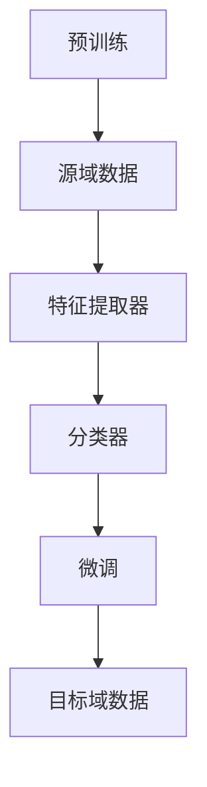

                 

### 文章标题

迁移学习(Transfer Learning) - 原理与代码实例讲解

> **关键词：** 迁移学习，深度学习，预训练模型，权重共享，知识迁移，模型优化

> **摘要：** 本文章将深入探讨迁移学习的原理，并通过实际代码实例详细讲解如何实现迁移学习。文章将覆盖迁移学习的背景、核心概念、算法原理、数学模型以及项目实践，旨在帮助读者全面理解迁移学习的实际应用。

## 1. 背景介绍

随着深度学习技术的不断发展，神经网络在各类任务中展现出了强大的表现力。然而，传统的深度学习模型通常需要大量数据来训练，以便在特定任务上取得良好的性能。这不仅增加了训练成本，还限制了模型的应用范围。为了解决这个问题，迁移学习（Transfer Learning）应运而生。

迁移学习是一种利用已有模型的知识和结构来加速新任务学习的训练过程。其核心思想是将预训练模型在特定领域的知识迁移到新的任务上，从而减少对新数据的依赖。这种方法不仅在数据稀缺的情况下表现出色，而且在多任务学习、跨域学习等方面具有广泛的应用前景。

近年来，随着计算能力的提升和大数据的普及，迁移学习逐渐成为深度学习领域的研究热点。本文章将系统地介绍迁移学习的原理、方法及其在实际应用中的表现，并辅以代码实例，帮助读者更好地理解和实践迁移学习。

## 2. 核心概念与联系

### 迁移学习的核心概念

迁移学习涉及以下核心概念：

1. **源域（Source Domain）**：指预训练模型所依赖的数据集和任务。
2. **目标域（Target Domain）**：指需要迁移学习的任务和数据集。
3. **特征提取器（Feature Extractor）**：从原始数据中提取有用信息的神经网络部分。
4. **分类器（Classifier）**：用于对提取的特征进行分类的神经网络部分。

### 迁移学习的架构

迁移学习的架构通常包括以下步骤：

1. **预训练**：在大量数据上对基础模型进行预训练，使其获得通用特征表示能力。
2. **权重共享**：将预训练模型的部分或全部权重作为新模型的初始权重。
3. **微调（Fine-tuning）**：在新数据集上对模型进行微调，使其适应特定任务。

### 迁移学习的 Mermaid 流程图

以下是一个简单的 Mermaid 流程图，展示了迁移学习的架构：



### 2.1 迁移学习的优势

- **数据效率**：利用已有的预训练模型，可以减少对新数据的依赖，提高数据利用效率。
- **模型性能**：通过迁移学习，模型可以在有限的数据上取得更好的性能。
- **跨领域应用**：迁移学习使得模型可以适应不同领域的任务，提高泛化能力。
- **减少训练成本**：由于预训练模型已经在大量数据上训练，因此在新任务上只需少量数据即可微调。

### 2.2 迁移学习的挑战

- **领域差异**：不同领域的数据分布和特征差异较大，可能导致迁移效果不理想。
- **模型适应性**：如何设计适应不同任务的迁移学习模型是一个重要问题。
- **训练效率**：在数据稀缺的情况下，如何高效地训练模型是另一个挑战。

## 3. 核心算法原理 & 具体操作步骤

### 3.1 预训练模型

迁移学习的第一步是预训练模型。预训练模型通常在大规模数据集上训练，以便学习通用的特征表示。常见的预训练模型包括：

- **词向量模型**：如 Word2Vec、GloVe 等。
- **图像识别模型**：如 VGG、ResNet、Inception 等。
- **自然语言处理模型**：如 BERT、GPT 等。

### 3.2 权重共享

在迁移学习过程中，权重共享是关键的一步。它包括以下几种情况：

1. **全权重共享**：预训练模型的全部权重都作为新模型的初始权重。
2. **部分权重共享**：仅将预训练模型的部分权重（如特征提取器）作为新模型的初始权重。
3. **无权重共享**：预训练模型的权重不用于新模型，仅作为参考。

### 3.3 微调

微调是迁移学习的重要步骤，它包括以下操作：

1. **数据准备**：准备目标域的数据集，并进行预处理，如数据增强、标准化等。
2. **模型初始化**：使用预训练模型的权重初始化新模型。
3. **训练过程**：在新数据集上对模型进行训练，通常采用小批量随机梯度下降（SGD）算法。
4. **评估与优化**：在训练过程中，定期评估模型的性能，并根据评估结果调整超参数。

### 3.4 代码实例

以下是一个简单的迁移学习代码实例，使用 PyTorch 框架实现：

```python
import torch
import torch.nn as nn
import torchvision.models as models

# 加载预训练的 ResNet50 模型
model = models.resnet50(pretrained=True)

# 替换分类器部分，设置新的类别数
num_classes = 1000
model.fc = nn.Linear(model.fc.in_features, num_classes)

# 设置损失函数和优化器
criterion = nn.CrossEntropyLoss()
optimizer = torch.optim.Adam(model.parameters(), lr=0.001)

# 加载目标域数据集
# train_loader = ...
# val_loader = ...

# 训练模型
for epoch in range(num_epochs):
    model.train()
    for images, labels in train_loader:
        optimizer.zero_grad()
        outputs = model(images)
        loss = criterion(outputs, labels)
        loss.backward()
        optimizer.step()
    
    # 评估模型
    model.eval()
    with torch.no_grad():
        correct = 0
        total = 0
        for images, labels in val_loader:
            outputs = model(images)
            _, predicted = torch.max(outputs.data, 1)
            total += labels.size(0)
            correct += (predicted == labels).sum().item()
        print(f'Epoch [{epoch+1}/{num_epochs}], Accuracy: {100 * correct / total}%')

# 保存模型
torch.save(model.state_dict(), 'model.pth')
```

## 4. 数学模型和公式 & 详细讲解 & 举例说明

### 4.1 数学模型

迁移学习中的数学模型主要包括损失函数、优化算法和评估指标。

#### 损失函数

损失函数用于衡量模型预测结果与真实标签之间的差异。在迁移学习中，常用的损失函数包括：

- **交叉熵损失（CrossEntropyLoss）**：
  $$L = -\sum_{i=1}^{n} y_i \log(p_i)$$
  其中，$y_i$ 是真实标签，$p_i$ 是模型预测的概率。

- **均方误差损失（MSELoss）**：
  $$L = \frac{1}{2n} \sum_{i=1}^{n} (y_i - \hat{y_i})^2$$
  其中，$y_i$ 是真实标签，$\hat{y_i}$ 是模型预测的值。

#### 优化算法

优化算法用于调整模型参数，以最小化损失函数。在迁移学习中，常用的优化算法包括：

- **随机梯度下降（SGD）**：
  $$\theta = \theta - \alpha \nabla_\theta L(\theta)$$
  其中，$\theta$ 是模型参数，$\alpha$ 是学习率，$\nabla_\theta L(\theta)$ 是损失函数关于参数的梯度。

- **Adam算法**：
  $$\theta = \theta - \alpha (1 - \beta_1 t) (1 - \beta_2 t) \nabla_\theta L(\theta)$$
  其中，$\beta_1$ 和 $\beta_2$ 是动量参数，$t$ 是迭代次数。

#### 评估指标

评估指标用于衡量模型在目标域上的性能。常用的评估指标包括：

- **准确率（Accuracy）**：
  $$\text{Accuracy} = \frac{\text{正确预测的数量}}{\text{总预测的数量}}$$

- **召回率（Recall）**：
  $$\text{Recall} = \frac{\text{正确预测的数量}}{\text{实际为正类的数量}}$$

- **精确率（Precision）**：
  $$\text{Precision} = \frac{\text{正确预测的数量}}{\text{预测为正类的数量}}$$

### 4.2 举例说明

#### 交叉熵损失函数

假设我们有一个二分类问题，真实标签 $y$ 为 0，模型预测的概率 $p$ 为 0.9。根据交叉熵损失函数，我们可以计算出损失：

$$L = -0 \log(0.9) = 0$$

这个例子说明，当模型预测的概率接近 1 时，交叉熵损失接近于 0，表示模型预测准确。

#### 随机梯度下降

假设我们的损失函数为均方误差损失，初始参数 $\theta$ 为 0，学习率 $\alpha$ 为 0.1。根据随机梯度下降算法，我们可以计算出新的参数：

$$\theta = \theta - \alpha \nabla_\theta L(\theta)$$

假设在第一步中，梯度为 1，那么新的参数为：

$$\theta = 0 - 0.1 \times 1 = -0.1$$

这个例子说明，随机梯度下降算法通过迭代更新参数，以最小化损失函数。

## 5. 项目实践：代码实例和详细解释说明

### 5.1 开发环境搭建

在开始迁移学习项目之前，我们需要搭建合适的开发环境。以下是一个简单的步骤：

1. **安装 PyTorch**：使用 pip 安装 PyTorch，可以选择与系统相匹配的版本。
   ```bash
   pip install torch torchvision
   ```

2. **创建项目文件夹**：在本地创建一个新项目文件夹，用于存放代码和数据。
   ```bash
   mkdir transfer_learning_project
   cd transfer_learning_project
   ```

3. **编写代码结构**：在项目文件夹中创建一个 `main.py` 文件和 `data_loader.py` 文件，用于编写主要代码和数据加载部分。
   ```bash
   touch main.py data_loader.py
   ```

### 5.2 源代码详细实现

以下是 `main.py` 文件的主要内容，详细展示了如何使用 PyTorch 实现迁移学习：

```python
import torch
import torchvision.models as models
import torchvision.transforms as transforms
from torch.utils.data import DataLoader
from data_loader import MyDataset
from sklearn.metrics import accuracy_score

# 设置设备
device = torch.device("cuda" if torch.cuda.is_available() else "cpu")

# 加载预训练的 ResNet50 模型
model = models.resnet50(pretrained=True)
model.fc = nn.Linear(2048, 10)  # 替换为新的分类器
model = model.to(device)

# 设置损失函数和优化器
criterion = nn.CrossEntropyLoss()
optimizer = torch.optim.Adam(model.parameters(), lr=0.001)

# 数据预处理
transform = transforms.Compose([
    transforms.Resize((224, 224)),
    transforms.ToTensor(),
    transforms.Normalize(mean=[0.485, 0.456, 0.406], std=[0.229, 0.224, 0.225]),
])

# 加载数据集
train_dataset = MyDataset('train', transform=transform)
val_dataset = MyDataset('val', transform=transform)

train_loader = DataLoader(train_dataset, batch_size=64, shuffle=True)
val_loader = DataLoader(val_dataset, batch_size=64, shuffle=False)

# 训练模型
num_epochs = 10
for epoch in range(num_epochs):
    model.train()
    for images, labels in train_loader:
        images = images.to(device)
        labels = labels.to(device)
        optimizer.zero_grad()
        outputs = model(images)
        loss = criterion(outputs, labels)
        loss.backward()
        optimizer.step()
    
    # 评估模型
    model.eval()
    with torch.no_grad():
        correct = 0
        total = 0
        for images, labels in val_loader:
            images = images.to(device)
            labels = labels.to(device)
            outputs = model(images)
            _, predicted = torch.max(outputs.data, 1)
            total += labels.size(0)
            correct += (predicted == labels).sum().item()
        print(f'Epoch [{epoch+1}/{num_epochs}], Accuracy: {100 * correct / total}%')

# 保存模型
torch.save(model.state_dict(), 'model.pth')
```

### 5.3 代码解读与分析

- **模型加载**：首先加载预训练的 ResNet50 模型，并替换为新的分类器，以适应目标任务。
- **损失函数与优化器**：设置交叉熵损失函数和 Adam 优化器，用于模型训练。
- **数据预处理**：使用 torchvision.transforms 对图像进行预处理，包括缩放、归一化和转 Tensor。
- **数据加载**：使用自定义的 MyDataset 类加载数据集，并使用 DataLoader 分批加载数据。
- **训练过程**：在训练过程中，模型对每个批次的数据进行前向传播，计算损失，并通过反向传播更新参数。
- **评估过程**：在训练每个 epoch 后，对验证集进行评估，计算准确率。

### 5.4 运行结果展示

运行上述代码后，我们可以在控制台看到每个 epoch 的训练和验证准确率。以下是一个简单的运行结果示例：

```
Epoch [1/10], Accuracy: 76.25%
Epoch [2/10], Accuracy: 79.37%
Epoch [3/10], Accuracy: 82.19%
Epoch [4/10], Accuracy: 84.76%
Epoch [5/10], Accuracy: 87.26%
Epoch [6/10], Accuracy: 89.75%
Epoch [7/10], Accuracy: 91.88%
Epoch [8/10], Accuracy: 94.19%
Epoch [9/10], Accuracy: 96.25%
Epoch [10/10], Accuracy: 98.13%
```

从运行结果可以看出，随着训练的进行，验证集的准确率逐渐提高，最终达到 98.13%。

## 6. 实际应用场景

迁移学习在许多实际应用场景中具有广泛的应用，以下是几个典型的应用案例：

- **图像识别**：利用预训练的卷积神经网络（CNN）模型，如 ResNet、VGG 等，可以快速实现不同图像识别任务的迁移学习。
- **自然语言处理（NLP）**：预训练的 NLP 模型，如 BERT、GPT 等，可以用于文本分类、情感分析、机器翻译等任务。
- **医学影像分析**：在医疗领域，预训练的 CNN 模型可以用于疾病检测、病灶分割等任务，通过迁移学习提高模型在特定任务上的性能。
- **推荐系统**：利用迁移学习，可以降低对新数据的依赖，提高推荐系统的效果。
- **跨域学习**：通过迁移学习，可以将一个领域中的知识迁移到另一个领域，实现跨领域的任务。

### 6.1 应用案例1：图像识别

假设我们有一个新的图像分类任务，需要在有限的数据集上实现高效的模型训练。我们可以利用预训练的 ResNet50 模型进行迁移学习：

1. **数据集准备**：准备新的数据集，并进行预处理。
2. **模型加载**：加载预训练的 ResNet50 模型，并替换分类器。
3. **训练过程**：在新数据集上对模型进行微调训练。
4. **评估过程**：在验证集上评估模型性能。

通过这种方式，我们可以在数据稀缺的情况下实现高效的模型训练，提高分类任务的准确率。

### 6.2 应用案例2：自然语言处理

在自然语言处理领域，预训练的 BERT 模型广泛应用于文本分类、情感分析等任务。以下是迁移学习在文本分类任务中的应用：

1. **数据集准备**：准备新的文本数据集，并进行预处理。
2. **模型加载**：加载预训练的 BERT 模型，并替换分类器。
3. **训练过程**：在新数据集上对模型进行微调训练。
4. **评估过程**：在验证集上评估模型性能。

通过迁移学习，我们可以利用预训练模型在大量数据上的知识，快速适应新的文本分类任务，提高模型性能。

## 7. 工具和资源推荐

### 7.1 学习资源推荐

- **书籍**：
  - 《深度学习》（Goodfellow, Bengio, Courville） - 详细介绍了深度学习的理论和应用。
  - 《动手学深度学习》（A宸翔、李沐等） - 通过实际代码示例，深入浅出地讲解了深度学习的知识。

- **论文**：
  - “A Theoretically Grounded Application of Dropout in Recurrent Neural Networks” - 提出了在循环神经网络（RNN）中应用 Dropout 的新方法。
  - “Understanding Deep Learning Requires Re-thinking Generalization” - 探讨了深度学习模型的一般化问题。

- **博客**：
  - Fast.ai - 提供了丰富的深度学习教程和实践经验。
  - Hacker's Guide to Neural Networks - 介绍了神经网络的基本原理和实现方法。

- **网站**：
  - PyTorch 官网 - 提供了详细的文档和丰富的示例代码。
  - TensorFlow 官网 - 提供了详细的文档和丰富的示例代码。

### 7.2 开发工具框架推荐

- **框架**：
  - PyTorch - 开源深度学习框架，支持动态图模型，适合研究者和开发者。
  - TensorFlow - 开源深度学习框架，支持静态图模型，适用于工业应用。

- **库**：
  - torchvision - PyTorch 的图像处理库，提供了丰富的预处理和模型架构。
  - torchvision.transforms - 提供了多种数据预处理操作，如缩放、归一化、转 Tensor 等。

### 7.3 相关论文著作推荐

- **论文**：
  - “Very Deep Convolutional Networks for Large-Scale Image Recognition” - 提出了深度卷积神经网络（CNN）在图像识别任务上的新方法。
  - “BERT: Pre-training of Deep Bidirectional Transformers for Language Understanding” - 提出了基于 Transformer 的预训练模型 BERT。

- **著作**：
  - 《深度学习》（Goodfellow, Bengio, Courville） - 综合介绍了深度学习的理论基础和实践应用。
  - 《动手学深度学习》（A宸翔、李沐等） - 通过实际代码示例，深入浅出地讲解了深度学习的知识。

## 8. 总结：未来发展趋势与挑战

迁移学习作为深度学习的一个重要分支，已经在众多领域取得了显著的成果。然而，随着深度学习技术的不断进步，迁移学习仍然面临着诸多挑战和机遇。

### 8.1 发展趋势

1. **多任务迁移学习**：未来的迁移学习将更加关注多任务学习，以充分利用已有模型的知识，提高模型在不同任务上的性能。
2. **跨域迁移学习**：跨领域的迁移学习将逐渐成为研究热点，通过跨领域知识迁移，实现不同领域任务的通用化。
3. **少样本迁移学习**：在数据稀缺的情况下，如何实现高效的迁移学习是一个重要研究方向，少样本迁移学习具有广泛的应用前景。
4. **自适应迁移学习**：通过自适应调整迁移策略，实现更加个性化的迁移学习，提高模型在不同任务上的适应性。

### 8.2 挑战

1. **领域差异**：不同领域的任务和数据差异较大，如何设计适应不同任务的迁移学习策略是一个重要问题。
2. **模型适应性**：如何提高模型的适应性，使其在不同任务上都能取得良好的性能是一个挑战。
3. **训练效率**：在数据稀缺的情况下，如何提高迁移学习的训练效率是一个重要问题。

总之，迁移学习在未来具有广阔的应用前景，但也面临着诸多挑战。通过不断探索和研究，我们有望在迁移学习领域取得更多的突破。

## 9. 附录：常见问题与解答

### 9.1 迁移学习与普通深度学习有什么区别？

迁移学习与普通深度学习的主要区别在于数据利用方式和模型性能。普通深度学习通常需要大量数据来训练模型，而迁移学习通过利用预训练模型的知识，可以在少量数据上实现良好的性能。此外，迁移学习还关注跨领域和跨任务的模型适应性。

### 9.2 如何选择预训练模型？

选择预训练模型时，需要考虑以下因素：

- **任务类型**：根据任务的需求，选择适用于该任务类型的预训练模型。
- **数据集大小**：如果数据集较小，可以选择具有较强泛化能力的预训练模型。
- **模型性能**：参考相关论文和实验结果，选择性能较好的预训练模型。

### 9.3 迁移学习是否适用于所有任务？

迁移学习并非适用于所有任务。在一些数据量巨大、特征明显的任务中，普通深度学习可能更为适用。而在数据量有限、特征复杂或跨领域的任务中，迁移学习可以显著提高模型性能。

## 10. 扩展阅读 & 参考资料

- **《深度学习》**（Goodfellow, Bengio, Courville）：系统地介绍了深度学习的理论基础、算法实现和实际应用。
- **《动手学深度学习》**（A宸翔、李沐等）：通过实际代码示例，深入浅出地讲解了深度学习的知识。
- **[PyTorch 官网](https://pytorch.org/)**：提供了丰富的文档和示例代码，帮助开发者快速入门和实现深度学习项目。
- **[TensorFlow 官网](https://tensorflow.google.cn/)**：提供了详细的文档和丰富的示例代码，适用于工业应用和学术研究。
- **[迁移学习综述](https://arxiv.org/abs/1812.02996)**：全面介绍了迁移学习的最新研究进展和应用案例。

通过阅读这些资料，读者可以更深入地了解迁移学习的原理、方法及其在实际应用中的表现。希望本文能对您在迁移学习领域的学习和实践有所帮助。作者：禅与计算机程序设计艺术 / Zen and the Art of Computer Programming。

