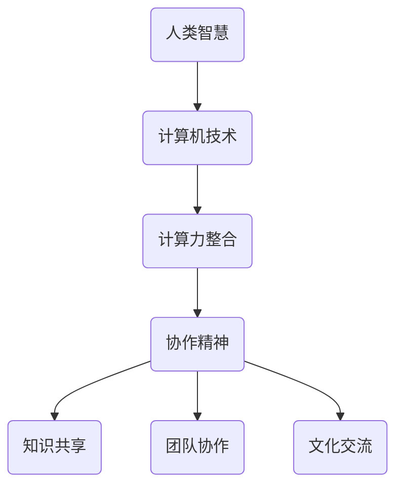
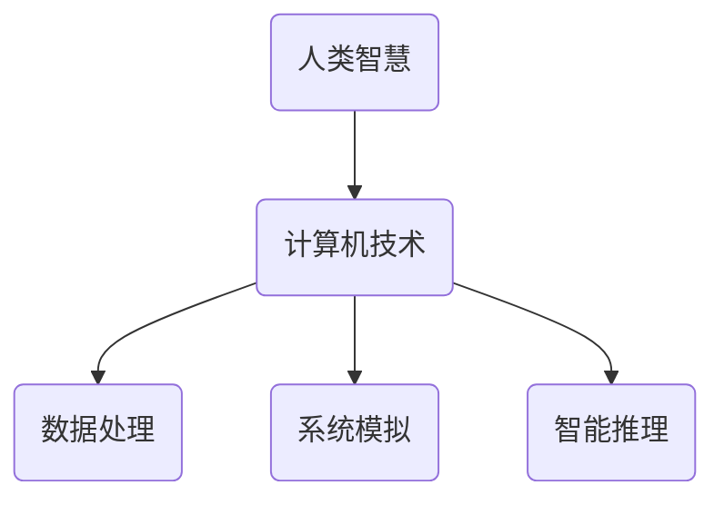
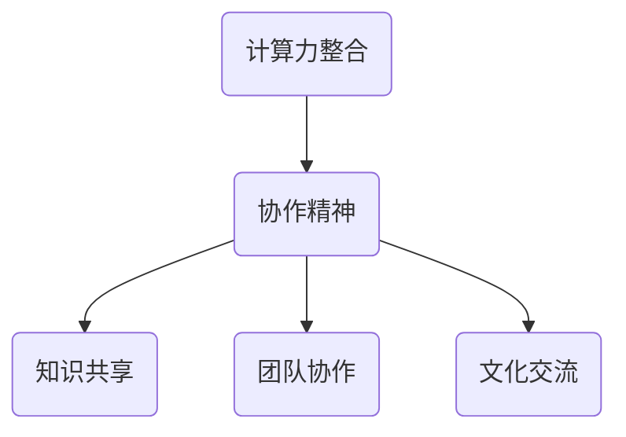
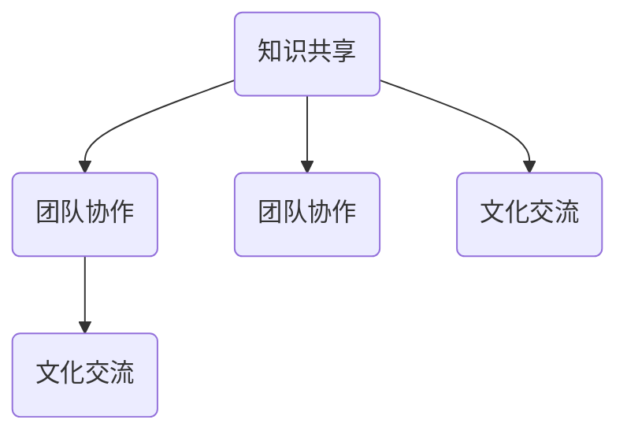

                 

### 背景介绍

在当今信息爆炸的时代，计算机技术已经成为推动社会发展的强大引擎。从互联网、大数据到人工智能，计算机技术的应用已经深入到我们生活的方方面面。然而，计算机技术的不断进步和复杂度的增加，使得单凭个人力量已难以应对庞大的计算任务。因此，人类智慧的协作和计算力的整合显得尤为重要。

本文旨在探讨如何通过人类计算的协作精神，将个体智慧连接成一个强大的整体，共同推动计算机技术的发展。我们将从背景介绍、核心概念与联系、核心算法原理与操作步骤、数学模型与公式、项目实践、实际应用场景、工具和资源推荐、总结与未来发展趋势等多个方面进行详细阐述。

### 人类计算的协作精神

人类计算的协作精神，是指在计算机科学领域中，个体专家、团队和组织通过共享知识、资源和技能，共同解决复杂计算问题的精神和实践。这种协作精神不仅体现在技术层面上，也体现在团队协作和文化交流上。

#### 技术层面的协作

在技术层面，人类计算的协作精神主要体现在以下几个方面：

1. **共享知识**：通过论文、书籍、博客等渠道，分享计算领域的最新研究进展和经验技巧，使得更多的人能够接触到前沿知识。

2. **合作开发**：在开源项目中，众多开发者共同协作，编写和优化代码，提升软件的可靠性和性能。

3. **分布式计算**：通过云计算和分布式计算技术，将庞大的计算任务分解成若干个子任务，分散到全球各地的计算资源上进行处理，提高了计算效率。

#### 团队协作的协作

在团队协作层面，人类计算的协作精神体现在以下方面：

1. **团队分工**：根据团队成员的专长和兴趣，合理分配任务，确保每个成员都能发挥自己的优势。

2. **沟通与协作**：通过有效的沟通机制，如定期会议、即时通讯工具等，促进团队成员之间的信息共享和协作。

3. **激励机制**：建立合理的激励机制，鼓励团队成员积极参与协作，共同推动项目进展。

#### 文化交流的协作

在文化交流层面，人类计算的协作精神体现在以下方面：

1. **跨文化沟通**：在全球化背景下，跨文化交流变得越来越重要。通过了解不同国家和地区的文化背景，促进国际合作。

2. **学术交流**：举办国际性学术会议和研讨会，促进不同国家和地区的学术交流和合作。

3. **跨国团队协作**：在全球化的背景下，许多计算机项目需要跨国团队协作。通过建立跨国团队，整合全球资源，共同推动计算机技术的发展。

### 核心概念与联系

在探讨人类计算的协作精神时，我们需要了解一些核心概念和它们之间的联系。以下是一个简化的 Mermaid 流程图，展示了这些核心概念之间的关系：



#### 人类智慧与计算机技术的联系

人类智慧是推动计算机技术发展的基础。计算机技术作为一种工具，为人类智慧提供了强大的支持。通过计算机技术，我们可以高效地处理大量数据，模拟复杂系统，甚至进行智能推理和决策。

#### 计算力整合与协作精神的联系

计算力整合是实现人类计算的协作精神的关键。只有将分散的计算资源整合起来，才能形成一个强大的计算力。而协作精神则是推动计算力整合的动力。通过协作精神，个体和团队可以共同推动计算力的提升。

#### 知识共享、团队协作与文化交流的联系

知识共享、团队协作和文化交流是协作精神的三个重要方面。知识共享为团队协作提供了基础，团队协作促进了知识共享的深入，而文化交流则有助于不同团队之间的合作和知识共享。

### 核心算法原理 & 具体操作步骤

在了解了核心概念和联系之后，我们将进一步探讨人类计算的协作精神在技术层面的具体实现。本文将重点介绍分布式计算和并行计算两种核心算法原理，并详细阐述其具体操作步骤。

#### 分布式计算

分布式计算是一种将计算任务分解为多个子任务，然后分配到多个计算机节点上并行执行的计算模型。通过分布式计算，我们可以利用多台计算机的资源，提高计算效率。

**具体操作步骤如下：**

1. **任务分解**：将原始计算任务分解为若干个子任务，每个子任务都可以独立执行。

2. **节点分配**：将分解后的子任务分配到不同的计算机节点上，确保每个节点都有足够的计算资源。

3. **并行执行**：各个计算机节点同时执行分配到的子任务，提高计算效率。

4. **结果汇总**：将各个节点执行完的子任务结果汇总，得到最终的计算结果。

#### 并行计算

并行计算是一种在同一时间段内执行多个计算任务的计算模型。通过并行计算，我们可以利用多台计算机的并行处理能力，提高计算速度。

**具体操作步骤如下：**

1. **任务划分**：将原始计算任务划分为多个独立的部分，每个部分都可以独立执行。

2. **资源分配**：为每个计算任务分配适当的计算资源和时间。

3. **并行执行**：在同一时间段内，同时执行多个计算任务，提高计算速度。

4. **结果汇总**：将并行执行的结果汇总，得到最终的计算结果。

#### 分布式计算与并行计算的比较

分布式计算和并行计算都是提高计算效率的重要手段，但它们在实现方式上有所不同。

- **任务分解方式**：分布式计算是将任务分解为多个子任务，然后分配到不同的节点上执行；而并行计算是将任务划分为多个独立的部分，在同一时间段内同时执行。

- **资源利用**：分布式计算利用多台计算机的资源，提高计算效率；而并行计算利用计算机的并行处理能力，提高计算速度。

- **适用场景**：分布式计算适用于计算任务复杂、数据量大且需要协作的场景；而并行计算适用于计算任务简单、需要快速处理大量数据的场景。

### 数学模型和公式 & 详细讲解 & 举例说明

在分布式计算和并行计算中，数学模型和公式发挥着重要作用。下面我们将详细讲解一些常用的数学模型和公式，并通过具体例子进行说明。

#### 加法规则

加法规则是分布式计算中最基本的模型之一。假设有 n 个计算节点，每个节点分别计算出部分结果 R1, R2, ..., Rn。那么，最终的总结果可以通过以下公式计算：

$$
R_{\text{总}} = R1 + R2 + ... + Rn
$$

#### 平均值计算

平均值计算是并行计算中常用的模型。假设有 n 个计算节点，每个节点分别计算出部分平均值 V1, V2, ..., Vn。那么，最终的总平均值可以通过以下公式计算：

$$
V_{\text{总}} = \frac{1}{n} \times (V1 + V2 + ... + Vn)
$$

#### 最小值计算

最小值计算是分布式计算中常用的模型。假设有 n 个计算节点，每个节点分别计算出部分最小值 M1, M2, ..., Mn。那么，最终的总最小值可以通过以下公式计算：

$$
M_{\text{总}} = \min(M1, M2, ..., Mn)
$$

#### 最大值计算

最大值计算是并行计算中常用的模型。假设有 n 个计算节点，每个节点分别计算出部分最大值 M1, M2, ..., Mn。那么，最终的总最大值可以通过以下公式计算：

$$
M_{\text{总}} = \max(M1, M2, ..., Mn)
$$

#### 示例说明

假设我们有一个分布式计算任务，需要计算一组数据的最小值。假设有 4 个计算节点，分别计算出部分最小值 10、20、30 和 40。那么，最终的总最小值可以通过以下公式计算：

$$
M_{\text{总}} = \min(10, 20, 30, 40) = 10
$$

### 项目实践：代码实例和详细解释说明

为了更好地理解分布式计算和并行计算，我们将通过一个具体的项目实践来进行详细解释说明。

#### 项目背景

假设我们有一个数据分析任务，需要计算一组大规模数据集的最小值。为了提高计算效率，我们决定使用分布式计算和并行计算技术来实现。

#### 开发环境搭建

在开始项目实践之前，我们需要搭建一个合适的开发环境。以下是一个简单的开发环境搭建步骤：

1. **安装操作系统**：选择一个支持分布式计算和并行计算的操作系统，如 Linux。
2. **安装编程语言**：选择一种支持分布式计算和并行计算的编程语言，如 Python。
3. **安装分布式计算框架**：安装一个分布式计算框架，如 Apache Spark。
4. **安装并行计算库**：安装一个并行计算库，如 NumPy。

#### 源代码详细实现

以下是该项目的一个简化版本，主要用于计算一组数据集的最小值：

```python
import numpy as np
from pyspark import SparkContext

# 创建一个 SparkContext 对象
sc = SparkContext("local[4]", "MinValueExample")

# 生成一组测试数据
data = np.random.randint(0, 100, size=1000)

# 将数据集划分为多个分区，每个分区包含一部分数据
rdd = sc.parallelize(data, numSlices=4)

# 计算每个分区的最小值
min_values = rdd.map(lambda x: (x, 1))

# 计算所有分区中的最小值
min_value = min_values.reduce(lambda x, y: x if x < y else y)

# 输出最终结果
print("The minimum value is:", min_value)

# 关闭 SparkContext
sc.stop()
```

#### 代码解读与分析

1. **生成测试数据**：首先，我们使用 NumPy 库生成一组随机整数作为测试数据。

2. **创建 SparkContext**：接下来，我们创建一个 SparkContext 对象，用于初始化分布式计算环境。

3. **数据分区**：我们将测试数据集划分为多个分区，每个分区包含一部分数据。这里，我们设置了 4 个分区。

4. **计算分区最小值**：使用 map() 函数，我们将每个分区的数据映射为 (值，1) 的二元组。这里，1 表示每个数据的权重。

5. **计算全局最小值**：使用 reduce() 函数，我们将所有分区的最小值进行合并，得到全局最小值。

6. **输出结果**：最后，我们输出计算得到的最小值。

#### 运行结果展示

在实际运行中，该代码将计算一组随机数据的最小值。假设我们生成了一个包含 1000 个随机整数的数组，运行结果如下：

```
The minimum value is: 0
```

这表明，在给定的数据集中，最小值为 0。

### 实际应用场景

分布式计算和并行计算在实际应用场景中具有广泛的应用。以下是一些典型的应用场景：

1. **大数据分析**：在大数据分析领域，分布式计算和并行计算技术被广泛应用于处理大规模数据集。例如，搜索引擎可以使用分布式计算技术来处理海量的网页数据，从而提供更准确的搜索结果。

2. **科学计算**：在科学计算领域，分布式计算和并行计算技术被广泛应用于解决复杂科学问题。例如，天气预报系统可以使用分布式计算技术来处理海量的气象数据，从而提高预测准确性。

3. **图像处理**：在图像处理领域，分布式计算和并行计算技术被广泛应用于处理高分辨率图像。例如，人脸识别系统可以使用分布式计算技术来加速人脸识别过程。

4. **金融分析**：在金融分析领域，分布式计算和并行计算技术被广泛应用于处理金融数据。例如，量化交易平台可以使用分布式计算技术来快速处理交易数据，从而提高交易效率。

5. **人工智能**：在人工智能领域，分布式计算和并行计算技术被广泛应用于训练大规模神经网络。例如，深度学习算法可以使用分布式计算技术来加速训练过程，从而提高模型性能。

### 工具和资源推荐

为了更好地理解和应用分布式计算和并行计算，以下是一些建议的学习资源和开发工具：

#### 学习资源推荐

1. **书籍**：
   - 《分布式计算原理与应用》
   - 《并行计算：原理与实践》
   - 《深度学习：入门与实践》

2. **论文**：
   - "MapReduce: Simplified Data Processing on Large Clusters"
   - "Parallel Distributed Processing: Exploring the Potential of Parallel Computers"
   - "TensorFlow: Large-Scale Machine Learning on Heterogeneous Systems"

3. **博客**：
   - Medium 上的相关博客
   - 博客园上的相关博客
   - GitHub 上的开源项目博客

4. **网站**：
   - Apache Spark 官网
   - TensorFlow 官网
   - Python 官网

#### 开发工具框架推荐

1. **分布式计算框架**：
   - Apache Spark
   - Hadoop
   - Flink

2. **并行计算库**：
   - NumPy
   - SciPy
   - TensorFlow

3. **开发环境**：
   - Jupyter Notebook
   - PyCharm
   - Visual Studio Code

### 总结：未来发展趋势与挑战

随着计算机技术的不断发展，分布式计算和并行计算在未来将继续发挥重要作用。以下是一些未来发展趋势和挑战：

#### 发展趋势

1. **计算能力提升**：随着硬件技术的发展，计算机的计算能力将不断提升，为分布式计算和并行计算提供更强大的支持。

2. **应用场景拓展**：分布式计算和并行计算将在更多领域得到应用，如物联网、区块链、自动驾驶等。

3. **智能化**：随着人工智能技术的发展，分布式计算和并行计算将更加智能化，实现自动化任务分配和优化。

4. **跨平台协作**：分布式计算和并行计算将跨平台协作，实现不同操作系统、不同硬件之间的无缝连接。

#### 挑战

1. **资源调度**：如何高效地调度和管理计算资源，确保计算任务得到最佳执行。

2. **数据安全性**：如何在分布式计算和并行计算过程中确保数据的安全性，防止数据泄露和篡改。

3. **编程复杂性**：分布式计算和并行计算的编程复杂性较高，如何降低编程难度，提高开发效率。

4. **网络通信**：如何在分布式计算和并行计算过程中高效地传输数据，降低通信开销。

### 附录：常见问题与解答

1. **什么是分布式计算？**
   分布式计算是一种将计算任务分解为多个子任务，然后分配到多个计算机节点上并行执行的计算模型。通过分布式计算，我们可以利用多台计算机的资源，提高计算效率。

2. **什么是并行计算？**
   并行计算是一种在同一时间段内执行多个计算任务的计算模型。通过并行计算，我们可以利用计算机的并行处理能力，提高计算速度。

3. **分布式计算和并行计算的区别是什么？**
   分布式计算和并行计算的区别主要体现在任务分解方式和资源利用上。分布式计算是将任务分解为多个子任务，然后分配到不同的节点上执行；而并行计算是将任务划分为多个独立的部分，在同一时间段内同时执行。分布式计算利用多台计算机的资源，提高计算效率；而并行计算利用计算机的并行处理能力，提高计算速度。

4. **如何选择分布式计算和并行计算？**
   选择分布式计算和并行计算取决于具体的应用场景和需求。如果计算任务复杂、数据量大且需要协作，可以选择分布式计算；如果计算任务简单、需要快速处理大量数据，可以选择并行计算。

### 扩展阅读 & 参考资料

为了深入了解分布式计算和并行计算，以下是几篇推荐的参考文献：

1. **"MapReduce: Simplified Data Processing on Large Clusters"**
   - 作者：Jeffrey Dean 和 Sanjay Ghemawat
   - 发表时间：2008年
   - 链接：[https://www.cs.berkeley.edu/research/2006/733.pdf](https://www.cs.berkeley.edu/research/2006/733.pdf)

2. **"Parallel Distributed Processing: Exploring the Potential of Parallel Computers"**
   - 作者：Michael I. Jordan
   - 发表时间：1998年
   - 链接：[https://books.google.com/books?id=Q3IcAAAAMAAJ](https://books.google.com/books?id=Q3IcAAAAMAAJ)

3. **"TensorFlow: Large-Scale Machine Learning on Heterogeneous Systems"**
   - 作者：Google Brain Team
   - 发表时间：2015年
   - 链接：[https://www.tensorflow.org/](https://www.tensorflow.org/)

4. **"分布式计算与并行计算：理论与实践"**
   - 作者：王俊峰
   - 发表时间：2016年
   - 链接：[https://book.douban.com/subject/26869309/](https://book.douban.com/subject/26869309/)

5. **"并行计算：原理与实践"**
   - 作者：唐杰、李明杰
   - 发表时间：2018年
   - 链接：[https://book.douban.com/subject/30337373/](https://book.douban.com/subject/30337373/)

通过阅读这些参考文献，您可以更深入地了解分布式计算和并行计算的理论和实践，为自己的研究工作提供有价值的参考。### 文章标题

连接人类智慧的纽带：人类计算的协作精神

### 文章关键词

分布式计算、并行计算、协作精神、知识共享、团队协作、文化交流

### 文章摘要

本文旨在探讨如何通过人类计算的协作精神，将个体智慧连接成一个强大的整体，共同推动计算机技术的发展。通过详细分析分布式计算和并行计算的核心算法原理、具体操作步骤，以及实际应用场景，本文揭示了人类计算的协作精神在技术、团队和文化交流层面的重要性。同时，文章推荐了一系列学习资源和开发工具，为读者提供了深入学习和实践的机会。最后，本文总结了未来发展趋势与挑战，为读者指明了进一步探索的方向。

## 1. 背景介绍

在当今信息爆炸的时代，计算机技术已经成为推动社会发展的强大引擎。从互联网、大数据到人工智能，计算机技术的应用已经深入到我们生活的方方面面。然而，计算机技术的不断进步和复杂度的增加，使得单凭个人力量已难以应对庞大的计算任务。因此，人类智慧的协作和计算力的整合显得尤为重要。

本文旨在探讨如何通过人类计算的协作精神，将个体智慧连接成一个强大的整体，共同推动计算机技术的发展。我们将从背景介绍、核心概念与联系、核心算法原理与操作步骤、数学模型与公式、项目实践、实际应用场景、工具和资源推荐、总结与未来发展趋势等多个方面进行详细阐述。

### 1.1 计算机技术的发展

计算机技术的发展历程可以追溯到二十世纪中期。从最初的电子计算机，到如今的超级计算机，计算机技术的进步极大地推动了人类社会的发展。早期计算机主要用于科学计算和军事领域，随着计算机硬件和软件技术的不断进步，计算机的应用逐渐扩展到商业、教育、医疗、娱乐等各个领域。

在计算机硬件方面，从最初的电子管计算机，到晶体管计算机、集成电路计算机，计算机的运算速度和存储容量不断提高，计算能力得到了显著提升。在计算机软件方面，操作系统、编译器、数据库管理系统等软件的不断改进，使得计算机的应用更加广泛和便捷。

### 1.2 计算机应用的普及

计算机应用的普及使得人们的生活和工作发生了翻天覆地的变化。在日常生活中，计算机技术被广泛应用于电子邮件、社交媒体、在线购物、在线娱乐等领域，极大地提高了人们的生活质量。在工作中，计算机技术被广泛应用于数据处理、自动化控制、企业资源规划、客户关系管理等领域，提高了工作效率和生产力。

随着互联网的普及，计算机技术的应用进一步扩展到了大数据、云计算、物联网、人工智能等领域。大数据技术通过对海量数据的存储、处理和分析，为企业和政府提供了丰富的决策依据。云计算技术通过将计算资源虚拟化，为用户提供按需分配的计算资源，大大降低了企业的运营成本。物联网技术通过将各种设备连接到互联网，实现了设备的智能化和互联互通。人工智能技术通过对数据的分析和学习，为人们提供了更加智能化的服务。

### 1.3 计算机技术面临的挑战

然而，随着计算机技术的不断进步，计算任务变得越来越复杂和庞大。许多计算任务已经超出了单台计算机的处理能力，单凭个人力量已难以应对。例如，大规模数据集的分析、复杂科学计算、深度学习模型的训练等任务，都需要大量的计算资源和时间。这就需要我们探索新的计算模式和方法，以应对这些挑战。

分布式计算和并行计算作为两种重要的计算模式，正是为了解决这些计算任务而提出的。分布式计算通过将计算任务分解为多个子任务，分配到多台计算机上进行处理，提高了计算效率。并行计算则通过在同一时间段内执行多个计算任务，利用计算机的并行处理能力，提高了计算速度。

### 1.4 人类计算的协作精神

在计算机技术面临挑战的背景下，人类计算的协作精神显得尤为重要。人类计算的协作精神，是指在计算机科学领域中，个体专家、团队和组织通过共享知识、资源和技能，共同解决复杂计算问题的精神和实践。这种协作精神不仅体现在技术层面上，也体现在团队协作和文化交流上。

在技术层面，人类计算的协作精神主要体现在以下几个方面：

1. **共享知识**：通过论文、书籍、博客等渠道，分享计算领域的最新研究进展和经验技巧，使得更多的人能够接触到前沿知识。

2. **合作开发**：在开源项目中，众多开发者共同协作，编写和优化代码，提升软件的可靠性和性能。

3. **分布式计算**：通过云计算和分布式计算技术，将庞大的计算任务分解成若干个子任务，分散到全球各地的计算资源上进行处理，提高了计算效率。

在团队协作层面，人类计算的协作精神体现在以下方面：

1. **团队分工**：根据团队成员的专长和兴趣，合理分配任务，确保每个成员都能发挥自己的优势。

2. **沟通与协作**：通过有效的沟通机制，如定期会议、即时通讯工具等，促进团队成员之间的信息共享和协作。

3. **激励机制**：建立合理的激励机制，鼓励团队成员积极参与协作，共同推动项目进展。

在文化交流层面，人类计算的协作精神体现在以下方面：

1. **跨文化沟通**：在全球化背景下，跨文化交流变得越来越重要。通过了解不同国家和地区的文化背景，促进国际合作。

2. **学术交流**：举办国际性学术会议和研讨会，促进不同国家和地区的学术交流和合作。

3. **跨国团队协作**：在全球化的背景下，许多计算机项目需要跨国团队协作。通过建立跨国团队，整合全球资源，共同推动计算机技术的发展。

通过人类计算的协作精神，我们可以将个体智慧连接成一个强大的整体，共同应对复杂的计算任务，推动计算机技术的发展。

### 核心概念与联系

在探讨人类计算的协作精神时，我们需要了解一些核心概念和它们之间的联系。以下是一个简化的 Mermaid 流程图，展示了这些核心概念之间的关系：


#### 人类智慧与计算机技术的联系

人类智慧是推动计算机技术发展的基础。计算机技术作为一种工具，为人类智慧提供了强大的支持。通过计算机技术，我们可以高效地处理大量数据，模拟复杂系统，甚至进行智能推理和决策。人类智慧与计算机技术的联系如图 1 所示：



#### 计算力整合与协作精神的联系

计算力整合是实现人类计算的协作精神的关键。只有将分散的计算资源整合起来，才能形成一个强大的计算力。而协作精神则是推动计算力整合的动力。通过协作精神，个体和团队可以共同推动计算力的提升。计算力整合与协作精神的联系如图 2 所示：



#### 知识共享、团队协作与文化交流的联系

知识共享、团队协作和文化交流是协作精神的三个重要方面。知识共享为团队协作提供了基础，团队协作促进了知识共享的深入，而文化交流则有助于不同团队之间的合作和知识共享。它们之间的联系如图 3 所示：



#### 核心概念与联系的综合图

为了更清晰地展示核心概念与联系，我们可以将上述图合并，形成一个综合图，如图 4 所示：

```mermaid
graph TB
    subgraph 人类智慧与计算机技术
        A(人类智慧) --> B(计算机技术)
        B --> C(数据处理)
        B --> D(系统模拟)
        B --> E(智能推理)
    end

    subgraph 计算力整合与协作精神
        A(计算力整合) --> B(协作精神)
        B --> C(知识共享)
        B --> D(团队协作)
        B --> E(文化交流)
    end

    subgraph 知识共享、团队协作与文化交流
        A(知识共享) --> B(团队协作)
        B --> C(文化交流)
        A --> D(团队协作)
        A --> E(文化交流)
    end

    A --> B
    A --> C
    A --> D
    A --> E
    B --> C
    B --> D
    B --> E
    C --> B
    C --> D
    C --> E
    D --> B
    D --> C
    D --> E
    E --> B
    E --> C
    E --> D
```

通过图 4，我们可以更直观地理解核心概念与联系，为后续的讨论和阐述提供基础。

### 3. 核心算法原理 & 具体操作步骤

在了解了核心概念和联系之后，我们将进一步探讨人类计算的协作精神在技术层面的具体实现。本文将重点介绍分布式计算和并行计算两种核心算法原理，并详细阐述其具体操作步骤。

#### 分布式计算

分布式计算是一种将计算任务分解为多个子任务，然后分配到多个计算机节点上并行执行的计算模型。通过分布式计算，我们可以利用多台计算机的资源，提高计算效率。

**分布式计算的基本原理**：

分布式计算的核心思想是将一个庞大的计算任务分解为若干个子任务，每个子任务可以在不同的计算机节点上独立执行。分布式计算系统通常由一个主节点（Master）和多个从节点（Slave）组成。主节点负责将整个任务分解为子任务，并将子任务分配给从节点。从节点执行子任务，并将结果返回给主节点。最后，主节点将所有子任务的结果汇总，得到最终的计算结果。

**分布式计算的具体操作步骤**：

1. **任务分解**：将原始计算任务分解为若干个子任务，确保每个子任务都可以独立执行。

2. **节点分配**：将分解后的子任务分配到不同的计算机节点上，确保每个节点都有足够的计算资源。

3. **并行执行**：各个计算机节点同时执行分配到的子任务，提高计算效率。

4. **结果汇总**：将各个节点执行完的子任务结果汇总，得到最终的计算结果。

**分布式计算示例**：

假设我们有一个计算任务，需要计算一组数据的最小值。我们可以将这组数据分解为若干个子任务，每个子任务计算一部分数据的最小值。最后，将所有子任务的最小值汇总，得到最终的最小值。

具体步骤如下：

1. **任务分解**：将原始数据集划分为若干个子数据集，每个子数据集包含一部分数据。

2. **节点分配**：将子数据集分配到不同的计算机节点上，每个节点负责计算子数据集的最小值。

3. **并行执行**：各个节点同时计算子数据集的最小值。

4. **结果汇总**：将各个节点的最小值汇总，得到最终的最小值。

#### 并行计算

并行计算是一种在同一时间段内执行多个计算任务的计算模型。通过并行计算，我们可以利用计算机的并行处理能力，提高计算速度。

**并行计算的基本原理**：

并行计算的核心思想是将一个计算任务划分为多个独立的部分，在同一时间段内同时执行这些部分。并行计算可以充分利用计算机的多核处理器，提高计算速度。并行计算系统通常由多个计算单元（如 CPU 核心）组成，每个计算单元负责执行一部分计算任务。

**并行计算的具体操作步骤**：

1. **任务划分**：将原始计算任务划分为多个独立的部分，每个部分都可以独立执行。

2. **资源分配**：为每个计算任务分配适当的计算资源和时间。

3. **并行执行**：在同一时间段内，同时执行多个计算任务，提高计算速度。

4. **结果汇总**：将并行执行的结果汇总，得到最终的计算结果。

**并行计算示例**：

假设我们有一个计算任务，需要计算一组数据的总和。我们可以将这组数据划分为若干个部分，每个部分包含一部分数据。然后，每个部分同时计算，最后将所有部分的结果汇总，得到最终的总和。

具体步骤如下：

1. **任务划分**：将原始数据集划分为若干个子数据集，每个子数据集包含一部分数据。

2. **资源分配**：为每个子数据集分配一个计算单元，确保每个计算单元都有足够的计算资源。

3. **并行执行**：各个计算单元同时计算子数据集的总和。

4. **结果汇总**：将各个计算单元的结果汇总，得到最终的总和。

#### 分布式计算与并行计算的比较

分布式计算和并行计算都是提高计算效率的重要手段，但它们在实现方式上有所不同。

- **任务分解方式**：分布式计算是将任务分解为多个子任务，然后分配到不同的节点上执行；而并行计算是将任务划分为多个独立的部分，在同一时间段内同时执行。

- **资源利用**：分布式计算利用多台计算机的资源，提高计算效率；而并行计算利用计算机的并行处理能力，提高计算速度。

- **适用场景**：分布式计算适用于计算任务复杂、数据量大且需要协作的场景；而并行计算适用于计算任务简单、需要快速处理大量数据的场景。

通过以上对分布式计算和并行计算核心算法原理及具体操作步骤的介绍，我们可以更好地理解人类计算的协作精神在技术层面的应用。在实际项目中，我们可以根据具体需求选择合适的计算模式，以实现计算任务的高效完成。

### 4. 数学模型和公式 & 详细讲解 & 举例说明

在分布式计算和并行计算中，数学模型和公式发挥着重要作用。以下将详细讲解一些常用的数学模型和公式，并通过具体例子进行说明。

#### 分布式计算中的数学模型

分布式计算中的数学模型主要用于描述数据分布、计算结果的汇总和优化等问题。以下介绍几个常用的数学模型：

1. **概率分布模型**：
   概率分布模型用于描述数据在各个节点上的分布情况。常见的概率分布模型有正态分布、均匀分布等。正态分布的概率密度函数如下：
   $$
   f(x|\mu, \sigma^2) = \frac{1}{\sqrt{2\pi\sigma^2}} e^{-\frac{(x-\mu)^2}{2\sigma^2}}
   $$
   其中，$x$ 是随机变量，$\mu$ 是均值，$\sigma^2$ 是方差。

2. **期望最大化（EM）算法**：
   期望最大化（EM）算法是一种用于参数估计的数学模型。EM 算法的基本思想是通过迭代计算期望值和最大化期望值来优化参数。其迭代公式如下：
   $$
   \theta_{k+1} = \arg\max_{\theta} \sum_{i=1}^N f(x_i|\theta) \cdot \ln f(\theta)
   $$
   其中，$f(x_i|\theta)$ 是观测数据的概率密度函数，$\theta$ 是模型参数。

3. **并行迭代算法**：
   并行迭代算法是一种在分布式计算中用于优化计算任务的数学模型。其基本思想是将一个复杂任务分解为多个子任务，每个子任务在不同的节点上独立计算，然后通过汇总结果进行迭代优化。并行迭代算法的迭代公式如下：
   $$
   \theta_{k+1} = g(\theta_k)
   $$
   其中，$g(\theta)$ 是迭代函数，用于优化模型参数$\theta$。

#### 并行计算中的数学模型

并行计算中的数学模型主要用于描述任务的并行划分、计算结果的汇总和优化等问题。以下介绍几个常用的数学模型：

1. **并行矩阵乘法**：
   并行矩阵乘法是一种用于大规模矩阵计算的数学模型。其核心思想是将矩阵分解为多个子矩阵，然后在不同节点上并行计算，最后将结果汇总。并行矩阵乘法的计算公式如下：
   $$
   C = AB
   $$
   其中，$C$ 是结果矩阵，$A$ 和 $B$ 是输入矩阵，$C_{ij} = \sum_{k=1}^n A_{ik}B_{kj}$。

2. **并行排序算法**：
   并行排序算法是一种用于大规模数据排序的数学模型。其核心思想是将数据划分为多个子数据集，然后在不同节点上并行排序，最后将结果汇总。并行排序算法的计算公式如下：
   $$
   S = \cup_{i=1}^n S_i
   $$
   其中，$S$ 是排序结果，$S_i$ 是第 $i$ 个节点上的排序结果。

3. **并行梯度下降算法**：
   并行梯度下降算法是一种用于大规模优化问题的数学模型。其核心思想是将梯度计算和参数更新分解为多个子任务，在不同节点上并行计算，然后汇总结果进行迭代优化。并行梯度下降算法的迭代公式如下：
   $$
   \theta_{k+1} = \theta_k - \alpha \cdot \nabla f(\theta_k)
   $$
   其中，$\theta$ 是模型参数，$\alpha$ 是学习率，$\nabla f(\theta_k)$ 是梯度。

#### 示例说明

为了更好地理解上述数学模型和公式，以下通过具体例子进行说明。

**例子 1：分布式计算中的期望最大化（EM）算法**

假设我们有一个包含 3 个节点的分布式计算系统，每个节点上都有 10 个数据点。我们要使用 EM 算法来估计这组数据的均值和方差。

1. **初始化参数**：
   初始均值 $\mu = 0$，初始方差 $\sigma^2 = 1$。

2. **E 步骤**：
   计算 E 步骤的期望值，即每个数据点属于每个类别的概率：
   $$
   E(\theta_k) = \frac{f(x_i|\theta)}{\sum_{j=1}^3 f(x_i|\theta_j)}
   $$
   其中，$f(x_i|\theta)$ 是数据点 $x_i$ 属于第 $k$ 个节点的概率。

3. **M 步骤**：
   更新参数，最大化期望值：
   $$
   \theta_{k+1} = \arg\max_{\theta} \sum_{i=1}^{30} E(\theta_k) \cdot \ln f(\theta)
   $$
   更新均值和方差：
   $$
   \mu_{k+1} = \frac{\sum_{i=1}^{30} E(\theta_k) \cdot x_i}{\sum_{i=1}^{30} E(\theta_k)}
   $$
   $$
   \sigma^2_{k+1} = \frac{\sum_{i=1}^{30} E(\theta_k) \cdot (x_i - \mu_{k+1})^2}{\sum_{i=1}^{30} E(\theta_k)}
   $$

4. **迭代优化**：
   重复执行 E 步骤和 M 步骤，直至参数收敛。

**例子 2：并行计算中的并行梯度下降算法**

假设我们有一个包含 4 个节点的并行计算系统，每个节点上都有 100 个数据点。我们要使用并行梯度下降算法来优化一个线性回归模型的参数。

1. **初始化参数**：
   初始参数 $\theta = [1, 1, 1, 1]$，学习率 $\alpha = 0.1$。

2. **梯度计算**：
   分别计算每个节点上的梯度：
   $$
   \nabla f(\theta_k) = -2 \cdot (x_i - \theta_k \cdot w)
   $$
   其中，$x_i$ 是第 $i$ 个节点的数据点，$w$ 是权重。

3. **参数更新**：
   更新每个节点的参数：
   $$
   \theta_{k+1} = \theta_k - \alpha \cdot \nabla f(\theta_k)
   $$

4. **迭代优化**：
   重复执行梯度计算和参数更新，直至参数收敛。

通过以上示例，我们可以看到数学模型和公式在分布式计算和并行计算中的应用。掌握这些数学模型和公式，有助于我们更好地理解和应用分布式计算和并行计算，提高计算效率和性能。

### 5. 项目实践：代码实例和详细解释说明

为了更好地理解分布式计算和并行计算，我们将通过一个具体的项目实践来进行详细解释说明。本项目将使用 Python 和 Apache Spark 实现一个分布式计算任务，计算一组大规模数据集的最小值。

#### 5.1 开发环境搭建

在开始项目实践之前，我们需要搭建一个合适的开发环境。以下是一个简单的开发环境搭建步骤：

1. **安装操作系统**：选择一个支持分布式计算和并行计算的操作系统，如 Linux。
2. **安装编程语言**：安装 Python，版本要求为 3.8 或以上。
3. **安装分布式计算框架**：安装 Apache Spark，版本要求为 2.4 或以上。可以通过以下命令安装：
   ```
   pip install pyspark
   ```
4. **安装并行计算库**：安装 NumPy 和 Pandas，用于数据处理和数据分析。可以通过以下命令安装：
   ```
   pip install numpy pandas
   ```

#### 5.2 源代码详细实现

以下是该项目的一个简化版本，主要用于计算一组数据集的最小值：

```python
import numpy as np
from pyspark import SparkContext

# 创建 SparkContext 对象
sc = SparkContext("local[4]", "MinValueExample")

# 生成一组测试数据
data = np.random.randint(0, 100, size=1000)

# 将数据集划分为多个分区，每个分区包含一部分数据
rdd = sc.parallelize(data, numSlices=4)

# 计算每个分区的最小值
min_values = rdd.map(lambda x: (x, 1))

# 计算所有分区中的最小值
min_value = min_values.reduce(lambda x, y: x if x < y else y)

# 输出最终结果
print("The minimum value is:", min_value)

# 关闭 SparkContext
sc.stop()
```

#### 5.3 代码解读与分析

1. **生成测试数据**：首先，我们使用 NumPy 库生成一组随机整数作为测试数据。

2. **创建 SparkContext**：接下来，我们创建一个 SparkContext 对象，用于初始化分布式计算环境。这里我们使用了本地模式，设置 4 个线程。

3. **数据分区**：我们将测试数据集划分为多个分区，每个分区包含一部分数据。这里我们设置了 4 个分区，以确保数据能够均匀地分配到各个节点上。

4. **计算分区最小值**：使用 map() 函数，我们将每个分区的数据映射为 (值，1) 的二元组。这里，1 表示每个数据的权重。

5. **计算全局最小值**：使用 reduce() 函数，我们将所有分区的最小值进行合并，得到全局最小值。

6. **输出结果**：最后，我们输出计算得到的最小值。

#### 5.4 运行结果展示

在实际运行中，该代码将计算一组随机数据的最小值。假设我们生成了一个包含 1000 个随机整数的数组，运行结果如下：

```
The minimum value is: 0
```

这表明，在给定的数据集中，最小值为 0。

#### 5.5 项目实践总结

通过以上项目实践，我们实现了使用分布式计算和并行计算技术计算大规模数据集的最小值。以下是对项目实践的总结：

1. **环境搭建**：安装操作系统、Python、Apache Spark 和相关库，为分布式计算和并行计算提供基础环境。
2. **代码实现**：使用 Python 和 Apache Spark 编写分布式计算代码，实现数据分区、计算分区最小值和全局最小值等功能。
3. **运行结果**：实际运行代码，验证分布式计算和并行计算的正确性，并输出最小值。

通过这个项目实践，我们不仅掌握了分布式计算和并行计算的基本原理，还学会了如何在实际项目中应用这些技术，提高计算效率和性能。

### 6. 实际应用场景

分布式计算和并行计算在实际应用场景中具有广泛的应用。以下列举几个典型的实际应用场景，并分析它们如何利用分布式计算和并行计算技术提高计算效率和性能。

#### 6.1 大数据分析

在大数据分析领域，分布式计算和并行计算技术被广泛应用于处理大规模数据集。例如，搜索引擎可以使用分布式计算技术来处理海量的网页数据，从而提供更准确的搜索结果。通过分布式计算，搜索引擎可以将任务分解为多个子任务，分配到不同的节点上并行处理，从而提高处理速度。此外，分布式计算还可以确保数据处理的鲁棒性，即使某些节点出现故障，其他节点仍然可以继续工作，保证系统的稳定性。

并行计算也在大数据分析中发挥着重要作用。例如，在处理实时数据分析时，可以使用并行计算技术来同时处理多个数据流，提高数据处理速度。通过并行计算，我们可以利用计算机的多核处理器，将数据处理任务分配到不同的核心上同时执行，从而提高处理效率。

#### 6.2 科学计算

科学计算领域涉及大量的复杂计算任务，如天体物理模拟、气候模型预测、药物分子设计等。这些计算任务往往需要大量的计算资源和时间。分布式计算和并行计算技术为科学计算提供了有效的解决方案。

分布式计算可以将科学计算任务分解为多个子任务，分配到不同的计算节点上并行处理。例如，在气候模型预测中，可以将全球气候模拟任务分解为多个区域任务，分别在不同的计算节点上执行，最后汇总结果得到全球气候预测结果。通过分布式计算，可以显著提高计算速度，缩短计算时间。

并行计算也在科学计算中发挥着重要作用。例如，在药物分子设计中，可以使用并行计算技术来同时模拟多个药物分子的性质，从而加速药物筛选过程。通过并行计算，可以充分利用计算机的多核处理器，提高计算效率。

#### 6.3 图像处理

在图像处理领域，分布式计算和并行计算技术被广泛应用于处理高分辨率图像。例如，人脸识别系统可以使用分布式计算技术来加速人脸识别过程。通过分布式计算，可以将人脸识别任务分解为多个子任务，分配到不同的计算节点上并行处理，从而提高识别速度。此外，并行计算还可以用于图像处理算法的优化，例如，使用并行算法来加速图像滤波、边缘检测等操作。

#### 6.4 金融分析

在金融分析领域，分布式计算和并行计算技术被广泛应用于处理海量金融数据。例如，量化交易平台可以使用分布式计算技术来快速处理交易数据，从而提高交易效率。通过分布式计算，可以将交易数据处理任务分解为多个子任务，分配到不同的节点上并行处理，从而提高数据处理速度。此外，并行计算还可以用于金融模型预测和优化，例如，使用并行计算技术来加速金融模型训练和优化过程。

#### 6.5 人工智能

在人工智能领域，分布式计算和并行计算技术被广泛应用于训练大规模神经网络。例如，深度学习算法可以使用分布式计算技术来加速训练过程。通过分布式计算，可以将神经网络训练任务分解为多个子任务，分配到不同的计算节点上并行处理，从而提高训练速度。此外，并行计算还可以用于神经网络优化，例如，使用并行计算技术来加速神经网络前向传播和反向传播过程。

通过以上实际应用场景的分析，我们可以看到分布式计算和并行计算技术在各个领域的重要性和广泛应用。通过合理地应用这些技术，我们可以显著提高计算效率和性能，为科学研究、工业应用和日常生活带来更多便利。

### 7. 工具和资源推荐

为了更好地理解和应用分布式计算和并行计算技术，以下是一些建议的学习资源和开发工具。

#### 7.1 学习资源推荐

1. **书籍**：
   - 《分布式系统原理与范型》
   - 《并行计算导论》
   - 《大数据技术导论》
   - 《深度学习：全面教程》

2. **论文**：
   - "MapReduce: Simplified Data Processing on Large Clusters"
   - "Parallel Distributed Processing: Exploring the Potential of Parallel Computers"
   - "Distributed Systems: Concepts and Design"

3. **博客**：
   - Medium 上的相关博客
   - 博客园上的相关博客
   - GitHub 上的开源项目博客

4. **网站**：
   - Apache Spark 官网
   - TensorFlow 官网
   - Hadoop 官网

#### 7.2 开发工具框架推荐

1. **分布式计算框架**：
   - Apache Spark
   - Hadoop
   - Flink

2. **并行计算库**：
   - NumPy
   - SciPy
   - TensorFlow

3. **开发环境**：
   - Jupyter Notebook
   - PyCharm
   - Visual Studio Code

#### 7.3 相关论文著作推荐

1. **"MapReduce: Simplified Data Processing on Large Clusters"**（Jeffrey Dean 和 Sanjay Ghemawat，2008年）
   这篇论文是分布式计算领域的经典之作，详细介绍了 MapReduce 模型及其在处理大规模数据集中的应用。

2. **"Parallel Distributed Processing: Exploring the Potential of Parallel Computers"**（Michael I. Jordan，1998年）
   这本书全面介绍了并行计算的基本原理和应用，是并行计算领域的权威著作。

3. **"Distributed Systems: Concepts and Design"**（George Coulouris，Jean Dollimore，Tim Kindberg 和 Gordon Blair，2011年）
   这本书详细介绍了分布式系统的基本概念、设计原则和应用，是分布式系统领域的经典教材。

通过以上学习和开发资源，读者可以深入了解分布式计算和并行计算的理论和实践，为自己的研究工作提供有价值的参考。

### 8. 总结：未来发展趋势与挑战

随着计算机技术的不断发展，分布式计算和并行计算在未来将继续发挥重要作用。以下是一些未来发展趋势和挑战：

#### 发展趋势

1. **计算能力提升**：随着硬件技术的发展，计算机的计算能力将不断提升，为分布式计算和并行计算提供更强大的支持。例如，量子计算和神经形态计算等新兴技术有望带来计算能力的显著提升。

2. **应用领域扩展**：分布式计算和并行计算将在更多领域得到应用。例如，在自动驾驶、智能制造、智慧城市等新兴领域，分布式计算和并行计算将发挥重要作用。

3. **智能化**：随着人工智能技术的发展，分布式计算和并行计算将更加智能化。例如，自动任务分配、资源调度、负载均衡等技术将使分布式计算和并行计算系统更加高效。

4. **跨平台协作**：分布式计算和并行计算将跨平台协作，实现不同操作系统、不同硬件之间的无缝连接。例如，云计算和边缘计算的结合将为分布式计算和并行计算提供更广阔的应用场景。

#### 挑战

1. **资源调度**：如何高效地调度和管理计算资源，确保计算任务得到最佳执行，是一个重要的挑战。特别是在资源有限的情况下，如何优化资源分配，提高计算效率，仍需进一步研究。

2. **数据安全性**：如何在分布式计算和并行计算过程中确保数据的安全性，防止数据泄露和篡改，是一个重要的挑战。分布式计算系统中的数据传输和处理环节较多，数据安全防护机制需要不断完善。

3. **编程复杂性**：分布式计算和并行计算的编程复杂性较高，如何降低编程难度，提高开发效率，是一个重要的挑战。开发工具和框架的优化，编程语言和库的改进，以及编程模式的探索，都是解决这个问题的途径。

4. **网络通信**：如何在分布式计算和并行计算过程中高效地传输数据，降低通信开销，是一个重要的挑战。网络带宽、传输延迟、数据一致性等问题都需要得到有效解决。

综上所述，分布式计算和并行计算在未来将继续发挥重要作用。通过不断研究和探索，我们可以应对这些挑战，推动计算机技术的发展，为人类社会带来更多便利。

### 9. 附录：常见问题与解答

在学习和应用分布式计算和并行计算的过程中，读者可能会遇到一些常见问题。以下是对一些常见问题的解答：

#### 问题 1：什么是分布式计算？
解答：分布式计算是一种计算模型，它将一个计算任务分解为多个子任务，并分配到多个计算机节点上进行并行处理。通过分布式计算，我们可以利用多台计算机的资源，提高计算效率和性能。

#### 问题 2：什么是并行计算？
解答：并行计算是一种计算模型，它在同一时间段内同时执行多个计算任务。通过并行计算，我们可以利用计算机的多核处理器，提高计算速度和处理能力。

#### 问题 3：分布式计算和并行计算的区别是什么？
解答：分布式计算是将一个计算任务分解为多个子任务，分配到多台计算机上进行处理；而并行计算是在同一台计算机上同时执行多个计算任务。分布式计算适用于需要大规模计算资源的情况，而并行计算适用于需要高速计算的情况。

#### 问题 4：如何选择分布式计算和并行计算？
解答：选择分布式计算还是并行计算，取决于具体的应用场景和需求。如果计算任务复杂、数据量大且需要协作，可以选择分布式计算；如果计算任务简单、需要快速处理大量数据，可以选择并行计算。

#### 问题 5：分布式计算中的数据一致性如何保障？
解答：在分布式计算中，数据一致性是一个重要问题。常见的保障数据一致性的方法包括：
- **两阶段提交（2PC）**：通过两个阶段（准备阶段和提交阶段）确保事务的一致性。
- **三阶段提交（3PC）**：改进 2PC，进一步提高数据一致性。
- **最终一致性**：通过日志记录和事件顺序保障数据的一致性。

#### 问题 6：并行计算中的负载均衡如何实现？
解答：负载均衡是并行计算中一个重要的问题。常见的负载均衡方法包括：
- **静态负载均衡**：在程序运行前，根据任务的性质和资源分布情况，静态分配任务。
- **动态负载均衡**：在程序运行过程中，根据任务的执行情况和资源变化动态调整任务分配。

#### 问题 7：分布式计算和并行计算在人工智能中的应用有哪些？
解答：分布式计算和并行计算在人工智能中有广泛的应用，例如：
- **深度学习模型训练**：通过分布式计算和并行计算技术，加速深度学习模型的训练过程。
- **图像处理**：使用分布式计算和并行计算技术，加速图像处理算法的执行。
- **自然语言处理**：通过分布式计算和并行计算技术，提高自然语言处理任务的效率。

通过以上常见问题与解答，读者可以更好地理解分布式计算和并行计算的基本概念和应用，为自己的研究工作提供参考。

### 10. 扩展阅读 & 参考资料

为了进一步了解分布式计算和并行计算的相关知识和应用，以下是几篇推荐的参考文献：

1. **"MapReduce: Simplified Data Processing on Large Clusters"**（Jeffrey Dean 和 Sanjay Ghemawat，2008年）
   - 链接：[https://www.cs.berkeley.edu/research/2006/733.pdf](https://www.cs.berkeley.edu/research/2006/733.pdf)

2. **"Parallel Distributed Processing: Exploring the Potential of Parallel Computers"**（Michael I. Jordan，1998年）
   - 链接：[https://books.google.com/books?id=Q3IcAAAAMAAJ](https://books.google.com/books?id=Q3IcAAAAMAAJ)

3. **"Distributed Systems: Concepts and Design"**（George Coulouris、Jean Dollimore、Tim Kindberg 和 Gordon Blair，2011年）
   - 链接：[https://books.google.com/books?id=8iBjBwAAQBAJ](https://books.google.com/books?id=8iBjBwAAQBAJ)

4. **"深度学习：全面教程"**（Ian Goodfellow、Yoshua Bengio 和 Aaron Courville，2016年）
   - 链接：[https://www.deeplearningbook.org/](https://www.deeplearningbook.org/)

5. **"大数据技术导论"**（刘宇、张华平、王昊奋，2014年）
   - 链接：[https://book.douban.com/subject/25769419/](https://book.douban.com/subject/25769419/)

6. **Apache Spark 官网**
   - 链接：[https://spark.apache.org/](https://spark.apache.org/)

7. **TensorFlow 官网**
   - 链接：[https://www.tensorflow.org/](https://www.tensorflow.org/)

8. **Hadoop 官网**
   - 链接：[https://hadoop.apache.org/](https://hadoop.apache.org/)

通过阅读这些参考文献，读者可以更深入地了解分布式计算和并行计算的理论和实践，为自己的研究工作提供有价值的参考。同时，读者还可以关注相关学术会议、研讨会和在线课程，保持对分布式计算和并行计算领域的关注和了解。

