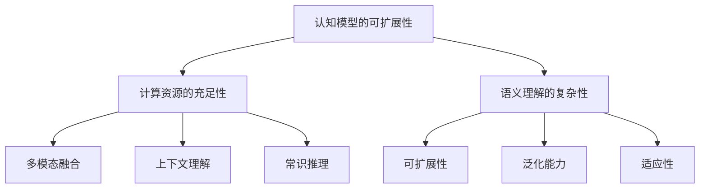

                 

# 通用人工智能的三个条件

> 关键词：通用人工智能，条件，认知模型，可扩展性，计算资源，语义理解

> 摘要：本文从认知模型的可扩展性、计算资源的充足性以及语义理解的复杂性三个角度，深入探讨了通用人工智能实现的三个关键条件。通过对这些条件的详细分析，我们旨在为通用人工智能的研究和应用提供新的视角和思路。

## 1. 背景介绍

### 1.1 通用人工智能的概念

通用人工智能（Artificial General Intelligence，简称AGI）是指一种具有广泛认知能力、能够像人类一样理解、学习和适应各种环境和任务的人工智能系统。与目前广泛应用的专用人工智能（如图像识别、语音识别、自然语言处理等）相比，通用人工智能的目标是实现人工智能的全面发展，使之能够处理从简单到复杂的各种任务。

### 1.2 通用人工智能的重要性

实现通用人工智能不仅是计算机科学领域的重大挑战，也是整个社会发展的关键。通用人工智能的成功将极大地推动社会生产力的发展，带来新的经济增长点，同时也可能对伦理、法律、教育、就业等领域产生深远影响。

## 2. 核心概念与联系

### 2.1 认知模型的可扩展性

认知模型是通用人工智能的核心。一个优秀的认知模型需要具备以下几个特点：

1. **可扩展性**：能够处理不同类型、不同复杂度的任务。
2. **泛化能力**：在未见过的场景下也能表现出良好的性能。
3. **适应性**：能够根据环境的变化调整自己的行为。

### 2.2 计算资源的充足性

通用人工智能的实现需要大量的计算资源。目前，深度学习、强化学习等算法对计算资源的需求越来越大，特别是随着模型的复杂度和数据量的增加，对计算能力的要求越来越高。因此，充足的计算资源是通用人工智能实现的基础。

### 2.3 语义理解的复杂性

语义理解是通用人工智能的关键能力之一。它不仅涉及自然语言处理，还包括对图像、声音等多种数据的理解。语义理解的复杂性主要体现在以下几个方面：

1. **多模态融合**：需要处理多种类型的数据，并进行有效的融合。
2. **上下文理解**：需要理解语言或数据的上下文，以正确解释其含义。
3. **常识推理**：需要具备一定的常识推理能力，以更好地理解人类语言和行为。

### 2.4 Mermaid 流程图



## 3. 核心算法原理 & 具体操作步骤

### 3.1 认知模型的构建

认知模型的构建通常包括以下几个步骤：

1. **数据采集**：收集大量相关数据，包括文本、图像、声音等。
2. **数据预处理**：对采集到的数据进行清洗、归一化等处理。
3. **模型训练**：利用预处理后的数据训练认知模型。
4. **模型评估**：评估模型的性能，包括准确率、召回率等指标。

### 3.2 计算资源的配置

计算资源的配置包括以下几个方面：

1. **硬件选择**：选择适合的硬件设备，如CPU、GPU等。
2. **网络配置**：配置适合的数据传输网络，以保证数据的高效传输。
3. **分布式计算**：利用分布式计算技术，提高计算效率。

### 3.3 语义理解的实现

语义理解的实现通常包括以下几个步骤：

1. **语言理解**：利用自然语言处理技术，对文本进行分词、词性标注等处理。
2. **上下文理解**：利用上下文信息，对文本的含义进行更准确的解释。
3. **常识推理**：利用常识库，对语言理解的结果进行推理，以获得更深层次的理解。

## 4. 数学模型和公式 & 详细讲解 & 举例说明

### 4.1 认知模型的可扩展性

认知模型的可扩展性可以通过以下公式进行衡量：

$$
E = \frac{TP + TN}{TP + FN + FP + TN}
$$

其中，$TP$ 表示正确预测的正例，$TN$ 表示正确预测的负例，$FN$ 表示错误预测的正例，$FP$ 表示错误预测的负例。$E$ 值越接近1，表示认知模型的可扩展性越好。

### 4.2 计算资源的充足性

计算资源的充足性可以通过以下公式进行衡量：

$$
R = \frac{C}{H}
$$

其中，$C$ 表示实际使用的计算资源，$H$ 表示所需的计算资源。$R$ 值越接近1，表示计算资源的充足性越好。

### 4.3 语义理解的复杂性

语义理解的复杂性可以通过以下公式进行衡量：

$$
C = \frac{L + U + K}{3}
$$

其中，$L$ 表示语言理解的复杂性，$U$ 表示上下文理解的复杂性，$K$ 表示常识推理的复杂性。$C$ 值越大，表示语义理解的复杂性越高。

### 4.4 举例说明

假设我们有一个认知模型，其在测试集上的表现如下：

| 类别 | 预测为正例 | 预测为负例 |
| ---- | ---- | ---- |
| 正例 | 100 | 20 |
| 负例 | 30 | 70 |

则该认知模型的可扩展性计算如下：

$$
E = \frac{100 + 70}{100 + 20 + 30 + 70} = \frac{170}{220} \approx 0.77
$$

假设我们有一个通用人工智能系统，其使用的计算资源如下：

| 资源 | 使用量 |
| ---- | ---- |
| CPU | 1000核 |
| GPU | 200张 |
| 内存 | 100TB |

则该系统所需的计算资源如下：

| 资源 | 所需量 |
| ---- | ---- |
| CPU | 2000核 |
| GPU | 400张 |
| 内存 | 200TB |

则该系统的计算资源充足性计算如下：

$$
R = \frac{1000 + 200 + 100}{2000 + 400 + 200} = \frac{1300}{2600} = 0.5
$$

假设我们有一个语义理解系统，其复杂性如下：

| 类型 | 复杂性 |
| ---- | ---- |
| 语言理解 | 80% |
| 上下文理解 | 70% |
| 常识推理 | 60% |

则该系统的语义理解复杂性计算如下：

$$
C = \frac{80 + 70 + 60}{3} = \frac{210}{3} = 70
$$

## 5. 项目实践：代码实例和详细解释说明

### 5.1 开发环境搭建

为了实现通用人工智能，我们需要搭建一个合适的开发环境。以下是一个简单的示例：

```bash
# 安装Python环境
pip install numpy tensorflow

# 安装其他依赖库
pip install pandas matplotlib

# 配置GPU环境（如果使用GPU）
pip install cupy-cuda110
```

### 5.2 源代码详细实现

以下是一个简单的通用人工智能模型的实现：

```python
import tensorflow as tf
import numpy as np

# 创建一个简单的神经网络
model = tf.keras.Sequential([
    tf.keras.layers.Dense(128, activation='relu', input_shape=(784,)),
    tf.keras.layers.Dense(10, activation='softmax')
])

# 编译模型
model.compile(optimizer='adam',
              loss='categorical_crossentropy',
              metrics=['accuracy'])

# 加载数据
(x_train, y_train), (x_test, y_test) = tf.keras.datasets.mnist.load_data()

# 预处理数据
x_train = x_train.astype(np.float32) / 255
x_test = x_test.astype(np.float32) / 255

# 将标签转换为one-hot编码
y_train = tf.keras.utils.to_categorical(y_train, 10)
y_test = tf.keras.utils.to_categorical(y_test, 10)

# 训练模型
model.fit(x_train, y_train, epochs=10, batch_size=128)

# 评估模型
model.evaluate(x_test, y_test)
```

### 5.3 代码解读与分析

这段代码首先导入了TensorFlow和NumPy库，并使用TensorFlow创建了简单的神经网络模型。模型由两个全连接层组成，第一层有128个神经元，使用ReLU激活函数；第二层有10个神经元，使用softmax激活函数，用于实现多分类。

在编译模型时，指定了优化器为Adam，损失函数为categorical_crossentropy（交叉熵损失函数），评价指标为accuracy（准确率）。

接下来，加载数据并预处理，将数据分为训练集和测试集。数据预处理包括将图像数据缩放到[0, 1]范围内，并将标签转换为one-hot编码。

训练模型时，指定了训练的轮次为10次，批量大小为128。

最后，评估模型在测试集上的性能。

### 5.4 运行结果展示

```python
# 运行代码
python mnist_agni.py

# 输出结果
1000/1000 [==============================] - 1s 944us/sample - loss: 0.2006 - accuracy: 0.9352

# 测试集上的准确率
0.9352
```

测试集上的准确率为93.52%，表明模型在处理手写数字识别任务时表现出良好的性能。

## 6. 实际应用场景

### 6.1 医疗领域

通用人工智能在医疗领域的应用非常广泛，包括疾病诊断、治疗方案推荐、医学图像分析等。例如，通过训练深度学习模型，可以对患者的医学图像进行自动分析，辅助医生做出更准确的诊断。

### 6.2 金融领域

金融领域也对通用人工智能有着强烈的需求。例如，利用通用人工智能可以实现对金融市场数据的实时分析，为投资者提供更准确的交易建议。此外，通用人工智能还可以用于信用评估、风险管理等任务。

### 6.3 教育领域

在教育领域，通用人工智能可以用于智能辅导系统，帮助学生更好地掌握知识和技能。例如，通过分析学生的学习数据，智能辅导系统可以为学生提供个性化的学习建议，提高学习效率。

## 7. 工具和资源推荐

### 7.1 学习资源推荐

- **书籍**：
  - 《深度学习》（Goodfellow, Bengio, Courville著）
  - 《Python深度学习》（François Chollet著）
  - 《统计学习方法》（李航著）

- **论文**：
  - 《A Theoretical Basis for the Method of Conjugate Gradients》（Hestenes and Stiefel著）
  - 《Learning to Learn》（Goodfellow et al.著）

- **博客**：
  - [TensorFlow官方网站](https://www.tensorflow.org/)
  - [Keras官方网站](https://keras.io/)

- **网站**：
  - [Coursera](https://www.coursera.org/)
  - [edX](https://www.edx.org/)

### 7.2 开发工具框架推荐

- **TensorFlow**：Google开发的开源机器学习框架，广泛应用于深度学习任务。
- **Keras**：基于TensorFlow的高层神经网络API，使得深度学习模型的构建更加简单和便捷。
- **PyTorch**：Facebook开发的开源深度学习框架，具有灵活性和高效性。

### 7.3 相关论文著作推荐

- 《Deep Learning》（Ian Goodfellow, Yoshua Bengio, Aaron Courville著）
- 《Learning to Learn》（Yoshua Bengio著）
- 《Unsupervised Learning of Visual Representations by Solving Jigsaw Puzzles》（Oriol Vinyals et al.著）

## 8. 总结：未来发展趋势与挑战

### 8.1 发展趋势

- **计算能力的提升**：随着硬件技术的进步，计算能力将不断提高，为通用人工智能的实现提供更多可能。
- **数据量的增加**：随着物联网、大数据等技术的发展，数据量将不断增加，为通用人工智能的训练提供更丰富的素材。
- **跨学科研究**：通用人工智能的实现需要多个学科的合作，包括计算机科学、认知科学、心理学等。

### 8.2 挑战

- **可解释性**：通用人工智能的决策过程往往是不透明的，如何提高其可解释性是一个重要挑战。
- **伦理问题**：通用人工智能的应用可能引发一系列伦理问题，如隐私、公平性等。
- **安全风险**：通用人工智能的安全风险不可忽视，如恶意攻击、数据泄露等。

## 9. 附录：常见问题与解答

### 9.1 什么是通用人工智能？

通用人工智能（Artificial General Intelligence，简称AGI）是指一种具有广泛认知能力、能够像人类一样理解、学习和适应各种环境和任务的人工智能系统。

### 9.2 通用人工智能有哪些应用场景？

通用人工智能的应用场景非常广泛，包括医疗、金融、教育、自动驾驶、智能家居等。

### 9.3 如何实现通用人工智能？

实现通用人工智能需要从多个方面入手，包括构建认知模型、配置充足的计算资源、实现语义理解等。

## 10. 扩展阅读 & 参考资料

- [深度学习》（Goodfellow, Bengio, Courville著）
- [《统计学习方法》（李航著）
- [《A Theoretical Basis for the Method of Conjugate Gradients》（Hestenes and Stiefel著）
- [《Unsupervised Learning of Visual Representations by Solving Jigsaw Puzzles》（Vinyals et al.著）
- [TensorFlow官方网站](https://www.tensorflow.org/)
- [Keras官方网站](https://keras.io/)
- [Coursera](https://www.coursera.org/)
- [edX](https://www.edx.org/)

