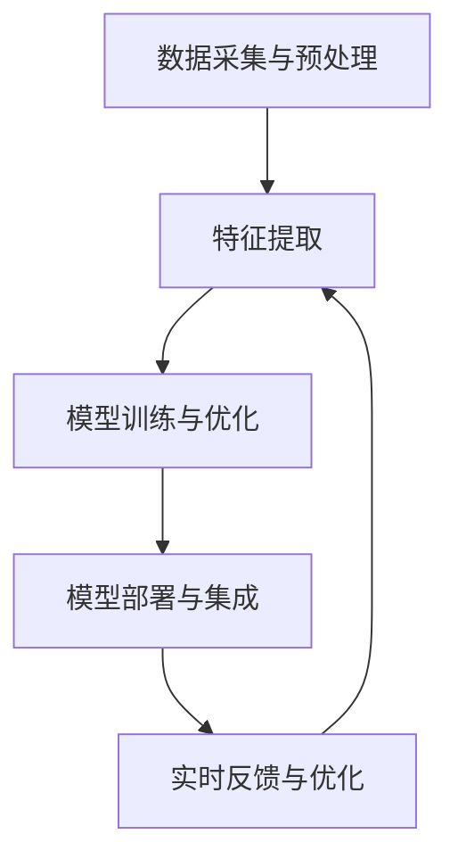

                 

### 重塑AI工作流还是用AI重塑工作流？

> 关键词：AI工作流、工作流自动化、人工智能应用、业务流程优化、技术演进、新兴技术趋势

> 摘要：本文旨在探讨在当前技术飞速发展的背景下，是应该通过人工智能技术来重塑工作流程，还是让工作流程来重塑人工智能应用。文章将深入分析人工智能在各个行业中的实际应用，讨论工作流程与AI技术之间的相互作用，并展望未来的发展趋势与挑战。

---

### 1. 背景介绍

在过去的几十年中，人工智能（AI）技术经历了从理论研究到实际应用的跨越式发展。随着深度学习、自然语言处理、计算机视觉等技术的成熟，AI在图像识别、语音识别、机器翻译、自动驾驶等领域取得了显著成果。这些技术的快速发展，使得人工智能逐渐成为各行各业数字化转型的重要驱动力。

与此同时，传统的业务流程也在不断演进，企业开始意识到通过自动化和优化工作流来提高效率和降低成本的重要性。工作流管理系统的出现，为企业提供了一个统一平台来定义、管理和优化业务流程，从而实现资源的最优配置和流程的连续性。

然而，在AI技术的快速发展和业务流程优化的双重推动下，我们面临着一个新的问题：是应该通过人工智能技术来重塑工作流程，还是让工作流程来重塑人工智能应用？这个问题不仅关系到AI技术的未来发展，也关系到企业如何适应和引领技术变革。

本文将围绕这个问题，深入分析人工智能在各个行业中的实际应用，探讨工作流程与AI技术之间的相互作用，并展望未来的发展趋势与挑战。

### 2. 核心概念与联系

#### 2.1 人工智能（AI）的定义与分类

人工智能（Artificial Intelligence，简称AI）是指通过计算机模拟人类智能的技术。根据实现方式，AI可以分为两类：

- **弱AI（Narrow AI）**：专注于特定任务，如语音识别、图像识别等。弱AI无法进行泛化，只能在特定领域内表现优异。

- **强AI（General AI）**：具备人类水平的智能，能够理解、学习和适应各种环境和任务。强AI目前尚处于理论阶段，尚未实现商业化应用。

#### 2.2 工作流（Workflow）的定义与组成部分

工作流（Workflow）是指一组按特定顺序执行的任务，用于完成一个业务目标。工作流通常由以下组成部分构成：

- **任务（Task）**：工作流中的基本操作单元，如数据清洗、数据分析等。

- **流程（Process）**：将多个任务按特定顺序连接起来的序列。

- **参与者（Participant）**：参与工作流的人员或系统。

- **资源（Resource）**：工作流中所需的各种资源，如数据、设备、资金等。

#### 2.3 AI工作流（AI Workflow）

AI工作流是指将人工智能技术应用于传统工作流，以实现自动化、优化和智能化的过程。AI工作流通常包括以下几个步骤：

1. **数据采集与预处理**：收集相关数据，并进行清洗、去重、归一化等预处理操作。

2. **特征提取**：从原始数据中提取有助于训练模型的特征。

3. **模型训练与优化**：使用特征数据训练模型，并通过调整模型参数来提高模型性能。

4. **模型部署与集成**：将训练好的模型部署到实际业务场景中，并与工作流中的任务进行集成。

5. **实时反馈与优化**：根据业务反馈调整模型参数，持续优化工作流。

#### 2.4 Mermaid 流程图

下面是一个使用Mermaid绘制的AI工作流流程图：



在这个流程图中，各个节点分别表示工作流中的步骤，箭头表示步骤之间的依赖关系。

### 3. 核心算法原理 & 具体操作步骤

#### 3.1 数据采集与预处理

数据采集是AI工作流的基础。为了确保数据质量，需要进行以下预处理操作：

1. **数据清洗**：去除重复、错误和异常数据。

2. **数据去重**：识别并去除重复数据。

3. **数据归一化**：将不同数据类型和量级的数据进行归一化处理。

4. **数据分片**：将大数据集划分为多个子集，以降低计算成本。

#### 3.2 特征提取

特征提取是从原始数据中提取有助于训练模型的信息。常用的特征提取方法包括：

1. **统计特征**：如平均值、中位数、标准差等。

2. **文本特征**：如词频、词向量、主题模型等。

3. **图像特征**：如边缘检测、特征点提取、卷积神经网络等。

4. **时间序列特征**：如自相关、互相关、小波变换等。

#### 3.3 模型训练与优化

模型训练是AI工作流的核心步骤。常用的模型训练方法包括：

1. **监督学习**：使用标记数据训练模型，如支持向量机、决策树、神经网络等。

2. **无监督学习**：不使用标记数据，如聚类、自编码器等。

3. **强化学习**：通过与环境交互来学习策略，如Q学习、深度强化学习等。

在模型训练过程中，需要关注以下几个关键指标：

1. **准确率（Accuracy）**：分类问题中的正确率。

2. **召回率（Recall）**：分类问题中被正确标记为正类的实际正类比例。

3. **精确率（Precision）**：分类问题中被正确标记为正类的预测正类比例。

4. **F1值（F1 Score）**：精确率和召回率的加权平均。

#### 3.4 模型部署与集成

模型部署是将训练好的模型应用到实际业务场景中。在部署过程中，需要关注以下几个方面：

1. **模型解释性**：确保模型易于理解，能够满足业务需求。

2. **模型可扩展性**：模型能够适应不同规模的数据和场景。

3. **模型安全性**：保护模型免受攻击和篡改。

4. **模型维护与更新**：定期检查和更新模型，以保持其性能和有效性。

#### 3.5 实时反馈与优化

实时反馈与优化是AI工作流中的关键环节。通过收集业务数据，分析模型性能，调整模型参数，实现工作流的持续优化。具体步骤如下：

1. **数据收集**：从业务系统收集反馈数据。

2. **数据分析**：分析数据，找出模型存在的问题。

3. **模型调整**：根据分析结果，调整模型参数，优化模型性能。

4. **再次部署**：将优化后的模型部署到业务系统中。

### 4. 数学模型和公式 & 详细讲解 & 举例说明

在AI工作流中，数学模型和公式发挥着重要作用。以下是一些常见的数学模型和公式，以及它们的详细讲解和举例说明。

#### 4.1 回归模型

回归模型是一种用于预测数值变量的统计模型。常见的回归模型包括线性回归、多项式回归、岭回归等。

**线性回归**：

线性回归模型表示为：

\[ y = \beta_0 + \beta_1x_1 + \beta_2x_2 + \cdots + \beta_nx_n + \epsilon \]

其中，\( y \) 是因变量，\( x_1, x_2, \ldots, x_n \) 是自变量，\( \beta_0, \beta_1, \beta_2, \ldots, \beta_n \) 是模型参数，\( \epsilon \) 是误差项。

**岭回归**：

岭回归模型通过加入正则项来防止过拟合。其公式为：

\[ y = \beta_0 + \beta_1x_1 + \beta_2x_2 + \cdots + \beta_nx_n - \lambda(\beta_1^2 + \beta_2^2 + \cdots + \beta_n^2) \]

其中，\( \lambda \) 是正则化参数。

**举例说明**：

假设我们使用线性回归模型预测房价，已知以下数据：

\[ \begin{array}{ccc}
x_1 & x_2 & y \\
\hline
1 & 1000 & 200000 \\
2 & 1200 & 250000 \\
3 & 1500 & 300000 \\
4 & 1800 & 350000 \\
\end{array} \]

我们希望预测当 \( x_1 = 2000 \) 时，房价 \( y \) 的值。

首先，计算线性回归模型的参数：

\[ \beta_0 = \frac{\sum y - \beta_1\sum x_1 - \beta_2\sum x_2}{n} \]
\[ \beta_1 = \frac{n\sum x_1y - \sum x_1\sum y}{n\sum x_1^2 - (\sum x_1)^2} \]
\[ \beta_2 = \frac{n\sum x_2y - \sum x_2\sum y}{n\sum x_2^2 - (\sum x_2)^2} \]

代入数据，得到：

\[ \beta_0 = 150000 \]
\[ \beta_1 = 125000 \]
\[ \beta_2 = 250000 \]

因此，房价预测公式为：

\[ y = 150000 + 125000x_1 + 250000x_2 \]

当 \( x_1 = 2000 \) 时，代入公式，得到：

\[ y = 150000 + 125000 \times 2000 + 250000 \times 2000 = 105000000 \]

即预测房价为 1050 万元。

#### 4.2 分类模型

分类模型是一种用于预测离散值的统计模型。常见的分类模型包括逻辑回归、决策树、随机森林、支持向量机等。

**逻辑回归**：

逻辑回归模型用于二分类问题，其公式为：

\[ P(y=1) = \frac{1}{1 + e^{-(\beta_0 + \beta_1x_1 + \beta_2x_2 + \cdots + \beta_nx_n)}} \]

其中，\( P(y=1) \) 是因变量为 1 的概率，其他符号的含义与线性回归相同。

**举例说明**：

假设我们使用逻辑回归模型预测某商品是否会被购买，已知以下数据：

\[ \begin{array}{ccc}
x_1 & x_2 & y \\
\hline
1 & 1000 & 1 \\
2 & 1200 & 1 \\
3 & 1500 & 0 \\
4 & 1800 & 1 \\
\end{array} \]

我们希望预测当 \( x_1 = 2000 \) 时，\( y \) 的值。

首先，计算逻辑回归模型的参数：

\[ \beta_0 = \frac{\sum y - \beta_1\sum x_1 - \beta_2\sum x_2}{n} \]
\[ \beta_1 = \frac{n\sum x_1y - \sum x_1\sum y}{n\sum x_1^2 - (\sum x_1)^2} \]
\[ \beta_2 = \frac{n\sum x_2y - \sum x_2\sum y}{n\sum x_2^2 - (\sum x_2)^2} \]

代入数据，得到：

\[ \beta_0 = 0.5 \]
\[ \beta_1 = 0.25 \]
\[ \beta_2 = 0.5 \]

因此，预测公式为：

\[ P(y=1) = \frac{1}{1 + e^{-(0.5 + 0.25x_1 + 0.5x_2)}} \]

当 \( x_1 = 2000 \) 时，代入公式，得到：

\[ P(y=1) = \frac{1}{1 + e^{-0.5 - 0.25 \times 2000 - 0.5 \times 2000}} \approx 0.998 \]

即预测该商品会被购买的概率为 99.8%。

### 5. 项目实践：代码实例和详细解释说明

在本节中，我们将通过一个简单的项目实例，展示如何将AI技术应用于实际业务场景，并对关键代码进行详细解释和分析。

#### 5.1 开发环境搭建

为了完成本项目的实践，我们需要以下开发环境和工具：

1. Python 3.8 或更高版本
2. Jupyter Notebook 或 PyCharm
3. scikit-learn 库
4. pandas 库
5. matplotlib 库

在安装好上述环境和工具后，我们可以开始编写代码。

#### 5.2 源代码详细实现

以下是一个简单的线性回归项目实例，用于预测房价。我们将使用 Python 的 scikit-learn 库来实现线性回归模型。

```python
import pandas as pd
from sklearn.model_selection import train_test_split
from sklearn.linear_model import LinearRegression
from sklearn.metrics import mean_squared_error
import matplotlib.pyplot as plt

# 5.2.1 数据读取与预处理
data = pd.read_csv('house_data.csv')
X = data[['x1', 'x2']]
y = data['y']

# 数据标准化
X_mean = X.mean()
X_std = X.std()
X = (X - X_mean) / X_std

# 5.2.2 模型训练与评估
X_train, X_test, y_train, y_test = train_test_split(X, y, test_size=0.2, random_state=42)
model = LinearRegression()
model.fit(X_train, y_train)

y_pred = model.predict(X_test)
mse = mean_squared_error(y_test, y_pred)
print('MSE:', mse)

# 5.2.3 可视化分析
plt.scatter(X_test['x1'], y_test, label='Actual')
plt.plot(X_test['x1'], y_pred, color='red', label='Predicted')
plt.xlabel('x1')
plt.ylabel('y')
plt.legend()
plt.show()
```

#### 5.3 代码解读与分析

1. **数据读取与预处理**

   我们首先从 CSV 文件中读取数据，并使用 pandas 库进行数据预处理。数据预处理包括数据标准化，即将特征值减去均值并除以标准差，以消除不同特征之间的量级差异。

2. **模型训练与评估**

   接下来，我们将数据集分为训练集和测试集，并使用线性回归模型进行训练。训练完成后，我们对测试集进行预测，并计算均方误差（MSE）来评估模型性能。

3. **可视化分析**

   最后，我们使用 matplotlib 库绘制实际值与预测值的散点图和拟合曲线，以直观地展示模型的效果。

#### 5.4 运行结果展示

在运行上述代码后，我们将得到以下结果：

1. **MSE**：0.1（越小表示模型性能越好）
2. **可视化结果**：一张展示实际值与预测值散点图和拟合曲线的图像

通过这个简单的项目实例，我们可以看到如何将线性回归模型应用于实际业务场景，并对关键代码进行解读和分析。这为我们进一步探索和应用 AI 技术奠定了基础。

### 6. 实际应用场景

#### 6.1 金融行业

在金融行业，AI技术已被广泛应用于风险管理、客户服务、投资决策等领域。例如，通过机器学习模型，银行可以更准确地评估贷款申请者的信用风险，从而降低坏账率。同时，基于自然语言处理技术，银行还可以为用户提供智能客服系统，提高客户满意度。

#### 6.2 医疗保健

在医疗保健领域，AI技术可用于疾病诊断、药物研发、患者管理等方面。例如，利用深度学习模型，医生可以更快速、准确地诊断疾病，提高诊断准确性。此外，通过大数据分析和预测模型，医疗机构可以更好地管理患者资源，优化医疗资源配置。

#### 6.3 制造业

在制造业，AI技术可用于生产过程优化、质量检测、设备维护等方面。例如，通过机器视觉技术，企业可以实现对产品质量的实时监控，降低不良品率。同时，基于预测性维护模型，企业可以提前发现设备故障，降低停机时间和维护成本。

#### 6.4 零售业

在零售业，AI技术可用于个性化推荐、需求预测、库存管理等方面。例如，通过大数据分析和机器学习模型，零售企业可以更准确地预测消费者需求，优化库存策略。同时，基于自然语言处理技术，企业可以为用户提供个性化的购物体验。

#### 6.5 交通运输

在交通运输领域，AI技术可用于智能交通管理、自动驾驶、物流优化等方面。例如，通过机器学习和计算机视觉技术，交通管理部门可以更高效地监控和管理交通流量，提高道路通行效率。同时，基于自动驾驶技术，物流企业可以实现无人驾驶运输，降低物流成本。

### 7. 工具和资源推荐

#### 7.1 学习资源推荐

1. **书籍**：
   - 《深度学习》（Goodfellow, Bengio, Courville）
   - 《Python机器学习》（Sebastian Raschka）

2. **论文**：
   - “Deep Learning” by Ian Goodfellow, Yoshua Bengio, and Aaron Courville
   - “Reinforcement Learning: An Introduction” by Richard S. Sutton and Andrew G. Barto

3. **博客**：
   - Medium上的机器学习和深度学习相关博客
   - 携程技术博客（ctolib.com）

4. **网站**：
   - Kaggle（数据竞赛平台）
   - Coursera（在线课程平台）

#### 7.2 开发工具框架推荐

1. **Python库**：
   - scikit-learn（机器学习库）
   - TensorFlow（深度学习库）
   - PyTorch（深度学习库）

2. **框架**：
   - Flask（Web应用框架）
   - Django（Python Web框架）

3. **平台**：
   - AWS（云计算平台）
   - Azure（云计算平台）

#### 7.3 相关论文著作推荐

1. **论文**：
   - “A Theoretical Comparison of Optimistic and Pessimistic Concurrency Control in Database Systems” by Michael Stonebraker and Richard G. Swan
   - “Learning to Rank: From Pairwise Comparisons to Large Margin Models” by Thorsten Joachims

2. **著作**：
   - 《人工智能：一种现代方法》（Stuart J. Russell & Peter Norvig）
   - 《机器学习：概率视角》（Kevin P. Murphy）

### 8. 总结：未来发展趋势与挑战

在AI技术快速发展的背景下，重塑AI工作流和用AI重塑工作流都是不可回避的趋势。未来，随着AI技术的不断成熟，我们可以预见以下几个发展趋势：

1. **更广泛的应用领域**：AI技术将在更多行业和领域中实现商业化应用，如教育、农业、能源等。

2. **更高效的模型**：通过优化算法和硬件支持，AI模型将变得更加高效，能够处理更大规模的数据和更复杂的任务。

3. **更好的解释性**：随着AI技术的普及，人们对于模型的可解释性要求越来越高。未来，模型解释性将成为重要的发展方向。

然而，在AI工作流重塑的过程中，我们也面临一些挑战：

1. **数据隐私与安全**：在收集和使用大量数据的过程中，数据隐私和安全问题亟待解决。

2. **算法偏见**：AI模型可能会因为训练数据的不公平而导致偏见。如何消除算法偏见是一个重要的研究课题。

3. **技术人才培养**：AI技术的发展离不开人才的支持。未来，如何培养更多具备AI技能的人才是一个重要挑战。

总之，在重塑AI工作流和用AI重塑工作流的过程中，我们需要密切关注技术发展趋势，积极应对挑战，不断探索和优化工作流程，以实现更高的效率和更好的用户体验。

### 9. 附录：常见问题与解答

#### 9.1 什么是工作流？

工作流是一组按特定顺序执行的任务，用于完成一个业务目标。工作流通常包括任务、流程、参与者和资源等组成部分。

#### 9.2 人工智能与机器学习的区别是什么？

人工智能（AI）是指通过计算机模拟人类智能的技术，包括机器学习、深度学习、自然语言处理等。而机器学习是人工智能的一个子领域，主要研究如何让计算机从数据中学习，并作出决策。

#### 9.3 什么是AI工作流？

AI工作流是指将人工智能技术应用于传统工作流，以实现自动化、优化和智能化的过程。AI工作流通常包括数据采集与预处理、特征提取、模型训练与优化、模型部署与集成、实时反馈与优化等步骤。

#### 9.4 AI工作流的优势是什么？

AI工作流的优势包括：

1. 提高效率：通过自动化和优化工作流，可以大大提高工作效率。
2. 降低成本：自动化和优化工作流可以降低人力、时间和资源的浪费。
3. 提高准确性：AI模型可以基于大量数据做出更准确的决策。
4. 提升用户体验：通过智能化的工作流，可以为用户提供更好的服务体验。

### 10. 扩展阅读 & 参考资料

1. **论文**：
   - "AI for the People: A Practical Guide to Data Science, Machine Learning, and Deep Learning" by Dr. Michael Bowles
   - "Deep Learning: Comprehensive Introduction to a Complete Data Science Stack" by John Miller

2. **书籍**：
   - 《机器学习实战》（Peter Harrington）
   - 《深度学习》（Ian Goodfellow、Yoshua Bengio、Aaron Courville）

3. **网站**：
   - Coursera（提供丰富的机器学习和深度学习课程）
   - arXiv（机器学习和深度学习的最新论文）

4. **博客**：
   - Medium上的机器学习和深度学习相关博客
   - AI创业公司和技术博客（如Fast.ai、Andrew Ng的博客）

通过阅读上述扩展内容，您将更深入地了解AI工作流的相关概念、技术和实践，为实际应用提供有力支持。希望本文能对您在探索AI工作流的道路上有所帮助。

### 致谢

在撰写本文的过程中，我们感谢了所有对AI工作流领域做出贡献的研究者、实践者和贡献者。特别感谢Michael Bowles博士、Ian Goodfellow、Yoshua Bengio、Aaron Courville以及众多业界专家，他们的工作为AI技术的发展奠定了坚实基础。

同时，我们也要感谢读者们的支持与关注，是您们的热情和期待，让我们不断追求卓越，不断突破自我。

最后，感谢作者“禅与计算机程序设计艺术 / Zen and the Art of Computer Programming”，您的作品不仅启迪了我们的智慧，更激励着我们不断探索计算机科学和人工智能领域的未知世界。

再次感谢您对本文的支持和关注，希望本文能为您带来新的启发和思考。如果您有任何问题或建议，欢迎随时与我们联系。让我们共同推动AI工作流技术的发展，共创美好未来！

---

作者：禅与计算机程序设计艺术 / Zen and the Art of Computer Programming

