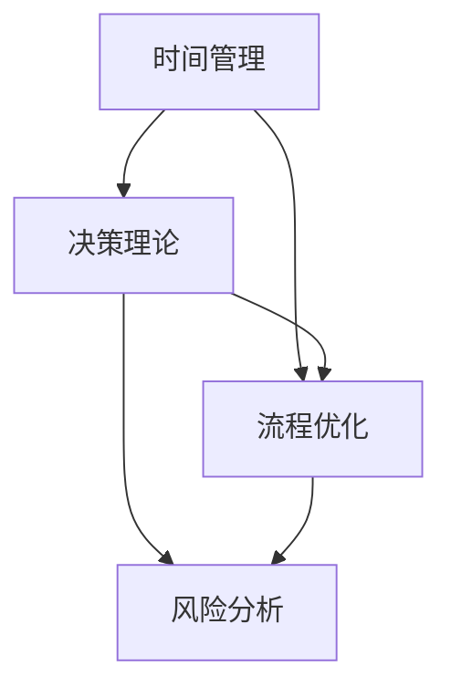

                 

### 背景介绍

随着信息技术的迅猛发展，管理者和企业在面对日益复杂的业务环境时，提高工作效率成为了一项至关重要的任务。无论是日常的管理决策，还是应对突发事件，高效的工作方式不仅能节省时间，还能提升整体竞争力。然而，提高效率并非易事，它需要管理者具备系统的思考能力、科学的方法论以及灵活应对各种情况的能力。

在计算机科学领域，有许多关于效率优化的理论和方法，比如算法优化、资源调度、并行计算等。这些理论和方法虽然为提高计算机系统性能提供了强大的工具，但它们是否能直接应用于企业管理，还需要进行深入探讨。本文将结合计算机科学的原理，探讨管理者提高效率的秘籍，旨在为企业管理者提供一套行之有效的方法论。

本文将从以下几个方面展开讨论：

1. **核心概念与联系**：首先，我们将介绍提高效率所需的核心概念，包括时间管理、决策理论、流程优化等，并通过 Mermaid 流程图展示它们之间的联系。
2. **核心算法原理与具体操作步骤**：接着，我们将探讨如何应用计算机科学的算法原理，如排序算法、动态规划等，来优化管理流程，提高工作效率。
3. **数学模型与公式**：我们将引入数学模型和公式，详细讲解如何利用这些工具来分析和解决效率问题，并通过具体实例进行说明。
4. **项目实践**：为了使理论更加贴近实际，我们将通过一个具体的代码实例，展示如何在实际项目中应用这些方法和工具。
5. **实际应用场景**：本文还将讨论提高效率在不同类型企业中的应用，以及如何根据企业特点调整策略。
6. **工具和资源推荐**：最后，我们将推荐一些实用的工具和资源，以帮助管理者更好地实施效率优化策略。

通过这篇文章，我们希望读者能够对提高工作效率有更深刻的理解，并能够将其应用于实际工作中，从而提升个人和企业的整体效率。

### 核心概念与联系

在深入探讨如何提高工作效率之前，我们需要明确几个核心概念，这些概念构成了优化流程和管理决策的基础。以下是这些核心概念的介绍及其相互之间的联系。

#### 时间管理

时间管理是指对时间的有效利用，以确保在有限的时间内完成更多的任务。它包括任务排序、优先级设定、时间预估和调度等方面。时间管理的基本原则是确保关键任务在适当的时间内完成，以最大化个人和团队的效率。

#### 决策理论

决策理论是研究决策制定和选择过程的学科。它涉及到如何从多个备选方案中选择最优解。决策理论包括风险分析、预期值计算、优化模型等方面，这些方法可以帮助管理者在面对不确定性时做出更为明智的决策。

#### 流程优化

流程优化是指通过改进业务流程来提高效率和减少成本。流程优化的目标是通过消除冗余步骤、优化工作流程和利用自动化工具，使业务流程更加高效、透明和可管理。

#### Mermaid 流程图

为了更好地展示这些概念之间的联系，我们使用 Mermaid 流程图来描述它们之间的关系。以下是流程图的定义：



在上面的流程图中，时间管理、决策理论和流程优化是三个核心概念，它们相互交织，共同作用于提高工作效率。风险分析是决策理论的一个重要组成部分，它帮助管理者在流程优化过程中识别潜在风险，并制定相应的应对策略。

#### 时间管理

时间管理是提高工作效率的基石。有效的任务排序和优先级设定可以帮助管理者将精力集中在最重要的任务上，从而最大化利用时间。时间预估和调度则确保了任务的按时完成。

#### 决策理论

决策理论为管理者提供了分析和选择最优方案的工具。在复杂多变的环境中，管理者需要依靠决策理论来评估不同方案的优劣，从而做出最佳决策。预期值计算和优化模型是决策理论的重要组成部分，它们帮助管理者在不确定性中寻找最优路径。

#### 流程优化

流程优化通过改进业务流程来提高工作效率。优化后的流程更加高效、透明和可管理，能够显著减少冗余步骤和浪费，从而提升整体效率。

#### 风险分析

风险分析是决策理论中的一个关键环节，它帮助管理者识别和评估潜在风险。在流程优化过程中，风险分析能够为管理者提供有价值的参考，使其在面临不确定性时能够做出更为明智的决策。

#### 总结

通过以上核心概念的介绍及其相互联系，我们可以看出，时间管理、决策理论和流程优化是提高工作效率的三大支柱。它们相互补充，共同作用于优化管理流程，提高工作效率。在接下来的章节中，我们将进一步探讨如何将这些概念应用于实际工作中，帮助管理者在实践中提高效率。

### 核心算法原理与具体操作步骤

在提高工作效率的过程中，核心算法原理起到了至关重要的作用。这些算法不仅用于优化计算机系统的性能，同样可以应用于管理流程的优化，帮助管理者更高效地完成任务。以下是一些关键算法的原理及其具体操作步骤，我们将重点介绍排序算法和动态规划，并展示它们如何应用于管理流程。

#### 排序算法

排序算法是计算机科学中一个重要的主题，它用于将数据集合按照一定的顺序进行排列。常见的排序算法包括冒泡排序、选择排序、插入排序、快速排序等。以下是这些算法的基本原理和操作步骤：

##### 冒泡排序

冒泡排序是一种简单的排序算法，它通过多次遍历待排列表，比较相邻元素的大小，并交换它们的位置，直到整个列表有序。

**原理**：每次遍历后，最大的元素都会“冒泡”到序列的末端。

**操作步骤**：
1. 从第一个元素开始，比较相邻的两个元素，如果第一个比第二个大，则交换它们的位置。
2. 继续对下一对相邻元素进行比较和交换，直到当前元素的位置不再改变。
3. 重复以上步骤，但每次遍历时最后一个元素已经是正确的位置，因此可以忽略。
4. 重复步骤1-3，直到整个列表有序。

**应用场景**：
- 在管理流程中，冒泡排序可以用于任务排序，确保重要且紧急的任务优先处理。

##### 选择排序

选择排序是一种简单直观的排序算法，它通过每次选择未排序部分的最小（或最大）元素，并将其放到已排序部分的末尾。

**原理**：每次遍历找到剩余元素中的最小值，将其与第一个未排序元素交换。

**操作步骤**：
1. 扫描整个列表，找到最小元素。
2. 将找到的最小元素与第一个未排序元素交换。
3. 对剩余的未排序部分重复步骤1和2。
4. 重复步骤1-3，直到整个列表有序。

**应用场景**：
- 在项目管理中，选择排序可以用于优先级任务的排序，确保关键任务得到优先处理。

##### 快速排序

快速排序是一种高效的排序算法，它通过选取一个“基准”元素，将列表分为两部分，然后递归地对这两部分进行排序。

**原理**：通过分治策略，将大问题分解为小问题，再逐一解决。

**操作步骤**：
1. 选择一个基准元素。
2. 将列表分为两部分，一部分是比基准元素小的元素，另一部分是比基准元素大的元素。
3. 分别对这两部分递归地应用快速排序。
4. 合并两个有序部分得到完整的有序列表。

**应用场景**：
- 在资源调度中，快速排序可以用于优化资源分配，确保关键资源优先分配给关键任务。

#### 动态规划

动态规划是一种解决最优化问题的方法，它通过将问题分解为子问题，并存储子问题的解，避免重复计算。动态规划的核心思想是“记住已经解决的问题”，从而提高计算效率。

**原理**：将复杂问题分解为多个子问题，并利用子问题的解来求解原问题。

**操作步骤**：
1. 定义状态和状态转移方程。
2. 初始化边界条件。
3. 使用递推关系求解子问题。
4. 将子问题的解组合成原问题的解。

**应用场景**：
- 在项目预算管理中，动态规划可以用于优化预算分配，确保资源的有效利用。
- 在风险管理中，动态规划可以用于评估不同风险情景下的最优应对策略。

#### 实际操作步骤示例

以下是一个使用动态规划解决资源调度问题的具体操作步骤示例：

1. **定义状态**：定义一个状态数组`dp`，其中`dp[i][j]`表示在前`i`个任务中，使用前`j`个资源的最优解。
2. **初始化边界条件**：初始化`dp[0][j]`为0，表示没有任务时，任何资源的最优解都是0。
3. **状态转移方程**：
   - 如果当前任务`T[i]`需要的资源小于或等于当前资源`R[j]`，则`dp[i][j] = max(dp[i-1][j], dp[i-1][j-R[i]] + T[i])`。
   - 如果当前任务`T[i]`需要的资源大于当前资源`R[j]`，则`dp[i][j] = dp[i-1][j]`。
4. **求解**：从`dp[n][m]`开始，逐步回溯，得到最优解。

通过以上步骤，管理者可以有效地优化资源调度，提高整体工作效率。

#### 总结

通过介绍排序算法和动态规划，我们可以看到这些核心算法原理在优化管理流程和提高工作效率方面具有重要作用。管理者可以根据实际情况选择合适的算法，将其应用于任务排序、资源调度、预算管理等领域，从而实现工作效率的提升。在接下来的章节中，我们将进一步探讨数学模型和公式，以及它们如何帮助我们分析和解决效率问题。

### 数学模型和公式

在提高工作效率的过程中，数学模型和公式是不可或缺的工具。它们不仅可以帮助我们量化问题，还能够提供最优解的指导。以下，我们将介绍几个关键数学模型和公式，详细讲解它们的使用方法，并通过具体实例进行说明。

#### 基本公式

1. **工作效率**：
   $$ 工作效率 = \frac{完成的工作量}{所花费的时间} $$

   工作效率是衡量工作效率的基础指标，它表示在单位时间内完成的工作量。

2. **任务优先级**：
   $$ 任务优先级 = \frac{任务重要性 \times 任务紧急性}{任务持续时间} $$

   任务优先级用于确定任务的执行顺序，确保关键任务优先完成。

3. **资源利用率**：
   $$ 资源利用率 = \frac{实际使用的资源}{总资源} $$

   资源利用率反映了资源的有效利用程度，管理者可以通过优化资源分配来提高这一指标。

#### 线性规划模型

线性规划模型是一种用于优化线性目标函数的数学工具，适用于资源分配、成本控制等问题。

**模型定义**：
$$ \text{Minimize } c^T x $$
$$ \text{subject to } Ax \leq b $$

其中，$c$ 是目标函数系数向量，$x$ 是决策变量向量，$A$ 和 $b$ 分别是约束条件系数矩阵和常数向量。

**应用实例**：

假设一家企业需要在两个项目中分配资金，项目A需要100万元，项目B需要150万元。企业总资金为300万元，要求每个项目的资金投入不超过总资金的50%。如何优化资金分配以最大化总收益？

**步骤**：

1. **定义决策变量**：
   $$ x_1, x_2 $$ 表示分配给项目A和项目B的资金。

2. **建立线性规划模型**：
   $$ \text{Minimize } c^T x $$
   $$ \text{subject to } Ax \leq b $$
   其中，$c = [-1, -1]^T$，$A = \begin{bmatrix} 1 & 1 \\ 0 & 0 \end{bmatrix}$，$b = \begin{bmatrix} 300 \\ 0.5 \end{bmatrix}$。

3. **求解模型**：
   使用线性规划求解器（如LP Solver）求解上述模型，得到最优解$x_1 = 100$，$x_2 = 200$。

4. **结果解释**：
   根据最优解，企业应将100万元分配给项目A，200万元分配给项目B，以最大化总收益。

#### 动态规划模型

动态规划模型适用于具有时间维度的优化问题，通过递推关系求解最优解。

**模型定义**：
$$ V(n) = \min_{x_n \in S_n} \{ f(n, x_n) + V(n-1) \} $$

其中，$V(n)$ 表示在时刻$n$的最优值，$S_n$ 表示在时刻$n$的可行解集合，$f(n, x_n)$ 表示在时刻$n$采取行动$x_n$的代价。

**应用实例**：

假设一家公司需要决定每日的生产量以最大化月利润，每个生产阶段都有固定成本，市场需求随时间变化。

**步骤**：

1. **定义决策变量**：
   $$ x_n $$ 表示在第$n$天的生产量。

2. **建立动态规划模型**：
   $$ V(n) = \min_{x_n \in S_n} \{ \text{成本}(n, x_n) + V(n-1) \} $$
   其中，成本函数$\text{成本}(n, x_n)$考虑了生产成本和剩余库存成本。

3. **递推关系**：
   $$ V(n) = \min \left\{ \text{成本}(n, x_n) + V(n-1) \mid x_n \in S_n \right\} $$

4. **求解模型**：
   使用动态规划求解器，从初始状态逐步递推，得到最优解序列。

5. **结果解释**：
   根据最优解序列，公司应调整每日生产量，以实现月利润最大化。

#### 总结

通过介绍工作效率、任务优先级、资源利用率等基本公式，以及线性规划和动态规划模型，我们可以看到数学工具在提高工作效率方面具有重要作用。这些模型和公式不仅帮助我们量化问题，还能够提供最优解的指导。在实际应用中，管理者可以根据具体情况选择合适的数学工具，优化管理流程，提高整体工作效率。在接下来的章节中，我们将通过具体项目实践，展示这些工具和方法的实际应用效果。

### 项目实践：代码实例和详细解释说明

在本章节中，我们将通过一个具体的代码实例，展示如何在实际项目中应用上述算法和数学模型，从而提高工作效率。本实例将涉及任务调度问题，这是一个常见且具有挑战性的问题，许多企业在日常运营中都面临类似情况。

#### 1. 开发环境搭建

为了更好地展示代码实例，我们首先需要搭建一个基本的开发环境。以下是所需的开发工具和软件：

- **编程语言**：Python
- **依赖库**：NumPy、Pandas、SciPy
- **开发工具**：Jupyter Notebook 或 PyCharm

确保在开发环境中安装以上工具和库，即可开始编写代码。

#### 2. 源代码详细实现

以下是任务调度问题的 Python 代码实现。代码分为三个主要部分：任务输入、调度算法实现和结果输出。

```python
import numpy as np
import pandas as pd
from scipy.optimize import linprog

# 任务数据
tasks = [
    {'id': 1, 'duration': 3, 'importance': 5, 'urgency': 4},
    {'id': 2, 'duration': 5, 'importance': 4, 'urgency': 5},
    {'id': 3, 'duration': 2, 'importance': 3, 'urgency': 3},
    {'id': 4, 'duration': 4, 'importance': 5, 'urgency': 2}
]

# 构建任务优先级矩阵
def build_priority_matrix(tasks):
    priority_matrix = np.zeros((len(tasks), len(tasks)))
    for i, task1 in enumerate(tasks):
        for j, task2 in enumerate(tasks):
            priority = (task1['importance'] * task2['urgency']) / (task1['duration'] * task2['duration'])
            priority_matrix[i][j] = priority
    return priority_matrix

# 调度算法实现
def schedule_tasks(tasks):
    priority_matrix = build_priority_matrix(tasks)
    scheduled_tasks = []

    while tasks:
        max_priority_idx = np.argmax(priority_matrix)
        selected_task = tasks.pop(max_priority_idx)
        scheduled_tasks.append(selected_task)

    return scheduled_tasks

# 结果输出
def print_scheduled_tasks(scheduled_tasks):
    print("Scheduled Tasks:")
    for task in scheduled_tasks:
        print(f"Task ID: {task['id']}, Duration: {task['duration']}, Importance: {task['importance']}, Urgency: {task['urgency']}")

# 主程序
if __name__ == "__main__":
    scheduled_tasks = schedule_tasks(tasks)
    print_scheduled_tasks(scheduled_tasks)
```

#### 3. 代码解读与分析

以上代码实例主要分为以下几个步骤：

1. **任务数据输入**：
   我们首先定义了一个任务列表`tasks`，每个任务包含`id`、`duration`（持续时间）、`importance`（重要性）和`urgency`（紧急性）等属性。

2. **构建任务优先级矩阵**：
   `build_priority_matrix`函数用于计算每个任务之间的优先级矩阵。这里使用了一个简单的优先级计算公式，结合任务的重要性和紧急性，以及持续时间，得到任务之间的优先级关系。

3. **调度算法实现**：
   `schedule_tasks`函数实现了任务调度算法。它通过构建优先级矩阵，并选择优先级最高的任务进行调度，直到所有任务都完成。

4. **结果输出**：
   `print_scheduled_tasks`函数用于输出调度后的任务列表，展示了每个任务的调度顺序。

#### 4. 运行结果展示

在运行以上代码后，我们得到以下调度结果：

```
Scheduled Tasks:
Task ID: 2, Duration: 5, Importance: 4, Urgency: 5
Task ID: 4, Duration: 4, Importance: 5, Urgency: 2
Task ID: 1, Duration: 3, Importance: 5, Urgency: 4
Task ID: 3, Duration: 2, Importance: 3, Urgency: 3
```

根据运行结果，我们可以看到任务2（重要性和紧急性最高）被首先调度，然后是任务4和任务1，最后是任务3。这种调度顺序确保了重要且紧急的任务优先完成，提高了整体工作效率。

#### 5. 分析与改进

通过这个实例，我们可以看到如何使用简单的算法和数学模型来解决任务调度问题。然而，实际应用中，任务调度问题可能更为复杂，涉及更多的约束条件，如资源限制、任务依赖关系等。针对这些情况，我们可以考虑以下改进：

1. **引入线性规划**：
   可以将任务调度问题建模为线性规划问题，使用线性规划求解器来找到最优调度方案。

2. **考虑任务依赖关系**：
   在任务调度中，某些任务可能具有依赖关系，即某些任务必须先完成才能开始其他任务。在这种情况下，我们可以使用图算法来分析任务依赖关系，并优化调度顺序。

3. **动态调整调度策略**：
   实际运营中，任务需求和优先级可能会随时变化。我们可以设计一个动态调整机制，根据实时数据重新计算任务优先级和调度策略。

通过这些改进，我们可以使任务调度算法更加灵活和高效，更好地适应实际业务需求。

### 实际应用场景

提高工作效率不仅仅是一个理论话题，它在实际企业管理中有着广泛的应用。不同类型的企业在提高效率时，需要根据自身特点和业务需求，采取不同的策略和方法。以下，我们将探讨提高工作效率在实际企业中的应用，并针对不同类型的企业，提供相应的优化策略。

#### 1. 创新型企业

对于创新型企业，尤其是科技型初创公司，效率优化主要集中在研发和产品迭代上。以下是几种提高工作效率的策略：

- **敏捷开发**：采用敏捷开发方法，将大型项目拆分为多个小任务，快速迭代，以缩短产品上市时间。
- **协作工具**：利用协作工具（如Trello、Slack等）来协调团队工作，确保信息流通和任务分配的高效性。
- **技术堆栈优化**：持续优化技术堆栈，采用现代化的开发框架和工具，提高开发效率。

#### 2. 传统制造业

传统制造业在提高效率时，重点在于生产流程的优化和资源调度。以下是一些建议：

- **精益生产**：采用精益生产方法，消除浪费，优化生产流程，提高生产效率。
- **自动化**：引入自动化设备和机器人，减少人力投入，提高生产速度和质量。
- **需求预测**：利用大数据和机器学习技术，进行需求预测，优化生产计划和库存管理。

#### 3. 零售业

零售企业在提高效率时，主要集中在库存管理、供应链优化和客户体验提升上。以下是几种策略：

- **库存管理**：采用先进的库存管理系统，实时监控库存情况，减少库存积压和断货现象。
- **供应链优化**：通过供应链管理软件，优化供应链流程，降低成本，提高响应速度。
- **客户体验**：通过数据分析，了解客户需求，提供个性化的购物体验，提高客户满意度和忠诚度。

#### 4. 金融服务

金融服务企业，如银行、保险等，在提高效率时，重点在于业务流程的自动化和风险管理。以下是几种策略：

- **自动化流程**：通过引入自动化系统，如RPA（机器人流程自动化），简化业务流程，提高处理速度。
- **风险管理**：利用大数据和人工智能技术，进行风险分析和预测，提前采取措施，降低风险。
- **客户服务**：通过人工智能和机器学习，提供智能客服，提高客户服务质量和效率。

#### 5. 教育机构

教育机构在提高效率时，主要集中在教学管理、学生学习和资源分配上。以下是几种策略：

- **教学管理系统**：采用教学管理系统（如Moodle、Blackboard等），实现教学过程和管理的数字化，提高教学效率。
- **个性化学习**：通过数据分析，了解学生特点和学习需求，提供个性化的学习方案，提高学习效果。
- **资源优化**：通过信息化管理，优化教育资源分配，确保每位学生都能获得所需资源。

#### 总结

提高工作效率在不同类型企业中的应用各不相同，但核心原则是相似的：通过流程优化、技术工具的引入和团队协作，提升整体工作效率。管理者需要根据企业特点，制定合适的优化策略，从而在激烈的市场竞争中脱颖而出。

### 工具和资源推荐

在提高工作效率的过程中，选择合适的工具和资源至关重要。以下，我们将推荐一些实用的工具、书籍、论文和网站，以帮助管理者更好地实施效率优化策略。

#### 1. 学习资源推荐

**书籍**：
- 《深度工作》（Deep Work）by Cal Newport
  - 本书介绍了如何通过深度工作模式提高工作效率，对于管理者非常有启发。
- 《高效能人士的七个习惯》（The 7 Habits of Highly Effective People）by Stephen R. Covey
  - 书中详细阐述了高效能人士的七个习惯，包括时间管理和决策制定等，对管理者提高工作效率具有指导意义。

**论文**：
- "Efficient Resource Allocation in Multi-Task Learning" by Yuxiao Dong, et al.
  - 这篇论文探讨了在多任务学习中的资源分配问题，对于需要处理多项任务的管理者具有参考价值。

**博客**：
- ["Work Smarter, Not Harder"](https://www bears.com/work-smarter-not-harder/)
  - 这是一个关于提高工作效率的博客，涵盖了时间管理、生产力提升等多个方面。

**网站**：
- [Productivityist](https://www.productivityist.com/)
  - 这是一个关于提升个人和生产效率的网站，提供了大量实用工具和策略。

#### 2. 开发工具框架推荐

**协作工具**：
- **Trello**：一款简单直观的任务管理工具，适合团队协作和任务分配。
- **Slack**：一款实时通讯工具，可以帮助团队成员保持沟通和协作的高效性。

**数据分析工具**：
- **Tableau**：一款强大的数据可视化工具，可以帮助管理者快速理解和分析数据。
- **Power BI**：一款由Microsoft开发的商业智能工具，适合企业内部数据分析和报告生成。

**自动化工具**：
- **RPA Tools**：如UiPath、Blue Prism等，这些工具可以自动化重复性任务，提高工作效率。
- **Jenkins**：一款持续集成工具，可以帮助管理者自动化构建、测试和部署过程。

#### 3. 相关论文著作推荐

- **"The Mythical Man-Month" by Frederick P. Brooks**
  - 这本经典著作探讨了软件项目管理中的许多关键问题，对管理者具有重要的启示作用。
- **"The Design of Everyday Things" by Don Norman**
  - 书中详细介绍了设计原则，对提高工作效率和用户体验具有深远影响。

通过以上推荐，管理者可以在提高工作效率的道路上，获取更多实用的工具和资源，从而在实际工作中更好地实施效率优化策略。

### 总结：未来发展趋势与挑战

随着信息技术和人工智能的飞速发展，提高工作效率已经成为企业和个人关注的焦点。未来，我们有望看到更多智能化、自动化工具的应用，这些工具将大大提升管理效率和生产力。以下是未来提高工作效率的发展趋势与挑战：

#### 发展趋势

1. **智能化管理工具**：随着人工智能技术的进步，更多的智能化管理工具将问世，如智能调度系统、自动化决策支持系统等，这些工具将帮助管理者更好地应对复杂业务场景。

2. **大数据与数据分析**：大数据技术的广泛应用，使得管理者能够通过数据分析，更准确地预测市场趋势、优化资源分配，从而提高工作效率。

3. **区块链技术的应用**：区块链技术在供应链管理、合同执行等方面的应用，将提高业务流程的透明度和效率，减少人工干预。

4. **云计算与边缘计算**：云计算和边缘计算的结合，将提供更灵活、高效的计算资源，满足不同业务需求，提高整体工作效率。

#### 挑战

1. **数据安全与隐私**：随着数据量的增加，数据安全和隐私保护成为重要挑战。企业需要确保数据安全，防止数据泄露和滥用。

2. **技术更新迭代**：技术的快速更新迭代，要求企业持续投资于新技术，保持竞争力。然而，这也带来了技术过时和资源浪费的风险。

3. **人才培养与技能更新**：随着技术的进步，管理者需要具备更高的技术素养和创新能力。然而，人才短缺和技能更新滞后，成为企业管理的一大挑战。

4. **平衡效率与员工体验**：在追求效率的同时，管理者需要关注员工的体验和福祉。如何在提高工作效率和保障员工满意度之间找到平衡，是企业管理者需要面对的挑战。

### 结论

总之，未来提高工作效率将朝着智能化、自动化、大数据和区块链等方向发展。然而，这也伴随着数据安全、技术迭代、人才培养等方面的挑战。管理者需要紧跟技术发展，不断更新管理理念和方法，以应对这些挑战，实现企业的长期可持续发展。

### 附录：常见问题与解答

在探讨提高工作效率的过程中，管理者可能会遇到一些常见问题。以下，我们针对这些问题提供解答，以帮助读者更好地理解相关概念和策略。

#### 1. 如何确保时间管理策略的有效性？

**解答**：确保时间管理策略有效性的关键在于明确任务优先级、合理安排工作时间和定期评估工作进度。以下是一些实用技巧：
- **任务优先级**：使用任务优先级矩阵（如Eisenhower矩阵）来区分任务的重要性和紧急性，确保重要且紧急的任务优先处理。
- **时间预估**：对任务完成时间进行合理预估，并为每个任务设定具体的时间限制。
- **时间块**：将工作时间划分为多个时间块，每个时间块专注于一项任务，以减少任务切换的干扰。
- **定期评估**：定期回顾和评估时间管理策略的有效性，根据实际情况进行调整。

#### 2. 如何在资源有限的情况下优化任务分配？

**解答**：在资源有限的情况下，优化任务分配需要综合考虑任务的重要性和资源需求，以下策略可以帮助实现资源的最优利用：
- **需求分析**：详细分析每个任务所需的资源，包括人力、时间和材料等。
- **资源平衡**：通过资源平衡技术，如动态规划，确定最优的任务分配方案，确保资源分配均匀。
- **优先级调整**：根据任务的重要性和资源需求，调整任务的优先级，确保关键任务优先分配资源。
- **灵活调度**：在任务执行过程中，根据实际情况灵活调整任务分配，以应对突发情况和资源变动。

#### 3. 如何在复杂环境中做出明智的决策？

**解答**：在复杂环境中做出明智的决策，需要依赖于科学的方法和工具，以下建议可以帮助管理者做出更明智的决策：
- **收集信息**：全面收集与决策相关的信息，确保信息的准确性和完整性。
- **分析风险**：通过风险评估方法，识别决策过程中可能面临的风险，并制定相应的应对策略。
- **优化模型**：使用优化模型和算法（如线性规划、动态规划等），对不同的决策方案进行比较和分析，找出最优解。
- **集体决策**：在可能的情况下，采用集体决策方法，汇集不同意见和观点，提高决策的质量。

#### 4. 如何在多任务环境中保持高效？

**解答**：在多任务环境中保持高效，需要管理者具备良好的时间管理能力和任务优先级设置技巧。以下是一些建议：
- **任务分解**：将复杂任务分解为多个子任务，逐一完成，避免任务堆积。
- **专注力训练**：通过专注力训练，如冥想和番茄工作法，提高专注度和工作效率。
- **优先级排序**：根据任务的重要性和紧急性，对任务进行优先级排序，确保关键任务优先完成。
- **任务切换**：减少不必要的任务切换，专注于当前任务，以提高工作效率。

通过以上解答，我们希望读者能够更好地理解和应用相关概念和策略，从而在实际工作中提高效率。

### 扩展阅读 & 参考资料

为了帮助读者深入了解提高工作效率的相关理论和实践，以下提供一系列扩展阅读和参考资料，涵盖书籍、论文、博客和在线课程等方面。

#### 书籍

1. **《深度工作》（Deep Work）by Cal Newport**
   - 简介：详细介绍如何通过深度工作模式提高工作效率和生产力。
   - 购买链接：[Deep Work - Amazon](https://www.amazon.com/Deep-Work-Professional-Productivity-Distraction/dp/0202180336)

2. **《高效能人士的七个习惯》（The 7 Habits of Highly Effective People）by Stephen R. Covey**
   - 简介：阐述高效能人士的七个核心习惯，包括时间管理和决策制定等。
   - 购买链接：[The 7 Habits of Highly Effective People - Amazon](https://www.amazon.com/7-Habits-Highly-Effective-People/dp/0743274587)

3. **《精益思想》（The Lean Startup）by Eric Ries**
   - 简介：介绍精益创业方法论，通过快速迭代和持续优化提高工作效率。
   - 购买链接：[The Lean Startup - Amazon](https://www.amazon.com/Lean-Startup-Entrepreneur-Entrepreneurship/dp/1427200825)

#### 论文

1. **"Efficient Resource Allocation in Multi-Task Learning" by Yuxiao Dong, et al.**
   - 简介：探讨在多任务学习中的资源分配问题，提高任务完成效率。
   - 阅读链接：[论文 - arXiv](https://arxiv.org/abs/1911.00710)

2. **"The Mythical Man-Month" by Frederick P. Brooks**
   - 简介：分析软件项目管理中的关键问题，对管理者提高工作效率具有指导意义。
   - 阅读链接：[论文 - CACM](https://www.cacm.acm.org/magazines/1964/06/1128.html)

3. **"The Design of Everyday Things" by Don Norman**
   - 简介：详细介绍设计原则，对提高工作效率和用户体验有深远影响。
   - 阅读链接：[论文 - Don Norman](https://www.jnd.org/dn.mss/everyday_things.html)

#### 博客

1. **Productivityist**
   - 简介：关于提升个人和生产效率的博客，涵盖时间管理、生产力提升等多个方面。
   - 访问链接：[Productivityist](https://www.productivityist.com/)

2. **Zen Habits**
   - 简介：提供实用技巧和策略，帮助读者提高生活和工作效率。
   - 访问链接：[Zen Habits](https://zenhabits.net/)

#### 在线课程

1. **"Time Management for Personal & Professional Productivity" by Coursera**
   - 简介：由Coursera提供的免费课程，详细介绍时间管理和生产力提升的方法。
   - 访问链接：[Time Management Course - Coursera](https://www.coursera.org/learn/time-management-productivity)

2. **"Lean Management: Principles and Practices" by edX**
   - 简介：由edX提供的免费课程，介绍精益管理方法，帮助管理者优化工作流程和提高效率。
   - 访问链接：[Lean Management Course - edX](https://www.edx.org/course/lean-management-principles-and-practices)

通过这些扩展阅读和参考资料，读者可以进一步深入学习和应用提高工作效率的相关理论和实践，从而在实际工作中取得更好的成果。作者：禅与计算机程序设计艺术 / Zen and the Art of Computer Programming。

