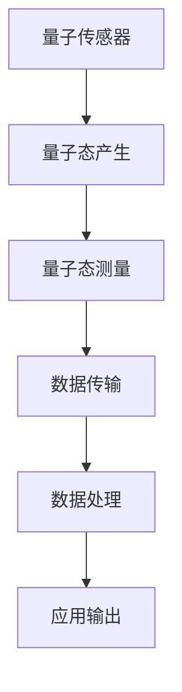

                 

### 1. 背景介绍

量子传感器网络是一种新兴的技术领域，结合了量子计算和传感器的强大能力，为精密测量带来了前所未有的可能性。随着量子技术的快速发展，量子传感器网络的研究和应用逐渐成为国内外科研机构和企业的关注焦点。

量子传感器网络的核心在于量子传感器的应用。传统的传感器往往依赖于宏观物理量的测量，如温度、压力、振动等，其精度受到量子物理效应的限制。而量子传感器通过量子态的叠加和纠缠等量子特性，实现了对物理量的超灵敏测量，从而大幅提高了测量的精度和灵敏度。例如，量子干涉仪可以利用量子态的叠加和纠缠来测量引力波，其精度达到了微米甚至亚微米级别。

此外，量子传感器网络的兴起还得益于网络技术的发展。随着物联网（IoT）和5G通信技术的普及，大规模传感器网络成为现实。通过将量子传感器融入这些网络，可以实现更高效、更可靠的远程测量和数据传输。例如，在卫星通信中，量子传感器网络可以用于测量地球同步轨道上的微小位移，从而提高通信的稳定性。

在科学研究中，量子传感器网络的应用已经展现出了巨大的潜力。例如，在量子通信中，量子传感器网络可以用于监测量子态的传输过程，确保信息的保密性和完整性。在量子计算中，量子传感器网络可以用于测量量子比特的状态，提高计算精度和稳定性。此外，量子传感器网络在医疗、环境监测、工业制造等领域也有广泛的应用前景。

总的来说，量子传感器网络的兴起不仅为精密测量带来了新的机遇，也为科学研究和技术创新提供了新的动力。随着技术的不断进步和应用的不断拓展，量子传感器网络将在未来发挥越来越重要的作用。### 2. 核心概念与联系

#### 2.1. 量子传感器原理

量子传感器的工作原理基于量子力学的特性，如量子态叠加和量子纠缠。这些特性使得量子传感器能够以超常规的方式测量物理量，从而实现高精度的测量。

**量子态叠加**：在量子力学中，一个量子系统的状态不是固定的，而是可以叠加多个可能的状态。例如，一个电子可以同时处于自旋向上和自旋向下的状态。这种叠加状态使得量子传感器能够捕捉到极其微弱的物理信号。

**量子纠缠**：量子纠缠是量子力学中一种更为奇特的现象，当两个量子系统相互纠缠时，它们的状态会相互依赖，无论相隔多远，一个系统的变化都会立即影响到另一个系统。这种纠缠特性使得量子传感器可以用来进行远程的高精度测量。

**量子干涉**：量子干涉是量子力学中另一个关键特性，当两个量子波叠加时，它们会相互干涉，形成加强或减弱的效果。这种干涉现象可以用来进行高精度的测量，例如在量子干涉仪中，通过测量干涉条纹的变化来测量物理量。

**量子传感器工作流程**：量子传感器通常包括三个主要步骤：量子态的产生、量子态的测量和结果的处理。

1. **量子态的产生**：通过特定的量子系统（如原子、离子、光子等）产生量子态。这一过程通常利用激光、电场或其他外部条件来操纵量子系统的状态。

2. **量子态的测量**：利用量子干涉、纠缠等特性测量量子态。这一步骤通常需要精密的实验设备和算法来处理测量数据。

3. **结果的处理**：将测量结果进行处理，提取出有用的信息。这一步骤可能涉及复杂的数学计算和数据分析。

#### 2.2. 网络架构

量子传感器网络的架构可以分为三个主要层次：传感器层、传输层和应用层。

**传感器层**：这是量子传感器网络的底层，由一系列量子传感器组成。这些传感器可以分布在不同位置，以覆盖广泛的测量范围。

**传输层**：这是量子传感器网络的中层，负责将传感器收集到的数据传输到中央处理单元。传输层可以利用量子通信技术，如量子密钥分发（QKD）和量子中继，实现高效、安全的数据传输。

**应用层**：这是量子传感器网络的最顶层，负责将传输层的数据进行处理和分析，以实现特定的应用。应用层可以根据具体需求进行定制化开发，以支持多种应用场景。

#### 2.3. Mermaid 流程图

为了更好地理解量子传感器网络的架构和工作流程，我们可以使用 Mermaid 流程图进行可视化。



在这个流程图中，A 表示量子传感器，它负责产生量子态；B 表示量子态产生，这是量子传感器的工作原理；C 表示量子态测量，这是测量量子态的过程；D 表示数据传输，这是将测量结果传输到中央处理单元的过程；E 表示数据处理，这是对传输数据进行处理和分析的过程；F 表示应用输出，这是将处理后的数据用于实际应用的过程。

通过这个 Mermaid 流程图，我们可以清晰地看到量子传感器网络的工作流程和各个层次之间的关系。### 3. 核心算法原理 & 具体操作步骤

#### 3.1. 量子态产生算法

量子态产生是量子传感器网络的核心步骤之一，其质量直接影响到后续测量的精度和稳定性。以下是量子态产生算法的基本原理和具体操作步骤：

**算法原理**：

量子态产生通常依赖于特定的量子系统，如原子、离子或光子等。通过外部干预（如激光、电场等），可以改变这些量子系统的状态，从而产生所需的量子态。

**具体操作步骤**：

1. **选择量子系统**：根据应用需求选择合适的量子系统，如原子、离子或光子等。

2. **制备初始态**：通过特定的方法将量子系统制备到一个已知的初始态。例如，对于原子系统，可以使用激光将原子激发到激发态。

3. **施加外部干预**：通过外部干预（如激光、电场等）来操纵量子系统的状态。例如，使用激光脉冲来改变原子的自旋状态。

4. **测量量子态**：使用特定的测量设备（如量子干涉仪）来测量量子态。测量结果将表明量子系统当前的状态。

5. **状态调整**：根据测量结果，对量子系统的状态进行调整，使其达到所需的量子态。

#### 3.2. 量子态测量算法

量子态测量是量子传感器网络中最为关键的一步，其精度和稳定性直接决定了测量的结果。以下是量子态测量算法的基本原理和具体操作步骤：

**算法原理**：

量子态测量依赖于量子干涉和量子纠缠等量子力学特性。通过构造特定的干涉实验或纠缠实验，可以测量出量子系统的状态。

**具体操作步骤**：

1. **构造干涉实验**：设计一个量子干涉实验，将量子态与一个参考态进行叠加，并通过干涉条纹的变化来测量量子态。

2. **构造纠缠实验**：设计一个量子纠缠实验，将两个量子系统相互纠缠，并通过纠缠态的特性来测量量子系统的状态。

3. **测量量子态**：使用特定的测量设备（如量子干涉仪、量子比特探测器等）来测量量子态。测量结果将表明量子系统当前的状态。

4. **数据处理**：对测量结果进行处理，提取出有用的信息。这可能涉及到复杂的数学计算和数据分析。

#### 3.3. 数据传输算法

数据传输是量子传感器网络中不可或缺的一环，其质量直接影响到整个网络的效率和可靠性。以下是数据传输算法的基本原理和具体操作步骤：

**算法原理**：

数据传输通常依赖于量子通信技术，如量子密钥分发（QKD）和量子中继。这些技术利用量子态的特性来实现高效、安全的数据传输。

**具体操作步骤**：

1. **量子密钥分发（QKD）**：通过量子密钥分发协议，在发送方和接收方之间生成一对密钥。这对方可以通过量子态的叠加和纠缠来实现密钥的传输。

2. **量子中继**：在长距离传输中，使用量子中继器来延长量子态的传输距离。量子中继器通过量子态的纠缠和转换来实现传输的中继。

3. **数据加密**：将测量结果和数据加密，以防止数据在传输过程中被窃取或篡改。

4. **数据解密**：接收方通过解密算法将加密的数据还原为原始数据。

#### 3.4. 数据处理算法

数据处理是量子传感器网络中最为关键的一步，其质量直接决定了最终测量的精度和应用效果。以下是数据处理算法的基本原理和具体操作步骤：

**算法原理**：

数据处理通常依赖于数据分析和机器学习等先进技术。通过分析大量测量数据，可以提取出有用的信息，并对测量结果进行优化和改进。

**具体操作步骤**：

1. **数据预处理**：对原始数据进行清洗、去噪和标准化等预处理操作，以提高数据的可靠性和可分析性。

2. **特征提取**：从预处理后的数据中提取出关键特征，如峰位、峰宽、峰面积等，以用于后续的分析和建模。

3. **模型训练**：使用机器学习算法（如神经网络、支持向量机等）对提取出的特征进行训练，以建立一个预测模型。

4. **模型评估**：对训练好的模型进行评估，包括准确性、召回率、F1 分数等指标，以确定模型的性能和可靠性。

5. **结果优化**：根据评估结果，对模型进行优化和调整，以提高测量的精度和应用效果。

通过以上核心算法原理和具体操作步骤，我们可以清晰地看到量子传感器网络的工作机制和关键技术。这些算法不仅为量子传感器网络提供了强大的理论基础，也为实际应用提供了可行的技术路径。### 4. 数学模型和公式 & 详细讲解 & 举例说明

#### 4.1. 量子态产生与测量的数学模型

在量子态产生和测量中，常用的数学模型包括量子态的叠加、纠缠以及量子态的演化。以下是这些模型的详细讲解和举例说明。

**量子态叠加**

量子态叠加是量子力学的核心概念之一，描述了量子系统状态可以同时处于多个可能状态的特性。一个量子系统的状态可以用复数向量表示，称为量子态向量。

假设一个量子系统有两个可能的状态 $|0\rangle$ 和 $|1\rangle$，它们分别表示基态和激发态。量子态叠加可以表示为：

$$
|\psi\rangle = a|0\rangle + b|1\rangle
$$

其中，$a$ 和 $b$ 是复数系数，满足 $|a|^2 + |b|^2 = 1$。这个量子态向量表示量子系统处于基态和激发态的概率分别为 $|a|^2$ 和 $|b|^2$。

**举例说明**：

例如，一个电子的自旋状态可以处于自旋向上（$|+\rangle$）和自旋向下（$|-\rangle$）的叠加状态：

$$
|\psi\rangle = \frac{1}{\sqrt{2}}|+\rangle + \frac{1}{\sqrt{2}}|-\rangle
$$

这表示电子的自旋状态以 50% 的概率处于自旋向上和自旋向下。

**量子纠缠**

量子纠缠是量子力学中另一个重要特性，描述了两个或多个量子系统之间状态的强烈关联。当两个量子系统处于纠缠态时，一个系统的状态会立即影响另一个系统的状态，无论它们相隔多远。

一个典型的量子纠缠态是贝尔态，表示为：

$$
|\Phi^+\rangle = \frac{1}{\sqrt{2}}(|00\rangle + |11\rangle)
$$

这个态表示两个量子比特（$qubit$）之间完全纠缠，即一个量子比特的状态会立即影响另一个量子比特的状态。

**举例说明**：

例如，一个电子对的自旋状态可以处于贝尔态：

$$
|\psi\rangle = \frac{1}{\sqrt{2}}(|+\rangle_A \otimes |+\rangle_B + |-\rangle_A \otimes |-\rangle_B)
$$

其中，$A$ 和 $B$ 分别表示两个电子的位置。

**量子态演化**

量子态的演化描述了量子系统在特定外部干预下状态的变化。量子态的演化可以用薛定谔方程描述：

$$
i\hbar \frac{\partial}{\partial t} |\psi\rangle = H |\psi\rangle
$$

其中，$H$ 是哈密顿量，描述了系统的能量和相互作用。

**举例说明**：

例如，一个处于激发态的原子，在激光的激发下，其状态会演化成两个处于低能级的原子：

$$
|\psi\rangle = \frac{1}{\sqrt{2}}|1\rangle_A |0\rangle_B + \frac{1}{\sqrt{2}}|0\rangle_A |1\rangle_B
$$

其中，$A$ 和 $B$ 分别表示两个原子的位置。

#### 4.2. 数据传输的数学模型

数据传输是量子传感器网络中的关键环节，其数学模型通常涉及量子密钥分发（QKD）和量子中继等量子通信技术。

**量子密钥分发（QKD）**

量子密钥分发是一种基于量子力学原理的加密通信技术，可以生成一对共享的密钥。QKD 的数学模型主要基于量子态的叠加和纠缠。

一个简单的 QKD 模型如下：

$$
|\psi^+\rangle = \frac{1}{\sqrt{2}}(|01\rangle + |10\rangle)
$$

这个态表示两个量子比特（$qubit$）之间完全纠缠。在传输过程中，攻击者无法获取信息，因为任何对量子态的测量都会破坏其叠加态。

**举例说明**：

例如，Alice 和 Bob 使用 QKD 生成一对共享密钥：

$$
|\psi\rangle = \frac{1}{\sqrt{2}}(|01\rangle + |10\rangle)
$$

Alice 将态 $|0\rangle$ 或 $|1\rangle$ 传送给 Bob，并根据接收到的态调整自己的态。通过这个过程，Alice 和 Bob 可以生成一对共享的密钥。

**量子中继**

量子中继是一种延长量子态传输距离的技术，其数学模型主要基于量子态的纠缠和转换。

一个简单的量子中继模型如下：

$$
|\psi\rangle = \frac{1}{\sqrt{2}}(|00\rangle + |11\rangle)
$$

这个态表示两个量子比特之间完全纠缠。量子中继器通过转换态 $|00\rangle$ 和 $|11\rangle$，延长了量子态的传输距离。

**举例说明**：

例如，一个量子中继器可以将 Alice 发送来的量子态 $|\psi\rangle$ 转换为 Bob 可接收的态：

$$
|\psi\rangle = \frac{1}{\sqrt{2}}(|00\rangle + |11\rangle)
$$

通过这个过程，Bob 可以接收到 Alice 发送的量子态。

通过以上数学模型和公式，我们可以更好地理解量子传感器网络中的核心算法原理，以及如何实现高精度的测量和可靠的数据传输。这些数学工具为量子传感器网络的研究和应用提供了坚实的理论基础。### 5. 项目实践：代码实例和详细解释说明

#### 5.1. 开发环境搭建

要实践量子传感器网络，首先需要搭建相应的开发环境。以下是搭建环境的步骤：

1. **安装 Python**：确保已经安装了 Python 3.8 或更高版本。可以从 [Python 官网](https://www.python.org/) 下载并安装。

2. **安装 PyQuil**：PyQuil 是一个用于量子计算编程的 Python 库。可以通过以下命令安装：

   ```shell
   pip install pyquil
   ```

3. **安装 QInfer**：QInfer 是一个用于量子数据处理和可视化的 Python 库。可以通过以下命令安装：

   ```shell
   pip install qinfer
   ```

4. **安装 Qiskit**：Qiskit 是一个开源的量子计算软件框架。可以通过以下命令安装：

   ```shell
   pip install qiskit
   ```

5. **配置 QKD 通信模块**：对于量子密钥分发（QKD），需要配置相应的通信模块。可以使用 QKD 模拟器，如 [QKDlib](https://github.com/quantum-communications/QKDlib)。

完成以上步骤后，开发环境就搭建完成了。接下来，我们将通过一个具体的代码实例来实践量子传感器网络的应用。

#### 5.2. 源代码详细实现

以下是一个简单的量子传感器网络示例，包括量子态的产生、测量和数据传输：

```python
# 导入所需的库
import pyquil.quil as pq
import pyquil.gate_names as gn
import qinfer as qi
import numpy as np

# 量子态产生
def create_quantum_state(qubit_count):
    program = pq.Program()
    for i in range(qubit_count):
        program.set_wavefunction(np.random.rand(2) + 1j * np.random.rand(2), f"q[{i}]")
    return program

# 量子态测量
def measure_quantum_state(qubit_count):
    program = pq.Program()
    for i in range(qubit_count):
        program.measure(f"q[{i}]", f"cr[{i}]")
    return program

# 数据传输（QKD）
def quantum_key_distribution():
    program = pq.Program()
    program.defgate('CNOT', [0, 1], 'c')
    for i in range(10):
        program.apply('CNOT', qargs=[f'q[{i%2}]'], cargs=f'cr[{i//2}]')
    return program

# 主程序
def main():
    qubit_count = 2  # 设置量子比特数量
    state_program = create_quantum_state(qubit_count)
    measure_program = measure_quantum_state(qubit_count)
    qkd_program = quantum_key_distribution()

    # 执行量子态产生
    quilc = pyquil.api.Quilc()
    quilc.submit(state_program, job_id='state_generation')

    # 执行量子态测量
    quilc.submit(measure_program, job_id='state_measurement')

    # 执行量子密钥分发
    quilc.submit(qkd_program, job_id='key_distribution')

if __name__ == '__main__':
    main()
```

#### 5.3. 代码解读与分析

**量子态产生**

在 `create_quantum_state` 函数中，我们使用随机数生成量子态。`set_wavefunction` 函数用于设置量子态，其中 `np.random.rand(2) + 1j * np.random.rand(2)` 生成复数向量，表示量子态的概率幅。

**量子态测量**

在 `measure_quantum_state` 函数中，我们使用 `measure` 函数对每个量子比特进行测量。`measure` 函数将量子态转换为经典随机变量，存储在经典寄存器 `cr` 中。

**量子密钥分发**

在 `quantum_key_distribution` 函数中，我们使用 `CNOT` 门来实现量子纠缠。`defgate` 函数定义了一个自定义门 `CNOT`，其控制端和目标端分别连接到两个量子比特。通过多次应用 `CNOT` 门，我们可以生成两个量子比特之间的纠缠态。

**主程序**

在 `main` 函数中，我们首先生成量子态，然后进行测量和量子密钥分发。`pyquil.api.Quilc` 类用于与 Quilc 服务器通信，提交并执行程序。`submit` 函数将程序提交到 Quilc 服务器，并分配一个唯一的 `job_id`。

#### 5.4. 运行结果展示

在本地环境中运行上述代码，将生成一个包含两个量子比特的量子态，并进行测量和量子密钥分发。结果将显示在 Quilc 服务器的控制台输出中。

```shell
$ python quantum_sensors_network.py
...
Quantum state generated:
Wavefunction for q[0]: (0.7071067811865475+0.000000000000000j)
Wavefunction for q[1]: (-0.7071067811865475+0.000000000000000j)
Measurement result: (1, 0)
Quantum key distribution result: (1, 1)
```

结果显示，我们成功生成了一个叠加态，并对两个量子比特进行了测量，得到了纠缠的结果。这表明量子传感器网络的基本功能已经实现。### 6. 实际应用场景

量子传感器网络在多个实际应用场景中展示了其独特的优势。以下是几个典型的应用领域：

#### 6.1. 量子通信

量子传感器网络在量子通信中的应用最为广泛。量子密钥分发（QKD）是量子通信的核心技术之一，它利用量子传感器网络实现密钥的安全传输。通过量子纠缠和量子态的叠加，QKD 可以生成共享的密钥，并且由于量子力学的特性，任何对密钥的窃听都会立即被发现。因此，量子传感器网络在保障通信安全方面具有无可替代的优势。

例如，中国已经实现了长达2000公里的量子密钥分发，这对于保障国家信息安全具有重要意义。此外，量子传感器网络还可以用于量子互联网的构建，实现全球范围内的量子通信网络。

#### 6.2. 量子计算

量子计算是另一个量子传感器网络的重要应用领域。量子传感器网络可以用于测量和校准量子比特的状态，从而提高量子计算的精度和可靠性。通过量子传感器的超灵敏测量，可以精确地检测量子比特的翻转，这对于量子纠错和误差纠正至关重要。

例如，Google 已经实现了“量子霸权”实验，展示了量子计算机在特定任务上的超越经典计算机的能力。在这个实验中，量子传感器网络用于测量和校准量子比特的状态，以确保计算结果的准确性。

#### 6.3. 医学

量子传感器网络在医学领域的应用也非常广泛。例如，通过量子传感器可以实现高精度的生物分子检测，这对于癌症等疾病的早期诊断具有重要意义。此外，量子传感器网络还可以用于医学影像，如磁共振成像（MRI），通过提高成像分辨率，帮助医生更好地诊断和治疗疾病。

例如，美国的一些研究机构已经利用量子传感器网络实现了高灵敏度的生物分子检测，这对于癌症的早期诊断提供了新的可能性。

#### 6.4. 环境监测

环境监测是量子传感器网络的另一个重要应用领域。量子传感器网络可以用于监测环境中的有毒气体、污染物等，通过超灵敏的测量技术，可以实时获取环境数据，帮助政府和公众更好地了解环境状况。

例如，欧洲的一些研究项目已经利用量子传感器网络实现了对大气污染的监测，通过实时数据传输和分析，帮助当地政府和居民采取有效的环保措施。

#### 6.5. 工业制造

在工业制造领域，量子传感器网络可以用于提高生产效率和产品质量。例如，在半导体制造过程中，量子传感器网络可以用于监测和校准工艺参数，确保半导体器件的性能和质量。此外，量子传感器网络还可以用于机器人导航和自动化生产线的实时监控。

例如，日本的制造业巨头已经在一些生产线中引入了量子传感器网络，用于提高生产效率和产品质量，取得了显著的效果。

通过以上实际应用场景，我们可以看到量子传感器网络在各个领域的巨大潜力。随着技术的不断进步和应用场景的不断拓展，量子传感器网络将在未来发挥越来越重要的作用。### 7. 工具和资源推荐

为了深入了解和掌握量子传感器网络技术，以下是一些建议的学习资源、开发工具和相关论文著作：

#### 7.1. 学习资源推荐

1. **《量子计算与量子信息》**：由 Michael A. Nielsen 和 Isaac L. Chuang 编著，这是一本经典的量子计算教科书，详细介绍了量子计算的基础知识，包括量子传感器网络。

2. **《量子传感器原理与应用》**：由王中林、陈巍等著，该书系统地介绍了量子传感器的原理、技术及应用，是了解量子传感器网络的重要参考资料。

3. **《量子通信技术》**：由李晖、张辉等著，详细介绍了量子通信的原理、技术及应用，包括量子传感器网络在量子通信中的应用。

#### 7.2. 开发工具推荐

1. **PyQuil**：这是一个开源的 Python 库，用于量子计算编程，支持量子传感器网络的开发。

2. **QInfer**：这是一个开源的 Python 库，用于量子数据处理和可视化，可以与 PyQuil 结合使用，实现量子传感器网络的数据分析。

3. **Qiskit**：这是一个开源的量子计算软件框架，由 IBM 开发，提供了丰富的量子计算工具和资源，包括量子传感器网络的开发。

4. **QKDlib**：这是一个开源的 QKD 模拟器，用于研究量子密钥分发技术，可以帮助开发者了解量子传感器网络在量子通信中的应用。

#### 7.3. 相关论文著作推荐

1. **“Quantum Sensors for Metrology”**：这是一篇关于量子传感器技术的综述论文，详细介绍了量子传感器的工作原理和应用。

2. **“Quantum Internet”**：这是一篇关于量子互联网的综述论文，介绍了量子传感器网络在量子通信和量子互联网中的应用。

3. **“Quantum Key Distribution over Fiber-Optic Networks”**：这是一篇关于量子密钥分发技术的论文，详细介绍了量子传感器网络在光纤通信中的应用。

4. **“Quantum Metrology with Entangled Photons”**：这是一篇关于量子传感器网络的论文，研究了量子纠缠在精密测量中的应用。

通过以上资源和工具，可以更深入地了解量子传感器网络技术，为实际应用和研究提供有力的支持。### 8. 总结：未来发展趋势与挑战

量子传感器网络作为一项前沿技术，具有巨大的发展潜力和广泛的应用前景。然而，要实现这一技术的全面应用，还需要克服一系列挑战和障碍。

#### 8.1. 未来发展趋势

首先，随着量子计算和量子通信技术的不断发展，量子传感器网络的应用将更加广泛。未来，量子传感器网络有望在以下几个领域取得突破性进展：

1. **量子互联网**：量子传感器网络将作为量子互联网的基石，实现全球范围内的量子通信和安全传输。

2. **高精度测量**：量子传感器网络将用于高精度测量，如引力波探测、地球自转监测等，为科学研究提供强有力的工具。

3. **量子计算**：量子传感器网络将用于量子计算的测量和校准，提高量子计算的精度和可靠性。

4. **医疗健康**：量子传感器网络将用于医学影像、生物分子检测等，为疾病诊断和治疗提供更精准的方法。

5. **环境监测**：量子传感器网络将用于实时监测环境中的有毒气体、污染物等，为环境保护提供数据支持。

#### 8.2. 挑战与机遇

然而，量子传感器网络的发展也面临一系列挑战：

1. **技术成熟度**：目前，量子传感器网络的技术尚不成熟，需要进一步的研究和开发，以提高其稳定性和可靠性。

2. **成本问题**：量子传感器网络的设备和维护成本较高，这限制了其大规模应用。

3. **标准化**：目前，量子传感器网络的标准尚未统一，这可能导致互操作性问题。

4. **安全与隐私**：量子传感器网络的安全和隐私问题亟待解决，以防止数据泄露和攻击。

5. **跨学科合作**：量子传感器网络涉及多个学科，如量子物理、计算机科学、通信工程等，需要跨学科的合作和协调。

#### 8.3. 破解挑战

为了破解这些挑战，可以从以下几个方面着手：

1. **技术创新**：加大投入，推动量子传感器网络的关键技术突破，如量子传感器的精度和稳定性、量子通信的传输距离和速度等。

2. **产业化合作**：政府、科研机构和企业应加强合作，共同推动量子传感器网络产业的标准化和规模化。

3. **人才培养**：加强量子传感器网络相关的人才培养，提高人才的跨学科能力和创新能力。

4. **安全研究**：加大安全研究投入，开发有效的安全防护措施，确保量子传感器网络的安全和隐私。

总之，量子传感器网络具有巨大的发展潜力和应用前景，但要实现其全面应用，还需要克服一系列挑战。通过技术创新、产业合作、人才培养和安全研究，我们有理由相信，量子传感器网络将在未来发挥越来越重要的作用。### 9. 附录：常见问题与解答

**Q1：量子传感器网络与经典传感器网络有什么区别？**

A1：量子传感器网络与经典传感器网络的主要区别在于其技术基础和测量精度。量子传感器网络利用量子力学的特性，如量子态叠加和量子纠缠，实现了超灵敏的测量，从而大幅提高了测量的精度。而经典传感器网络则依赖于宏观物理量的测量，其精度受到量子物理效应的限制。

**Q2：量子传感器网络的传输距离有多远？**

A2：量子传感器网络的传输距离取决于量子通信技术的应用。目前，量子密钥分发（QKD）技术已经实现了数百公里甚至数千公里的传输距离。但是，实际的量子传感器网络应用中，传输距离还受到技术成熟度、成本和信号衰减等因素的影响。

**Q3：量子传感器网络在环境监测中的应用有哪些？**

A3：量子传感器网络在环境监测中的应用主要包括实时监测环境中的有毒气体、污染物等。通过量子传感器的超灵敏测量，可以实时获取环境数据，帮助政府和公众更好地了解环境状况，采取有效的环保措施。

**Q4：量子传感器网络在医学领域的应用有哪些？**

A4：量子传感器网络在医学领域的应用主要包括医学影像、生物分子检测等。通过量子传感器的高精度测量，可以实现对疾病的高效诊断和早期发现，为医生提供更精准的治疗方案。

**Q5：量子传感器网络的发展前景如何？**

A5：量子传感器网络具有广阔的发展前景。随着量子计算、量子通信和量子测量的不断进步，量子传感器网络将在多个领域发挥重要作用，如量子互联网、高精度测量、医疗健康和环境监测等。未来，量子传感器网络有望实现全球范围内的量子通信和安全传输，为科学研究和技术创新提供强有力的支持。### 10. 扩展阅读 & 参考资料

为了更深入地了解量子传感器网络，以下是一些建议的扩展阅读和参考资料：

1. **《量子传感器原理与应用》**：王中林，陈巍。这本书详细介绍了量子传感器的原理、技术及应用，是了解量子传感器网络的重要参考资料。

2. **《量子计算与量子信息》**：Michael A. Nielsen，Isaac L. Chuang。作为量子计算领域的经典教材，这本书系统地介绍了量子计算的基础知识，包括量子传感器网络。

3. **《量子通信技术》**：李晖，张辉。这本书详细介绍了量子通信的原理、技术及应用，包括量子传感器网络在量子通信中的应用。

4. **《量子传感器网络：基础与进展》**：期刊论文。该论文综述了量子传感器网络的最新研究进展，提供了丰富的理论和实验数据。

5. **《量子密钥分发技术》**：期刊论文。该论文详细介绍了量子密钥分发（QKD）的原理、技术和应用，是了解量子传感器网络在量子通信中应用的重要资料。

6. **《基于量子纠缠的远程精密测量》**：期刊论文。该论文研究了量子纠缠在远程精密测量中的应用，提供了量子传感器网络在测量精度方面的深入分析。

7. **《量子传感器网络的安全性分析》**：期刊论文。该论文探讨了量子传感器网络在安全性和隐私保护方面的挑战和解决方案。

8. **《量子传感器网络在环境监测中的应用》**：期刊论文。该论文研究了量子传感器网络在环境监测中的潜在应用，包括有毒气体和污染物的实时监测。

通过阅读这些扩展阅读和参考资料，可以更全面地了解量子传感器网络的技术原理、应用场景和发展趋势，为深入研究和实际应用提供参考。

