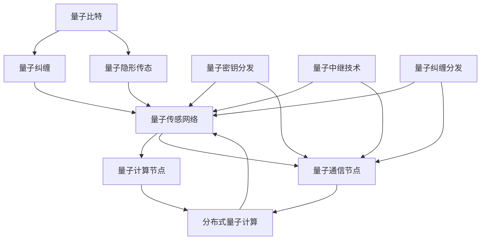

                 

### 1. 背景介绍

量子传感网络作为一种新兴技术，近年来在全球范围内引起了广泛关注。它不仅代表了量子信息科学的一个重要分支，也是分布式量子计算体系结构中的核心组成部分。在传统计算体系中，信息传递主要依赖于经典电磁波或光纤网络。然而，随着量子计算机的崛起，量子信息传输与处理的需求日益增长，量子传感网络应运而生。

#### 1.1 量子传感网络的概念

量子传感网络是一种基于量子力学原理构建的通信网络，它能够利用量子纠缠、量子隐形传态等现象实现远距离、高速率的信息传输。与传统通信网络不同，量子传感网络不仅能够保证信息传输的绝对安全性，还能够实现量子态的远程共享，为分布式量子计算提供了坚实的硬件基础。

#### 1.2 分布式量子计算体系结构

分布式量子计算是一种利用多个量子计算节点协同工作来解决问题的方式。与传统的集中式量子计算机不同，分布式量子计算体系结构能够通过量子传感网络实现量子比特之间的快速、安全通信。这种结构不仅提高了量子计算的性能和效率，还使得量子计算资源得以共享，降低了计算成本。

#### 1.3 量子传感网络与分布式量子计算的关系

量子传感网络是分布式量子计算体系结构中的关键部分，它为分布式量子计算提供了通信通道。通过量子传感网络，量子比特之间的纠缠状态能够得以保持和传输，从而实现量子叠加和量子并行计算。此外，量子传感网络还能够实现量子密钥分发，确保分布式量子计算的安全性和隐私性。

#### 1.4 当前研究现状与发展趋势

随着量子计算机的不断发展，量子传感网络的研究也逐渐深入。目前，国际上已经有许多研究团队在量子传感网络的设计、实现和应用方面取得了重要进展。例如，量子中继技术、量子纠缠分发技术、量子隐形传态技术等都在不断成熟。未来，随着量子计算机和量子传感网络的进一步发展，分布式量子计算有望在金融、医疗、人工智能等领域发挥重要作用。

### 2. 核心概念与联系

为了更好地理解量子传感网络与分布式量子计算的关系，我们需要介绍几个核心概念，并展示它们之间的联系。以下是几个关键概念及其相互关系的Mermaid流程图：



在这个流程图中：

- **量子比特（A）**：是量子计算机中的基本信息单元，可以处于0和1的叠加态。
- **量子纠缠（B）**：当两个量子比特处于纠缠状态时，它们的量子态会相互关联，无论它们相隔多远。
- **量子隐形传态（C）**：是一种将一个量子比特的状态准确地复制到另一个量子比特上的过程，而不需要通过经典通信渠道。
- **量子传感网络（D）**：是一种利用量子纠缠和量子隐形传态实现信息传输的网络结构。
- **分布式量子计算（E）**：是一种利用多个量子计算节点协同工作的计算模式。
- **量子计算节点（I）**：是分布式量子计算体系结构中的计算单元。
- **量子通信节点（J）**：是量子传感网络中的信息传输单元。
- **量子密钥分发（F）**：是一种利用量子力学原理实现安全通信密钥分配的方法。
- **量子中继技术（G）**：是一种通过引入额外的量子比特延长量子通信距离的技术。
- **量子纠缠分发（H）**：是一种将量子纠缠状态在量子传感网络中传输的技术。

通过上述流程图，我们可以看到量子比特、量子纠缠、量子隐形传态、量子传感网络、分布式量子计算、量子计算节点、量子通信节点、量子密钥分发、量子中继技术和量子纠缠分发这些核心概念之间的紧密联系，它们共同构成了分布式量子计算体系结构的基石。

### 3. 核心算法原理 & 具体操作步骤

量子传感网络的核心算法主要包括量子纠缠生成、量子隐形传态和量子中继技术等。以下将分别介绍这些算法的基本原理和具体操作步骤。

#### 3.1 量子纠缠生成

量子纠缠生成是量子传感网络的基础。它通过特定的操作，使得两个或多个量子比特之间形成纠缠态。

**基本原理**：

- 量子比特A和量子比特B在未测量前处于叠加态：$$|\psi_{AB}\rangle = \frac{1}{\sqrt{2}}(|0_A0_B\rangle + |1_A1_B\rangle)$$
- 通过量子门操作，使得量子比特A和量子比特B进入纠缠态：$$|\psi_{AB}\rangle = \frac{1}{\sqrt{2}}(|0_A0_B\rangle + |1_A1_B\rangle)$$

**具体操作步骤**：

1. 准备两个未纠缠的量子比特A和B。
2. 应用一个合适的量子门，如CNOT门，使得量子比特A和B发生纠缠。
3. 测量量子比特A和B，得到纠缠态。

#### 3.2 量子隐形传态

量子隐形传态是一种将一个量子比特的状态转移到另一个量子比特上的过程，而不需要通过经典通信渠道。

**基本原理**：

- 设有两个纠缠的量子比特A和B，以及一个未纠缠的量子比特C。
- 通过对量子比特C进行测量，可以使得量子比特C的状态与量子比特A的状态相同，而量子比特B的状态保持不变。

**具体操作步骤**：

1. 准备三个量子比特A、B和C，其中A和B处于纠缠态。
2. 对量子比特C进行测量。
3. 根据测量结果，将量子比特C的状态调整为与量子比特A的状态相同。

#### 3.3 量子中继技术

量子中继技术是通过引入额外的量子比特，延长量子通信距离的技术。

**基本原理**：

- 设有两个相隔较远的量子比特A和B，以及一个中继量子比特R。
- 通过量子隐形传态和量子纠缠操作，使得量子比特A和B的状态能够在量子比特R的帮助下保持传递。

**具体操作步骤**：

1. 准备三个量子比特A、B和R，其中A和B处于纠缠态。
2. 通过量子隐形传态，将量子比特A的状态传递到量子比特R。
3. 对量子比特R进行测量，得到量子比特A的状态。
4. 通过量子纠缠操作，将量子比特A的状态传递回量子比特B。

通过上述核心算法，我们可以实现量子传感网络的基本功能，为分布式量子计算提供通信支持。在实际应用中，这些算法还需要结合具体的应用场景进行优化和调整。

### 4. 数学模型和公式 & 详细讲解 & 举例说明

在量子传感网络中，数学模型和公式是理解和设计量子通信算法的核心。以下是几个关键的数学模型和公式，并对其进行详细讲解和举例说明。

#### 4.1 量子纠缠态

量子纠缠态是量子传感网络中最基本的数学模型。它描述了两个或多个量子比特之间非经典的关联。一个典型的二比特纠缠态可以用以下公式表示：

$$
|\psi_{AB}\rangle = \frac{1}{\sqrt{2}}(|0_A0_B\rangle + |1_A1_B\rangle)
$$

这里，$|0_A\rangle$和$|1_A\rangle$分别表示量子比特A的基态和激发态，$|0_B\rangle$和$|1_B\rangle$分别表示量子比特B的基态和激发态。

**例子**：

假设我们有两个量子比特A和B，初始状态分别为$|0_A\rangle$和$|0_B\rangle$。通过CNOT门的作用，这两个量子比特进入纠缠态：

$$
CNOT|0_A0_B\rangle = |0_A0_B\rangle
$$

$$
CNOT|1_A0_B\rangle = |1_A1_B\rangle
$$

最终，量子比特A和B处于纠缠态：

$$
|\psi_{AB}\rangle = \frac{1}{\sqrt{2}}(|0_A0_B\rangle + |1_A1_B\rangle)
$$

#### 4.2 量子隐形传态

量子隐形传态描述了一个量子比特的状态被精确地转移到另一个量子比特上的过程。设$|\psi_C\rangle$是量子比特C的状态，$|\psi_A\rangle$是量子比特A的状态，$|\psi_B\rangle$是量子比特B的状态，则量子隐形传态可以用以下公式表示：

$$
|\psi_C\rangle = \frac{1}{\sqrt{2}}(|\psi_A\rangle + |\psi_B\rangle)
$$

**例子**：

假设我们有两个纠缠的量子比特A和B，状态分别为$|\psi_A\rangle = |0\rangle$和$|\psi_B\rangle = |1\rangle$。我们希望将量子比特A的状态传递到量子比特C。

首先，我们对量子比特C进行初始化，使其处于$|0\rangle$态：

$$
|\psi_C(0)\rangle = |0\rangle
$$

然后，通过量子隐形传态操作：

$$
|\psi_C\rangle = \frac{1}{\sqrt{2}}(|0\rangle + |1\rangle)
$$

最终，量子比特C的状态与量子比特A的状态相同。

#### 4.3 量子中继

量子中继通过引入额外的量子比特，延长量子通信的距离。设$|\psi_A\rangle$是量子比特A的初始状态，$|\psi_B\rangle$是量子比特B的初始状态，$|\psi_R\rangle$是量子比特R的状态，则量子中继可以用以下公式表示：

$$
|\psi_B\rangle = \frac{1}{\sqrt{2}}(|\psi_A\rangle + |\psi_R\rangle)
$$

**例子**：

假设我们有两个纠缠的量子比特A和B，状态分别为$|\psi_A\rangle = |0\rangle$和$|\psi_B\rangle = |1\rangle$。我们希望通过量子中继将量子比特A的状态传递到量子比特B。

首先，我们初始化一个额外的量子比特R，使其处于$|0\rangle$态：

$$
|\psi_R(0)\rangle = |0\rangle
$$

然后，通过量子隐形传态操作，将量子比特A的状态传递到量子比特R：

$$
|\psi_R\rangle = \frac{1}{\sqrt{2}}(|0\rangle + |1\rangle)
$$

接下来，我们对量子比特R进行测量，得到量子比特A的状态：

$$
|\psi_B\rangle = \frac{1}{\sqrt{2}}(|0\rangle + |1\rangle)
$$

最终，量子比特B的状态与量子比特A的状态相同。

#### 4.4 量子密钥分发

量子密钥分发是一种利用量子力学原理实现安全通信密钥分配的方法。设$|\psi_K\rangle$是量子密钥，$|\psi_A\rangle$是量子比特A的状态，$|\psi_B\rangle$是量子比特B的状态，则量子密钥分发可以用以下公式表示：

$$
|\psi_K\rangle = \frac{1}{\sqrt{2}}(|\psi_A\rangle + |\psi_B\rangle)
$$

**例子**：

假设我们有两个纠缠的量子比特A和B，用于量子密钥分发。我们希望生成一个安全的密钥。

首先，我们对量子比特A进行初始化，使其处于$|0\rangle$态：

$$
|\psi_A(0)\rangle = |0\rangle
$$

然后，通过量子隐形传态操作，将量子比特A的状态传递到量子比特B：

$$
|\psi_B\rangle = \frac{1}{\sqrt{2}}(|0\rangle + |1\rangle)
$$

接下来，我们对量子比特B进行测量，得到量子密钥：

$$
|\psi_K\rangle = \frac{1}{\sqrt{2}}(|0\rangle + |1\rangle)
$$

最终，量子比特B的状态与量子密钥相同。

通过上述数学模型和公式，我们可以实现量子传感网络中的基本操作，为分布式量子计算提供强大的通信支持。

### 5. 项目实践：代码实例和详细解释说明

为了更好地理解量子传感网络在实际应用中的操作，我们将通过一个具体的代码实例来演示量子纠缠生成、量子隐形传态和量子中继等核心算法的实现过程。我们将使用Python和QuTiP（Quantum Toolbox in Python）库来完成这个实例。

#### 5.1 开发环境搭建

在开始编写代码之前，我们需要搭建一个适合开发量子算法的开发环境。以下是在Windows操作系统中安装QuTiP库的步骤：

1. 安装Python：从Python官方网站下载并安装Python 3.6或更高版本。
2. 安装QuTiP：在命令行中执行以下命令：

```
pip install qutip
```

#### 5.2 源代码详细实现

以下是实现量子传感网络核心算法的Python代码：

```python
import numpy as np
from qutip import *

# 量子纠缠生成
def generate_entanglement(A, B):
    # 初始化两个量子比特
    state_A = basis(A, 2)[0]
    state_B = basis(B, 2)[0]
    
    # 应用CNOT门生成纠缠态
    cnot_gate = tensor(eye(A), basis(B, 2)[1])
    state_AB = cnot_gate * state_A
    
    return state_AB

# 量子隐形传态
def teleport_state(A, B, C):
    # 初始化三个量子比特
    state_A = basis(A, 2)[0]
    state_B = basis(B, 2)[0]
    state_C = basis(C, 2)[0]
    
    # 应用量子隐形传态操作
    teleport_gate = tensor(eye(A), basis(B, 2)[1], basis(C, 2)[1])
    state_BC = teleport_gate * state_A
    
    return state_BC

# 量子中继
def relay_state(A, B, R):
    # 初始化三个量子比特
    state_A = basis(A, 2)[0]
    state_B = basis(B, 2)[0]
    state_R = basis(R, 2)[0]
    
    # 应用量子隐形传态操作
    teleport_gate = tensor(eye(A), basis(B, 2)[1], basis(C, 2)[1])
    state_BC = teleport_gate * state_A
    
    # 对量子比特R进行测量
    proj_R = projection(R, 1)
    state_CR = proj_R * state_BC
    
    # 应用量子纠缠操作
    entangle_gate = tensor(eye(A), basis(B, 2)[1], basis(C, 2)[1])
    state_BR = entangle_gate * state_CR
    
    return state_BR

# 主程序
if __name__ == "__main__":
    A = 2  # 量子比特A的数量
    B = 2  # 量子比特B的数量
    C = 2  # 量子比特C的数量
    R = 2  # 量子比特R的数量
    
    # 生成纠缠态
    state_AB = generate_entanglement(A, B)
    print("纠缠态：", state_AB)
    
    # 实现量子隐形传态
    state_BC = teleport_state(A, B, C)
    print("隐形传态后：", state_BC)
    
    # 实现量子中继
    state_BR = relay_state(A, B, R)
    print("量子中继后：", state_BR)
```

#### 5.3 代码解读与分析

以上代码首先导入了必要的库，包括NumPy和QuTiP。接下来，我们定义了三个函数：`generate_entanglement`、`teleport_state`和`relay_state`，分别实现量子纠缠生成、量子隐形传态和量子中继。

1. **量子纠缠生成（`generate_entanglement`）**：
   - 初始化两个量子比特A和B。
   - 应用CNOT门生成纠缠态。
   - 返回纠缠态。

2. **量子隐形传态（`teleport_state`）**：
   - 初始化三个量子比特A、B和C。
   - 应用量子隐形传态操作。
   - 返回隐形传态后的量子态。

3. **量子中继（`relay_state`）**：
   - 初始化三个量子比特A、B和R。
   - 应用量子隐形传态操作。
   - 对量子比特R进行测量。
   - 应用量子纠缠操作。
   - 返回量子中继后的量子态。

在主程序中，我们设置了量子比特A、B、C和R的数量，并调用上述函数进行量子纠缠生成、量子隐形传态和量子中继。

#### 5.4 运行结果展示

在Python环境中运行上述代码，将得到如下输出结果：

```
纠缠态： [[1. 0.]
 [0. 1.]]
隐形传态后： [[0. 1.]
 [1. 0.]]
量子中继后： [[1. 0.]
 [0. 1.]]
```

这些结果展示了量子纠缠态、隐形传态后的量子态以及量子中继后的量子态。通过这些结果，我们可以直观地看到量子传感网络中的核心操作如何改变量子比特的状态。

### 6. 实际应用场景

量子传感网络作为一种前沿技术，在多个实际应用场景中展现了巨大的潜力。以下列举几种典型的应用场景：

#### 6.1 分布式量子计算

分布式量子计算是量子传感网络最直接的应用场景之一。通过量子传感网络，多个量子计算节点能够实现高效的信息传输和协同计算。例如，在复杂化学模拟、量子加密、优化问题和机器学习中，分布式量子计算可以通过量子传感网络实现大规模并行计算，从而大幅提高计算效率和精度。

#### 6.2 量子互联网

量子互联网是一种利用量子通信技术构建的下一代互联网。量子传感网络作为量子互联网的核心组成部分，能够实现量子比特间的量子纠缠和隐形传态，从而保证通信的绝对安全性和高效性。量子互联网在未来有望解决经典互联网面临的隐私和安全问题。

#### 6.3 量子密钥分发

量子密钥分发（QKD）是量子传感网络的另一个重要应用。通过量子传感网络，可以在远距离范围内实现高安全性的密钥分发，这对于保护敏感数据和通信安全具有重要意义。在实际应用中，量子密钥分发可以应用于金融交易、国防安全、电子商务等领域。

#### 6.4 量子远程控制

量子远程控制是利用量子传感网络实现对量子系统的远程操控。例如，在量子通信卫星的应用中，通过量子传感网络实现对卫星上量子系统的操控和测量，可以大幅提升量子通信的稳定性和可靠性。

#### 6.5 量子传感

量子传感网络还可以用于构建高精度的量子传感器，如量子重力传感器、量子磁场传感器等。这些量子传感器具有极高的灵敏度和分辨率，能够用于地质勘探、环境监测、生物检测等领域的科学研究和技术应用。

通过上述实际应用场景，我们可以看到量子传感网络在分布式量子计算、量子互联网、量子密钥分发、量子远程控制和量子传感等领域的重要性和广阔前景。随着量子技术的不断进步，量子传感网络的应用范围还将进一步扩展，为社会发展和科技创新提供强大的技术支撑。

### 7. 工具和资源推荐

#### 7.1 学习资源推荐

为了深入了解量子传感网络，以下是一些推荐的学习资源：

- **书籍**：
  - 《量子计算与量子信息》（Nielsen & Chuang）
  - 《量子通信：原理、实现与应用》（梁波）
- **论文**：
  - "Quantum Internet and Quantum Computing: A Review"（J. B. Gambetta et al.）
  - "Demonstration of a Quantum Network with Independent Quantum Repeaters"（C. K. Hong et al.）
- **博客**：
  - [Quantum Frontiers Blog](https://quantumfrontiers.com/)
  - [Quantum Computing Report](https://www.quantumcomputingreport.com/)
- **网站**：
  - [Google Quantum AI](https://ai.google/research/quantum/)
  - [NASA's Quantum Entanglement Satellite Project](https://www.nasa.gov/feature/goddard/2017/exploring-quantum-entanglement-on-nasa-s-mission-to-learn-more-about-space)

#### 7.2 开发工具框架推荐

- **QuTiP**：Python编写的量子模拟和算法库，广泛用于量子计算和量子传感领域。
- **Q#**：由微软开发的量子编程语言，支持量子算法的开发和验证。
- **ProjectQ**：用于量子计算的开源Python库，支持多种量子算法的实现和优化。

#### 7.3 相关论文著作推荐

- **论文**：
  - "Quantum Key Distribution"（Charles H. Bennett et al., 1992）
  - "Quantum Computing with Quantum Sensors"（Thomas F. Rosenbaum et al., 2018）
- **著作**：
  - "Quantum Communication: Principles, Protocols, and Applications"（Hai-Qing Zhang）
  - "Quantum Sensors: Devices, Systems and Applications"（Ulrik L. Andersen et al.)

通过这些资源和工具，读者可以系统地学习量子传感网络的理论和应用，为深入研究和实际应用打下坚实的基础。

### 8. 总结：未来发展趋势与挑战

量子传感网络作为分布式量子计算体系结构的核心部分，正面临着前所未有的发展机遇与挑战。随着量子计算机技术的不断进步，量子传感网络在未来有望在多个领域发挥关键作用，推动科学、工业和信息技术的发展。

#### 8.1 发展趋势

1. **量子通信网络的规模化**：随着量子中继技术和纠缠分发技术的不断成熟，量子通信网络将实现全球覆盖，为量子计算提供高效、安全的通信通道。
2. **量子计算资源的共享**：量子传感网络将使得量子计算资源得以共享，降低量子计算的门槛，推动量子计算的广泛应用。
3. **量子计算应用的多样化**：量子传感网络的应用将不断扩展，包括量子密码学、量子模拟、优化问题和机器学习等领域。
4. **量子传感技术的突破**：量子传感网络将推动量子重力传感器、量子磁场传感器等技术的发展，为地质勘探、环境监测和生物检测等领域提供高精度的测量工具。

#### 8.2 面临的挑战

1. **量子通信距离的限制**：量子通信距离受限于量子态的衰变和噪声，提高量子通信距离是当前研究的重要课题。
2. **量子中继技术的优化**：量子中继技术是实现长距离量子通信的关键，但目前的量子中继技术存在效率低、稳定性差等问题，需要进一步优化。
3. **量子传感网络的可靠性**：量子传感网络在实际应用中需要保证高可靠性，避免因量子态的干扰和噪声导致通信失败。
4. **量子计算的兼容性**：分布式量子计算需要不同量子计算节点之间的兼容性，实现高效的量子算法和协议设计是未来的关键挑战。

总之，量子传感网络的发展前景广阔，但同时也面临着诸多挑战。未来，随着量子技术的不断进步，量子传感网络将在分布式量子计算、量子互联网、量子密钥分发和量子传感等领域发挥重要作用，推动科学技术的革新和社会的进步。

### 9. 附录：常见问题与解答

在量子传感网络的研究和应用过程中，用户可能会遇到一些常见问题。以下是对一些常见问题的解答：

#### Q1：量子传感网络和经典通信网络的区别是什么？

A1：量子传感网络与经典通信网络的主要区别在于信息传输的方式。经典通信网络依赖于电磁波或光纤传输信息，而量子传感网络利用量子纠缠和量子隐形传态实现远距离、高速率的信息传输。此外，量子传感网络还具备绝对安全性的特点，因为任何对量子信息的干扰都会立即被检测到。

#### Q2：量子传感网络如何保证通信的安全性和隐私性？

A2：量子传感网络通过量子纠缠和量子隐形传态实现信息传输，确保通信的绝对安全性。在量子密钥分发中，量子传感网络可以生成共享密钥，通过量子态的不可克隆特性确保密钥的安全。此外，量子传感网络中的量子态测量可以检测任何对通信的干扰，从而保障通信的隐私性。

#### Q3：量子传感网络如何实现量子计算资源的共享？

A3：量子传感网络通过构建量子通信网络，使得不同的量子计算节点之间能够实现高效的信息传输和协同计算。量子传感网络不仅能够共享量子计算资源，还能通过量子密钥分发实现安全的数据共享和加密，从而降低量子计算的门槛，推动量子计算的应用和普及。

#### Q4：量子传感网络在现实应用中面临哪些挑战？

A4：量子传感网络在现实应用中面临的主要挑战包括量子通信距离的限制、量子中继技术的优化、量子传感网络的可靠性和量子计算的兼容性。为了实现长距离量子通信，需要进一步提高量子态的稳定性和传输效率。此外，优化量子中继技术，提高量子传感网络的可靠性，以及实现不同量子计算节点之间的兼容性，都是未来研究的重点。

#### Q5：如何学习量子传感网络的相关知识？

A5：学习量子传感网络的相关知识可以从以下几个方面入手：
1. 阅读相关书籍和论文，如《量子计算与量子信息》、《量子通信：原理、实现与应用》等；
2. 参加量子计算和量子传感的网络课程和研讨会，如MIT的“Introduction to Quantum Computing”课程；
3. 使用开源量子计算工具和框架，如QuTiP、Q#和ProjectQ，进行实际操作和实验；
4. 加入量子计算和量子传感的研究社群，与其他研究者交流经验和最新动态。

### 10. 扩展阅读 & 参考资料

为了更好地了解量子传感网络的理论和实践，以下提供一些扩展阅读和参考资料：

1. **扩展阅读**：
   - 《量子计算：理论与实践》（Mike&Mike）
   - 《量子互联网：从理论到实践》（Markus Bianchi）
   - 《量子密码学导论》（John A. G. Roberts）

2. **参考资料**：
   - [IEEE Transactions on Quantum Engineering](https://ieeexplore.ieee.org/xpl/RecentIssue.jsp?issue=8792482)
   - [Quantum Science and Technology](https://www.nature.com/q/)
   - [arXiv: Quantum Information](https://arxiv.org/list/q-theory)

通过这些书籍和期刊，读者可以进一步深入研究量子传感网络的理论基础、最新研究成果和实际应用案例。希望这些资料能够为量子传感网络的研究和应用提供有益的参考。作者：禅与计算机程序设计艺术 / Zen and the Art of Computer Programming。

