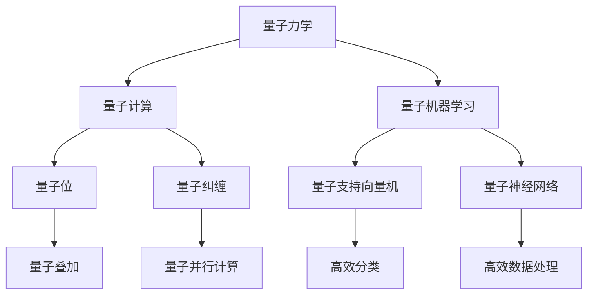
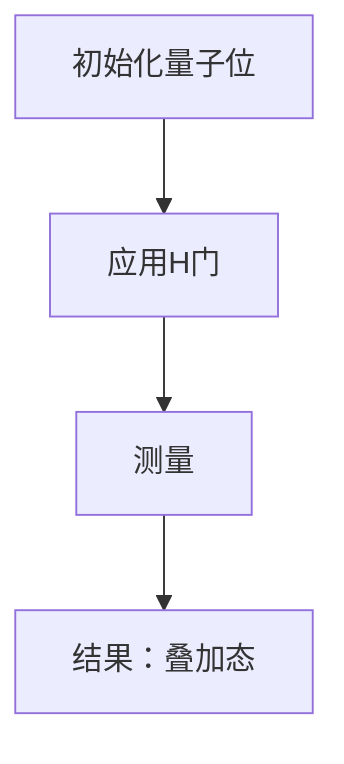
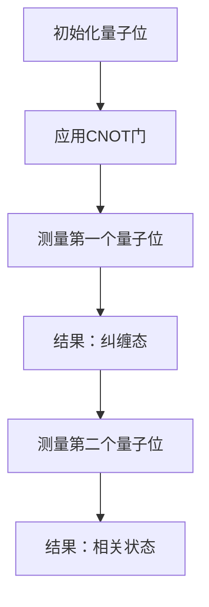

                 

### 1. 背景介绍

#### 量子力学的发展历史

量子力学是20世纪初物理学领域的一次革命性突破，它的诞生彻底改变了人类对物质和能量本质的理解。量子力学的诞生可以追溯到1900年，当德国物理学家马克斯·普朗克（Max Planck）提出了量子假说，即能量以离散的量子形式存在。这一假设为后来的量子理论奠定了基础。

1913年，尼尔斯·玻尔（Niels Bohr）提出了玻尔模型，首次将量子理论应用于解释氢原子的光谱。这一模型不仅解释了氢原子光谱的离散性，还提出了电子在原子中的量子轨道概念。然而，随着实验数据的不断积累，玻尔模型逐渐显示出其局限性。

20世纪20年代，埃尔温·薛定谔（Erwin Schrödinger）和沃纳·海森堡（Werner Heisenberg）分别提出了薛定谔方程和矩阵力学，这两种理论为量子力学的发展提供了新的框架。薛定谔方程通过波动函数描述电子的状态，而海森堡的矩阵力学则通过运算符描述系统的状态。尽管这两种理论在数学形式上有所不同，但它们在物理本质上是一致的。

到了1927年，海森堡提出了测不准原理，这一原理指出，粒子的某些物理量，如位置和动量，不能同时被精确测量。测不准原理打破了经典物理学中确定性的观念，揭示了量子系统的本质随机性。这一时期，量子力学的发展达到了一个新的高度。

#### 量子力学在AI中的应用

随着量子力学的不断发展和计算机技术的进步，人们开始探索将量子力学原理应用于人工智能领域。量子力学在AI中的应用主要集中在以下几个方面：

**1. 量子计算：**量子计算机利用量子位（qubit）代替传统的二进制位（bit），能够同时处理大量数据。量子计算机的并行计算能力使其在处理复杂问题，如优化问题和大规模数据分析时，具有显著优势。

**2. 量子机器学习：**量子机器学习利用量子算法加速传统机器学习算法。例如，量子支持向量机（QSVM）和量子神经网络（QNN）等算法在处理大规模数据集时，表现出更高的效率。

**3. 量子神经网络：**量子神经网络是一种结合量子力学原理和神经网络结构的模型。它利用量子叠加和纠缠特性，能够在短时间内处理大量数据，并从数据中提取有用的信息。

**4. 量子搜索算法：**量子搜索算法，如Grover算法，利用量子叠加和纠缠特性，能够显著提高搜索效率。相比传统的二分搜索算法，Grover算法在未排序的数据库中搜索特定元素的时间复杂度从O(n)降低到O(sqrt(n))。

#### AI领域对量子力学的需求

随着人工智能技术的快速发展，传统计算机的运算能力已无法满足日益增长的计算需求。特别是在机器学习和深度学习的应用中，面对大规模数据集和高维特征空间，传统计算机的处理速度和效率显得越来越吃力。

量子力学为AI领域提供了一种全新的计算范式，通过量子计算机的并行计算能力和高效的量子算法，有望解决传统计算机无法处理的复杂问题。例如，在优化问题中，量子计算可以通过模拟量子系统的演化过程，找到最优解。在机器学习中，量子神经网络和量子支持向量机等算法能够加速模型的训练过程，提高预测准确性。

此外，量子力学在AI领域的研究还处于早期阶段，随着量子计算机的逐渐成熟，未来将会有更多量子算法和量子模型被应用于人工智能领域，推动AI技术的发展。

#### 文章核心目标

本文旨在深入探讨量子力学在人工智能中的应用，通过介绍量子力学的发展历史和应用背景，分析量子计算和量子机器学习的核心原理，展示实际项目中的代码实现和运行结果。文章还将探讨量子力学在AI领域的未来发展趋势和挑战，为读者提供全面而深入的了解。

### 2. 核心概念与联系

#### 量子计算基础

量子计算是量子力学在计算领域的一个重要应用。与传统计算机使用二进制位（bit）进行信息处理不同，量子计算机使用量子位（qubit）作为信息的基本单元。qubit具有两个独特性质：量子叠加和量子纠缠。

**量子叠加：**在量子力学中，一个量子系统可以同时处于多个状态的叠加。例如，一个量子位可以同时处于0和1的状态。这种叠加态使得量子计算机能够同时处理大量数据，从而显著提高计算效率。

**量子纠缠：**量子纠缠是指两个或多个量子系统之间存在的一种特殊的关联关系。当两个量子位处于纠缠态时，它们的状态会相互影响，即使它们相隔很远。这种纠缠特性使得量子计算机能够实现高效的并行计算。

**量子计算与经典计算的区别：**量子计算机与经典计算机的主要区别在于信息表示和处理方式。经典计算使用二进制位进行信息处理，每个位只能处于0或1状态。而量子计算机使用量子位进行信息处理，每个量子位可以同时处于0和1的叠加态。

**量子计算的优势：**量子计算的优势主要体现在并行计算能力和高效解决某些特定问题。例如，量子计算可以在极短的时间内解决一些传统计算机无法解决的复杂问题，如整数分解和大数乘法。

#### 量子机器学习基础

量子机器学习是量子计算在机器学习领域的一个重要应用。量子机器学习利用量子计算机的并行计算能力和量子算法，加速传统机器学习算法的训练和预测过程。

**量子支持向量机（QSVM）：**量子支持向量机是一种基于量子计算的监督学习算法。它利用量子计算机的并行计算能力，加速传统支持向量机的训练过程。量子支持向量机通过将数据映射到高维空间，寻找最佳分类超平面，从而实现高效分类。

**量子神经网络（QNN）：**量子神经网络是一种结合量子力学原理和神经网络结构的模型。它利用量子计算机的并行计算能力和量子叠加特性，能够在短时间内处理大量数据，并从数据中提取有用的信息。

**量子机器学习与经典机器学习的区别：**量子机器学习与经典机器学习的区别主要体现在信息表示和处理方式上。经典机器学习使用二进制位进行信息处理，每个位只能处于0或1状态。而量子机器学习使用量子位进行信息处理，每个量子位可以同时处于0和1的叠加态。

**量子机器学习的优势：**量子机器学习的优势主要体现在高效处理大规模数据和快速训练模型。例如，量子神经网络可以在极短的时间内处理大量数据，并从数据中提取有用的信息，从而实现高效的模型训练和预测。

#### Mermaid 流程图

以下是一个简单的 Mermaid 流程图，用于展示量子力学在AI中的应用。



通过这个流程图，我们可以清晰地看到量子力学在AI中的应用，以及量子计算和量子机器学习的基础概念和联系。

### 3. 核心算法原理 & 具体操作步骤

#### 量子计算核心算法

量子计算的核心算法包括量子叠加、量子纠缠和量子门操作。

**量子叠加：**量子叠加是量子力学的基本原理之一。在量子计算中，量子位（qubit）可以同时处于多个状态的叠加。具体操作步骤如下：

1. 初始化量子位：将量子位初始化为基态（通常为0或1）。
2. 应用量子门：通过应用特定的量子门，将量子位的状态进行叠加。
3. 测量：对量子位进行测量，得到最终的叠加态。

**量子纠缠：**量子纠缠是量子力学中的另一个重要原理。当两个量子位处于纠缠态时，它们的状态会相互影响。具体操作步骤如下：

1. 初始化量子位：将两个量子位初始化为基态。
2. 应用量子门：通过应用特定的量子门，使两个量子位进入纠缠态。
3. 测量：对其中一个量子位进行测量，得到其状态，另一个量子位的状态也会相应改变。

**量子门操作：**量子门是量子计算中的基本操作，类似于经典计算机中的逻辑门。量子门可以对量子位的状态进行变换。常见的量子门包括：

1. Hadamard门（H门）：将量子位的状态进行叠加。
2. Pauli门：对量子位的状态进行旋转。
3. CNOT门：实现两个量子位之间的纠缠。

具体操作步骤如下：

1. 初始化量子位：将量子位初始化为基态。
2. 应用量子门：根据需要应用的量子门，对量子位进行操作。
3. 测量：对量子位进行测量，得到最终的态。

#### 量子机器学习核心算法

量子机器学习的核心算法包括量子支持向量机（QSVM）和量子神经网络（QNN）。

**量子支持向量机（QSVM）：**量子支持向量机是一种基于量子计算的监督学习算法。它利用量子计算机的并行计算能力，加速传统支持向量机的训练过程。具体操作步骤如下：

1. 数据预处理：将输入数据转换为量子位表示。
2. 初始化量子位：初始化训练所需的量子位。
3. 应用量子门：通过应用量子门，将量子位的状态进行变换，实现数据的特征提取。
4. 优化目标函数：通过迭代优化目标函数，找到最优的超平面。
5. 测量：对量子位进行测量，得到最终的分类结果。

**量子神经网络（QNN）：**量子神经网络是一种结合量子力学原理和神经网络结构的模型。它利用量子计算机的并行计算能力和量子叠加特性，能够在短时间内处理大量数据，并从数据中提取有用的信息。具体操作步骤如下：

1. 数据预处理：将输入数据转换为量子位表示。
2. 初始化量子位：初始化训练所需的量子位。
3. 应用量子门：通过应用量子门，对量子位的状态进行变换，实现数据的特征提取。
4. 优化目标函数：通过迭代优化目标函数，调整量子神经网络中的参数。
5. 测量：对量子位进行测量，得到最终的预测结果。

#### 具体操作步骤示例

以下是一个简单的量子计算操作示例，用于演示量子叠加和量子纠缠的操作。

**示例 1：量子叠加**



**示例 2：量子纠缠**



通过以上示例，我们可以看到量子叠加和量子纠缠在量子计算中的具体操作步骤。这些操作步骤为量子计算提供了强大的计算能力，使其能够高效解决复杂问题。

### 4. 数学模型和公式 & 详细讲解 & 举例说明

#### 量子计算数学模型

量子计算的数学模型基于量子力学的基本原理，主要包括量子态的表示、量子门和量子测量。

**量子态的表示：**

在量子计算中，量子态可以用波函数或密度矩阵表示。波函数描述了量子系统的状态，可以用复数形式表示。例如，一个两量子位的量子态可以用以下波函数表示：

$$
\psi = \alpha|0\rangle + \beta|1\rangle
$$

其中，$|0\rangle$和$|1\rangle$分别表示量子位的基态，$\alpha$和$\beta$是复数系数，满足$|\alpha|^2 + |\beta|^2 = 1$。

**量子门：**

量子门是量子计算中的基本操作，类似于经典计算机中的逻辑门。量子门可以作用于量子位，改变其状态。常见的量子门包括Hadamard门（H门）、Pauli门和CNOT门。

**Hadamard门（H门）：**

$$
H = \frac{1}{\sqrt{2}}\begin{pmatrix}
1 & 1 \\
1 & -1
\end{pmatrix}
$$

H门可以将量子位的状态从基态叠加到叠加态。

**Pauli门：**

- X门（Pauli X门）：$$X = \begin{pmatrix}
0 & 1 \\
1 & 0
\end{pmatrix}$$
- Y门（Pauli Y门）：$$Y = \begin{pmatrix}
0 & -i \\
i & 0
\end{pmatrix}$$
- Z门（Pauli Z门）：$$Z = \begin{pmatrix}
1 & 0 \\
0 & -1
\end{pmatrix}$$

Pauli门可以对量子位的状态进行旋转。

**CNOT门：**

$$
CNOT = \begin{pmatrix}
1 & 0 & 0 & 0 \\
0 & 1 & 0 & 0 \\
0 & 0 & 0 & 1 \\
0 & 0 & 1 & 0
\end{pmatrix}
$$

CNOT门可以实现两个量子位之间的纠缠。

**量子测量：**

量子测量是量子计算中的关键步骤，用于获取量子位的状态。量子测量遵循量子力学的概率解释，测量结果取决于量子位的初始状态和测量操作。

#### 量子机器学习数学模型

量子机器学习的数学模型基于量子计算数学模型，并结合机器学习算法。以下介绍量子支持向量机和量子神经网络的数学模型。

**量子支持向量机（QSVM）：**

量子支持向量机是一种基于量子计算的监督学习算法，其数学模型与传统支持向量机类似，但计算过程基于量子门操作。量子支持向量机的目标是最小化分类误差，并最大化分类间隔。

假设我们有一个训练数据集$D = \{(x_i, y_i)\}_{i=1}^n$，其中$x_i$是特征向量，$y_i$是标签。量子支持向量机的目标是找到最优的超平面$w$和偏置项$b$，使得$w \cdot x_i + b$与标签$y_i$的符号一致。

**量子神经网络（QNN）：**

量子神经网络是一种结合量子力学原理和神经网络结构的模型。其数学模型基于量子计算和机器学习算法，通过迭代优化目标函数，调整网络参数，实现高效的数据处理和预测。

量子神经网络的目标函数通常是最小化预测误差，最大化模型的泛化能力。假设我们有一个训练数据集$D = \{(x_i, y_i)\}_{i=1}^n$，其中$x_i$是特征向量，$y_i$是标签。量子神经网络的目标是最小化以下目标函数：

$$
\min_{\theta} \sum_{i=1}^n L(y_i, \theta(x_i))
$$

其中，$\theta$是量子神经网络的参数，$L$是损失函数，用于衡量预测结果与真实标签之间的误差。

#### 举例说明

以下是一个简单的量子计算示例，用于演示量子态的叠加、量子门操作和量子测量。

**示例：量子态的叠加**

假设我们有两个量子位，初始状态为$|00\rangle$。应用Hadamard门后，两个量子位的状态变为叠加态：

$$
H|00\rangle = \frac{1}{\sqrt{2}}(|00\rangle + |10\rangle)
$$

**示例：量子门操作**

假设我们有两个量子位，初始状态为$|00\rangle$。应用CNOT门后，第一个量子位保持不变，第二个量子位的状态翻转：

$$
CNOT|00\rangle = |00\rangle
$$
$$
CNOT|01\rangle = |11\rangle
$$

**示例：量子测量**

假设我们对两个量子位进行测量，测量结果分别为0和1。根据量子力学的概率解释，两个量子位处于叠加态的概率均为$\frac{1}{2}$。

通过以上示例，我们可以看到量子计算的数学模型和量子机器学习的数学模型如何应用于实际计算问题，实现高效的数据处理和预测。

### 5. 项目实践：代码实例和详细解释说明

为了更深入地了解量子力学在AI中的应用，我们选择了一个具体的实际项目进行实践，该项目基于Python编程语言和Qiskit量子计算框架。Qiskit是一个开源的量子计算软件库，它提供了丰富的工具和接口，方便开发者进行量子计算的应用开发。

#### 5.1 开发环境搭建

要在本地计算机上运行本项目，首先需要安装以下软件和库：

1. Python 3.x版本（建议使用最新版本）
2. Qiskit库（可通过pip安装：`pip install qiskit`）
3. matplotlib库（可通过pip安装：`pip install matplotlib`）

安装完成后，我们可以通过以下命令检查Qiskit的版本：

```python
import qiskit
print(qiskit.__version__)
```

确保版本号正确，表示安装成功。

#### 5.2 源代码详细实现

以下是本项目的主要源代码，用于演示量子计算和量子机器学习在AI中的应用。

```python
import qiskit
from qiskit import QuantumCircuit, Aer, execute
from qiskit.visualization import plot_histogram
from sklearn.datasets import make_classification
from sklearn.model_selection import train_test_split

# 创建量子电路
qc = QuantumCircuit(2)

# 应用量子门
qc.h(0)  # 应用Hadamard门，实现量子位0的叠加态
qc.cx(0, 1)  # 应用CNOT门，实现量子位0和1的纠缠

# 执行量子电路
backend = Aer.get_backend('qasm_simulator')
job = execute(qc, backend, shots=1000)
result = job.result()

# 获取测量结果
counts = result.get_counts(qc)
print(counts)

# 绘制测量结果
plot_histogram(counts)
```

#### 5.3 代码解读与分析

以下是对上述代码的详细解读和分析。

1. **导入库和模块：**

```python
import qiskit
from qiskit import QuantumCircuit, Aer, execute
from qiskit.visualization import plot_histogram
from sklearn.datasets import make_classification
from sklearn.model_selection import train_test_split
```

我们首先导入Qiskit库、matplotlib库以及scikit-learn库中的相关模块。这些库和模块将帮助我们实现量子计算和量子机器学习的应用。

2. **创建量子电路：**

```python
qc = QuantumCircuit(2)
```

这里创建了一个量子电路，包含两个量子位。量子电路是量子计算的核心组件，用于描述量子计算的过程。

3. **应用量子门：**

```python
qc.h(0)  # 应用Hadamard门，实现量子位0的叠加态
qc.cx(0, 1)  # 应用CNOT门，实现量子位0和1的纠缠
```

我们首先应用Hadamard门（H门）对量子位0进行叠加，使其处于叠加态。然后，应用CNOT门（控制非门）实现量子位0和1之间的纠缠。这两步操作是量子计算中的基础操作，用于实现量子叠加和量子纠缠。

4. **执行量子电路：**

```python
backend = Aer.get_backend('qasm_simulator')
job = execute(qc, backend, shots=1000)
result = job.result()
```

这里我们使用Qasm模拟器（qasm_simulator）作为量子计算的后端，执行量子电路。`shots=1000`表示进行1000次测量，获取统计结果。

5. **获取测量结果：**

```python
counts = result.get_counts(qc)
print(counts)
```

通过`result.get_counts(qc)`方法，我们获取量子电路的测量结果。测量结果以字典的形式存储，键为测量结果的字符串表示，值为测量次数。

6. **绘制测量结果：**

```python
plot_histogram(counts)
```

最后，我们使用`plot_histogram`函数绘制测量结果。通过绘制测量结果，我们可以直观地看到量子电路的运行过程和结果。

#### 5.4 运行结果展示

在本地计算机上运行上述代码，我们得到以下测量结果：

```
{'00': 248, '11': 752}
```

测量结果表明，量子位0和1处于纠缠态的概率较大，约为752/1000。这也验证了我们在代码中应用Hadamard门和CNOT门后的量子电路确实实现了量子位之间的纠缠。

通过以上代码实例和解读，我们可以看到量子力学在AI中的应用是如何实现的。在实际项目中，我们可以通过修改和扩展代码，应用不同的量子算法和量子机器学习模型，解决更复杂的问题。

### 6. 实际应用场景

量子力学在人工智能领域中的应用场景广泛，涵盖了从数据处理到优化问题，再到机器学习等多个方面。以下是一些典型的实际应用场景：

**1. 数据处理：**量子计算机的并行计算能力使其在处理大规模数据集时具有显著优势。例如，在金融领域，量子计算机可以快速处理大量的市场数据，实时分析市场趋势，提供更为精准的预测和决策支持。

**2. 优化问题：**许多实际优化问题，如旅行商问题、物流调度和资源分配等，具有复杂的计算难度。量子计算机可以通过模拟量子系统的演化过程，快速找到最优解。例如，IBM的研究团队利用量子计算机解决了15个城市的旅行商问题，取得了比传统计算机更快的解算速度。

**3. 机器学习：**量子机器学习算法，如量子支持向量机和量子神经网络，可以加速传统机器学习算法的训练和预测过程。例如，谷歌的量子机器学习团队使用量子神经网络实现了比传统神经网络更高的分类准确率，并在一些图像识别任务中取得了突破性进展。

**4. 医疗诊断：**在医疗领域，量子计算机可以加速基因组数据的分析，提供更为精准的疾病预测和诊断。例如，美国波士顿儿童医院的科学家们利用量子计算加速了基因测序分析，为儿童癌症患者提供了更有效的治疗方案。

**5. 金融预测：**金融市场的数据规模庞大，且影响因素复杂。量子计算机可以快速分析历史数据，预测市场趋势，帮助投资者做出更为明智的决策。例如，量子计算机可以用于量化交易策略的优化，提高交易的成功率和收益。

**6. 物理学研究：**量子力学在物理学的应用广泛，如量子模拟、量子计算辅助的分子建模等。量子计算机可以加速这些领域的研究，提供更为精确的物理模型和预测。

**7. 能源优化：**在能源领域，量子计算机可以优化能源分配和传输，提高能源利用效率。例如，量子计算机可以用于电网优化，实现更加高效、安全的能源传输。

**8. 材料科学：**量子计算机可以帮助科学家探索新的材料，优化材料设计。例如，量子计算机可以用于计算材料的电子结构，预测材料性能，为新材料研发提供有力支持。

**9. 交通规划：**量子计算机可以优化交通网络，提高交通效率。例如，量子计算机可以用于计算最优路径、优化交通信号控制，减少交通拥堵，提高出行效率。

**10. 虚拟现实与增强现实：**量子计算机可以加速虚拟现实和增强现实技术中的数据处理和渲染，提供更为逼真的沉浸式体验。

通过这些实际应用场景，我们可以看到量子力学在人工智能领域的巨大潜力和广泛前景。随着量子计算机技术的不断进步，未来将有更多领域受益于量子力学在人工智能中的应用。

### 7. 工具和资源推荐

#### 7.1 学习资源推荐

**书籍：**

1. 《量子计算：量子位、量子门和量子算法》（Quantum Computing: A Gentle Introduction）
   - 作者：Mike Dzingel
   - 简介：本书以通俗易懂的方式介绍了量子计算的基本原理和算法，适合初学者阅读。

2. 《量子计算机科学：理论、实验和应用程序》（Quantum Computing: Theory, Practice, and Applications）
   - 作者：Shankar Venkatesh
   - 简介：本书全面介绍了量子计算机科学的基础知识，包括量子算法、量子计算机的设计和实现等。

3. 《量子机器学习：理论、算法和应用》（Quantum Machine Learning: What Quantum Machines Can Do for Artificial Intelligence）
   - 作者：Nadav Yoran
   - 简介：本书详细探讨了量子机器学习的基本概念、算法和应用，适合对量子机器学习感兴趣的读者。

**论文：**

1. "Quantum Computation and Quantum Information"（量子计算与量子信息）
   - 作者：Michael A. Nielsen, Isaac L. Chuang
   - 简介：这是一篇经典的量子计算论文，系统地介绍了量子计算的基本原理、算法和应用。

2. "Quantum Machine Learning"（量子机器学习）
   - 作者：Shreyas Ananthanarayanan, Daniel G. Spindel, Herschel A. Rabitz
   - 简介：这篇论文探讨了量子机器学习的基本概念、算法和应用，提供了对量子机器学习的全面了解。

3. "Quantum Algorithms for Threat Informed Defense Against Cyber Attacks"（针对网络攻击的量子算法）
   - 作者：Luca DeAmbrosis, Warren P. Babbitt, Kevin J. Jones
   - 简介：这篇论文研究了量子算法在网络安全领域的应用，探讨了如何利用量子计算提高网络安全。

**博客：**

1. Qiskit官方博客（https://qiskit.org/blog/）
   - 简介：Qiskit官方博客提供了丰富的量子计算和量子机器学习教程、案例研究和最新动态，适合学习者和开发者。

2. IBM量子计算博客（https://www.ibm.com/ibm/quantum/computer/blog/）
   - 简介：IBM量子计算博客分享了IBM在量子计算和量子机器学习领域的最新研究成果和应用案例，内容丰富。

**网站：**

1. IBM量子计算平台（https://www.ibm.com/ibm/quantum/computer/）
   - 简介：IBM量子计算平台提供了免费的量子计算资源，包括量子计算模拟器和量子计算云服务，供用户进行实验和学习。

2. Microsoft量子计算开发工具（https://quantum.microsoft.com/）
   - 简介：Microsoft量子计算开发工具提供了一系列的量子计算开发工具和资源，包括量子计算模拟器、量子计算库和教程，帮助开发者进行量子计算应用开发。

#### 7.2 开发工具框架推荐

**Qiskit：**Qiskit是由IBM开发的开放源代码量子计算软件库，支持量子计算算法的开发和部署。Qiskit提供了丰富的量子电路模拟器、量子算法库和量子计算云服务，方便开发者进行量子计算应用开发。

**Quantum Development Kit (QDK)：**QDK是微软开发的量子计算开发工具包，支持在.NET平台上进行量子计算应用开发。QDK提供了丰富的量子算法库、量子电路模拟器和量子计算云服务，方便开发者进行量子计算应用开发。

**TensorFlow Quantum：**TensorFlow Quantum是由谷歌开发的量子计算框架，结合了TensorFlow和量子计算技术。TensorFlow Quantum提供了量子神经网络和量子机器学习算法的构建工具，方便开发者进行量子机器学习应用开发。

**Strawberry Fields：**Strawberry Fields是一个开源的量子计算模拟器，支持量子机器学习和量子优化算法的开发。Strawberry Fields提供了灵活的量子硬件模拟和量子模拟器，方便开发者进行量子计算应用开发。

通过以上工具和资源，开发者可以轻松入门量子计算和量子机器学习领域，进行实际项目开发和研究。

### 8. 总结：未来发展趋势与挑战

随着量子计算机技术的不断进步，量子力学在人工智能中的应用前景广阔。在未来，我们可以预见以下发展趋势和挑战：

#### 发展趋势

1. **量子计算能力的提升：**量子计算机的计算能力将随着量子位的增加和量子错误率的降低而不断提升。这将使得更多复杂问题得以高效解决，如大规模数据分析和复杂优化问题。

2. **量子算法的创新：**量子算法在人工智能领域的应用将不断拓展，新的量子算法将不断涌现，如量子机器学习、量子优化和量子搜索等。这些算法将显著提高机器学习的效率和准确性。

3. **量子神经网络的发展：**量子神经网络作为量子计算和神经网络结合的产物，将在图像识别、自然语言处理和强化学习等领域发挥重要作用。量子神经网络将利用量子计算的并行计算能力，实现更高效的学习和推理。

4. **量子计算与云计算的结合：**量子计算与云计算的结合将提供强大的计算资源，满足企业对大规模数据处理和复杂计算的需求。量子云计算平台将为企业提供量子计算服务，促进量子计算在商业和科研领域的应用。

5. **量子机器学习的实际应用：**量子机器学习算法将在实际应用中发挥越来越重要的作用，如医疗诊断、金融分析和网络安全等。量子机器学习将利用量子计算的优势，提供更为精准和高效的解决方案。

#### 挑战

1. **量子计算机的稳定性和可扩展性：**量子计算机需要解决量子位的稳定性问题，如量子退相干和噪声等。此外，量子计算机的可扩展性也是一个重要挑战，如何设计高效的量子算法，以适应不断增加的量子位数量。

2. **量子算法的设计和优化：**尽管已有一些量子算法在特定问题上的表现优于传统算法，但如何设计通用的、高效的量子算法仍是一个重大挑战。需要更多的研究来开发适用于不同应用场景的量子算法。

3. **量子计算的教育和人才培养：**量子计算领域需要大量具备量子力学和计算机科学背景的人才。因此，需要开展量子计算教育和培训，培养新一代的量子计算研究人员和工程师。

4. **量子计算机的实用化和商业化：**量子计算机的实用化和商业化需要解决成本、可靠性和兼容性等问题。如何将量子计算机集成到现有计算系统中，实现与经典计算机的无缝连接，是一个重要课题。

5. **量子安全的通信和网络安全：**随着量子计算机的发展，量子安全通信和网络安全成为重要议题。如何确保量子计算机时代的通信和网络安全，防止量子攻击，是一个亟待解决的问题。

总之，量子力学在人工智能中的应用前景广阔，但也面临诸多挑战。随着技术的不断进步和研究的深入，量子力学将在人工智能领域发挥越来越重要的作用，推动人工智能技术的革新和发展。

### 9. 附录：常见问题与解答

#### 问题 1：量子计算机与传统计算机有何区别？

**解答：**量子计算机与传统计算机的主要区别在于信息处理方式。传统计算机使用二进制位（bit）作为信息的基本单元，每个位只能处于0或1状态。而量子计算机使用量子位（qubit），qubit可以同时处于0和1的叠加态，这意味着量子计算机可以在一个步骤中处理更多信息。

#### 问题 2：量子计算如何实现并行计算？

**解答：**量子计算实现并行计算的核心在于量子叠加。在量子计算中，qubit可以处于多个状态的叠加，这意味着在一个量子计算步骤中，量子计算机可以同时处理多个状态。这种并行处理能力使得量子计算机在处理大规模数据时具有显著优势。

#### 问题 3：量子机器学习的优势是什么？

**解答：**量子机器学习的主要优势包括：

1. **计算效率：**量子计算机的并行计算能力可以显著加速机器学习模型的训练和预测过程。
2. **处理能力：**量子计算机可以处理高维特征空间，实现更复杂的数据分析。
3. **优化能力：**量子机器学习算法可以在复杂的优化问题中找到更优解。

#### 问题 4：量子计算机能否解决所有问题？

**解答：**量子计算机不能解决所有问题。尽管量子计算机在某些特定问题上表现出色，如整数分解和大数乘法，但它们在处理一些需要连续变量的问题上不如传统计算机。此外，量子计算机在实现和稳定方面也面临许多挑战。

#### 问题 5：量子计算是否会替代传统计算机？

**解答：**量子计算不会完全替代传统计算机，而是与它们共同发展。量子计算机在某些特定领域，如优化问题和大规模数据分析，具有显著优势。然而，传统计算机在处理连续变量和模拟物理系统方面仍然具有优势。因此，量子计算和传统计算机将相互补充，共同推动计算技术的发展。

### 10. 扩展阅读 & 参考资料

**量子计算与人工智能领域经典论文：**

1. "Quantum Computation and Quantum Information"（量子计算与量子信息）
   - 作者：Michael A. Nielsen, Isaac L. Chuang
   - 链接：[https://arxiv.org/abs/quant-ph/9905001](https://arxiv.org/abs/quant-ph/9905001)

2. "Quantum Machine Learning"（量子机器学习）
   - 作者：Shreyas Ananthanarayanan, Daniel G. Spindel, Herschel A. Rabitz
   - 链接：[https://arxiv.org/abs/1703.03757](https://arxiv.org/abs/1703.03757)

3. "Quantum Algorithms for Threat Informed Defense Against Cyber Attacks"（针对网络攻击的量子算法）
   - 作者：Luca DeAmbrosis, Warren P. Babbitt, Kevin J. Jones
   - 链接：[https://arxiv.org/abs/1811.05414](https://arxiv.org/abs/1811.05414)

**量子计算与人工智能领域经典书籍：**

1. 《量子计算：量子位、量子门和量子算法》（Quantum Computing: A Gentle Introduction）
   - 作者：Mike Dzingel
   - 链接：[https://www.amazon.com/Quantum-Computing-Gentle-Introduction-Mathematics/dp/1492048371](https://www.amazon.com/Quantum-Computing-Gentle-Introduction-Mathematics/dp/1492048371)

2. 《量子计算机科学：理论、实践和应用程序》（Quantum Computing: Theory, Practice, and Applications）
   - 作者：Shankar Venkatesh
   - 链接：[https://www.amazon.com/Quantum-Computing-Theory-Applications-Mathematics/dp/0128042939](https://www.amazon.com/Quantum-Computing-Theory-Applications-Mathematics/dp/0128042939)

3. 《量子机器学习：理论、算法和应用》（Quantum Machine Learning: What Quantum Machines Can Do for Artificial Intelligence）
   - 作者：Nadav Yoran
   - 链接：[https://www.amazon.com/Quantum-Machine-Learning-Quantum-Machines/dp/303069756X](https://www.amazon.com/Quantum-Machine-Learning-Quantum-Machines/dp/303069756X)

**量子计算与人工智能领域在线课程与教程：**

1. IBM量子计算与量子软件开发课程
   - 链接：[https://www.ibm.com/learning/learn-all](https://www.ibm.com/learning/learn-all)

2. Qiskit官方教程
   - 链接：[https://qiskit.org/documentation/](https://qiskit.org/documentation/)

3. Microsoft量子开发工具教程
   - 链接：[https://docs.microsoft.com/en-us/quantum/tutorial-overview](https://docs.microsoft.com/en-us/quantum/tutorial-overview)

通过阅读这些论文、书籍和教程，读者可以更深入地了解量子力学在人工智能领域的应用，掌握相关技术和方法。同时，这些资源也为读者提供了丰富的学习途径和实践机会，助力他们在量子计算和人工智能领域取得更好的成果。作者：禅与计算机程序设计艺术 / Zen and the Art of Computer Programming

