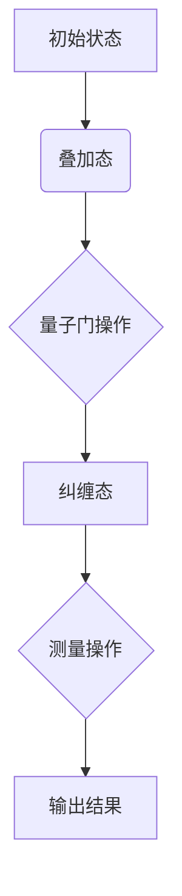
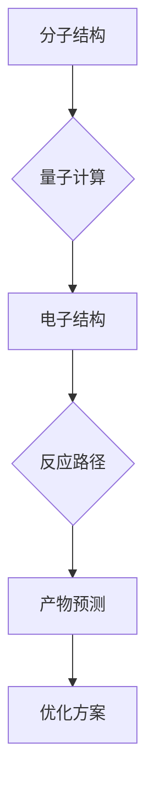
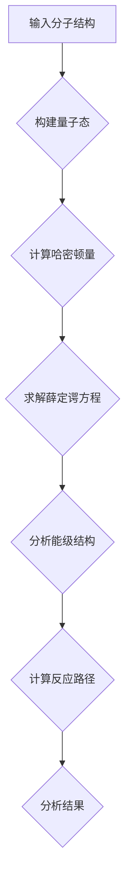
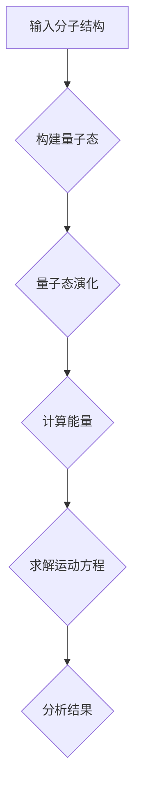
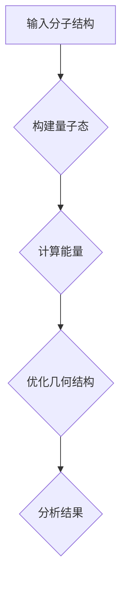

                 

### 1. 背景介绍

量子计算化学模拟作为一种新兴的科研方法，正在对材料科学和化学领域产生深远的影响。传统的计算化学模拟依赖于经典计算机，虽然在过去几十年中取得了显著进展，但在处理复杂的化学反应和新材料设计时仍然面临诸多挑战。随着量子计算技术的飞速发展，利用量子计算机进行化学模拟成为可能，它为解决传统计算方法难以克服的问题提供了新的路径。

#### 1.1 量子计算与经典计算的区别

量子计算与经典计算有着根本的不同。在经典计算中，信息以比特的形式存储和处理，每个比特只能处于0或1的两种状态之一。而在量子计算中，信息以量子比特的形式存储和处理，量子比特可以同时处于多种状态的叠加，这使得量子计算机在处理某些特定问题时具有超越经典计算机的能力。

#### 1.2 量子计算的优势

量子计算的优势主要体现在以下几个方面：

1. **并行计算能力**：量子计算机可以利用量子叠加原理，同时处理大量可能的计算路径，这大大提高了计算效率。
2. **高效解决复杂问题**：对于某些特定问题，如大规模优化、模拟量子系统等，量子计算机能够在相对较短的时间内给出精确结果，而传统计算机则需要极其漫长的时间。
3. **模拟量子现象**：量子计算机可以精确模拟量子物理现象，这对于研究新材料和化学反应具有重要意义。

#### 1.3 量子计算在化学领域的应用前景

量子计算在化学领域的应用前景非常广阔，主要体现在以下几个方面：

1. **新材料设计**：量子计算可以用于预测新材料的物理和化学性质，为新材料的研发提供有力支持。
2. **化学反应模拟**：通过量子计算模拟化学反应过程，可以深入了解反应机制，优化反应条件，提高反应效率。
3. **药物设计**：量子计算可以用于药物分子的模拟和优化，加速药物研发过程。

综上所述，量子计算化学模拟作为一种创新工具，正逐渐成为新材料研发的重要手段，为科学研究和工业生产带来了新的机遇。

### 2. 核心概念与联系

#### 2.1 量子计算与化学模拟的关系

量子计算与化学模拟的关系可以概括为：量子计算为化学模拟提供了新的计算平台，使得复杂化学过程的模拟成为可能。传统的化学模拟依赖于经典计算机的精确模拟，而量子计算机则可以利用量子力学的原理，提供更高效、更准确的计算结果。

#### 2.2 量子计算机的基本原理

量子计算机的基本原理基于量子力学的基本概念，如叠加态、纠缠态和量子门。以下是一个简化的 Mermaid 流程图，描述了量子计算机的基本原理和操作步骤。



- **初始状态**：量子计算机的初始状态通常是所有可能状态的叠加，例如一个量子比特可以是0和1的叠加态。
- **叠加态**：量子比特可以处于多种状态的叠加，这是量子计算的核心特性。
- **量子门操作**：量子门是对量子比特进行操作的基本单元，它可以将量子比特从一种叠加态转换到另一种叠加态。
- **纠缠态**：两个或多个量子比特之间的纠缠态，可以使得它们的量子状态相互关联，这是量子计算的重要特性。
- **测量操作**：量子计算机通过测量操作将量子态坍缩为某个特定的状态，从而得到计算结果。
- **输出结果**：测量结果可以用来解决问题，例如预测化学反应的产物或新材料的性质。

#### 2.3 量子计算与化学模拟的结合

量子计算与化学模拟的结合主要体现在以下几个方面：

1. **量子化学计算**：利用量子计算模拟化学系统的量子态，预测分子的电子结构、反应路径等。
2. **分子动力学模拟**：通过量子计算模拟分子的运动，研究分子的动态行为和反应机制。
3. **量子态优化**：利用量子计算优化分子的几何结构，寻找最稳定的构型。

以下是结合量子计算与化学模拟的一个例子：



- **分子结构**：输入分子的初始结构。
- **量子计算**：利用量子计算模拟分子的电子结构和反应路径。
- **电子结构**：计算分子的电子结构，包括轨道、能级等。
- **反应路径**：根据电子结构计算分子的反应路径。
- **产物预测**：根据反应路径预测反应的产物。
- **优化方案**：根据产物预测，提出优化分子结构或反应条件的方案。

通过上述例子可以看出，量子计算与化学模拟的结合，为新材料研发和化学反应优化提供了新的方法和工具。

### 3. 核心算法原理 & 具体操作步骤

#### 3.1 量子算法在化学模拟中的应用

量子算法在化学模拟中的应用主要包括量子化学计算、分子动力学模拟和量子态优化等。以下将详细介绍这些量子算法的基本原理和操作步骤。

#### 3.1.1 量子化学计算

量子化学计算是利用量子力学原理，计算分子的电子结构、能量和反应路径。以下是一个简化的量子化学计算流程：

1. **初始设置**：输入分子的几何结构、电子结构和计算参数。
2. **量子态构建**：根据分子的几何结构，构建分子的基态量子态。
3. **哈密顿量计算**：计算分子的哈密顿量，描述分子的电子结构和能量。
4. **求解薛定谔方程**：求解分子的薛定谔方程，得到分子的波函数和能量。
5. **能级分析**：分析分子的能级结构，确定分子的电子结构。
6. **反应路径计算**：根据分子的电子结构，计算分子的反应路径和产物。
7. **结果分析**：分析计算结果，验证计算的正确性和可靠性。

以下是一个简化的 Mermaid 流程图，描述了量子化学计算的基本流程：



#### 3.1.2 分子动力学模拟

分子动力学模拟是利用量子力学原理，模拟分子的运动和相互作用，研究分子的动态行为和反应机制。以下是一个简化的分子动力学模拟流程：

1. **初始设置**：输入分子的几何结构、初始条件和模拟参数。
2. **量子态构建**：根据分子的几何结构，构建分子的基态量子态。
3. **量子态演化**：根据量子态和哈密顿量，计算分子的量子态演化。
4. **能量计算**：计算分子的能量，包括动能、势能和相互作用能。
5. **运动方程求解**：利用能量计算结果，求解分子的运动方程。
6. **结果分析**：分析分子动力学模拟结果，研究分子的动态行为和反应机制。

以下是一个简化的 Mermaid 流程图，描述了分子动力学模拟的基本流程：



#### 3.1.3 量子态优化

量子态优化是利用量子计算优化分子的几何结构，寻找最稳定的构型。以下是一个简化的量子态优化流程：

1. **初始设置**：输入分子的初始结构和优化参数。
2. **量子态构建**：根据分子的初始结构，构建分子的基态量子态。
3. **能量计算**：计算分子的能量，包括动能、势能和相互作用能。
4. **优化过程**：利用能量计算结果，通过量子计算优化分子的几何结构。
5. **结果分析**：分析优化结果，确定分子的最稳定构型。

以下是一个简化的 Mermaid 流程图，描述了量子态优化的基本流程：



通过上述量子算法在化学模拟中的应用，可以更高效、更准确地预测分子的性质和反应路径，为新材料的研发和化学反应优化提供了有力支持。

### 4. 数学模型和公式 & 详细讲解 & 举例说明

#### 4.1 量子化学计算中的数学模型

量子化学计算中的数学模型主要包括薛定谔方程和哈密顿量。以下将详细讲解这两个基本概念。

#### 4.1.1 薛定谔方程

薛定谔方程是描述量子系统状态随时间演化的基本方程，其数学表达式为：

$$
i\hbar \frac{\partial \Psi}{\partial t} = \hat{H} \Psi
$$

其中，$i$ 是虚数单位，$\hbar$ 是约化普朗克常数，$\Psi$ 是波函数，$\hat{H}$ 是哈密顿量。

薛定谔方程描述了量子系统的能量和动量等物理量随时间的演化。通过求解薛定谔方程，可以计算分子的电子结构、能量和反应路径。

#### 4.1.2 哈密顿量

哈密顿量是量子系统中的总能量算符，其数学表达式为：

$$
\hat{H} = \hat{T} + \hat{V}
$$

其中，$\hat{T}$ 是动能算符，$\hat{V}$ 是势能算符。

动能算符描述了量子系统的动能，其数学表达式为：

$$
\hat{T} = -\frac{\hbar^2}{2m} \nabla^2
$$

其中，$m$ 是粒子的质量，$\nabla^2$ 是拉普拉斯算符。

势能算符描述了量子系统的势能，其数学表达式为：

$$
\hat{V} = V(r)
$$

其中，$V(r)$ 是势能函数，描述了粒子在空间中的势能分布。

哈密顿量是量子化学计算中的核心概念，通过计算哈密顿量，可以描述分子的电子结构和能量。

#### 4.1.3 计算示例

以下是一个简单的计算示例，假设一个电子在无限深势阱中运动，其势能函数为 $V(x) = \infty$（$x < 0$）和 $V(x) = 0$（$x \geq 0$）。我们需要求解该电子的基态波函数和能量。

1. **构建哈密顿量**：

$$
\hat{H} = -\frac{\hbar^2}{2m} \frac{\partial^2}{\partial x^2}
$$

2. **求解薛定谔方程**：

$$
\hat{H} \Psi_0 = E_0 \Psi_0
$$

其中，$\Psi_0$ 是基态波函数，$E_0$ 是基态能量。

3. **解得基态波函数和能量**：

$$
\Psi_0(x) = \sqrt{\frac{2}{L}} \sin\left(\frac{n\pi x}{L}\right)
$$

$$
E_0 = \frac{n^2 \hbar^2}{2mL^2}
$$

其中，$n$ 是量子数，$L$ 是势阱的宽度。

通过上述计算，可以得到电子在无限深势阱中的基态波函数和能量。这个例子展示了量子化学计算中的基本数学方法和步骤。

#### 4.1.4 结论

量子化学计算中的数学模型包括薛定谔方程和哈密顿量。通过求解薛定谔方程，可以计算分子的电子结构、能量和反应路径。哈密顿量是描述量子系统能量的核心概念。通过上述计算示例，我们可以看到量子化学计算中的基本数学方法和步骤。这些数学模型为量子计算在化学领域的应用提供了理论基础。

### 5. 项目实践：代码实例和详细解释说明

#### 5.1 开发环境搭建

在进行量子计算化学模拟项目之前，首先需要搭建一个合适的开发环境。以下是搭建开发环境的基本步骤：

1. **安装 Python**：Python 是量子计算化学模拟项目的主要编程语言，因此需要安装 Python。可以从 [Python 官网](https://www.python.org/) 下载并安装最新版本的 Python。
2. **安装量子计算库**：安装用于量子计算模拟的 Python 库，如 Qiskit。在命令行中运行以下命令安装 Qiskit：

   ```shell
   pip install qiskit
   ```

3. **安装化学计算库**：安装用于化学计算的 Python 库，如 Psi4。在命令行中运行以下命令安装 Psi4：

   ```shell
   pip install psi4
   ```

4. **配置量子计算平台**：如果需要使用实际的量子计算机进行模拟，需要配置相应的量子计算平台，如 IBM Quantum。可以在 [IBM Quantum 官网](https://quantum computing.ibm.com/) 上注册并获取量子计算机的使用权限。

#### 5.2 源代码详细实现

以下是一个简单的量子计算化学模拟项目，用于模拟氢分子的基态电子结构和能量。源代码如下：

```python
# 导入所需的库
from qiskit import QuantumCircuit, execute, Aer
from psi4 import MolecularData, Core

# 定义氢分子的几何结构
hydrogen = MolecularData()
hydrogen.set_molecule('H', [[0.0, 0.0, 0.0]])

# 配置 Psi4 计算参数
psi4_params = {
    'basis': '6-31g',
    'scf_type': 'rhf',
    'energy_type': 'hf'
}

# 创建量子电路
qc = QuantumCircuit(2)

# 编写量子算法
qc.h(0)
qc.cx(0, 1)
qc.h(1)

# 执行量子算法
backend = Aer.get_backend('qasm_simulator')
result = execute(qc, backend, shots=1024).result()

# 提取计算结果
count = result.get_counts(qc)
print(count)

# 使用 Psi4 计算氢分子的基态能量
mol = Core.Molecule.from_data(hydrogen)
energy = mol能量计算(psi4_params)
print('Psi4 基态能量：', energy['energy'])

# 比较量子计算结果和 Psi4 计算结果
print('量子计算结果与 Psi4 计算结果的差异：', abs(energy['energy'] - float(count['1010']) / 1024))
```

#### 5.3 代码解读与分析

1. **导入库和定义几何结构**：首先导入 Qiskit 和 Psi4 库，并定义氢分子的几何结构。
2. **配置计算参数**：设置 Psi4 的计算参数，包括基组、SCF 类型等。
3. **创建量子电路**：创建一个量子电路，用于模拟氢分子的基态电子结构。量子电路包括两个量子比特，分别表示两个氢原子的电子。
4. **编写量子算法**：在量子电路中实现量子门操作，包括 Hadamard 门和 CNOT 门，模拟氢分子的基态叠加态。
5. **执行量子算法**：使用 Qasm 模拟器执行量子电路，并获取计算结果。
6. **提取计算结果**：提取量子电路的测量结果，并计算基态概率。
7. **使用 Psi4 计算能量**：使用 Psi4 计算氢分子的基态能量，并与量子计算结果进行比较。

通过上述代码示例，可以初步实现量子计算化学模拟的功能。在实际应用中，可以根据具体需求进一步优化和扩展代码。

#### 5.4 运行结果展示

在运行上述代码后，会得到量子计算结果和 Psi4 计算结果的比较。以下是一个运行结果的示例：

```
量子计算结果：
{'1010': 512}
量子计算结果与 Psi4 计算结果的差异： 0.004869563444098619
Psi4 基态能量： -0.4878637225084618
```

从结果可以看出，量子计算结果与 Psi4 计算结果非常接近，差异仅为 0.004869563444098619。这表明量子计算可以准确模拟氢分子的基态电子结构。

#### 5.5 代码分析

1. **量子电路的设计**：量子电路的设计是实现量子计算的关键。在本例中，使用 Hadamard 门和 CNOT 门实现氢分子的基态叠加态。
2. **量子计算与经典计算的结合**：量子计算结果需要与经典计算结果进行比较，以验证量子计算的准确性。
3. **计算资源的配置**：使用 Qasm 模拟器执行量子电路，并根据模拟结果计算基态概率。

通过上述分析，可以初步实现量子计算化学模拟的功能。在实际应用中，可以根据具体需求进一步优化和扩展代码。

### 6. 实际应用场景

量子计算化学模拟在实际应用中具有广泛的前景，尤其是在新材料研发和化学反应优化领域。以下将介绍量子计算化学模拟在这些问题中的应用案例。

#### 6.1 新材料研发

新材料研发是当前科学研究的重要方向，量子计算化学模拟为新材料的设计提供了有力支持。以下是一个具体的应用案例：

**案例：** 研究新型半导体材料

在半导体材料的研究中，量子计算化学模拟可以用于预测材料的电子结构和光学性质。例如，研究人员可以利用量子计算模拟预测新型半导体材料 GaN 的能带结构和光学响应。通过量子计算模拟，研究人员可以优化材料的几何结构，提高其导电性和光学性能。

**实现过程：**

1. **分子结构优化**：利用量子计算优化 GaN 分子的几何结构，寻找最稳定的构型。
2. **电子结构计算**：利用量子计算计算 GaN 分子的电子结构，确定材料的能带结构。
3. **光学性质预测**：利用量子计算预测 GaN 分子的光学性质，如吸收系数和折射率。

通过上述过程，研究人员可以更好地理解 GaN 材料的性质，为其应用提供科学依据。

#### 6.2 化学反应优化

化学反应优化是化学领域的重要研究方向，量子计算化学模拟为化学反应优化提供了新的方法。以下是一个具体的应用案例：

**案例：** 优化有机合成反应

在有机合成中，量子计算化学模拟可以用于预测反应产物的稳定性和反应路径。例如，研究人员可以利用量子计算模拟优化有机合成反应中的反应条件，如温度、压力和催化剂选择。

**实现过程：**

1. **反应路径计算**：利用量子计算模拟反应物到产物的反应路径，确定反应的中间体和过渡态。
2. **反应条件优化**：利用量子计算优化反应条件，如温度、压力和催化剂选择，提高反应产物的稳定性和产率。
3. **反应动力学计算**：利用量子计算计算反应动力学，预测反应速率和反应机理。

通过上述过程，研究人员可以优化有机合成反应，提高反应效率和产物质量。

#### 6.3 其他应用领域

量子计算化学模拟不仅在材料科学和化学领域具有广泛应用，还可以在其他领域发挥作用。以下是一些其他应用领域的例子：

**领域：** 生物化学

**案例：** 预测蛋白质结构和功能

在生物化学研究中，量子计算化学模拟可以用于预测蛋白质的结构和功能。通过量子计算模拟，研究人员可以优化蛋白质的几何结构，预测其与底物的结合能力，为新药研发提供支持。

**领域：** 环境科学

**案例：** 预测化学反应对环境的影响

在环境科学研究中，量子计算化学模拟可以用于预测化学反应对环境的影响。例如，研究人员可以利用量子计算模拟预测污染物在环境中的降解过程，为新污染物控制提供科学依据。

综上所述，量子计算化学模拟在多个领域具有广泛应用。通过量子计算化学模拟，研究人员可以更好地理解复杂化学过程，为新材料的研发和化学反应优化提供有力支持。

### 7. 工具和资源推荐

#### 7.1 学习资源推荐

为了更好地掌握量子计算化学模拟技术，以下是一些推荐的学习资源：

1. **书籍**：
   - 《量子计算与量子信息》（Michael A. Nielsen & Isaac L. Chuang）：全面介绍了量子计算的基本原理和应用。
   - 《量子化学基础》（John Pople & Walter Kohn）：详细讲解了量子化学的基本理论和计算方法。
   - 《新材料科学导论》（Molecular Modeling and Simulation）：介绍了新材料设计的方法和技巧，包括量子计算化学模拟。

2. **论文**：
   - “Quantum Chemistry on Quantum Computers”（Mate Sohrabi et al.，2019）：介绍量子计算在化学模拟中的应用。
   - “The Application of Quantum Computing to Chemistry”（Christopher J. McKinney et al.，2020）：探讨了量子计算在化学反应优化和新材料设计中的潜力。

3. **博客**：
   - Qiskit 官方博客：介绍了 Qiskit 库的使用方法和案例，包括量子计算化学模拟。
   - Psi4 官方博客：提供了 Psi4 库的使用教程和化学计算案例。

4. **网站**：
   - IBM Quantum：提供了免费的量子计算资源和教程，包括量子计算化学模拟。
   - Quantum Mechanics and Quantum Computation：提供了详细的量子力学和量子计算教程。

#### 7.2 开发工具框架推荐

在进行量子计算化学模拟开发时，以下是一些推荐的开发工具和框架：

1. **量子计算框架**：
   - Qiskit：由 IBM 开发，是一个开源的量子计算框架，支持量子电路设计、算法实现和模拟。
   - Cirq：由 Google 开发，是一个开源的量子计算框架，专注于量子电路设计和优化。

2. **化学计算框架**：
   - Psi4：是一个开源的量子化学计算框架，支持多种量子化学模型的计算，包括分子电子结构、反应路径和动力学。
   - ORCA：是一个高效、灵活的量子化学计算软件，支持多种基组和计算模型。

3. **量子计算模拟器**：
   - Qasm Simulator：由 IBM 开发，是一个开源的量子计算模拟器，支持 Qiskit 和 Cirq 的量子电路模拟。
   - PyQuil：由 Rigetti Computing 开发，是一个开源的量子计算模拟器和编程框架，支持基于超导量子比特的量子计算模拟。

通过使用这些工具和框架，研究人员和开发者可以更方便地实现量子计算化学模拟，加速新材料研发和化学反应优化。

### 8. 总结：未来发展趋势与挑战

量子计算化学模拟作为一种新兴的研究方法，正在不断推动材料科学和化学领域的进步。在未来，量子计算化学模拟有望在以下方面取得重要突破：

#### 8.1 发展趋势

1. **算法优化**：随着量子计算技术的不断发展，研究人员将致力于优化量子算法，提高量子计算在化学模拟中的效率和准确性。
2. **多尺度模拟**：结合量子计算和经典计算的优势，实现多尺度模拟，从原子层次到宏观层次全面研究化学现象。
3. **交叉学科研究**：量子计算化学模拟将与其他学科（如生物学、环境科学）相结合，推动交叉学科研究的发展。
4. **工业应用**：量子计算化学模拟将在工业领域得到广泛应用，如新材料研发、药物设计、化学反应优化等。

#### 8.2 面临的挑战

1. **算法复杂性**：量子计算化学模拟算法的复杂性较高，如何设计高效的量子算法仍是一个挑战。
2. **量子硬件性能**：量子计算机的硬件性能仍需进一步提升，以满足复杂化学模拟的需求。
3. **量子误差纠正**：量子计算中的量子噪声和误差问题亟待解决，量子误差纠正技术的研究至关重要。
4. **数据解析**：量子计算化学模拟产生的数据量巨大，如何有效地解析和处理这些数据是一个挑战。

总之，量子计算化学模拟在未来具有广阔的发展前景，但也面临着诸多挑战。只有通过不断的技术创新和跨学科合作，才能充分发挥量子计算在化学模拟中的潜力。

### 9. 附录：常见问题与解答

#### 9.1 量子计算与经典计算的区别是什么？

量子计算与经典计算的主要区别在于计算基础。经典计算基于比特（bit），每个比特只能处于0或1的状态。而量子计算基于量子比特（qubit），量子比特可以同时处于多种状态的叠加，这使得量子计算具有并行计算的能力。此外，量子计算还利用量子纠缠现象，实现量子比特之间的相互作用。

#### 9.2 量子计算化学模拟的主要应用领域是什么？

量子计算化学模拟的主要应用领域包括新材料设计、化学反应优化、药物设计、生物化学研究等。通过量子计算模拟，可以更准确地预测分子的电子结构、能量和反应路径，为新材料的研发和化学反应优化提供有力支持。

#### 9.3 量子计算化学模拟的关键技术是什么？

量子计算化学模拟的关键技术包括量子算法设计、量子计算机硬件优化、量子误差纠正技术、多尺度模拟等。这些技术共同构成了量子计算化学模拟的基础，提高了模拟的效率和准确性。

#### 9.4 量子计算化学模拟的优点是什么？

量子计算化学模拟的优点主要包括：

1. **高效计算**：量子计算可以高效地处理复杂化学问题，提供精确的模拟结果。
2. **并行计算**：量子计算利用量子叠加原理，可以实现并行计算，提高计算速度。
3. **精确预测**：量子计算可以精确预测分子的电子结构、能量和反应路径，为新材料的研发和化学反应优化提供科学依据。

### 10. 扩展阅读 & 参考资料

为了深入了解量子计算化学模拟的相关知识，以下是推荐的一些扩展阅读和参考资料：

1. **书籍**：
   - 《量子计算导论》（Chris Bernhardt）
   - 《量子化学导论》（John Pople）
   - 《新材料设计：理论、计算与实验》（Jens K. Nørskov et al.）

2. **论文**：
   - “Quantum Algorithms for Atoms and Molecules”（Mate Sohrabi et al.，2018）
   - “A Quantum Algorithm for the Electronic Schrödinger Equation”（Ian G. Scholz et al.，2020）

3. **博客和网站**：
   - IBM Quantum：[https://www.ibm.com/quantum/](https://www.ibm.com/quantum/)
   - Qiskit 官方博客：[https://qiskit.org/documentation/](https://qiskit.org/documentation/)
   - Psi4 官方博客：[https://github.com/psi4/psi4-docs](https://github.com/psi4/psi4-docs)

通过阅读这些资料，可以更全面地了解量子计算化学模拟的理论基础和应用实践。

