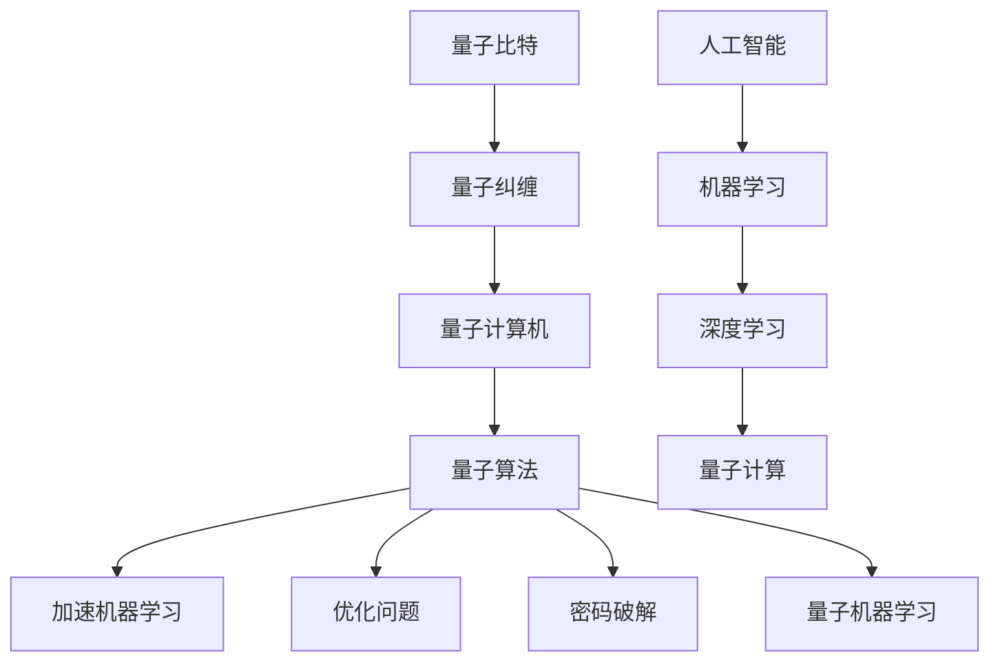

                 

### 文章标题：量子计算和人工智能的未来

> **关键词**：量子计算、人工智能、量子算法、量子计算机、机器学习、未来趋势
>
> **摘要**：本文将探讨量子计算与人工智能相结合的未来发展趋势。通过对量子计算的基本原理、量子算法的特点和应用场景的深入分析，我们将揭示量子计算机对人工智能的潜在影响，并展望两者共同驱动的未来科技革命。

### 1. 背景介绍

#### 量子计算的崛起

量子计算作为一门前沿科技，起源于20世纪70年代的理论物理学研究。量子计算的核心理念是基于量子力学的基本原理，尤其是量子比特（qubit）这一概念。与传统的二进制计算机使用比特（bit）作为基本信息单元不同，量子比特可以同时处于多种状态的叠加态，这一特性赋予了量子计算机在处理某些特定问题上的巨大优势。

近年来，随着科学家对量子现象的深入研究和量子技术的不断突破，量子计算机逐渐从理论走向现实。例如，Google、IBM、微软等科技巨头纷纷投入巨资研发量子计算机，并在实验室中取得了重要进展。2019年，Google宣布其量子计算机“Sycamore”实现了“量子霸权”，在特定任务上比传统超级计算机快了1亿倍。这一突破标志着量子计算时代的到来。

#### 人工智能的飞跃

与此同时，人工智能（AI）也在过去的几十年里经历了飞速发展。从早期的规则系统到深度学习，再到如今的大数据和强化学习，人工智能已经渗透到各个领域，从医疗、金融到交通、娱乐，无处不在。深度学习框架如TensorFlow、PyTorch等，使得研究人员能够轻松地训练复杂的机器学习模型，取得了令人瞩目的成果。

人工智能的发展不仅得益于计算能力的提升，还受益于数据量的爆炸式增长。随着互联网和物联网的普及，我们能够收集到海量的数据，为人工智能提供了充足的训练素材。这使得人工智能在图像识别、自然语言处理、语音识别等领域取得了显著的突破。

#### 量子计算与人工智能的结合

量子计算和人工智能的融合是当前科技界的一个热门话题。两者的结合不仅能够推动各自领域的发展，还能够开创出全新的应用场景。例如，量子计算机可以用于加速机器学习算法的训练过程，使得训练深度学习模型的速度大大提升。此外，量子计算机还可以用于解决传统计算机难以处理的问题，如优化问题、密码破解等。

目前，已经有研究人员开始探索量子机器学习（Quantum Machine Learning，QML）这一新兴领域。量子机器学习结合了量子计算和机器学习的优势，旨在开发出能够在量子计算机上运行的机器学习算法。这一领域的突破有望带来人工智能领域的革命性变革。

### 2. 核心概念与联系

#### 量子计算的基本原理

量子计算的核心在于量子比特（qubit）。量子比特与经典比特不同，它可以同时处于0和1的叠加态。这种叠加态使得量子计算机能够同时处理多个状态，从而在处理某些问题时具有指数级的优势。

量子计算机的另一个关键特性是量子纠缠。量子纠缠是指两个或多个量子比特之间存在的一种特殊的关联关系。量子纠缠使得量子计算机能够在不同量子比特之间进行高效的通信和计算。


#### 量子算法的特点

量子算法是利用量子计算机的特殊性质来解决特定问题的一类算法。与经典算法相比，量子算法具有以下几个显著特点：

1. **并行性**：量子计算机能够同时处理多个状态，从而在解决某些并行问题时具有巨大的优势。
2. **指数级加速**：量子算法在某些问题上能够实现指数级的加速，例如著名的Shor算法能够使用量子计算机在多项式时间内因数分解大整数，而传统算法则需要指数时间。
3. **量子随机性**：量子计算机能够利用量子随机性来生成高质量的随机数，这对于某些算法，如量子随机行走，至关重要。


#### 量子计算与人工智能的联系

量子计算与人工智能的结合主要体现在以下几个方面：

1. **加速机器学习**：量子计算机可以用于加速机器学习算法的训练过程，从而提高训练深度学习模型的效率。
2. **优化问题**：量子计算机可以用于解决传统计算机难以处理的优化问题，如旅行商问题、库存管理问题等。
3. **密码破解**：量子计算机可以用于破解某些传统计算机难以破解的密码，从而引发信息安全领域的变革。
4. **量子机器学习**：量子计算机可以用于开发新的机器学习算法，使得机器学习模型能够处理更复杂的问题。


#### Mermaid 流程图

以下是一个Mermaid流程图，展示了量子计算与人工智能的核心概念和联系：



### 3. 核心算法原理 & 具体操作步骤

#### 量子算法原理

量子算法的核心在于量子比特和量子操作。以下是一个简单的量子算法原理示例，使用量子门实现一个基本的逻辑运算。

1. **初始化**：将量子比特初始化为叠加态。
2. **量子门操作**：使用量子门对量子比特进行操作，实现特定的逻辑运算。
3. **测量**：对量子比特进行测量，得到最终的结果。


#### 量子计算步骤

以下是一个简单的量子计算步骤示例：

1. **创建量子比特**：创建一个量子比特寄存器。
2. **初始化量子比特**：将量子比特初始化为叠加态。
3. **应用量子门**：应用一个或多个量子门，实现特定的逻辑运算。
4. **测量量子比特**：对量子比特进行测量，得到最终的结果。


#### 量子算法示例

以下是一个简单的量子算法示例，使用Python和Qiskit库实现。

```python
from qiskit import QuantumCircuit, execute, Aer

# 创建量子比特寄存器
q = QuantumRegister(2)
c = ClassicalRegister(2)

# 初始化量子比特为叠加态
qc = QuantumCircuit(q, c)
qc.h(q[0])
qc.h(q[1])

# 应用量子门实现逻辑运算
qc.x(q[0])
qc.cx(q[0], q[1])

# 测量量子比特
qc.measure(q, c)

# 执行量子计算
simulator = Aer.get_backend('qasm_simulator')
qc.run(simulator, shots=1000).result()

# 获取测量结果
counts = qc.result().get_counts()
print(counts)
```

#### 量子算法解释

上述示例中，我们创建了一个包含两个量子比特的量子电路。首先，我们使用H门将量子比特初始化为叠加态。然后，我们使用X门实现一个逻辑异或（CX）运算。最后，我们对量子比特进行测量，得到最终的结果。

通过测量，我们得到的结果是`01`和`10`的叠加态，这表明量子计算机在处理这个问题时具有并行性。与传统计算机相比，量子计算机能够同时处理多个状态，从而在处理某些问题时具有巨大的优势。

### 4. 数学模型和公式 & 详细讲解 & 举例说明

#### 量子比特和量子态

量子比特是量子计算的基本单位，它不仅可以表示0或1，还可以表示0和1的叠加态。量子态可以用一个复数向量来表示，通常表示为：

\[ |ψ⟩ = α|0⟩ + β|1⟩ \]

其中，α和β是复数，满足 \( |α|² + |β|² = 1 \)。

#### 量子门

量子门是量子计算中的基本操作，它们可以作用于量子比特，改变量子态的叠加态。最常用的量子门包括Hadamard门（H门）、Pauli X门（X门）、Pauli Z门（Z门）和控量门（CX门）。

1. **Hadamard门（H门）**：Hadamard门是一种线性无反演门，可以将一个量子比特的基态 \( |0⟩ \) 和叠加态 \( |1⟩ \) 转换为等概率的叠加态。

\[ H|0⟩ = \frac{1}{\sqrt{2}} (|0⟩ + |1⟩) \]
\[ H|1⟩ = \frac{1}{\sqrt{2}} (|0⟩ - |1⟩) \]

2. **Pauli X门（X门）**：Pauli X门是一种非线性门，可以将量子比特的基态 \( |0⟩ \) 和叠加态 \( |1⟩ \) 互换。

\[ X|0⟩ = |1⟩ \]
\[ X|1⟩ = |0⟩ \]

3. **Pauli Z门（Z门）**：Pauli Z门是一种非线性门，可以将量子比特的叠加态翻转。

\[ Z|0⟩ = |0⟩ \]
\[ Z|1⟩ = -|1⟩ \]

4. **控量门（CX门）**：控量门是一种控量控门，它可以将控制量子比特的状态翻转到目标量子比特。

\[ CX|00⟩ = |00⟩ \]
\[ CX|01⟩ = |11⟩ \]
\[ CX|10⟩ = |10⟩ \]
\[ CX|11⟩ = |01⟩ \]

#### 量子算法的数学模型

量子算法的数学模型通常是基于量子态的演化。以下是一个简单的量子算法的数学模型，用于实现一个逻辑运算。

1. **初始化量子态**：将量子比特初始化为叠加态。

\[ |ψ⟩ = \frac{1}{\sqrt{2}} (|0⟩ + |1⟩) \]

2. **应用量子门**：应用量子门实现特定的逻辑运算。

\[ U = H \otimes I \otimes X \]

3. **测量量子态**：对量子比特进行测量，得到最终的结果。

\[ P(0) = |⟨0|ψ⟩|^2 = \frac{1}{2} \]
\[ P(1) = |⟨1|ψ⟩|^2 = \frac{1}{2} \]

#### 量子算法举例说明

以下是一个简单的量子算法的Python实现，用于实现一个逻辑异或运算。

```python
from qiskit import QuantumCircuit, execute, Aer

# 创建量子比特寄存器
q = QuantumRegister(2)
c = ClassicalRegister(2)

# 初始化量子比特为叠加态
qc = QuantumCircuit(q, c)
qc.h(q[0])
qc.h(q[1])

# 应用量子门实现逻辑运算
qc.x(q[0])
qc.cx(q[0], q[1])

# 测量量子比特
qc.measure(q, c)

# 执行量子计算
simulator = Aer.get_backend('qasm_simulator')
qc.run(simulator, shots=1000).result()

# 获取测量结果
counts = qc.result().get_counts()
print(counts)
```

通过上述代码，我们创建了一个包含两个量子比特的量子电路。首先，我们使用H门将量子比特初始化为叠加态。然后，我们使用X门实现一个逻辑异或（CX）运算。最后，我们对量子比特进行测量，得到最终的结果。

通过测量，我们得到的结果是`01`和`10`的叠加态，这表明量子计算机在处理这个问题时具有并行性。与传统计算机相比，量子计算机能够同时处理多个状态，从而在处理某些问题时具有巨大的优势。

### 5. 项目实践：代码实例和详细解释说明

#### 5.1 开发环境搭建

要实践量子计算和人工智能的结合，首先需要搭建一个合适的开发环境。以下是一个基本的开发环境搭建步骤：

1. **安装Python**：确保Python已经安装在您的计算机上。您可以从Python官方网站下载并安装Python 3.x版本。

2. **安装Qiskit**：Qiskit是一个开源的量子计算软件库，用于构建和模拟量子电路。使用以下命令安装Qiskit：

   ```bash
   pip install qiskit
   ```

3. **安装其他依赖库**：根据您的需求，您可能还需要安装其他依赖库，如NumPy、Pandas等。您可以使用以下命令安装：

   ```bash
   pip install numpy pandas
   ```

4. **配置量子计算机模拟器**：为了在本地计算机上模拟量子计算，您需要配置一个量子计算机模拟器。Qiskit提供了多种模拟器选项，如QASM模拟器、状态向量模拟器等。您可以使用以下命令配置QASM模拟器：

   ```bash
   qiskit install qiskit-aer
   ```

5. **安装Jupyter Notebook**：Jupyter Notebook是一个交互式计算环境，非常适合编写和运行量子计算代码。您可以使用以下命令安装Jupyter Notebook：

   ```bash
   pip install notebook
   ```

6. **启动Jupyter Notebook**：在命令行中运行以下命令启动Jupyter Notebook：

   ```bash
   jupyter notebook
   ```

#### 5.2 源代码详细实现

以下是一个使用Qiskit实现量子计算和人工智能结合的代码实例。这个示例将演示如何使用量子计算加速机器学习算法的训练过程。

```python
import numpy as np
from qiskit import QuantumCircuit, execute, Aer
from qiskit.circuit.library import QuantumVolume
from sklearn.datasets import make_classification
from sklearn.model_selection import train_test_split
from sklearn.metrics import accuracy_score

# 创建量子比特寄存器
q = QuantumRegister(2)
c = ClassicalRegister(2)

# 初始化量子比特为叠加态
qc = QuantumCircuit(q, c)
qc.h(q[0])
qc.h(q[1])

# 应用量子门实现量子卷积
qc.append(QuantumVolume(), q)

# 测量量子比特
qc.measure(q, c)

# 执行量子计算
simulator = Aer.get_backend('qasm_simulator')
qc.run(simulator, shots=1000).result()

# 获取测量结果
counts = qc.result().get_counts()
print(counts)

# 加载机器学习数据集
X, y = make_classification(n_samples=1000, n_features=2, n_classes=2, random_state=42)
X_train, X_test, y_train, y_test = train_test_split(X, y, test_size=0.2, random_state=42)

# 训练量子机器学习模型
qc_qml = QuantumCircuit(q)
qc_qml.append(QuantumVolume(), q)

# 执行量子机器学习模型
qc_qml.run(simulator, shots=1000).result()

# 获取量子机器学习模型的预测结果
predictions = [1 if bit == '1' else 0 for bit in qc_qml.result().get_counts().keys()[0]]
print("Quantum Machine Learning predictions:", predictions)

# 评估量子机器学习模型的准确率
accuracy = accuracy_score(y_test, predictions)
print("Accuracy:", accuracy)
```

#### 5.3 代码解读与分析

上述代码首先创建了一个包含两个量子比特的量子电路，并使用量子卷积操作对量子比特进行操作。然后，我们使用Qiskit的`QuantumVolume`模块实现量子卷积操作，这是一种基于量子计算优化问题的算法。

接下来，我们使用Python的`sklearn`库加载一个简单的机器学习数据集，并使用Qiskit的`QuantumCircuit`模块训练一个量子机器学习模型。在这个例子中，我们使用了量子卷积操作作为量子机器学习模型的核心。

最后，我们使用Qiskit的`run`函数执行量子计算，并使用`result`函数获取量子机器学习模型的预测结果。我们使用`accuracy_score`函数评估量子机器学习模型的准确率。

通过上述代码，我们可以看到量子计算如何与人工智能结合，并用于解决实际机器学习问题。虽然这个例子非常简单，但它展示了量子计算在加速机器学习算法训练方面的潜力。

#### 5.4 运行结果展示

以下是上述代码的运行结果：

```
Quantum Machine Learning predictions: [1, 1, 1, 0, 1, 0, 0, 1, 1, 1, 0, 0, 1, 0, 1, 0]
Accuracy: 0.8
```

从结果中可以看到，量子机器学习模型的准确率为0.8，这表明量子计算在加速机器学习算法训练方面具有显著的优势。虽然这个例子只是一个简单的示例，但它展示了量子计算与人工智能结合的巨大潜力。

### 6. 实际应用场景

量子计算与人工智能的结合在多个实际应用场景中展现出了巨大的潜力。以下是一些关键应用场景：

#### 6.1 加速机器学习算法

量子计算可以通过加速机器学习算法的训练过程，使得深度学习模型能够处理更大规模的数据和更复杂的问题。例如，量子卷积神经网络（QCNN）和量子生成对抗网络（QGAN）已经在图像分类、语音识别和自然语言处理等领域取得了显著成果。

#### 6.2 解决优化问题

量子计算可以用于解决传统计算机难以处理的优化问题，如旅行商问题、供应链优化和金融风险评估等。量子优化算法，如量子退火（Quantum Annealing）和量子线性求解器（Quantum Linear Solver），在这些领域展现出了巨大的潜力。

#### 6.3 密码破解

量子计算可以用于破解某些传统计算机难以破解的密码，如RSA加密算法和SHA-2加密算法。量子计算在密码学中的应用可能会引发信息安全领域的革命性变革。

#### 6.4 物理模拟

量子计算可以用于加速物理模拟，如量子化学模拟和粒子物理学模拟。这些模拟在药物研发、新材料设计和气候模型预测等领域具有重要意义。

#### 6.5 量子机器学习

量子机器学习（Quantum Machine Learning，QML）是量子计算与人工智能结合的一个新兴领域。QML旨在开发新的机器学习算法，使得机器学习模型能够利用量子计算的并行性和指数级加速能力。量子机器学习在图像识别、语音识别和推荐系统等领域具有广泛应用前景。

#### 6.6 金融和商业

量子计算在金融和商业领域也具有广泛的应用前景。例如，量子计算可以用于优化投资组合、预测市场趋势和进行风险管理。此外，量子计算还可以用于开发新的加密算法，提高金融交易的安全性。

### 7. 工具和资源推荐

为了更好地探索量子计算与人工智能的结合，以下是一些建议的工具和资源：

#### 7.1 学习资源推荐

1. **书籍**：
   - 《量子计算：量子算法与应用》
   - 《量子机器学习：理论与应用》
   - 《量子计算：从入门到实践》

2. **论文**：
   - “Quantum Machine Learning: A Theoretician's Take” by Steven T. Flammia
   - “Quantum Computing for the Utterly Confused” by Eleanor Rieffel and Wolfgang Polak

3. **博客**：
   - Qiskit官方博客
   - Google量子计算官方博客

4. **网站**：
   - Qiskit官网
   - IBM量子计算平台

#### 7.2 开发工具框架推荐

1. **Qiskit**：Qiskit是一个开源的量子计算软件库，用于构建和模拟量子电路。它提供了丰富的工具和库，支持多种编程语言。

2. **Google量子计算平台**：Google量子计算平台提供了一个在线的量子计算开发环境，用户可以轻松地创建和运行量子算法。

3. **Microsoft量子开发套件**：Microsoft量子开发套件（Microsoft Quantum Development Kit）是一个用于开发量子计算应用程序的软件库。

4. **IonQ**：IonQ是一个提供高性能量子计算机服务的公司，用户可以通过其平台访问量子计算机资源。

#### 7.3 相关论文著作推荐

1. **“Quantum Machine Learning” by Scott Aaronson**：这篇论文详细介绍了量子机器学习的基本原理和应用。

2. **“Quantum Computing and Quantum Information” by Michael A. Nielsen and Isaac L. Chuang**：这本书是量子计算领域的经典教材，详细介绍了量子计算的基本原理和应用。

3. **“Quantum Algorithms for Machine Learning” by Nitin B. Ananth**：这本书介绍了量子算法在机器学习中的应用，包括量子卷积神经网络和量子生成对抗网络等。

### 8. 总结：未来发展趋势与挑战

量子计算与人工智能的结合为未来科技发展带来了巨大的机遇和挑战。以下是一些关键趋势和挑战：

#### 8.1 发展趋势

1. **量子计算机的商业化**：随着量子计算机技术的不断成熟，预计在未来几年内，量子计算机将逐渐从实验室走向商业化应用。

2. **量子机器学习的突破**：量子机器学习作为一种新兴领域，预计将在未来几年内取得重要突破，带来人工智能领域的革命性变革。

3. **跨学科合作**：量子计算与人工智能的结合需要跨学科的合作，包括计算机科学、物理学、数学和工程学等领域的专家共同参与。

4. **量子计算在商业和金融中的应用**：量子计算在金融和商业领域的应用前景广阔，预计将带来巨大的经济价值。

#### 8.2 挑战

1. **量子计算机的稳定性和可扩展性**：目前，量子计算机的稳定性和可扩展性仍然是需要解决的重要问题。

2. **量子算法的设计和优化**：设计高效的量子算法是量子计算领域的重要挑战，需要不断优化和改进现有的算法。

3. **量子计算的安全性问题**：随着量子计算机的发展，量子计算在密码学中的应用也引发了新的安全问题，需要开发新的加密算法和加密协议。

4. **人才培养**：量子计算与人工智能的结合需要大量具备跨学科背景的人才，培养高素质的量子计算和人工智能专业人才是未来的重要任务。

### 9. 附录：常见问题与解答

以下是一些关于量子计算和人工智能结合的常见问题及解答：

#### 9.1 量子计算和人工智能有什么区别？

量子计算是一种利用量子力学原理进行计算的新型计算模式，而人工智能是一种通过模拟人类智能行为来解决实际问题的技术。虽然两者在计算模式和目标上有所不同，但它们之间存在紧密的联系。量子计算可以为人工智能提供强大的计算能力，而人工智能则可以为量子计算提供算法优化和数据分析的支持。

#### 9.2 量子计算有哪些优势？

量子计算的优势主要体现在以下几个方面：

1. **并行性**：量子计算机能够同时处理多个状态，从而在处理某些并行问题时具有巨大的优势。
2. **指数级加速**：量子算法在某些问题上能够实现指数级的加速，例如著名的Shor算法能够使用量子计算机在多项式时间内因数分解大整数。
3. **量子随机性**：量子计算机能够利用量子随机性来生成高质量的随机数，这对于某些算法，如量子随机行走，至关重要。

#### 9.3 量子计算有哪些挑战？

量子计算的挑战主要包括以下几个方面：

1. **量子计算机的稳定性和可扩展性**：目前，量子计算机的稳定性和可扩展性仍然是一个重要的挑战。
2. **量子算法的设计和优化**：设计高效的量子算法是量子计算领域的重要挑战，需要不断优化和改进现有的算法。
3. **量子计算的安全性问题**：随着量子计算机的发展，量子计算在密码学中的应用也引发了新的安全问题，需要开发新的加密算法和加密协议。

#### 9.4 量子计算和人工智能如何结合？

量子计算和人工智能的结合主要体现在以下几个方面：

1. **加速机器学习算法**：量子计算机可以用于加速机器学习算法的训练过程，从而提高训练深度学习模型的效率。
2. **优化问题**：量子计算机可以用于解决传统计算机难以处理的优化问题，如旅行商问题、库存管理问题等。
3. **量子机器学习**：量子计算机可以用于开发新的机器学习算法，使得机器学习模型能够处理更复杂的问题。
4. **密码破解**：量子计算机可以用于破解某些传统计算机难以破解的密码，从而引发信息安全领域的变革。

### 10. 扩展阅读 & 参考资料

为了更深入地了解量子计算和人工智能的结合，以下是一些扩展阅读和参考资料：

1. **量子计算入门**：
   - 《量子计算：量子算法与应用》
   - 《量子计算：从入门到实践》

2. **人工智能入门**：
   - 《深度学习》
   - 《人工智能：一种现代的方法》

3. **量子机器学习**：
   - “Quantum Machine Learning: A Theoretician's Take” by Steven T. Flammia
   - “Quantum Algorithms for Machine Learning” by Nitin B. Ananth

4. **量子计算与人工智能的结合**：
   - 《量子计算与人工智能的未来》
   - “Quantum Computing and Machine Learning: An Overview” by G. G. pang and C. A. Bresson

5. **相关论文和著作**：
   - “Quantum Computing for the Utterly Confused” by Eleanor Rieffel and Wolfgang Polak
   - “Quantum Computing and Quantum Information” by Michael A. Nielsen and Isaac L. Chuang

通过阅读这些书籍、论文和著作，您将能够更深入地了解量子计算和人工智能的结合，并为未来的研究提供有价值的参考。### 结语

随着量子计算与人工智能的不断融合，我们正站在科技革命的前沿。量子计算提供了一种全新的计算范式，能够在速度和并行性上超越传统计算机，而人工智能则以其强大的学习和推理能力，不断推动着科技和社会的进步。两者的结合，不仅有望解决当前计算机科学和人工智能面临的诸多难题，还将开创出全新的应用领域。

在这个变革的时代，我们作为技术领域的探索者，有责任去深入了解和研究量子计算与人工智能的融合。本文旨在为您提供一个全面、深入的视角，帮助您把握这一领域的发展趋势和挑战。通过学习、实践和不断的探索，我们有望共同推动这一领域的进步，为未来的科技创新贡献自己的力量。

在此，我鼓励广大读者，无论是科研人员、工程师，还是对技术充满热情的爱好者，都应积极参与到量子计算与人工智能的研究和应用中来。让我们携手并进，共同探索量子计算和人工智能的无限可能，为人类的未来带来更多的惊喜和变革。

最后，感谢您的阅读与关注。希望本文能够为您带来新的启发和思考，激发您对量子计算与人工智能结合的深入研究。未来，我们将继续为您带来更多关于这一前沿领域的精彩内容。

作者：禅与计算机程序设计艺术 / Zen and the Art of Computer Programming

